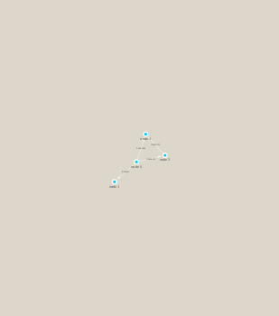

```{r setup, include=FALSE}
knitr::opts_chunk$set(echo = TRUE)
```

```{r install, eval = FALSE}
    install.packages("BiocManager")
```

```{r}
library(RCy3)
library(igraph)
```

```{r}
library(RColorBrewer)

```

```{r}
cytoscapePing()
cytoscapeVersionInfo()

```

```{r}
g <- makeSimpleIgraph()
createNetworkFromIgraph(g,"myGraph")
```

```{r}
fig <- exportImage(filename="demo", type="png", height=350)

```


```{r}


```

```{r}
setVisualStyle("Marquee")
fig <- exportImage(filename="demo_marquee", type="png", height=350)


```

```{r}
prok_vir_cor <- read.delim("virus_prok_cor_abundant.tsv", stringsAsFactors = FALSE)

## have a peak at the first 6 rows
head(prok_vir_cor)
```

Use the igraph function **graph.data.frame()** to make a network graph
```{r}
g <- graph.data.frame(prok_vir_cor, directed = FALSE)

```

```{r}
plot(g)
```

Turn the node (vertex) labels off in this plot
```{r}
plot(g, vertex.size = 3, vertex.label = NA)
```


```{r}
cb <- cluster_edge_betweenness(g)

```
```{r}
plot(cb, y=g, vertex.label=NA,  vertex.size=3)

```

```{r}
# Calculate and plot node degree of our network
d <- degree(g)
hist(d, breaks=30, col="lightblue", main ="Node Degree Distribution")
```


```{r}
pr <- page_rank(g)
head(pr$vector)
```

```{r}
phage_id_affiliation <- read.delim("prok_tax_from_silva.tsv", stringsAsFactors = FALSE)
head(phage_id_affiliation)

```


