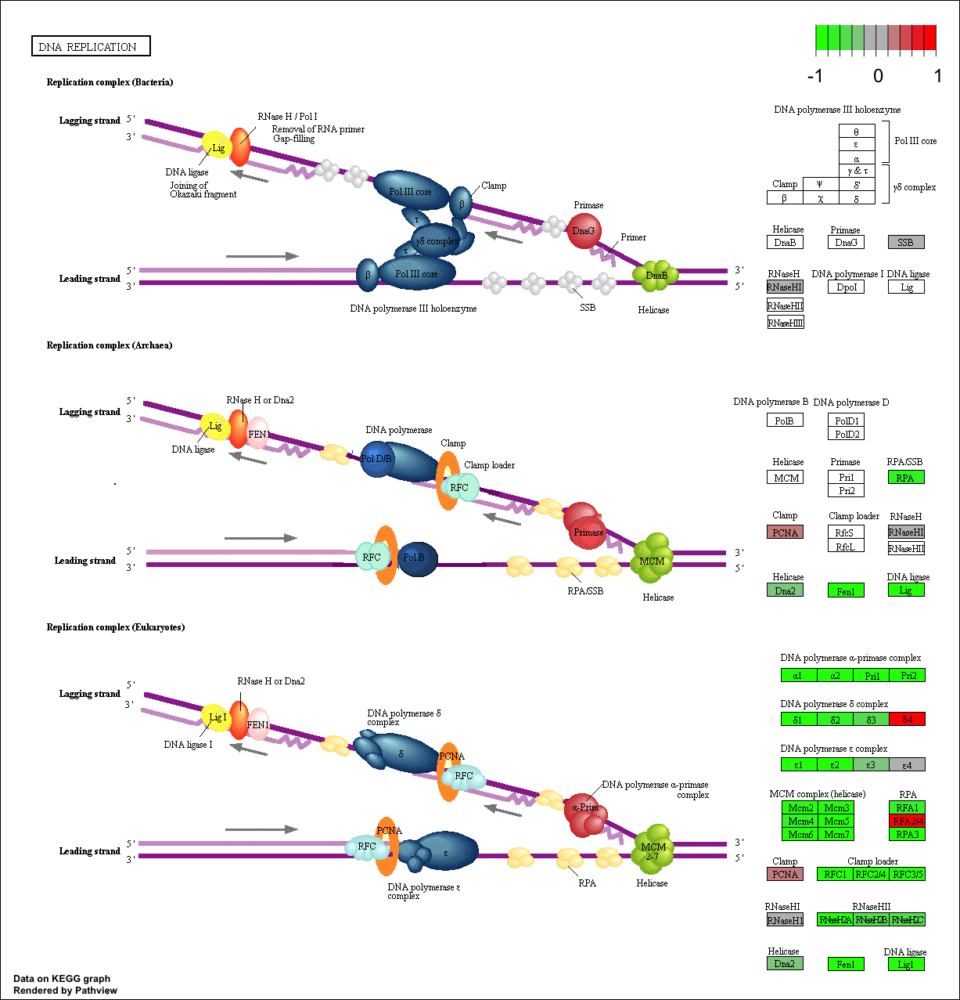

Class 15: Pathway Analysis from RNA-Seq Results
================

``` r
library(DESeq2)
```

    ## Loading required package: S4Vectors

    ## Loading required package: stats4

    ## Loading required package: BiocGenerics

    ## Loading required package: parallel

    ## 
    ## Attaching package: 'BiocGenerics'

    ## The following objects are masked from 'package:parallel':
    ## 
    ##     clusterApply, clusterApplyLB, clusterCall, clusterEvalQ,
    ##     clusterExport, clusterMap, parApply, parCapply, parLapply,
    ##     parLapplyLB, parRapply, parSapply, parSapplyLB

    ## The following objects are masked from 'package:stats':
    ## 
    ##     IQR, mad, sd, var, xtabs

    ## The following objects are masked from 'package:base':
    ## 
    ##     anyDuplicated, append, as.data.frame, basename, cbind,
    ##     colMeans, colnames, colSums, dirname, do.call, duplicated,
    ##     eval, evalq, Filter, Find, get, grep, grepl, intersect,
    ##     is.unsorted, lapply, lengths, Map, mapply, match, mget, order,
    ##     paste, pmax, pmax.int, pmin, pmin.int, Position, rank, rbind,
    ##     Reduce, rowMeans, rownames, rowSums, sapply, setdiff, sort,
    ##     table, tapply, union, unique, unsplit, which, which.max,
    ##     which.min

    ## 
    ## Attaching package: 'S4Vectors'

    ## The following object is masked from 'package:base':
    ## 
    ##     expand.grid

    ## Loading required package: IRanges

    ## Loading required package: GenomicRanges

    ## Loading required package: GenomeInfoDb

    ## Loading required package: SummarizedExperiment

    ## Loading required package: Biobase

    ## Welcome to Bioconductor
    ## 
    ##     Vignettes contain introductory material; view with
    ##     'browseVignettes()'. To cite Bioconductor, see
    ##     'citation("Biobase")', and for packages 'citation("pkgname")'.

    ## Loading required package: DelayedArray

    ## Loading required package: matrixStats

    ## 
    ## Attaching package: 'matrixStats'

    ## The following objects are masked from 'package:Biobase':
    ## 
    ##     anyMissing, rowMedians

    ## Loading required package: BiocParallel

    ## 
    ## Attaching package: 'DelayedArray'

    ## The following objects are masked from 'package:matrixStats':
    ## 
    ##     colMaxs, colMins, colRanges, rowMaxs, rowMins, rowRanges

    ## The following objects are masked from 'package:base':
    ## 
    ##     aperm, apply

RNA-seq analysis
----------------

The data for hands-on

``` r
metaFile <- "GSE37704_metadata.csv"
countFile <- "GSE37704_featurecounts.csv"

#import metadata
colData = read.csv(metaFile, row.names=1)
colData
```

    ##               condition
    ## SRR493366 control_sirna
    ## SRR493367 control_sirna
    ## SRR493368 control_sirna
    ## SRR493369      hoxa1_kd
    ## SRR493370      hoxa1_kd
    ## SRR493371      hoxa1_kd

``` r
countData= read.csv(countFile, row.names = 1)
countData
```

    ##                 length SRR493366 SRR493367 SRR493368 SRR493369 SRR493370
    ## ENSG00000186092    918         0         0         0         0         0
    ## ENSG00000279928    718         0         0         0         0         0
    ## ENSG00000279457   1982        23        28        29        29        28
    ## ENSG00000278566    939         0         0         0         0         0
    ## ENSG00000273547    939         0         0         0         0         0
    ## ENSG00000187634   3214       124       123       205       207       212
    ## ENSG00000188976   5539      1637      1831      2383      1226      1326
    ## ENSG00000187961   3395       120       153       180       236       255
    ## ENSG00000187583   2833        24        48        65        44        48
    ## ENSG00000187642   3424         4         9        16        14        16
    ## ENSG00000188290   1118        31        34        57       172       172
    ## ENSG00000187608    942       244       289       386       373       422
    ## ENSG00000188157  10758      6547      6758      9367      9853     10483
    ## ENSG00000237330   1902         0         0         0         0         1
    ## ENSG00000131591   6322       115       135       169       143       174
    ## ENSG00000162571   3943         0         0         0         0         0
    ## ENSG00000186891   1370         2         0         0         0         2
    ## ENSG00000186827   1721         0         0         1         1         2
    ## ENSG00000078808   4709      3355      3427      4634      4963      5313
    ## ENSG00000176022   2777       555       744       925       950      1059
    ## ENSG00000184163   1794         4         5         2         6         3
    ## ENSG00000160087   4712       805       943      1261      1300      1439
    ## ENSG00000162572   4025        18        17        32        36        45
    ## ENSG00000131584   8809       654       794      1010      1198      1279
    ## ENSG00000169972   2489       186       209       233       225       244
    ## ENSG00000127054   8220       833       852      1144       867       844
    ## ENSG00000224051   2556       244       292       393       264       272
    ## ENSG00000169962   3433         4         4         9         3         6
    ## ENSG00000107404   3814       829       926      1255       891       983
    ## ENSG00000162576   3622      3604      3957      5289      6006      6638
    ## ENSG00000175756   1669       824       929      1210      1084      1088
    ## ENSG00000221978   6850       943       966      1346      1466      1685
    ## ENSG00000242485   2788       544       665       774       621       662
    ## ENSG00000235098   2644         0         1         3         1         2
    ## ENSG00000205116    492         0         0         0         0         0
    ## ENSG00000179403   5065        98        84       109       113       117
    ## ENSG00000215915   3976         1         0         0         1         1
    ## ENSG00000160072   7682       384       508       662       279       337
    ## ENSG00000197785   3069       634       832      1041       513       543
    ## ENSG00000205090   1380        34        30        30        53        39
    ## ENSG00000160075   6925      1422      1679      2153      1805      1960
    ## ENSG00000279244    276         0         0         0         0         0
    ## ENSG00000228594   2085       120       147       181       197       223
    ## ENSG00000197530   8767       529       556       753       802       882
    ## ENSG00000189409   2714         3         3         1         2         3
    ## ENSG00000248333   3811       398       418       511       464       509
    ## ENSG00000189339   8395      1028      1090      1414      2166      2276
    ## ENSG00000008128   4701         9        14         8        15        12
    ## ENSG00000215790   3264        21        22        32        57        57
    ## ENSG00000008130   5570       749       841      1143       887      1032
    ## ENSG00000078369   6417      7584      8990     11589      9445     10677
    ## ENSG00000169885   2321         0         1         1         1         4
    ## ENSG00000178821   1594         2         2         5         1         3
    ## ENSG00000142609  10422         0         0         0         0         0
    ## ENSG00000187730   1928         0         0         0         0         0
    ## ENSG00000067606   7636        19        17        45        42        40
    ## ENSG00000162585  10916       472       550       701       691       737
    ## ENSG00000157933   6080      1648      2062      2658      1274      1450
    ## ENSG00000116151  11337        26        52        51        37        48
    ## ENSG00000157916   5691      1744      1887      2362      2144      2240
    ## ENSG00000157911   3789       185       194       269       177       182
    ## ENSG00000149527  10781        30        32        41        21        22
    ## ENSG00000157881   5107       373       391       527       391       432
    ## ENSG00000197921   1306         0         0         0         0         0
    ## ENSG00000157873   6219        12        12        18        29        46
    ## ENSG00000157870   3371       442       522       643       205       222
    ## ENSG00000142606   3844         0         0         1         0         0
    ## ENSG00000215912   5900         2         2         0         3         3
    ## ENSG00000169717   1421         0         0         0         0         0
    ## ENSG00000142611   9767         2         5         3         8         3
    ## ENSG00000130762   5563         0         0         1         2         1
    ## ENSG00000162591   7039        84        92       139       125       142
    ## ENSG00000158109   2414      1298      1549      1825      1956      2135
    ## ENSG00000116213   7604       157       161       218       189       192
    ## ENSG00000078900   6763         3         0         1         0         1
    ## ENSG00000162592   2318         0         0         3         1         0
    ## ENSG00000235169    954         7         7        13         7         5
    ## ENSG00000130764   4516       613       692       848       538       558
    ## ENSG00000116198   7876       605       695       871       972       985
    ## ENSG00000169598   3870        99        98       118        82        92
    ## ENSG00000198912   4388       225       264       319       246       280
    ## ENSG00000196581  12405         2         0         6         3         1
    ## ENSG00000131697  13167       133       143       201       293       270
    ## ENSG00000069424   9534        98        97       158       138       180
    ## ENSG00000116254   9890         3         2         3         8         6
    ## ENSG00000116251   4900      2638      2993      3542      2928      3363
    ## ENSG00000158286   6585        13        21        30        10        16
    ## ENSG00000116237   4910      2128      2391      3047      1950      2106
    ## ENSG00000173673    697         0         0         0         0         0
    ## ENSG00000158292   4082       150       158       227       167       207
    ## ENSG00000097021   4124      1113      1242      1744      1049      1196
    ## ENSG00000069812   5407         1         1         0         4         7
    ## ENSG00000187017   4651         0         1         0         0         2
    ## ENSG00000215788   3918        30        30        31        69        77
    ## ENSG00000171680   6920       233       278       371       501       549
    ## ENSG00000162408   7293       340       434       499       289       270
    ## ENSG00000173662   2892         0         0         1         0         0
    ## ENSG00000204859   4503        94        82       141       117       133
    ## ENSG00000162413   6901      1203      1347      1818      2641      2503
    ## ENSG00000116273   3681       434       423       560       486       468
    ## ENSG00000041988   4072       125       135       160        97       120
    ## ENSG00000007923   5083       653       729       911       528       568
    ## ENSG00000171735  10033       243       308       344       271       325
    ## ENSG00000049245   2760      1885      2285      2781      1452      1604
    ## ENSG00000049246   8099       143       136       170       126       123
    ## ENSG00000049247   1791         0         0         1         1         0
    ## ENSG00000049249   6331         5         3         3         1         0
    ## ENSG00000116288   2397      2035      2304      2878      1917      2127
    ## ENSG00000116285   4186      2398      3031      3727      1352      2012
    ## ENSG00000162426   2888        52        57        88        64        69
    ## ENSG00000142599  11503      1494      1592      2084      1093      1100
    ## ENSG00000074800   3958     21088     23907     30606      9719     11297
    ## ENSG00000131686   2662         0         0         1         0         0
    ## ENSG00000197241   1539         0         0         0         0         0
    ## ENSG00000142583   6693         1         0         0         0         2
    ## ENSG00000180758   5372       141       156       195        93        93
    ## ENSG00000049239   9321      1497      1716      2066      1255      1429
    ## ENSG00000171621   3403       410       528       662       595       707
    ## ENSG00000171612   3854       135       151       187       138       193
    ## ENSG00000188807   6966       251       292       403       359       349
    ## ENSG00000171608   6332       515       669       881       395       512
    ## ENSG00000171603   5559      3502      3852      5043      3788      4210
    ## ENSG00000280113    649         0         0         0         0         0
    ## ENSG00000178585   3339       294       376       466       318       366
    ## ENSG00000162441   2794       301       349       468       178       211
    ## ENSG00000173614   4610       195       227       278       189       218
    ## ENSG00000162444    861         0         0         0         1         1
    ## ENSG00000130939   9128      1163      1379      1776      2404      2584
    ## ENSG00000054523  17693      1496      1685      2001      1457      1786
    ## ENSG00000142657   2966      3041      3533      4363      3924      4197
    ## ENSG00000251503   2301         2         2         3         3         3
    ## ENSG00000175279   1739         9        16        19        13        18
    ## ENSG00000241563   1130         2         4         3         3         2
    ## ENSG00000160049   6622       762       891      1138       840       816
    ## ENSG00000142655   2995       276       298       344       252       319
    ## ENSG00000130940  11336         5         3         8         4         1
    ## ENSG00000175262   3573         0         0         0         0         0
    ## ENSG00000120948   6071      1066      1221      1531      1030      1130
    ## ENSG00000277726   2205         0         0         1         0         0
    ## ENSG00000009724   4251        12        19        20        11        17
    ## ENSG00000116649   1898      2257      2610      3504      1131      1308
    ## ENSG00000171824   6003       646       782      1065       733       821
    ## ENSG00000198793  12119      1322      1536      1917      1605      1700
    ## ENSG00000171819   2238         1         0         2         0         0
    ## ENSG00000120942   5082       223       284       318       219       246
    ## ENSG00000204624   6142         1         2         0         5         5
    ## ENSG00000116661   2333        21        25        36        62        66
    ## ENSG00000132879   3527       195       188       238       212       209
    ## ENSG00000116663   1811        50        62        92        57        67
    ## ENSG00000116670   3324       254       295       425       260       268
    ## ENSG00000162490   7346         2         3         3        27        18
    ## ENSG00000177674   2435       288       302       392       483       470
    ## ENSG00000215910   6499         0         0         0         0         0
    ## ENSG00000177000  10214       210       218       309       305       320
    ## ENSG00000011021   6938       227       262       311       466       450
    ## ENSG00000175206   1120         0         0         0         1         2
    ## ENSG00000120937    694         2         0         0         2         3
    ## ENSG00000116685   3281      1077      1139      1584      1392      1440
    ## ENSG00000083444   5320      8049      8686     11522     10145     11007
    ## ENSG00000116688   4973      1961      2341      3004      2083      2308
    ## ENSG00000116691   2821       146       143       206        92       129
    ## ENSG00000120949   3738         4         3         6         1         2
    ## ENSG00000028137   3766       268       305       443       206       220
    ## ENSG00000048707  20023       850      1061      1068      1292      1359
    ## ENSG00000162496   3036       109       114       135       338       363
    ## ENSG00000204518   1575         0         0         0         0         0
    ## ENSG00000188984   4049         0         0         0         0         0
    ## ENSG00000157330   4118         0         0         0         0         0
    ## ENSG00000116726   1786         0         0         0         0         0
    ## ENSG00000116721   2439         0         0         0         0         0
    ## ENSG00000239810   1845         0         0         0         0         0
    ## ENSG00000179172   1201         1         3         1         1         0
    ## ENSG00000120952   1642         0         0         0         0         0
    ## ENSG00000243073   1828         0         0         0         0         0
    ## ENSG00000187545   1525         0         0         0         0         0
    ## ENSG00000204510   1660         0         0         0         0         0
    ## ENSG00000232423   2170         0         0         0         0         0
    ## ENSG00000280267   2392         0         0         0         0         0
    ## ENSG00000274764   1927         0         0         0         0         0
    ## ENSG00000229571   2013         0         0         0         0         0
    ## ENSG00000277058   1148         0         0         0         0         1
    ## ENSG00000275774   1148         0         0         1         0         0
    ## ENSG00000179412    882         2         2         0         2         1
    ## ENSG00000204505   1863         0         0         0         0         0
    ## ENSG00000279804   2104         0         0         0         0         0
    ## ENSG00000270601   1720         0         0         0         0         0
    ## ENSG00000182330   1937         0         0         0         0         0
    ## ENSG00000204501   1960         0         0         0         0         0
    ## ENSG00000204481   2301         0         0         0         0         0
    ## ENSG00000204480   1233         0         0         0         0         0
    ## ENSG00000204479   1578         0         0         0         0         0
    ## ENSG00000204478   1597         0         0         0         0         0
    ## ENSG00000162494   2209         0         0         0         0         0
    ## ENSG00000162493   3707        34        27        32        49        65
    ## ENSG00000116731  10923       484       505       634       413       450
    ## ENSG00000189337  12644       240       244       360       186       196
    ## ENSG00000171729   2240       229       305       325       748       695
    ## ENSG00000142621  12805         1         0         1         0         2
    ## ENSG00000142634   2531      1205      1351      1774       604       661
    ## ENSG00000162438   3486         0         0         0         0         1
    ## ENSG00000142615   1519         0         0         0         0         0
    ## ENSG00000215704   1457         0         0         0         0         0
    ## ENSG00000132906   5269        70        76       105       105       100
    ## ENSG00000116138   8563       456       509       620       804       832
    ## ENSG00000116771   2500        11        10        13        14        18
    ## ENSG00000197312  12136       326       411       483       767       871
    ## ENSG00000215695   1854         0         0         0         0         0
    ## ENSG00000116786   4122      1177      1374      1777      1704      1817
    ## ENSG00000162461   3195         1         2         1         5         1
    ## ENSG00000162460   1520         0         0         0         0         0
    ## ENSG00000162458   4716      2391      2703      3460      2591      2912
    ## ENSG00000233954   2180        95       133       125       113       133
    ## ENSG00000065526  13294       786       988      1072       927       912
    ## ENSG00000116809   4240       355       365       461       425       436
    ## ENSG00000183888   3039         0         0         0         0         0
    ## ENSG00000173641   3910        49        39        70        18        21
    ## ENSG00000186510   3476         0         0         0         0         0
    ## ENSG00000184908   2939         2         0         1         0         0
    ## ENSG00000185519   1701        11         8        15         5        13
    ## ENSG00000142627   4159      1544      1736      2254      2531      2754
    ## ENSG00000142632   3745        93        94       127       105       125
    ## ENSG00000132881   1545        44        54        81        79        89
    ## ENSG00000037637   8984       376       440       588       438       562
    ## ENSG00000055070   4747      2008      2454      3066      3681      4127
    ## ENSG00000187144   4506         0         0         0         1         0
    ## ENSG00000157191   5559      1133      1274      1613      1278      1401
    ## ENSG00000268991    510         0         0         0         0         0
    ## ENSG00000219481  12212       302       338       453       314       359
    ## ENSG00000237847    510         0         0         0         0         0
    ## ENSG00000279132    511         0         0         0         0         0
    ## ENSG00000058453   8871       167       222       308       312       361
    ## ENSG00000117122   2915       122       113       140       474       533
    ## ENSG00000159363   5253       622       700       946       908       943
    ## ENSG00000117118   2462       712       810      1034       496       499
    ## ENSG00000117115   5984         0         0         0         0         0
    ## ENSG00000142623   4903         2         1         6         1         1
    ## ENSG00000142619   3189         0         0         0         0         0
    ## ENSG00000159339   2971         0         0         0         0         0
    ## ENSG00000280226    189         0         0         0         0         0
    ## ENSG00000276747   2396         0         0         0         0         0
    ## ENSG00000179051   4126      1118      1281      1613      2249      2370
    ## ENSG00000074964   7817       234       242       316       183       187
    ## ENSG00000117148   1864         0         1         1         0         1
    ## ENSG00000117154   3085         0         0         0         0         0
    ## ENSG00000179023   5145         0         0         0         0         0
    ## ENSG00000009709   6313         0         0         0         0         0
    ## ENSG00000179002   2542         0         0         0         0         0
    ## ENSG00000255275   4369         0         0         0         0         0
    ## ENSG00000159423   3689       146       172       226       218       270
    ## ENSG00000169991   6188       281       313       354       305       352
    ## ENSG00000127481  24675      4629      5261      6394      5585      5913
    ## ENSG00000127463  10650      2522      2688      3537      2067      2306
    ## ENSG00000053372   2822       658       765      1003       484       559
    ## ENSG00000162482   1710         3         3         4         2         4
    ## ENSG00000053371   1781       488       536       698       580       632
    ## ENSG00000040487   2686       225       237       311       407       380
    ## ENSG00000077549   3238      4480      5250      6729      4536      5206
    ## ENSG00000173436   5227       166       185       235       159       178
    ## ENSG00000270136   2493         0         0         0         0         0
    ## ENSG00000158747   3465       168       213       245       156       177
    ## ENSG00000158748   1984         0         1         0         0         0
    ## ENSG00000162542   4054       116       153       214        89       114
    ## ENSG00000178828   1250         0         0         0         0         0
    ## ENSG00000169914   6767       178       239       252       236       255
    ## ENSG00000188784    785         0         0         0         0         0
    ## ENSG00000188257   1685         0         0         0         0         0
    ## ENSG00000127472   2607         0         0         5         2         0
    ## ENSG00000117215   2681         0         0         0         0         0
    ## ENSG00000158786   6440         0         0         0         0         0
    ## ENSG00000187980   3298         0         0         0         0         0
    ## ENSG00000162543   5571         0         0         0         0         0
    ## ENSG00000158816   6377         0         0         0         1         0
    ## ENSG00000162545   2615      1700      2036      2547      1811      1943
    ## ENSG00000090432   2438       487       508       742       622       603
    ## ENSG00000183114   2572         2         0         5         2         3
    ## ENSG00000158825    963        21        25        28         4         0
    ## ENSG00000158828   4836       394       409       556       304       361
    ## ENSG00000244038   2721      3602      3980      5079      4742      5243
    ## ENSG00000117245   4470        94       106       130        44        50
    ## ENSG00000189410   4423       346       391       525       213       266
    ## ENSG00000127483   7442      2140      2694      3185      2755      3299
    ## ENSG00000075151   8535      2473      2900      3632      4436      4758
    ## ENSG00000117298   7265      6816      7555      9939      9514      9984
    ## ENSG00000142794   6812       169       192       212       169       230
    ## ENSG00000162551   3007        38        41        53        19        33
    ## ENSG00000076864   5755         2         1         5         7        11
    ## ENSG00000090686   9497       947      1094      1360      1069      1226
    ## ENSG00000187942   4490         2         4         2         1         4
    ## ENSG00000142798  17666      9722     10493     14631      8262      8640
    ## ENSG00000219073   1541         0         0         0         0         0
    ## ENSG00000142789   1224         0         0         0         0         0
    ## ENSG00000070831   3598      3691      4471      5411      4343      5123
    ## ENSG00000162552   4527         2         2         1         5         3
    ## ENSG00000184677   8992       342       386       523       637       614
    ## ENSG00000070886   5358         0         0         0         0         0
    ## ENSG00000173372   1272         0         0         0         0         0
    ## ENSG00000159189   1335         0         0         0         0         0
    ## ENSG00000173369   1601         0         0         0         0         0
    ## ENSG00000133216  12516      2513      3126      3977      3059      3192
    ## ENSG00000215906   1641         0         0         0         0         0
    ## ENSG00000227868    658         0         0         0         0         0
    ## ENSG00000004487   5435      1384      1596      1980      1994      2247
    ## ENSG00000169641   9658      1542      1893      2200      1654      1826
    ## ENSG00000179546   2835         3         2         5         6        10
    ## ENSG00000125944   8676      2070      2482      2979      1186      1406
    ## ENSG00000125945   4392       188       201       240       276       282
    ## ENSG00000204219   3515        42        48        69        13        20
    ## ENSG00000088280   4988       255       326       404       333       354
    ## ENSG00000007968   5457        11        18        17         7         6
    ## ENSG00000117318   1797       585       663       857      1275      1296
    ## ENSG00000197880   2142         0         0         0         1         1
    ## ENSG00000142676   1987      6072      7118      8659      5086      5916
    ## ENSG00000011007   5391      1192      1290      1596       878      1032
    ## ENSG00000057757   2186       331       476       530       390       410
    ## ENSG00000011009   2196       764       889      1171      1812      1873
    ## ENSG00000117308   3978       242       274       339       243       235
    ## ENSG00000117305   5658       239       300       434       185       223
    ## ENSG00000179163   2047        60        58        96       155       178
    ## ENSG00000188822   5254         0         0         0         1         0
    ## ENSG00000189266   2564       694       790       948       397       455
    ## ENSG00000188529  10277      1231      1465      1875      1140      1447
    ## ENSG00000142661   9254         2         2         0         2         0
    ## ENSG00000142677   2798         0         0         0         0         0
    ## ENSG00000185436   4923         0         0         0         0         0
    ## ENSG00000158055   3940         0         1         0         1         1
    ## ENSG00000001460   8511       160       198       247        57        81
    ## ENSG00000001461   9404      1824      2178      2776      1932      2128
    ## ENSG00000117602   7077       190       201       274       142       177
    ## ENSG00000184454   4122         0         0         0         0         0
    ## ENSG00000133226   8168       974      1245      1505       861       962
    ## ENSG00000169504   4495     11602     13936     16843     11046     13074
    ## ENSG00000020633   4523         2         1         3        11        11
    ## ENSG00000117614   3370       294       390       398       667       684
    ## ENSG00000117616   6804       214       162       257       411       324
    ## ENSG00000187010   3313         3         2         2         5        10
    ## ENSG00000183726   3410      1161      1369      1771      2177      2377
    ## ENSG00000188672   2433         6         4         2         4         4
    ## ENSG00000204178   3979       410       457       595       606       702
    ## ENSG00000157978   5397       293       289       387       343       398
    ## ENSG00000117643   9026       265       279       349       464       513
    ## ENSG00000162430   4424      2496      2622      3514      3868      4078
    ## ENSG00000255054    792         0         0         0         0         0
    ## ENSG00000117640   5817       522       550       754       588       667
    ## ENSG00000127423   2408        16        40        42         4        12
    ## ENSG00000182749   3297       294       310       394       388       435
    ## ENSG00000117632   6261      2450      3113      3989      2063      2390
    ## ENSG00000158006   3835       218       312       388       231       250
    ## ENSG00000158008   4537       100       132       175        18        34
    ## ENSG00000158014   3498         0         0         1         1         0
    ## ENSG00000158022   2573         0         0         0         0         0
    ## ENSG00000175087   4535        53        58        76        59        61
    ## ENSG00000197245   1524         0         0         0         0         0
    ## ENSG00000142684   1956         0         2         4         0         0
    ## ENSG00000142675   4043         2         4         3         1         3
    ## ENSG00000188782   2030         0         0         0         0         0
    ## ENSG00000130695   5422       148       181       226        72        81
    ## ENSG00000142669   1786      6050      6659      8780      6631      7247
    ## ENSG00000158062   4704        88        92       120        99       119
    ## ENSG00000169442    935         0         1         0         2         0
    ## ENSG00000176092   5871         0         0         0         1         0
    ## ENSG00000176083   2379         0         0         0         0         0
    ## ENSG00000131914   4008         0         0         0         0         1
    ## ENSG00000117682   5596       668       812       971       492       575
    ## ENSG00000198830   2509      1732      2008      2535      1491      1660
    ## ENSG00000117676   5884        48        46        55        87        92
    ## ENSG00000117713   9246      1610      1804      2344      1694      1762
    ## ENSG00000060642   3382       122       132       185       122       107
    ## ENSG00000204160   5436       599       742       971       553       634
    ## ENSG00000175793   1320         0         0         0         0         0
    ## ENSG00000142751   4979       432       498       596       481       531
    ## ENSG00000198746   2225       106       119       180       177       201
    ## ENSG00000090273   2856      1495      1600      1980      1256      1403
    ## ENSG00000131910   1156         0         2         0         0         0
    ## ENSG00000175707   1793         0         0         0         0         0
    ## ENSG00000253368   1976      2204      2483      3211      2925      2905
    ## ENSG00000158246   2368        72        72       106        20        24
    ## ENSG00000280403    375         0         0         1         0         0
    ## ENSG00000090020   5974      1380      1417      1842      1592      1661
    ## ENSG00000142784   6024       795       870      1089       452       540
    ## ENSG00000186501   4476       435       509       572       631       682
    ## ENSG00000142765   5584         3         1         1         2         0
    ## ENSG00000142733   4951       309       327       445       284       323
    ## ENSG00000142748   2167         3         2         2         0         1
    ## ENSG00000174950   2041         0         0         0         0         0
    ## ENSG00000181773   2115        38        58        74        86        92
    ## ENSG00000158195   5676      2069      2324      2979      1882      2062
    ## ENSG00000126705   7157       519       631       816       468       543
    ## ENSG00000000938   3474         0         0         0         0         0
    ## ENSG00000126709    865        78       101       129       109       284
    ## ENSG00000009780   4034        74        74        97        93        90
    ## ENSG00000117758   3846      1095      1326      1560      1140      1441
    ## ENSG00000117751   2819       480       566       767       355       424
    ## ENSG00000278868    171         0         0         0         0         0
    ## ENSG00000130775   4621        50        53        85        34        44
    ## ENSG00000117748   2019       343       408       493       350       377
    ## ENSG00000130768   2670         0         0         0         0         0
    ## ENSG00000158156   2743       191       244       324       344       363
    ## ENSG00000158161   6483       425       435       537       558       628
    ## ENSG00000169403   4706         0         2         2         2         3
    ## ENSG00000126698   2888      1293      1452      1816      1131      1421
    ## ENSG00000130770   2225       664       778       910       708       854
    ## ENSG00000130766   3453       684       743      1001       807       813
    ## ENSG00000130772   2019       189       188       253       264       293
    ## ENSG00000204138   7322       489       655       787       435       540
    ## ENSG00000180198   3888       490       555       633       597       508
    ## ENSG00000180098   4311       131       170       222       149       160
    ## ENSG00000120656   2337       250       273       359       350       404
    ## ENSG00000188060   2180         3         3         8         4         1
    ## ENSG00000162419   6459       201       258       343       352       417
    ## ENSG00000198492   3859      1080      1233      1601      1692      1963
    ## ENSG00000116329   9345         1         0         2         0         1
    ## ENSG00000159023   8287       166       207       242        49        76
    ## ENSG00000253304   2639        82        84       106        32        54
    ## ENSG00000116350   3442       841       879      1170       864       956
    ## ENSG00000116353   3922       175       185       238       160       206
    ## ENSG00000060656   6682       275       274       396       575       592
    ## ENSG00000162510   4606         5         2         1         3         5
    ## ENSG00000162511   3274         0         1         1         1         2
    ## ENSG00000162512   7067      5075      5584      7127      5143      5667
    ## ENSG00000134644   6621      1302      1553      1969      1769      2094
    ## ENSG00000084628   2987         1         0         1         8         2
    ## ENSG00000060688   3881       390       452       505       310       379
    ## ENSG00000121766   1921       464       458       582       553       637
    ## ENSG00000121769   1026        45        45        48        29        50
    ## ENSG00000168528   3549      1691      1743      2425      1577      1718
    ## ENSG00000142910   5281         5         0         4         4         8
    ## ENSG00000121764   2558         0         0         1         3         0
    ## ENSG00000162517   2227       563       731       928       516       537
    ## ENSG00000084636   9269      2437      2675      3584      1657      2015
    ## ENSG00000121753   7756       352       381       490       360       402
    ## ENSG00000134668   7085      1267      1489      1894       551       686
    ## ENSG00000184007   6431      3789      4570      5571      4432      5192
    ## ENSG00000121774   3588      1946      2286      2910      2074      2301
    ## ENSG00000121775   2820       155       168       230       151       171
    ## ENSG00000025800   7480      1816      2212      2614      2869      3066
    ## ENSG00000084652   5103      1946      2219      2823      2726      3042
    ## ENSG00000160050   2818       101       107       140       122       110
    ## ENSG00000160051   2478        11        28        22         7        15
    ## ENSG00000222046   1869         0         0         2         1         3
    ## ENSG00000160055   3571        88       122       136       153       138
    ## ENSG00000084623   1725      2786      3054      3900      1970      2073
    ## ENSG00000183615    936         7         4         9        10         7
    ## ENSG00000182866   3339         0         0         1         0         0
    ## ENSG00000116478   3963      1265      1402      1795      1673      1747
    ## ENSG00000175130   1699      2223      2595      3380      4647      4837
    ## ENSG00000162526   2191         2         1         3         0         2
    ## ENSG00000225828   2845         9         6        11        16        24
    ## ENSG00000160058   6271      1099      1241      1474      1627      1898
    ## ENSG00000254553   3447         0         0         0         0         0
    ## ENSG00000273274  12834         0         0         0         0         0
    ## ENSG00000160062   7075        86        98        85       121       144
    ## ENSG00000176261   3531       226       240       327       202       224
    ## ENSG00000162521   9470      1063      1282      1583      2098      2209
    ## ENSG00000162520   3487       358       420       536        33        56
    ## ENSG00000162522   5965       225       259       345        78        77
    ## ENSG00000134684   8212      2643      3050      3690      1550      1876
    ## ENSG00000116497   9194       302       339       417       421       419
    ## ENSG00000160097   3139         6         4         4        10         7
    ## ENSG00000121905   1991         0         0         3         2         0
    ## ENSG00000121900   1417       180       193       280       143       187
    ## ENSG00000116514   2610       190       188       244       293       318
    ## ENSG00000004455   5727      1052      1248      1585       808       989
    ## ENSG00000142920   6559        45        59        99        88       102
    ## ENSG00000116525   3646       282       283       400       259       302
    ## ENSG00000160094   3331       281       332       422       291       356
    ## ENSG00000184389   1023         0         2         0         1         1
    ## ENSG00000134686   4975      1730      2121      2571      2740      2970
    ## ENSG00000121903   5308        98       102       137       122       115
    ## ENSG00000121904  18157        44        33        47        41        55
    ## ENSG00000176256   2561         0         0         0         0         0
    ## ENSG00000142698   2576         0         0         0         0         0
    ## ENSG00000163866   8091       345       415       529       493       544
    ## ENSG00000189280   1355         1         1         3         2         4
    ## ENSG00000189433   2840         0         0         0         0         0
    ## ENSG00000188910   2387         0         0         0         0         1
    ## ENSG00000187513   1717         0         0         0         0         0
    ## ENSG00000116544   3977         1         0         0         2         2
    ## ENSG00000271741   3099         0         0         0         0         0
    ## ENSG00000243749    922         1         5         3         8         4
    ## ENSG00000163867   9591       110       129       154       154       184
    ## ENSG00000197056   4828       170       209       217       158       201
    ## ENSG00000116560   7426      3448      3933      5120      3474      4029
    ## ENSG00000146463   7647      1067      1144      1441      1427      1567
    ## ENSG00000142687   9629      1151      1321      1669      1954      2071
    ## ENSG00000020129   4917      1012      1176      1505      1814      1665
    ## ENSG00000116819   2189         2         0         2         2         2
    ## ENSG00000126067   4843      1631      1926      2314      1882      2102
    ## ENSG00000142686   3629       389       416       514       576       591
    ## ENSG00000092853   5411       147       201       247        29        51
    ## ENSG00000134698   7267       153       149       203       246       296
    ## ENSG00000092847  12886       775       915      1107       837       938
    ## ENSG00000126070  20938       259       312       352       344       369
    ## ENSG00000092850   1978         2         0         2         0         0
    ## ENSG00000116863   1668       333       395       467       395       412
    ## ENSG00000171812   4670        33        18        44         9        17
    ## ENSG00000054116   3527       761       837       947       877       928
    ## ENSG00000116871   5271      3630      4053      5358      4497      4776
    ## ENSG00000054118   4736      2115      2461      3159      2584      2911
    ## ENSG00000214193   4474        31        62        58        25        25
    ## ENSG00000142694   1211       508       529       729       944       979
    ## ENSG00000196182   5590       649       701       913       368       355
    ## ENSG00000181817   1496       320       333       466       429       430
    ## ENSG00000116885   2788        65        69        72       118       100
    ## ENSG00000116898   2916       607       691       844       697       768
    ## ENSG00000119535   8429         0         0         0         0         0
    ## ENSG00000163873  10111         0         0         0         0         0
    ## ENSG00000163874   3117        81        95       115       320       310
    ## ENSG00000163875   3487       551       656       770       857       884
    ## ENSG00000163877   4888       185       236       290       318       287
    ## ENSG00000163879   4456       104       123       168       140       161
    ## ENSG00000134697   5745       888      1134      1379       969      1143
    ## ENSG00000169218   3089         0         0         0         0         0
    ## ENSG00000116922   4434       200       168       240       227       220
    ## ENSG00000134690   2469       425       514       667        62        71
    ## ENSG00000183317   8152         0         0         0         0         0
    ## ENSG00000185090   3018         3         6         7        14        11
    ## ENSG00000196449   1826       260       343       408       433       578
    ## ENSG00000197982   2231       473       552       622       735       759
    ## ENSG00000188786   8024       383       480       593       833       808
    ## ENSG00000204084   8930       200       224       272       179       204
    ## ENSG00000183431   4740      1094      1329      1655      1071      1250
    ## ENSG00000183386   2004       542       595       764       370       416
    ## ENSG00000183520   3385       408       469       585       460       541
    ## ENSG00000185668   2968         0         1         2         5         5
    ## ENSG00000116954   5167       278       333       422       206       216
    ## ENSG00000214114   3039       186       194       294       101       113
    ## ENSG00000274944   3251         0         0         0         1         0
    ## ENSG00000131233   2057         0         0         0         0         1
    ## ENSG00000158315   2795        14        16        19         4        10
    ## ENSG00000174574   2741      1673      2054      2505       603       735
    ## ENSG00000168653    548      1608      1873      2273      2261      2565
    ## ENSG00000127603  43102      7928      9277      8969     10809     11875
    ## ENSG00000183682   1692         2         0         0         3         1
    ## ENSG00000090621   6782      2792      3234      3940      2252      2529
    ## ENSG00000163909   3661         0         1         2        11        16
    ## ENSG00000116981   1107         0         0         0         0         0
    ## ENSG00000116983   4962         0         0         0         0         0
    ## ENSG00000084072   8071       363       435       506       364       393
    ## ENSG00000116985   5143         2         1         3         2         1
    ## ENSG00000198754   1826         0         0         0         0         0
    ## ENSG00000043514   2663       216       233       305       176       175
    ## ENSG00000116990   5063         5        10         8         9        11
    ## ENSG00000168389   4007       100       130       163        68        92
    ## ENSG00000131236   3814      9827     11549     14647      9258     10614
    ## ENSG00000131238   3306       620       681       873       557       633
    ## ENSG00000117000   6246       334       356       455       447       464
    ## ENSG00000188800    889         0         0         0         0         0
    ## ENSG00000084073   3572      1389      1712      2145      1725      1948
    ## ENSG00000049089   4151        13        26        32        26        25
    ## ENSG00000084070   3631       784      1045      1301       939      1029
    ## ENSG00000187801   2386        85       129       136       206       218
    ## ENSG00000187815   3248        34        24        48        51        57
    ## ENSG00000164002   3092        62        58        95        87        94
    ## ENSG00000117010   3039        24        31        36        27        34
    ## ENSG00000117016   7235         9         7         9         8         6
    ## ENSG00000066136   6068       324       353       507       365       404
    ## ENSG00000117013   4183         1         0         1         0         1
    ## ENSG00000179862   1316        40        43        59       187       170
    ## ENSG00000171793   5462       927      1063      1385       963      1148
    ## ENSG00000171790   4310         6         5         7         8        12
    ## ENSG00000010803   4447       339       409       521       337       403
    ## ENSG00000204060   2398         0         0         0         0         0
    ## ENSG00000127129   1639         0         0         0         0         1
    ## ENSG00000127124  14224       176       199       226       100       109
    ## ENSG00000044012    597         0         0         0         0         0
    ## ENSG00000197273    569         0         0         0         0         0
    ## ENSG00000198815   6893       536       634       744       673       806
    ## ENSG00000177181   8981         0         0         0         0         0
    ## ENSG00000066185   2195         0         0         1         2         0
    ## ENSG00000127125   2590       196       193       263       275       306
    ## ENSG00000186409  13504         2         2         7         2         5
    ## ENSG00000171960   1444       153       184       226       113       172
    ## ENSG00000065978   1930      9598     10747     13271      8669      9484
    ## ENSG00000164007   3602         0         0         0         0         0
    ## ENSG00000117385   6766      3242      3549      4733      5533      6050
    ## ENSG00000164008   2105        85        83       139        91       106
    ## ENSG00000177868   1208        87        94       115       186       218
    ## ENSG00000164010   4631       134       154       189       135       174
    ## ENSG00000164011   2036        54        69        79        60        71
    ## ENSG00000117394   4927      2311      2562      3411      4665      5407
    ## ENSG00000186973    843         0         1         0         1         0
    ## ENSG00000117395   3561      1060      1090      1491       686       770
    ## ENSG00000243710   5764         6         1         3         3         3
    ## ENSG00000179178   2127         0         0         0         0         0
    ## ENSG00000253313   1516         1         0         0         0         0
    ## ENSG00000066056   6694        52        30        75        20        34
    ## ENSG00000117400   2128         0         0         0         0         0
    ## ENSG00000117399   2038       713       901      1261        92       123
    ## ENSG00000066322   2507      1604      1798      2396      1552      1708
    ## ENSG00000159479   2704       703       778       986       597       699
    ## ENSG00000198198  17331       491       446       613       579       563
    ## ENSG00000178922   2740       100       111       119        95        92
    ## ENSG00000142949  10712      3264      3587      4742      2311      2597
    ## ENSG00000066135   5172       784       843      1119       868       963
    ## ENSG00000126091   4443       154       227       256       148       162
    ## ENSG00000117407   2658         3         0         3         3         0
    ## ENSG00000117408   5083       647       657       983       775       804
    ## ENSG00000132768   2930       295       337       456       235       268
    ## ENSG00000117410   3535       954      1109      1329      1976      1992
    ## ENSG00000117411   3772      1228      1436      1766      1014      1111
    ## ENSG00000159214   3554        30        31        39        19        22
    ## ENSG00000196517   5159       294       281       424       208       220
    ## ENSG00000171872   3131         1         6         4         0         3
    ## ENSG00000178028   5599       230       261       334       268       305
    ## ENSG00000117419   2642       514       576       695       603       650
    ## ENSG00000187147   9687       341       387       485       457       522
    ## ENSG00000126106   3635        35        34        51        44        36
    ## ENSG00000198520   3166         2         0         3         1         5
    ## ENSG00000142945   3646       392       515       625        62        87
    ## ENSG00000142937   2847      7166      8337     10197      6557      7437
    ## ENSG00000142959   2047         1         0         2         1         0
    ## ENSG00000173846   3479       399       473       585       767       780
    ## ENSG00000188396    763         4         7         8        24        20
    ## ENSG00000222009   3520       125       142       145       291       294
    ## ENSG00000117425   5149        13        13        17        49        64
    ## ENSG00000070785   3411       577       634       840       580       700
    ## ENSG00000126107   5077       770       870      1227       594       686
    ## ENSG00000126088   2908       772       869      1165      1111      1175
    ## ENSG00000162415   6046         5         6         4        34        41
    ## ENSG00000186603   1629         6         9        10         1        12
    ## ENSG00000132781   3909        55        51        61        59        42
    ## ENSG00000132773   2742        83       121       124        96       122
    ## ENSG00000070759   3322        17        31        29        88        89
    ## ENSG00000280670   2757        13        13        18         9        14
    ## ENSG00000132763   5296        84       107       136        54        59
    ## ENSG00000117450   1522      3644      4021      4953      4900      5579
    ## ENSG00000117448   3121       635       733       926       695       778
    ## ENSG00000132780   8304       797       995      1236       762       898
    ## ENSG00000159588   3323         0         1         3         6         5
    ## ENSG00000159592   7433       772       860      1150       665       766
    ## ENSG00000159596   2439       188       223       269       308       351
    ## ENSG00000197429   3705       213       213       310       184       213
    ## ENSG00000086015   7877       954      1066      1382       668       797
    ## ENSG00000117461   7410       357       413       531       212       259
    ## ENSG00000278139   1553         0         0         0         0         0
    ## ENSG00000117472   2366         3         4         7         2         3
    ## ENSG00000250719    395         0         0         0         0         0
    ## ENSG00000085998   6198       974      1064      1376      1241      1364
    ## ENSG00000171357   1854         6         8        12         1         3
    ## ENSG00000085999   3212        60        84       110        16        12
    ## ENSG00000132128   8606      1694      1918      2532      1908      2211
    ## ENSG00000173660   1408      1257      1315      1652      1338      1443
    ## ENSG00000117481   8468       218       211       282       299       350
    ## ENSG00000117480   2776         2         4         1         0         0
    ## ENSG00000197587   2896         0         0         0         0         0
    ## ENSG00000162456   2810         0         0         0         0         0
    ## ENSG00000079277   8070       226       266       317       299       358
    ## ENSG00000142961   5916       151       136       156       126       147
    ## ENSG00000123472   5677       465       567       713       513       531
    ## ENSG00000186118   1490         1         0         1         0         1
    ## ENSG00000159658   6285      1557      1824      2196      1220      1427
    ## ENSG00000142973   3460         0         0         0         0         0
    ## ENSG00000187048   3890         0         0         0         0         0
    ## ENSG00000186377   2548         0         0         0         0         0
    ## ENSG00000186160   1996         0         0         0         0         0
    ## ENSG00000162365   3859         0         0         0         0         0
    ## ENSG00000162366   1438         0         0         0         0         0
    ## ENSG00000162367   5700         0         0         0         0         0
    ## ENSG00000123473   7291       200       259       362        69        86
    ## ENSG00000162368   3844      2465      2795      3529      2612      3333
    ## ENSG00000186790   1981         0         2         0         0         2
    ## ENSG00000186564   4675         9        13        21         8        15
    ## ENSG00000269113   7034         0         0         0         2         1
    ## ENSG00000279096   2640         0         0         0         0         0
    ## ENSG00000117834   4535         0         0         0         3         2
    ## ENSG00000132122   5939        30        47        72        98        99
    ## ENSG00000186094   7462         0         0         0         0         0
    ## ENSG00000162373   2138         7         4         5         5         6
    ## ENSG00000162374   6963         0         0         0         0         0
    ## ENSG00000142700   3225         0         0         0         0         0
    ## ENSG00000185104   7545       521       656       784       461       599
    ## ENSG00000123080   3318       158       202       310        26        41
    ## ENSG00000204006   1105         0         0         0         0         0
    ## ENSG00000123091   3122      1856      2230      2720      2845      3286
    ## ENSG00000085831   9362         9        11        15        14         9
    ## ENSG00000085832   7440       779       897      1136       215       251
    ## ENSG00000117859   9523       770       790      1013       741       898
    ## ENSG00000078618   6773      2896      3371      4239      3384      3934
    ## ENSG00000169213  12844      6441      7800      9016      6806      7722
    ## ENSG00000117862   3630       785       892      1057      1002      1151
    ## ENSG00000198841   1714       156       158       222       215       258
    ## ENSG00000134717   6022       574       723       820       675       751
    ## ENSG00000157077   5809       674       729      1011       718       788
    ## ENSG00000154222   7495       550       657       804       603       582
    ## ENSG00000085840   3157        78        97       134        18        23
    ## ENSG00000134748   5658       483       452       556       575       578
    ## ENSG00000134744  16199       370       472       565       465       573
    ## ENSG00000116157   1691        24        42        44        25        44
    ## ENSG00000182183   2508         0         0         0         0         0
    ## ENSG00000162377   4165       341       408       491       161       147
    ## ENSG00000162378   8198       811      1008      1225       907      1009
    ## ENSG00000203995   4694         9        16        24         3         9
    ## ENSG00000121310  11572        71        88       106        75       104
    ## ENSG00000116171   8305      1262      1498      1724      1645      1896
    ## ENSG00000279054     48         0         0         0         0         0
    ## ENSG00000174348   4900       162       138       191       208       243
    ## ENSG00000162383   5407         2         8         9         8         9
    ## ENSG00000157184   3401       128       123       172        89       106
    ## ENSG00000162384   4487       226       295       323       207       251
    ## ENSG00000162385   1463       221       253       299       223       228
    ## ENSG00000157193  10258       194       243       286       183       164
    ## ENSG00000143006   2440         0         0         0         0         0
    ## ENSG00000174332   3113        44        40        63        48        71
    ## ENSG00000058804   5135       493       698       839       201       238
    ## ENSG00000058799   2075       290       326       360       415       452
    ## ENSG00000211452   2282         2         0         0         1         0
    ## ENSG00000081870   3236       141       174       200       190       241
    ## ENSG00000116212   2411       446       552       672       411       489
    ## ENSG00000203985   2375         0         0         0         0         0
    ## ENSG00000116209   9149      1999      2331      2808      4074      4518
    ## ENSG00000116205  12165       167       181       189       153       178
    ## ENSG00000157211   3123         0         0         0         0         0
    ## ENSG00000256407   2684         0         0         0         0         0
    ## ENSG00000215883   6241        30        32        31        13        14
    ## ENSG00000116221   2549      1059      1290      1567       960      1094
    ## ENSG00000157216   5227       716       880       992       893       999
    ## ENSG00000162390   9768        30        27        41        18        15
    ## ENSG00000162391   2005         1         1         4         1         1
    ## ENSG00000184313   9088         0         0         0         0         0
    ## ENSG00000271723   7090         0         0         0         0         0
    ## ENSG00000243725   3527        28        28        45        21        14
    ## ENSG00000162396   2347        50        40        66        37        34
    ## ENSG00000006555   6055         0         0         0         0         0
    ## ENSG00000162398   1777         0         0         0         0         0
    ## ENSG00000116133   4250      2908      3326      4281      1785      1891
    ## ENSG00000143001   1097         0         0         0         0         0
    ## ENSG00000162399   3472         0         0         0         0         0
    ## ENSG00000169174   4981         7         8        11        19        10
    ## ENSG00000162402  11708      1318      1374      1625      1184      1327
    ## ENSG00000162407   5286       867       936      1332       362       467
    ## ENSG00000162409   9354        65        67        86        34        56
    ## ENSG00000187889   4633         0         1         0         2         0
    ## ENSG00000157131   2356         0         0         0         0         0
    ## ENSG00000021852   2729         0         0         0         0         0
    ## ENSG00000173406   7548        55        61        72        91       142
    ## ENSG00000162600   3718        66        57        73        71        84
    ## ENSG00000184292   2351         1         0         1         1         1
    ## ENSG00000162601   8938       403       475       538       602       725
    ## ENSG00000177606   3540      2367      2227      3006      1869      2448
    ## ENSG00000172456   6229        68        67        86        59        91
    ## ENSG00000134709   6758         0         0         0         1         0
    ## ENSG00000134716   2990         0         0         1         2         1
    ## ENSG00000162598   4422         0         0         0         0         0
    ## ENSG00000162599  10872        50        39        52        15        11
    ## ENSG00000162604   5516       234       284       313       360       413
    ## ENSG00000132849  11436        58        68        84        35        41
    ## ENSG00000240563   3849         0         0         0         0         0
    ## ENSG00000132854   5980         0         0         0         0         0
    ## ENSG00000162607   4263       345       552       630       199       284
    ## ENSG00000116641  10943      2106      2364      2918      2090      2440
    ## ENSG00000132855   3250         0         1         0         0         1
    ## ENSG00000125703   3110        98       128       157       101       139
    ## ENSG00000187140   2086         0         0         0         0         0
    ## ENSG00000088035   4950       102       123       124       169       176
    ## ENSG00000142856   5459        55        80        93        25        33
    ## ENSG00000203965   5704        38        21        25        29        31
    ## ENSG00000079739   4090       658       767       916       498       596
    ## ENSG00000185483   6715       331       367       447       124       167
    ## ENSG00000177414   1838         0         1         0         0         0
    ## ENSG00000158966   6345       141       139       168       165       144
    ## ENSG00000162437   6070       114       128       161        86        85
    ## ENSG00000162434   6317      3590      4104      5263      4793      5421
    ## ENSG00000162433   7578        96       104       130        28        37
    ## ENSG00000116675   6954         8         7         9         7        11
    ## ENSG00000213625   5237      1257      1459      1811      2108      2355
    ## ENSG00000116678  11370       111       145       204       147       177
    ## ENSG00000184588   8644       115       141       194       266       298
    ## ENSG00000118473  10477       637       734       910      1532      1729
    ## ENSG00000152760   3100         0         3         2         7         3
    ## ENSG00000172410    715         0         0         0         0         0
    ## ENSG00000152763   6704        30        27        21        56        78
    ## ENSG00000198160   8273       475       532       651       881       942
    ## ENSG00000116704   6162       516       617       732       469       530
    ## ENSG00000203963   5022         0         0         0         0         0
    ## ENSG00000162594   3012         0         0         0         0         0
    ## ENSG00000081985   4233         0         0         0         1         0
    ## ENSG00000142864   7676      4354      5175      6302      4212      4720
    ## ENSG00000116717   2069       762       889      1118       665       768
    ## ENSG00000172380   4724      4724      5756      7096      3518      4216
    ## ENSG00000162595   1973        63        87       111        48        67
    ## ENSG00000116729   4469      5309      6143      7729     20702     20025
    ## ENSG00000116745   2610         4         2         7        11         8
    ## ENSG00000024526   5904       468       528       682        65        95
    ## ENSG00000033122  14652         5        13        15         8        11
    ## ENSG00000066557   2884       282       316       364       348       364
    ## ENSG00000116754   8473      1607      1717      2370      1966      2396
    ## ENSG00000118454   4595       475       519       624       573       674
    ## ENSG00000197568   1222        76       113       123        95       102
    ## ENSG00000279230     57         0         0         0         0         0
    ## ENSG00000116761   2414        71        62        89        55        69
    ## ENSG00000050628   9653         0         0         1         0         2
    ## ENSG00000132485   4993       919      1106      1425       951      1115
    ## ENSG00000172260  13417       706       777       984       489       615
    ## ENSG00000162620   8759        34        14        32        22        25
    ## ENSG00000254685   4180       176       176       233       120       171
    ## ENSG00000259030   9358         2         4         8         2         4
    ## ENSG00000116783   4719         1         0         0         0         0
    ## ENSG00000162621   3859         0         0         0         0         0
    ## ENSG00000178965   8779         0         0         0         0         0
    ## ENSG00000116791   4085       519       657       761       438       498
    ## ENSG00000162623   4616       356       461       523       504       540
    ## ENSG00000162624   3977         0         0         0         0         0
    ## ENSG00000137968   6299         2         1         1         2         1
    ## ENSG00000117054   4783       354       473       493       312       420
    ## ENSG00000137955   5913       591       683       802       689       793
    ## ENSG00000057468   3266         1         0         0         1         3
    ## ENSG00000154007   1107         0         0         0         0         0
    ## ENSG00000184005   7237        26        22        35        19        29
    ## ENSG00000117069   4263        39        28        46         3        13
    ## ENSG00000142892   5513       554       679       782       572       667
    ## ENSG00000154027   6919       933      1166      1395      1396      1596
    ## ENSG00000036549   9008       664       686       959       887       907
    ## ENSG00000077254   6918       731       814      1010      1241      1366
    ## ENSG00000180488   9594       515       593       719       815       888
    ## ENSG00000162614   4436      1683      1869      2290      1723      2044
    ## ENSG00000162613   5666      1190      1436      1875      1156      1312
    ## ENSG00000162616   3783      1028      1330      1468       668       848
    ## ENSG00000137960   3973        13        14        14         3         3
    ## ENSG00000122420   4714       156       150       216        58        95
    ## ENSG00000137959  10240         7         7        13         0         5
    ## ENSG00000137965   2038        18        25        27         8        22
    ## ENSG00000162618   3527       235       268       356        77       118
    ## ENSG00000117114   7754       420       429       515       839       954
    ## ENSG00000137941  10543       368       497       537       574       614
    ## ENSG00000142875   6730       603       731       909       822       993
    ## ENSG00000203943   3455         6         4        10         5         4
    ## ENSG00000137976   1476         0         0         1         0         0
    ## ENSG00000117133   1728       317       372       481       517       593
    ## ENSG00000174021   1112      1224      1477      1838      1991      2071
    ## ENSG00000117151   6939       215       287       342       297       381
    ## ENSG00000117155   8639       525       617       790      1328      1520
    ## ENSG00000171517   3543         8        13        18       122       130
    ## ENSG00000153898   3442        10         5         7         5         7
    ## ENSG00000162643   3923        39        52        52       106       121
    ## ENSG00000055732   6623         0         1         1         4         1
    ## ENSG00000097096   6451        78        95       119        45        81
    ## ENSG00000162642   3420       247       319       333       334       402
    ## ENSG00000142867   2819       403       459       612       624       703
    ## ENSG00000153904   4572      3076      3727      4695      1521      2102
    ## ENSG00000142871   2455      7488      9466     12281      2358      3866
    ## ENSG00000117174   6197       548       647       803       663       807
    ## ENSG00000171502   9568        84       109       117       161       172
    ## ENSG00000122417  10898       304       317       405       424       471
    ## ENSG00000137975   4496         3         4         6        59        69
    ## ENSG00000016490   3340         0         0         0         0         0
    ## ENSG00000016602   3447         0         0         0         0         0
    ## ENSG00000097033   6881      1924      2282      2728      1857      2295
    ## ENSG00000183291   2103      1589      1910      2311      1645      2080
    ## ENSG00000153936   7429       633       782       942       841       917
    ## ENSG00000267561   2013         0         0         0         0         0
    ## ENSG00000143013   5833       771       948      1097       508       640
    ## ENSG00000065243   6897       861       947      1233       448       580
    ## ENSG00000137947   2225       240       296       353       403       468
    ## ENSG00000137944   2306       257       308       389       259       285
    ## ENSG00000213516   5087       129       162       218       112       127
    ## ENSG00000117226   4297       530       592       733       574       713
    ## ENSG00000117228   4992       849      1084      1287       205       312
    ## ENSG00000162645   6276       110       134       191        23        39
    ## ENSG00000213512   2454         0         0         0         1         0
    ## ENSG00000162654   6127         0         0         0         3         3
    ## ENSG00000154451   8143         0         0         0         0         0
    ## ENSG00000183347   2987         0         0         0         0         0
    ## ENSG00000197147   7691        32        40        44        55        69
    ## ENSG00000171488  11724       576       784       985      1801      1974
    ## ENSG00000271949    654         0         0         0         0         0
    ## ENSG00000171492   4852       491       562       708       384       417
    ## ENSG00000162664  10984       395       411       505       414       470
    ## ENSG00000143032   1979         0         0         0         0         0
    ## ENSG00000122482   7604       507       539       710       817       891
    ## ENSG00000162669   5827         2         3         5         3         3
    ## ENSG00000097046   3557        48        71        89        15        21
    ## ENSG00000069702   8705       159       171       218        60        72
    ## ENSG00000137948   4334         0         0         0         0         0
    ## ENSG00000172031   2251        60        65        63       151       140
    ## ENSG00000230667    909         4         1         2         1         0
    ## ENSG00000189195   1955         7        10        14         7         8
    ## ENSG00000069712   4556        66        89        87        49        53
    ## ENSG00000203910   1061         0         0         1         0         0
    ## ENSG00000174842   2910       101       118       147       143       169
    ## ENSG00000122484  17142       320       320       399       372       358
    ## ENSG00000162676   3301         4         6         4         3         2
    ## ENSG00000067208   8276       684       867       871       476       522
    ## ENSG00000122406   2890      7376      8542     10277      7593      8538
    ## ENSG00000154511   3091       309       391       488       336       458
    ## ENSG00000143033   5909       179       257       308       422       450
    ## ENSG00000117500   9423      1196      1453      1856      1712      1927
    ## ENSG00000122483   5633       125       153       183        71        77
    ## ENSG00000117505  10949      1229      1445      1735      1144      1277
    ## ENSG00000137942   5798       375       467       551       392       531
    ## ENSG00000137936   5042       624       757      1058       587       671
    ## ENSG00000067334   7519       647       777      1014       584       655
    ## ENSG00000023909   5420       435       518       594       262       305
    ## ENSG00000198691   8201         1         1         4         0         1
    ## ENSG00000137962  15524       900      1125      1515       240       329
    ## ENSG00000117528   7519       733       905      1167       918      1077
    ## ENSG00000117525   2875      4177      5048      6177      3609      4845
    ## ENSG00000143036   2869        13        12        25        25        29
    ## ENSG00000117519   2838      5894      6939      8885      1259      1675
    ## ENSG00000172339   9633        99       138       160       104       114
    ## ENSG00000152078   7402        56        52        72        74        61
    ## ENSG00000271092   1961         4         3        10         3         4
    ## ENSG00000122481   1982        34        24        34        30        27
    ## ENSG00000117569  12937       122       125       167       235       269
    ## ENSG00000188641   6443       288       297       357       202       236
    ## ENSG00000162627   2067       431       470       585       303       397
    ## ENSG00000117598   4571         3         5         1         0         0
    ## ENSG00000117600   5540       138       135       184        75        95
    ## ENSG00000099260   8244         3         6         2         3         2
    ## ENSG00000156869   3868        49        58        91        27        35
    ## ENSG00000162688   8434       294       354       392       312       450
    ## ENSG00000117620   6241       309       466       496       273       348
    ## ENSG00000156875   2943       545       680       875      1029      1149
    ## ENSG00000156876   3972        70        87        89        39        50
    ## ENSG00000122435   4133       101       117       148        79        86
    ## ENSG00000122477   1991         2         3         3         3         7
    ## ENSG00000137992  11303       281       294       377       525       567
    ## ENSG00000137996   3037       773       857      1056       863       941
    ## ENSG00000079335   5420        38        40        65        71        90
    ## ENSG00000181656   3491         1         0         2         5         2
    ## ENSG00000162692   6049       633       597       677       144       257
    ## ENSG00000162694   4834       650       682       911       632       735
    ## ENSG00000162695   8376       664       711       895       660       813
    ## ENSG00000117543   2970       210       246       286       221       258
    ## ENSG00000170989   3071       119       170       210       113       130
    ## ENSG00000118733   4483         0         0         0         0         0
    ## ENSG00000060718   8265       544       650       815       608       695
    ## ENSG00000185946   6867        70        72        76        92       101
    ## ENSG00000240038   7491        10         4         3         9        12
    ## ENSG00000243480   1898         0         0         0         0         0
    ## ENSG00000237763   2505         0         0         0         0         0
    ## ENSG00000174876   2334         0         0         0         0         0
    ## ENSG00000187733   1632         0         0         0         0         0
    ## ENSG00000198890   2616       332       365       441       385       406
    ## ENSG00000162631   9138        53        69       107        25        22
    ## ENSG00000134215   7271        12        14         7         4         3
    ## ENSG00000085491   6548       924      1041      1219      1231      1386
    ## ENSG00000196427   2586         0         0         0         0         0
    ## ENSG00000186086   2947         0         0         0         0         0
    ## ENSG00000162636   9355       129       164       202       321       284
    ## ENSG00000162639   2426         8        10        15         7        12
    ## ENSG00000134186   5817       571       681       810       781       830
    ## ENSG00000143107   3332         1         1         1         2         1
    ## ENSG00000116266   5895       537       519       660       617       721
    ## ENSG00000162641   4915         1         1         1         3         5
    ## ENSG00000274068    557         0         0         0         0         0
    ## ENSG00000121957   8099       195       247       278        78        92
    ## ENSG00000121940   4964       352       408       511       365       362
    ## ENSG00000085433   4423       417       483       599       844       882
    ## ENSG00000197780   1400       790       985      1108      1055      1192
    ## ENSG00000215717   4574       782       941      1205      1093      1281
    ## ENSG00000179902   1235         0         3         1         0         0
    ## ENSG00000116299   9300        26        22        40         8        25
    ## ENSG00000031698   3836      3440      3631      4618      2138      2597
    ## ENSG00000143126  12349       213       262       331       264       263
    ## ENSG00000134222   2855       234       295       496        71        96
    ## ENSG00000221986   1789         0         0         1         0         3
    ## ENSG00000134243   9160      1672      1892      2312      1225      1527
    ## ENSG00000143106   5724      1222      1376      1765      1401      1504
    ## ENSG00000143028   3963        36        39        60        73        88
    ## ENSG00000162650   5232        39        53        65        53        58
    ## ENSG00000174151   5690       232       330       364       370       399
    ## ENSG00000181754   5144        70        83        97        31        40
    ## ENSG00000156097   5057         3         1         3         1         0
    ## ENSG00000065135  27174      2123      2445      3004      1966      2374
    ## ENSG00000134183   1381         0         0         0         0         0
    ## ENSG00000116337   6823      1296      1451      1946      1503      1727
    ## ENSG00000168765   5460       140       184       219       188       197
    ## ENSG00000213366   9116       276       282       331       206       230
    ## ENSG00000134184   2512         0         0         1         0         0
    ## ENSG00000134201   6013         6        10        19         5        12
    ## ENSG00000134202   4750       333       421       494       368       536
    ## ENSG00000198758   3477         0         0         0         0         0
    ## ENSG00000184371   5418       767       865      1080       809       885
    ## ENSG00000168710   5113      2104      2301      2907      2428      2732
    ## ENSG00000143093   7352       544       695       830       686       749
    ## ENSG00000156150   1859         0         0         0         0         0
    ## ENSG00000186150   1478         0         0         0         0         0
    ## ENSG00000197106   6644        31        48        56        45        48
    ## ENSG00000116396  24423        99       121       155       112       127
    ## ENSG00000162775   4670       123       158       187       175       211
    ## ENSG00000168679   3167       290       319       354       278       346
    ## ENSG00000134248   2388       471       534       668       784       884
    ## ENSG00000143125   1338         0         0         1         0         1
    ## ENSG00000143105   1588         0         0         0         0         0
    ## ENSG00000177301  12344         0         2         4         1         1
    ## ENSG00000177272   2569        10        10        11         6         3
    ## ENSG00000143119   2080         0         0         0         0         0
    ## ENSG00000121931   3621       170       195       235       183       206
    ## ENSG00000156171   3138       236       255       316       308       352
    ## ENSG00000134255   8413       194       207       287       205       248
    ## ENSG00000162777   5515         8        13         8         6         2
    ## ENSG00000064886   3295         7         4         3         6         9
    ## ENSG00000134216   4632         0         0         0         0         0
    ## ENSG00000173947   4261         0         0         0         5         3
    ## ENSG00000085465   2567         9         5        12        21        22
    ## ENSG00000116455   2805       377       414       612       325       345
    ## ENSG00000116459   3383      1542      1849      2197      1784      2019
    ## ENSG00000143110   2768         1         2         0         1         2
    ## ENSG00000121933   2283         0         0         1         0         1
    ## ENSG00000282608   2687         0         0         0         0         0
    ## ENSG00000116473   5532       868      1076      1282      1096      1271
    ## ENSG00000197852  10740       217       226       278       326       330
    ## ENSG00000064703   6019       272       317       351       352       401
    ## ENSG00000171385   7863         8         8         8         3         2
    ## ENSG00000143079   7404      1098      1236      1582       637       697
    ## ENSG00000134245  12561        14        17        13        14        17
    ## ENSG00000007341   8111        95       123       138       143       157
    ## ENSG00000116489   4130      3024      3625      4475      3194      3707
    ## ENSG00000155363   6509       700       790      1027       248       258
    ## ENSG00000155366   4028      2987      3230      4254      2577      2930
    ## ENSG00000271810   1078         0         0         0         0         0
    ## ENSG00000155367   2874         7        10        11         2         4
    ## ENSG00000184599   1282         4         9        11         2         2
    ## ENSG00000155380   5312      1263      1397      1744      1319      1488
    ## ENSG00000198799  12456       204       188       207       213       236
    ## ENSG00000081026   8180       181       235       302       134       176
    ## ENSG00000116793   7170       357       377       518       708       710
    ## ENSG00000081019   6819       199       195       255       310       351
    ## ENSG00000134242   4503         0         2         3         2         1
    ## ENSG00000188761   4251         0         2         0         3         1
    ## ENSG00000134262   5369       115       124       161        99       113
    ## ENSG00000118655   3940       113       181       207        77       105
    ## ENSG00000163349   9280       837       960      1141      1161      1278
    ## ENSG00000116774   2821       740       832      1069       833       886
    ## ENSG00000134207   5104         0         0         0         0         0
    ## ENSG00000197323   9574       533       643       722       814       815
    ## ENSG00000116752   1299       345       406       459       303       335
    ## ENSG00000175984   7413        41        41        55        21        25
    ## ENSG00000116748   2496         0         0         0         0         0
    ## ENSG00000213281   4449      1758      2022      2538      2029      2383
    ## ENSG00000009307   5778      9653     11196     14169     11104     12496
    ## ENSG00000052723   5894       524       595       702       783       818
    ## ENSG00000198765   4338         0         0         0         0         0
    ## ENSG00000134200    537         0         0         0         0         0
    ## ENSG00000134198   3410        20        17        13        20        23
    ## ENSG00000134259   1047        34        36        47         9        12
    ## ENSG00000173218   9062       394       453       595       203       214
    ## ENSG00000118729   2769         0         0         0         0         0
    ## ENSG00000177551   7541         0         0         0         1         0
    ## ENSG00000163393   5292         1         2         1         4         2
    ## ENSG00000173212   3256         0         0         0         0         0
    ## ENSG00000163399   7261      4004      4452      5810      6019      6378
    ## ENSG00000116815   1783        39        41        60        33        31
    ## ENSG00000143061   7400         1         1         0         0         0
    ## ENSG00000116824   1679         0         0         0         0         0
    ## ENSG00000134247   6352        22        31        31       114       108
    ## ENSG00000134256   3828         0         0         0         0         1
    ## ENSG00000116830  10181       270       278       366       126       161
    ## ENSG00000134253   4368        44        36        42        21        35
    ## ENSG00000134258   3027         0         0         0         0         0
    ## ENSG00000198162   9667      1516      1777      2156      2212      2722
    ## ENSG00000183508   5751       360       375       410      3628      3657
    ## ENSG00000196505  10496       257       300       355       528       546
    ## ENSG00000065183  10275       611       741       881       774       906
    ## ENSG00000155761   9552         1         2         0         1         1
    ## ENSG00000092607   3806         0         0         0         0         0
    ## ENSG00000116874   3847       119       127       179       116       141
    ## ENSG00000116882   1877         0         0         0         0         0
    ## ENSG00000203859   2336         0         0         0         0         0
    ## ENSG00000203857   2443         0         0         0         0         0
    ## ENSG00000143067   5041       498       546       710      1259      1445
    ## ENSG00000092621   5622      1851      1839      2413       399       528
    ## ENSG00000134240   2571         0         0         0         0         0
    ## ENSG00000134193   3493         0         0         0         0         0
    ## ENSG00000134249   2963         0         0         0         0         0
    ## ENSG00000134250  16804      4625      5396      6373      2080      2434
    ## ENSG00000265808   9034      2150      2446      2994      2431      2770
    ## ENSG00000278882   1133        19        15        25         8        14
    ## ENSG00000273136   4899        65       109       103        52        69
    ## ENSG00000263353    660         0         0         1         1         0
    ## ENSG00000281741   1088         2         2         1         0         0
    ## ENSG00000198019   3383         0         0         0         0         0
    ## ENSG00000188610   3033        24        29        24         3         6
    ## ENSG00000171943   7311       123       137       172        94       116
    ## ENSG00000203818    411         0         0         0         0         0
    ## ENSG00000263513   2297         8         9        12         3         1
    ## ENSG00000271567    785         1         0         0         0         0
    ## ENSG00000266338   5306       402       447       570       582       621
    ## ENSG00000279782    660         0         0         0         0         0
    ## ENSG00000196369   7230        85        73        86        72        71
    ## ENSG00000215784   2397         6        14         7         0         3
    ## ENSG00000281571   1088         1         3         3         3         2
    ## ENSG00000256374    495         0         0         0         0         0
    ## ENSG00000162825  18995        50        60        43        50        82
    ## ENSG00000117262   5557        62        71        94        61        81
    ## ENSG00000174827   2480        14        32        36        11        16
    ## ENSG00000117281   3971         7        15         8         6        11
    ## ENSG00000265491  11041      1132      1316      1561      1363      1645
    ## ENSG00000186141   2793       578       663       875       609       715
    ## ENSG00000186364   1657        17         8        10        10         8
    ## ENSG00000131788   4805       703       789      1012      1011      1008
    ## ENSG00000198483   3363        51        64        66        28        32
    ## ENSG00000143127   6320        37        57        72        86        94
    ## ENSG00000131779   1838       310       351       440       427       498
    ## ENSG00000265241   5585       646       732       915       837       892
    ## ENSG00000280778   1095         0         0         0         0         0
    ## ENSG00000271601   3975       534       680       796      1024      1144
    ## ENSG00000272031   3677        99        99       120        66        67
    ## ENSG00000121851   1799       116       124       175       128       149
    ## ENSG00000265972   3625      1358      1294      1634      1665      1933
    ## ENSG00000168509   2329         0         0         0         0         0
    ## ENSG00000271425  13290        34        41        22        21        26
    ## ENSG00000213240   3411         0         0         0         0         0
    ## ENSG00000264343   6443        15        19        21         3         5
    ## ENSG00000270339    785         0         0         0         0         0
    ## ENSG00000268043   7272        90       105       112       163       138
    ## ENSG00000131791   5460       428       509       609       783       945
    ## ENSG00000131781   5986        18        17        23        11        20
    ## ENSG00000131778   3376       622       734       883       462       592
    ## ENSG00000116128   6420       418       456       566       414       511
    ## ENSG00000162836  11960        97       120       133        99       105
    ## ENSG00000265107   3292         1         0         0         0         0
    ## ENSG00000121634   1302         0         0         0         0         0
    ## ENSG00000188092   5143        22        22        40        33        39
    ## ENSG00000263956   5947        69        85       107        94       103
    ## ENSG00000280649   1058         4         4         9         6         8
    ## ENSG00000236334   3856         0         0         0         0         0
    ## ENSG00000270629  12116        87       107       108        74        65
    ## ENSG00000178104  27623      1137      1217      1497       501       587
    ## ENSG00000269713   9046       377       393       543       487       483
    ## ENSG00000271383  18785        74       106        99        96       118
    ## ENSG00000263464    600         0         1         0         0         0
    ## ENSG00000272058   3394         0         0         0         0         0
    ## ENSG00000150337   2998         1         1         2         8         7
    ## ENSG00000203814   3196         8         9        10        20        17
    ## ENSG00000183598    411         2         1         2         0         0
    ## ENSG00000270882   1876         4         3         3        10         7
    ## ENSG00000203811   1656         1         0         0         0         1
    ## ENSG00000203812    549         0         4         3         2         3
    ## ENSG00000184678   2260       252       320       417      1098      1157
    ## ENSG00000272196    564         1         0         0         3         2
    ## ENSG00000203852   1656         0         1         0         0         0
    ## ENSG00000270276   1929         0         2         0         1         1
    ## ENSG00000184260    390         1         5         1         2         0
    ## ENSG00000184270    393         0         0         1         4         3
    ## ENSG00000178096   1461        59        44        57        56        47
    ## ENSG00000159164   4824       568       632       741       785       805
    ## ENSG00000143368   2245       936      1156      1484      1169      1270
    ## ENSG00000014914   4591       105       155       165       163       174
    ## ENSG00000264522  12177       530       688       783       721       799
    ## ENSG00000136631   6262       409       487       591       508       597
    ## ENSG00000023902   6565       950      1141      1351      1420      1666
    ## ENSG00000143401   3605      1087      1319      1617       696       872
    ## ENSG00000118298   3833         1         4         2         2         5
    ## ENSG00000117362   3473      1150      1253      1594      1915      2078
    ## ENSG00000118292   1351       125       122       162       268       337
    ## ENSG00000159208   2696        46        50        77        64        69
    ## ENSG00000266472   1641       383       499       606       628       616
    ## ENSG00000278939     75         0         1         0         0         0
    ## ENSG00000117360   5373       493       539       680       547       588
    ## ENSG00000163125   8738       575       670       873       667       777
    ## ENSG00000143374   4077       187       247       320       281       268
    ## ENSG00000143369   3360      1986      2285      3013      3049      3277
    ## ENSG00000143382   6432       143       129       222       208       214
    ## ENSG00000143384   4371      3662      4265      5049      7916      8581
    ## ENSG00000143420   5493       968      1170      1458      1090      1172
    ## ENSG00000143457   3329       279       293       371       349       407
    ## ENSG00000143452   2405         0         0         0         1         0
    ## ENSG00000163131   4228        11        13        24        54        33
    ## ENSG00000143387   1887       107       126       185       211       239
    ## ENSG00000143437   6516       532       563       795       550       648
    ## ENSG00000143379   7093       220       244       282       281       303
    ## ENSG00000143418   4644      1452      1621      2024      1607      1766
    ## ENSG00000143412   1826        19        14        21        16        24
    ## ENSG00000143409   3792       108       139       157        95        99
    ## ENSG00000143363   3063       147       141       167       187       205
    ## ENSG00000163141   2892         2         1         1         2         0
    ## ENSG00000143443   2331        21        32        38        39        41
    ## ENSG00000197622   4184       941      1023      1339      1963      2084
    ## ENSG00000213190   4075       920      1107      1346      2572      2740
    ## ENSG00000143458   9189       102       141       199       186       173
    ## ENSG00000143434   5809        35        55        59       118       114
    ## ENSG00000163154   1178         1         1         1         1         2
    ## ENSG00000163156   3265       294       300       339       340       387
    ## ENSG00000163155   2508        86       106       135       161       203
    ## ENSG00000163157   1843         0         0         0         0         0
    ## ENSG00000163159   4545       356       446       557       500       511
    ## ENSG00000143398   5405      1228      1487      1771      1411      1589
    ## ENSG00000159352   3027      1434      1732      2150      1488      1696
    ## ENSG00000143373   6349       320       352       476       364       409
    ## ENSG00000143393   5456      1470      1783      2242      1255      1411
    ## ENSG00000143390   4586       394       432       544       295       336
    ## ENSG00000143416   3504       182       227       253        56        51
    ## ENSG00000159377   2158      2142      2380      2878      2524      2621
    ## ENSG00000143442  10272       638       647       786       669       738
    ## ENSG00000143375   6616        11         6        13        10         6
    ## ENSG00000143367   3878       397       383       568       211       298
    ## ENSG00000143376   7467       476       581       608       859       925
    ## ENSG00000159409   4439         0         0         0         1         0
    ## ENSG00000178796   2261         0         0         0         0         0
    ## ENSG00000143436   1812       300       341       454       184       208
    ## ENSG00000143450   4349         5         5         6         7         7
    ## ENSG00000182134   5092        13        24        37        21         7
    ## ENSG00000213171   3379         0         0         0         0         0
    ## ENSG00000143365   6109         0         0         0         0         0
    ## ENSG00000225556   1757         1         3         0         2         4
    ## ENSG00000196407    984         2         6         6         4         5
    ## ENSG00000159445   4390       105       167       161       111       160
    ## ENSG00000197747   1543      2224      2653      3275      1199      1371
    ## ENSG00000163191    680      4419      5021      6355      4896      5433
    ## ENSG00000182898   3603         0         0         0         0         0
    ## ENSG00000159450   6995         1         2         0         2         2
    ## ENSG00000215853   3569         0         0         0         0         0
    ## ENSG00000197915   9623         0         1         1         2         0
    ## ENSG00000143631  12747        11         8        20        19        25
    ## ENSG00000143520   9124         0         1         0         0         0
    ## ENSG00000143536   1902         0         0         0         0         0
    ## ENSG00000186207    819         0         0         0         0         0
    ## ENSG00000244057    469         0         0         0         0         0
    ## ENSG00000279850     93         0         0         0         0         0
    ## ENSG00000169509    700         0         0         0         0         0
    ## ENSG00000185966    611         0         0         0         0         0
    ## ENSG00000163202    613         0         0         0         0         0
    ## ENSG00000187238    288         0         0         0         0         0
    ## ENSG00000185962    270         0         0         0         0         0
    ## ENSG00000187223    609         0         0         0         0         0
    ## ENSG00000187180    614         1         0         0         0         1
    ## ENSG00000159455    612         0         1         0         0         0
    ## ENSG00000187173    592         8         5         9         8         3
    ## ENSG00000187170    680         0         0         1         0         1
    ## ENSG00000198854    949         0         0         0         0         0
    ## ENSG00000196734   1183         0         0         0         0         0
    ## ENSG00000203786   2492         0         0         0         0         0
    ## ENSG00000240386    357         0         0         0         0         0
    ## ENSG00000186226   1299         0         0         0         0         0
    ## ENSG00000172155    430         0         0         0         0         0
    ## ENSG00000197084    692         0         0         0         0         0
    ## ENSG00000186844    422         0         0         0         0         0
    ## ENSG00000235942    628         0         0         0         0         0
    ## ENSG00000163206    775         0         0         0         0         0
    ## ENSG00000163207   2153         0         0         0         0         0
    ## ENSG00000184148    733         0         0         0         0         0
    ## ENSG00000169474    270         0         0         0         0         0
    ## ENSG00000163209   1441         0         0         0         0         0
    ## ENSG00000169469    620         0         0         0         0         0
    ## ENSG00000163216   1057         0         0         0         0         0
    ## ENSG00000241794    709         0         0         0         0         0
    ## ENSG00000196805    617         0         0         0         0         0
    ## ENSG00000203785    734         0         0         0         0         0
    ## ENSG00000244094    681         0         0         0         0         0
    ## ENSG00000159516    568         0         0         0         0         0
    ## ENSG00000203784    523         0         0         0         0         0
    ## ENSG00000203783   1229         0         0         0         0         0
    ## ENSG00000203782   1230         0         0         0         0         0
    ## ENSG00000159527   1173         0         0         0         0         0
    ## ENSG00000163218   2272         0         0         0         0         0
    ## ENSG00000163220    577         0         0         0         0         0
    ## ENSG00000163221    518         0         0         0         0         0
    ## ENSG00000143546   1006         0         0         0         0         0
    ## ENSG00000184330   4457         0         0         0         0         0
    ## ENSG00000197364    339         0         0         0         0         0
    ## ENSG00000143556    536         0         0         0         0         0
    ## ENSG00000197956    971      8230      9604     11456      5798      6474
    ## ENSG00000196420    784         6         0         1         1         0
    ## ENSG00000196154   1025        56        65        81        35        31
    ## ENSG00000188015    955        12        16        15        11         6
    ## ENSG00000196754   1567        41        37        46        19        18
    ## ENSG00000188643   1701      3313      4056      5170      3305      3708
    ## ENSG00000189334   1277         0         1         1         1         0
    ## ENSG00000189171   2558       640       673       891       863       869
    ## ENSG00000160678   3030         4         2         3         3         5
    ## ENSG00000160679   5625       603       625       816       605       755
    ## ENSG00000143553   1544       259       345       375       346       352
    ## ENSG00000143621   2281      2348      2713      3415      2230      2658
    ## ENSG00000169418   5003         0         0         1         0         0
    ## ENSG00000143624  10450       619       721       961       596       684
    ## ENSG00000279767   1186         0         0         0         0         0
    ## ENSG00000143554   5470        50        55        63        80        95
    ## ENSG00000143614   7478       374       393       537       367       392
    ## ENSG00000198837   7584       455       547       620       480       548
    ## ENSG00000160741   3612       343       426       556       601       691
    ## ENSG00000143570   3388      1245      1449      1834      2021      2027
    ## ENSG00000143578   2904        32        25        50        25        32
    ## ENSG00000143543   1496      1079      1300      1494      1272      1529
    ## ENSG00000143545   2751      2142      2410      2897      3243      3499
    ## ENSG00000177954    946      3343      4015      4829      3989      4497
    ## ENSG00000143552   5889         4         0         2         1         0
    ## ENSG00000143549   8389      7910      9119     11797      5054      5934
    ## ENSG00000163263    387         0         0         0         0         0
    ## ENSG00000143612   2582      1699      2001      2486      1757      1876
    ## ENSG00000143569   7503      2801      3176      4062      3916      4143
    ## ENSG00000143575   2155       813       918      1137       779       817
    ## ENSG00000143595   2292         0         0         0         0         1
    ## ENSG00000143515   7572      2157      2554      3176      1327      1459
    ## ENSG00000160712   6453       106       108       171       112       109
    ## ENSG00000169291   8441         0         0         0         0         0
    ## ENSG00000163239   2706         0         0         0         1         0
    ## ENSG00000160714   4161       899      1049      1263      1687      1763
    ## ENSG00000160716   5867         0         2         0         3         3
    ## ENSG00000160710   8356      3691      4173      5225      4447      5252
    ## ENSG00000143603  13598         1         0         0         0         0
    ## ENSG00000163344   1280       245       278       330       156       209
    ## ENSG00000163346   3851      1060      1199      1440      4498      4514
    ## ENSG00000163348   3630       357       331       459       475       498
    ## ENSG00000160691   4342      6035      7038      8967      9616     10651
    ## ENSG00000173207   2338       289       312       379        49        74
    ## ENSG00000160688   4019       320       320       495       544       536
    ## ENSG00000163352    730         0         0         0         2         0
    ## ENSG00000160685   4303       419       449       600       281       304
    ## ENSG00000163354   3071         0         0         0         1         1
    ## ENSG00000163357   3193         1         0         0         1         0
    ## ENSG00000143537   6584       897      1033      1324      1192      1276
    ## ENSG00000243364   1263        69        61        86       117       128
    ## ENSG00000251246   1042         0         0         0         0         0
    ## ENSG00000143590   1909         2         1         6         3         2
    ## ENSG00000169242   2539         0         1         4         1         2
    ## ENSG00000169241   2340       195       193       213       146       157
    ## ENSG00000179085    622        76       108       131       137       134
    ## ENSG00000163463   3826        25        13        28        27        24
    ## ENSG00000273088    753         0         0         0         0         0
    ## ENSG00000163462   4533        97        93       139       145       122
    ## ENSG00000185499   4717        29        28        56        25        36
    ## ENSG00000279986    303         0         0         0         0         0
    ## ENSG00000279487    303         0         0         0         1         0
    ## ENSG00000169231   4623       186       184       227       226       258
    ## ENSG00000173171   3278       163       147       209       202       243
    ## ENSG00000177628   3648       661       737       979      1242      1278
    ## ENSG00000160767   4468       796       884      1240      1093      1203
    ## ENSG00000116521   2442      1064      1143      1599      1878      1925
    ## ENSG00000176444   3670       161       189       234       250       247
    ## ENSG00000143630   4121        19        24        31        50        62
    ## ENSG00000143627   2618         0         0         0         0         0
    ## ENSG00000160752   3718       650       733       941       902       959
    ## ENSG00000160753   5427       386       451       676       630       624
    ## ENSG00000116539  13296      1264      1445      1729      1445      1651
    ## ENSG00000125459   4208       189       210       316       112       129
    ## ENSG00000163374   5001       440       440       551       368       439
    ## ENSG00000132676   4588      1135      1346      1620      1258      1391
    ## ENSG00000116580  11967       659       733       895       795       912
    ## ENSG00000132718   5240      1195      1252      1709      1436      1453
    ## ENSG00000143622   3919       462       583       715       951      1113
    ## ENSG00000132680   5635       304       351       398       448       438
    ## ENSG00000173080   1240         0         0         0         0         1
    ## ENSG00000116584   9135      1959      1931      2463      1404      1570
    ## ENSG00000163479   6651      3288      3723      4690      4048      4573
    ## ENSG00000160803   3878       663       717       939       852       931
    ## ENSG00000116586   1438       271       311       374       431       425
    ## ENSG00000132698   1699         0         0         0         0         0
    ## ENSG00000254726   6124       413       429       510      1405      1390
    ## ENSG00000160789   6985     11483     12945     16913      8451      9536
    ## ENSG00000196189   6822         4         3         3         2         5
    ## ENSG00000160785   7293       472       594       720       486       598
    ## ENSG00000260238   1007         0         0         0         0         0
    ## ENSG00000160783   2520        75       104       121        85        91
    ## ENSG00000242252   1190         0         1         0         0         0
    ## ENSG00000160781   2439         6         5         6         9        10
    ## ENSG00000198952   5304      2156      2380      3170      2038      2164
    ## ENSG00000163472   3067        39        37        49        54        52
    ## ENSG00000198715   3471       400       464       564       755       768
    ## ENSG00000189030    676         0         1         0         0         0
    ## ENSG00000163468   4018      4265      4574      6284      4444      4896
    ## ENSG00000163467   1115         5         2         1         1         2
    ## ENSG00000132677   3383         0         0         0         0         0
    ## ENSG00000125462  12314         0         0         0         0         0
    ## ENSG00000116604   6400       838      1018      1260      1814      2030
    ## ENSG00000183856   6742       413       518       709        71        93
    ## ENSG00000187862   2829         0         0         0         0         0
    ## ENSG00000163382   1933       361       377       510       391       417
    ## ENSG00000160818   4437       389       448       551       343       351
    ## ENSG00000280316   2094         2         0         0         1         0
    ## ENSG00000132702   2241         0         0         0         0         1
    ## ENSG00000132692   4931         0         2         3         4         2
    ## ENSG00000132688   5558      5756      6945      8477      4438      4923
    ## ENSG00000143320   1100        94       122       125        60        69
    ## ENSG00000143319   5262       480       509       629       431       527
    ## ENSG00000143303   3169        91        72       126       125       123
    ## ENSG00000143314   1695       407       466       578       296       383
    ## ENSG00000143321   3745      2872      3481      4315      3395      3675
    ## ENSG00000143294   4108       751       848      1089       828       922
    ## ENSG00000027869   2512         1         0         0         2         0
    ## ENSG00000198400   4356         0         0         0         0         0
    ## ENSG00000027644   5101         0         0         0         0         0
    ## ENSG00000187800   5530       677       710      1068       351       431
    ## ENSG00000160838   2631         1         0         2         0         1
    ## ENSG00000132694   8950       729       841      1064       696       787
    ## ENSG00000253831   1976         0         1         0         0         0
    ## ENSG00000117036   6707       313       345       417       530       593
    ## ENSG00000143297  12419         0         0         0         0         0
    ## ENSG00000163518   3875         0         0         0         0         0
    ## ENSG00000160856   6538         0         0         0         0         0
    ## ENSG00000132704   5058         0         0         0         0         0
    ## ENSG00000163534   3935         0         0         0         0         0
    ## ENSG00000073754   2456         0         0         0         0         0
    ## ENSG00000183853   7872      3688      4352      5337      6069      6766
    ## ENSG00000158473   2253         0         0         0         7         6
    ## ENSG00000158477   2096         0         0         0         0         0
    ## ENSG00000158481   1435         0         0         0         0         0
    ## ENSG00000158485   1395         0         0         0         0         0
    ## ENSG00000158488   2203         0         0         0         0         0
    ## ENSG00000186306    945         0         0         0         0         0
    ## ENSG00000180708    939         0         0         0         0         0
    ## ENSG00000173285    942         0         0         0         0         0
    ## ENSG00000198965   1008         0         0         0         0         0
    ## ENSG00000197532    978         0         0         0         0         0
    ## ENSG00000186440    954         0         0         0         0         0
    ## ENSG00000186400    981         0         0         0         0         0
    ## ENSG00000198967    942         0         0         0         0         0
    ## ENSG00000163554  10025         0         0         0         0         0
    ## ENSG00000196171    975         0         0         0         0         0
    ## ENSG00000203757    996         0         0         0         0         0
    ## ENSG00000180433   1172         0         0         0         0         0
    ## ENSG00000197403    939         0         0         0         0         0
    ## ENSG00000188340    954         0         0         0         0         0
    ## ENSG00000163563   2059         0         0         0         0         0
    ## ENSG00000163564   3479         0         0         0         1         2
    ## ENSG00000163565   5294       905      1005      1218       878       989
    ## ENSG00000163568   2009         0         0         1         0         0
    ## ENSG00000162706   3847         0         0         0         0         0
    ## ENSG00000213088   2106         0         0         0         0         0
    ## ENSG00000179639   1165         0         0         0         0         0
    ## ENSG00000196266    990         0         0         0         0         0
    ## ENSG00000196184   1090         0         0         0         0         0
    ## ENSG00000184155    930         0         0         0         0         0
    ## ENSG00000132703    926         0         0         0         0         0
    ## ENSG00000132693   2015         0         0         0         0         0
    ## ENSG00000158716    825        39        52        59        60        62
    ## ENSG00000181036   2671         0         0         0         0         0
    ## ENSG00000158714   2996         1         1         0         0         0
    ## ENSG00000188004   2501         4         1         0         4         1
    ## ENSG00000243284   1818         4         1         1         1         2
    ## ENSG00000256029    681         0         0         0         0         0
    ## ENSG00000213085   2625        12        15        22         5        12
    ## ENSG00000158710   2487      5266      6078      7876      2988      3380
    ## ENSG00000085552   6628         0         0         1         0         0
    ## ENSG00000162723   1156         0         0         0         2         0
    ## ENSG00000143315   4319       197       241       263       185       198
    ## ENSG00000177807   5293         0         0         0         0         0
    ## ENSG00000162728   4170         0         0         0         0         0
    ## ENSG00000162729   2592       327       366       442       698       696
    ## ENSG00000018625   6298         0         0         0         0         0
    ## ENSG00000132681   6284         0         0         0         0         0
    ## ENSG00000143318   2176         0         2         1         3         1
    ## ENSG00000162734   2806      6851      7776      9981      4920      5825
    ## ENSG00000132716   7587       422       478       571       544       674
    ## ENSG00000258465   2875         0         1         1         1         1
    ## ENSG00000162735   4461       559       715       834       683       798
    ## ENSG00000122218   6232      6515      7344      9227      5422      6305
    ## ENSG00000162736   4175      2246      2522      3353      3487      3917
    ## ENSG00000171786   2563         0         1         0         1         2
    ## ENSG00000162738   5340        83       112       123       176       231
    ## ENSG00000162739   2746         0         0         0         0         0
    ## ENSG00000066294   9255         0         0         0         0         0
    ## ENSG00000117090   4269         0         0         0         0         0
    ## ENSG00000117091   3274         0         0         0         0         0
    ## ENSG00000026751   4833         0         0         0         0         0
    ## ENSG00000122224   9118         0         0         0         0         0
    ## ENSG00000122223   2857         0         0         0         0         0
    ## ENSG00000179914   1483         0         0         0         0         0
    ## ENSG00000158764   1636         0         0         0         0         0
    ## ENSG00000158769   5066        16         5        17        16        20
    ## ENSG00000270149   2114         0         0         0         0         0
    ## ENSG00000215845   1210         1         0         1         2         1
    ## ENSG00000158773   2336       303       342       437       488       564
    ## ENSG00000186517   5064         1         6         2         3         4
    ## ENSG00000278883    150         0         0         0         0         0
    ## ENSG00000143217   3502         1         0         1         7         3
    ## ENSG00000162755   1720         1         6         5         5         2
    ## ENSG00000143256    677       602       792       871       754       839
    ## ENSG00000158793   3793       160       189       243       172       193
    ## ENSG00000158796   2821       317       314       440       288       282
    ## ENSG00000143222   2274       644       718       867       951       996
    ## ENSG00000143258   3764       181       167       235       105       109
    ## ENSG00000143224   4607        79        83       114       121       110
    ## ENSG00000158850   3890       442       475       641       742       756
    ## ENSG00000158859  10334        24        22        50        23        21
    ## ENSG00000158864   3658       934      1095      1396      1215      1283
    ## ENSG00000158869    964         2         1         3         4         7
    ## ENSG00000158874    945         0         0         0         0         0
    ## ENSG00000158882   3289       160       171       215       139       164
    ## ENSG00000143257   3305         2         4         5         5         3
    ## ENSG00000248485   1424         1         0         0         0         0
    ## ENSG00000158887   2154        10         8         9        19        23
    ## ENSG00000143252  14160      1019      1143      1377      1272      1489
    ## ENSG00000188931    774         0         0         0         0         0
    ## ENSG00000143226   5314         0         1         1         1         3
    ## ENSG00000173110   2371         2         5         4         7         1
    ## ENSG00000203747   2883         0         0         0         0         0
    ## ENSG00000072694   6911         0         0         0         0         0
    ## ENSG00000162747   3073         0         0         0         0         0
    ## ENSG00000132185   3275        10        15        14         5        12
    ## ENSG00000162746   2592        18        35        37        24        27
    ## ENSG00000081721   1762       199       228       284       192       211
    ## ENSG00000118217   7890      1079      1190      1528       635       759
    ## ENSG00000162745   3415        30        36        45        56        77
    ## ENSG00000198929   7771         1         4         4        23        19
    ## ENSG00000254706   1146         0         0         0         0         0
    ## ENSG00000239887   4495         6         3        10        57        47
    ## ENSG00000171722   1864         0         0         0         0         1
    ## ENSG00000198574   2797         0         1         1         1         0
    ## ENSG00000152332   9246      3216      4141      4879      6167      7025
    ## ENSG00000117143   3437      1895      2350      2887       707       882
    ## ENSG00000162733  10730      5327      5497      6811      3160      4023
    ## ENSG00000132196   4124        46        51        59       106       103
    ## ENSG00000185860   4316         2         2         1         1         3
    ## ENSG00000117152   4836      2487      3100      3998      4876      5852
    ## ENSG00000143248   6821       225       251       283      1045      1125
    ## ENSG00000143228   3362       168       215       286        30        37
    ## ENSG00000185630  21249       479       545       612       418       574
    ## ENSG00000162761   4185         0         0         0         0         0
    ## ENSG00000143171   2696         0         0         0         0         0
    ## ENSG00000162763   1369         0         0         0         0         0
    ## ENSG00000143198   8401       671       728       947       867       904
    ## ENSG00000143149   3308      1215      1354      1659       506       589
    ## ENSG00000143183   5584      1111      1334      1504      1493      1692
    ## ENSG00000143179   6756       656       810       999       661       936
    ## ENSG00000188859   5343         0         2         1         3         1
    ## ENSG00000143157   8448       768       848       998       467       533
    ## ENSG00000152382   2963        63       102       119        50        70
    ## ENSG00000143195  13884         2         3         4         0         2
    ## ENSG00000143194   3148         0         0         0         1         0
    ## ENSG00000143167   3200         0         0         0         0         0
    ## ENSG00000198842   4304         0         0         0         0         0
    ## ENSG00000143190  15753        85       108       108       145       144
    ## ENSG00000198821   4034         0         0         0         0         0
    ## ENSG00000143162   2688       175       186       194       336       340
    ## ENSG00000198771   5718         0         0         0         0         1
    ## ENSG00000197965   7069      2931      3435      4309      2041      2203
    ## ENSG00000143199   6139         6         3        10         4         3
    ## ENSG00000143158   2552       581       689       868       692       853
    ## ENSG00000143164   6306      1355      1601      1891      1199      1510
    ## ENSG00000143147  11224       381       470       593       595       766
    ## ENSG00000143155   3220       631       718       879       566       622
    ## ENSG00000213064  11221       342       470       564       269       323
    ## ENSG00000143178   3647         3        11        13        19        10
    ## ENSG00000143185    565         0         0         0         0         0
    ## ENSG00000143184   1367         0         0         0         0         0
    ## ENSG00000143196   1786         0         0         0         0         0
    ## ENSG00000143153   2962       401       478       659       250       358
    ## ENSG00000143156   5737       172       205       253       229       258
    ## ENSG00000117475   3820       418       537       607       333       382
    ## ENSG00000117477   3961         3         2         8         1         3
    ## ENSG00000117479   3671        97       114       153       332       299
    ## ENSG00000198734   7158         0         0         0         0         0
    ## ENSG00000174175   3490         0         0         0         0         0
    ## ENSG00000000460   5967        70        94       107        34        35
    ## ENSG00000188404   2725         0         0         0         0         0
    ## ENSG00000007908   4585         0         0         0         0         0
    ## ENSG00000171806   1578        35        50        58        42        35
    ## ENSG00000000457   6883        92        97       130        61        50
    ## ENSG00000075945   4978       288       302       393       421       504
    ## ENSG00000203740   1204         0         0         0         0         0
    ## ENSG00000120370   3773       162       173       214       143       173
    ## ENSG00000116132   8246      1188      1538      1946      1238      1406
    ## ENSG00000117501   3831         0         0         0         0         0
    ## ENSG00000007933   3463         2         3         0         2         3
    ## ENSG00000094963   4786         3         1         2         0         0
    ## ENSG00000010932   3602         0         1         3         0         0
    ## ENSG00000076258   2517         3         4         3         1         2
    ## ENSG00000117523  13921      3461      4193      4875      5461      5908
    ## ENSG00000034971   2095         0         0         0         0         0
    ## ENSG00000117533   5159       189       229       267       335       446
    ## ENSG00000010165   3827       426       462       596       616       634
    ## ENSG00000197959  11329         4         9         9        15        14
    ## ENSG00000135845   5225       156       173       258       209       233
    ## ENSG00000180999   1725         0         1         0         0         0
    ## ENSG00000094975   7894      1417      1560      2007      2425      2930
    ## ENSG00000117560   1888         0         1         0         2         1
    ## ENSG00000120337   2008        24        35        31       128       205
    ## ENSG00000117586   3942      1028      1239      1558       413       644
    ## ENSG00000117592   2367      8731     10027     12050      9838     12086
    ## ENSG00000162753   4916         0         0         0         0         0
    ## ENSG00000183831   2911         0         1         1         1         0
    ## ENSG00000076321   4254       396       406       570       545       552
    ## ENSG00000120334   4914       124       213       216       124       126
    ## ENSG00000117593   3689       419       485       596       277       328
    ## ENSG00000185278  19464       138       152       142       220       209
    ## ENSG00000117601   1768         2         2         1         1         1
    ## ENSG00000135870  11508       464       496       570       863       925
    ## ENSG00000152061  13708       321       356       449       244       321
    ## ENSG00000203737   1088         0         0         0         1         0
    ## ENSG00000116161   4511       810       929      1126       548       632
    ## ENSG00000120333   2594       209       270       320       139       165
    ## ENSG00000120332   5008         0         0         0         0         0
    ## ENSG00000235750   4783         0         1         0         0         1
    ## ENSG00000116147  12960         0         0         0         0         0
    ## ENSG00000143207   4299       538       667       802       827       962
    ## ENSG00000116183  10930        30        19        26         5         5
    ## ENSG00000152092   9201         3         1         2         6         2
    ## ENSG00000198797   3953         0         0         0         2         3
    ## ENSG00000120341   7377         1         3         4         0         1
    ## ENSG00000075391  16044       488       549       665       501       535
    ## ENSG00000240021   4038         0         0         0         0         0
    ## ENSG00000116191   9178       862      1004      1247       711       772
    ## ENSG00000116194   3403         0         0         1         2         1
    ## ENSG00000116199   6039      1116      1254      1531      1094      1218
    ## ENSG00000186283   3917       303       331       455       213       258
    ## ENSG00000143322  13257      1293      1587      1578      1458      1632
    ## ENSG00000057252   7005       959      1198      1446      1179      1380
    ## ENSG00000162779   6089         0         0         1         0         1
    ## ENSG00000116218   1874         0         0         0         0         0
    ## ENSG00000162782   4256         0         0         0         0         0
    ## ENSG00000143340   2909         0         0         0         0         0
    ## ENSG00000169905  18876      1277      1456      1736      1268      1405
    ## ENSG00000143337   9615       861      1058      1239      1109      1176
    ## ENSG00000135837  14301       751       733       951       925      1003
    ## ENSG00000116260   9311     20731     22742     29492     23379     26250
    ## ENSG00000121454   6061        14        16        15        18        18
    ## ENSG00000230124   7512       402       473       597       445       501
    ## ENSG00000143324   8903       843       948      1246       930      1129
    ## ENSG00000135835  10195        56        56        72        63        56
    ## ENSG00000135823   6477       678       795      1000      1317      1474
    ## ENSG00000153029   9348        79        84        84        51        51
    ## ENSG00000162783   4188       788       920      1181       829       821
    ## ENSG00000198216  17771         0         0         0         1         0
    ## ENSG00000179930   3649         0         0         0         0         0
    ## ENSG00000135821   9032      1032      1088      1479      1223      1256
    ## ENSG00000203730   2500         0         0         0         0         0
    ## ENSG00000121446   8575         0         0         0         0         0
    ## ENSG00000135828   6125        93       132       160       137       149
    ## ENSG00000143333   2427         1         2         4        13         8
    ## ENSG00000135824   6685         0         0         0         0         0
    ## ENSG00000135838   4975         5         3         5         7         9
    ## ENSG00000135829   5645      2762      3052      4001      2645      3058
    ## ENSG00000157060   2982         0         0         1         0         0
    ## ENSG00000135862   8406     16478     18713     23462     11124     12561
    ## ENSG00000058085   6543       235       279       392       269       306
    ## ENSG00000157064   7165        27        32        44        33        20
    ## ENSG00000116698   8317      1137      1305      1731      1118      1166
    ## ENSG00000116701   2928        19        40        35        13        19
    ## ENSG00000162704  10624      3392      4035      5028      2373      2762
    ## ENSG00000143344   5305       325       380       474       885       934
    ## ENSG00000173627   2653         0         1         0         0         0
    ## ENSG00000198756   7147       103       144       151        21        43
    ## ENSG00000198860   2443       430       482       581       205       256
    ## ENSG00000116667  10971       213       272       282       114       130
    ## ENSG00000116406   7804      1345      1630      1904      1697      1893
    ## ENSG00000135842   8372       768       893      1097       232       313
    ## ENSG00000121481   4073       304       331       443       400       479
    ## ENSG00000121486   4945       258       277       357       328       360
    ## ENSG00000116668   4054        46        35        69        83       111
    ## ENSG00000116679   7929       600       668       852       924      1107
    ## ENSG00000143341  18579       703       875       941      3672      3727
    ## ENSG00000116690   5044         1         4         3        10         9
    ## ENSG00000047410  12350      2034      1997      2553      2878      3293
    ## ENSG00000157181   4153       223       225       290       358       382
    ## ENSG00000279374    135         0         1         0         0         1
    ## ENSG00000262180    884         2         3         2         4         4
    ## ENSG00000116703   1339         0         0         0         0         0
    ## ENSG00000073756   5269        21        28        48      2477      2027
    ## ENSG00000116711   2875        46        61        60       413       414
    ## ENSG00000162670   4287         0         3         2         8         6
    ## ENSG00000150681   2806         2         3         5        21        36
    ## ENSG00000253148   1794         0         0         0         0         0
    ## ENSG00000090104   4117         0         1         0         0         0
    ## ENSG00000127074   5923         0         0         0         0         0
    ## ENSG00000116741   2096        88        84        99       188       209
    ## ENSG00000116750   6661       366       455       547       324       375
    ## ENSG00000116747   9102       751       871      1039       776       952
    ## ENSG00000023572   1299       172       194       204       184       222
    ## ENSG00000134371   5352       876      1008      1218       376       480
    ## ENSG00000162630   3274        45        62        75         9        14
    ## ENSG00000162687   7100        30        18        23         6         8
    ## ENSG00000000971   8145       323       356       439       373       429
    ## ENSG00000116785   3774         0         0         0         0         0
    ## ENSG00000276911   1043         0         0         0         0         0
    ## ENSG00000244414   2197         0         0         0         0         0
    ## ENSG00000134365   2912         0         0         0         0         0
    ## ENSG00000080910   1087         0         0         0         0         0
    ## ENSG00000134389   2810         0         0         0         0         0
    ## ENSG00000143278   2450         0         0         0         0         0
    ## ENSG00000066279  10938       875       913      1264        96       152
    ## ENSG00000177888   8562       279       313       378       372       429
    ## ENSG00000134376  12721         0         2         1         1         1
    ## ENSG00000213047  13203       197       233       272        76       130
    ## ENSG00000203724    611        20        32        27        30        29
    ## ENSG00000143355  10442         2         3         6         2         2
    ## ENSG00000151414   5485      1980      2330      3034      2041      2537
    ## ENSG00000151418    728         0         0         0         0         0
    ## ENSG00000081237   8371         0         0         1         1         0
    ## ENSG00000116833   7559         5         4         4        31        20
    ## ENSG00000162702   4895       797       840      1141      1318      1550
    ## ENSG00000118193   7277       278       320       440        68        70
    ## ENSG00000118197   4470       101       137       167       142       203
    ## ENSG00000118200   7777      1377      1607      1912      2787      3056
    ## ENSG00000170128   1086         0         0         0         0         0
    ## ENSG00000163362   5413         1         1         3         2         0
    ## ENSG00000116852  12150        14        17        17        78        71
    ## ENSG00000081248   6168         0         0         0         0         0
    ## ENSG00000232237   2026         0         1         0         0         0
    ## ENSG00000116857   3915       639       734       898       774       884
    ## ENSG00000163395  12116         1         1         0         1         0
    ## ENSG00000081277   6211         1         5         7         1         1
    ## ENSG00000118194   7259         2         5         4         0         1
    ## ENSG00000159166   3482         0         1         0         0         0
    ## ENSG00000159173   7524         0         0         0         0         0
    ## ENSG00000174307   3138      1431      1531      2124      2248      2440
    ## ENSG00000159176  10318      7280      8824     11152      1696      2239
    ## ENSG00000134369  22453      3647      4575      5204      5853      6529
    ## ENSG00000198700  11915      1280      1568      1921      1501      1657
    ## ENSG00000198892   1746       318       345       434       314       354
    ## ENSG00000163431   3971       945      1036      1264       135       226
    ## ENSG00000134375   3513      1415      1586      2003      1244      1441
    ## ENSG00000176393   3479      1060      1097      1430      1300      1339
    ## ENSG00000163435   7191         0         0         0         0         0
    ## ENSG00000170075   6588         0         0         0         0         0
    ## ENSG00000143862   1975       435       468       612       817       811
    ## ENSG00000143851   5906         0         0         1         0         0
    ## ENSG00000133067   4583         0         0         0         0         0
    ## ENSG00000077152   1065       148       202       234        59        60
    ## ENSG00000077157  20796       247       286       313       190       231
    ## ENSG00000143858   7774         3         1         1         0         2
    ## ENSG00000117139  12092      1734      1834      2274      2191      2547
    ## ENSG00000183155   2430       173       228       248       309       331
    ## ENSG00000117153   3552       378       413       557       374       424
    ## ENSG00000159346   3193      1225      1517      1876       922      1101
    ## ENSG00000159348   4504       635       711       883       908       941
    ## ENSG00000163444   4026       566       657       826       625       727
    ## ENSG00000143847   9707        13        23        16         1         9
    ## ENSG00000122180   1528         0         0         0         0         0
    ## ENSG00000163485   4191        23        19        24        64        42
    ## ENSG00000133055   1805         0         0         1         0         0
    ## ENSG00000133048   3408         4         2        10        25        15
    ## ENSG00000133063   7730         1         0         0         3         0
    ## ENSG00000159388   2757       273       208       291      1076      1042
    ## ENSG00000122176   3310       106       109       140       208       322
    ## ENSG00000188783   5747        10        10        14         6         9
    ## ENSG00000188770   1359         0         2         0         0         0
    ## ENSG00000058668   9721     12095     14191     17801      6222      7586
    ## ENSG00000122188   3198         0         0         0         0         0
    ## ENSG00000058673   9700      1677      1927      2364      2579      2990
    ## ENSG00000257315   4250       244       279       302       458       447
    ## ENSG00000182004   1474       513       615       731       530       575
    ## ENSG00000143842   7420        57        62        78        62        71
    ## ENSG00000143845   4472       184       207       243        99       139
    ## ENSG00000143839   1447         3         2         1         5         4
    ## ENSG00000170498    709        30        43        67        24        25
    ## ENSG00000174567   1136         0         2         0         0         3
    ## ENSG00000143850   7820       468       482       664       141       204
    ## ENSG00000158615   5227       662       856      1027      1291      1561
    ## ENSG00000133056   9414        82        91       131        20        40
    ## ENSG00000198625  11008       179       230       261       184       216
    ## ENSG00000170382   5681         1         0         0         0         1
    ## ENSG00000163531  21271        61        85        93        29        28
    ## ENSG00000184144  10074         0         3         0         0         0
    ## ENSG00000174529   1332        22        22        20        18        20
    ## ENSG00000117222   4404       357       394       464       369       457
    ## ENSG00000133059   8339       860       980      1167       924      1045
    ## ENSG00000133069   4922       129       109       194        39        51
    ## ENSG00000163545   3441       339       312       462       208       206
    ## ENSG00000162873   3651         0         0         1         0         1
    ## ENSG00000186007   2199         0         0         0         0         0
    ## ENSG00000117266   6831         0         2         0         0         2
    ## ENSG00000174514   5790         2         4         2         7         5
    ## ENSG00000158711  12142       711       823       894       755       788
    ## ENSG00000158715   3702       107       102       143       164       165
    ## ENSG00000069275   6546      4275      5297      6336      3978      4662
    ## ENSG00000117280   3882       209       196       248       311       306
    ## ENSG00000133065   6357       724       794      1005       791       840
    ## ENSG00000162877   2614         0         0         0         0         0
    ## ENSG00000174502   5628         0         0         0         0         0
    ## ENSG00000276600   3686       155       149       219       116       117
    ## ENSG00000196188   2671         0         0         0         0         0
    ## ENSG00000263961   3557         0         0         0         0         0
    ## ENSG00000198049   2273         0         0         0         0         0
    ## ENSG00000196550   3783        10        11        16         6         4
    ## ENSG00000266028  15675       619       706       872       587       641
    ## ENSG00000263528   3791       329       388       478       264       306
    ## ENSG00000266094   6654        36        29        49        10        18
    ## ENSG00000143486   8064       484       576       812       179       215
    ## ENSG00000143479   4218       180       199       265       443       423
    ## ENSG00000162889   4195      1665      2019      2497      2954      3169
    ## ENSG00000136634   1978         0         0         0         0         0
    ## ENSG00000142224   2587         0         0         0         0         0
    ## ENSG00000162891   1567         0         0         1         5         2
    ## ENSG00000162892   1979         0         1         0        49        35
    ## ENSG00000162894   2348         2         1         3         8        10
    ## ENSG00000162896   4376         0         0         0         0         0
    ## ENSG00000162897   3541         0         0         0         0         0
    ## ENSG00000182795   5502         0         0         2         0         0
    ## ENSG00000123836  10197        43        42        52        72        86
    ## ENSG00000180667   6521       157       208       290       232       200
    ## ENSG00000123843   3219         0         0         1         0         0
    ## ENSG00000123838   2441         0         0         0         0         0
    ## ENSG00000196352   4056       207       248       274       471       505
    ## ENSG00000117322   4885         0         0         0         0         0
    ## ENSG00000203710  11465         0         0         0         0         0
    ## ENSG00000197721   2768         1         0         0         0         0
    ## ENSG00000117335   8708      1870      2107      2635      3401      3802
    ## ENSG00000174059   9219         1         1         4         0         0
    ## ENSG00000076356  13781        89       100       153       103       105
    ## ENSG00000008118   2676        28        29        26        92        68
    ## ENSG00000196878   4688        57        40        76        32        31
    ## ENSG00000123689    866         9         4         3        32        32
    ## ENSG00000117594   1513        40        36        46       226       233
    ## ENSG00000009790   7750         1         1         0         1         0
    ## ENSG00000162757   4684        39        43        37        22        19
    ## ENSG00000117595   4915         6         5         4         4         7
    ## ENSG00000117597  10376       403       455       551      1058      1127
    ## ENSG00000143469  12436        39        35        50       271       264
    ## ENSG00000082497   5467        10         7         9         9        11
    ## ENSG00000054392   6641        85       114       125       150       193
    ## ENSG00000143473   8106        31        31        29        13        19
    ## ENSG00000117625   9092       291       326       434       333       375
    ## ENSG00000082512   9022       251       296       309        77        84
    ## ENSG00000198570   4266         1         0         0         0         0
    ## ENSG00000170385   5474       745       758       955       910      1114
    ## ENSG00000117650   3095       195       203       266        18        27
    ## ENSG00000123684   8799       713       899      1028       911      1128
    ## ENSG00000143493   5311       244       271       337       146       191
    ## ENSG00000143476   4916       181       236       347        34        49
    ## ENSG00000066027   3825       367       445       584       404       453
    ## ENSG00000065600   2914       145       162       236       365       391
    ## ENSG00000117691   1297       327       341       451       401       449
    ## ENSG00000162772   4040        92        88       128       240       253
    ## ENSG00000162771   2305         0         0         0         0         0
    ## ENSG00000123685   2713        20        23        31         9        17
    ## ENSG00000117697   4091       280       323       381       271       302
    ## ENSG00000203705   3788        72       112       125       137       156
    ## ENSG00000185523    506         0         1         2         0         1
    ## ENSG00000162769   6442        79        75       103        64        82
    ## ENSG00000143494   9086        41        31        56       188       214
    ## ENSG00000174606   7279       224       322       359       456       476
    ## ENSG00000136643   6190       659       802       944       480       654
    ## ENSG00000117707   8928         5         3         3        13        16
    ## ENSG00000143499   4889       366       428       516       192       256
    ## ENSG00000152104  18756      2942      3790      3747      2760      3257
    ## ENSG00000117724  11690      1864      2070      2732       254       393
    ## ENSG00000082482   3910       488       580       789       187       239
    ## ENSG00000136636   4929       721       914      1105       725       877
    ## ENSG00000042781  20506         3         2         6         0         3
    ## ENSG00000196482  10912         9        13         7         3         3
    ## ENSG00000092978   8833       187       207       265       239       228
    ## ENSG00000162814   6515         3         4         4         6        11
    ## ENSG00000067533   7883       338       402       470       240       273
    ## ENSG00000092969   5151       290       311       380       390       481
    ## ENSG00000143353   2966       113       115       164       118       127
    ## ENSG00000196660   5770         0         0         0         1         0
    ## ENSG00000136628   5450      4878      5409      6937      2635      3355
    ## ENSG00000162813   3113       330       362       513       441       455
    ## ENSG00000067704   4165      1591      1907      2440      1887      2160
    ## ENSG00000118873  10344       945      1022      1250       630       736
    ## ENSG00000116141   5417         0         0         0         0         1
    ## ENSG00000162817   3413         1         0         2         4         5
    ## ENSG00000117791   2597        26        18        30        13        12
    ## ENSG00000186205   9258         1         5         9         5         3
    ## ENSG00000136630   5660        91        85       120        68        91
    ## ENSG00000143507   2914       539       630       777       516       520
    ## ENSG00000143512   3289         0         2         1         0         3
    ## ENSG00000143498   2895        32        41        63        63        53
    ## ENSG00000154305  10171      1126      1201      1518       960      1127
    ## ENSG00000186063   4232       997      1224      1427      1067      1103
    ## ENSG00000162819   4980       680       752       928       816       935
    ## ENSG00000197520   2603         0         0         0         0         0
    ## ENSG00000154309   5382        82       110       148       125       146
    ## ENSG00000187554   4608         4         4         2         2         3
    ## ENSG00000143502   4710        10        14        17         0         5
    ## ENSG00000178395   2054         0         0         0         0         0
    ## ENSG00000203697   5192         0         0         0         0         0
    ## ENSG00000162909   8792     13488     15639     19967      9432     10400
    ## ENSG00000143514   5991       754       895      1044       879       984
    ## ENSG00000143756   6044       606       716       957       593       715
    ## ENSG00000143753   2515      1922      2332      2848      2100      2324
    ## ENSG00000143748   4813       212       234       313       186       214
    ## ENSG00000143771   5098       324       365       426       378       386
    ## ENSG00000162923  10481      2322      2714      3416      3462      4032
    ## ENSG00000143786   6386       151       164       212       663       613
    ## ENSG00000185842  19693        41        51        45        42        59
    ## ENSG00000143815   5257       574       673       938       419       466
    ## ENSG00000154380  14818      3134      3595      4393      1522      1899
    ## ENSG00000143742   1728      1859      2251      2689      2215      2481
    ## ENSG00000143819   2508       394       422       584       735       744
    ## ENSG00000196187  10339       399       378       557       455       480
    ## ENSG00000243709   1891         0         0         0         0         0
    ## ENSG00000255835   1625         0         0         0         0         0
    ## ENSG00000143811   3602       250       328       327       265       276
    ## ENSG00000143768   2392         0         0         0         0         0
    ## ENSG00000143751   3975       323       390       494       474       611
    ## ENSG00000163041   3146       610       699       859       952      1096
    ## ENSG00000182827   3578      1433      1645      2155      1716      1987
    ## ENSG00000185155   2029         0         0         1         1         1
    ## ENSG00000183814   4442        54        86        95        32        45
    ## ENSG00000143799   7169      1453      1603      2093       256       329
    ## ENSG00000203685   7791         0         0         0         0         0
    ## ENSG00000143772   7036       149       167       242       150       185
    ## ENSG00000143801   3752       186       215       256       202       214
    ## ENSG00000163050   7797        74       109       106        76       110
    ## ENSG00000143776  14055      1306      1598      1643      1172      1309
    ## ENSG00000181450   8915        49        57        69        92       110
    ## ENSG00000143740   6580       352       418       573       517       538
    ## ENSG00000081692   4315        96       111       135       114       108
    ## ENSG00000185888   1267         0         0         0         0         0
    ## ENSG00000143816   3971        20        16        24        30        29
    ## ENSG00000154342   2932         0         0         0         0         0
    ## ENSG00000143761   3281      6173      7204      9405      6003      7029
    ## ENSG00000143793   4308       125       143       182       131       164
    ## ENSG00000162910   1886       179       217       297       232       274
    ## ENSG00000143774   4725      1882      2119      2643      2237      2495
    ## ENSG00000198835   2243        28        32        39        38        33
    ## ENSG00000181873  10219       114       159       199       200       223
    ## ENSG00000162913   3647         8         6        10        26        18
    ## ENSG00000154358  32289       362       389       430       751       679
    ## ENSG00000154370   8493       283       329       420       454       493
    ## ENSG00000162931   3548         7         9        12         3        10
    ## ENSG00000168148    481         0         0         1         0         1
    ## ENSG00000181218    895        28        26        34        56        70
    ## ENSG00000196890   2364         1         1         2         2         3
    ## ENSG00000168159   3285      1349      1459      2049      1895      2027
    ## ENSG00000116574   4372        33        50        51        48        67
    ## ENSG00000177800   2175         0         0         0         0         0
    ## ENSG00000168118   3310       443       530       664       555       644
    ## ENSG00000213029    648         0         0         0         0         0
    ## ENSG00000154429   6263       183       203       271       214       239
    ## ENSG00000143632   1495         3         2         4         0         2
    ## ENSG00000069248   6080       635       764       956       844       988
    ## ENSG00000135776   4256       300       301       412        89       120
    ## ENSG00000135801   6412       376       397       515       261       307
    ## ENSG00000135763   6001       266       317       404       286       337
    ## ENSG00000143641   7743      5215      5637      7469      4068      4650
    ## ENSG00000177614  10662         7         5        12        16        11
    ## ENSG00000135775  10938       261       298       358       261       295
    ## ENSG00000135744   2291        11        11        18        54        46
    ## ENSG00000135773   2593         2         1         1         0         0
    ## ENSG00000119280   5161      1376      1768      2141       739       970
    ## ENSG00000143643   4212       240       309       415       241       284
    ## ENSG00000173409   1987       167       181       255       164       189
    ## ENSG00000182118   2394        68        81        96       216       236
    ## ENSG00000119283   9326         0         0         1         2         2
    ## ENSG00000143633   5413       114        90       124       106       144
    ## ENSG00000116906   3173       513       622       771       603       736
    ## ENSG00000116903   5100       256       245       327       373       344
    ## ENSG00000010072   5906       177       172       249       282       314
    ## ENSG00000135766   7265       643       744       952       717       789
    ## ENSG00000270106   3557         0         0         0         0         0
    ## ENSG00000116918   6241       387       449       534       563       623
    ## ENSG00000162946  12906        76        79       102        66        75
    ## ENSG00000116991   7641       235       226       300      1334      1444
    ## ENSG00000212916   3516        38        35        46        28        31
    ## ENSG00000135778  15854       217       242       349       283       281
    ## ENSG00000135749  13815       348       396       478       590       623
    ## ENSG00000143674   7916         4         4         5         5        11
    ## ENSG00000135750   3627        24        13        34        28        39
    ## ENSG00000183780   3195         4         7         7        17         9
    ## ENSG00000168275   1257       161       171       211       203       206
    ## ENSG00000059588   7743       151       169       247       107       128
    ## ENSG00000168264   4724       787       875      1082       908      1025
    ## ENSG00000279261   2436         0         0         0         0         0
    ## ENSG00000173726   3542      2467      2980      3619      3940      4625
    ## ENSG00000188739   3113        10         6        20        19        20
    ## ENSG00000054267  11073       598       638       781       711       766
    ## ENSG00000152904   3809       310       389       390       391       440
    ## ENSG00000116957   2568       291       358       461       240       240
    ## ENSG00000162885   5702       156       161       226       197       231
    ## ENSG00000168243   5401         3        10         7         4         3
    ## ENSG00000143669  19614       214       244       285       379       438
    ## ENSG00000116962   5864      2987      3171      4227      5118      5540
    ## ENSG00000077585   2309       227       240       318       541       554
    ## ENSG00000086619   5361        69        74        80       131       128
    ## ENSG00000186197   3726         0         1         0         0         0
    ## ENSG00000116977   9710       530       588       730       730       860
    ## ENSG00000119285   9049       927      1061      1302       968      1092
    ## ENSG00000077522   5530         0         0         2         0         1
    ## ENSG00000116984  11374       681       742       827       668       849
    ## ENSG00000244020    316         0         0         0         0         0
    ## ENSG00000198626  17777         0         0         0         0         1
    ## ENSG00000116996   2474         0         0         0         0         0
    ## ENSG00000270188   1552         0         0         0         0         0
    ## ENSG00000133019  12170         0         1         0         0         1
    ## ENSG00000155816   9691       646       811       950       279       384
    ## ENSG00000180875   4170       324       462       536       452       463
    ## ENSG00000182901   2578        10        11        12         7         7
    ## ENSG00000091483   2142       976      1147      1513       584       675
    ## ENSG00000117009   5946         0         1         1         1         0
    ## ENSG00000054277   3442       123       122       175       159       203
    ## ENSG00000203668   7078       350       450       503       259       340
    ## ENSG00000162843   4939         1         1         1         0         1
    ## ENSG00000174371   4140       105       149       150        23        33
    ## ENSG00000196289   1296         0         0         0         0         0
    ## ENSG00000197769   1182         0         1         0         1         0
    ## ENSG00000180287   9545         0         0         0         0         1
    ## ENSG00000143702  10939      2673      3196      4014      2144      2472
    ## ENSG00000054282   5322       364       446       522       578       661
    ## ENSG00000117020   9475       815       981      1115      1463      1549
    ## ENSG00000179456   3906       210       235       315       199       229
    ## ENSG00000173728   1151         0         1         0         3         2
    ## ENSG00000035687   3666       915      1047      1349      1827      2030
    ## ENSG00000179397   4333         4         3         3         6         8
    ## ENSG00000121644   5104      1020      1202      1497       809       964
    ## ENSG00000203667   4864        13        13        21        13        10
    ## ENSG00000277877    682         2         1         1         9         5
    ## ENSG00000153187   8488      4918      5662      7122      5610      6330
    ## ENSG00000203666   8607        35        43        51        68        50
    ## ENSG00000162849  14403       188       220       191       205       234
    ## ENSG00000185420   5866       212       245       269       167       182
    ## ENSG00000162851   1848       211       272       316       310       341
    ## ENSG00000162852   5922       683       854       989       530       609
    ## ENSG00000143653   2503       554       619       780       535       634
    ## ENSG00000153207   9609       999      1098      1406      1084      1217
    ## ENSG00000197472   3756         3         7         7         0         1
    ## ENSG00000135747   3197         0         0         0         0         0
    ## ENSG00000277462   1994        32        22        49        54        53
    ## ENSG00000188295   1980        72        47        77       153       165
    ## ENSG00000196418   4517        43        47        56       131       138
    ## ENSG00000162714  10531       457       507       662       528       631
    ## ENSG00000162711   4757         0         2         3         3         0
    ## ENSG00000177535    954         0         0         0         0         0
    ## ENSG00000169224   4680         0         0         0         0         1
    ## ENSG00000196242   2815         0         0         0         0         0
    ## ENSG00000177489    954         0         0         0         0         0
    ## ENSG00000177476    930         0         0         0         0         0
    ## ENSG00000197437    924         0         0         0         0         0
    ## ENSG00000169214    927         0         0         0         0         0
    ## ENSG00000241128    945         0         0         0         0         0
    ## ENSG00000153230    945         0         0         0         0         0
    ## ENSG00000221888    945         0         0         0         0         0
    ## ENSG00000196772    930         0         0         0         0         0
    ## ENSG00000197591    969         0         0         0         0         0
    ## ENSG00000162722   3225        38        53        60        28        32
    ## ENSG00000238243    945         5         4         2         1         6
    ## ENSG00000177462    939         1         0         0         0         0
    ## ENSG00000177275    987         0         0         0         0         0
    ## ENSG00000196071   1886         0         0         0         0         0
    ## ENSG00000196936    939         0         0         0         0         0
    ## ENSG00000187080   1107         0         0         0         0         0
    ## ENSG00000197454    939         0         0         0         0         0
    ## ENSG00000203663    939         0         0         0         0         0
    ## ENSG00000198128    939         0         0         0         0         0
    ## ENSG00000162727    939         0         0         0         0         0
    ## ENSG00000198601   1044         0         0         0         0         0
    ## ENSG00000228198    939         0         0         0         0         0
    ## ENSG00000171180    936         0         0         0         0         0
    ## ENSG00000177212    963         0         0         0         0         0
    ## ENSG00000177201    963         0         0         0         0         0
    ## ENSG00000177186    939         0         0         0         0         0
    ## ENSG00000177174    939         0         0         0         0         0
    ## ENSG00000196944   1047         0         0         0         0         0
    ## ENSG00000198104    927         0         0         0         0         0
    ## ENSG00000175143   1110         0         0         0         0         0
    ## ENSG00000196240    975         0         0         0         0         0
    ## ENSG00000196539    957         0         0         0         0         0
    ## ENSG00000203661    948         0         0         0         0         0
    ## ENSG00000188558    951         0         0         0         0         0
    ## ENSG00000182783    948         0         0         0         0         0
    ## ENSG00000183310    957         0         0         0         0         0
    ## ENSG00000184022    939         0         0         0         0         0
    ## ENSG00000183130    951         0         0         0         0         0
    ## ENSG00000177151    972         0         0         0         0         0
    ## ENSG00000187701    954         0         0         0         0         0
    ## ENSG00000189181    936         0         0         0         0         0
    ## ENSG00000259823   2237         0         0         0         0         0
    ## ENSG00000175137   6442      1064      1232      1580      1443      1615
    ## ENSG00000171161   3741       195       237       305       279       266
    ## ENSG00000171163   3929        98        91       145       117       112
    ## ENSG00000185220   3651        31        38        53        63        70
    ## ENSG00000184731   3968         0         0         0         0         0
    ## ENSG00000035115  11165       154       141       196       173       227
    ## ENSG00000143727   4160       902      1060      1300       704       806
    ## ENSG00000189292   2191         1         2         2         0         0
    ## ENSG00000151353   5044       204       232       286       192       201
    ## ENSG00000280360    550         0         0         0         0         0
    ## ENSG00000172554   4469         1         2         2         5         4
    ## ENSG00000115705   6841         0         0         1         2         4
    ## ENSG00000130508  11257     24144     26616     34333     39007     40726
    ## ENSG00000186487  13081         0         0         0         0         0
    ## ENSG00000032389   5775       261       348       418       325       331
    ## ENSG00000171853   9193       511       639       809       633       641
    ## ENSG00000182551   5560       828       987      1185      1258      1396
    ## ENSG00000255767    421         0         0         0         0         0
    ## ENSG00000171865   2865       443       574       622       555       587
    ## ENSG00000171863   5583      5256      6232      7440      5765      6354
    ## ENSG00000118004   2778         0         0         0         0         2
    ## ENSG00000151360   2542         0         0         0         0         0
    ## ENSG00000214866   1780         0         0         0         0         0
    ## ENSG00000176887   8719       405       486       665       320       374
    ## ENSG00000134326   4302         0         2         1         3         4
    ## ENSG00000134321   4834         0         1         0         0         1
    ## ENSG00000151692   6473         4         4         5        10        12
    ## ENSG00000115738   2205       840       866      1250       541       664
    ## ENSG00000134313  11082      1676      1836      2214      2665      2931
    ## ENSG00000143797   8798       652       735       902       518       526
    ## ENSG00000151693   7248       741       865      1153       767       899
    ## ENSG00000119185   6678       985      1133      1469       885       983
    ## ENSG00000119203   3769       529       613       713       565       654
    ## ENSG00000134330   5908       395       429       516       410       412
    ## ENSG00000151694   5491       422       460       577       495       565
    ## ENSG00000134308   2713      5445      6510      8393      6176      7030
    ## ENSG00000115750   4064       226       285       348       271       316
    ## ENSG00000134317   7952         3         6         2         1         4
    ## ENSG00000172059   4589        47        66        90       119       139
    ## ENSG00000205795   2847        17        16        24        11        17
    ## ENSG00000171848   4955      1018      1336      1699       205       281
    ## ENSG00000115756   6237       502       558       736       994       924
    ## ENSG00000115758   2968      1766      2116      2781      4106      4147
    ## ENSG00000115761   3824       451       507       566       404       447
    ## ENSG00000143882   3324         6         8        15         9        16
    ## ENSG00000143870   4101      4646      4952      6365      5694      5889
    ## ENSG00000162975   2289        68        83       116       431       417
    ## ENSG00000150873   2938         0         0         0         2         3
    ## ENSG00000162976   2275       133       154       202       126       161
    ## ENSG00000134318  10145      1507      1737      2142      1843      2283
    ## ENSG00000169016   4067       175       238       255       306       332
    ## ENSG00000196208  12361         5         2         3        13        20
    ## ENSG00000169006   1569         0         0         0         0         0
    ## ENSG00000134324  11861       809       946      1163       929      1002
    ## ENSG00000071575   4588       521       612       668       488       471
    ## ENSG00000162981   8384        13        23        29       127       134
    ## ENSG00000151779   8948      1304      1419      1752      1106      1266
    ## ENSG00000079785   3833      1717      1981      2586      1648      1889
    ## ENSG00000134323   2602         0         0         0         0         0
    ## ENSG00000197872   5448       104       126       171        80       124
    ## ENSG00000214842   3724         0         0         0         0         0
    ## ENSG00000163032   3833         5        12         5         7         3
    ## ENSG00000163029   9824       370       405       481       449       559
    ## ENSG00000178295  11827       148       219       233       164       193
    ## ENSG00000151379    606         0         0         0         0         0
    ## ENSG00000170745   3131        67        59        90        40        62
    ## ENSG00000240857   1587       139       130       187       150       143
    ## ENSG00000250741   2150         0         0         0         0         0
    ## ENSG00000185013   3987         1         3         1         0         2
    ## ENSG00000143867   5309       393       411       605        76        99
    ## ENSG00000183891   1986        18        20        28        26        27
    ## ENSG00000118965   7836       132       162       224       375       443
    ## ENSG00000132031   3118        80       125       138       101       109
    ## ENSG00000068697   1946      3857      4425      5444      7775      8498
    ## ENSG00000115884   3595       814      1001      1265       309       364
    ## ENSG00000055917   6978      1218      1338      1658      1932      2124
    ## ENSG00000143878   2372      1146      1382      1835      1958      2334
    ## ENSG00000118960   9059       292       305       402       444       444
    ## ENSG00000143869   9749         2         0         3         7        10
    ## ENSG00000118961   4433       217       241       339       287       304
    ## ENSG00000084674  14828         0         0         0         0         1
    ## ENSG00000218819   6135         0         0         0         0         0
    ## ENSG00000119771  11071       254       279       347       372       431
    ## ENSG00000119778  10492       159       144       209       232       262
    ## ENSG00000173960   6884       301       359       394       521       618
    ## ENSG00000205639   4438         3         6         3         3         4
    ## ENSG00000163026   3847       201       194       289       216       243
    ## ENSG00000119782   1677        27        34        35        36        46
    ## ENSG00000115128   1197       574       611       760       403       468
    ## ENSG00000219626   4916        23        52        46        32        23
    ## ENSG00000115129   2312       354       414       531       771       853
    ## ENSG00000176732   1056         3         3         2         3         1
    ## ENSG00000276087   2281         0         0         0         0         0
    ## ENSG00000186453   2265         0         0         2         0         0
    ## ENSG00000198399  12022       468       546       710       448       491
    ## ENSG00000084676   8633       364       421       567       413       496
    ## ENSG00000184924   1917       107       120       148       137       120
    ## ENSG00000138092   5518       263       322       389       193       244
    ## ENSG00000138031   6058       389       440       574       904      1021
    ## ENSG00000115137   5624        58        66        79        67        84
    ## ENSG00000084710  10591        26        37        58        49        50
    ## ENSG00000115138   1538         1         3         4         1         5
    ## ENSG00000119772  12020       337       328       370       292       361
    ## ENSG00000138101   7146        48        42        66        69        76
    ## ENSG00000143970  13023       676       801       929       373       445
    ## ENSG00000084731   6403       728       901      1134      1177      1239
    ## ENSG00000084733   3631      1965      2215      2809      2104      2478
    ## ENSG00000157833   5939        62        58        77        37        44
    ## ENSG00000084754   3811      1954      2199      2741      2252      2594
    ## ENSG00000138029   4280      1437      1741      2069      2136      2505
    ## ENSG00000173567   5761         2         2         3         4         3
    ## ENSG00000138018   8552       613       674       832       957      1061
    ## ENSG00000157856   3048         1         0         5         1         3
    ## ENSG00000115155   7885         0         0         0         1         0
    ## ENSG00000173557   2507         0         0         0         0         0
    ## ENSG00000157884   1049         0         0         0         0         0
    ## ENSG00000171303   6223         1         3         4         0         2
    ## ENSG00000213699   3902       760       887      1103      1343      1468
    ## ENSG00000115163   1983        96       132       155        14        20
    ## ENSG00000157851   7079         0         0         0         0         0
    ## ENSG00000084764   3459       325       389       497       415       501
    ## ENSG00000119777   4910      2205      2597      3224      1624      1821
    ## ENSG00000084693   5283       323       363       426       239       267
    ## ENSG00000228474    719      1335      1565      1875       999      1135
    ## ENSG00000138080   3958      4988      5474      7270      7161      7977
    ## ENSG00000138030   3060         5         4        11         0         3
    ## ENSG00000138028   4039        14        17        20         4        16
    ## ENSG00000143994   4630         3         1         3         8         1
    ## ENSG00000138073   3221       725       822       980      1040      1079
    ## ENSG00000186143   2008         0         0         0         0         0
    ## ENSG00000163792   5123         0         0         0         0         0
    ## ENSG00000138074   5606       329       406       541       491       558
    ## ENSG00000138085   2019       583       645       849       838       876
    ## ENSG00000084774   8422      1318      1486      2040      1036      1146
    ## ENSG00000115194   5978         1         1         1         2         4
    ## ENSG00000163793   2350         0         0         0         0         0
    ## ENSG00000138100   2764         0         2         1         0         0
    ## ENSG00000163794    795         2         0         7         5         1
    ## ENSG00000115204   5625       475       525       631       554       578
    ## ENSG00000115207   5839       494       641       758       758       802
    ## ENSG00000115211   5341       452       545       684       539       582
    ## ENSG00000115234   3765      1775      2002      2598      1977      2254
    ## ENSG00000163795   2365       135       175       239       231       294
    ## ENSG00000115241   4092      1531      1622      2140      1511      1661
    ## ENSG00000115216   5329      2176      2461      3201      2937      3312
    ## ENSG00000157992   1403         0         1         1         0         0
    ## ENSG00000138002   8401       218       254       318       214       224
    ## ENSG00000115226   1982       253       313       356       277       323
    ## ENSG00000084734   3146         0         0         2         1         2
    ## ENSG00000233438    825         0         1         0         1         2
    ## ENSG00000280034    375         0         0         0         1         0
    ## ENSG00000221843   6199        30        28        31        43        42
    ## ENSG00000243943   4398       218       253       319       163       212
    ## ENSG00000176714   2844        10        15        24         9         7
    ## ENSG00000198522   3746       399       484       582       202       256
    ## ENSG00000119760   5309       391       382       530       497       580
    ## ENSG00000163798   5207       454       504       602       552       629
    ## ENSG00000243147   1539       330       373       464       372       378
    ## ENSG00000171174   3625        10        13        20        17        16
    ## ENSG00000158019   3392       228       229       278       170       212
    ## ENSG00000075426   7157      1606      1776      2332       490       562
    ## ENSG00000163803   8238        11        21        25        13        12
    ## ENSG00000213639   5760      1891      2184      2751      1845      2193
    ## ENSG00000163806   3483         3         4         3         6         7
    ## ENSG00000171103   2056        80        99       127        86        87
    ## ENSG00000163811   4130       895      1070      1335       982      1096
    ## ENSG00000189350  19816         1         0         0         0         0
    ## ENSG00000179270   7273         0         0         0         0         0
    ## ENSG00000115295   7775       899       987      1241       935      1207
    ## ENSG00000171094   6932         1         0         0         5         0
    ## ENSG00000119801   3421      1083      1298      1600      1888      2276
    ## ENSG00000213626   4535      2903      3532      4273       552       966
    ## ENSG00000172954   7517       258       341       450       194       264
    ## ENSG00000162949   5191         0         0         0         0         0
    ## ENSG00000158089   4567         0         1         1         0         0
    ## ENSG00000214711   4014         2         3         1         6         0
    ## ENSG00000013016   4636      1169      1316      1595      1437      1625
    ## ENSG00000158125   6037        52        54        57        26        23
    ## ENSG00000277893   4648         0         0         0         0         0
    ## ENSG00000162959   5220        36        38        53        37        63
    ## ENSG00000162961   2745       274       321       378       330       374
    ## ENSG00000021574   5213       244       264       368       262       394
    ## ENSG00000152683   5410       476       586       695       334       440
    ## ENSG00000091106   3624         4         5         7         5        11
    ## ENSG00000119820  12233       690       865      1007      1238      1345
    ## ENSG00000115760  17723      2200      2461      2868      2171      2277
    ## ENSG00000018699   3185       261       323       376       238       279
    ## ENSG00000049323   7329     13563     14817     19261     10217     11485
    ## ENSG00000152689  11118        60        50        88       438       442
    ## ENSG00000119812   4921      2297      2605      3403      1629      1949
    ## ENSG00000150938   7122      9455     10858     14191      2612      3347
    ## ENSG00000171055   8938       770       974      1146       316       368
    ## ENSG00000205221   3710         0         0         1         0         0
    ## ENSG00000115808   8345       492       620       744       475       568
    ## ENSG00000008869   8206       450       463       611       414       447
    ## ENSG00000152133   4040       231       277       346       313       323
    ## ENSG00000055332  10753      1094      1307      1595      1560      1710
    ## ENSG00000138068   1325         0         0         0         0         0
    ## ENSG00000218739   4698       623       773       868       547       619
    ## ENSG00000115816   3629       467       472       627       433       534
    ## ENSG00000003509   3651       112       130       177       125       139
    ## ENSG00000115825  10244       790       929      1153       736       877
    ## ENSG00000115828   2599        47        48        69        49        48
    ## ENSG00000163171  10406      5700      6891      8509      1608      2254
    ## ENSG00000115841   5999        56        61        93       107       148
    ## ENSG00000138061   6014        77        66        99       182       183
    ## ENSG00000119787   4884       253       332       411       366       493
    ## ENSG00000143889   5923       663       754       958       767       863
    ## ENSG00000143891   2790       228       257       321       249       267
    ## ENSG00000115875   4045      1007      1261      1533       679       809
    ## ENSG00000152147   4361        93       127       163       114        92
    ## ENSG00000163214   7985       483       493       693       281       344
    ## ENSG00000188010   1364        80       107       124        98       124
    ## ENSG00000214694   5490         4         5         5         3         8
    ## ENSG00000115904   9263       769       828      1049      1025      1183
    ## ENSG00000205111   2074         0         0         0         2         0
    ## ENSG00000011566   6067       608       729       914      1439      1735
    ## ENSG00000152154   2470         5         5         2         6         6
    ## ENSG00000138050   3823        98       113       150        96       114
    ## ENSG00000183023  21922       546       646       864       322       454
    ## ENSG00000205086   4038         0         0         0         0         0
    ## ENSG00000162878   3925       271       303       398        91        95
    ## ENSG00000143924   8357       989      1123      1403       359       449
    ## ENSG00000115944   5605      1113      1260      1456      1635      1743
    ## ENSG00000171126   3824         1         0         0         0         1
    ## ENSG00000057935  10580       300       361       402       173       193
    ## ENSG00000162881   1781         0         0         0         0         0
    ## ENSG00000162882   2726         2         1         2         0         1
    ## ENSG00000152518   3696       874       997      1224       631       731
    ## ENSG00000115970  14220       332       408       510       411       482
    ## ENSG00000152527   9835        69        75       105       281       302
    ## ENSG00000138036   4618       110       130       160       133       150
    ## ENSG00000138075   3720         0         0         0         0         0
    ## ENSG00000143921   2665         0         0         0         0         0
    ## ENSG00000138095   9760      1646      1937      2476      2375      2688
    ## ENSG00000138032   7103       453       449       583       575       675
    ## ENSG00000138079   6541         0         2         0         0         1
    ## ENSG00000138078   8153       976      1098      1307       516       596
    ## ENSG00000143919   3991        60        69        97        47        55
    ## ENSG00000138083   2523         0         0         0         0         0
    ## ENSG00000170577   2205         0         0         0         0         0
    ## ENSG00000068784   5045       141       161       218       129       131
    ## ENSG00000171132   9908       168       217       287       293       335
    ## ENSG00000116016   7302      5655      6341      7939      1793      1997
    ## ENSG00000187600   1703         0         0         0         0         0
    ## ENSG00000250565   5283        51        52        53        28        33
    ## ENSG00000119729   4619      1101      1273      1470      1179      1388
    ## ENSG00000151665   4978       122       147       188       126       143
    ## ENSG00000119878   2561       178       185       197       223       270
    ## ENSG00000171150   5034      1707      2170      2630      1681      1971
    ## ENSG00000180398   5994      6749      7621      9563      3961      4678
    ## ENSG00000068724   6949       303       340       469       221       260
    ## ENSG00000239605   3273         2         0         1         0         2
    ## ENSG00000273269    983         0         0         0         0         0
    ## ENSG00000143933   6466      9993     12261     14498     10266     12940
    ## ENSG00000119888   2519         1         2         6         7         5
    ## ENSG00000095002   4552       328       378       462       286       321
    ## ENSG00000184261   6685         1         1         5         7         3
    ## ENSG00000116062  10993       715       804      1078       525       632
    ## ENSG00000138081   7074       435       491       620       335       439
    ## ENSG00000170802   5481       194       225       337       167       201
    ## ENSG00000162869   3995       213       273       360       237       303
    ## ENSG00000243244   7709        97       108       133       142       190
    ## ENSG00000068781   4302         0         0         0         0         0
    ## ENSG00000242441   2054         0         0         0         0         0
    ## ENSG00000279956   2103         0         0         0         0         0
    ## ENSG00000138039   4999         0         1         0         0         1
    ## ENSG00000170820   3170         0         0         0         0         0
    ## ENSG00000179915  18156         2         3         0         2         0
    ## ENSG00000115239   6299        12        18        10        16        12
    ## ENSG00000270898   2340         2         1         1         3         0
    ## ENSG00000143942   1321        35        35        45        18        22
    ## ENSG00000068912   2592      1519      1774      2109      2233      2491
    ## ENSG00000119737   2115        19        25        17        33        33
    ## ENSG00000068878  10241      2146      2518      3216      2651      3154
    ## ENSG00000170634   4964        93        92       134       105       108
    ## ENSG00000178021   3089         1         0         0         0         0
    ## ENSG00000177994   2716         0         0         0         0         0
    ## ENSG00000115306  18504      5979      6890      8941      4071      4369
    ## ENSG00000214595  14426         4         1         6        14        16
    ## ENSG00000115310   6644     17852     20247     26267     13874     16185
    ## ENSG00000162994   4398        29        29        47        41        43
    ## ENSG00000143947   3130      4724      5367      6567      4741      5237
    ## ENSG00000085760   3374       374       374       524       354       426
    ## ENSG00000115355  14537      1012      1216      1470       551       736
    ## ENSG00000163001   3505       364       452       495       570       626
    ## ENSG00000275052   8217       920       990      1198      1227      1319
    ## ENSG00000138035   5134       405       401       533       427       491
    ## ENSG00000115380   3962      1652      1851      2350      2514      3224
    ## ENSG00000055813   3982         8        14         9         3         7
    ## ENSG00000028116   3509       181       202       287       285       356
    ## ENSG00000115392   2412        65        80        97        72        93
    ## ENSG00000119866   8375         9        11        12        14        13
    ## ENSG00000115421   8501       175       145       209       242       280
    ## ENSG00000162924  11255        37        46        43        35        28
    ## ENSG00000162927   7651        49        81        77        73        72
    ## ENSG00000162928   5910       403       445       542       483       540
    ## ENSG00000162929   7992       112       138       162        88        96
    ## ENSG00000237651   1515        15         9        10        11        11
    ## ENSG00000173209   8382       103       105       128       189       184
    ## ENSG00000115464  18125      1879      2046      2413      1395      1772
    ## ENSG00000082898  11708      2435      2944      3791      1344      1660
    ## ENSG00000170264   5252        30        36        60        15        30
    ## ENSG00000115484   2830      2626      3035      3961      2548      2935
    ## ENSG00000173163   2392       224       281       361       171       199
    ## ENSG00000280544    129         0         0         0         0         0
    ## ENSG00000170340   2861       173       211       255       249       302
    ## ENSG00000186889   2982        25        24        30        35        55
    ## ENSG00000115504   8219       768       940      1142       931      1159
    ## ENSG00000115507   4833         0         2         1         0         0
    ## ENSG00000143951  11776        38        51        54        64        61
    ## ENSG00000014641   4990      1291      1521      1900      1684      1879
    ## ENSG00000281071     45         0         0         0         0         0
    ## ENSG00000169764   6495      1091      1386      1625       908      1064
    ## ENSG00000143952   5091       406       480       582       213       285
    ## ENSG00000197329   4125        59        48        83       189       220
    ## ENSG00000119862   4003        26        35        33        26        20
    ## ENSG00000119844   5767       146       160       258       196       232
    ## ENSG00000279644   1622         0         0         0         0         0
    ## ENSG00000179833   6274       528       641       773       342       348
    ## ENSG00000115902   6939       599       622       829       271       378
    ## ENSG00000011523   8623       182       198       236        91       111
    ## ENSG00000138069   2951      3132      3823      4597      3089      3668
    ## ENSG00000138071   4347      7988      9443     11624      5987      7157
    ## ENSG00000198369   5154       625       740       952       418       540
    ## ENSG00000143995  10934       944       957      1183      1033      1267
    ## ENSG00000143971   3486       160       192       208       141       182
    ## ENSG00000197223   3581       263       279       319       339       373
    ## ENSG00000243667   4079        15        12        14        18        19
    ## ENSG00000273398   3395         0         0         0         0         0
    ## ENSG00000115946   2674       363       410       485       508       553
    ## ENSG00000221823   3363       533       660       780       836       914
    ## ENSG00000119865   3548       325       356       466        96       115
    ## ENSG00000115956   3314         1         1         0         1         1
    ## ENSG00000204923   5666        24        30        24        13        14
    ## ENSG00000169621   7135        51        64        77        66        54
    ## ENSG00000169618   4273         0         0         0         0         0
    ## ENSG00000163219   5452         5         7         7         4        11
    ## ENSG00000163217   1584         0         0         0         1         0
    ## ENSG00000183607   1653         0         0         0         0         0
    ## ENSG00000169605   1149         1         0         0         0         0
    ## ENSG00000169604   8185      2347      2776      3420      4711      5246
    ## ENSG00000198380   8866      3173      3520      4392      2906      3425
    ## ENSG00000169599   2197       284       365       442       343       409
    ## ENSG00000115977  23608      1213      1569      1541       874       989
    ## ENSG00000196975   9946       641       687       817      1235      1410
    ## ENSG00000087338   4922       207       233       284       441       434
    ## ENSG00000124380   2275       351       446       562       467       510
    ## ENSG00000059728   6351       203       224       255       192       236
    ## ENSG00000279229    192         0         0         0         1         0
    ## ENSG00000244617   2177         1         2         2         6         2
    ## ENSG00000169564   1750      1278      1513      1858      1238      1284
    ## ENSG00000115998   3630       125       129       167       149       156
    ## ENSG00000116001   6607       699       765       973      1176      1454
    ## ENSG00000116005   5870      1892      2249      2736      1795      2155
    ## ENSG00000143977   1795       373       395       517       438       475
    ## ENSG00000035141   3086       364       396       472       351       396
    ## ENSG00000163235   4963         0         1         1         1         0
    ## ENSG00000075340  12673         0         0         0         0         0
    ## ENSG00000183733    722         0         0         0         0         0
    ## ENSG00000152672   2475         0         0         0         0         0
    ## ENSG00000116031   1869         0         0         0         0         0
    ## ENSG00000116035   1147        10        15        24        25        21
    ## ENSG00000116039   2653         2         3         3         5         2
    ## ENSG00000258881   4451         2         2         3         0         1
    ## ENSG00000144031   2526         5        12        17         3         5
    ## ENSG00000144043   4260      1827      1910      2538      2015      2288
    ## ENSG00000124357   8894       774       827      1140       664       770
    ## ENSG00000124370   1624        80        69        89        67        67
    ## ENSG00000124383   4673       463       579       658       616       687
    ## ENSG00000124374   6279         5        13         9         1         2
    ## ENSG00000075292  12474      1105      1160      1473      1515      1739
    ## ENSG00000135636   8386        39        46        64        37        32
    ## ENSG00000003137   5015         1         1         2        17        14
    ## ENSG00000144036  10185       771       886      1184       866       982
    ## ENSG00000116096   1480       197       212       230       217       248
    ## ENSG00000135638   5516         0         1         0         0         0
    ## ENSG00000144040  11087       284       283       366       219       252
    ## ENSG00000135631   5932      1509      1668      2216       948      1062
    ## ENSG00000214513   2749         0         0         0         0         0
    ## ENSG00000135632   3380       330       404       494       341       356
    ## ENSG00000135617   1407       232       303       394       193       274
    ## ENSG00000135624   3591      3522      4161      5267      2804      3087
    ## ENSG00000163013   8011       118       151       203       215       210
    ## ENSG00000135625   2377         1         1         0         2         1
    ## ENSG00000116127  14054       276       305       339       313       358
    ## ENSG00000144035    947         0         0         0         0         0
    ## ENSG00000144034   2047       127       165       202       202       171
    ## ENSG00000144048   3544       244       291       403       291       416
    ## ENSG00000187833   3045         0         0         0         0         0
    ## ENSG00000124356   7698       421       525       624       446       480
    ## ENSG00000163017   3811      6128      6893      9049      1946      2444
    ## ENSG00000114956   1455       462       475       552       498       571
    ## ENSG00000187605  12271       316       341       345       238       276
    ## ENSG00000163170   3156       162       195       251        96       116
    ## ENSG00000114978   6440      1542      1864      2259      2223      2621
    ## ENSG00000065911   4870      2081      2269      2725       586       747
    ## ENSG00000264324   5059         0         0         2         0         0
    ## ENSG00000188687   8025         3         1         1         2         2
    ## ENSG00000204843  10439      4372      4797      6265      3354      3740
    ## ENSG00000159239   2995        11        11        10        15        17
    ## ENSG00000005448   2860       121       151       190       172       177
    ## ENSG00000114993   5005       189       220       287       239       242
    ## ENSG00000115274   1522         4         4         8         6         5
    ## ENSG00000274049   2040         0         0         1         0         0
    ## ENSG00000239779   2438        27        50        48        80        79
    ## ENSG00000115275   3234      1142      1279      1775      1442      1500
    ## ENSG00000204822   1344        13        14        28        19        19
    ## ENSG00000135637   4897        67        74       117        99        95
    ## ENSG00000115282   5094       194       196       316       231       259
    ## ENSG00000179528   2389         4         4         4         2         5
    ## ENSG00000115289   2629        70        75       120       180       175
    ## ENSG00000115297   2775         0         0         0         0         0
    ## ENSG00000144045   2940         1         0         0         0         1
    ## ENSG00000115307   2634       823       877      1117      1258      1214
    ## ENSG00000115317   3001       150       200       239       201       216
    ## ENSG00000115318   4363       290       313       387       347       404
    ## ENSG00000115325   3049       196       186       266       127       169
    ## ENSG00000159374   3000         1         0         2         0         1
    ## ENSG00000135622   6227       241       224       302       167       186
    ## ENSG00000159399   6064       519       653       805      2543      2543
    ## ENSG00000115350   2151       289       352       428       352       407
    ## ENSG00000115353   5308        13         8        13        77        81
    ## ENSG00000115363   2744       425       542       650       158       192
    ## ENSG00000115364   4601       518       664       706       531       613
    ## ENSG00000005436   5465       164       216       220       117       158
    ## ENSG00000176204   5410         0         0         0         0         0
    ## ENSG00000143954   1845         0         0         0         0         0
    ## ENSG00000172023   2384         0         0         0         0         0
    ## ENSG00000115386   1725         0         0         0         0         0
    ## ENSG00000172016   1583         0         0         0         0         0
    ## ENSG00000066032   7535         0         0         1         1         1
    ## ENSG00000162951   5044         0         0         0         0         0
    ## ENSG00000163541   4286       744       859      1066       617       729
    ## ENSG00000115423  13514         0         1         0         1         1
    ## ENSG00000186854   8771       249       288       413       191       207
    ## ENSG00000279992     54         0         0         0         0         0
    ## ENSG00000034510    496     15869     17558     21687     14695     16337
    ## ENSG00000176407   7968       903      1103      1309       742       852
    ## ENSG00000152284   4414       257       315       419       297       306
    ## ENSG00000152291   7081      6161      7029      8719      8609      9580
    ## ENSG00000042445   4005       614       635       800       800       903
    ## ENSG00000115459   7259       171       201       231       210       222
    ## ENSG00000042493   2607       358       495       596       185       235
    ## ENSG00000152292   3858         0         2         2         0         1
    ## ENSG00000168906   4487      1752      1779      2392      2312      2499
    ## ENSG00000115486   9098      1076      1146      1533       933       952
    ## ENSG00000118640    990         7         3         4         4         6
    ## ENSG00000281331     75         0         0         0         0         0
    ## ENSG00000168899    819       232       233       293       113       174
    ## ENSG00000168894   1220       516       723       829       596       698
    ## ENSG00000168890   3094       138       162       206       297       285
    ## ENSG00000168883   3952       719       794      1010       696       838
    ## ENSG00000168887   4413       155       173       236       206       238
    ## ENSG00000168878   4110         0         0         0         0         1
    ## ENSG00000115523   3051         0         0         1         0         1
    ## ENSG00000168874   6076       161       191       263       303       274
    ## ENSG00000115525   5549       299       288       431       309       385
    ## ENSG00000068654  13519      1330      1535      1882      1532      1552
    ## ENSG00000132300  10164       545       579       784       555       661
    ## ENSG00000132305   3986      1236      1463      1962      1071      1206
    ## ENSG00000132313   3829       412       480       565       490       572
    ## ENSG00000068615   5193         1         1         1         0         2
    ## ENSG00000115548  13423       391       481       580       578       698
    ## ENSG00000115561   7183       704       871      1053       863      1065
    ## ENSG00000249884   1503         0         2         3         0         3
    ## ENSG00000239305   7599       148       166       230       238       317
    ## ENSG00000153561   6804       278       296       425       995      1039
    ## ENSG00000153563   3634         0         0         0         0         0
    ## ENSG00000172116   1864         0         0         0         0         0
    ## ENSG00000187627   6871         1         2         0         1         1
    ## ENSG00000183281   3220         0         0         0         0         0
    ## ENSG00000125551   2254         1         0         1         3         1
    ## ENSG00000185304   6991         1         1         1         5         3
    ## ENSG00000172086   1753       327       410       459       362       375
    ## ENSG00000115593   4600         0         0         0         0         0
    ## ENSG00000163586   2470         0         0         0         0         0
    ## ENSG00000144115   6431         0         1         0         0         2
    ## ENSG00000214336   2804         0         0         0         0         0
    ## ENSG00000172073    795         0         0         0         0         0
    ## ENSG00000172071   5434       285       315       422       131       153
    ## ENSG00000153574   1848       137       173       201       215       225
    ## ENSG00000259916   1044         0         0         0         0         0
    ## ENSG00000163060   2218         0         0         0         0         0
    ## ENSG00000172005   1457         0         0         0         1         1
    ## ENSG00000144029   6719       464       549       703       526       544
    ## ENSG00000144026   6813        65       112       113       121       133
    ## ENSG00000275111   3996        66        59        70        84        84
    ## ENSG00000233757   2304         9         9        15        28        38
    ## ENSG00000155066   6063         1         1         1         2         3
    ## ENSG00000115041   7870        44        56        77        50        44
    ## ENSG00000115042   5665       202       251       285       188       207
    ## ENSG00000144015   1682         0         0         0         0         0
    ## ENSG00000174501   8574        20        24        28        54        49
    ## ENSG00000186281   5684         3         1         4         1         1
    ## ENSG00000274286   3371         0         0         0         0         0
    ## ENSG00000188886   1654         0         0         0         0         0
    ## ENSG00000158050   1932        11        23        29        30        33
    ## ENSG00000084090   4414      1693      2012      2433      2312      2647
    ## ENSG00000135956   6367      1337      1529      2011      3022      3189
    ## ENSG00000144021   4031       813       968      1148      1133      1169
    ## ENSG00000144028  10926      3310      3633      4951      3837      4228
    ## ENSG00000198885   4652        11        10        12         4         3
    ## ENSG00000121152   3278       190       266       338        30        40
    ## ENSG00000163121   2497         0         0         0         0         0
    ## ENSG00000196843   3565        95       126       129       120       154
    ## ENSG00000114982   9015       821       873      1227       612       688
    ## ENSG00000249715  10475        10         5         8         4         6
    ## ENSG00000114988   2709       423       469       560       406       449
    ## ENSG00000158158   5105       106        99       143       143       169
    ## ENSG00000168763   4416       109       120       191       271       310
    ## ENSG00000163126   4116         2         1         4         4         3
    ## ENSG00000213337   5330        56        70        83        41        52
    ## ENSG00000168758   6157       318       360       449      1168      1061
    ## ENSG00000168754   3970         0         0         0         0         0
    ## ENSG00000144199   2662         7        16        27         9        10
    ## ENSG00000135976   9670        28        40        32        63        57
    ## ENSG00000196912   6771        10        19        28        21        29
    ## ENSG00000135940   1441       590       654       872       757       835
    ## ENSG00000115073   2892       558       630       851       668       795
    ## ENSG00000115085   5111         2         0         0         0         1
    ## ENSG00000075568  12985      1622      1826      2282      1742      1915
    ## ENSG00000168658   8307         0         0         0         0         0
    ## ENSG00000144191   4378         1         1         0         3         1
    ## ENSG00000040933  13187       410       478       552       504       606
    ## ENSG00000183513   2760       116       118       128       143       175
    ## ENSG00000115446   2230       273       274       339       428       465
    ## ENSG00000071073   9630         0         1         1         9         2
    ## ENSG00000196872   4705         0         0         0         0         0
    ## ENSG00000135951   7375        10         8         7        14        14
    ## ENSG00000273045   2098         0         1         1         0         0
    ## ENSG00000241962   1993         1         2         6         3         1
    ## ENSG00000144182   2279        19        19        35        26        18
    ## ENSG00000273155    669         0         0         0         0         0
    ## ENSG00000158411   4305       127       134       175       142       155
    ## ENSG00000185414   2898       372       431       518       353       405
    ## ENSG00000185674   1206         0         0         2         2         0
    ## ENSG00000144214   1093         6         0         6         8         6
    ## ENSG00000115514   2816       506       597       730       620       705
    ## ENSG00000158417   7883      2599      2859      3574      3170      3507
    ## ENSG00000135945   7769       263       302       411       294       324
    ## ENSG00000144218  12737       605       733       868       995      1100
    ## ENSG00000170500  13933        19        29        29        15        22
    ## ENSG00000115526   4487       109       133       136       134       153
    ## ENSG00000204640    485         0         0         0         0         0
    ## ENSG00000115539   1831       255       275       366       292       311
    ## ENSG00000170485  12491       330       368       507       179       209
    ## ENSG00000071082   5791      4479      5174      6086      4553      5209
    ## ENSG00000204634   6030        33        40        40       168       172
    ## ENSG00000158435   2786       532       607       843       815       865
    ## ENSG00000163162   4836       403       472       549       559       521
    ## ENSG00000175874   7150         1         1         2        10        13
    ## ENSG00000196460   2551        58        54        91        43        70
    ## ENSG00000071054  11961      8226      9592     12028     14291     15703
    ## ENSG00000115590   3073         0         1         0         2         2
    ## ENSG00000115594   7083       685       765       967      3493      3264
    ## ENSG00000115598   2644         1         2         3        10         8
    ## ENSG00000115602   5746         1         2         4         9        10
    ## ENSG00000115604   4353        11        17        16        98        71
    ## ENSG00000115607   2966         0         0         0         2         2
    ## ENSG00000180251   4478         0         1         0         1         0
    ## ENSG00000115616   5984         0         0         0         3         2
    ## ENSG00000135953   4367        99       102       112       166       191
    ## ENSG00000170417   4879        14        21        18        17        21
    ## ENSG00000198914   4961         0         0         0         0         0
    ## ENSG00000135972   1915       196       256       306       159       179
    ## ENSG00000135973   1307         0         0         0         0         0
    ## ENSG00000135966   6005       400       440       538       485       552
    ## ENSG00000135974   4768       226       255       278       281       339
    ## ENSG00000115641   6626      2867      3310      4290      1584      2086
    ## ENSG00000071051   2990       328       370       490       685       688
    ## ENSG00000119147   1741         0         0         0         0         0
    ## ENSG00000115652   7023       803       866      1151      1016      1099
    ## ENSG00000153165   5818         2         4         1         3         4
    ## ENSG00000144057   7708         0         0         1         4         7
    ## ENSG00000196862   5464         0         0         0         0         2
    ## ENSG00000115665   5168         0         0         0         0         0
    ## ENSG00000196228    915         0         0         0         0         0
    ## ENSG00000198203   8399         1         0         0         1         1
    ## ENSG00000198075   2898         3        10         6         6         6
    ## ENSG00000135968  13282       641       700       868      1206      1398
    ## ENSG00000169756   7771      1593      2113      2373      2972      3519
    ## ENSG00000153201  12302      2530      2593      3198      3311      3743
    ## ENSG00000163006   5796        41        50        67        24        38
    ## ENSG00000135960   4426         0         0         0         0         0
    ## ENSG00000172985   5803       649       727       982       937      1070
    ## ENSG00000279515    690         0         0         0         0         0
    ## ENSG00000186522   4131      1227      1525      1862       605       766
    ## ENSG00000198142   4657       217       246       323       145       190
    ## ENSG00000015568  14175         3         1         3         2         1
    ## ENSG00000256977   2773         0         0         0         0         2
    ## ENSG00000144063   3167         8         9         9         0         1
    ## ENSG00000144061  11763        23        25        35        31        35
    ## ENSG00000175701   2051        56        69        84        68        87
    ## ENSG00000257207   3202         0         0         0         0         0
    ## ENSG00000256671   2553         0         0         0         0         1
    ## ENSG00000183054  13309         0         0         0         0         2
    ## ENSG00000169679   6032       472       532       727        68        76
    ## ENSG00000153093   5747         0         1         0         0         0
    ## ENSG00000153094   6658        27        32        44        57        65
    ## ENSG00000153107  13327       494       585       722       442       538
    ## ENSG00000153208   4700         9        15        25        13        21
    ## ENSG00000153214   5256       943      1201      1443       859      1030
    ## ENSG00000144152   6578         3         5        17         9         5
    ## ENSG00000144161   6600        45        42        59        41        40
    ## ENSG00000188177  11803        68        72        92        87       106
    ## ENSG00000169629   6886         9         9        16        19         9
    ## ENSG00000114999  15732      1011      1252      1567      1154      1263
    ## ENSG00000125630   6329       313       344       527       289       302
    ## ENSG00000125611   3759       101        95       133       118       133
    ## ENSG00000144136   5577      5143      5904      7532      6102      6615
    ## ENSG00000144130   4225         0         0         0         0         1
    ## ENSG00000169607   5219       279       374       455        53        73
    ## ENSG00000115008   2124        10         4         9        52        38
    ## ENSG00000125538   3096        18        25        28       506       483
    ## ENSG00000125571    839         0         0         0         0         0
    ## ENSG00000136688   1380         0         0         0         1         0
    ## ENSG00000136694    888         0         0         0         0         0
    ## ENSG00000136696   1869         0         0         0         0         0
    ## ENSG00000136695   3299         0         0         0         0         0
    ## ENSG00000136697   1597         0         0         0         0         0
    ## ENSG00000136689   3256         0         0         0         0         0
    ## ENSG00000125637  13442        16        17        33        13         9
    ## ENSG00000125618   7400        25        28        41        29        19
    ## ENSG00000136682   8396       152       186       178       132       169
    ## ENSG00000184492   2491         1         0         1         2         0
    ## ENSG00000144134   6008        39        44        42        83        74
    ## ENSG00000115084   7445      1235      1498      1804      2172      2352
    ## ENSG00000115091  12049      6926      8469     10274      6715      7831
    ## ENSG00000175497  10005         0         0         0         0         0
    ## ENSG00000088205   7851       933      1122      1407      1063      1308
    ## ENSG00000125633   8065       488       563       732       613       656
    ## ENSG00000125629   3950       196       217       259       255       279
    ## ENSG00000163064   2886         0         0         0         1         0
    ## ENSG00000019169   2079         0         0         0         0         0
    ## ENSG00000144119   2043         0         0         0         0         0
    ## ENSG00000115107   4562       902       973      1363       646       695
    ## ENSG00000186132   1548        46        66        66        33        48
    ## ENSG00000155368   2509       884      1009      1216       978      1005
    ## ENSG00000171227   2292         0         0         5         1         3
    ## ENSG00000080293   3426         0         0         0         0         0
    ## ENSG00000163075   9655         0         1         0         0         0
    ## ENSG00000144120   2588        71        56       102        50        57
    ## ENSG00000088179  12486       165       210       221       162       186
    ## ENSG00000115109   9281       597       697       818      1337      1553
    ## ENSG00000226479   2131       398       474       602       467       503
    ## ENSG00000144118   2915      1167      1356      1646      1095      1234
    ## ENSG00000281676     42         0         0         0         0         1
    ## ENSG00000163083   3204         0         5         8         2         2
    ## ENSG00000074047   7406       567       713       915       572       573
    ## ENSG00000115112   9372         0         0         0         0         0
    ## ENSG00000074054  11052      1154      1463      1725      1753      1926
    ## ENSG00000155438   2447       377       450       561       445       446
    ## ENSG00000211460   4407       980      1109      1368       927      1040
    ## ENSG00000155052   5446         0         0         0         0         0
    ## ENSG00000136732   3242       551       620       713       610       640
    ## ENSG00000136717   6929       388       444       521       462       543
    ## ENSG00000186684   4491         0         0         2         3         1
    ## ENSG00000163161   7401       605       631       830       791       893
    ## ENSG00000169967  11508       614       710       833      1139      1215
    ## ENSG00000115718   2495         1         2         4         2         3
    ## ENSG00000163166   3990       840       879      1211       983      1108
    ## ENSG00000169994   8800         6         4        12         3         0
    ## ENSG00000072163   8489       360       420       571        92       131
    ## ENSG00000144230   2671         3         3         1         0         0
    ## ENSG00000136709  14580       616       694       914       700       784
    ## ENSG00000173349   3735         0         0         0         0         0
    ## ENSG00000144231   5226       530       556       719       510       485
    ## ENSG00000144233   4761       561       602       686       711       766
    ## ENSG00000136715   4373       405       466       679       494       482
    ## ENSG00000136731  11349      2930      3378      3984      2444      2723
    ## ENSG00000136720   4683       865      1009      1209      1683      1875
    ## ENSG00000222014   3075         3         2         3         2         2
    ## ENSG00000196604   4371        12         6         9         2         3
    ## ENSG00000152076   4487         9        17        24        14         6
    ## ENSG00000136699   7375      1079      1311      1744       470       550
    ## ENSG00000152082   1815       329       395       508       296       326
    ## ENSG00000152086   1542         2         1         0         2         0
    ## ENSG00000136710   3782       208       240       267       286       299
    ## ENSG00000136718   3861       688       799      1055       764       790
    ## ENSG00000072135   5774       216       239       310       317       345
    ## ENSG00000196834   7023         2         3         9         2         1
    ## ENSG00000152093   1669         0         0         0         0         0
    ## ENSG00000184761   1653         0         0         0         0         0
    ## ENSG00000183292   4082         0         0         0         0         0
    ## ENSG00000136698   1669         0         0         0         0         0
    ## ENSG00000222038   3383         1         0         7         0         2
    ## ENSG00000173302   1267         0         0         0         0         0
    ## ENSG00000178171   6543         0         0         0         0         0
    ## ENSG00000136002  10003        27        32        50        20        30
    ## ENSG00000152102   5435      2626      3080      3700      3519      4076
    ## ENSG00000115762   6728      2357      2757      3342      3319      3638
    ## ENSG00000188219   4192         7        14        18         4        10
    ## ENSG00000173272   4093       291       320       407       212       249
    ## ENSG00000075886   1598         4         1         4         2         1
    ## ENSG00000163040   3077        39        37        62        33        49
    ## ENSG00000163046   4947         0         0         0         0         0
    ## ENSG00000183840   3387        41        35        48         7        10
    ## ENSG00000150551   2412       333       416       485       908       980
    ## ENSG00000176771   9552       283       357       426       766       857
    ## ENSG00000152127   8578      3230      3850      4778      6727      6974
    ## ENSG00000152128   6804         0         0         1         0         2
    ## ENSG00000153086   2785         1         0         0         0         5
    ## ENSG00000082258   9081       359       389       505       691       777
    ## ENSG00000176601   6010         1         0         1         0         0
    ## ENSG00000115839   6629      1364      1588      1986       931      1183
    ## ENSG00000121988   9115        56        63        80        39        61
    ## ENSG00000048991   7898       670       723       883       508       562
    ## ENSG00000144224   5112      1733      1859      2305      2472      2979
    ## ENSG00000115850   6586         1         0         2         0         1
    ## ENSG00000076003   4118       461       555       752       130       172
    ## ENSG00000115866   4014       614       756       867       640       696
    ## ENSG00000121966   2224         0         0         0         1         0
    ## ENSG00000144229   6761         0         0         0         0         0
    ## ENSG00000150540   4756        84        90       106        37        47
    ## ENSG00000144228   6468       264       262       391       424       504
    ## ENSG00000144227   1052         0         0         0         0         0
    ## ENSG00000168702  17042         6         9         1        65        53
    ## ENSG00000115919  17600        34        39        52       550       538
    ## ENSG00000075884   7743         0         0         0         0         1
    ## ENSG00000121964  14162       149       229       255       143       178
    ## ENSG00000169554  21963       916      1103      1456       945      1077
    ## ENSG00000121989   6770        95        80       101       128       120
    ## ENSG00000115947   8915       209       254       321       314       324
    ## ENSG00000204406  14352       249       306       365       436       527
    ## ENSG00000135999   5582       245       294       374       431       481
    ## ENSG00000168280   9215         4         4         7         8        14
    ## ENSG00000150556   3771         0         2         2         0         1
    ## ENSG00000187123   5033         8        13        20         2         8
    ## ENSG00000168288   2191      1292      1545      1811      2170      2484
    ## ENSG00000115963   3594      4752      5435      6660     19106     20260
    ## ENSG00000184898   4717       126       126       163       140       166
    ## ENSG00000123609   3480        77        97       113        57        70
    ## ENSG00000123610   1579        64        65        81       433       368
    ## ENSG00000080345  18166       937       980      1293      1521      1596
    ## ENSG00000183091  30567         4         3         8         5        11
    ## ENSG00000162980   6716       655       736       991      1021      1053
    ## ENSG00000182389  13587         5         8         9         3         6
    ## ENSG00000115145   7005       627       834       961       513       628
    ## ENSG00000157827   6519       463       646       800       776       931
    ## ENSG00000196504   9536      1611      1961      2380      1805      2233
    ## ENSG00000177917   3349       159       203       229       185       205
    ## ENSG00000177519   1471         0         0         0         1         1
    ## ENSG00000144278   6520         0         0         1         1         2
    ## ENSG00000162989   5067         0         0         0         0         0
    ## ENSG00000153234   3967        38        58        78      1112      1161
    ## ENSG00000115159   7155       679       726       957       600       701
    ## ENSG00000136542   6818      3748      4445      5431      4448      5472
    ## ENSG00000136541   4393         1         0         3         1         4
    ## ENSG00000115165   3428         0         0         0         0         0
    ## ENSG00000123612   9195         3         6         7         8        11
    ## ENSG00000115170   3990       883       947      1334      1374      1595
    ## ENSG00000007001   2957         1         0         0         0         0
    ## ENSG00000153237   3790         2         2         2         3         2
    ## ENSG00000144283   9525       511       620       783       300       359
    ## ENSG00000281472     39         0         0         0         0         0
    ## ENSG00000163331   1505         0         0         0         0         0
    ## ENSG00000115183  14921       726       812       986       691       696
    ## ENSG00000196151   2135        63        57        84        65        61
    ## ENSG00000123636  20370       304       293       378       622       705
    ## ENSG00000136536   6288      1225      1628      2035      1357      1863
    ## ENSG00000241399   4075        31        27        49        27        33
    ## ENSG00000248672   5650         0         0         0         0         0
    ## ENSG00000054219   8798         0         0         0         0         0
    ## ENSG00000153246   9805        27        33        45        42        49
    ## ENSG00000115221   6357         3         2         4         1         5
    ## ENSG00000153250  11765       893      1035      1267      1817      2118
    ## ENSG00000136560   5579       359       443       504       561       610
    ## ENSG00000115233   7698      1212      1456      1753      1140      1257
    ## ENSG00000136535   9600         0         0         1         2         0
    ## ENSG00000144290   7550         0         0         0         0         0
    ## ENSG00000197635   5009       923       984      1227      1571      1814
    ## ENSG00000115263   2387         0         0         0         0         0
    ## ENSG00000078098   7003      1098      1247      1511      1425      1762
    ## ENSG00000115267   4528        27        30        34        21        38
    ## ENSG00000115271   3664        13        19        18         9        11
    ## ENSG00000184611   4974         0         0         0         0         0
    ## ENSG00000182263   9942        69        85       106        48        49
    ## ENSG00000115290   2958         0         0         0         0         1
    ## ENSG00000082438  17178        48        43        59        26        44
    ## ENSG00000169507   5552         2         2         4         5         7
    ## ENSG00000153253   9807        11        12        18        12        20
    ## ENSG00000136531  12429        50        75        90       138       142
    ## ENSG00000178662  12565         6         4         7         5         3
    ## ENSG00000115339   4686        80        79       108        26        29
    ## ENSG00000123607   7538       205       225       284       238       249
    ## ENSG00000144285   9312         0         0         0         0         0
    ## ENSG00000169432  10364      2542      2910      3536      1258      1580
    ## ENSG00000136546   8196        23        23        19         9        10
    ## ENSG00000163092  13031        17        15        18        20        31
    ## ENSG00000172318   5094        53        71        59       122       144
    ## ENSG00000198648   4247       929      1080      1371      1036      1228
    ## ENSG00000172292   7241       138       207       268       160       195
    ## ENSG00000163072   5248         7        12         7         0         2
    ## ENSG00000152253   1841        74        99       124        19        12
    ## ENSG00000152254   3125         0         0         0         0         0
    ## ENSG00000073734   5151         0         0         0         0         0
    ## ENSG00000073737   3750         0         0         0         0         0
    ## ENSG00000081479  16260         0         0         0         0         0
    ## ENSG00000163093   4556        58        80        98       107       113
    ## ENSG00000251569   1935         0         0         0         0         0
    ## ENSG00000239474   2620         4         2         3         2         0
    ## ENSG00000138399   4451       152       159       199       185       238
    ## ENSG00000138398   7368       637       748      1003       803       918
    ## ENSG00000154479   2236         0         0         2         1         2
    ## ENSG00000144362   1488         4         3         8         5         7
    ## ENSG00000213160   5509        37        56        55        48        48
    ## ENSG00000138385   5113      1240      1544      1754      1464      1701
    ## ENSG00000138382   2865       221       302       353       143       189
    ## ENSG00000144357  10063      1070      1243      1460      1142      1255
    ## ENSG00000071909   8236         0         0         1         1         3
    ## ENSG00000204335   2060         0         0         0         0         0
    ## ENSG00000204334    601         0         0         1         0         0
    ## ENSG00000128683   8242         0         1         0         2         4
    ## ENSG00000115806   5340      1911      2144      2783      2014      2355
    ## ENSG00000198586   9405       587       672       950       659       843
    ## ENSG00000123600  10074       195       206       264       179       216
    ## ENSG00000115827   7657       221       282       343       169       185
    ## ENSG00000071967   5176      2027      2239      2839      2144      2481
    ## ENSG00000077380   4695      1765      2127      2640      2526      2898
    ## ENSG00000115840   5169       302       366       442       170       228
    ## ENSG00000128708   6790       430       583       653       429       485
    ## ENSG00000172878   4850        71        59        86        41        47
    ## ENSG00000144355   3656        19        33        24        20        16
    ## ENSG00000115844   2970         7        13        17        30        28
    ## ENSG00000091409   6533      2964      3329      4502      1420      1560
    ## ENSG00000152256  14883       512       651       755       521       658
    ## ENSG00000091428   7129        53        70       103       247       298
    ## ENSG00000091436  13799      2690      3550      3974      2202      2464
    ## ENSG00000144354   3934       107       104       178        14        33
    ## ENSG00000172845  10704       855       989      1255       823       947
    ## ENSG00000138430   6100       930      1028      1255       625       767
    ## ENSG00000217236   2554         0         0         0         0         0
    ## ENSG00000138433   3181       378       428       510       516       553
    ## ENSG00000144306   4144       180       214       292       151       155
    ## ENSG00000163328   7769       192       190       203        99       158
    ## ENSG00000115935   9121       395       485       533       259       352
    ## ENSG00000138435   2807        37        53        51        44        40
    ## ENSG00000128656   4971      1056      1286      1501      1909      2371
    ## ENSG00000115966   5751       521       522       650       988      1029
    ## ENSG00000154518   6780      1765      2057      2552      1885      2130
    ## ENSG00000144320   9122       845      1031      1264       346       420
    ## ENSG00000174279   4203         0         0         0         0         0
    ## ENSG00000128714   2240         0         0         0         0         0
    ## ENSG00000170178   1346         0         0         0         0         0
    ## ENSG00000128713   2110         0         0         0         0         0
    ## ENSG00000128710   2692         0         0         0         1         0
    ## ENSG00000128709   1870         0         0         0         0         0
    ## ENSG00000175879   2629         1         0         0         0         0
    ## ENSG00000128652   3548         0         0         0         0         0
    ## ENSG00000278500   3521         0         0         0         0         0
    ## ENSG00000170166   1464         0         0         0         0         0
    ## ENSG00000128645   1975         0         0         0         0         0
    ## ENSG00000128654   1717       285       336       386       353       370
    ## ENSG00000170144   6033      3826      4449      5596      4175      4735
    ## ENSG00000116044   5979      1279      1482      1742      2041      2326
    ## ENSG00000018510   8197       650       814      1075       975      1168
    ## ENSG00000196659   4017        47        53        59        51        60
    ## ENSG00000197557   5975        80        63        87        87       111
    ## ENSG00000128655  12498        22        15        21         3         9
    ## ENSG00000155636   4784       154       156       217       125       190
    ## ENSG00000079156  11486       162       184       290       313       327
    ## ENSG00000180228   3941       440       529       652       507       581
    ## ENSG00000204311   2457         8         2         6         9         8
    ## ENSG00000079150   3080       519       604       749      1205      1344
    ## ENSG00000116095  14193       280       323       340       550       655
    ## ENSG00000155657 118327        66        77        74        63        91
    ## ENSG00000163492  15446         0         0         0         0         0
    ## ENSG00000187231  11349       213       249       316       616       669
    ## ENSG00000144331   5310         0         0         0         0         2
    ## ENSG00000163510   3324       283       350       409       355       381
    ## ENSG00000170035   2973      1055      1392      1777      2332      2564
    ## ENSG00000115232   7901       621       709       954       406       436
    ## ENSG00000188452   4765       116       140       171        74        95
    ## ENSG00000162992   3312         0         0         0         0         0
    ## ENSG00000138434   9582      4586      5479      6864      5250      6162
    ## ENSG00000150722   4887         3         1         9         2         5
    ## ENSG00000115252   6322         4         7         2        14         9
    ## ENSG00000077232  21826      2388      2777      3332      2569      2855
    ## ENSG00000162998   3162        27        30        42        91       147
    ## ENSG00000061676  22520      4095      4649      6099      4410      5072
    ## ENSG00000162999   5376        24        17        22        14        18
    ## ENSG00000163002   4046       113       149       158        99        89
    ## ENSG00000170396   4694       154       190       279       261       265
    ## ENSG00000188738  23761         0         2         0         1         2
    ## ENSG00000065548   3125       981      1135      1445      1066      1268
    ## ENSG00000281192     72         0         0         0         0         1
    ## ENSG00000138448   8211      5014      5673      7264      6387      7404
    ## ENSG00000144369   5826       375       428       554       368       427
    ## ENSG00000163012   2400         0         1         1         0         0
    ## ENSG00000064989   6144        17        13        20         3         2
    ## ENSG00000003436  11714      1549      1895      2213      5257      5837
    ## ENSG00000144366  11979       420       416       580       761       777
    ## ENSG00000174325   1037         1         0         0         3         0
    ## ENSG00000168542   6811     28859     29805     39491     82992     96893
    ## ENSG00000204262   7156     14074     15617     19930     26910     31315
    ## ENSG00000115368   5066       423       484       614       481       539
    ## ENSG00000138449   4330        57        84        79        33        42
    ## ENSG00000138381   2504       576       726       778       471       545
    ## ENSG00000151687   5758        14         6        18        14        11
    ## ENSG00000128694   3583        57        70        74        66        80
    ## ENSG00000128699   3958       372       375       452       474       550
    ## ENSG00000064933   5448       159       180       254       168       185
    ## ENSG00000187699   5997         9         4         5         2         8
    ## ENSG00000138379   2822         1         0         0         1         0
    ## ENSG00000198130   7438       198       255       269       263       277
    ## ENSG00000151689   3676       261       283       341       453       481
    ## ENSG00000151690   6031       203       223       302       222       244
    ## ENSG00000189362   6521        49        46        52        22        25
    ## ENSG00000138386   4887       397       421       511       379       476
    ## ENSG00000115419   9827      2828      3422      4162      2098      2418
    ## ENSG00000115415   6053      2600      2886      3681      5305      6225
    ## ENSG00000138378   4250         6         3         5         3         6
    ## ENSG00000128641   9527      2653      3023      3919      2422      3220
    ## ENSG00000173559  13806      1944      1983      2527      2052      2359
    ## ENSG00000168497   3229       181       208       269        68        75
    ## ENSG00000144339   6632        42        34        53        61        76
    ## ENSG00000196950   6917       621       746       845       519       636
    ## ENSG00000118997  21324         6         5         2         5         6
    ## ENSG00000081320   6580       705       816      1020       908      1055
    ## ENSG00000138411  12692       106       117       129        78        97
    ## ENSG00000144395   9683        22        21        39         2        13
    ## ENSG00000119041   7105       385       429       537       383       535
    ## ENSG00000187944   1669         0         4         2         2         6
    ## ENSG00000197121  12761       209       239       307       132       174
    ## ENSG00000065413  11665       121       154       179       293       338
    ## ENSG00000115524   9164      3723      4002      5396      4406      5542
    ## ENSG00000115520   2722       549       735       848      1367      1527
    ## ENSG00000144381   4245      4338      4795      6226      4506      4697
    ## ENSG00000115541   1977       282       349       404       441       471
    ## ENSG00000270757    890         0         0         0         0         0
    ## ENSG00000115540   4296       305       440       498       196       242
    ## ENSG00000162944   6007        65        52        77       215       244
    ## ENSG00000247626   3019       120        74       133       239       200
    ## ENSG00000152430   4004         0         1         0         0         0
    ## ENSG00000115896   8013         9         9        15        12        11
    ## ENSG00000119042  10958       261       291       356       160       157
    ## ENSG00000226124   2708         2         1         4         0         0
    ## ENSG00000178074   4296       319       366       430       480       565
    ## ENSG00000162971  10496        97       115       145       101       110
    ## ENSG00000162972   1624       163       178       227       183       175
    ## ENSG00000196141  10437      3580      4294      5452      3649      4126
    ## ENSG00000155729   4915       159       181       248       190       235
    ## ENSG00000163535   6022       325       382       487       136       141
    ## ENSG00000138356   5556       423       460       606       125       148
    ## ENSG00000280298    375         0         0         0         0         0
    ## ENSG00000082153   8085      3836      4579      5844      4004      4739
    ## ENSG00000013441   5170       312       190       299       515       487
    ## ENSG00000240344   2914       168       172       194       103       105
    ## ENSG00000196290   1985       175       219       265       183       217
    ## ENSG00000115942   5835       232       233       306       232       297
    ## ENSG00000155744  12810       167       215       243       324       375
    ## ENSG00000119013   1103       352       417       499       410       435
    ## ENSG00000003402  22529       620       759       862      1081      1223
    ## ENSG00000003400   7598         1         1         3         0         1
    ## ENSG00000064012   7243       170       172       222       113       158
    ## ENSG00000155749   2635         7         6         4        10         8
    ## ENSG00000115993   7627      1917      2157      2669      2084      2381
    ## ENSG00000082146   3242       383       455       559       275       360
    ## ENSG00000155754   6815         4         4        11         2         3
    ## ENSG00000155755   7647       517       597       710       337       391
    ## ENSG00000082126   4924       115       146       185        30        56
    ## ENSG00000003393  10384       742       738       961       728       834
    ## ENSG00000138395   6141       209       204       280        70       101
    ## ENSG00000155760   3859      2542      3017      3888      2324      2786
    ## ENSG00000182329   7612         8         5         7         0         4
    ## ENSG00000116030   2164      1231      1494      1801      1689      1855
    ## ENSG00000055044   3299       736       971      1084       687       783
    ## ENSG00000204217  11893      1842      2326      2537      2181      2484
    ## ENSG00000138439   5986        80        89       120       547       567
    ## ENSG00000163596  10598        47        70        65        56        58
    ## ENSG00000138442   9098       367       421       556       600       641
    ## ENSG00000138380   8636        44        59        72        54        59
    ## ENSG00000144426  16376       461       532       590       766       836
    ## ENSG00000119004  10961       304       358       446       481       467
    ## ENSG00000138443  23331       714       805       973      1067      1179
    ## ENSG00000173166  11697       130       176       208        89        87
    ## ENSG00000178562   4885         0         0         0         0         0
    ## ENSG00000163599   2120         0         0         0         0         0
    ## ENSG00000163600   2645         0         0         0         0         0
    ## ENSG00000116117  10382       332       382       472       192       238
    ## ENSG00000118257  13896      1289      1347      1717      1268      1639
    ## ENSG00000114933  14373       162       144       186       270       277
    ## ENSG00000023228  12268      1662      1971      2387      1907      2076
    ## ENSG00000114942   1915      4281      5008      5969      4162      4768
    ## ENSG00000183671   2834        26        21        29         2         4
    ## ENSG00000204186  10340       229       234       264       182       209
    ## ENSG00000279921    381         0         0         0         0         0
    ## ENSG00000114948   6421       461       585       699       477       510
    ## ENSG00000232125   2140         0         0         0         0         0
    ## ENSG00000138400   3110         2         4         2         2         6
    ## ENSG00000118246   6079       402       461       591       370       474
    ## ENSG00000144410   1209         0         0         0         1         0
    ## ENSG00000118263   9262       731       788       898      1054      1246
    ## ENSG00000118260   9575       493       531       671       526       615
    ## ENSG00000144401   6798        72        74       107        85        78
    ## ENSG00000163249   4707       332       385       502       325       350
    ## ENSG00000163251   6708         9         4         6         9        19
    ## ENSG00000178385   4656        57        88        90        98        96
    ## ENSG00000118231    619         0         0         0         0         0
    ## ENSG00000163254    629         0         0         0         0         0
    ## ENSG00000182187    641         0         0         0         0         0
    ## ENSG00000168582    609         0         0         0         0         0
    ## ENSG00000188674   1435         0         0         0         0         0
    ## ENSG00000138413   4721       868      1001      1199      1317      1530
    ## ENSG00000115020  10832       806       823       958      1093      1215
    ## ENSG00000144407   4390         0         0         0         0         0
    ## ENSG00000078018  11559        14        22        28        15        24
    ## ENSG00000144406  19258         0         0         0         0         1
    ## ENSG00000197713   3522       615       693       846       575       692
    ## ENSG00000144445   8468        66        64        75       159       192
    ## ENSG00000115361   4383         0         0         0         0         0
    ## ENSG00000279317   1285         0         0         0         0         0
    ## ENSG00000168530   1342         0         0         0         0         0
    ## ENSG00000115365   5254       576       732       866       266       352
    ## ENSG00000021826  10444       116       146       143       109       157
    ## ENSG00000178568  13023         2         0         1         1         3
    ## ENSG00000030419  12240       119       150       162        55        82
    ## ENSG00000144451   8257       135       126       164        94       100
    ## ENSG00000174453   5230         0         0         0         0         0
    ## ENSG00000138376   6067        98       118       150        23        28
    ## ENSG00000144452   9416         5         6         6         6         8
    ## ENSG00000138363   3928      1099      1211      1552      1110      1251
    ## ENSG00000115414  17315    389976    425502    542186    313941    370636
    ## ENSG00000118242   3056        47        57        96        24        29
    ## ENSG00000115425   3182        44        48        59        21        26
    ## ENSG00000163449   3628         9        18        15        11        19
    ## ENSG00000079246   5463      4462      5279      6654      5686      6272
    ## ENSG00000144583   4447       930      1078      1427       431       547
    ## ENSG00000138375   5092       427       488       636       374       470
    ## ENSG00000197756   6841      5289      5749      7030      5384      6038
    ## ENSG00000115457   4767      1324      1356      1803      1859      2115
    ## ENSG00000115461   6442     97338    108004    130564    273720    287991
    ## ENSG00000118245    407         0         0         0         0         0
    ## ENSG00000278951     78         0         0         0         0         0
    ## ENSG00000231672   4665        28        28        44        64        54
    ## ENSG00000079308  15595      4236      4993      6095      1971      2593
    ## ENSG00000188282   4357         0         0         0         0         0
    ## ENSG00000180871   3231         0         0         0         0         0
    ## ENSG00000163464   2488         0         0         0         0         0
    ## ENSG00000163466   6562      6722      7904      9915      4095      4840
    ## ENSG00000179921   2692         2         3         0         1         3
    ## ENSG00000127837   3140      1195      1241      1633      1560      1583
    ## ENSG00000127838   5184       372       389       539       364       381
    ## ENSG00000135926   5098      1616      1719      2282       488       606
    ## ENSG00000158428   3821         0         0         0         0         0
    ## ENSG00000018280   8676         2         0         2         0         2
    ## ENSG00000144579   4727       784       841      1077       300       321
    ## ENSG00000127831   6920         0         0         0         0         0
    ## ENSG00000135913   9290        85       116       107       141       154
    ## ENSG00000144580   5289       646       804       984       528       615
    ## ENSG00000115556   5867        43        51        49        53        53
    ## ENSG00000115568   6994       272       325       475       305       353
    ## ENSG00000074582   3379       198       248       309       162       201
    ## ENSG00000163481   2323       330       403       497       383       436
    ## ENSG00000163482   6458       171       236       325       447       526
    ## ENSG00000135912   7685       283       319       438       277       256
    ## ENSG00000135929   2983        54        63        67       147       140
    ## ENSG00000115592   3334         0         0         0         0         0
    ## ENSG00000115596   1703         0         0         0         0         0
    ## ENSG00000135925   3412         0         0         0         0         1
    ## ENSG00000171450   2508         2         3         0         2         2
    ## ENSG00000163497   2049         0         0         0         0         0
    ## ENSG00000163499   1454         0         0         0         0         0
    ## ENSG00000181378  10519         0         0         0         0         0
    ## ENSG00000163501   2023         0         0         0         0         0
    ## ENSG00000187736   3109         2         3         3         1         1
    ## ENSG00000280537   4650         3         1         2         3         1
    ## ENSG00000213901   3601         2         0         2         1         1
    ## ENSG00000115649   2760       453       508       631       494       543
    ## ENSG00000144567   5689      1055      1159      1523      1462      1533
    ## ENSG00000158552   3396       205       204       269       167       196
    ## ENSG00000115657   5205        18        12        24        27        20
    ## ENSG00000198925   8136      1146      1299      1717      2153      2292
    ## ENSG00000163516   6119       162       178       226       289       310
    ## ENSG00000163521   3411        66        69        85        88        95
    ## ENSG00000115661   4368       219       241       295       253       251
    ## ENSG00000127824   4079       203       214       273        96       108
    ## ENSG00000243910   1678         1         0         0         0         0
    ## ENSG00000135924   5886       940      1000      1238       827       910
    ## ENSG00000054356   8261       647       746       953       777       804
    ## ENSG00000182698   1140         0         0         0         0         0
    ## ENSG00000123992   4734       433       492       617       737       759
    ## ENSG00000175084   2464         6        12         7         2         3
    ## ENSG00000072195  17910       813       767      1061       313       398
    ## ENSG00000144591   5331       694       777      1069       681       834
    ## ENSG00000072182   5250         0         0         0         0         1
    ## ENSG00000123989   3354      2469      2840      3512      1743      2027
    ## ENSG00000188760   2578        16        13        23        42        45
    ## ENSG00000124006   9611       574       587       786       767       820
    ## ENSG00000123999   1753         6         5         0         4         2
    ## ENSG00000144589   5694       199       196       280       242       309
    ## ENSG00000114923   5091        82        82       126        82        79
    ## ENSG00000116106   7554       725       676       930      1005      1082
    ## ENSG00000135903   4633         0         1         0         0         0
    ## ENSG00000163081   1932         0         0         0         0         0
    ## ENSG00000163082   3336         3         8        12         4         4
    ## ENSG00000116120   3369       855       882      1171       457       612
    ## ENSG00000124003   1048         0         0         0         0         0
    ## ENSG00000123983   7240      1466      1630      1958      1960      2190
    ## ENSG00000152049   4124        75        94       119       515       545
    ## ENSG00000171951   2719       143       164       204      1415      1355
    ## ENSG00000152056   4284        56        61        78        28        34
    ## ENSG00000085449   5516      1256      1554      1692      1735      1923
    ## ENSG00000135900   1748       272       318       416       383       401
    ## ENSG00000135919   8891      4845      5835      7081     12578     13906
    ## ENSG00000124019   3541         0         2         0         0         0
    ## ENSG00000036257  11505      1060      1215      1489      1149      1376
    ## ENSG00000135905  11065      1495      1718      2054      1085      1322
    ## ENSG00000144460   4828         0         0         0         0         1
    ## ENSG00000169047   9953      2786      3178      4195      3503      4045
    ## ENSG00000144468   6926       413       447       567       353       353
    ## ENSG00000081052   9895         2         1         1         0         1
    ## ENSG00000169031   9124         1         0         0         0         3
    ## ENSG00000168958   6150       598       743       878       843       924
    ## ENSG00000168955   2757         1         1         0         2         0
    ## ENSG00000173744   9321      1088      1231      1591      1195      1498
    ## ENSG00000042304   2087         0         0         0         0         0
    ## ENSG00000135917   5329         0         0         0         0         0
    ## ENSG00000115009   1343         0         1         1         1         0
    ## ENSG00000123977   2933         9         8        18         7         2
    ## ENSG00000153820   7009         0         1         1         1         1
    ## ENSG00000153823   3364        61        72        62        53        62
    ## ENSG00000187957   3935        20        21        30        56        35
    ## ENSG00000153827  12594      4319      5026      6097      5244      5710
    ## ENSG00000153832   3945        32        33        39        16        39
    ## ENSG00000163053   4946        28        27        36       118       129
    ## ENSG00000135899   6865        32        44        53        55        72
    ## ENSG00000280755   1668         0         0         0         0         0
    ## ENSG00000079263   5582        26        25        20        32        34
    ## ENSG00000185404   5650       298       317       396       170       215
    ## ENSG00000067066  12618       808       943      1126      1089      1210
    ## ENSG00000135932   5360      1353      1657      2031      1169      1399
    ## ENSG00000135916   2611      3030      3355      4255      4356      4802
    ## ENSG00000135898   4130         2         4         4         0         1
    ## ENSG00000173699   2066         0         0         0         0         0
    ## ENSG00000204128   3851         1         0         0         0         1
    ## ENSG00000173692   5187      2604      3051      3918      2666      2977
    ## ENSG00000135914   2246        14        19        17         8        10
    ## ENSG00000135931   9661       634       674       850      1291      1608
    ## ENSG00000156966   3806         2         0         1         2         1
    ## ENSG00000115053   6929      7755      8951     11198      8162      9004
    ## ENSG00000171596   3298         0         0         0         0         0
    ## ENSG00000177673   1383         0         0         0         0         0
    ## ENSG00000187514   3378      5710      6899      7937      8052      8401
    ## ENSG00000156973   2850       141       190       219       230       259
    ## ENSG00000144524   6066       398       441       651       410       491
    ## ENSG00000163273   1071         5        17        15        74        59
    ## ENSG00000144535  11337       241       276       376       285       286
    ## ENSG00000163283   3059         0         0         0         0         0
    ## ENSG00000163286   2493         0         0         0         0         0
    ## ENSG00000163295   2632         0         0         0         0         0
    ## ENSG00000171551   2972         0         2         0         1         1
    ## ENSG00000237412   2390         0         0         0         0         0
    ## ENSG00000135902   3132         0         0         0         0         0
    ## ENSG00000196811   2615         0         1         1         1         0
    ## ENSG00000221944   2625        34        34        53        49        46
    ## ENSG00000135930   7177       925      1121      1330       785       958
    ## ENSG00000115468   3052        10         7         7         7        10
    ## ENSG00000204120  13416      1043      1098      1339      1313      1421
    ## ENSG00000115474   2977         0         0         1         0         1
    ## ENSG00000182600   3698         3         4         7        11         7
    ## ENSG00000066248   4678         8        10        13        11        13
    ## ENSG00000115488   1143         0         0         0         0         0
    ## ENSG00000168918   8681         6         5         7        40        31
    ## ENSG00000085978   6047       383       426       531       429       472
    ## ENSG00000130561  11885         0         0         0         0         0
    ## ENSG00000077044   9771       286       318       397       383       429
    ## ENSG00000085982   9352       574       648       819       531       650
    ## ENSG00000242366   2407         0         0         0         0         0
    ## ENSG00000242515   3157         0         0         0         0         0
    ## ENSG00000241119   2416         0         0         0         0         0
    ## ENSG00000244122   4167         0         0         0         0         0
    ## ENSG00000167165   5180         0         0         0         0         0
    ## ENSG00000240224   2345         0         0         0         0         0
    ## ENSG00000244474   2522         0         0         0         0         0
    ## ENSG00000243135   4449         0         0         0         0         0
    ## ENSG00000241635   4467         0         0         0         0         0
    ## ENSG00000185038   5730         0         0         0         0         0
    ## ENSG00000123485   3821       327       433       535        57        88
    ## ENSG00000144481   7903         1         1         1         0         0
    ## ENSG00000072080   1265         0         0         0         0         0
    ## ENSG00000188042   4013       878      1144      1380       869      1140
    ## ENSG00000130147   7129      3927      4492      5790      4391      4934
    ## ENSG00000157985  13898       452       511       658      1268      1260
    ## ENSG00000168505   2315         0         0         2         0         0
    ## ENSG00000182177   5436         0         0         0         0         0
    ## ENSG00000132321   5975         0         0         0         0         0
    ## ENSG00000144476   2258         0         1         0         0         0
    ## ENSG00000198612   4743       815      1012      1185       739       842
    ## ENSG00000163359  19633    119358    131725    165738    135716    152538
    ## ENSG00000115648   7514       266       279       354       610       635
    ## ENSG00000071677    264         0         0         0         0         0
    ## ENSG00000124839   4783         0         3         0         2         2
    ## ENSG00000124831  11901      1915      2218      2707      1324      1490
    ## ENSG00000177483   6049         2         5         4         5         5
    ## ENSG00000132329   1234       162       185       238        99       117
    ## ENSG00000184182   4238       230       244       304       139       186
    ## ENSG00000258984   3195         1         0         0         1         1
    ## ENSG00000132330  11733        20        16        20        23        34
    ## ENSG00000144488   5362        61        64        93        38        43
    ## ENSG00000168427   3726         1         1         1         1         0
    ## ENSG00000178752   3572        45        59        80        16        38
    ## ENSG00000132323   4771       240       254       360       259       277
    ## ENSG00000144485   2037        21        14        28        47        51
    ## ENSG00000132326   6877        90       107       122        68        78
    ## ENSG00000204104   4617       322       315       380       435       495
    ## ENSG00000065802   7410       975      1137      1320      1700      1822
    ## ENSG00000233608   1878       235       263       358       309       319
    ## ENSG00000068024  13368       162       156       198       152       141
    ## ENSG00000280260    264         0         0         0         0         0
    ## ENSG00000130414   9517       967      1048      1411       815      1068
    ## ENSG00000182083   1492         0         0         0         0         0
    ## ENSG00000221961   1170         0         0         0         0         0
    ## ENSG00000178586    996         0         0         0         0         0
    ## ENSG00000172428   2039       358       418       510       420       400
    ## ENSG00000178602    645         0         1         0         0         0
    ## ENSG00000063660   6516      6956      7622     10361     10882     11501
    ## ENSG00000144504  11477        42        63        59        44        58
    ## ENSG00000188542   3709        25        21        30        37        38
    ## ENSG00000142327   7767       689       803      1027       907       929
    ## ENSG00000142330   7474       195       239       297       421       378
    ## ENSG00000178623   5089         1         4         3         7         6
    ## ENSG00000185176   3303         0         0         0         0         0
    ## ENSG00000184945   1742         0         0         0         0         0
    ## ENSG00000130294  12357         5         1         1         7         5
    ## ENSG00000172482   4459         0         0         0         0         0
    ## ENSG00000172478   2772         0         0         0         0         0
    ## ENSG00000226321   5978         0         0         0         1         1
    ## ENSG00000162804  13592       205       255       299       383       457
    ## ENSG00000122085   9938       255       245       375       325       350
    ## ENSG00000115687  10686        36        52        67       131       118
    ## ENSG00000115685   3781       818       969      1122       924      1078
    ## ENSG00000146205   5695        19        34        51        61        69
    ## ENSG00000115677  12182     20260     22566     28842     19783     22113
    ## ENSG00000168385   7378      7600      8637     10926      9571     11061
    ## ENSG00000006607  14413       535       648       712       696       797
    ## ENSG00000115694   7584      1639      1731      2466       941      1129
    ## ENSG00000176720   2657       622       688       859       616       618
    ## ENSG00000176946   3147       521       618       795       461       520
    ## ENSG00000168397   6638       590       666       838       860       983
    ## ENSG00000168393   2451       409       519       671       226       254
    ## ENSG00000168395   8200       162       142       187       184       201
    ## ENSG00000180902   5279       185       171       226       158       170
    ## ENSG00000154252   1370         0         1         0         0         3
    ## ENSG00000204099   4689         0         0         0         0         1
    ## ENSG00000188389   2114         0         0         0         0         0
    ## ENSG00000188011   2606         0         0         0         0         0
    ## ENSG00000134121  11861        97       115       116       198       212
    ## ENSG00000134115   5589         0         0         0         0         0
    ## ENSG00000144619   9120         2         2         2        27        28
    ## ENSG00000091181   6600         0         0         0         0         0
    ## ENSG00000072756   5518       257       293       351       277       299
    ## ENSG00000281584     63         1         2         0         1         2
    ## ENSG00000113851   7163       187       217       273       287       347
    ## ENSG00000144455   6952       371       445       608       619       599
    ## ENSG00000175928   4264        20        38        33        12        18
    ## ENSG00000170364   3567        95        98       110        81       109
    ## ENSG00000150995  12895       120       134       155       115       112
    ## ENSG00000134107   3837       420       466       617       457       537
    ## ENSG00000134108   3576      1059      1223      1564      1902      2194
    ## ENSG00000134109   6758      1500      1781      2109      1888      2230
    ## ENSG00000196277   8214         0         0         0         0         0
    ## ENSG00000071282   9130       197       205       258        88       121
    ## ENSG00000125046   6279         0         0         1         1         0
    ## ENSG00000182533   1956         0         1         1         0         0
    ## ENSG00000180914   4514       793       794      1076       269       380
    ## ENSG00000070950   6983       232       311       388        99        97
    ## ENSG00000196220  18924         8         5         4        23        19
    ## ENSG00000134077   5365       338       377       444       327       431
    ## ENSG00000168137  10808      1322      1531      1688      1774      1924
    ## ENSG00000156959   5329         1         1         0         1         0
    ## ENSG00000163719   6020       372       371       497       460       522
    ## ENSG00000144550   2335         0         0         0         0         0
    ## ENSG00000156983   5477       345       302       461       440       491
    ## ENSG00000114026   8733       174       195       231       146       168
    ## ENSG00000134072   2720        85        83       101        56        62
    ## ENSG00000171148   4234      1029      1157      1524      1457      1540
    ## ENSG00000241553   3608      1149      1328      1636      1307      1414
    ## ENSG00000250151   2765         0         0         0         0         0
    ## ENSG00000214021  10365        62        64        87        91       105
    ## ENSG00000156990   5348       281       300       408       280       264
    ## ENSG00000187288   1926         0         0         0         0         0
    ## ENSG00000171135   1799       313       321       456       350       410
    ## ENSG00000163701   4676        32        41        55         7         5
    ## ENSG00000163702   4540       266       314       407       385       381
    ## ENSG00000163703   3778       226       229       328       411       400
    ## ENSG00000163704   3939       128       128       191        93       121
    ## ENSG00000125037   4270       653       776       907       965      1100
    ## ENSG00000144554   8378       174       234       294        55        73
    ## ENSG00000163705   1895         0         0         0         0         0
    ## ENSG00000254999   1233      1850      2180      2679      2441      2727
    ## ENSG00000134086   4213       494       489       602      1052      1152
    ## ENSG00000134070   3483       159       193       222       331       328
    ## ENSG00000157014   5572       356       471       555       274       283
    ## ENSG00000272410   2977         0         0         0         0         0
    ## ENSG00000157017   2064         4         3         0         1         0
    ## ENSG00000157020   5446      2905      3224      4200      2603      2820
    ## ENSG00000157087  10165         0         1         2         0         1
    ## ENSG00000132164   6700         0         0         0         0         0
    ## ENSG00000157103   4904         0         0         0         0         0
    ## ENSG00000196639   5546       299       301       371       170       187
    ## ENSG00000197548   8833       432       472       535       332       375
    ## ENSG00000144560   7207       264       301       390       352       352
    ## ENSG00000144559   5925        93       128       139        86       105
    ## ENSG00000157152   5683         6         4         7         0         4
    ## ENSG00000157150   1650         7         5        10         2         5
    ## ENSG00000132170   4046       288       377       413       251       280
    ## ENSG00000154743   5667        71        72       108        58        71
    ## ENSG00000225526   1829         0         1         1         0         1
    ## ENSG00000075975   2848       651       751      1029       300       377
    ## ENSG00000132155   7847      1649      1821      2518      1392      1619
    ## ENSG00000088726   3562         0         2         0         0         0
    ## ENSG00000144712   5478       114       145       191        30        38
    ## ENSG00000144713   3720      5627      6240      7874      5177      5924
    ## ENSG00000144711   6882       518       626       781       457       581
    ## ENSG00000132182   8182         8        11        19         4         9
    ## ENSG00000163517   5281       147       170       210       131       153
    ## ENSG00000163520   4812       606       601       839       704       796
    ## ENSG00000154764   4579         0         0         0         0         0
    ## ENSG00000180438   3636         0         0         0         0         0
    ## ENSG00000163528   1772        96       107       122       103       111
    ## ENSG00000170876   3572      1410      1670      2147      1292      1531
    ## ENSG00000268279   1335         4         3         4         7         4
    ## ENSG00000154767   4798       407       427       556       507       577
    ## ENSG00000170860   3815       303       393       485       165       246
    ## ENSG00000131389   8254       873      1061      1349       989      1077
    ## ENSG00000144596  11704         2         0         1         0         6
    ## ENSG00000154781   3556       191       192       236       186       224
    ## ENSG00000131379   3492         1         2         0         0         1
    ## ENSG00000154783   8046         0         0         0         0         0
    ## ENSG00000177463  11821       606       664       757       819       917
    ## ENSG00000131368   5383       259       320       385       384       425
    ## ENSG00000131381   7921       508       593       744       581       674
    ## ENSG00000131375   5598       455       519       675       515       595
    ## ENSG00000131370   4159        91        93       135       103       120
    ## ENSG00000206562   5714       137       153       217       188       223
    ## ENSG00000144597   5152       226       281       340       537       623
    ## ENSG00000206561   4175         2         1         1         5         8
    ## ENSG00000131373   3055       101       147       212       207       258
    ## ENSG00000169814   3704       160       186       202       237       230
    ## ENSG00000206560  11279      1217      1410      1833      1192      1501
    ## ENSG00000131386   5679       219       253       306       154       208
    ## ENSG00000154813   3562       851       877      1140      1056      1266
    ## ENSG00000154814   6095        81        83       111        56        87
    ## ENSG00000131378   4776      1240      1458      1879      1748      2023
    ## ENSG00000092345   3631         0         0         0         0         0
    ## ENSG00000154822   5146        31        43        54        42        73
    ## ENSG00000131374  11269       688       778      1046       814       872
    ## ENSG00000182568  13409       206       249       288       316       354
    ## ENSG00000183960   6148         0         0         0         0         0
    ## ENSG00000163576   4163         2         1         2         2         6
    ## ENSG00000144566   3785       848       994      1240      1345      1584
    ## ENSG00000183977   2523         3         4         0         3         5
    ## ENSG00000114166   5634       147       175       224        83        98
    ## ENSG00000129810   3828        46        69        78        16         7
    ## ENSG00000151789  10772        17        24        31        59        57
    ## ENSG00000182247   3274       255       327       373       190       265
    ## ENSG00000170142   3074       879      1084      1353      1233      1389
    ## ENSG00000197885   3473       150       170       250       144       187
    ## ENSG00000174748   6528      7588      8985     11073      8699     10020
    ## ENSG00000174738   5820       689       871      1144      1152      1373
    ## ENSG00000151090   8709         0         0         0         0         0
    ## ENSG00000077092   3697         5         3         2         1         7
    ## ENSG00000077097   6044      2144      2579      3031      2274      2879
    ## ENSG00000151092   8326       256       309       365       236       344
    ## ENSG00000151093   2486        60        73        81        47        76
    ## ENSG00000179796   3271         0         0         0         0         0
    ## ENSG00000163491   9582        39        53        66       209       238
    ## ENSG00000033867   9616       996      1265      1495      4610      5130
    ## ENSG00000163508   3656         0         0         0         2         0
    ## ENSG00000187118  10536       103       130       132       132       140
    ## ENSG00000163512   6349       332       336       486       371       458
    ## ENSG00000206559   2895        11        10        10         6         5
    ## ENSG00000144642  10350       410       493       662       280       433
    ## ENSG00000163513   4704      5485      6485      8029      6060      6915
    ## ENSG00000144644   7330         0         0         0         0         0
    ## ENSG00000163527   5012      2688      3065      4004      2766      3144
    ## ENSG00000144645  11976       172       198       220       229       249
    ## ENSG00000197385   3263         3         4         7         3         2
    ## ENSG00000152642   4802       149       166       248       112       152
    ## ENSG00000170293   1174         1         1         1         2         1
    ## ENSG00000153551   3751       254       280       408       407       419
    ## ENSG00000091317   4413      1694      2055      2401      3381      3893
    ## ENSG00000144635   6132       751       921      1096      1147      1313
    ## ENSG00000182973   4846       199       228       233       161       179
    ## ENSG00000206557   8685         0         0         0         1         0
    ## ENSG00000183813   3095         0         0         0         0         0
    ## ENSG00000170266   4364      1002      1139      1408      1870      1979
    ## ENSG00000188167   3966        29        29        30        72        71
    ## ENSG00000170275   6695      2362      2630      3260      3286      3567
    ## ENSG00000173705   5008       200       229       298       137       167
    ## ENSG00000153558   7664       176       188       222        99       116
    ## ENSG00000153560   9760      1493      1685      2048      1999      2283
    ## ENSG00000163539  15157       502       582       713       491       562
    ## ENSG00000170248   9038      2347      2757      3432      2791      3174
    ## ENSG00000172995  10092         0         2         0         0         0
    ## ENSG00000144681   4396         7         8         5         0         4
    ## ENSG00000163673   5406         0         0         0         0         0
    ## ENSG00000168016  11177       244       215       287       189       257
    ## ENSG00000178567   8126       548       568       778       764       886
    ## ENSG00000076242   3532       446       481       681       313       354
    ## ENSG00000093167  10644       782       898      1133       649       642
    ## ENSG00000144674  10737      3214      3304      4253      5254      5847
    ## ENSG00000144668   8277        12         6        10         8        12
    ## ENSG00000144677   5796       559       636       761       644       745
    ## ENSG00000136059   6476        39        35        48        29        43
    ## ENSG00000187091   4314       168       197       281       229       251
    ## ENSG00000008226   8338         2         0         1         1         2
    ## ENSG00000060971   7106       353       418       517       392       417
    ## ENSG00000172936   3989       563       616       782       988      1076
    ## ENSG00000172939   6075      1160      1350      1691      1016      1242
    ## ENSG00000172940   2555         0         1         0         1         0
    ## ENSG00000144671   3659         1         0         0         1         1
    ## ENSG00000093217   5343        55        59        91        44        61
    ## ENSG00000114739  15744        34        47        49       537       503
    ## ENSG00000157036   5223       213       280       310       183       200
    ## ENSG00000183873  10017       112       107       164       142       161
    ## ENSG00000185313   6418         0         0         1         0         0
    ## ENSG00000168356   7703         0         0         0         0         0
    ## ENSG00000114742   7488       422       479       576       588       752
    ## ENSG00000114745   6256       646       742       941       608       687
    ## ENSG00000168026   7677         9        11        19        28        33
    ## ENSG00000144655   3214       332       421       541       506       701
    ## ENSG00000168334   6467         6         7         7         2         0
    ## ENSG00000168329   3655         0         0         1         0         0
    ## ENSG00000179934   1318         0         0         0         0         0
    ## ENSG00000144659   2151       341       398       502       579       607
    ## ENSG00000168028   3936      9750     10879     13512      8276      9406
    ## ENSG00000168314   9237         0         0         0         0         0
    ## ENSG00000170011   5872         0         0         0         0         0
    ## ENSG00000114784   1912       351       366       444       611       620
    ## ENSG00000168032   3365         0         1         1         0         1
    ## ENSG00000188846   8626      5726      6570      7996      5945      6588
    ## ENSG00000177873   4514        33        42        51        35        41
    ## ENSG00000177842   3457         4         5         9         4         9
    ## ENSG00000172888   8354       437       474       609       476       576
    ## ENSG00000168036   6614      4508      5143      6410      2621      3084
    ## ENSG00000168038   6579        33        41        48        32        48
    ## ENSG00000182606  10992      1005      1156      1519      1042      1279
    ## ENSG00000187094   2085         4         6         9         8         5
    ## ENSG00000157093   1013         0         0         0         0         0
    ## ENSG00000114812   7384         0         0         0         0         0
    ## ENSG00000093183   8159       563       670       796       504       548
    ## ENSG00000008324   1301        71        98       109       130       122
    ## ENSG00000114857  17356       646       714       857       825      1026
    ## ENSG00000114853   3781       476       559       668       540       591
    ## ENSG00000157119   2517         0         1         0         0         0
    ## ENSG00000244607   4966         0         1         2         2         7
    ## ENSG00000010282   2891         0         0         0         0         0
    ## ENSG00000280571    602         0         0         0         0         0
    ## ENSG00000181061   1675       551       722       857       531       658
    ## ENSG00000144648   5469         0         0         0         1         3
    ## ENSG00000273291   1654         1         0         2         0         0
    ## ENSG00000240747   2943         3         5         6         0         4
    ## ENSG00000180432   4441         0         0         1         0         0
    ## ENSG00000182983   5070         4         7        10         7        11
    ## ENSG00000144649   4411         1         1         2         1         0
    ## ENSG00000144647   2668       156       220       260       123       148
    ## ENSG00000163788   6981       248       280       374       395       464
    ## ENSG00000160746   5287      1049      1233      1592      1273      1360
    ## ENSG00000011198   3172       296       360       449       464       542
    ## ENSG00000173769   5334         0         0         0         0         0
    ## ENSG00000179152   8389       277       275       380       202       219
    ## ENSG00000185219  10821       382       384       453       411       431
    ## ENSG00000178917   4229        18        14        21        25        23
    ## ENSG00000196345   4208        44        52        69        74        65
    ## ENSG00000144792   6513        35        33        44        58        45
    ## ENSG00000186448   6767       225       230       290       265       283
    ## ENSG00000169981   2663       117       135       169       125       125
    ## ENSG00000196653   3273        51        45        47        38        82
    ## ENSG00000186446   3910        31        38        36        33        30
    ## ENSG00000163807   5259       331       391       455       315       412
    ## ENSG00000163808   5285       153       165       247        21        24
    ## ENSG00000169964   3106        99       106       118        79        66
    ## ENSG00000163810   5443         0         0         0         0         0
    ## ENSG00000163812   7609       859       990      1197       850       863
    ## ENSG00000075914   4442       252       292       329       240       291
    ## ENSG00000163815   1105        12        17        16        15        15
    ## ENSG00000163814   6507       442       480       623       767       729
    ## ENSG00000249992   1813      1655      1933      2551      5617      4744
    ## ENSG00000011376   5393       585       668       825       598       672
    ## ENSG00000144791  12673      1050      1313      1425      1159      1294
    ## ENSG00000211456   7352       750       804      1053       846       960
    ## ENSG00000163817   6651         0         0         0         0         0
    ## ENSG00000163818   7201       208       245       275       194       263
    ## ENSG00000173585   2809         0         0         0         0         0
    ## ENSG00000163820   8895      1394      1523      1996      1560      1718
    ## ENSG00000172215   3769         6         4         6         4         2
    ## ENSG00000173578   5403         0         0         0         1         0
    ## ENSG00000183625   3568         0         0         0         0         0
    ## ENSG00000163823   2731         0         0         1         2         4
    ## ENSG00000121807   3733         0         0         0         0         0
    ## ENSG00000160791   3672         0         0         0         0         0
    ## ENSG00000121797   3061         0         4         2         3         0
    ## ENSG00000012223   4247         0         0         1         0         0
    ## ENSG00000163825   1321         1         0         0         0         0
    ## ENSG00000163827   5622       162       190       197        78        98
    ## ENSG00000241186   5013         0         0         0         1         0
    ## ENSG00000178038   9057        38        52        77        42        35
    ## ENSG00000181585   1824         2         2         2         2         3
    ## ENSG00000206549   2959         0         0         0         0         0
    ## ENSG00000261603    982         0         0         0         0         0
    ## ENSG00000188086   3229         0         0         0         0         0
    ## ENSG00000178055   1857         0         0         0         0         0
    ## ENSG00000160808   1360         0         0         0         0         0
    ## ENSG00000160801   2758         1         1         1         1         1
    ## ENSG00000160799   4754       182       214       270       209       245
    ## ENSG00000160796   9819       126       152       181        84       101
    ## ENSG00000181555  10019       920      1130      1300       980      1054
    ## ENSG00000088727   5850        29        34        47        41        42
    ## ENSG00000114648   7064       547       604       781       547       567
    ## ENSG00000076201   5981       999      1104      1547      1002      1039
    ## ENSG00000114650   6301       922      1022      1377      1827      1826
    ## ENSG00000163832   3313       270       291       363       223       259
    ## ENSG00000114646   4366         1         3         2         3         1
    ## ENSG00000173473   7645      2014      2504      3014      3527      3965
    ## ENSG00000132153   7744      1000      1146      1592      1437      1617
    ## ENSG00000047849  14943     10344     11999     15305      9424     11028
    ## ENSG00000164045   4117       143       186       225        65        59
    ## ENSG00000164047    745         0         0         0         0         0
    ## ENSG00000164048   5521        73        98       115        85       110
    ## ENSG00000172113   4716       162       171       217       148       160
    ## ENSG00000229453    444         0         0         0         0         0
    ## ENSG00000164049   3488         0         0         1         0         3
    ## ENSG00000164050   9733       486       554       778      1896      1923
    ## ENSG00000164051   2410       114       123       148       161       151
    ## ENSG00000232112   1139       361       426       490       492       521
    ## ENSG00000164053   3126       101       136       148        95       132
    ## ENSG00000213689   2197        54        74        83        89        87
    ## ENSG00000164054   4664      2065      2354      3099      2659      2777
    ## ENSG00000114268   6107       113       123       164       138       125
    ## ENSG00000145040   1481        14        16        22        17        10
    ## ENSG00000114270  11071       924      1052      1326       848       919
    ## ENSG00000010256   3236      2000      2263      2929      2284      2467
    ## ENSG00000183396    662         0         0         0         0         0
    ## ENSG00000225697   6373       157       186       241       503       477
    ## ENSG00000008300  13873        56        60        65        99       130
    ## ENSG00000213672   3431       313       385       498       252       280
    ## ENSG00000068745   5624       728       807       982      1224      1410
    ## ENSG00000114302   6644      1868      2324      2814      2186      2569
    ## ENSG00000178537   1982       229       263       359       290       371
    ## ENSG00000221883   1598        11         9         8        10         5
    ## ENSG00000177479   8017       888      1022      1254      1053      1258
    ## ENSG00000178467   7641       205       219       300       353       336
    ## ENSG00000178252   5304      1548      1685      2216      1978      2174
    ## ENSG00000178149   3682       184       188       248       188       190
    ## ENSG00000178057   2434       453       519       643       425       499
    ## ENSG00000178035   2773      1346      1508      2010      1197      1277
    ## ENSG00000198218   5499       882      1024      1314      1146      1209
    ## ENSG00000172053   4490      1712      1953      2544      2580      2932
    ## ENSG00000172046   5731       636       679       840       867       973
    ## ENSG00000172037   6865      5069      5177      7136      6035      6384
    ## ENSG00000177352   1781       252       250       348       199       196
    ## ENSG00000185909   2158       249       294       332       510       540
    ## ENSG00000236980    883         0         0         0         0         0
    ## ENSG00000173421   4330         1         4         2         0         0
    ## ENSG00000188315   4813        66        77        75        93       117
    ## ENSG00000114316   6659       718       839      1105       661       740
    ## ENSG00000233276   1425      2160      2456      3122      2585      2600
    ## ENSG00000067560   2582      8049      9335     11814      8958     10043
    ## ENSG00000145022   2747       440       503       727       490       542
    ## ENSG00000145020   4561         9         6        22        14        19
    ## ENSG00000145029   2929       127       129       174       135       158
    ## ENSG00000173402   6923      1713      1998      2619      1582      1810
    ## ENSG00000164061  16225         3         8         8        11        11
    ## ENSG00000164062   4669       964      1057      1426      1256      1288
    ## ENSG00000173531   5084        16        16        15        37        30
    ## ENSG00000164068   7458       413       464       672       907       858
    ## ENSG00000176020   2862         0         0         0         0         0
    ## ENSG00000173540   6742       348       435       567       418       422
    ## ENSG00000176095   5200       775       873      1141      1260      1274
    ## ENSG00000187492   3163         0         0         1         0         0
    ## ENSG00000185614   1040        19        20        36        14        19
    ## ENSG00000182179   4545       180       193       263       154       207
    ## ENSG00000183763   3263        74        73        95         5         9
    ## ENSG00000164076   3900         0         0         0         0         0
    ## ENSG00000164078   5252         1         1         0         0         0
    ## ENSG00000164077   4532       171       234       265       176       195
    ## ENSG00000004534   7302       620       690       873       899       958
    ## ENSG00000003756  10368       670       757       927       877       972
    ## ENSG00000001617   4826       558       660       848      1811      1798
    ## ENSG00000114349   2754         0         0         0         0         0
    ## ENSG00000188338   3968         2         0         1         3         2
    ## ENSG00000114353   7650      7753      8735     11195      7773      8576
    ## ENSG00000012171   5768       119       118       155        63        62
    ## ENSG00000179564   1494         0         0         0         0         1
    ## ENSG00000214706   3712       671       760       904       516       567
    ## ENSG00000186792   2036        61        67       118        97        97
    ## ENSG00000243477   2188        70        63        76        33        57
    ## ENSG00000114378   3132         2         3         5         4         3
    ## ENSG00000068001   4545       499       530       723       882       924
    ## ENSG00000114383   2406       294       299       448       326       369
    ## ENSG00000068028   3683       400       446       628       330       390
    ## ENSG00000004838   4009         1         4         6         5         0
    ## ENSG00000114388   3677       126       135       181       114       136
    ## ENSG00000114395   2086       114       139       186       187       174
    ## ENSG00000272104    408         0         1         0         0         0
    ## ENSG00000126062   2197       666       796      1034      1281      1360
    ## ENSG00000007402   6322         3         4        10        11         4
    ## ENSG00000088543   3248        95       105       152       100       110
    ## ENSG00000114735  19425       199       213       269       214       233
    ## ENSG00000114737   5112        30        20        36        58        50
    ## ENSG00000114738   3921       429       532       615       420       454
    ## ENSG00000088538   8755        10        10         5         9         5
    ## ENSG00000145050   2111       866       973      1186      2188      2134
    ## ENSG00000259956   6641      1182      1333      1705      1171      1352
    ## ENSG00000145041   6849       445       489       570       529       579
    ## ENSG00000164080  11924       598       655       761       528       523
    ## ENSG00000164081   5688       276       333       435       621       686
    ## ENSG00000164082   7096         1         0         1         2         3
    ## ENSG00000214686    446         0         0         0         0         0
    ## ENSG00000229972   2102         0         0         0         0         0
    ## ENSG00000184345    628         0         0         0         0         0
    ## ENSG00000214681    512         0         0         0         0         0
    ## ENSG00000173389    745         0         0         0         0         0
    ## ENSG00000114767   1578       351       400       471       389       357
    ## ENSG00000041880   2928       131       160       218       112       132
    ## ENSG00000180929   2191         1         0         0         0         0
    ## ENSG00000090097   3738       949      1065      1426       722       800
    ## ENSG00000114779   3161       223       223       315        64        81
    ## ENSG00000248487   2378        34        46        54        66        74
    ## ENSG00000114786   2164         1         0         0         1         0
    ## ENSG00000243989   3285         4         4         1         1         5
    ## ENSG00000162244   1912      3998      4704      5827      4294      4620
    ## ENSG00000164086   5648       440       486       569       277       279
    ## ENSG00000164087   2247       141       188       229        31        68
    ## ENSG00000023330   2536       550       640       807       906       938
    ## ENSG00000239732   3870         0         0         0         0         0
    ## ENSG00000173366   3804         0         0         0         0         0
    ## ENSG00000247596   1824       578       709       910       718       818
    ## ENSG00000164088   3571       222       237       271        98       132
    ## ENSG00000164091   5726      1652      1961      2495      1901      2107
    ## ENSG00000168237   3013        40        43        59        42        40
    ## ENSG00000114841  13872        43        53        58       103        95
    ## ENSG00000163930   5055       823       970      1210       541       557
    ## ENSG00000010318   3463        17        28        25        27        26
    ## ENSG00000010319   5011         0         1         0         0         0
    ## ENSG00000114854   1168         2         1         1         0         4
    ## ENSG00000010322   9161      1428      1533      2073      1963      2132
    ## ENSG00000010327  10588         0         0         0         0         0
    ## ENSG00000168268   4719      2768      3185      4061      2127      2378
    ## ENSG00000168273   2482        78       106       107        92        97
    ## ENSG00000163939   9654      1218      1488      1804      2002      2270
    ## ENSG00000163938   3318      1017      1162      1312      1058      1278
    ## ENSG00000016864   3916       786       820      1036       882      1041
    ## ENSG00000114902   5324       774       924      1114       961      1139
    ## ENSG00000114904   6391       233       274       333       151       199
    ## ENSG00000055957   4544         0         0         0         0         0
    ## ENSG00000162267   5921         1         7        12         3         5
    ## ENSG00000055955   5462         0         1         0         0         0
    ## ENSG00000243696   6315         3         2         1         1         0
    ## ENSG00000272573    902         0         0         0         0         0
    ## ENSG00000248592   6271         0         0         0         0         2
    ## ENSG00000213533   5730        31        41        45        28        30
    ## ENSG00000163935   5676        37        26        49        18        18
    ## ENSG00000272305   1760         2         0         1         4         2
    ## ENSG00000163933   5488       243       294       356       171       189
    ## ENSG00000163932   3396       234       250       301       223       234
    ## ENSG00000163931   9507      4356      4816      6125      4414      4849
    ## ENSG00000272886   6127       313       292       434       766       856
    ## ENSG00000157388  10657         0         0         1         0         1
    ## ENSG00000016391   7758         3         2         4         5         3
    ## ENSG00000056736   3038        36        24        34        26        30
    ## ENSG00000113812   4066       419       434       552       376       406
    ## ENSG00000113811   2165       253       283       396       408       409
    ## ENSG00000157445   4670         9        19        25        42        56
    ## ENSG00000144771   1584         0         0         0         0         0
    ## ENSG00000114251   7531      8226      9472     11672     16044     18142
    ## ENSG00000187672   7933         3         1         2         3         3
    ## ENSG00000180376   9267        89        77        99        80       120
    ## ENSG00000163946   9824       723       826       979       734       805
    ## ENSG00000163947   6594       110       122       165       198       211
    ## ENSG00000186451   2413         0         0         0         1         0
    ## ENSG00000144730   9561       104       147       148        75       102
    ## ENSG00000163666   1248         2         0         0         6         3
    ## ENSG00000157500   7033       523       675       798       365       415
    ## ENSG00000239388   3232         1         2         5         2         4
    ## ENSG00000174844  13275         0         1         0         0         1
    ## ENSG00000174840   8947       522       585       714       497       535
    ## ENSG00000168374   2595      7027      8273     10039      8651     10194
    ## ENSG00000174839   5124       138       197       217       324       416
    ## ENSG00000163681  14147       802       927      1170      1097      1256
    ## ENSG00000136068  13952      4598      5194      6730      1734      1923
    ## ENSG00000163687   3148         0         0         0         0         0
    ## ENSG00000163686   3589       123       103       146       121       114
    ## ENSG00000163684   8374       193       203       287       232       246
    ## ENSG00000255154   2119         0         0         2         0         0
    ## ENSG00000168297   5354       428       487       555       397       495
    ## ENSG00000168291   4717       712       901      1063       692       774
    ## ENSG00000168301   3068        58        72       111        58        65
    ## ENSG00000168306   3859        75        78       106        18        20
    ## ENSG00000168309   5321         0         1         0         0         1
    ## ENSG00000198643   1640         0         0         0         0         0
    ## ENSG00000163689   9455        22        38        43        12        24
    ## ENSG00000189283   5439         0         2         0         1         1
    ## ENSG00000144724  14633       960      1108      1367      2055      2247
    ## ENSG00000114405   4430        48        72        91        56        71
    ## ENSG00000153266   2193         0         0         0         0         0
    ## ENSG00000163618  14638         0         0         0         3         1
    ## ENSG00000163630   4224         0         0         0         0         0
    ## ENSG00000188817   4651         0         0         0         0         0
    ## ENSG00000163632   1581         4         1         4         2         1
    ## ENSG00000163634   1784       451       585       663       454       563
    ## ENSG00000163635   9172       253       289       332       340       399
    ## ENSG00000163636   9123       932      1094      1387      1290      1366
    ## ENSG00000163637   8726       269       289       350       353       421
    ## ENSG00000163638  10680        37        36        53       161       185
    ## ENSG00000151276  11649       669       659       816       583       628
    ## ENSG00000144741   5850        93       121       128       172       191
    ## ENSG00000144749   7032      1175      1382      1750       864       948
    ## ENSG00000163376   4736        51        56        80       168       202
    ## ENSG00000172340   3090       660       773      1039       655       879
    ## ENSG00000183662   2933         0         0         0         0         0
    ## ENSG00000163377   2292         0         2         0         0         0
    ## ENSG00000163378   5645       422       579       667       189       226
    ## ENSG00000144747   6999       892      1011      1285      1245      1436
    ## ENSG00000144744   4106       595       682       799       661       795
    ## ENSG00000144746   2522      1751      1996      2534      1379      1624
    ## ENSG00000163380   4276         0         0         0         0         1
    ## ENSG00000114541   9993         7        10         8         1         4
    ## ENSG00000187098   7193       266       272       348       167       222
    ## ENSG00000114861  13628      1210      1468      1703      1249      1589
    ## ENSG00000163412  10779        44        68        69        43        78
    ## ENSG00000170837   2447         0         1         1         0         0
    ## ENSG00000163421   1612         0         0         0         0         0
    ## ENSG00000163602   7512       504       589       681       716       797
    ## ENSG00000144736   5841       287       330       396       172       252
    ## ENSG00000172986   3667       175       190       211        67        80
    ## ENSG00000163605   5964       907      1055      1268      1021      1105
    ## ENSG00000255423   1679        11         9        16         5        11
    ## ENSG00000121440   6136       230       250       314       154       213
    ## ENSG00000113805   5109       204       247       276       212       270
    ## ENSG00000172969   2078         0         1         0         1         0
    ## ENSG00000227124   6871        57        54        57        69        68
    ## ENSG00000185008  16663       280       299       411       394       469
    ## ENSG00000169855  10875      1460      1688      2065      2732      3174
    ## ENSG00000114480   5171      1228      1369      1730      1113      1263
    ## ENSG00000175161   9990         2         0         0         1         0
    ## ENSG00000206538  11574      1505      1861      2142       574       702
    ## ENSG00000083937   3106       420       524       600       359       401
    ## ENSG00000064835   1569         0         0         0         0         1
    ## ENSG00000179097   3140         0         0         0         0         0
    ## ENSG00000163320   6490      1150      1249      1657      1566      1744
    ## ENSG00000175105   4966       216       257       302       384       420
    ## ENSG00000179021   3478       242       291       361       207       218
    ## ENSG00000044524   6674         5         6         9         1         2
    ## ENSG00000184500   4429       175       214       203       412       452
    ## ENSG00000169379   4154       114       120       161       247       261
    ## ENSG00000178750   1158         0         0         0         0         0
    ## ENSG00000178700   4659        67       101       124       167       158
    ## ENSG00000178694   5635        84        86       103       175       137
    ## ENSG00000269028   1049        47        60        79        55        78
    ## ENSG00000080224   6291         0         0         0         0         0
    ## ENSG00000113966   4574        74        94        84        94       114
    ## ENSG00000080200  10929       403       454       561       446       536
    ## ENSG00000170854   6880       338       330       429       208       257
    ## ENSG00000183185   5703         0         0         0         0         0
    ## ENSG00000196578    930         0         0         0         0         0
    ## ENSG00000231192    942         0         0         0         0         0
    ## ENSG00000236032   1080         0         0         0         0         0
    ## ENSG00000233412   1265         0         0         0         0         0
    ## ENSG00000230301    978         0         0         0         0         0
    ## ENSG00000197938    945         0         0         0         0         0
    ## ENSG00000196098    966         0         0         0         0         0
    ## ENSG00000206536    966         0         0         0         0         0
    ## ENSG00000232382   1097         0         0         0         0         0
    ## ENSG00000231861   1060         0         0         0         0         0
    ## ENSG00000080822   5217       385       423       518       865       963
    ## ENSG00000080819   3666       354       435       493       541       596
    ## ENSG00000154165   1252         0         0         0         0         0
    ## ENSG00000064225   6288        23        34        43        40        43
    ## ENSG00000057019  11274     15095     17454     22225     16768     19014
    ## ENSG00000144810   9408      3347      3940      4787      5533      6480
    ## ENSG00000184220   4081       196       242       274       102       132
    ## ENSG00000168386   5903      1066       962      1329      2949      2889
    ## ENSG00000235156    668         1         0         0         0         0
    ## ENSG00000036054   5168       891      1028      1268      1161      1323
    ## ENSG00000114021   9264       265       353       345       251       308
    ## ENSG00000154174   5387      1254      1489      1842      1081      1264
    ## ENSG00000206535   2249        28        20        36        11        18
    ## ENSG00000181458   6005       399       395       467       301       339
    ## ENSG00000144820   4091         0         0         0         0         0
    ## ENSG00000114354   4994      1932      2312      2940      1697      1967
    ## ENSG00000154175  10978        51        60        78        38        40
    ## ENSG00000081148   8337         5        10         9        16        16
    ## ENSG00000138468   6396       126       165       184       136       172
    ## ENSG00000174173   1888       275       302       362       460       458
    ## ENSG00000081154   3102      1568      1860      2140      1830      2169
    ## ENSG00000066422   7416       364       418       510       439       488
    ## ENSG00000114391   2682      3867      4423      5257      3763      4202
    ## ENSG00000182504   9550       192       213       277       283       298
    ## ENSG00000144815   9474       976      1079      1371       754       876
    ## ENSG00000144802   5902       203       250       330       928      1019
    ## ENSG00000170044   5130         8         7        13         6         7
    ## ENSG00000170017   7179      5995      7084      8978      3008      3785
    ## ENSG00000114423  11840       323       275       340       827       839
    ## ENSG00000138483   1444         0         2         1         0         1
    ## ENSG00000114439  11877      1009      1130      1424       744       975
    ## ENSG00000196776   7895      1526      1818      2318      1242      1517
    ## ENSG00000114446   3766       517       626       724       524       603
    ## ENSG00000114455   3627         0         0         0         0         0
    ## ENSG00000144821   7694        22        16        21         5         3
    ## ENSG00000163507   4579       273       342       448        69        88
    ## ENSG00000280684     48         0         1         0         0         1
    ## ENSG00000198919   6972       200       200       318       177       242
    ## ENSG00000163515   1106         0         0         0         0         0
    ## ENSG00000163519   2528         0         0         0         0         0
    ## ENSG00000138472   1180         0         0         0         0         0
    ## ENSG00000114487   3764         0         0         0         0         0
    ## ENSG00000163530   1383         1         0         0         0         0
    ## ENSG00000121570   4996         0         2         5         4         2
    ## ENSG00000177707   6184      1897      2288      2840       913      1171
    ## ENSG00000153283   5762         1         1         7         3         8
    ## ENSG00000177494   2311         5         6         6         2         2
    ## ENSG00000240891   2927        12        12         7         5         3
    ## ENSG00000144824  12109       486       529       622       192       297
    ## ENSG00000144827   3021       367       409       520       209       265
    ## ENSG00000144834   1791        34        31        41        12         8
    ## ENSG00000176040   3050         0         1         1         0         0
    ## ENSG00000114529   6021        91        87       127        77        73
    ## ENSG00000174500   3783         9        10        14         4        11
    ## ENSG00000172139   4250         1         0         1         1         0
    ## ENSG00000091972   2991        10         5         6         3        11
    ## ENSG00000186265   3697         1         1         2         0         0
    ## ENSG00000144848   6111       484       582       691       474       603
    ## ENSG00000138459   4853       393       379       546       414       493
    ## ENSG00000091986  13071     11266     12244     15951      6251      8005
    ## ENSG00000206531   1710         0         1         1         0         0
    ## ENSG00000163606   3905         0         1         0         0         1
    ## ENSG00000163607   3828       150       170       222        77        74
    ## ENSG00000163608   6494       449       470       547       519       582
    ## ENSG00000144857  10330       136       188       220       253       270
    ## ENSG00000206530  12160        43        28        38        93        93
    ## ENSG00000163611   7941       114       114       165       159       213
    ## ENSG00000072858   8060         0         0         1         0         2
    ## ENSG00000176542  13738       235       236       299       271       296
    ## ENSG00000121579   6436      2168      2679      3078      2711      3118
    ## ENSG00000114573   5130      1178      1365      1715      1032      1154
    ## ENSG00000178075   7814        46        51        73        81        90
    ## ENSG00000184307   7138        16        22        17        28        24
    ## ENSG00000163617   5303        10        33        20        25        28
    ## ENSG00000151576   8054       219       251       279       214       278
    ## ENSG00000151577   2101         0         0         0         0         0
    ## ENSG00000174255   2948         0         0         0         0         0
    ## ENSG00000181847   6091         0         0         0         0         0
    ## ENSG00000181722   8279        13        19        25        40        27
    ## ENSG00000279131     66         0         0         0         0         0
    ## ENSG00000279380   1318         0         0         0         0         0
    ## ENSG00000172020   2087        12        11        16        52        50
    ## ENSG00000185565  10330       275       310       376       351       439
    ## ENSG00000144847   4899         0         0         0         1         1
    ## ENSG00000163424   1964         0         0         0         0         0
    ## ENSG00000251012    246         0         0         0         0         0
    ## ENSG00000114638   2266         8        13        13        27        18
    ## ENSG00000121578   7145       411       469       582       544       653
    ## ENSG00000031081   9384       766       903      1098       901       976
    ## ENSG00000176142   5333       573       571       709       682       727
    ## ENSG00000163389   7097       341       405       497       359       433
    ## ENSG00000113845   2730       494       576       699       693       769
    ## ENSG00000121594   3201         0         0         0         0         0
    ## ENSG00000144843   4615         6         2         8         2         4
    ## ENSG00000144837   2202         0         0         0         1         0
    ## ENSG00000121577   2445         3         2         6         5         2
    ## ENSG00000138495   2172       151       228       229       218       247
    ## ENSG00000183833   7106         0         0         0         0         0
    ## ENSG00000144852   5381         0         0         0         0         0
    ## ENSG00000082701   8006      1072      1249      1511      1822      2061
    ## ENSG00000175697   6058         2         3         4         0         2
    ## ENSG00000163428   7903       616       694       898       572       677
    ## ENSG00000163430   8727     23425     26283     32806     26569     31514
    ## ENSG00000065518   1889       548       672       802       967      1041
    ## ENSG00000113924   2983         0         0         2         1         0
    ## ENSG00000144840   4684       245       276       302       143       147
    ## ENSG00000153767   3370       141       153       202       249       290
    ## ENSG00000145087  11085         1         0         2         0         0
    ## ENSG00000051341   9400       143       220       240        29        40
    ## ENSG00000186103    992         0         0         0         0         0
    ## ENSG00000163833   5929         0         0         0         0         0
    ## ENSG00000180353   5093         3         9         4         2         2
    ## ENSG00000173230  11865      2248      2230      2776      2548      3173
    ## ENSG00000173226   3049       172       202       246       163       198
    ## ENSG00000145088   1770        13        12        16         7         8
    ## ENSG00000163406   6210         3         5         6         1         4
    ## ENSG00000145103   2953         0         0         1         0         0
    ## ENSG00000114013   3433         0         0         0         0         0
    ## ENSG00000036828   5398         0         0         0         0         0
    ## ENSG00000121552   1373         2         2         2         0         0
    ## ENSG00000160124   1746       123       120       141        91        82
    ## ENSG00000114023   3793       173       194       220       203       207
    ## ENSG00000196981   3720       119       100       128        89       107
    ## ENSG00000114030   8451       870      1029      1308       461       516
    ## ENSG00000138496   8938       120       134       148        77        63
    ## ENSG00000163840   5868       344       329       459       229       272
    ## ENSG00000173200   5507         2         0         0         1         1
    ## ENSG00000173193  10495       408       479       515       874       976
    ## ENSG00000169087   5434        36        39        51        79        62
    ## ENSG00000138463   3596       193       232       265       358       389
    ## ENSG00000082684   6224         0         0         0         0         0
    ## ENSG00000065485   4030       544       631       847       696       801
    ## ENSG00000121542   4698       140       189       219       151       169
    ## ENSG00000173175   8873         8        11        15        13         9
    ## ENSG00000206527   5351       782       905      1239       402       464
    ## ENSG00000065534  22167     14979     16672     21033     10255     11859
    ## ENSG00000175455  11423       790       741      1097      1675      2040
    ## ENSG00000065371   4518         0         0         0         0         1
    ## ENSG00000160145  24490       232       253       343       623       694
    ## ENSG00000114491   7579       302       342       451       324       357
    ## ENSG00000082781   6447      3734      4227      5210      7882      8261
    ## ENSG00000173702   3499         0         0         1         0         0
    ## ENSG00000173706   9925      2660      2822      3225      1252      1549
    ## ENSG00000221955   5586        54        45        78        18        20
    ## ENSG00000163848  10574       781       900      1142       517       622
    ## ENSG00000114520   2709       430       490       630       420       575
    ## ENSG00000144909   4191       301       367       469       318       375
    ## ENSG00000189366    843         0         1         0         0         0
    ## ENSG00000114547   4048         0         0         0         0         0
    ## ENSG00000114544   6592       353       362       490       541       628
    ## ENSG00000144908  13712         0         0         0         0         0
    ## ENSG00000163884   2848         5         4         4         7         1
    ## ENSG00000163885   3352         0         0         0         0         0
    ## ENSG00000070476   7357       206       220       290       191       182
    ## ENSG00000159650   3329         0         0         0         0         0
    ## ENSG00000180767   1789         0         0         1         0         0
    ## ENSG00000180697   2187         0         0         0         0         0
    ## ENSG00000197763   3809        89        98       111        89       103
    ## ENSG00000206483    738         0         0         0         0         0
    ## ENSG00000159685   2763       110       144       215       104       135
    ## ENSG00000114554  10944      2914      3345      4445      3138      3285
    ## ENSG00000163870   3596       459       472       612       719       683
    ## ENSG00000073111   4902       419       508       665       140       199
    ## ENSG00000114631   2186        47        58        98        69        97
    ## ENSG00000114626   6149       119       152       168       188       205
    ## ENSG00000074416  10102      2939      3639      4673       813       985
    ## ENSG00000187715   5818         0         0         0         0         0
    ## ENSG00000058262   4697     12952     15010     19227     14612     16473
    ## ENSG00000175792   6860       671       790       915       564       608
    ## ENSG00000132394   2421       104       131       178        90        93
    ## ENSG00000179407   3645         0         0         0         0         0
    ## ENSG00000179348   4459       163       182       212       121       137
    ## ENSG00000163902   3992      4633      5000      6634      5832      6507
    ## ENSG00000075785   2717      3782      4488      5558      6594      6865
    ## ENSG00000177646   4327       397       469       608       355       362
    ## ENSG00000114656   7811         0         1         0         1         2
    ## ENSG00000187695   2426         1         0         1         1         1
    ## ENSG00000114654   2945         0         0         1         5         8
    ## ENSG00000169704    889         0         0         0         0         0
    ## ENSG00000172780   4991        59        83        91       203       241
    ## ENSG00000261796   4868         0         0         0         0         0
    ## ENSG00000240682   4102       123       167       161       200       197
    ## ENSG00000169714   1927      2075      2482      3151      2494      2821
    ## ENSG00000181789   4425      4515      5103      6629      2605      3067
    ## ENSG00000183624   2783       283       385       410       379       414
    ## ENSG00000184897   1507       343       481       603       413       494
    ## ENSG00000172771   7789         4         0         2         6         7
    ## ENSG00000129071   3356       298       327       498       506       603
    ## ENSG00000163913   9636       271       264       396       317       325
    ## ENSG00000163914   2592         0         0         0         0         0
    ## ENSG00000178804   1264         0         0         0         0         0
    ## ENSG00000004399   9738      1934      2035      2814      2189      2379
    ## ENSG00000172765   7819       163       217       258       302       324
    ## ENSG00000170893   1978         0         0         0         0         1
    ## ENSG00000251287   1499         0         3         4         2         1
    ## ENSG00000172752   9586         0         0         0         0         0
    ## ENSG00000206384   9720         0         1         1         1         0
    ## ENSG00000196455   5376       317       378       487       498       566
    ## ENSG00000017260   8533      1862      1899      2517      2197      2506
    ## ENSG00000280127    375         0         0         0         0         0
    ## ENSG00000034533   3427        64        60        67        40        44
    ## ENSG00000114670   5355        33        32        42        31        41
    ## ENSG00000198585   7029       564       654       784       631       738
    ## ENSG00000114686   2715      1042      1278      1498      1058      1140
    ## ENSG00000196353   6427         0         0         1         0         1
    ## ENSG00000014257   4193        17        31        28        21        29
    ## ENSG00000138246   9562      1734      2019      2456      2518      2783
    ## ENSG00000240303   5674         4         1         1         2         5
    ## ENSG00000274810   8119         0         0         3         1         4
    ## ENSG00000129048   2273         2         5         2         9        13
    ## ENSG00000081307   6827       537       625       765      1582      1831
    ## ENSG00000113971   9404        92       104       128       108       109
    ## ENSG00000144868   8425        14        28        20        14        14
    ## ENSG00000170819   2070         0         0         0         0         0
    ## ENSG00000091527   4367      3544      4046      4937      1125      1369
    ## ENSG00000163781   6515       523       612       761       505       556
    ## ENSG00000091513   8565         0         0         0         0         3
    ## ENSG00000144867   4180      1241      1316      1642      1326      1510
    ## ENSG00000154917   6005        46        49        97        31        35
    ## ENSG00000221972   1668         0         0         0         1         1
    ## ENSG00000174640   5283        33        26        22        61        54
    ## ENSG00000163785   8047      1026      1227      1400      1158      1436
    ## ENSG00000114019   5984      3282      4173      5605      2507      3404
    ## ENSG00000129055   2359       553       626       743       656       794
    ## ENSG00000182923  10116       250       299       373       307       366
    ## ENSG00000154928   6956         6         7        18        21        27
    ## ENSG00000174611   5786         0         0         0         1         2
    ## ENSG00000073711   7837       795       941      1145       337       491
    ## ENSG00000174579   5095       218       203       278       181       197
    ## ENSG00000114054   7532       360       394       540       326       349
    ## ENSG00000118007   7846       818      1037      1195      1000      1145
    ## ENSG00000168917   4287       125       149       191       182       191
    ## ENSG00000158092   3727       326       349       446       452       488
    ## ENSG00000174564   2473         8         8        14         3         5
    ## ENSG00000168875   2055         0         0         0         0         0
    ## ENSG00000066405   3880         6         6         7         3         2
    ## ENSG00000158163   5045       101       141       135        47        59
    ## ENSG00000118017   1771         1         1         1         1         0
    ## ENSG00000138231   3160       147       172       183       167       178
    ## ENSG00000114098   9848       475       546       693       380       472
    ## ENSG00000181322   3738         3         0         1         1         2
    ## ENSG00000158186   6365       979      1131      1430       716       811
    ## ENSG00000158220   9816         2         1         1         7         3
    ## ENSG00000114107   4420       134       155       158        92       113
    ## ENSG00000158234   4072        58        64        66        60        69
    ## ENSG00000051382   7850       367       461       605       945       985
    ## ENSG00000183770   2917         5         6         7        33        23
    ## ENSG00000206262   4567         2         0         3         9         7
    ## ENSG00000206260    801         0         0         0         0         0
    ## ENSG00000175110   5382       325       377       459       372       431
    ## ENSG00000184814   1896         0         0         0         0         0
    ## ENSG00000233701   2791         0         0         0         0         0
    ## ENSG00000184432   8177      5071      5660      7372      5781      6716
    ## ENSG00000114113    845         0         0         0         0         1
    ## ENSG00000114115   3905       106       141       169       253       264
    ## ENSG00000163864   3451         0         0         2         2         0
    ## ENSG00000158258  14636         2         3         5         5         2
    ## ENSG00000155890   2539         0         0         0         0         0
    ## ENSG00000114120   9277       613       653       778       995      1190
    ## ENSG00000175093   3740         0         0         1         0         1
    ## ENSG00000155893   7052       157       199       242       481       534
    ## ENSG00000177311  13706      2750      2926      3684      3905      3975
    ## ENSG00000155903   5993       314       370       457      1542      1664
    ## ENSG00000280530     69         0         0         0         0         0
    ## ENSG00000114125   3147      1014      1187      1437      1280      1365
    ## ENSG00000114124   3239         0         0         0         1         0
    ## ENSG00000069849   2584      2023      2435      3048      4638      4725
    ## ENSG00000114126  11897       338       404       511       668       806
    ## ENSG00000175066  12158       263       280       355       290       371
    ## ENSG00000114127  11982       690       774       891      1240      1468
    ## ENSG00000175054  12496       493       506       662       495       573
    ## ENSG00000120756   5294         4        15        20         5         7
    ## ENSG00000144935   4768       144       182       199       144       150
    ## ENSG00000163710   3480        11        10        17         2         6
    ## ENSG00000188582   4169         0         1         1         0         0
    ## ENSG00000163714  11118       959      1133      1441       990      1228
    ## ENSG00000175040   4582       198       200       269       959       918
    ## ENSG00000181804   4087        45        43        48        28        45
    ## ENSG00000181744   5487       219       259       317       390       421
    ## ENSG00000152952   7646      5158      5510      7134      6579      7108
    ## ENSG00000114698   4227        80        73       103       189       214
    ## ENSG00000163746   2557         0         0         0         0         0
    ## ENSG00000188313   4340       114       130       158       266       306
    ## ENSG00000231213   2140         0         0         0         0         0
    ## ENSG00000174963   8568         0         0         0         0         0
    ## ENSG00000152977   6806         0         0         0         0         0
    ## ENSG00000144891   3478         8        17        22        14        19
    ## ENSG00000153002   5703         0         0         0         0         0
    ## ENSG00000163751   1848         2         0         0         1         0
    ## ENSG00000163754   3511      1082      1283      1573      1004      1250
    ## ENSG00000071794   6024       526       610       767       333       429
    ## ENSG00000163755   6256       337       354       449       309       334
    ## ENSG00000047457   7296         1         0         0         0         1
    ## ENSG00000163762   4482         2         2         3         3         4
    ## ENSG00000169908   3668      1827      2256      2941      3022      3183
    ## ENSG00000169903   2140         2         6         6         5         7
    ## ENSG00000018408   8413      1950      2428      2870      2248      2821
    ## ENSG00000114744   4901       314       421       439       262       316
    ## ENSG00000206199   6539         0         0         0         0         0
    ## ENSG00000082996   3635       275       291       407       509       571
    ## ENSG00000070087   3440      3109      3635      4361      3220      4032
    ## ENSG00000196428  11676       931      1019      1383       930       960
    ## ENSG00000120742   5747      2638      3015      3761      2934      3451
    ## ENSG00000144895   4131       789       912      1150      1041      1149
    ## ENSG00000198843   4135      1654      1913      2433      1715      1956
    ## ENSG00000163645   2075         0         0         0         1         1
    ## ENSG00000181788   2617       291       314       375       386       370
    ## ENSG00000280141    375         0         0         0         0         0
    ## ENSG00000260234   1329         0         0         0         0         0
    ## ENSG00000163646   3472         0         0         0         0         0
    ## ENSG00000144893  12619         5         5         8        25        38
    ## ENSG00000174946   1795         0         0         0         0         0
    ## ENSG00000174944   2815         0         0         1         1         3
    ## ENSG00000138271   1698         2         0         1         1         2
    ## ENSG00000181631   2764         0         0         0         0         0
    ## ENSG00000169313   1859         0         1         0         0         0
    ## ENSG00000152580  11727         2         0         2         8        10
    ## ENSG00000197953   5071         0         0         0         0         0
    ## ENSG00000114771   1668         3         1         6        11        16
    ## ENSG00000198829   4181         4         3         2         9         7
    ## ENSG00000152601   9989      2980      3850      4743      2663      3103
    ## ENSG00000221962    378         0         0         0         0         0
    ## ENSG00000169860   6747         0         0         0         4         7
    ## ENSG00000181467   4904       610       748       918       872       826
    ## ENSG00000114790   5489        52        44        72        23        17
    ## ENSG00000174953  10562       692       866      1018      1340      1511
    ## ENSG00000174948   2323         0         0         0         0         0
    ## ENSG00000196549   9620       292       346       433      2481      2524
    ## ENSG00000114805   7173         0         0         2         1         2
    ## ENSG00000174928   2134        30        36        44        16        28
    ## ENSG00000169359   9627       465       572       723       591       649
    ## ENSG00000163655   8885       821      1033      1277       685       773
    ## ENSG00000169282   6852        12        38        31         6        17
    ## ENSG00000114850   4627      7132      8744     10541      3610      4505
    ## ENSG00000163659   5048       756       794      1058      1329      1536
    ## ENSG00000197980   5581         2         1         3         1         2
    ## ENSG00000163660   8729       532       543       799       866      1121
    ## ENSG00000197415   6554       384       420       567       154       202
    ## ENSG00000163661   1940      2422      2677      3153       832      1020
    ## ENSG00000174899   3180         8        12        17        10         5
    ## ENSG00000168779   5045        30        27        40        33        32
    ## ENSG00000174891   5117       193       216       291       193       266
    ## ENSG00000178053   3569        46        76        62        72        78
    ## ENSG00000168827   9032       595       690       899       761       884
    ## ENSG00000079257   1504       354       405       479       294       412
    ## ENSG00000118849   2236        23        34        47        27        46
    ## ENSG00000118855   5288      1120      1246      1518      1602      1666
    ## ENSG00000250588   4409       115       113       140        71        73
    ## ENSG00000214216   2923         0         0         0         0         0
    ## ENSG00000151967   7645        16        25        25         7        19
    ## ENSG00000168811   2040        89       100       106        63        66
    ## ENSG00000180044   2578         2         1         3         8        11
    ## ENSG00000248710   3360         0         0         0         0         0
    ## ENSG00000068885   7175       133       137       180       156       171
    ## ENSG00000113810   8457      1137      1333      1753       311       419
    ## ENSG00000213186   7865       223       286       335        94        83
    ## ENSG00000186432   9413      2236      2610      3204      1963      2312
    ## ENSG00000179674   1294         0         0         1         0         1
    ## ENSG00000163590  12447        11        14        24        59        77
    ## ENSG00000169255   4183        97       119       143       165       237
    ## ENSG00000169251   4869       995      1156      1381      1337      1585
    ## ENSG00000196542   3745         0         0         0         0         0
    ## ENSG00000182447   1434         0         0         0         0         0
    ## ENSG00000090402   6138         0         0         0         0         0
    ## ENSG00000121871   4892         0         0         0         0         0
    ## ENSG00000114200   3082        10        19        17        17        15
    ## ENSG00000169064   3972         0         0         0         0         0
    ## ENSG00000114204   2835         0         0         0         0         0
    ## ENSG00000174776   3891         0         0         0         0         0
    ## ENSG00000114209   3275       392       467       508       617       666
    ## ENSG00000163536   2418        40        44        23        37        61
    ## ENSG00000173905   4647      2367      2656      3477      1716      1999
    ## ENSG00000085276   9103       285       308       387       232       269
    ## ENSG00000281137     45         0         0         0         0         0
    ## ENSG00000184378   2005        47        43        41        50        50
    ## ENSG00000085274   5730       174       206       262       193       212
    ## ENSG00000171757   4851        10         9        12         4         8
    ## ENSG00000188306   1827         1         0         0         0         0
    ## ENSG00000114248   3113         0         0         0         0         0
    ## ENSG00000187033   2512         0         0         0         0         0
    ## ENSG00000008952   7928      2108      2485      3158      2989      3423
    ## ENSG00000173890   4458         5         1         4         1         1
    ## ENSG00000173889  16919       462       610       695       600       652
    ## ENSG00000163558   5841      1116      1267      1566      1561      1857
    ## ENSG00000136603   7782       713       814       942      1140      1273
    ## ENSG00000013297   6032      5587      6163      7913       789      1226
    ## ENSG00000013293  10459       265       325       385        29        46
    ## ENSG00000163584   2326       434       486       569       373       440
    ## ENSG00000163577   5593       342       402       473        86       127
    ## ENSG00000163581   3417         0         0         0         0         0
    ## ENSG00000154310   8523       434       466       608       166       178
    ## ENSG00000075651  12859       182       200       226       260       285
    ## ENSG00000186329   2719         0         0         0         0         0
    ## ENSG00000075420  13270      3693      4246      5203      4073      4489
    ## ENSG00000121853   1246         0         0         0         0         0
    ## ENSG00000121858   3473         0         3         3         3         0
    ## ENSG00000144959   4808       997      1187      1556       360       426
    ## ENSG00000114346   5499       749       907      1167       503       594
    ## ENSG00000144962   2106         0         0         0         0         0
    ## ENSG00000169760  10148        63        67        70        84       121
    ## ENSG00000177694  13599       306       373       458       140       172
    ## ENSG00000177565  10616      1008      1041      1364       952      1193
    ## ENSG00000197584   3542         1         0         0         0         0
    ## ENSG00000275163   1391         0         0         0         0         0
    ## ENSG00000172667   9646      2308      2852      3317      5306      6017
    ## ENSG00000121879   9411       623       704       884      1126      1294
    ## ENSG00000171121   8979         4         3         8         6        13
    ## ENSG00000121864   6859       267       337       440       224       241
    ## ENSG00000171109   5957       682       762       929       629       806
    ## ENSG00000114450   7035      1004      1256      1458      1069      1307
    ## ENSG00000136518   3675       559       612       692       238       231
    ## ENSG00000136522   1370       402       503       578       452       495
    ## ENSG00000136521   5871       461       515       614       487       556
    ## ENSG00000058056   8440       450       548       696       213       261
    ## ENSG00000114757  10236         1         0         3         2         2
    ## ENSG00000163728   7783       345       343       433       503       623
    ## ENSG00000145075   7695        22        25        30        34        46
    ## ENSG00000114416  12054      1861      2023      2487      2009      2285
    ## ENSG00000205981   3586       142       170       211       103        97
    ## ENSG00000181449   2513         0         0         0         0         0
    ## ENSG00000058063   9196       800       956      1176       934      1092
    ## ENSG00000043093   8412       437       520       664       594       680
    ## ENSG00000078070   4321       229       238       295       292       304
    ## ENSG00000078081   3816         0         1         2         0         1
    ## ENSG00000053524  20568         0         1         0         1         1
    ## ENSG00000176597   8140        64        62        81        60        84
    ## ENSG00000172578  10546         0         0         0         0         1
    ## ENSG00000114796   8650       178       151       240       903       981
    ## ENSG00000163872  10212       882       962      1153       955      1030
    ## ENSG00000180834   2408        60        55        69        27        41
    ## ENSG00000175193   2034       381       508       611       508       595
    ## ENSG00000114770  11441       460       476       658      1107      1170
    ## ENSG00000186090   2068         0         0         0         0         0
    ## ENSG00000178084   1697         0         0         0         0         0
    ## ENSG00000186038   2523         0         0         0         0         0
    ## ENSG00000145191   5975       465       541       755       507       571
    ## ENSG00000161202   6090      1364      1469      1863      1990      2158
    ## ENSG00000161203   4756      9544     10732     14047      9782     11000
    ## ENSG00000161204   5207       673       780       960       867       941
    ## ENSG00000145198   5730         2         1         1         0         1
    ## ENSG00000214160   3464       572       570       813       891       922
    ## ENSG00000145194   6552        63        85        79       132       129
    ## ENSG00000163888   1362         6         4        13        12        12
    ## ENSG00000175166   5453      8945     10198     13432      9830     11128
    ## ENSG00000114867   8257      9959     11294     14815      9500     10503
    ## ENSG00000175182   6597       107       122       176       124       139
    ## ENSG00000114859   4290        30        45        70       108        82
    ## ENSG00000163882   3146       256       277       361       440       443
    ## ENSG00000090534   1915         0         0         0         0         0
    ## ENSG00000090539   6620         1         1         3         1         3
    ## ENSG00000182580   4532        97        60        97        40        61
    ## ENSG00000177383   1636       274       343       414       480       516
    ## ENSG00000156931  10366       575       644       757       830       868
    ## ENSG00000187068   5901        39        44        57        17        31
    ## ENSG00000113790   4700        35        51        60        15        28
    ## ENSG00000073803  12623       199       245       266       202       255
    ## ENSG00000163900   8668       218       255       335       275       299
    ## ENSG00000163898   4122        25        26        43         4         9
    ## ENSG00000163904   7169       534       587       816       432       562
    ## ENSG00000073792   4735      1802      2084      2635      1799      1987
    ## ENSG00000136527  11769      1458      1837      2219      1127      1335
    ## ENSG00000244405   5802       894      1001      1336       296       311
    ## ENSG00000058866  10978        33        35        38         5        15
    ## ENSG00000213139   2151         5         8         6         6         4
    ## ENSG00000113838   3405       125       133       164        75        77
    ## ENSG00000090520   5959      1296      1473      1806      2175      2338
    ## ENSG00000145192   2353         0         1         0         0         0
    ## ENSG00000090512   2024         0         0         0         0         0
    ## ENSG00000113905   5061         0         0         0         0         0
    ## ENSG00000113889   3740         0         0         0         0         0
    ## ENSG00000156976   6133      2104      2063      2870      4320      4591
    ## ENSG00000163918   2997       150       175       205        69        97
    ## ENSG00000181092   4613         0         0         0         1         0
    ## ENSG00000073849   9151       105        91       144       188       206
    ## ENSG00000163923   1060       112       138       148        34        28
    ## ENSG00000175077   2217         0         0         0         0         0
    ## ENSG00000127241  13161       284       251       328       150       214
    ## ENSG00000136514   1554         0         0         0         0         0
    ## ENSG00000157005    618         0         0         0         0         0
    ## ENSG00000198471   1346         0         0         0         0         0
    ## ENSG00000113916   5938       330       373       505       362       418
    ## ENSG00000145012  25535      2776      3311      3439      2125      2493
    ## ENSG00000188001   9535         0         0         2         0         0
    ## ENSG00000073282   7454         0         0         0         0         0
    ## ENSG00000090530   5605      2620      3023      3804      1653      1917
    ## ENSG00000163347   3663      1233      1524      1818      2165      2447
    ## ENSG00000113946   3583         5         4         8        10         6
    ## ENSG00000198398   1448         0         0         0         0         0
    ## ENSG00000196083  11558       127       129       179       448       468
    ## ENSG00000205835   3804         8         8        15         4         5
    ## ENSG00000188729   3219         1         4         2         1         1
    ## ENSG00000188958   3850        14         9         9         3        12
    ## ENSG00000152492   9202      2755      3494      4310      3914      4469
    ## ENSG00000253548    294         0         0         0         0         0
    ## ENSG00000114279   7355         0         0         0         0         1
    ## ENSG00000180611   3368       217       295       337        85       113
    ## ENSG00000127252   1169         3         2         6         0         3
    ## ENSG00000187527   6228         0         0         0         0         0
    ## ENSG00000127249   6013         0         0         1         1         0
    ## ENSG00000198836   8448      1087      1311      1692       760       976
    ## ENSG00000114315   2062        33        25        32       208       221
    ## ENSG00000178772   3028         1         0         5         0         0
    ## ENSG00000172061   5940       452       564       763       181       215
    ## ENSG00000178732   3534         1         1         3         1         4
    ## ENSG00000133657  11864      3735      4523      5445      9546     10489
    ## ENSG00000145014   4561       242       255       354       466       506
    ## ENSG00000041802   4818       594       679       839       680       755
    ## ENSG00000185112   2494       151       179       261      1223      1244
    ## ENSG00000173950   5409       456       471       604       546       629
    ## ENSG00000114331  11118       986      1187      1491      1798      2163
    ## ENSG00000184203   5126       620       645       806       778       934
    ## ENSG00000189058   2197         1         3         3         5         6
    ## ENSG00000176945   4249         0         0         0         0         2
    ## ENSG00000145113  21325         0         0         0         0         0
    ## ENSG00000061938  11297       386       390       589       375       386
    ## ENSG00000072274   7887      4539      5304      6593      5130      5934
    ## ENSG00000163958   2432         0         0         0         0         0
    ## ENSG00000163959   5293        53        50        62        51        51
    ## ENSG00000161217   7978      1812      2101      2532      1721      2038
    ## ENSG00000272741    708         0         0         0         0         0
    ## ENSG00000213123   1246        11         8        12         4        12
    ## ENSG00000273331    964         0         0         0         0         0
    ## ENSG00000145107   1899         0         0         0         0         0
    ## ENSG00000163960  11291       806       946      1099       838       964
    ## ENSG00000163961   5347       307       332       427       466       538
    ## ENSG00000214097   1868         0         1         0         1         0
    ## ENSG00000185798   1797        62       104       103        91        85
    ## ENSG00000174013   5976       181       290       320       284       288
    ## ENSG00000174004   2910         8        15         9        50        45
    ## ENSG00000163964   4446       143       160       212       238       249
    ## ENSG00000174007   2201        40        39        48        86        84
    ## ENSG00000180370   6270      1804      2117      2561      2884      3276
    ## ENSG00000119231   7035       640       681       913      1044      1132
    ## ENSG00000114503   5114      1154      1286      1638      1878      2043
    ## ENSG00000270170    918       114       155       182       238       250
    ## ENSG00000119227   3211        12        16         9        16        11
    ## ENSG00000163975   8393        13         9        26        10         9
    ## ENSG00000075711  11001       804       898      1194       773       991
    ## ENSG00000161267   9114        34        30        41        20        41
    ## ENSG00000145016   8613       369       457       575       496       560
    ## ENSG00000122068   8025      1292      1624      1879       916      1136
    ## ENSG00000186001  12639       582       681       837       744       785
    ## ENSG00000114473   7474        49        58        80        80        63
    ## ENSG00000182899   2977      3269      3908      4490      3846      4144
    ## ENSG00000185621   8692       146       133       177       185       204
    ## ENSG00000272602   3933        42        44        53        57        50
    ## ENSG00000250312   4118        37        42        44        46        54
    ## ENSG00000186777   2193         0         2         1         1         0
    ## ENSG00000131127   5744        43        34        43        58        60
    ## ENSG00000182903   6390       124       142       183       185       217
    ## ENSG00000174227  10895       656       681       896       853       974
    ## ENSG00000133256   5086         0         0         2         1         1
    ## ENSG00000169020    940       283       288       372       270       303
    ## ENSG00000215375   4305        70        74        74        73        84
    ## ENSG00000169026   2644         4         4         9         7         8
    ## ENSG00000185619   7425       793       951      1165      1567      1734
    ## ENSG00000168993   2418         2         3         4         4         4
    ## ENSG00000178950  15155      1114      1289      1609      1739      1807
    ## ENSG00000127419   3623       218       234       321       232       258
    ## ENSG00000145214   4970       362       466       632       732       814
    ## ENSG00000145217   4293        26        42        52        48        43
    ## ENSG00000127415   4000       140       166       219       364       363
    ## ENSG00000127418   4145      1117      1189      1645      1918      2120
    ## ENSG00000178222   5003         0         2         5         2         5
    ## ENSG00000159674   6013      2812      3248      3924      6581      7169
    ## ENSG00000159692   8361      1038      1201      1523      1466      1679
    ## ENSG00000090316   9857       933      1063      1339       974      1134
    ## ENSG00000163945   7830        87       124       118       118       151
    ## ENSG00000179979   4438        53        70        77        97       100
    ## ENSG00000235608   1236         0         0         0         0         0
    ## ENSG00000174137   4239        23        32        37        19        22
    ## ENSG00000163950   2026       553       676       834       840       931
    ## ENSG00000168936   3442       505       573       785      1182      1215
    ## ENSG00000013810   6528       684       860      1193       144       186
    ## ENSG00000068078   4834        11        19        15        10        16
    ## ENSG00000168924   8184      1000      1185      1453      1170      1232
    ## ENSG00000109685  19776      1535      1857      2348       544       577
    ## ENSG00000185049   5935       193       256       335       195       178
    ## ENSG00000243449    540       202       217       289       383       416
    ## ENSG00000185818   5871         3         7         4        29        24
    ## ENSG00000130997   7721        17         8        24        22        27
    ## ENSG00000214367   7067       112       144       175       142       141
    ## ENSG00000123933   7058      1612      1762      2286      2350      2578
    ## ENSG00000159733   9624        23        20        33        43        33
    ## ENSG00000249428   2319         0         0         0         0         0
    ## ENSG00000063978   7270       935      1124      1358      1322      1563
    ## ENSG00000125386   6174       426       443       595       555       589
    ## ENSG00000168884   2686       463       473       604       625       699
    ## ENSG00000087266  13968       479       539       730       596       756
    ## ENSG00000087274  13106      4009      4691      5961      4672      5272
    ## ENSG00000109736   3159       858      1008      1274      1105      1184
    ## ENSG00000087269   3538       751       845       992       813       870
    ## ENSG00000125388   4686        67        96        72       102       121
    ## ENSG00000197386  18128      1726      2083      2331      2341      2568
    ## ENSG00000188981   7553         1         1         2         1         1
    ## ENSG00000159788  13536       239       298       379       430       439
    ## ENSG00000109758   2847         0         0         1         1         1
    ## ENSG00000175920   4031         1         1         0         1         1
    ## ENSG00000163956   8724      1504      1629      2153      2551      2745
    ## ENSG00000280230    375         0         0         0         0         0
    ## ENSG00000184160   2179         3         7         9         4         5
    ## ENSG00000163982   1864         0         0         0         0         0
    ## ENSG00000132406   1737       142       191       183       192       249
    ## ENSG00000145220   2319       200       215       284       143       138
    ## ENSG00000168826   2889        39        45        59        71        56
    ## ENSG00000168824   4355        20        22        20       172       149
    ## ENSG00000168818   5332       337       408       461       440       563
    ## ENSG00000163132   2120        59        78        88        84        93
    ## ENSG00000170891   1003        46        54        77         9        13
    ## ENSG00000152953   5324       188       214       263       356       372
    ## ENSG00000173040   5509        76       100       122       138       137
    ## ENSG00000072840   7148      1062      1324      1560      1168      1341
    ## ENSG00000072832   5823       414       427       553       499       581
    ## ENSG00000181215   5372         0         0         0         0         0
    ## ENSG00000152969   3673         0         1         0         0         0
    ## ENSG00000109501   4513      1360      1579      2037      1649      1969
    ## ENSG00000074211   9198         1         2         5         2         1
    ## ENSG00000013288   8898      1607      1780      2305      2433      2570
    ## ENSG00000179010   2655      3977      4536      5807      5373      5789
    ## ENSG00000163993   1280         0         0         0         0         0
    ## ENSG00000178988   2180       427       613       733       747       895
    ## ENSG00000186222   1617       165       191       228       299       342
    ## ENSG00000170871   8499       749       890      1084      1397      1491
    ## ENSG00000132405   6241       342       338       483       469       441
    ## ENSG00000173013   2091        22        28        29        18        27
    ## ENSG00000173011   5776       356       428       584       495       536
    ## ENSG00000109519   4177       500       512       687       548       583
    ## ENSG00000184985   6317        49        45        68        61        70
    ## ENSG00000178597   2688         0         0         0         0         0
    ## ENSG00000196526  10036      4355      5059      6294      3750      4549
    ## ENSG00000163995   6049         1         2         1         2         1
    ## ENSG00000125089  10593        41        36        45        20        36
    ## ENSG00000281359     84         0         0         0         0         0
    ## ENSG00000170801   3321       163       162       219       210       212
    ## ENSG00000087008   3846       324       371       514       275       299
    ## ENSG00000155275   7724       106       113       132       116       121
    ## ENSG00000155269   8362         0         0         2         1         2
    ## ENSG00000109625   3447         9         5         4         6         9
    ## ENSG00000215612   2144         1         0         0         0         1
    ## ENSG00000229924   2492         0         0         0         0         0
    ## ENSG00000231396   1680         0         0         0         0         0
    ## ENSG00000233136   1680         0         0         0         0         0
    ## ENSG00000227551   1593         0         0         0         0         0
    ## ENSG00000232399   1680         0         0         0         0         0
    ## ENSG00000223569   1742         0         0         0         0         0
    ## ENSG00000249104   1680         0         0         0         0         0
    ## ENSG00000250844   1680         0         0         0         0         0
    ## ENSG00000248920   1680         0         0         0         0         0
    ## ENSG00000250745   1680         0         0         0         0         0
    ## ENSG00000249811   1680         0         0         0         0         0
    ## ENSG00000248933   1680         0         0         0         0         0
    ## ENSG00000250913    551         0         0         0         0         0
    ## ENSG00000232264   1680         0         0         0         0         0
    ## ENSG00000230430   1680         0         0         0         0         0
    ## ENSG00000229579   1680         0         0         0         0         0
    ## ENSG00000227140   1593         0         0         0         0         0
    ## ENSG00000235780   1593         0         0         0         0         0
    ## ENSG00000231051   1593         0         0         0         0         0
    ## ENSG00000231637   1593         0         0         0         0         0
    ## ENSG00000228856   1593         0         0         0         0         0
    ## ENSG00000186146    213         0         0         0         0         0
    ## ENSG00000109667   6614         7         8        12        17        15
    ## ENSG00000169676   2330         0         0         0         0         0
    ## ENSG00000071127   7827     11503     13352     17313      6876      7874
    ## ENSG00000178163  10905       489       486       658       451       567
    ## ENSG00000109684   6206         1         0         0         0         0
    ## ENSG00000002587   8166         1         1         1         2         2
    ## ENSG00000157869   2221       110       171       195       161       160
    ## ENSG00000109705   2801         2         2         1         4         6
    ## ENSG00000038219  15860      1178      1175      1487      2159      2258
    ## ENSG00000281620    120         0         0         0         0         0
    ## ENSG00000137449   7177       625       753       890       488       651
    ## ENSG00000163145   5583        12         5         7         8         7
    ## ENSG00000048342   7606       353       414       488       362       450
    ## ENSG00000118564   4573       544       615       707       406       475
    ## ENSG00000237765   4817       209       225       316       367       398
    ## ENSG00000109743   2980        66       109       123        87       117
    ## ENSG00000004468   6855         0         0         0         0         0
    ## ENSG00000137440   1359         0         0         0         1         0
    ## ENSG00000137441   1250         0         0         1         0         0
    ## ENSG00000007062   7434         0         0         0         0         0
    ## ENSG00000169762   7828       168       192       233       148       157
    ## ENSG00000169744   5586       218       227       349       196       253
    ## ENSG00000151552   3059       258       277       371       142       167
    ## ENSG00000249581    823         0         0         0         0         0
    ## ENSG00000002549   3785       851      1002      1279      1111      1330
    ## ENSG00000118579  10982       488       545       702      1063      1106
    ## ENSG00000047662   6622         3         5        10         5         8
    ## ENSG00000163257   4816       297       392       463       280       345
    ## ENSG00000109805   4921       465       564       717        66       100
    ## ENSG00000178177  10032       111       114       195       218       250
    ## ENSG00000145147   9712       836       952      1194       152       183
    ## ENSG00000163138   4032        87        75       119        69        88
    ## ENSG00000185774   4140         9        10        11         7        17
    ## ENSG00000152990   9250       844       880      1119      2355      2394
    ## ENSG00000109819  10870         5         4         8         8        12
    ## ENSG00000109606   8162      2126      2476      3192      1960      2316
    ## ENSG00000109610   2128        57        61        96        73        70
    ## ENSG00000181982   9580       228       265       333       148       161
    ## ENSG00000153012   6428         0         0         0         0         0
    ## ENSG00000109618   6232        71        82        72        76        91
    ## ENSG00000281028   1388         0         0         0         0         0
    ## ENSG00000038210   3540       258       311       346       165       224
    ## ENSG00000168228   4400        78       123       136        68        82
    ## ENSG00000053900   7494       215       245       326       279       343
    ## ENSG00000157765   4699         0         0         0         0         0
    ## ENSG00000091490   7489      1021      1099      1389       842       833
    ## ENSG00000250317   1612       149       169       180       152       195
    ## ENSG00000168214   9253      2407      2773      3445      3132      3513
    ## ENSG00000163394   1720         0         0         0         0         1
    ## ENSG00000109680   3434       219       214       288       311       324
    ## ENSG00000109689   6909       382       392       546       532       609
    ## ENSG00000169851  12249      1238      1346      1722       447       581
    ## ENSG00000047365  12428        16        18        19        10        12
    ## ENSG00000197057   5618         0         0         0         0         0
    ## ENSG00000174145   8325         0         0         0         0         0
    ## ENSG00000154274   2770         0         0         0         0         1
    ## ENSG00000181826   1947        71        84        97       202       176
    ## ENSG00000169299   3704       302       418       475       278       301
    ## ENSG00000279386    531         1         2         0         1         1
    ## ENSG00000065882   9032       715       846      1129       512       528
    ## ENSG00000250254    691         0         0         0         0         0
    ## ENSG00000109787   6297       611       661       800       938      1101
    ## ENSG00000174123   4217         0         0         0         0         0
    ## ENSG00000174125   4535         7        11        12         3         5
    ## ENSG00000174130   6035        87       104       104        49        55
    ## ENSG00000197712   4871      3313      3694      4720      3299      3576
    ## ENSG00000121895   2562        30        28        40       161       134
    ## ENSG00000109790   5144      1916      2155      2638      4629      4713
    ## ENSG00000157796   8873       184       207       293       414       448
    ## ENSG00000035928   6713       653       764       988       409       517
    ## ENSG00000134962   6082         2         2         2         3         2
    ## ENSG00000163682   3259      4814      5434      6470      5003      5515
    ## ENSG00000121897   2464        67        61        75        57        55
    ## ENSG00000109814   4045      1228      1526      1921      1687      1816
    ## ENSG00000163683   6721       643       744       858      1174      1356
    ## ENSG00000078140   5245      1125      1358      1550      1042      1214
    ## ENSG00000121892  12204      1338      1562      1942      1578      1753
    ## ENSG00000078177   9835        81       113       118        64        74
    ## ENSG00000168421   6608         0         0         0         0         0
    ## ENSG00000174343   3168         0         2         0         0         1
    ## ENSG00000163694   8544        14        12        23        23        21
    ## ENSG00000179299   4728         1         0         0         2         0
    ## ENSG00000163697  12956       805       954      1173       517       674
    ## ENSG00000154277   2282      8328      8976     11643      8917      9906
    ## ENSG00000064042  10862        26        44        33        77        83
    ## ENSG00000109132   3092         0         0         0         0         0
    ## ENSG00000109133   8240       668       735       913      1148      1221
    ## ENSG00000182308   4772         0         1         0         2         3
    ## ENSG00000014824   7225      1297      1593      1804      1470      1788
    ## ENSG00000188848   8765         0         1         0         5         2
    ## ENSG00000178343   1971        63        46        52        40        49
    ## ENSG00000124406  11199        17        19        33       106        81
    ## ENSG00000215203    991         0         0         0         0         0
    ## ENSG00000183783   2704         2         0         3        16        19
    ## ENSG00000177752   1813         0         0         0         0         0
    ## ENSG00000151806   4454       367       434       537       402       452
    ## ENSG00000163281   7150       246       303       363       446       503
    ## ENSG00000163285   6785         0         0         0         0         0
    ## ENSG00000151834  11930        53        70        86       953       930
    ## ENSG00000170516    807         0         0         0         0         0
    ## ENSG00000109158  12131         9        11        13        49        51
    ## ENSG00000163288   3140        75        74        99       116       132
    ## ENSG00000169019   1766       383       475       493       374       445
    ## ENSG00000145246   7965      1212      1428      1735      1546      1832
    ## ENSG00000145244  10087       139       163       191        92       134
    ## ENSG00000170448   4484       194       241       269       138       163
    ## ENSG00000163293   5983         9        12        13        20        34
    ## ENSG00000198515   3581         2         1         0         0         0
    ## ENSG00000074966   3472         0         1         0         1         1
    ## ENSG00000135605   4030        13        23        20         5        14
    ## ENSG00000109171   6524       931      1079      1354      1083      1250
    ## ENSG00000145248   1790         0         0         1         0         1
    ## ENSG00000182223   1460         0         0         0         0         0
    ## ENSG00000075539  18152       892       990      1151      1004      1125
    ## ENSG00000109180   4714      1118      1268      1567      1789      2016
    ## ENSG00000145247   2483       115       149       186       122       152
    ## ENSG00000109182   3138         0         0         0         0         0
    ## ENSG00000109184   7625       574       651       855       695       816
    ## ENSG00000188993   3327         2         3         4        13         9
    ## ENSG00000163069   4541      1408      1712      2108      1796      2032
    ## ENSG00000163071   4941       170       212       281       392       439
    ## ENSG00000109189   8917       887      1054      1252      2832      3123
    ## ENSG00000226887   4077         1         2         3        21        21
    ## ENSG00000128045   2472        17        17        14       164       177
    ## ENSG00000184178   3185       472       512       726       500       612
    ## ENSG00000145216   5636       290       327       414       517       560
    ## ENSG00000282278   2550         0         0         0         0         0
    ## ENSG00000072201   5725        22        19        27        54        54
    ## ENSG00000109220   1318       358       431       562       738       801
    ## ENSG00000180613   1926         0         0         0         3         0
    ## ENSG00000134853   9732      3142      3587      4545      5945      6820
    ## ENSG00000157404   5563       205       231       286       154       236
    ## ENSG00000128052   6259         1         0         1       341       225
    ## ENSG00000128039   4420       135       152       207       144       153
    ## ENSG00000134851   7045      1363      1697      2028       682       655
    ## ENSG00000134852  11762       814       912      1174       680       838
    ## ENSG00000163440    861         0         0         0         0         0
    ## ENSG00000109255    975         0         0         0         1         0
    ## ENSG00000090989   5347       543       613       800       553       676
    ## ENSG00000174799   8640       149       170       206       201       239
    ## ENSG00000109265   6323        32        38        45        74        70
    ## ENSG00000157426   4654       109       107       149       132       140
    ## ENSG00000128059   5439       276       346       417       212       254
    ## ENSG00000128050   7517      1935      2336      2938      1149      1449
    ## ENSG00000174780   4697      2426      2845      3686      1030      1281
    ## ENSG00000196503   1258         4         4         3         5        11
    ## ENSG00000249693   1793         2         5         8         2         5
    ## ENSG00000171476   7753        19        18        23         2         3
    ## ENSG00000128040    772         0         0         0         0         0
    ## ENSG00000084093   7955       743       890      1039       940      1188
    ## ENSG00000084092   3415       299       296       395       508       617
    ## ENSG00000047315   5901      1736      2193      2751      2435      2941
    ## ENSG00000163453   1930      3529      3800      4868      5770      6460
    ## ENSG00000150471  13998        21        48        53       607       672
    ## ENSG00000205678   6023         0         0         0         0         0
    ## ENSG00000145242   9833         9         0         6        48        56
    ## ENSG00000145241   8613       117       150       155       133       188
    ## ENSG00000035720   1655         0         0         0         0         0
    ## ENSG00000033178  11432       916       985      1195      1131      1243
    ## ENSG00000109163   2164         1         1         1         3         0
    ## ENSG00000153802   3294         0         0         0         0         2
    ## ENSG00000187054   3970         0         0         0         0         0
    ## ENSG00000198092   2088         0         0         0         0         0
    ## ENSG00000185873   3378         0         0         0         0         0
    ## ENSG00000083896   7032       678       777       940       782       953
    ## ENSG00000087128   2138         0         0         0         0         1
    ## ENSG00000197888   2077         0         0         0         0         0
    ## ENSG00000196620   2191         0         0         0         0         0
    ## ENSG00000109181   1931         0         0         0         0         0
    ## ENSG00000135220   3062         0         0         0         0         0
    ## ENSG00000213759   2476         0         0         0         0         0
    ## ENSG00000171234   2259         0         1         2         2         2
    ## ENSG00000135226   2595         0         0         0         0         0
    ## ENSG00000156096   2489         0         0         0         0         0
    ## ENSG00000173610   3289         0         0         0         0         0
    ## ENSG00000270386   2376         0         0         0         0         0
    ## ENSG00000271271   1676         0         0         0         0         0
    ## ENSG00000173597   7356         5         4         4         4         4
    ## ENSG00000109193   2304         0         0         0         0         0
    ## ENSG00000126545    985         0         0         0         0         0
    ## ENSG00000135222   1066         0         0         0         0         0
    ## ENSG00000126549   2176         0         0         0         0         0
    ## ENSG00000279857     51         0         0         0         0         0
    ## ENSG00000205649   2077         0         0         0         0         0
    ## ENSG00000126550   3817         0         0         0         0         0
    ## ENSG00000187533   5336         0         0         0         0         0
    ## ENSG00000109205   1562         0         0         0         0         0
    ## ENSG00000181617    566         0         0         0         0         0
    ## ENSG00000171209    836         1         0         0         0         0
    ## ENSG00000145309   1532         0         0         0         0         0
    ## ENSG00000109208    665         0         0         0         0         0
    ## ENSG00000171201   1436         0         0         0         0         0
    ## ENSG00000171199   1096         0         0         0         0         0
    ## ENSG00000171195   2798         0         0         0         0         1
    ## ENSG00000187689   1037         0         0         0         0         0
    ## ENSG00000178522   2009         0         0         0         0         0
    ## ENSG00000132464   6522         0         2         6         0         1
    ## ENSG00000132465   1680         5         1         4         4         4
    ## ENSG00000132467   2073       645       736       914       782       872
    ## ENSG00000018189   8070       378       421       508       387       464
    ## ENSG00000132463   7785      1921      2285      2890      1969      2325
    ## ENSG00000173542   8801       786       897      1064      1273      1510
    ## ENSG00000156136   3227       221       256       352       278       307
    ## ENSG00000080493   8361       456       576       714       921      1139
    ## ENSG00000145321   2381         0         0         0         0         0
    ## ENSG00000056291   2359         0         0         0         0         0
    ## ENSG00000156140   6585        45        71        74        77        77
    ## ENSG00000163626   6976       179       202       238       202       248
    ## ENSG00000132466  12041      2204      2445      3028      3175      3166
    ## ENSG00000163631   3377         0         0         0         0         0
    ## ENSG00000081051   3259        10         5        17         0         2
    ## ENSG00000079557   2244         0         0         0         0         0
    ## ENSG00000169435   6632         0         1         0         0         1
    ## ENSG00000169429   2274        52        77        74       876       649
    ## ENSG00000124875   2183         1         1         2        28        27
    ## ENSG00000109272    522         0         0         0         3         1
    ## ENSG00000163739   1296         3         0        10       164       133
    ## ENSG00000163737    604         0         0         0         0         0
    ## ENSG00000163736    715         0         0         0         0         0
    ## ENSG00000163735   2538         7         3        12        46        31
    ## ENSG00000163734   2219         4         0         1        66        52
    ## ENSG00000081041   1500         1         2         2        18        12
    ## ENSG00000163738   9819        39        49        63        51        78
    ## ENSG00000182585   1814         0         0         0         0         0
    ## ENSG00000124882   5717        49        60        70       789       786
    ## ENSG00000109321   1648        26        53        46      7461      6492
    ## ENSG00000174808   2816         1         1         0         1         0
    ## ENSG00000169116   5034         9        14        10        47        48
    ## ENSG00000163743   6565       195       255       304       178       263
    ## ENSG00000174796   7127       161       180       189       201       190
    ## ENSG00000174792   2054         1         0         1         2         2
    ## ENSG00000138769   3781         2         1         1         1         3
    ## ENSG00000138757   7183      3287      3893      4671      5314      5938
    ## ENSG00000138768   4588      2852      3026      3744      2090      2336
    ## ENSG00000156194   4979         0         0         0         0         0
    ## ENSG00000138744   4459       258       291       356       153       221
    ## ENSG00000198301   3491       456       516       636       659       719
    ## ENSG00000279909   1129         0         0         0         0         0
    ## ENSG00000280671     90         0         0         0         0         0
    ## ENSG00000138755   2740         0         0         0         0         0
    ## ENSG00000156219   3278         0         2         3         2         2
    ## ENSG00000169245   1176         4         3        10         8         6
    ## ENSG00000169248   1908         2         0         1         1         0
    ## ENSG00000138750   4062       340       416       455       339       379
    ## ENSG00000138760   5685      3975      4496      5717      6357      6979
    ## ENSG00000189157   9508         1         0         2         1         0
    ## ENSG00000272414   3242         0         0         0         0         0
    ## ENSG00000118804   3420        23        14        12        21        15
    ## ENSG00000163749   5860         0         2         1         0         0
    ## ENSG00000138771  13159      1022      1249      1552      1145      1324
    ## ENSG00000186212   3220         1         3         1         4         4
    ## ENSG00000138758   9787     13214     15640     18887     15521     18138
    ## ENSG00000118816   3741      2804      3111      4052      3251      3685
    ## ENSG00000138764   7481       348       341       410      1366      1523
    ## ENSG00000156234   1431         0         0         0         0         0
    ## ENSG00000138767   9367       171       249       249       143       167
    ## ENSG00000169288   1943       228       242       325       128       171
    ## ENSG00000138759  20379         2         6         3        10         8
    ## ENSG00000138772   5123        24        44        55        11         8
    ## ENSG00000138756   9938       181       271       325       241       262
    ## ENSG00000163291  12403       288       403       486       644       667
    ## ENSG00000156269   2701         0         0         0         0         0
    ## ENSG00000196475   1942         0         0         0         0         0
    ## ENSG00000163297   9864      2824      3312      4294      3565      3814
    ## ENSG00000152784   4588       414       518       715       201       212
    ## ENSG00000138675   5998      2197      3018      3668       627       882
    ## ENSG00000197826   4478         9         8        10         6         6
    ## ENSG00000152785   5734         5         4         5         6         6
    ## ENSG00000138669   5116        48        68        89       133       132
    ## ENSG00000138670   9765         0         3         2         1         0
    ## ENSG00000138668   6981      1954      2306      2790      1718      2056
    ## ENSG00000152795   5476      1774      2121      2632      1924      2417
    ## ENSG00000145293   2025       438       519       686       638       717
    ## ENSG00000249242   3671         1         3         4         5        10
    ## ENSG00000145284   4292       318       380       540       329       383
    ## ENSG00000138674   9145      6394      7216      9239      9138     10671
    ## ENSG00000168152   4332        19        23        33        32        24
    ## ENSG00000189308   6768       198       267       349       193       279
    ## ENSG00000138663   3566       582       723       893       502       524
    ## ENSG00000145287   3853         2         0         0         0         0
    ## ENSG00000173085   2774        99        97       147       102        79
    ## ENSG00000173083   4721         1         3         7         0         6
    ## ENSG00000163312   3713       103       106       150       143       144
    ## ENSG00000163319   4866        86       118       152       121       128
    ## ENSG00000163322   7777        98       110       138       102       128
    ## ENSG00000138678   3468        61        60        90       142       138
    ## ENSG00000163623   3086        12         4        10         7         7
    ## ENSG00000163624   4461         2         1         3         3         3
    ## ENSG00000163625  16856       962      1063      1155      1828      1938
    ## ENSG00000138639   7908       355       454       571       486       568
    ## ENSG00000109339   9816        49        58        57        84       110
    ## ENSG00000163629   9496      1170      1298      1514      1779      1967
    ## ENSG00000145283   1502         2         1         0         3         1
    ## ENSG00000163633   5270        26        28        40        25        20
    ## ENSG00000172493  10733       606       782       825       598       643
    ## ENSG00000145332   7354       243       318       384       289       322
    ## ENSG00000170509   2397         0         1         0         0         1
    ## ENSG00000198189   2435       163       213       253       415       445
    ## ENSG00000170502   3184       310       336       444       458       513
    ## ENSG00000152583   3477         1         0         0         0         1
    ## ENSG00000152591   4373         0         0         0         0         0
    ## ENSG00000152592   2682         0         0         0         0         0
    ## ENSG00000029559   1546         0         0         0         0         0
    ## ENSG00000152595   2477         0         0         0         0         1
    ## ENSG00000118785   2321         8        12        20        24        39
    ## ENSG00000118762   5498      1088      1259      1672      1655      1863
    ## ENSG00000118777   4848        44        57        47       316       300
    ## ENSG00000163644  11371       130       170       219       189       255
    ## ENSG00000138642   5793        19        20        20        51        61
    ## ENSG00000138646   4766         5         5         2        11         6
    ## ENSG00000145337   1361         0         0         0         0         0
    ## ENSG00000138641   8634       469       595       717       933      1089
    ## ENSG00000255072    217         0         0         0         0         0
    ## ENSG00000177432   2321       216       250       299       157       201
    ## ENSG00000138640  13215       237       276       386       370       392
    ## ENSG00000180346   3217       137       182       240       144       137
    ## ENSG00000185477  15205         0         0         0         3         7
    ## ENSG00000145335   4014        18        19        17        77        77
    ## ENSG00000138722   5510         0         0         0         0         0
    ## ENSG00000184305  10428         0         0         0         0         0
    ## ENSG00000152208   7508         0         0         0         1         0
    ## ENSG00000172238   2212         0         0         0         0         0
    ## ENSG00000163104   6313       622       727       893       909      1091
    ## ENSG00000163106   2111         0         0         0         0         0
    ## ENSG00000163110  11090      1981      2455      2806       731       960
    ## ENSG00000138696   6312        17        27        26        46        50
    ## ENSG00000182168  10685         2         3         3        11         7
    ## ENSG00000163114   1456         0         0         0         0         0
    ## ENSG00000163116   5836         1         3         1         0         1
    ## ENSG00000138698   5424       988      1189      1456       668       804
    ## ENSG00000168785   7430      1783      2081      2747      2058      2295
    ## ENSG00000151247  14067       619       767       849       615       700
    ## ENSG00000164024   4117       673       790      1066       648       764
    ## ENSG00000197894   4866      2023      2300      2891      2894      3249
    ## ENSG00000198099   2453         0         0         0         0         1
    ## ENSG00000172955   4401         2         5         3         0         1
    ## ENSG00000187758   2258         0         0         0         0         0
    ## ENSG00000196616  10674         2         1         2         0         1
    ## ENSG00000248144   1860         1         0         0         0         0
    ## ENSG00000196344   3108         0         0         0         0         0
    ## ENSG00000138813   3261         0         0         0         0         0
    ## ENSG00000145331   4379        48        71       102        95       116
    ## ENSG00000138823   5398         0         0         1         1         0
    ## ENSG00000248713  10086         0         0         0         0         0
    ## ENSG00000070190   4548         0         0         0         0         0
    ## ENSG00000109270   4226       327       385       458       537       614
    ## ENSG00000164031  13078       617       696       909      1134      1294
    ## ENSG00000164032   2303      2282      2923      3587      1720      1964
    ## ENSG00000145358   2994        83       111       144       162       220
    ## ENSG00000164035   5243         0         0         0         0         0
    ## ENSG00000138814   5213      1161      1469      1661      1154      1385
    ## ENSG00000153064   6144         5         4         8         5         3
    ## ENSG00000138821   6480         5         8        17        17        11
    ## ENSG00000109320   6257       470       525       639       615       651
    ## ENSG00000109323   8437       497       536       654      1810      1772
    ## ENSG00000109332  10069      3564      4068      5099      5895      6579
    ## ENSG00000145354   2607       176       211       269       321       366
    ## ENSG00000164037   2977         3         5         2         7         4
    ## ENSG00000164038   5374       186       182       259       442       454
    ## ENSG00000164039   3383       125       161       197       286       389
    ## ENSG00000138778   9444       587       701       944       130       138
    ## ENSG00000169836   5190         0         0         0         0         0
    ## ENSG00000168772   5819         0         1         2         1         3
    ## ENSG00000168769  16474       388       458       554       561       639
    ## ENSG00000138777   4654       341       430       496       477       552
    ## ENSG00000236699   7579         3         2         0         2         4
    ## ENSG00000138785   3897       162       188       255       158       206
    ## ENSG00000138780   6295       173       237       263       121       120
    ## ENSG00000168743   6117         0         0         0         0         1
    ## ENSG00000145348  11112       273       319       366       411       500
    ## ENSG00000164022   3328       561       622       696       489       586
    ## ENSG00000155011   4319        11        19        13         1         1
    ## ENSG00000138801   3478       976      1178      1464      1014      1216
    ## ENSG00000164023   7635       569       679       830       208       331
    ## ENSG00000155016   6096       315       356       448       128       135
    ## ENSG00000138796   3055       230       249       310       137       194
    ## ENSG00000138795   5361        20        19        25       286       266
    ## ENSG00000109475   3393      2360      2742      3302      2642      3007
    ## ENSG00000198856   1617      1791      2072      2595      1120      1389
    ## ENSG00000164089   2950         0         0         0         0         0
    ## ENSG00000188517   6653         4         8         2         2         2
    ## ENSG00000138802   5219       750       940      1121       792       936
    ## ENSG00000005059   3566       141       165       205        62        62
    ## ENSG00000138794   1943       143       160       195       140       166
    ## ENSG00000123739   5228       334       405       512       362       419
    ## ENSG00000205403   3875         1         3         1         2         1
    ## ENSG00000109534   2046       242       310       285       234       267
    ## ENSG00000180245   1455         1         1         0         1         0
    ## ENSG00000183423   3897         0         0         1         2         0
    ## ENSG00000138798   6127        35        32        41        13        10
    ## ENSG00000170522   7297       643       774      1003       485       539
    ## ENSG00000138792   7802         3         2         6         1         3
    ## ENSG00000164093   5629        61        53        85        14        23
    ## ENSG00000174749   8901        26        42        44        21        28
    ## ENSG00000138660   3444       159       168       225       249       306
    ## ENSG00000145365   4250        66        79        72        23        24
    ## ENSG00000073331  12325        86        97       108        63        81
    ## ENSG00000178403   2287         0         0         0         0         0
    ## ENSG00000138658   9103        54        79        84        35        38
    ## ENSG00000174720   4083       340       353       463       397       449
    ## ENSG00000145362  18212        64        66        74        19        27
    ## ENSG00000145349   7363      1830      2141      2742      1312      1538
    ## ENSG00000180801   5024      2070      2589      3164       690       957
    ## ENSG00000174607   4699         0         0         0         0         0
    ## ENSG00000138653   3719         0         0         0         0         0
    ## ENSG00000270394   1445         0         0         0         0         0
    ## ENSG00000174599   2023        47        50        67        57        62
    ## ENSG00000164100   7009         9         4        12         5         3
    ## ENSG00000164099   5725      1797      2058      2657      1728      2137
    ## ENSG00000145388   6862       217       250       292       258       299
    ## ENSG00000150961   9920      4167      4810      6166      4206      5207
    ## ENSG00000172403  14034        79        89       123        23        45
    ## ENSG00000172399   2597         8         4         4         1         3
    ## ENSG00000145390  11950       530       584       769       331       437
    ## ENSG00000164096   3148      1334      1639      1853      2057      2285
    ## ENSG00000145384   2478         0         0         0         0         0
    ## ENSG00000138735   9775      7349      8407      9920      8570     10818
    ## ENSG00000164109   5748       338       473       555       129       170
    ## ENSG00000138738   9517        90       103       118        70        65
    ## ENSG00000173376   3556         0         0         1         2         3
    ## ENSG00000050730   3768         1         2         2         2         4
    ## ENSG00000186867   2160         0         0         0         0         0
    ## ENSG00000164111   3034     19061     21739     26840     19423     21747
    ## ENSG00000164112   3024        14        26        23        10        18
    ## ENSG00000123737   4711       324       377       423       182       267
    ## ENSG00000145386   2798       585       739      1013        91       107
    ## ENSG00000138686   4829       313       384       454       256       282
    ## ENSG00000138741   4358        22        20        17        37        38
    ## ENSG00000138688  20470      1626      1571      2052      2290      2563
    ## ENSG00000164113   2699         0         0         0         0         0
    ## ENSG00000109471   1119         0         0         0         0         0
    ## ENSG00000138684    719         0         0         0         0         0
    ## ENSG00000181004   3432        46        66        62       117       124
    ## ENSG00000138685   6775      1261      1462      1757      4127      4340
    ## ENSG00000170917   6591        23        21        27        26        16
    ## ENSG00000145375   8247       106       140       142       125       164
    ## ENSG00000164056   3963        30        26        30        89       141
    ## ENSG00000151458   8794       813       912      1082      1302      1515
    ## ENSG00000196159  16439       918      1085      1080       761       973
    ## ENSG00000164066  16066       144       168       214       105       133
    ## ENSG00000151475   1841         1         0         0         0         0
    ## ENSG00000164070  11621       127       164       179       206       226
    ## ENSG00000142731   4482       128       166       249        25        43
    ## ENSG00000164073   5023       129       155       204       207       238
    ## ENSG00000164074   6491        58        75       108        74       108
    ## ENSG00000138709   8792       247       306       383       262       319
    ## ENSG00000164040   4626      1378      1614      2020      2043      2471
    ## ENSG00000077684   9129       580       554       762       192       254
    ## ENSG00000151466   8292       142       180       240        68        82
    ## ENSG00000151470   7015        29        62        70        18        26
    ## ENSG00000138650  10161       185       255       313       155       187
    ## ENSG00000254535   4944        13        14        20         3         3
    ## ENSG00000189184   6686      1513      1580      1953      2702      3138
    ## ENSG00000151012   9645      1734      2057      2330      5312      5928
    ## ENSG00000151014   2504       218       194       242       151       166
    ## ENSG00000109381   8560       266       312       346       330       401
    ## ENSG00000137463   1339       112       112       140        28        33
    ## ENSG00000109390   1941       326       375       416       275       318
    ## ENSG00000164134   9712      1236      1480      1790       755       926
    ## ENSG00000172007   5028       117       159       189       144       169
    ## ENSG00000145391  13916      2548      3057      3613      1968      2400
    ## ENSG00000085871   3182        64        68        77        86        96
    ## ENSG00000196782   7012       114       152       194       272       326
    ## ENSG00000153130   6294       909      1113      1292      1104      1343
    ## ENSG00000153132   3127        71        91        79        28        37
    ## ENSG00000205301   5595         0         0         0         0         0
    ## ENSG00000179387   6627       342       372       510       500       638
    ## ENSG00000109424   1462         0         0         0         0         0
    ## ENSG00000109436   5603       638       763       975       811       924
    ## ENSG00000170153  11007       334       380       453       192       261
    ## ENSG00000109445   2536       305       304       412       243       299
    ## ENSG00000164136   7860        66        59        84        41        50
    ## ENSG00000109452  14153       128       159       183       303       322
    ## ENSG00000170185   7787       533       585       722       693       822
    ## ENSG00000109458  10119       168       192       259       396       504
    ## ENSG00000153147   8385      1684      1871      2320      2523      2702
    ## ENSG00000183090   6869         0         0         0         0         0
    ## ENSG00000197465   2004         6         5         8         4         7
    ## ENSG00000250361   1566         0         0         0         0         0
    ## ENSG00000170180   3512         0         0         0         0         0
    ## ENSG00000164161  12074       173       213       232       113       152
    ## ENSG00000164162   3418        67        87        96        49        69
    ## ENSG00000164163   6265      1392      1747      2111       944      1148
    ## ENSG00000164164   9085       810       975      1197       874      1043
    ## ENSG00000170365   6058       102       103       113       135       183
    ## ENSG00000151611   7677       101       107       145       130       134
    ## ENSG00000237136   1036         0         0         0         0         0
    ## ENSG00000151612   8433       432       516       637       365       501
    ## ENSG00000164167   2605        95        96       141        92        99
    ## ENSG00000120519   6687        86       114       122       117       132
    ## ENSG00000151615   3144         0         0         0         0         0
    ## ENSG00000137473   3332         0         0         0         6         4
    ## ENSG00000151617   4238       224       238       282      1088      1213
    ## ENSG00000164168   4712       659       638       828       605       725
    ## ENSG00000164169   4019       128       143       196       121       140
    ## ENSG00000071205  10759       594       748       859       578       677
    ## ENSG00000151623   6607       115       135       165        45        41
    ## ENSG00000170390   4593       222       252       357        84       114
    ## ENSG00000198589  14929       661       714       799       522       642
    ## ENSG00000181541   2772       167       162       242        32        36
    ## ENSG00000145425   2341      3479      3827      4510      3276      3789
    ## ENSG00000109686   7789       629       732       886       245       348
    ## ENSG00000189099    989         0         0         0         0         0
    ## ENSG00000164142   4932         1         3         1         0         0
    ## ENSG00000059691  11757       171       189       260       148       162
    ## ENSG00000109670  10287       201       215       287       273       332
    ## ENSG00000170006  11587        26        39        45        73        81
    ## ENSG00000164144   4290       482       529       684       654       813
    ## ENSG00000169989   2472         0         1         0         1         3
    ## ENSG00000137460   6593         6         9        13        23        18
    ## ENSG00000109654   9425       779       782      1046      1280      1501
    ## ENSG00000121211   1511        22        24        28         7         6
    ## ENSG00000121210   6393       290       328       431       299       355
    ## ENSG00000137462   4200         1         0         0         3         0
    ## ENSG00000145428   4390         0         0         0         0         0
    ## ENSG00000145423   2032         0         0         0         1         0
    ## ENSG00000197410  16281         0         0         0         3         0
    ## ENSG00000171566   5049       875      1005      1302       850       963
    ## ENSG00000171564   2708         0         0         0         0         0
    ## ENSG00000171560   3956         0         0         0         0         0
    ## ENSG00000171557   3600         0         0         0         0         0
    ## ENSG00000121207   7562         0         0         1         0         0
    ## ENSG00000151962   4027         0         0         0         0         0
    ## ENSG00000185149   3628         0         0         0         0         0
    ## ENSG00000164114   8857       242       274       354       311       361
    ## ENSG00000164116   5766         0         2         0         3         0
    ## ENSG00000061918   3724        32        26        31        13        14
    ## ENSG00000256394   1692         0         1         0         0         0
    ## ENSG00000151790   5264         1         2         7         2         2
    ## ENSG00000256043   2954       134       177       195       207       279
    ## ENSG00000145431   5593      1100      1237      1599      1316      1714
    ## ENSG00000109738   3459        89       102       132       114       116
    ## ENSG00000120251   8941         0         0         0         0         0
    ## ENSG00000164125   7880       199       219       240       219       285
    ## ENSG00000164124   9243        13        11        12        11         4
    ## ENSG00000171509   5684         1         0         7         1         1
    ## ENSG00000205208   3730       188       266       347       169       210
    ## ENSG00000171503   4493       277       296       395       196       246
    ## ENSG00000171497   2509       301       316       465       291       315
    ## ENSG00000052795  10868       301       355       464       272       288
    ## ENSG00000164123   1438         0         0         0         0         0
    ## ENSG00000109756  12005      1027      1126      1482      1172      1505
    ## ENSG00000168843   5355         0         0         0         1         0
    ## ENSG00000145414   4808       152       170       220       170       168
    ## ENSG00000164128   4180         0         0         0         1         1
    ## ENSG00000164129   3291         0         0         0         0         0
    ## ENSG00000151005   2654         0         0         1         0         1
    ## ENSG00000198498   3513       268       304       352       293       344
    ## ENSG00000145416  10421        13        11        20        12        15
    ## ENSG00000248329   3089         0         0         0         0         0
    ## ENSG00000183439   1582        20        18        18        11        15
    ## ENSG00000250486   2175         5         7         7         5         6
    ## ENSG00000176979   2082         0         0         0         0         0
    ## ENSG00000170088  10241       218       264       324       301       360
    ## ENSG00000109466   3872       227       268       333       285       345
    ## ENSG00000052802   2892       699       907      1049      1565      1647
    ## ENSG00000109472   2958       212       257       301       344       451
    ## ENSG00000038295   7522         0         0         0         0         0
    ## ENSG00000196104   4482         0         0         1         9         4
    ## ENSG00000109511   1812         4         1         2        28        23
    ## ENSG00000137628   6750        95       104       121       198       238
    ## ENSG00000181381  12156       184       198       248       189       248
    ## ENSG00000129116  10114      6229      6913      8574      6852      8916
    ## ENSG00000145439   5110       141       157       169       138       124
    ## ENSG00000154447   5624       933      1033      1390       445       553
    ## ENSG00000137601   7755       283       337       437       274       333
    ## ENSG00000109572   8123      1030      1181      1387      2459      2546
    ## ENSG00000056050   1436       175       211       235        97       166
    ## ENSG00000198948   8741        12        13         5        13        17
    ## ENSG00000109576   2981        79       111       145       175       184
    ## ENSG00000174473   9242         0         1         0         0         4
    ## ENSG00000109586   6865       760       884      1128       408       484
    ## ENSG00000164104   2775       826      1037      1284       270       353
    ## ENSG00000164105   1320        81       113       130       105       120
    ## ENSG00000164106   5396         3         3         2         0         1
    ## ENSG00000164107   3601         3         5         6        11         4
    ## ENSG00000164117   2810       141       134       169       179       164
    ## ENSG00000164118   7132       102       137       152       147       159
    ## ENSG00000164120   5529         0         0         0         0         0
    ## ENSG00000145451   9599         0         0         0         0         0
    ## ENSG00000168594   5957         0         0         0         0         0
    ## ENSG00000150625   7040         0         0         0         0         0
    ## ENSG00000150627   7808         3        11        13         4        16
    ## ENSG00000150628   2464         5         7         7         0         0
    ## ENSG00000164122   4064         5         4         8         0         1
    ## ENSG00000129128   6831      2342      2754      3356      2600      3132
    ## ENSG00000150630   2420      1176      1447      1881      1708      1805
    ## ENSG00000109674   2959        41        75        70         8        11
    ## ENSG00000038002   2675       162       186       245       146       222
    ## ENSG00000218336  11984      1846      2108      2542      1946      2154
    ## ENSG00000129187   3466      1298      1373      1866      1354      1624
    ## ENSG00000151718   9966      1254      1469      1651       959      1139
    ## ENSG00000177300   2581         0         0         0         0         0
    ## ENSG00000185758    663         1         0         0         0         0
    ## ENSG00000168564   3193       248       288       364       257       347
    ## ENSG00000168556   1426        94       111       135        63        93
    ## ENSG00000182552   2776       254       251       353       205       238
    ## ENSG00000168538   5841       502       569       621       509       618
    ## ENSG00000173320  10952        75        88        96       148       208
    ## ENSG00000164303   4703         0         0         3         1         0
    ## ENSG00000168310   3116       192       222       294       243       247
    ## ENSG00000164305   2899       650       788       969       412       447
    ## ENSG00000164306   2843        69        86       117        40        53
    ## ENSG00000151725   2953       173       239       268        17        44
    ## ENSG00000151726   6284       576       660       829       527       614
    ## ENSG00000187821   1236         0         0         0         0         0
    ## ENSG00000151729   4844       243       296       367        66       118
    ## ENSG00000164323   6886       638       758       953       454       549
    ## ENSG00000109762   4567       315       424       541       438       507
    ## ENSG00000109771   7360        14        20        11        17        23
    ## ENSG00000186352   2580        15        18        15        18        24
    ## ENSG00000109775   2781       283       304       353       207       247
    ## ENSG00000205129   1366         2         2         2         3         2
    ## ENSG00000168491   3388        13        14        14         3         8
    ## ENSG00000154553   9117        94       103       133        50        50
    ## ENSG00000154556  16730         1         1         1         1         0
    ## ENSG00000164342   6724         7         5         7         0         0
    ## ENSG00000109794   5218        10        15        14         4         9
    ## ENSG00000145476   9807        98        89       136       150       164
    ## ENSG00000164344   2953         0         0         0         3         4
    ## ENSG00000088926   3364         0         0         0         1         0
    ## ENSG00000272297    700         0         0         0         0         0
    ## ENSG00000168412   1289         0         1         0         0         0
    ## ENSG00000083857  16177     11647     13291     13990      7338      8200
    ## ENSG00000179059   2656         0         0         0         0         0
    ## ENSG00000179046   3050         3        12         6         2        18
    ## ENSG00000184108   2113         0         0         0         0         0
    ## ENSG00000109536   1707       200       265       312       246       261
    ## ENSG00000205097   2103         0         1         0         0         0
    ## ENSG00000260596   2036         0         0         0         0         0
    ## ENSG00000153404  12203        52        71        83        85       103
    ## ENSG00000185028   1573         0         0         0         0         0
    ## ENSG00000164366   9701       300       298       389       340       370
    ## ENSG00000073578   8383      1254      1553      1971      2024      2226
    ## ENSG00000249915   9493       783       878      1085      1130      1294
    ## ENSG00000063438   7678       833       999      1299      1160      1371
    ## ENSG00000180104   8182       723       782      1011       799       887
    ## ENSG00000066230   2783        16        10        26       102       104
    ## ENSG00000112877   3658        20        44        43        20        29
    ## ENSG00000171368   6022         3         6         5         3         5
    ## ENSG00000206077   4840         1         0         0         0         1
    ## ENSG00000188818   6953         9         7        17        13        16
    ## ENSG00000028310   9572       541       668       802       565       638
    ## ENSG00000071539   3560       316       451       574        77        98
    ## ENSG00000145506   2885         0         1         0         8         7
    ## ENSG00000113504   6009       302       337       426       842       827
    ## ENSG00000174358   5276         1         0         0         0         1
    ## ENSG00000164363   2121         0         0         0         0         0
    ## ENSG00000164362   4616         0         0         0         0         0
    ## ENSG00000049656   6557      1538      1710      2222      2164      2275
    ## ENSG00000142319   4461         1         0         0         0         1
    ## ENSG00000153395   6494       920      1140      1401      1413      1465
    ## ENSG00000171421   1394       384       452       541       674       721
    ## ENSG00000145494   1451       532       591       741       699       712
    ## ENSG00000113430   2815         2         1         6         4         2
    ## ENSG00000170561   3384         8        14        24        12        19
    ## ENSG00000186493   1925         3         4         7        12        13
    ## ENSG00000170549   1858         0         0         0         0         0
    ## ENSG00000145536   5863         1         0         2         1         1
    ## ENSG00000164151   8678       805       961      1230       803       926
    ## ENSG00000133398   1880       372       480       564       366       460
    ## ENSG00000215218   4317         0         0         0         0         1
    ## ENSG00000037474   5506      1106      1296      1632       607       764
    ## ENSG00000145545   7715       589       718       863       358       402
    ## ENSG00000112941   6785       248       268       368       163       170
    ## ENSG00000282558   1629         0         0         0         0         0
    ## ENSG00000078295  17538         0         0         0         0         0
    ## ENSG00000215217   2385         1         0         0         1         0
    ## ENSG00000124275   6498       419       507       580       436       420
    ## ENSG00000124279   2857        78        70       109        78        84
    ## ENSG00000112902  12097      1827      2213      2296      3607      4197
    ## ENSG00000169777   1727         1         1         2         0         2
    ## ENSG00000150756   2462       123       124       184       116       129
    ## ENSG00000150753   5839      2973      3456      4249      2370      2678
    ## ENSG00000164237   3324       336       350       407       584       649
    ## ENSG00000145495  11336      1486      1784      2240      1663      2039
    ## ENSG00000145491   1817         1         0         4         2         5
    ## ENSG00000164236   9783       120       116       190       134       176
    ## ENSG00000112977   3361      4917      5657      7516      7185      8190
    ## ENSG00000169862   6863         0         0         0         0         0
    ## ENSG00000039139  16475       334       378       463       759       777
    ## ENSG00000038382  17500      6395      7699      8400      6861      7680
    ## ENSG00000281325   1802         0         0         0         1         0
    ## ENSG00000145569   4074         4        11        10       135       117
    ## ENSG00000154124   8614       306       386       399       377       403
    ## ENSG00000154122  10865       458       543       649      1011      1037
    ## ENSG00000183580   4854       295       341       470       304       356
    ## ENSG00000183654   1861         0         0         0         0         0
    ## ENSG00000173545   1699       566       694       878       805       964
    ## ENSG00000154153   4568         1         0         2         0         1
    ## ENSG00000145555  13963      5780      6674      8380      7612      8421
    ## ENSG00000176788   2217      2668      3214      4008      3489      3650
    ## ENSG00000145526   4853         2         4         8         5         9
    ## ENSG00000154162   5940         0         1         0         0         0
    ## ENSG00000164256   3864         0         0         0         0         0
    ## ENSG00000040731   3660         4         5         8        12        13
    ## ENSG00000113100   4203         0         0         1         0         0
    ## ENSG00000113361  12379      3910      4855      5640      7596      8792
    ## ENSG00000113360   7780       766       903      1200       572       671
    ## ENSG00000082213   4172       308       353       386       390       467
    ## ENSG00000133401  15642         3         7        10        22        20
    ## ENSG00000113384   2785      1351      1611      1966      1737      1971
    ## ENSG00000150712   5545       480       585       714       582       700
    ## ENSG00000056097   6792      2089      2505      3052      1821      2179
    ## ENSG00000113387   9324      1455      1800      2127       441       528
    ## ENSG00000113389   9866       281       360       441       283       348
    ## ENSG00000113407   5718      2711      3135      3713      2016      2352
    ## ENSG00000151388   9778      2186      2387      2975      2872      3097
    ## ENSG00000182631   1852         0         0         1         4         5
    ## ENSG00000164175   3267         1         1         0         0         0
    ## ENSG00000242110   4838        18        33        31        23        23
    ## ENSG00000273294   3424         0         1         0         0         0
    ## ENSG00000082196   3576         4         1         1         2         1
    ## ENSG00000039560   7687      8372      9763     11872     10425     12309
    ## ENSG00000205838   4289         3         0         3         7         7
    ## ENSG00000113456   6766       375       427       525       400       497
    ## ENSG00000113460   5011       291       408       475       332       385
    ## ENSG00000168724   9137       739       827      1027       957      1078
    ## ENSG00000113492   3952         0         0         0         0         0
    ## ENSG00000113494  13108        16        22        18         0         7
    ## ENSG00000152582  14887        22        26        23         9        11
    ## ENSG00000168685   6060      1616      1936      2421      1383      1583
    ## ENSG00000152611   1135         0         1         1         0         0
    ## ENSG00000145626   8485         0         0         0         0         0
    ## ENSG00000168671   2694         0         0         0         0         0
    ## ENSG00000164187   8421       274       349       436       224       309
    ## ENSG00000145604   3837       385       382       531       132       141
    ## ENSG00000152620   4885       269       306       357       288       343
    ## ENSG00000164188   3363         2         0         0         1         2
    ## ENSG00000079215   6265         6         9         7         8         2
    ## ENSG00000164190  12529       974      1055      1248      1526      1748
    ## ENSG00000197603  15146       340       380       420       299       364
    ## ENSG00000113569   9233       477       569       744       383       467
    ## ENSG00000082068   7039       249       336       399       334       382
    ## ENSG00000168621   4273        31        41        65       573       503
    ## ENSG00000164318   5724         9         9         6         8         8
    ## ENSG00000113594  11864       552       643       766       455       544
    ## ENSG00000145623   7174      2432      2737      3401      5964      6112
    ## ENSG00000164327  13550       459       491       657      1433      1549
    ## ENSG00000082074   6100         0         0         0         0         0
    ## ENSG00000113600   2951         0         1         2         0         0
    ## ENSG00000153071   7717      3822      4395      5545      2881      3321
    ## ENSG00000171522   3961       185       219       270       116       152
    ## ENSG00000113638   2612       124       139       177       152       192
    ## ENSG00000132356   6563      1268      1595      1975      2098      2469
    ## ENSG00000279126    375         0         0         0         0         0
    ## ENSG00000145592   8153      4690      5177      6279      5027      5517
    ## ENSG00000132357   4399        93       114       159       127       147
    ## ENSG00000112936   5223        11        18        18        30        29
    ## ENSG00000171495   6085         0         0         0         0         0
    ## ENSG00000039537   4739         1         1         0         2         1
    ## ENSG00000182836   7731         3         8         5         8         2
    ## ENSG00000083720   4194       500       604       722       386       476
    ## ENSG00000205765   5572       507       514       692       358       418
    ## ENSG00000151876   3014        34        65        55        39        64
    ## ENSG00000112964   6610        44        38        49         9         8
    ## ENSG00000198865   3431         9        13        12         3         5
    ## ENSG00000250722   5688         1         2         0         3         0
    ## ENSG00000177721   2386         9        11        22         8         6
    ## ENSG00000172262   8516       337       365       458       358       436
    ## ENSG00000177453   3619        14        12         8         2         2
    ## ENSG00000112972   4702       434       471       587       975      1022
    ## ENSG00000151882   4524         1         0         1         1         1
    ## ENSG00000151881   3158       187       221       261       128       137
    ## ENSG00000172244   3011        35        40        58        28        27
    ## ENSG00000172239   3391       874       972      1258      1229      1359
    ## ENSG00000112992   8245      1128      1342      1670      1055      1312
    ## ENSG00000070193   3011         1         2         0         1         1
    ## ENSG00000112996   6202       280       356       430       287       353
    ## ENSG00000164588   5405         0         0         0         0         0
    ## ENSG00000170571   5257       105       130       146        59        76
    ## ENSG00000151883  10056       171       217       273       181       214
    ## ENSG00000016082   2882         0         1         0         0         0
    ## ENSG00000213949  18566      2352      2565      3194      3968      4806
    ## ENSG00000152684   4349      1030      1263      1518      1315      1508
    ## ENSG00000164171   7910      7996      9756     11604     19760     20114
    ## ENSG00000164172   6010       492       534       663       525       620
    ## ENSG00000134363   2969      2760      3425      4504      4214      4879
    ## ENSG00000164258   1176       430       494       601       440       510
    ## ENSG00000185305   3797       189       189       241       325       422
    ## ENSG00000169271    784         4         4         1         0         2
    ## ENSG00000178996   5559      1795      2053      2659      1315      1693
    ## ENSG00000164283   2695        57        61        71        14        11
    ## ENSG00000113088   1570         0         0         0         0         0
    ## ENSG00000145649    894         0         0         0         0         0
    ## ENSG00000164287   4496         1         0         0         0         0
    ## ENSG00000164294   3868      2874      3370      4106      2299      2706
    ## ENSG00000234602   2091         0         0         0         0         0
    ## ENSG00000152669   1809         0         1         2         5         6
    ## ENSG00000067248   4734      1129      1330      1647      1497      1729
    ## ENSG00000039123   6578       976      1191      1396      1202      1325
    ## ENSG00000067113   2016       126       146       185       105       116
    ## ENSG00000177058   8823       185       194       241       365       406
    ## ENSG00000152670   3829         0         0         0         0         0
    ## ENSG00000164509   4576        41        35        44        22        25
    ## ENSG00000279768     72         0         0         0         0         0
    ## ENSG00000134352   9292     13334     15304     19022      9425     11226
    ## ENSG00000164512   2979         7         2         7        20         9
    ## ENSG00000225940    767         0         0         0         0         0
    ## ENSG00000095015   7716       173       179       246       148       176
    ## ENSG00000155542   2711        32        31        38        32        53
    ## ENSG00000155545   5763       260       242       325       496       538
    ## ENSG00000062194   6472       718       740       937       896      1030
    ## ENSG00000169067   2794         5        15        14        24        31
    ## ENSG00000145632   4768      1300      1530      1946      4579      5072
    ## ENSG00000175857   3273         0         0         0         0         0
    ## ENSG00000152932   9656         0         0         0         0         0
    ## ENSG00000113448  15979        77        79        90        63        84
    ## ENSG00000280447    375         0         0         0         1         0
    ## ENSG00000035499   3806        75        76       106        12        20
    ## ENSG00000164181   4576         0         2         1         1         1
    ## ENSG00000049167   4847       118       132       160        64        94
    ## ENSG00000164182   1017       274       357       419       233       272
    ## ENSG00000188725   2889       674       844      1045      1097      1205
    ## ENSG00000130449   5501       382       442       585       598       630
    ## ENSG00000068796   4774       563       706       904       491       581
    ## ENSG00000086189   3736       384       524       659       410       461
    ## ENSG00000086200   7540       347       364       496       127       144
    ## ENSG00000186105   2249         0         0         0         0         0
    ## ENSG00000178394   1819         0         0         0         0         0
    ## ENSG00000164197   5434         0         2         1         1         3
    ## ENSG00000186479   4379         0         0         0         0         0
    ## ENSG00000145642   1348         1         1         0         0         1
    ## ENSG00000153006   7537       315       360       441       518       619
    ## ENSG00000153015   3740       376       384       516       413       471
    ## ENSG00000049192   8567       260       373       402       153       196
    ## ENSG00000123219   4312       122       156       164        56        61
    ## ENSG00000113593   3777       215       209       267       254       254
    ## ENSG00000113595   4807       301       304       392       504       527
    ## ENSG00000113597   7049       150       236       270       202       240
    ## ENSG00000253251   1964        13        19        24        23        23
    ## ENSG00000197860   5748       561       721       822       461       541
    ## ENSG00000123213  10948       686       864      1119       432       516
    ## ENSG00000112851  10216      1453      1848      2209      1842      2250
    ## ENSG00000153914  18240       816       811      1121       816       955
    ## ENSG00000069020  14675       431       466       584       331       339
    ## ENSG00000134061   5668         1         0         0         0         0
    ## ENSG00000145675  10767       355       435       453       252       316
    ## ENSG00000145740   5784       792       880      1098      1111      1220
    ## ENSG00000134057   2558      1055      1196      1634       195       234
    ## ENSG00000153044   2244        72       108       149        19        20
    ## ENSG00000134056   1530       168       188       228       248       276
    ## ENSG00000134058   2419       593       685       794       663       823
    ## ENSG00000183323   7932        37        35        49        37        42
    ## ENSG00000085231   2162       176       234       257       186       187
    ## ENSG00000273841   2577       660       801      1013       647       753
    ## ENSG00000152942   4159       250       315       375       234       312
    ## ENSG00000152939   4898        11        18        27         6         9
    ## ENSG00000197822   6761         5         4         4         2         3
    ## ENSG00000183474   6989        74        93       119        94       105
    ## ENSG00000205572   3051         1         0         0         4         6
    ## ENSG00000205571   2999        33        56        55        42        53
    ## ENSG00000172058   3285         1         0         1         5         3
    ## ENSG00000172062   3097       104       125       141       150       177
    ## ENSG00000249437   9513         0         1         4         0         4
    ## ENSG00000145736   8676        97       111       146       133       149
    ## ENSG00000145734  12436       804       870      1051      1009      1183
    ## ENSG00000131844   6034       307       390       513       426       488
    ## ENSG00000164326   1216         0         0         0         0         0
    ## ENSG00000131711  12630      8917     10861     12179      9182     10630
    ## ENSG00000113048   6511       650       738       977       307       385
    ## ENSG00000049883  12115       115       161       177       115       130
    ## ENSG00000178175   3975         0         0         0         0         0
    ## ENSG00000083312  11977      4048      4696      6025      4455      5074
    ## ENSG00000157107   6127       351       411       498       722       846
    ## ENSG00000157111   1535        86        94       117        73        85
    ## ENSG00000164325   1759         0         0         0         0         0
    ## ENSG00000251493   2458       769       947      1316      1084      1122
    ## ENSG00000145741   2467      3931      4506      5316      4358      4991
    ## ENSG00000164331   2659       150       191       218       437       483
    ## ENSG00000164338   6321       198       236       293       264       251
    ## ENSG00000214944  15617       472       580       671      1112      1159
    ## ENSG00000171617   5858      1232      1309      1679      4602      4741
    ## ENSG00000049860   5067      1895      2072      2612      3631      3810
    ## ENSG00000164347   4197       493       568       708       497       556
    ## ENSG00000164346   4962       641       722       905       728       810
    ## ENSG00000198780   6860         3         1         2         7         3
    ## ENSG00000176928   5554        37        48        54        39        49
    ## ENSG00000145700   6273         2         0         0         0         0
    ## ENSG00000113161   6215       922       995      1195      1596      1599
    ## ENSG00000113163   8697       418       458       611       674       750
    ## ENSG00000122008   9105       320       376       452       326       433
    ## ENSG00000189045   3287         1         2         0         2         4
    ## ENSG00000152359   3448        62        78        84        63        67
    ## ENSG00000122012  12028         0         0         0         0         0
    ## ENSG00000254893   1917        13        24        22         8        18
    ## ENSG00000145703   7904        18        17        16       102       100
    ## ENSG00000164220   3429       822       934      1125      2095      2598
    ## ENSG00000181104   4066      5633      6620      8233     21411     22494
    ## ENSG00000164251   2958       342       391       472      4096      4147
    ## ENSG00000171643   1954         0         0         0         0         0
    ## ENSG00000145708   2803         5         3         6         5         4
    ## ENSG00000164252   5051       409       455       562       477       539
    ## ENSG00000132846   6514        53        62        63        25        30
    ## ENSG00000113231   6944        19        27        23        17        22
    ## ENSG00000164253   7230       712       811       992       762       869
    ## ENSG00000171540   4451         0         0         0         0         0
    ## ENSG00000171530   3058       906      1012      1114      1264      1381
    ## ENSG00000132842   7310      1409      1560      1992      1888      2171
    ## ENSG00000085365   5106       794       916      1183       767       910
    ## ENSG00000145685   7977       507       646       728      1029      1224
    ## ENSG00000113273   7189      1008      1186      1566      1204      1394
    ## ENSG00000132837   5254         3         6         4         0         3
    ## ENSG00000132840   3182         5         7        10         3         5
    ## ENSG00000145692   3519         1         0         0         0         0
    ## ENSG00000152409   9042       268       290       322       530       597
    ## ENSG00000152413   6154       160       231       256       270       331
    ## ENSG00000164329   5508       487       539       674       726       806
    ## ENSG00000164309  14179        11         7         9         8         5
    ## ENSG00000177034   7916       321       410       397       239       270
    ## ENSG00000113296   4605         9         4         6         4         4
    ## ENSG00000164300   9583       362       402       422       985      1042
    ## ENSG00000164299   1945         0         0         0         0         0
    ## ENSG00000039319  11461       506       600       693       915       999
    ## ENSG00000152380   3109        22        31        38        29        50
    ## ENSG00000189127   4024         0         0         0         0         0
    ## ENSG00000228716   4409       325       378       457       138       145
    ## ENSG00000113318   4709       271       370       447       202       234
    ## ENSG00000113319  10702       499       593       747      1967      2129
    ## ENSG00000131730   2736         3         4        10         9        11
    ## ENSG00000131732   5127       282       303       377       335       326
    ## ENSG00000172497   2444         1         0         3         1         1
    ## ENSG00000145687  11284       237       285       310       205       255
    ## ENSG00000152348   5449        83        77       101        64        65
    ## ENSG00000186468   4204      2393      2653      3294      2557      3028
    ## ENSG00000205464   7185        19        17        30        14        22
    ## ENSG00000174695   4908      1757      2018      2459      2374      2872
    ## ENSG00000152422   2676       138       158       195       182       222
    ## ENSG00000038427  14831      6888      7159      8752     18487     20299
    ## ENSG00000145681   6956         0         0         4         5         7
    ## ENSG00000164176   5738      2497      2927      3774      4513      5196
    ## ENSG00000127184   1993      1207      1333      1671      1311      1424
    ## ENSG00000145715   5232      1478      1736      2286      2214      2402
    ## ENSG00000134480   4660       323       336       487       372       440
    ## ENSG00000164180   9598       115       139       181       189       214
    ## ENSG00000081189  10736        85       106        90        49        82
    ## ENSG00000153140   3106       100       109       126        78        88
    ## ENSG00000176055   5676        96       119       128        76        75
    ## ENSG00000113356   4019        86       103       135        58        69
    ## ENSG00000176018   4459       555       597       830       861       867
    ## ENSG00000164199  23499         3         2         2         8         7
    ## ENSG00000113369   4934       389       544       671      1143      1472
    ## ENSG00000175745   4201      1353      1567      2031      1962      2115
    ## ENSG00000113391   5071       402       463       519       466       601
    ## ENSG00000248483   6832         0         0         0         0         0
    ## ENSG00000185261  10415        25        37        29        38        36
    ## ENSG00000133302   7185        88        96       121        77        71
    ## ENSG00000175471  12089        11        11         9       163       131
    ## ENSG00000153347   2495         0         0         0         0         0
    ## ENSG00000198677   8092      2536      2757      3512      2671      3270
    ## ENSG00000164291   4314       420       513       620       362       439
    ## ENSG00000178015   2065         2         3         4        12         4
    ## ENSG00000175449   5062        11         2         1         4         5
    ## ENSG00000145757   2811         7         8        10         4         2
    ## ENSG00000164292   8833      2461      3008      3559      3073      3662
    ## ENSG00000173221   6508      1031      1198      1364       953      1157
    ## ENSG00000118985   7246      2769      3253      4117      1882      2219
    ## ENSG00000175426   5307         1         0         1         0         2
    ## ENSG00000153113  12448      2698      3213      3903      2107      2564
    ## ENSG00000164307   7945       509       576       698       641       728
    ## ENSG00000164308   7422       353       351       461       439       444
    ## ENSG00000113441  15266       460       534       647       735       808
    ## ENSG00000145721   4115         0         0         0         0         1
    ## ENSG00000058729   5502       412       470       615       326       404
    ## ENSG00000174136   6671      2092      2773      3476      1199      1581
    ## ENSG00000279232   2904         2         5         4         4         4
    ## ENSG00000153922  10437       568       617       813       560       671
    ## ENSG00000174132   1416       149       192       209       288       309
    ## ENSG00000113532   7794         3         1         9         5         5
    ## ENSG00000173930   5334         0         0         0         0         0
    ## ENSG00000205359   2952         0         0         0         0         0
    ## ENSG00000145730   8846      2754      2894      3830      2621      3067
    ## ENSG00000145723   4182        54        63        81        57        64
    ## ENSG00000145725  17270       983      1143      1329      1074      1259
    ## ENSG00000181751   3568       222       276       351       111       131
    ## ENSG00000112874   4304       104       109       138        73       105
    ## ENSG00000184349   5703        57        94       105       132       154
    ## ENSG00000145743   8125       263       347       446       465       547
    ## ENSG00000151422  13614       533       706       790       585       709
    ## ENSG00000198961   5217      2242      2620      3320      1709      2109
    ## ENSG00000112893  11815      2474      2806      3499      6285      6996
    ## ENSG00000186952   9563         1         3         3         4         5
    ## ENSG00000164209   8283       822      1003      1228      1316      1570
    ## ENSG00000145777   4282       100       106       112       173       261
    ## ENSG00000134987   7656      1008      1144      1356      1778      2099
    ## ENSG00000152495  13910       151       159       196       209       218
    ## ENSG00000164211   5684       497       641       753       665       829
    ## ENSG00000134986   9337      2271      2520      3155      2806      3836
    ## ENSG00000129595   8582         0         3         0         2         3
    ## ENSG00000134982  12440      1200      1256      1690       734       802
    ## ENSG00000258864    694         0         0         0         0         0
    ## ENSG00000272869   2174         1         0         1         0         1
    ## ENSG00000153037   3632       128       174       210       161       209
    ## ENSG00000129625   4230      1724      2033      2592      2584      2888
    ## ENSG00000212643   1673         0         0         0         0         2
    ## ENSG00000172795   9951       269       280       357      1314      1426
    ## ENSG00000171444  10746       474       481       637      1912      2107
    ## ENSG00000212122   2478         0         0         0         0         0
    ## ENSG00000047188  10816       462       477       607       487       617
    ## ENSG00000080709   3864       209       205       276       241       321
    ## ENSG00000152503   6113         8         3         3        13         3
    ## ENSG00000164219  10064       252       313       400       186       248
    ## ENSG00000164221   3289       134       131       194       138       174
    ## ENSG00000145780   5816       498       518       698       440       535
    ## ENSG00000251201   3728         0         1         4         2         3
    ## ENSG00000243414   3244         4         6         4         3         3
    ## ENSG00000134970   3894      2085      2518      3036      1732      2175
    ## ENSG00000129596   2189        62        57        94        81        84
    ## ENSG00000145782   8888       810      1002      1203      1298      1439
    ## ENSG00000177879   3198      1055      1394      1652      1194      1345
    ## ENSG00000280329     63         0         0         0         0         0
    ## ENSG00000172901   6636         3         4         2         5         5
    ## ENSG00000268714    420         0         0         0         0         0
    ## ENSG00000268223   1630         0         0         0         0         0
    ## ENSG00000145781   2464       218       260       344       178       211
    ## ENSG00000092421  10956        55        60        87        89       116
    ## ENSG00000169570   4617        37        75        75        43        48
    ## ENSG00000172869  13680       611       702       825       655       751
    ## ENSG00000145779   9591       214       218       273       179       185
    ## ENSG00000133835   8231       977      1110      1379      1010      1120
    ## ENSG00000164334   1378         0         0         0         0         0
    ## ENSG00000184838   2274       272       347       410      1605      1679
    ## ENSG00000181867    879         0         0         0         0         0
    ## ENSG00000151304   3111       177       189       220       207       216
    ## ENSG00000113083   5468     18671     21418     27101      9632     12832
    ## ENSG00000164185   2364         4         6        10         2         4
    ## ENSG00000064692   7325       117       147       209       168       177
    ## ENSG00000205302   4254       582       658       813       483       589
    ## ENSG00000064652   3550       214       249       305       130       144
    ## ENSG00000168938   2098       408       520       567       492       611
    ## ENSG00000061455   9350        54        38        45        16        28
    ## ENSG00000168944   6057       336       408       457       515       603
    ## ENSG00000151292   5000       627       735       853       840      1027
    ## ENSG00000168916   6922       331       378       453       746       809
    ## ENSG00000155324   5051       247       281       338       123       146
    ## ENSG00000164904   6911       610       714       851       486       568
    ## ENSG00000164902   4319       894       959      1241       818      1004
    ## ENSG00000196900    476         0         0         0         0         1
    ## ENSG00000113368   3633       581       707       921       142       182
    ## ENSG00000173926   5179        92       111       166        61        64
    ## ENSG00000164241   7190        10        11        10         3         5
    ## ENSG00000145794   9007         0         0         0         0         1
    ## ENSG00000164244   9064      1897      2205      2737      2685      3222
    ## ENSG00000205279   2105         0         0         0         0         0
    ## ENSG00000064651  10664       459       525       708       601       764
    ## ENSG00000138829  13196      3489      4056      4341      3521      4141
    ## ENSG00000113396   3493         0         0         3        11        10
    ## ENSG00000066583   1940       142       152       183       138       142
    ## ENSG00000145808   5408        37        56        50       160       249
    ## ENSG00000186367   2354         0         0         0         0         1
    ## ENSG00000198108   3938        56        71        98        46        59
    ## ENSG00000169567   1936      1634      1736      2180      2087      2361
    ## ENSG00000186687   6351       335       337       417       189       222
    ## ENSG00000158985   6024       444       583       658       666       773
    ## ENSG00000158987  11143        87       102       125       101       106
    ## ENSG00000273217   6393         0         0         0         0         0
    ## ENSG00000217128   7942       510       565       686      1081      1171
    ## ENSG00000239642   1671         0         0         1         0         0
    ## ENSG00000281938   3126         0         0         0         0         0
    ## ENSG00000164398  13013         0         0         0         0         0
    ## ENSG00000164399   1050         0         0         0         0         0
    ## ENSG00000164400    787         1         2         4         2         1
    ## ENSG00000072682   8502      2444      2705      3595      2833      3056
    ## ENSG00000131435   3192      1068      1307      1674       966      1042
    ## ENSG00000197208   2688        91       118       125       291       287
    ## ENSG00000197375  12788        72        83        78        44        67
    ## ENSG00000197536   7217        27        23        18        61        79
    ## ENSG00000125347   7799       249       318       462       993       920
    ## ENSG00000113525   1587         0         0         0         0         0
    ## ENSG00000113522   9771       632       689       844       918       986
    ## ENSG00000169194   2887         0         0         0         0         0
    ## ENSG00000113520    818         0         1         0         0         0
    ## ENSG00000131437   6860       236       288       390       415       492
    ## ENSG00000205089   3162         0         0         1         0         0
    ## ENSG00000164402   7711      1334      1515      1940      1297      1433
    ## ENSG00000198944   3211         1         0         0         0         0
    ## ENSG00000164403   4420       137       137       195       150       180
    ## ENSG00000164404   3279         3         1         3         1         1
    ## ENSG00000164405   1472       670       699       904       765       863
    ## ENSG00000164406   2405         6         6         6         9         5
    ## ENSG00000072364  11297      3146      3739      4053      3359      4122
    ## ENSG00000155329   2559       135       128       180       197       207
    ## ENSG00000170606   5156      3437      4082      5077      2919      3340
    ## ENSG00000053108   6734         3         1         1         1         0
    ## ENSG00000113583   2422      1160      1345      1698      2109      2456
    ## ENSG00000213585   3163      4025      4515      5637      3639      4017
    ## ENSG00000081059  10063       101       111       141       172       157
    ## ENSG00000113558  12771      2172      2462      3200      3130      3613
    ## ENSG00000272772    483         0         0         0         0         0
    ## ENSG00000113575   5661      1534      1852      2259      1175      1499
    ## ENSG00000006837   3057         6         9         7        20         4
    ## ENSG00000119048   3291       636       727       836      1209      1381
    ## ENSG00000237190   1757       220       251       282       175       176
    ## ENSG00000043143   9877       584       656       881       710       673
    ## ENSG00000152700  10963       746       848      1077       844       957
    ## ENSG00000113615   7201      1289      1463      1879      1385      1643
    ## ENSG00000164615   2221       419       492       533       624       684
    ## ENSG00000145833   9222      1060      1317      1593       879      1043
    ## ENSG00000181904   5741      1331      1539      1904      1940      2352
    ## ENSG00000113621   5265       942      1081      1286      1216      1333
    ## ENSG00000132570   7171        49        73        87        52        78
    ## ENSG00000152705   1581         2         2         0         2         4
    ## ENSG00000069011   3511      1096      1182      1561      2452      2583
    ## ENSG00000113648  17730      1298      1508      1916      2333      2550
    ## ENSG00000251380   3135         0         0         0         0         0
    ## ENSG00000255833   5923         0         0         0         0         0
    ## ENSG00000181965   1668         0         0         0         0         0
    ## ENSG00000145824   1975         0         3         0         3         0
    ## ENSG00000145832   4966         0         0         0         0         0
    ## ENSG00000145839    591         0         0         0         0         0
    ## ENSG00000145826   2175         1         0         0         0         0
    ## ENSG00000120708   7810     41444     46511     59404     78265     88572
    ## ENSG00000113658   8779      1152      1203      1616      1382      1465
    ## ENSG00000069018   3185         0         0         0         0         0
    ## ENSG00000152377   6174       903       992      1274      1431      1589
    ## ENSG00000146021  11854        34        48        41        29        29
    ## ENSG00000177733   8726      1837      2097      2655      2354      2710
    ## ENSG00000120729   2893         1         1         1         0         1
    ## ENSG00000078795   4653         0         0         0         1         1
    ## ENSG00000031003   6808       620       765       956       877       991
    ## ENSG00000061492   2089         0         0         0         0         0
    ## ENSG00000112981   2392         7         3         6         3         8
    ## ENSG00000112983   7046       577       654       852       616       681
    ## ENSG00000112984   3958       787       998      1309       106       124
    ## ENSG00000094880   4618       485       581       678       346       390
    ## ENSG00000146013   2039         0         1         0         0         0
    ## ENSG00000158402   3047        60       101       113        16        13
    ## ENSG00000120709   7051       779       832      1167       777       818
    ## ENSG00000120733   7961       996      1056      1289      1057      1086
    ## ENSG00000132563   3284       413       446       562       260       297
    ## ENSG00000120738   3138      1699      2200      2963      2456      3790
    ## ENSG00000120705   4601      2562      3054      3789      2280      2900
    ## ENSG00000113013   4751      3917      4412      5612      2799      3344
    ## ENSG00000044115   8830      6414      7427      9671      8211      9402
    ## ENSG00000146006   6095        23        20        22        17        17
    ## ENSG00000120725   4011       540       663       863       641       752
    ## ENSG00000280987   6640        24        24        29        16        27
    ## ENSG00000015479  11772        17         7        23        27        35
    ## ENSG00000120727   3158       450       542       729       593       598
    ## ENSG00000170482   3203         2         4         5         5         9
    ## ENSG00000170476   2273         0         0         0         0         0
    ## ENSG00000228672   5122        32        26        42        47        36
    ## ENSG00000170469   1204        21        29        28        23        21
    ## ENSG00000170464   6499       303       329       384       383       445
    ## ENSG00000279686   1002         0         0         0         0         0
    ## ENSG00000249751   1035         2         0         1         0         1
    ## ENSG00000184584   3850       490       619       778       383       461
    ## ENSG00000131508   3556      1032      1306      1519      1251      1397
    ## ENSG00000171604   3852       604       712       918       491       637
    ## ENSG00000146005   4513         4         2         0         1         0
    ## ENSG00000158458   4520         2         0         3         3         3
    ## ENSG00000185129  12185       469       632       614       414       421
    ## ENSG00000182700   3458        98        86        91        61        57
    ## ENSG00000120306   2185       143       185       248       328       279
    ## ENSG00000113068   2156       972      1095      1361       854       993
    ## ENSG00000281227     48         0         0         0         0         0
    ## ENSG00000113070   3018       529       604       764       185       256
    ## ENSG00000113073   3635         0         0         0         0         0
    ## ENSG00000131503  11124         7        12        13        16        14
    ## ENSG00000254996  11385        13         9        22         9        11
    ## ENSG00000213523   3454       593       780       880       705       811
    ## ENSG00000243056    691         1         1         1         2         0
    ## ENSG00000113108   4784        49        48        67        79        73
    ## ENSG00000176087   4023       867      1023      1328       526       628
    ## ENSG00000170458   1886         3         7         5         6         7
    ## ENSG00000131495   1488       220       271       320       312       354
    ## ENSG00000113119   3502        34        39        51        21        23
    ## ENSG00000113141   4095      1056      1262      1533      1151      1211
    ## ENSG00000120314   7675       396       441       562       464       507
    ## ENSG00000256453   1605         0         0         0         0         0
    ## ENSG00000170445   8436      1331      1600      1961      1260      1410
    ## ENSG00000112855   3408       293       342       453       379       442
    ## ENSG00000146007   1812       747       816      1018       699       743
    ## ENSG00000204970   5595         2         3         1         1         2
    ## ENSG00000204969   6054         0         1         1         0         1
    ## ENSG00000255408   7460         2         3         3        10         6
    ## ENSG00000204967  13440         1         0         1         9         8
    ## ENSG00000204965   7114         0         0         0         0         0
    ## ENSG00000081842   6133         0         1         1         4         2
    ## ENSG00000204963   5788         2         8         4        17        16
    ## ENSG00000204962   5482         0         2         1         0         0
    ## ENSG00000204961  10075         1         0         0         1         0
    ## ENSG00000250120  15224         3         4         5        12         9
    ## ENSG00000249158   6284         0         0         0         0         0
    ## ENSG00000251664   5454         0         0         0         0         0
    ## ENSG00000239389   5354         0         0         0         0         0
    ## ENSG00000248383   6943         0         0         0         0         1
    ## ENSG00000243232   6318         0         0         0         0         0
    ## ENSG00000171815   8210         0         0         0         0         0
    ## ENSG00000112852   4126        11        17        17        94        76
    ## ENSG00000113205   4822         2         2         5        15        20
    ## ENSG00000081818   3825         2         1         1         4         3
    ## ENSG00000113209   3408         8        19        12        41        36
    ## ENSG00000113211   3266         8         8        19        25        22
    ## ENSG00000113212   3765        17        15        23        77        77
    ## ENSG00000120322   2740         2         8         7        22        23
    ## ENSG00000272674   5001        16        20        39        87        88
    ## ENSG00000279068    631         0         0         0         0         1
    ## ENSG00000177839   4415         6         6        12        31        46
    ## ENSG00000120324   3304        19        12        24        56        57
    ## ENSG00000197479   4198         1         1         5        19        24
    ## ENSG00000120328   3875         4         9         5        13        14
    ## ENSG00000187372   5061        34        40        52        74       103
    ## ENSG00000120327   4828        29        37        41        82        99
    ## ENSG00000279983    548         0         0         0         0         0
    ## ENSG00000113248   4017        16        23        22        62        86
    ## ENSG00000178913   2723      1468      1773      2169      2105      2355
    ## ENSG00000120329   1417         1         0         0         0         0
    ## ENSG00000204956   6252        35        49        45        74        76
    ## ENSG00000081853   6724       145       156       182       234       256
    ## ENSG00000254245   4876        48        61        87       123       112
    ## ENSG00000254221   4773        48        49        54       137       139
    ## ENSG00000262576   4887       162       206       236       324       332
    ## ENSG00000253910   4769        61        74       111       202       170
    ## ENSG00000253485   5733        47        61        86       114       115
    ## ENSG00000262209   4757        75        84        95       138       121
    ## ENSG00000253731   7910       130       151       195       224       231
    ## ENSG00000253537   5443       124       132       183       213       219
    ## ENSG00000253953   6906       181       184       219       270       297
    ## ENSG00000253767   8661        11        23        14        16        21
    ## ENSG00000276547   4851       607       707       916      1130      1229
    ## ENSG00000261934   4749        46        44        62        67        61
    ## ENSG00000253305   6782        24        36        59        75        68
    ## ENSG00000253846   6643       123       129       181       196       244
    ## ENSG00000254122   4966       149       177       239       332       306
    ## ENSG00000253873   5814       158       227       268       258       238
    ## ENSG00000253159   4815       177       231       267       246       288
    ## ENSG00000240184   5432       887      1028      1424       941      1015
    ## ENSG00000242419   4974         7         7         6         6         7
    ## ENSG00000240764   4990        74        94        97        54        58
    ## ENSG00000131504   7082      1736      2171      2651      1523      1702
    ## ENSG00000171720   4631       560       661       822       599       751
    ## ENSG00000164620   2596        23        36        58        49        43
    ## ENSG00000197948   6073       381       425       593       292       306
    ## ENSG00000120318   6186       275       301       417       260       319
    ## ENSG00000156453   5903        21        33        44        45        45
    ## ENSG00000081791   6047       426       554       695       576       582
    ## ENSG00000113555   6820         2         3         7         8         5
    ## ENSG00000013561   4987       900      1027      1228       646       734
    ## ENSG00000113552   3961       496       517       625       651       656
    ## ENSG00000131507   6024      1071      1323      1617      1596      1736
    ## ENSG00000187678   5930       912       989      1240      3481      3723
    ## ENSG00000113578   5275       272       320       389        75       108
    ## ENSG00000145819  13347        44        33        39        64        53
    ## ENSG00000113580   9172      1289      1538      1954      2110      2208
    ## ENSG00000158497    384         0         0         0         0         0
    ## ENSG00000145817   3701      1768      1885      2437      1958      2369
    ## ENSG00000183775  14294        26        36        38         8        22
    ## ENSG00000186314   5375        34        51        53        12        13
    ## ENSG00000204928    747         0         0         0         0         0
    ## ENSG00000156463   7232        38        46        70         5         8
    ## ENSG00000173261    656         3         0         3         2         4
    ## ENSG00000133706   8118      1759      1867      2434      1297      1575
    ## ENSG00000275740   3311         0         0         0         0         1
    ## ENSG00000091009   6578       243       330       357       191       228
    ## ENSG00000091010   1182         1         0         0         0         0
    ## ENSG00000113649   8714       747       877      1104       698       842
    ## ENSG00000173250   3088         1         0         0         0         1
    ## ENSG00000156475  13206         0         0         3         1         1
    ## ENSG00000169302   7776         3         3         2         0         2
    ## ENSG00000113657   7164      2614      3024      3819      1591      1795
    ## ENSG00000176049   9275         1         1         0         1         2
    ## ENSG00000164266   1480         0         0         0         0         0
    ## ENSG00000164265   1075         0         0         0         0         0
    ## ENSG00000178776   1232         2         4         4         0         1
    ## ENSG00000133710   4381         0         0         0         0         0
    ## ENSG00000196800    294         0         0         0         0         0
    ## ENSG00000178172    733         0         0         0         0         0
    ## ENSG00000214510   1174         0         0         0         0         0
    ## ENSG00000145879   1545         0         0         0         0         0
    ## ENSG00000204909    841         0         0         1         0         0
    ## ENSG00000145868   8722       436       477       606       684       798
    ## ENSG00000164270   7045         0         0         0         0         0
    ## ENSG00000169252   3443        39        41        47        16        17
    ## ENSG00000169247  15047        79        95       115        19        20
    ## ENSG00000173210   7225      2334      2658      3259      3626      3929
    ## ENSG00000157510   4721       131       150       218       100       132
    ## ENSG00000164284   4419       268       246       326       140       157
    ## ENSG00000145882   6069       229       266       328        86        91
    ## ENSG00000127743   1211         0         2         5         5         7
    ## ENSG00000113712   7745      2180      2562      3406      1935      2377
    ## ENSG00000183111   5324        23        25        29        22        22
    ## ENSG00000155846  12889        18        19        19        36        41
    ## ENSG00000132915   7415         0         0         0         0         0
    ## ENSG00000155850   8606       555       723       827      1057      1060
    ## ENSG00000164296   4640        89        96       116        88       101
    ## ENSG00000113716   6263       983      1178      1372      1537      1629
    ## ENSG00000182578   5151         7        11        13         9         7
    ## ENSG00000113721   7137      5063      5308      7309     15466     16949
    ## ENSG00000113722   1758         0         1         2         4         1
    ## ENSG00000011083   4391         0         0         0         0         0
    ## ENSG00000070808   6150         6         7         6         7         7
    ## ENSG00000183876   3269       223       202       283       128       134
    ## ENSG00000070814  11278      1003      1124      1500       745       793
    ## ENSG00000019582   3184         3         5         4         0         9
    ## ENSG00000164587   4544      5347      5688      7315      5325      6138
    ## ENSG00000070614   9529      5198      6122      7813      4446      5176
    ## ENSG00000171992  10258      1504      1613      2129       456       622
    ## ENSG00000164591   6037         1         4         2         2         0
    ## ENSG00000086589   3615       342       418       486       419       522
    ## ENSG00000132912   6417      1215      1390      1732      2025      2181
    ## ENSG00000256235   2332       649       825      1052      1406      1645
    ## ENSG00000237693   2271         0         0         2         1         0
    ## ENSG00000145908   4411        75        97       102        86       135
    ## ENSG00000279109     69         1         0         0         0         0
    ## ENSG00000211445   3163        49        52        64        92        93
    ## ENSG00000145901   5793      1555      1916      2269      1631      1825
    ## ENSG00000197043   5427      8999     10040     12825      6767      7953
    ## ENSG00000198624   4993        30        42        43        63        67
    ## ENSG00000196743   4479       470       583       688       520       619
    ## ENSG00000186334   4575         0         0         0         0         0
    ## ENSG00000186335   4263         0         0         0         0         0
    ## ENSG00000123643   6980       540       586       725      1187      1208
    ## ENSG00000086570  14537         0         3         3         6         5
    ## ENSG00000113140   4831     63401     69538     88459     72065     83795
    ## ENSG00000177556   5239       471       506       697       406       487
    ## ENSG00000275765   1175        11        11        20        13        11
    ## ENSG00000145907  12406      2521      3096      3733      3377      3763
    ## ENSG00000145888   2434         0         0         0         1         0
    ## ENSG00000132911   2345         0         0         0         0         0
    ## ENSG00000155511   7636        10         8        19         6         3
    ## ENSG00000055147   6543       338       357       464       329       349
    ## ENSG00000037749   4792       347       414       486       496       610
    ## ENSG00000164574  10496      3648      4209      5200      4363      5233
    ## ENSG00000164576   6755       368       407       533       763       779
    ## ENSG00000113196   1738         0         0         0         1         0
    ## ENSG00000155506   8492      3994      4579      5759      4791      5302
    ## ENSG00000170271   7222       101        87       116       225       244
    ## ENSG00000155508   3930       495       583       677      1204      1247
    ## ENSG00000082516   5637       486       546       697       325       371
    ## ENSG00000082515   5267       194       234       300       225       272
    ## ENSG00000226650   4378         3         1         1         0         0
    ## ENSG00000170624  10584       630       749       978       407       652
    ## ENSG00000279646    228         0         0         0         0         0
    ## ENSG00000145850   1555         0         0         0         0         0
    ## ENSG00000113249   2151         0         0         0         0         0
    ## ENSG00000135077   3804         0         3         2         2         3
    ## ENSG00000155868   2913       114       139       189       153       142
    ## ENSG00000113263   8604         0         0         0         0         0
    ## ENSG00000170613   2515         0         0         0         0         0
    ## ENSG00000055163  10582       218       212       324       376       419
    ## ENSG00000172568   2285         0         1         0         0         1
    ## ENSG00000135074   7704      6555      7834      9516     17469     19347
    ## ENSG00000172548   4208         9         9        16         1         3
    ## ENSG00000039600   3471         1         3         1         0         0
    ## ENSG00000187658    686         0         0         0         0         0
    ## ENSG00000113272   3220       130       166       171       128       145
    ## ENSG00000155858   6584       127       155       166       186       219
    ## ENSG00000113282   6368      1871      2191      2596       977      1260
    ## ENSG00000164330   6178        38        29        35       222       242
    ## ENSG00000145860   4614      1495      1746      2150      2655      2924
    ## ENSG00000164332   2676       485       588       685       822       984
    ## ENSG00000113302   2761         0         0         1         0         0
    ## ENSG00000170214   1738        32        20        28         3        11
    ## ENSG00000113312   1938       597       699       821       580       714
    ## ENSG00000170234   6510       268       307       336       400       369
    ## ENSG00000170231   1164         0         0         0         0         0
    ## ENSG00000135083   4736       122       133       179       205       221
    ## ENSG00000145861   2414        28        32        39         2         5
    ## ENSG00000221886   2925        71        64        80        44        47
    ## ENSG00000164609   5082       472       538       655       733       812
    ## ENSG00000164611   2013       371       444       595        61        82
    ## ENSG00000118322  11310         0         0         0         0         0
    ## ENSG00000145864  10002         0         0         0         0         0
    ## ENSG00000145863   3738         0         0         0         0         0
    ## ENSG00000022355   5494         0         0         0         0         0
    ## ENSG00000113327   4447         0         0         0         0         0
    ## ENSG00000113328   3096      2487      2858      3531      3422      4247
    ## ENSG00000170584   8847       180       234       282       215       253
    ## ENSG00000072571   3936       278       360       437        28        50
    ## ENSG00000038274   5153       825       918      1100      1275      1528
    ## ENSG00000145934  11070         2         4         5         3         6
    ## ENSG00000113645  10076       159       183       265        67        73
    ## ENSG00000113643   3421      1831      2135      2514      1737      1973
    ## ENSG00000188573   1519         2         0         3         2         2
    ## ENSG00000120137  10580      1038      1147      1425      2463      2724
    ## ENSG00000184347  14260        11        15        20        43        32
    ## ENSG00000040275   4777       463       584       747       671       764
    ## ENSG00000134516  12890        15        20        24        18        21
    ## ENSG00000204767   2999       113       117       167       203       201
    ## ENSG00000168269   2312         0         0         0         0         0
    ## ENSG00000043462   7244         0         0         0         0         0
    ## ENSG00000182132   3126         0         0         0         1         0
    ## ENSG00000145936   6079         0         0         0         0         0
    ## ENSG00000094755   4621         0         0         0         0         0
    ## ENSG00000204764  10993       131       139       182       138       185
    ## ENSG00000275038   2775         0         0         0         0         0
    ## ENSG00000164438   1493         0         0         0         0         0
    ## ENSG00000181163   3828      9846     11844     14099     10670     12037
    ## ENSG00000156427   1986         2         5         4         3         5
    ## ENSG00000185662    468         0         0         0         0         0
    ## ENSG00000072803   5577      1025      1222      1505      1708      2067
    ## ENSG00000072786   9083       975      1081      1411       814       931
    ## ENSG00000214360    702         0         1         2         0         0
    ## ENSG00000168246   3301       469       529       639       471       546
    ## ENSG00000174705   7977      1326      1536      1869      1477      1724
    ## ENSG00000214357   6424       125       142       198        33        35
    ## ENSG00000120129   2019      1069      1232      1742      2526      3097
    ## ENSG00000113719  14139      4484      5015      6533      4475      4821
    ## ENSG00000037241   1164       301       343       391       301       357
    ## ENSG00000113732   1623      1762      1972      2384      3209      3605
    ## ENSG00000164463  12333       170       167       265       573       556
    ## ENSG00000113734   2440       130       173       232       123       152
    ## ENSG00000183072   2094         0         0         0         0         0
    ## ENSG00000113739   6128      6307      6328      8153      6938      8018
    ## ENSG00000145919   2018       682       737       986      1172      1246
    ## ENSG00000113742  10272       376       440       536      1195      1335
    ## ENSG00000185056   2758         0         0         0         0         0
    ## ENSG00000170091   3946         0         0         0         1         1
    ## ENSG00000120149   2270        66        69        82       146       160
    ## ENSG00000184845   4054        12        25        25        31        39
    ## ENSG00000164466   7572      1466      1827      2192      1123      1441
    ## ENSG00000113749   2565         0         0         0         0         0
    ## ENSG00000145920   7099         0         0         0         0         0
    ## ENSG00000051596   3453       140       165       197        65        89
    ## ENSG00000182230  10769         0         0         0         0         0
    ## ENSG00000170085   5536       130       163       224       117       113
    ## ENSG00000122203   3973      1859      2105      2752      2580      2879
    ## ENSG00000175414  11459       449       540       621       599       677
    ## ENSG00000048162   2862       174       232       289       238       211
    ## ENSG00000146066    668       219       285       359       403       437
    ## ENSG00000175416   2039      1295      1434      1798      1172      1284
    ## ENSG00000113194   5954      1413      1524      1925       804       950
    ## ENSG00000146083   5660       260       248       348       385       408
    ## ENSG00000074276   5348        11        28        15        21        21
    ## ENSG00000169258   4211       256       302       398       294       302
    ## ENSG00000074317   2006         9         9        11        35        33
    ## ENSG00000175766   3296         0         0         0         0         0
    ## ENSG00000048140   5215      1015      1236      1530      1252      1407
    ## ENSG00000113763   4356         0         1         1         0         0
    ## ENSG00000160883   3290         0         0         1         0         1
    ## ENSG00000087206   4739       299       350       434       492       548
    ## ENSG00000113761   4686       216       246       302       152       194
    ## ENSG00000160867   4829        16        14        20        22        21
    ## ENSG00000165671  15242      1142      1377      1544      1017      1080
    ## ENSG00000169228   2065        55        69        94       106       111
    ## ENSG00000213347   5154        57        54        78        18        20
    ## ENSG00000169230   1875       862       915      1267       672       766
    ## ENSG00000169223   2357      1735      1875      2452      2454      2653
    ## ENSG00000169220   3797         8        12        10        11        16
    ## ENSG00000131183   4529         0         0         0         0         0
    ## ENSG00000196570    530         0         0         0         0         0
    ## ENSG00000131187   2769        13         8        13        12        11
    ## ENSG00000198055   4355       555       653       837       598       623
    ## ENSG00000131188   1772        83        87       129       119       135
    ## ENSG00000113758   5119      5647      6408      8309      6747      7678
    ## ENSG00000196923   4407      3037      3555      4595      2128      2525
    ## ENSG00000146094   4821        33        28        61        42        38
    ## ENSG00000183258   4536       699       806      1036       869       889
    ## ENSG00000146067   5804       255       295       393       313       321
    ## ENSG00000184840   2440      3356      3665      4803      3860      4366
    ## ENSG00000027847   4927       534       592       713       403       412
    ## ENSG00000170074   8528         0         0         0         0         1
    ## ENSG00000175325   1464         0         0         0         0         0
    ## ENSG00000204677   4285         0         0         0         0         1
    ## ENSG00000145911   6080         5         4         5         2         7
    ## ENSG00000145916   7701       220       253       321       179       237
    ## ENSG00000145912   1510       422       483       555       433       478
    ## ENSG00000197451   2161      2048      2411      2992      1287      1482
    ## ENSG00000175309   8402       113       136       159       169       170
    ## ENSG00000050767   3586         0         0         0         0         0
    ## ENSG00000113240   7924        98        91       111       190       186
    ## ENSG00000169131   2947        92       110       137       144       173
    ## ENSG00000178338   3750        53        54        81        78       103
    ## ENSG00000198939   2641         3         1         3         2         2
    ## ENSG00000178187   2662         3         3         5        10        10
    ## ENSG00000113262   6695         0         0         1         3         2
    ## ENSG00000234284   3883        21        29        26        25        21
    ## ENSG00000177932   5411       158       144       182       203       218
    ## ENSG00000087116   7687      2116      2459      3347      3936      4462
    ## ENSG00000176783   5911       500       534       742       396       440
    ## ENSG00000169045   9480      3161      3579      4600      2109      2568
    ## ENSG00000204659    785         1         0         0         1         0
    ## ENSG00000127022   6235     13401     14884     18830     18376     20259
    ## ENSG00000161021  10690       559       681       804       876       879
    ## ENSG00000213316   1192         0         0         0         0         0
    ## ENSG00000161013   5495      2879      3116      4057      5804      6043
    ## ENSG00000161011   7654      3672      4174      5033      7590      7965
    ## ENSG00000161010   8496       103        98       145       182       188
    ## ENSG00000197226  11473      2070      2335      3075      2073      2437
    ## ENSG00000113269  12822       341       400       494       373       419
    ## ENSG00000146090   2961         0         0         0         3         0
    ## ENSG00000050748   8955       561       680       844       696       847
    ## ENSG00000131459   4780       579       716       876      1310      1251
    ## ENSG00000113300   6586       477       537       659       425       483
    ## ENSG00000161055    846         1         0         0         1         0
    ## ENSG00000037280   8852         6         4         4         4         1
    ## ENSG00000174339   1058         0         0         0         0         0
    ## ENSG00000131446   5817      2821      3271      4167      3349      3853
    ## ENSG00000196670   4197       127       134       169       163       151
    ## ENSG00000113303   3924         0         0         0         0         0
    ## ENSG00000168903   2440         0         0         0         0         0
    ## ENSG00000165810   5565         0         0         0         0         0
    ## ENSG00000185372    948         0         0         0         0         0
    ## ENSG00000182613    948         0         0         0         0         0
    ## ENSG00000146054   7338         3         9        11         5         8
    ## ENSG00000146063  12803       354       360       459       475       547
    ## ENSG00000204628   5990     11442     12638     16323     10669     11912
    ## ENSG00000183718   6562        79        71        99        98       112
    ## ENSG00000230178    995         0         0         0         0         0
    ## ENSG00000112679   5686       147       149       214       155       171
    ## ENSG00000137265   5898         0         2         0         0         1
    ## ENSG00000112685   4983       715       843      1041       565       668
    ## ENSG00000188996   1025         2         2         4         3         2
    ## ENSG00000164379   1715         2         0         5        40        34
    ## ENSG00000137273   2187       234       287       356       467       526
    ## ENSG00000054598   3926       259       302       395       498       556
    ## ENSG00000112699   4304       175       231       292       149       167
    ## ENSG00000145949   5806         6        11         9         9        12
    ## ENSG00000124535   3877       649       646       857      1157      1150
    ## ENSG00000021355   3094       200       267       285       147       173
    ## ENSG00000170542   4118        45        73        77        58        74
    ## ENSG00000124570   4729      1123      1321      1482      1222      1361
    ## ENSG00000124588  11558       349       382       436       288       295
    ## ENSG00000137275   4231       480       530       685       532       584
    ## ENSG00000137274   5780        82       105       110        59        91
    ## ENSG00000137267   1727      1207      1384      1847       440       536
    ## ENSG00000137285   2194       141       122       172        53        73
    ## ENSG00000180822  10418       114       119       165       111       142
    ## ENSG00000137266   8898        77        90        98       208       164
    ## ENSG00000168994   2474       701       859      1078       606       681
    ## ENSG00000145945   1932        77        93       112        57        56
    ## ENSG00000112739   7859       883       981      1326      1253      1338
    ## ENSG00000145975   3138         0         0         1         3         2
    ## ENSG00000185689   3319         4         4         4         1         4
    ## ENSG00000198721   4579       580       694       815       531       587
    ## ENSG00000153046   4531       400       439       557       649       797
    ## ENSG00000124787   1962        81       115       138        83       108
    ## ENSG00000219607   4907         7        13        13        11         8
    ## ENSG00000214113   9443       183       235       264       164       209
    ## ENSG00000145982   2351       106       116       147        95       115
    ## ENSG00000124785   2328         0         1         4         1         2
    ## ENSG00000124491   4690         0         0         0         0         0
    ## ENSG00000112799   1254         0         0         0         0         0
    ## ENSG00000124782  17254       408       467       581       458       478
    ## ENSG00000124783  11349      3773      4500      5574      4172      4906
    ## ENSG00000164304   3512         0         0         1         0         0
    ## ENSG00000124784   3237       263       295       362       295       361
    ## ENSG00000096696  10093      1837      2050      2352      4871      5718
    ## ENSG00000168566   5836       248       313       365       324       396
    ## ENSG00000153162   2780        11        20        19        21        29
    ## ENSG00000259040   3302         0         0         0         1         0
    ## ENSG00000239264   4387       136       154       229       108       121
    ## ENSG00000188428   3315       136       157       157       119       152
    ## ENSG00000265818    768         0         0         0         0         0
    ## ENSG00000124802   2107       110       135       158       141       158
    ## ENSG00000124786   2137       441       599       693       708       762
    ## ENSG00000181355   4807         0         0         0         1         0
    ## ENSG00000137203   8245        77        67        99        58        61
    ## ENSG00000111846   9052        43        59        70        85       108
    ## ENSG00000137434    884         1         2         0         2         2
    ## ENSG00000111845   1800       247       320       385       305       330
    ## ENSG00000111843   1321       935      1056      1290      1264      1355
    ## ENSG00000137210   4815       289       340       398       225       274
    ## ENSG00000272162   1589         0         0         0         0         0
    ## ENSG00000111837   4226         4         5         3         0         4
    ## ENSG00000124827   2441         0         0         0         0         0
    ## ENSG00000153157   3962         1         0         0         0         0
    ## ENSG00000197977   3997       193       245       266        25        45
    ## ENSG00000224531   4688       418       464       587       740       840
    ## ENSG00000244476   3242         0         0         0         0         0
    ## ENSG00000111859  10359       378       425       522       214       319
    ## ENSG00000205269   8362        29        33        49        41        31
    ## ENSG00000111863   4150        10        17        33        15        16
    ## ENSG00000095951  10979       475       523       662       542       634
    ## ENSG00000078401   2033       157       196       285        98       198
    ## ENSG00000112137  11200         1         1         0         2         5
    ## ENSG00000145979   8300       138       171       229       237       259
    ## ENSG00000145990  10686        75       114       112        75        76
    ## ENSG00000124523   6023        76        79       114        66        65
    ## ENSG00000225921   1865       641       761       944       655       761
    ## ENSG00000010017   3347       718       772       957      1087      1322
    ## ENSG00000050393   6057       349       409       528       323       345
    ## ENSG00000180537   4090        85       128       144        84        97
    ## ENSG00000112149   2515        33        30        44        15        11
    ## ENSG00000008083   6015       349       388       494       974       911
    ## ENSG00000047579   3052       110       121       160       140       155
    ## ENSG00000007944   3033        34        36        41        43        58
    ## ENSG00000137198   2232        86       112       142        55        74
    ## ENSG00000124788  16487       360       445       505       751       833
    ## ENSG00000230873   2882         0         0         0         0         0
    ## ENSG00000112183   3444       182       242       293       214       312
    ## ENSG00000112186   3637       839       890      1177       145       227
    ## ENSG00000137414   4677       563       688       814       395       482
    ## ENSG00000124789   6030       941      1122      1326      1072      1241
    ## ENSG00000137177  11006      1370      1632      1896      1692      1970
    ## ENSG00000187566   1188        14        18        23        14         7
    ## ENSG00000137364   3181       365       425       517       224       258
    ## ENSG00000165097   4595       304       348       429       199       252
    ## ENSG00000124795   4361      1592      1957      2254       648       770
    ## ENSG00000137393   5175        36        40        52        15        19
    ## ENSG00000172201   2344        53        60        72       131       147
    ## ENSG00000172197   1794        14        20        26         4         8
    ## ENSG00000112242   5164       401       492       634       490       550
    ## ENSG00000145996   4602       120       147       161       106       121
    ## ENSG00000124766   5851       682       744       933      4168      4192
    ## ENSG00000172179   1364         1         0         0         0         0
    ## ENSG00000112273   2174         0         0         0         0         0
    ## ENSG00000152954   4185         0         0         0         0         0
    ## ENSG00000146038   4996         0         0         3         0         0
    ## ENSG00000146049   1382         0         0         0         0         0
    ## ENSG00000124532   5133       273       344       369       254       301
    ## ENSG00000112293   4919         1         6         9         1         1
    ## ENSG00000112294   5525        34        31        51         9        16
    ## ENSG00000137261   7172         2         4         4         4         5
    ## ENSG00000111802   3082       447       490       598       711       803
    ## ENSG00000112304   4394       142       202       218       193       225
    ## ENSG00000112308   4134      2241      2403      2975      1460      1619
    ## ENSG00000112312   2476       156       215       257        64        85
    ## ENSG00000260286    814         0         0         0         0         0
    ## ENSG00000282804    654         0         0         0         0         0
    ## ENSG00000111913   8018        86        74       104        81       118
    ## ENSG00000079691   6741        80        84       127        65        98
    ## ENSG00000079689   1482         0         0         0         0         0
    ## ENSG00000164508    396         0         0         0         0         0
    ## ENSG00000146047    384         0         0         0         0         0
    ## ENSG00000146039   4633         0         0         0         0         0
    ## ENSG00000124568   2044         0         0         0         0         0
    ## ENSG00000124564   3594         0         0         0         0         0
    ## ENSG00000112337   2568         0         0         0         0         0
    ## ENSG00000112343   9413       342       396       467       489       511
    ## ENSG00000124610    648         0         0         0         0         0
    ## ENSG00000275714    411         1         4         0         0         0
    ## ENSG00000278637    312         0         0         0         0         0
    ## ENSG00000278705    438         0         0         1         0         0
    ## ENSG00000274267    411         2         2         4         0         2
    ## ENSG00000278463    393         0         0         0         0         0
    ## ENSG00000276410    563         1         0         0         0         2
    ## ENSG00000278272    411         0         1         2         1         1
    ## ENSG00000187837    642       222       243       341       307       359
    ## ENSG00000010704   5675       165       188       239       141       157
    ## ENSG00000197061    435         0         1         1         3         0
    ## ENSG00000187475    718         0         0         0         2         0
    ## ENSG00000180596    834        70        68       102       105       111
    ## ENSG00000180573   1668       544       675       781      1377      1585
    ## ENSG00000168298    660         2         1         0         1         0
    ## ENSG00000158373    871        89       100       111       287       280
    ## ENSG00000274290    386         1         2         1         2         0
    ## ENSG00000277157    312         4         1         2         2         0
    ## ENSG00000197409    411        22        18        28        28        20
    ## ENSG00000196866    393         5         7        14        10         9
    ## ENSG00000277224    381         0         1         0         3         3
    ## ENSG00000276966    312         2         3         7         8        10
    ## ENSG00000273802    627        23        32        37        44        55
    ## ENSG00000277075    393         2         4         7        10         5
    ## ENSG00000274750    411         4        11         9         5        14
    ## ENSG00000124575    666         1         0         1         0         1
    ## ENSG00000274618    312         0         0         0         0         0
    ## ENSG00000275663    297         0         0         0         0         0
    ## ENSG00000277775    411         2         0         2         0         1
    ## ENSG00000275713    381         5        10         4         1         2
    ## ENSG00000273983   2411         2         2         4         0         0
    ## ENSG00000278588    381         0         1         3         0         0
    ## ENSG00000158406    397        44        46        46        70        87
    ## ENSG00000186470   7042       203       253       261       473       469
    ## ENSG00000124508   6398       169       174       207       332       408
    ## ENSG00000026950   5547       199       208       251       323       350
    ## ENSG00000111801   5658       184       179       249       275       332
    ## ENSG00000112763   3787       854       981      1299      1631      1807
    ## ENSG00000124557   2895         1         0         0         0         0
    ## ENSG00000182952   1274       482       601       726       939       980
    ## ENSG00000146109   2949       223       286       349       312       336
    ## ENSG00000181315   5059       113       108       141       188       175
    ## ENSG00000124635    950        31        27        44        73        88
    ## ENSG00000196787   2250        31        27        55        32        40
    ## ENSG00000276180   1294       214       201       250       207       233
    ## ENSG00000197903    381       527       540       685       510       621
    ## ENSG00000274997    387         0         1         0         0         0
    ## ENSG00000112812   5290         0         0         2         1         0
    ## ENSG00000158553   3354         1         0         0         0         0
    ## ENSG00000124613   4834        15        15        23        28        37
    ## ENSG00000096654   3122        97        76       125       124       141
    ## ENSG00000185130    488         0         0         1         0         1
    ## ENSG00000196747    503         3         6         7        17         7
    ## ENSG00000278828   1237        23        21        32        31        42
    ## ENSG00000276368    387         0         0         0         0         0
    ## ENSG00000273703    381         1         0         0         0         0
    ## ENSG00000197238    373         0         1         0         1         1
    ## ENSG00000273542    312         3         1         6         5         7
    ## ENSG00000233822   5477        20        14        22        25        22
    ## ENSG00000275221    393         0         0         0         0         0
    ## ENSG00000276903    393         0         1         0         1         0
    ## ENSG00000184357    681         1         3         3         0         0
    ## ENSG00000275379    411         1         0         2         2         0
    ## ENSG00000275126    312         0         0         0         0         1
    ## ENSG00000197153    775         1         0         1         0         1
    ## ENSG00000278677    393         0         0         0         0         0
    ## ENSG00000274641    381         2         1         0         1         3
    ## ENSG00000168131   1212         0         0         0         0         0
    ## ENSG00000124657    942         1         1         1         1         2
    ## ENSG00000197279   2107         3         3         5         5         4
    ## ENSG00000196812   1328        14        13        19        23        23
    ## ENSG00000198315   7565       393       397       500       740       734
    ## ENSG00000137185   3705       123        92       125       180       199
    ## ENSG00000187626   2375        64        42        64        65        65
    ## ENSG00000189134   1639        15        11        18        12        18
    ## ENSG00000197062   2933       117       125       142        97       116
    ## ENSG00000276302    557         0         1         0         0         1
    ## ENSG00000137338   3100        93       118       126        86        72
    ## ENSG00000235109   4957        21        19        19        26        22
    ## ENSG00000189298   4842        74        63        78        69        87
    ## ENSG00000158691   5495        79        70        94       111       117
    ## ENSG00000187987   3283        14        15        23        25        31
    ## ENSG00000198704   2018         0         0         0         0         0
    ## ENSG00000224586   2002         0         0         0         0         0
    ## ENSG00000232040   5824         0         1         5         2         4
    ## ENSG00000204713   7986       763       899      1089      1178      1191
    ## ENSG00000197935   3176         2         5         9         6         4
    ## ENSG00000204704   1028         0         0         0         0         0
    ## ENSG00000204703   1007         0         0         0         0         0
    ## ENSG00000204701    936         0         0         0         0         0
    ## ENSG00000204700   1272         0         0         0         0         0
    ## ENSG00000204695    966         0         0         0         0         0
    ## ENSG00000243729   1266         0         0         0         0         0
    ## ENSG00000112462   1869         0         0         0         0         0
    ## ENSG00000168787    924         0         0         0         0         0
    ## ENSG00000204694   2864         0         0         0         0         0
    ## ENSG00000279941    939         0         0         0         0         0
    ## ENSG00000204688   3708         0         0         0         0         0
    ## ENSG00000204687   1260         0         0         0         0         0
    ## ENSG00000213886   1087         0         0         0         0         0
    ## ENSG00000204681   8470       180       147       210       210       219
    ## ENSG00000204657   1584         0         0         1         0         0
    ## ENSG00000204655   3196         0         0         0         0         0
    ## ENSG00000204644   2149         0         0         0         0         0
    ## ENSG00000204642   4342         4         5        10         4         6
    ## ENSG00000204632   1763         8        12         7        14        11
    ## ENSG00000206503   2710      3464      3745      4815      6172      6556
    ## ENSG00000066379   3672        43        48        71        85        94
    ## ENSG00000204619   2538       605       603       829       880      1016
    ## ENSG00000204618   2206        14         6        12        23        22
    ## ENSG00000204616   3535         1         0         0         0         0
    ## ENSG00000204614   2497         0         0         0         0         0
    ## ENSG00000204613   3546         0         0         0         0         0
    ## ENSG00000204610   2515         0         0         0         0         0
    ## ENSG00000234127   4377       500       655       805       669       680
    ## ENSG00000204599   4226       105        81       134       124       141
    ## ENSG00000248167   1702         0         0         0         0         0
    ## ENSG00000241370   1606         9         8         7         6         2
    ## ENSG00000204592   2975      2125      2353      2977      3981      4396
    ## ENSG00000204590   8646      1018      1137      1498      1300      1428
    ## ENSG00000204576   4281       145       142       202       190       197
    ## ENSG00000204574   4523      1600      1734      2284      1989      2024
    ## ENSG00000204569   5215       985       984      1257      1572      1364
    ## ENSG00000204568   1888       390       487       582       452       465
    ## ENSG00000137343   4035        74        86       108       172       194
    ## ENSG00000204564   2118       108       115       124       109       123
    ## ENSG00000204560   4008       676       752       981       869       915
    ## ENSG00000146112   4599      2498      2828      3538      4429      4511
    ## ENSG00000137404   2045       174       217       273       122       111
    ## ENSG00000137337   8064       442       523       704       331       317
    ## ENSG00000196230   3359     18515     22340     28652     10735     12658
    ## ENSG00000137312   3186      1475      1647      2271      1508      1636
    ## ENSG00000137331   1356       902       932      1127      3723      3553
    ## ENSG00000204580   9122       762       846      1080      2298      2250
    ## ENSG00000213780   2353         1         2         2         2         8
    ## ENSG00000137411   8448       204       185       298       191       226
    ## ENSG00000196260    691         0         0         0         0         0
    ## ENSG00000168631   5314         0         0         0         0         0
    ## ENSG00000204544   3793         0         0         0         0         0
    ## ENSG00000261272   6019         0         0         0         0         0
    ## ENSG00000204542   1140         0         0         0         0         0
    ## ENSG00000204540   5781         5         3         6         3         1
    ## ENSG00000204539   2552         0         0         1         0         0
    ## ENSG00000204538   1150         0         0         0         0         0
    ## ENSG00000204536   5086       147       157       199        93       114
    ## ENSG00000137310   3538       305       406       539        55       101
    ## ENSG00000204531   2881         2         2         5         2         0
    ## ENSG00000206344   2354         5         6         6         3         0
    ## ENSG00000204525   2850      2427      2753      3510      3753      4240
    ## ENSG00000234745   3012      2514      2678      3567      3325      3887
    ## ENSG00000204520   2386       800       849      1063      1323      1422
    ## ENSG00000204516   2798       185       190       225       273       305
    ## ENSG00000204511    955         0         0         0         0         0
    ## ENSG00000198563   7007       484       491       577       696       817
    ## ENSG00000254870   2372         0         0         0         0         0
    ## ENSG00000213760   2147        21        15        18        19        27
    ## ENSG00000204498   1779       122       144       155       152       161
    ## ENSG00000226979   1737         0         0         0         0         0
    ## ENSG00000232810   1676         0         0         0         1         0
    ## ENSG00000227507   1535         0         0         0         1         0
    ## ENSG00000204482   2281         0         0         0         0         2
    ## ENSG00000204475   1212         0         0         1         0         0
    ## ENSG00000204472   1276         0         0         0         0         0
    ## ENSG00000204469   9115      5080      5734      7382      4771      5270
    ## ENSG00000204463   5310      2621      2956      4047      4632      4794
    ## ENSG00000204444   1660        12        12        11        11        24
    ## ENSG00000204439   2475       197       227       265       377       394
    ## ENSG00000204438   3528       160       204       265       326       303
    ## ENSG00000204435   2933       319       399       545       516       555
    ## ENSG00000263020   2746         1         1         0         0         0
    ## ENSG00000240053   3031        10         9        18        10        12
    ## ENSG00000204428   2621        15        13        22        29        32
    ## ENSG00000204427   4153        15        19        30        54        40
    ## ENSG00000204422   2332         0         0         0         0         0
    ## ENSG00000204424    920         0         0         0         0         0
    ## ENSG00000250641   1266         0         0         0         0         0
    ## ENSG00000255552   1104         0         0         0         0         0
    ## ENSG00000244355    614         0         0         0         0         0
    ## ENSG00000204420   2937         0         1         0         0         0
    ## ENSG00000204421   1103         0         0         0         0         0
    ## ENSG00000213722   2538       604       703       830       907      1001
    ## ENSG00000213719   1942      5135      6136      7524      5711      6105
    ## ENSG00000204410   6234         8         8        14         4         7
    ## ENSG00000255152   4140         0         0         0         0         0
    ## ENSG00000228727   1557         1         0         1         0         1
    ## ENSG00000204396   3638         7         8        14         7         6
    ## ENSG00000204394   6081      2169      2571      3349      1150      1357
    ## ENSG00000204392   1077       197       222       275       194       224
    ## ENSG00000204390   2544        10        24        21        27        22
    ## ENSG00000204389   2483       229       213       318       343       361
    ## ENSG00000204388   2521       174       204       288       424       401
    ## ENSG00000204387   1801      1614      1879      2241      1485      1657
    ## ENSG00000204386   4822       610       632       855      1802      1792
    ## ENSG00000204385   3369         0         0         2         0         0
    ## ENSG00000204371   7289       627       686       924       600       650
    ## ENSG00000166278   5536         3         0         2         4         1
    ## ENSG00000204366   1875        96        88       133        72        94
    ## ENSG00000244255   4069         0         0         0         0         0
    ## ENSG00000243649   4997         5         5         9         3         6
    ## ENSG00000204356   2719       640       696       880       603       609
    ## ENSG00000204351   5565       724       773      1049       869       931
    ## ENSG00000204348   2483       106       108       151       109       133
    ## ENSG00000204344   3954        98        98       130       137       173
    ## ENSG00000244731   7191         2         3         4        10         4
    ## ENSG00000279546     69         0         0         0         0         0
    ## ENSG00000224389   7116         2         0         2         2         4
    ## ENSG00000231852   2909         0         1         0         0         1
    ## ENSG00000168477  15623         5         4         5        14        12
    ## ENSG00000213676   3660       924       990      1290      1418      1619
    ## ENSG00000204315   1345        43        51        65        61        44
    ## ENSG00000204314   4261        12        16        13        23        19
    ## ENSG00000221988   2940        89        93       113       220       197
    ## ENSG00000258388   5512         5         0         3         4         2
    ## ENSG00000241404   2621         7         4         1         5         9
    ## ENSG00000204310   3631       879       965      1254      1237      1382
    ## ENSG00000204308   1178       331       366       448       620       596
    ## ENSG00000204305   2077        17        14        11        24        25
    ## ENSG00000204304   4344       599       752       904       865       887
    ## ENSG00000213654   1854       124       130       178       139       154
    ## ENSG00000204301   9748         8         2        10         8        11
    ## ENSG00000204296   2474         0         0         0         0         0
    ## ENSG00000204290   1468         0         0         0         0         0
    ## ENSG00000204287   1280         0         0         0         0         0
    ## ENSG00000198502   1260         0         0         0         0         0
    ## ENSG00000196126   1304         0         0         0         0         0
    ## ENSG00000196735   6927         0         0         0         0         0
    ## ENSG00000179344   4904         0         0         0         0         0
    ## ENSG00000237541   1524         0         0         0         0         0
    ## ENSG00000232629   2028         0         0         0         0         0
    ## ENSG00000241106   1858         3         8         4         4         7
    ## ENSG00000250264   2705         0         0         0         1         0
    ## ENSG00000204267   6390       245       306       399       472       611
    ## ENSG00000204264   2006       202       246       290       360       401
    ## ENSG00000240065   3072        48        47        69        60        35
    ## ENSG00000168394   4578       510       563       677       401       408
    ## ENSG00000242574   4655         4         4         2        16        24
    ## ENSG00000248993    612         0         0         0         0         0
    ## ENSG00000204257   2534        33        37        41        44        81
    ## ENSG00000204256   7337      2144      2265      3065      2921      3131
    ## ENSG00000204252   4012         0         0         1         1         0
    ## ENSG00000231389   5748         0         0         0         0         0
    ## ENSG00000223865   2791        37        43        57        42        54
    ## ENSG00000204248   6740        12         8        11        14        13
    ## ENSG00000204231   3920       605       644       812       380       413
    ## ENSG00000112473   2845      4088      4578      5752      6437      6878
    ## ENSG00000204228   1171         3         4         6         3         2
    ## ENSG00000204227   1818       489       543       732       510       554
    ## ENSG00000223501   4503       368       448       554       425       482
    ## ENSG00000231500   1898     10864     12222     14724     10162     11306
    ## ENSG00000235863   2356         7         7        14        15        14
    ## ENSG00000227057   3115       860      1030      1243       877      1028
    ## ENSG00000204220   2953       284       347       381       314       356
    ## ENSG00000237441   4541       337       378       448       655       622
    ## ENSG00000231925   5056      2358      2700      3263      3241      3457
    ## ENSG00000236104   2728       225       265       288       337       409
    ## ENSG00000204209   3664      1247      1440      1826      1113      1244
    ## ENSG00000237649   3345       396       574       775        80       106
    ## ENSG00000112511   3596       560       641       829       610       748
    ## ENSG00000112514   1876      1513      1715      2209      1781      2013
    ## ENSG00000197283  11004       234       258       335       355       427
    ## ENSG00000213588   3014         0         0         0         0         0
    ## ENSG00000030110   2212       337       399       512       737       765
    ## ENSG00000096433   9870       209       278       402       206       207
    ## ENSG00000137288   4689       287       313       360       191       212
    ## ENSG00000161896   2822         3         6         2         1         5
    ## ENSG00000161904   6788       692       740       988       900       987
    ## ENSG00000096395    566         0         0         0         1         1
    ## ENSG00000124493  16300         3         1         0        11         7
    ## ENSG00000137309   2327     15622     17943     23902     15673     16030
    ## ENSG00000186577   2229       184       207       279       429       423
    ## ENSG00000272325   9905       286       385       388       413       433
    ## ENSG00000270800    876         0         0         0         0         0
    ## ENSG00000124614   1642        36        64        55        58        56
    ## ENSG00000124507   4807         0         0         1         0         1
    ## ENSG00000124664   1914         0         1         0         0         2
    ## ENSG00000196821   4551      1449      1642      2135      2540      2796
    ## ENSG00000124562   1277       802       934      1151       779       810
    ## ENSG00000065060   9908       329       349       449        82        83
    ## ENSG00000064995   1580       228       245       296       434       500
    ## ENSG00000064999   6777       447       486       630       505       590
    ## ENSG00000124678   3306         3         3         5         1         0
    ## ENSG00000146197   7356      1635      1868      2515      1368      1610
    ## ENSG00000065029   6789       201       249       295       260       293
    ## ENSG00000023892   2545        18        16        22         8         7
    ## ENSG00000112033   4457      1329      1546      2047      1577      1652
    ## ENSG00000112039   2554        95       106       142        46        49
    ## ENSG00000198755   1501      4677      5625      6878      5132      5930
    ## ENSG00000007866   3046       677       772      1013       629       789
    ## ENSG00000112041   2958         1         0         0         2         1
    ## ENSG00000096060  10628       225       252       352       145       173
    ## ENSG00000157343   1418         4         3         1         2         1
    ## ENSG00000196748    611         0         0         0         0         0
    ## ENSG00000204140    790         0         0         0         0         0
    ## ENSG00000137392    601         0         0         0         0         0
    ## ENSG00000197753   2961         0         0         0         0         0
    ## ENSG00000096063   6692      1085      1287      1532      1321      1513
    ## ENSG00000112053   6036         3         2         1         2         1
    ## ENSG00000112062   6860       885       966      1181       986      1143
    ## ENSG00000156711   7197        95       128       146       231       262
    ## ENSG00000096070   6613       855       963      1249      1040      1107
    ## ENSG00000180316   2567         0         1         0         0         0
    ## ENSG00000189325   3736         0         0         0         0         0
    ## ENSG00000010030   2374         1         2         5         9         7
    ## ENSG00000179165   2108         0         0         0         0         0
    ## ENSG00000112078   6239      1987      2305      2816      1703      2029
    ## ENSG00000112079   3576       839       904      1225       976      1005
    ## ENSG00000112081   7118      2558      3010      3793      1779      2161
    ## ENSG00000124762   3050     10157     10966     14153     42718     44929
    ## ENSG00000255587   4247         1         1         0         1         0
    ## ENSG00000124772   6330         2         3         1         0         0
    ## ENSG00000137168   1810       373       480       559       265       344
    ## ENSG00000198663   7340      1723      1973      2347      1868      2230
    ## ENSG00000164530   2332         3         5         8         7         9
    ## ENSG00000137409   3126      4229      4944      6243      4714      5152
    ## ENSG00000146192  10167         0         0         1         0         0
    ## ENSG00000137193   2977       167       211       262        57       101
    ## ENSG00000172738   2737        38        39        54        50        69
    ## ENSG00000065491   3462       147       179       221       230       223
    ## ENSG00000112130   6575       285       340       353       402       393
    ## ENSG00000137200   5274       663       744       967       710       740
    ## ENSG00000198937    619       126       132       194        77       108
    ## ENSG00000112139  14187       341       435       537       616       610
    ## ENSG00000156639   4036      1453      1682      2166      1508      1721
    ## ENSG00000183826   9537       450       481       614       692       816
    ## ENSG00000124767   2352      1404      1688      2063      1072      1300
    ## ENSG00000124721  15055         0         1         0         0         0
    ## ENSG00000112164   3105         0         0         0         0         0
    ## ENSG00000112167   2925        93       116       158       171       185
    ## ENSG00000164626   3756         0         0         1         0         0
    ## ENSG00000124780   2172         0         0         0         0         0
    ## ENSG00000095981   1860         0         0         0         0         0
    ## ENSG00000164627  11868         6         5         4         3         2
    ## ENSG00000146122  12955       280       306       357       168       237
    ## ENSG00000124615   5174       182       207       270       128       148
    ## ENSG00000156564   3270         0         0         0         0         0
    ## ENSG00000124602   3136         1         0         0         1         0
    ## ENSG00000124596   6523       107       127       146       141       195
    ## ENSG00000112212    988         0         0         0         0         0
    ## ENSG00000124701   1151         0         0         0         0         0
    ## ENSG00000001167   3811       561       603       715       643       671
    ## ENSG00000161911   1483         0         0         0         0         0
    ## ENSG00000095970   1095         0         0         0         0         0
    ## ENSG00000112195   3302         0         0         0         0         0
    ## ENSG00000188056   2712         0         0         0         0         0
    ## ENSG00000124731   4329         2         1         1         1         6
    ## ENSG00000096264   1219         0         0         0         0         0
    ## ENSG00000137166   6170       476       525       738       577       639
    ## ENSG00000112559   2523         1         2         3         6         3
    ## ENSG00000112561   5648        78        91       120        49        54
    ## ENSG00000096088   2025         0         0         0         0         0
    ## ENSG00000137218   2858        22        19        32        43        36
    ## ENSG00000124593   4479        18        15        25        20        28
    ## ENSG00000278224   1714         0         1         0         0         0
    ## ENSG00000214736    637         0         0         0         0         0
    ## ENSG00000164663  10921        69        79       104        96        96
    ## ENSG00000124641   3278       308       367       457       364       440
    ## ENSG00000112578   2248       416       462       576       468       450
    ## ENSG00000112576   5802      1290      1518      1886      1451      1615
    ## ENSG00000137413   9286       205       223       247       257       290
    ## ENSG00000188112   6852       182       219       252        86       114
    ## ENSG00000048545   2341         2         2         2         1         0
    ## ENSG00000214732    688         0         0         0         0         0
    ## ENSG00000112599   1113         3         8         7         8         9
    ## ENSG00000048544   2110       631       715       886       726       945
    ## ENSG00000124496   7732       551       634       829       439       506
    ## ENSG00000024048   8840       762       850      1068       734       853
    ## ENSG00000112619   2976        20        18        23        15        11
    ## ENSG00000124659   1616       249       303       389       380       406
    ## ENSG00000112624   6843       164       211       252       235       237
    ## ENSG00000146223   7809      2089      2447      3137      2753      2956
    ## ENSG00000221821    552        23        22        26        46        44
    ## ENSG00000171611   1168         0         0         0         1         0
    ## ENSG00000137161   1712       463       440       600       654       670
    ## ENSG00000124713   1072         5         1         1         2         7
    ## ENSG00000124587   3499       515       574       647       328       332
    ## ENSG00000112640   3314       977      1088      1353       926       986
    ## ENSG00000124733   1089       594       724       912       807       786
    ## ENSG00000124702   2019      1008      1209      1449      1431      1696
    ## ENSG00000124541   2212       710       850      1047       827       910
    ## ENSG00000044090   5628       980      1098      1369      1648      1766
    ## ENSG00000137171   6421       163       163       231       143       151
    ## ENSG00000112651   2539       237       245       302       186       233
    ## ENSG00000112655   9024      2767      3029      4002      4114      4374
    ## ENSG00000112658   4202      1112      1340      1677      1106      1271
    ## ENSG00000112659  12251       212       220       272       540       517
    ## ENSG00000112667   1250       142       153       208       140       152
    ## ENSG00000146216   7503         2         3        10         6         5
    ## ENSG00000137204   3527         0         0         0         0         0
    ## ENSG00000146215   2453         1         0         0         0         0
    ## ENSG00000171467   9559       419       506       645       442       425
    ## ENSG00000124574   8083       485       542       758       789       744
    ## ENSG00000171462   2236        13        19        26        15        15
    ## ENSG00000137221   6741       301       308       439       355       359
    ## ENSG00000204052   2121         9        11        14        31        36
    ## ENSG00000171453   2867       185       198       278       257       273
    ## ENSG00000137207   3053      1947      2147      2851      4213      4314
    ## ENSG00000124571   8522       798       882      1141       746       735
    ## ENSG00000170734   3540       577       561       817       510       541
    ## ENSG00000172432   4624       530       663       845       882       947
    ## ENSG00000124688   1880       212       267       325       263       280
    ## ENSG00000172426   2631         2         2         5         4         4
    ## ENSG00000096080   1284       119       126       160       101       119
    ## ENSG00000112715  14431       862       922      1123      1289      1349
    ## ENSG00000181577   3917         0         0         0         0         0
    ## ENSG00000180992    959       400       448       576       388       400
    ## ENSG00000137216   4425       761       877      1170      1612      1631
    ## ENSG00000137225   3549         0         0         0         0         0
    ## ENSG00000112759   3333       169       227       288       134       161
    ## ENSG00000096384   2980     14809     16852     21616     14643     16086
    ## ENSG00000157593   2363      1409      1635      2027      2786      2950
    ## ENSG00000146232   2581       239       225       263       270       276
    ## ENSG00000178233   5459         1         0         0         1         3
    ## ENSG00000272442   3513         1         2         0         0         0
    ## ENSG00000146221   3067         3         7         9         7         7
    ## ENSG00000124608   4298       248       270       360       161       201
    ## ENSG00000249481   1569         0         0         0         0         0
    ## ENSG00000096401   6423       676       892      1004       908      1011
    ## ENSG00000196284   5205        81        74        97        77        76
    ## ENSG00000124813   8192       204       242       286       499       567
    ## ENSG00000112782   8997         0         0         0         0         1
    ## ENSG00000001561   4651         9         8        15        17        20
    ## ENSG00000112796   4264         0         1         0         0         0
    ## ENSG00000172348   3712        55        62        62        17        10
    ## ENSG00000146233   3111         0         0         1         0         3
    ## ENSG00000153291   3288         2         1         2         4         7
    ## ENSG00000180113   9041         2         0         0         1         0
    ## ENSG00000146070   2026         0         0         0         0         0
    ## ENSG00000230062   3692         0         0         0         0         0
    ## ENSG00000112818   2980         0         0         0         0         0
    ## ENSG00000069122   6650         0         0         0         0         0
    ## ENSG00000153292  12401         0         0         0         0         0
    ## ENSG00000146072   3595       540       650       758      2607      2904
    ## ENSG00000198087   6751       778       878      1114       663       816
    ## ENSG00000164393   6395         0         0         0         0         0
    ## ENSG00000153294   3391         1         0         1         2         7
    ## ENSG00000124818   5078         0         0         0         0         0
    ## ENSG00000244694   5177        55        71        97       220       254
    ## ENSG00000146085   3749       376       424       507       469       563
    ## ENSG00000031691   1733        56        65        75        28        48
    ## ENSG00000203972   1124         0         0         0         0         0
    ## ENSG00000197261   2940         0         0         0         0         0
    ## ENSG00000112077   1912         0         0         0         0         0
    ## ENSG00000124490   1518         0         0         0         0         0
    ## ENSG00000096006   2247         0         0         0         0         0
    ## ENSG00000170950   1254         0         0         1         0         0
    ## ENSG00000124812   2000         0         0         0         0         0
    ## ENSG00000214643    186         0         0         0         0         0
    ## ENSG00000177684    253         0         0         0         0         0
    ## ENSG00000214642    249         0         0         0         0         0
    ## ENSG00000203970    518         0         0         0         0         0
    ## ENSG00000180872    342         0         0         0         0         0
    ## ENSG00000008197   1856         0         0         0         0         0
    ## ENSG00000008196   6149         0         0         0         0         0
    ## ENSG00000170927  17454         0         0         0         0         0
    ## ENSG00000112115   1859         0         0         0         0         0
    ## ENSG00000112116   1067         0         0         0         0         0
    ## ENSG00000112118   3650       574       706       975       327       395
    ## ENSG00000170915   5057        70        68        96        73        92
    ## ENSG00000096093   7162       133       121       182       177       194
    ## ENSG00000065308   6908      4753      5555      6633      2342      2916
    ## ENSG00000096092    992       176       233       263        81       108
    ## ENSG00000244067   1313         0         0         0         0         0
    ## ENSG00000243955   1019         1         0         1         0         0
    ## ENSG00000182793   1019         0         0         0         0         0
    ## ENSG00000174156   1025         0         0         0         0         0
    ## ENSG00000170899   2175       197       237       271       200       233
    ## ENSG00000112144   6259       436       509       625       136       176
    ## ENSG00000112146   8164       834       956      1117       913      1124
    ## ENSG00000137270   2765         0         0         0         0         0
    ## ENSG00000012660   3813      1118      1356      1726      1460      1750
    ## ENSG00000001084   8463       399       479       602      1178      1433
    ## ENSG00000124743   5743         3         3         1         4         3
    ## ENSG00000137269   4897       117       123       177       178       235
    ## ENSG00000146147   7293         0         0         0         0         0
    ## ENSG00000137251   2155         0         0         0         0         0
    ## ENSG00000168143   3167         0         1         0         0         0
    ## ENSG00000137252   1964         0         0         2         0         0
    ## ENSG00000187871   1911         0         0         0         0         0
    ## ENSG00000146151   4800         0         0         0         1         0
    ## ENSG00000112175   3952         0         0         0         0         1
    ## ENSG00000124749   7078         2         1         1         7         2
    ## ENSG00000151914  41429      7996      8245      8684      9083     10753
    ## ENSG00000151917   5588       191       225       284        95        95
    ## ENSG00000168116   3109       158       184       190       171       203
    ## ENSG00000112200  16416       382       428       525       621       662
    ## ENSG00000112208   6651       760       886       987       467       620
    ## ENSG00000112210   4926       391       438       557       470       536
    ## ENSG00000146143   4667       257       287       367       149       141
    ## ENSG00000279892     33         0         0         0         0         0
    ## ENSG00000112232   2332         0         0         0         0         0
    ## ENSG00000198225   1579        22        34        55        16        41
    ## ENSG00000146166   5823         0         0         0         0         2
    ## ENSG00000112245   5796      2909      3529      4569      7805      8657
    ## ENSG00000118482  10378       812       874      1085       873      1003
    ## ENSG00000188107  17070         4         5         7        14        12
    ## ENSG00000135298   6490         0         0         0         2         3
    ## ENSG00000168216   2402       258       324       387       232       249
    ## ENSG00000082293   8511         1         0         0         1         1
    ## ENSG00000112280   7059         0         0         0         0         1
    ## ENSG00000082269  10589       103       134       148       179       241
    ## ENSG00000154079   1440        43        47        59        55        61
    ## ENSG00000112305   4161       132       156       201       114       127
    ## ENSG00000112309   6565         2         3         1         4         1
    ## ENSG00000119900   9051       693       875      1098      1720      1865
    ## ENSG00000079841  12788        39        38        47        22        27
    ## ENSG00000185760   7570        89       124       180        21        27
    ## ENSG00000243501   1636         0         1         0         0         0
    ## ENSG00000256980    953         0         0         0         1         0
    ## ENSG00000135314   3350        30        26        45        29        47
    ## ENSG00000203909    679         0         0         0         0         0
    ## ENSG00000203908   1018         0         0         0         0         0
    ## ENSG00000203907   1467         0         0         0         0         0
    ## ENSG00000080007   2807         3         1         1         3         2
    ## ENSG00000164430   4155        49        77        74        55        55
    ## ENSG00000135297  12071       238       303       345       229       290
    ## ENSG00000156508   5948     88958     96102    121228    108778    119459
    ## ENSG00000119899   3604       986      1110      1417      1699      1935
    ## ENSG00000156535   9563       583       698       785      1282      1364
    ## ENSG00000111799  12481     22004     26236     28685     46617     54034
    ## ENSG00000112695   1922       839       952      1248       900      1053
    ## ENSG00000112697   5123      5001      6063      7396     10390     12139
    ## ENSG00000118407   8906         1         4         3         5         4
    ## ENSG00000112701  11414       884      1018      1239      1066      1211
    ## ENSG00000196586   8785       691       806       999      1620      1737
    ## ENSG00000112706   3801         3         1         3         2         8
    ## ENSG00000135312   1260         3         2         5         2         2
    ## ENSG00000269964   4800         0         2         3         1         0
    ## ENSG00000146243   7542        37        33        41        26        28
    ## ENSG00000146247  13252       740       823      1013      1166      1393
    ## ENSG00000118418   1014       188       228       276       168       154
    ## ENSG00000135338   5964        84        98       107       143       150
    ## ENSG00000198478   4653       175       204       284       203       255
    ## ENSG00000118402   3042       197       245       276       369       389
    ## ENSG00000281602     99         0         0         0         0         0
    ## ENSG00000112742   4579       281       328       390        32        46
    ## ENSG00000083123   4071       186       179       219        96       142
    ## ENSG00000112773   6053       451       478       577       728       899
    ## ENSG00000005700   8722      1168      1350      1637      1432      1802
    ## ENSG00000146242   6904      2038      2269      3129      5467      5142
    ## ENSG00000118420   6394        39        62        82        49        69
    ## ENSG00000083097  10045       275       286       341       232       267
    ## ENSG00000281446     54         0         0         0         0         0
    ## ENSG00000013375   7335      1972      2348      2877      1451      1768
    ## ENSG00000013392   3744       125       154       204        87       145
    ## ENSG00000065833   3371      1161      1300      1533      1465      1553
    ## ENSG00000146250   2440       109        87       120       276       270
    ## ENSG00000065609   6651         1         0         1         1         0
    ## ENSG00000203877    767         0         0         2         0         0
    ## ENSG00000065615   9635       233       266       303       206       222
    ## ENSG00000135324   2153         0         0         2         1         0
    ## ENSG00000135315   5474        46        51        50        96        96
    ## ENSG00000112837   8469         5        16        17         9         6
    ## ENSG00000135318   4533     11438     13069     16933      5813      6569
    ## ENSG00000135317   7105       710       815       954      1053      1237
    ## ENSG00000271793    835         0         0         0         0         0
    ## ENSG00000135316   8205      2837      3495      4268      3189      3671
    ## ENSG00000168830   2052         0         0         0         0         0
    ## ENSG00000135346   2284         0         0         1         3         1
    ## ENSG00000188994  13128       446       446       571       569       682
    ## ENSG00000164411   2763         0         0         0         0         1
    ## ENSG00000111850   8749        30        54        71        32        41
    ## ENSG00000203872   2884         2         2         3         4         4
    ## ENSG00000272514   3613         1         0         0         0         0
    ## ENSG00000213204   3530         2         4         8         2         3
    ## ENSG00000164414   1994        63        61        74        75        94
    ## ENSG00000146282   2545       590       757       886       646       723
    ## ENSG00000135336   3689       328       404       511       325       394
    ## ENSG00000135334   1999       435       538       668       457       494
    ## ENSG00000118434   1710         0         0         0         0         0
    ## ENSG00000118432   6357         0         0         0         0         0
    ## ENSG00000111880   4916       441       478       622       294       355
    ## ENSG00000146278   2992       368       368       498       707       764
    ## ENSG00000154548   4548        10        11        10        13         8
    ## ENSG00000146281   4708       184       250       308       151       177
    ## ENSG00000146276   3778         0         0         0         0         0
    ## ENSG00000111886   2230         2         1         3         1         1
    ## ENSG00000198833   4290      1259      1444      1976       876      1053
    ## ENSG00000025039   5072         1         0         1         5        10
    ## ENSG00000135299   8329         3         4         5         3         6
    ## ENSG00000083099   8679       435       535       635       558       670
    ## ENSG00000112159  18602      1003      1295      1250       918       969
    ## ENSG00000118412   8171       217       240       325       229       259
    ## ENSG00000135355   1652         0         0         0         0         0
    ## ENSG00000112182   9786        32        35        30        43        55
    ## ENSG00000135341   7227      1019      1064      1343      1069      1117
    ## ENSG00000135333   7456         0         0         2        25        26
    ## ENSG00000172469   5187       237       305       357       272       309
    ## ENSG00000172461  13719         0         0         0         0         0
    ## ENSG00000014123   4539       524       552       753       453       514
    ## ENSG00000112214   2135         0         0         0         0         0
    ## ENSG00000112218   5952        44        45        49        34        46
    ## ENSG00000123545   2540       149       209       210       260       254
    ## ENSG00000186231   4124         0         1         0         0         0
    ## ENSG00000146263  21793       147       184       199        89       102
    ## ENSG00000184486   4899         1         1         0         0         0
    ## ENSG00000112234   8115       266       290       370       271       275
    ## ENSG00000146267  11662        27        19        25        28        33
    ## ENSG00000132423   1458        69        67       113        36        55
    ## ENSG00000132424  10870       613       633       894       922      1026
    ## ENSG00000123552   8051       129       184       222       264       296
    ## ENSG00000112237   5765       635       805       932       468       630
    ## ENSG00000112238   3276         1         0         0         0         0
    ## ENSG00000152034   2392         0         0         0         0         1
    ## ENSG00000112246   9274         0         0         0         0         0
    ## ENSG00000112249  11731      2601      2961      3666      3373      4124
    ## ENSG00000164418   7375       220       282       326       288       377
    ## ENSG00000085382   9238       185       206       278       423       552
    ## ENSG00000187772   5505         0         0         0         1         0
    ## ENSG00000112276   5808       325       422       499       581       655
    ## ENSG00000132429   1881       225       310       342       348       314
    ## ENSG00000085377   3762       572       658       802       652       782
    ## ENSG00000057657   6369       123       156       210      1007      1356
    ## ENSG00000057663   3953       384       462       563       392       464
    ## ENSG00000112297  10374       218       268       318        36        62
    ## ENSG00000130347   1974        91       107       136        58        54
    ## ENSG00000130348   5453       197       244       313       148       164
    ## ENSG00000272398   3097         2         4         0         4         7
    ## ENSG00000130349   2036       115       171       183       143       173
    ## ENSG00000178409   6839        75        62        91       104       131
    ## ENSG00000164494   3926       233       254       349       293       323
    ## ENSG00000112320   6904       116       128       151        90        77
    ## ENSG00000146285   7116         0         0         0         0         0
    ## ENSG00000025796   8587      1719      2019      2339      2175      2577
    ## ENSG00000081087   5325      1018      1081      1314      1077      1240
    ## ENSG00000112333   3733         0         0         0         0         0
    ## ENSG00000112335   1842      1735      2081      2577      1831      2068
    ## ENSG00000135537   8450        38        29        57        25        45
    ## ENSG00000118689   7721       828       985      1162       691       841
    ## ENSG00000118690   4250        22        28        43        25        39
    ## ENSG00000080546   5121       234       239       314       429       529
    ## ENSG00000183137   6432       153       220       234        68        79
    ## ENSG00000135535   6944      4728      5261      6783      5786      6588
    ## ENSG00000185250   4481         4         2         3         5         2
    ## ENSG00000135587   2014        39        50        61        45        47
    ## ENSG00000135596   7056       901      1046      1352      1009      1139
    ## ENSG00000112365   5519       121       158       204       139       150
    ## ENSG00000155085  10098        52        46        45        54        58
    ## ENSG00000112367   3592       178       232       285       149       199
    ## ENSG00000146360   1945         0         0         0         0         0
    ## ENSG00000112290   3260       237       244       337       243       295
    ## ENSG00000168438   5946       287       318       444       460       584
    ## ENSG00000053328   1774         0         0         0         0         0
    ## ENSG00000203797   2130         0         1         3         0         2
    ## ENSG00000004809   3907         0         0         0         0         1
    ## ENSG00000155111   7492       298       374       458       708       806
    ## ENSG00000123505   7222      1018      1370      1646      1327      1420
    ## ENSG00000155115   1067       549       672       828       818       958
    ## ENSG00000197498   3922       432       463       576       279       280
    ## ENSG00000112394  11237         0         0         0         0         0
    ## ENSG00000173214   5958       143       152       178       233       202
    ## ENSG00000009413  12425       620       606       789       827       993
    ## ENSG00000056972   6553       111       133       186       215       217
    ## ENSG00000010810   7411       381       441       538       353       422
    ## ENSG00000112761   3202         1         0         1         0         0
    ## ENSG00000074935   6973       106       123       134        91        82
    ## ENSG00000203778   2543       110       135       171       138       170
    ## ENSG00000112769  11575      2304      2423      3023      3127      3814
    ## ENSG00000281613   1511         0         0         0         0         0
    ## ENSG00000251258   1900         0         0         0         0         0
    ## ENSG00000277443   4275      3464      4102      5334      1077      1348
    ## ENSG00000196591  15461      1731      2073      2591      2681      2944
    ## ENSG00000249853   4104         2         2         2         6        11
    ## ENSG00000111816  13230        10         6         5         3         2
    ## ENSG00000178425   7309       198       281       302       204       292
    ## ENSG00000123500   3816         9         3         4         2         7
    ## ENSG00000187189   4180       575       759       869       772       928
    ## ENSG00000111817  15016      1586      1820      2298      1431      1743
    ## ENSG00000189241   3326      1385      1469      2035      1026      1120
    ## ENSG00000188820   1194         4         5         5         2         1
    ## ENSG00000173626   2757         0         0         1         0         0
    ## ENSG00000178033   9784       390       445       590       909      1133
    ## ENSG00000164451   1932         0         0         0         0         0
    ## ENSG00000111832   5909       717       793       942       641       783
    ## ENSG00000111834   2840         4         5         4         2         7
    ## ENSG00000153975   2656       120       139       163       182       204
    ## ENSG00000196911   5556       133       143       178       218       239
    ## ENSG00000183807   1036        27        28        40        12        20
    ## ENSG00000173612   2862         0         0         0         0         0
    ## ENSG00000185002   4093         0         0         0         0         0
    ## ENSG00000170162   2231         0         0         0         0         0
    ## ENSG00000047936   7856         4         1         1         3         4
    ## ENSG00000282218    930         0         0         0         0         0
    ## ENSG00000164465   6819      1168      1291      1674      4321      4169
    ## ENSG00000047932   4628       858       959      1257      1254      1559
    ## ENSG00000153989   4676       917      1025      1302       879      1112
    ## ENSG00000196376   4855         0         2         1         4        10
    ## ENSG00000111860   9462       144       174       191       196       244
    ## ENSG00000198523   2001         3        10         5        24        18
    ## ENSG00000111877  12496        57        69       102       101        77
    ## ENSG00000111875   2517       250       313       386       128       162
    ## ENSG00000111879   7791         0         1         4         4         0
    ## ENSG00000111885   5014       649       745       945      1247      1244
    ## ENSG00000146350   6912        48        56        57        43        50
    ## ENSG00000152661   3037      4333      4836      6169     10423     11602
    ## ENSG00000025156   2702       157       180       248       190       233
    ## ENSG00000111897   3137      3961      4475      5691      6466      7451
    ## ENSG00000135549   3432        28        46        56        41        63
    ## ENSG00000164434   2728         0         0         0         0         0
    ## ENSG00000172594   2349       172       236       280       419       507
    ## ENSG00000146352  11485         0         0         0         0         0
    ## ENSG00000186439   6700         0         0         0         0         0
    ## ENSG00000188580   4108         0         0         1         3         2
    ## ENSG00000146373  12779       359       397       476       308       347
    ## ENSG00000111907   7595        65        54        67        16        28
    ## ENSG00000111906   5888       433       472       638       131       160
    ## ENSG00000135547   2741         0         0         0         0         0
    ## ENSG00000111912   7739       409       383       446       579       721
    ## ENSG00000111911   3314       276       359       435       618       653
    ## ENSG00000066651   2690       113       115       152       147       158
    ## ENSG00000203760    795       117       165       209        41        58
    ## ENSG00000146374   3179         0         0         0         5         5
    ## ENSG00000118518   3508       335       311       421       431       454
    ## ENSG00000093144   5678       699       818       932       551       618
    ## ENSG00000255330  11818         0         4         1         0         2
    ## ENSG00000189367   7229         1         2         4         3         3
    ## ENSG00000214338   4325         0         1         0         1         1
    ## ENSG00000184530   1530         2         1         1         2         2
    ## ENSG00000172673   4309         1         0         2         1         2
    ## ENSG00000152894   9000      1902      2100      2650      6938      7418
    ## ENSG00000196569  10094       601       658       755      1567      1538
    ## ENSG00000146376   4640       712       847      1059       339       435
    ## ENSG00000203756    670         3         2         1         1         3
    ## ENSG00000198945   5113       246       247       333       528       621
    ## ENSG00000164483   6903        20        18        21        16        18
    ## ENSG00000164484   6137      1264      1563      1857      1686      1869
    ## ENSG00000256162   2512         1         3         1         0         1
    ## ENSG00000079819  10247      2896      3345      4182      1805      2302
    ## ENSG00000118507   4394        19        33        44        31        41
    ## ENSG00000118520   1965         1         0         0         0         0
    ## ENSG00000112282   7412       531       582       786       835       909
    ## ENSG00000154269   3885         2         1         0         0         0
    ## ENSG00000180658    933         0         0         0         0         0
    ## ENSG00000236761   2334         0         0         0         0         0
    ## ENSG00000197594   8294       538       605       815        73       101
    ## ENSG00000118523   2339      9509     12410     15878      7257     11304
    ## ENSG00000079931   5293       323       361       449       310       382
    ## ENSG00000079950  16387       587       725       904       821       869
    ## ENSG00000237110   1047         0         0         0         0         0
    ## ENSG00000146385   1029         0         0         0         0         0
    ## ENSG00000146383   1038         0         0         0         0         0
    ## ENSG00000135569   1014         0         0         0         0         0
    ## ENSG00000146378   1217         0         0         0         0         0
    ## ENSG00000146399   1020         0         0         0         0         0
    ## ENSG00000112299   3106         3         1         3         2         4
    ## ENSG00000093134   3846         0         0         0         0         0
    ## ENSG00000112303   2633         0         0         2         1         0
    ## ENSG00000146409   2444       101       111       153       109       144
    ## ENSG00000112306    767      5770      6541      7957      5738      6216
    ## ENSG00000112319   8968       243       261       291       840       886
    ## ENSG00000118526   4551       165       179       236       382       369
    ## ENSG00000028839   5039       260       291       405       442       451
    ## ENSG00000146411   4468        88        88       105        55        68
    ## ENSG00000118515   9992       739      1009      1224      1633      2154
    ## ENSG00000118514   2868         0         1         1         3         5
    ## ENSG00000112339  11099       971      1173      1495       976      1070
    ## ENSG00000118513   5493         1         7         3         1         1
    ## ENSG00000135541   8705       362       400       466       608       616
    ## ENSG00000171408   5946        73       102       125       108       112
    ## ENSG00000146410   2450        35        56        45         9        17
    ## ENSG00000029363   9297      1988      2280      2906      1749      2220
    ## ENSG00000135525   5447        11        16        24        45        46
    ## ENSG00000197442   5303       654       765       905      1195      1287
    ## ENSG00000112357   1835        73        67        65        64        77
    ## ENSG00000182747   2359         0         0         0         1         0
    ## ENSG00000016402   4730         1         0         1         0         0
    ## ENSG00000164485   2897         0         0         0         0         0
    ## ENSG00000027697   2571       360       377       463       398       404
    ## ENSG00000177468   2049         0         0         0         0         0
    ## ENSG00000118503   5051       195       213       286       126       158
    ## ENSG00000112378   4290      2156      2442      3128      3943      4141
    ## ENSG00000112379  14877         0         3         1         4         2
    ## ENSG00000254440   2506         0         0         0         0         0
    ## ENSG00000051620  10356       502       566       719       627       652
    ## ENSG00000135540   8741       140       177       237       180       182
    ## ENSG00000279968   2993         3         6         3         3         6
    ## ENSG00000024862   1507       128       111       119        89        99
    ## ENSG00000203734   4624         1         1         4         1         2
    ## ENSG00000135597   9602       354       435       586       417       481
    ## ENSG00000146386   1200       291       377       418       506       460
    ## ENSG00000112406   5614       186       180       252       624       714
    ## ENSG00000164440   4937         6         1         5        10         6
    ## ENSG00000164442   2535      2694      3237      4392      3482      4306
    ## ENSG00000135577   1576         0         0         0         0         0
    ## ENSG00000203733    916         0         0         0         0         0
    ## ENSG00000009844   7262       953      1088      1333       838      1005
    ## ENSG00000112414   8473       389       470       545       262       360
    ## ENSG00000010818   9774       540       627       714       903      1008
    ## ENSG00000146416   6016       195       212       236       119       149
    ## ENSG00000189007   7175        55        48        55        58        79
    ## ENSG00000034693   2222       139       157       204       126       129
    ## ENSG00000001036   2793       771       968      1210      1057      1169
    ## ENSG00000112419  11224       966      1156      1354      2062      2114
    ## ENSG00000257065    762         0         0         0         1         0
    ## ENSG00000135521   1847       230       267       334       298       317
    ## ENSG00000280148   1496         0         0         0         0         0
    ## ENSG00000118491   1085         0         0         0         0         0
    ## ENSG00000118495   8719       401       416       539       518       606
    ## ENSG00000169976    693       594       723       894       768       779
    ## ENSG00000135604   1926         9         7        10         4         3
    ## ENSG00000152818  14604      1394      1542      1940       895      1179
    ## ENSG00000112425   5662        48        58        67        64        80
    ## ENSG00000280184   2073         2         2         6         5         6
    ## ENSG00000118496   9009       487       593       711       385       429
    ## ENSG00000146414  17637       168       189       228       291       333
    ## ENSG00000152822   7272         0         0         0         0         0
    ## ENSG00000118508   1217       670       817       975       726       881
    ## ENSG00000118492   7773         0         0         0         0         0
    ## ENSG00000164506  10504       731       882      1056      1008      1088
    ## ENSG00000203727   6320        58        75        96       145       135
    ## ENSG00000111961   9476      1044      1219      1511      1259      1383
    ## ENSG00000111962   4563       463       508       646       576       668
    ## ENSG00000055208   5528      1096      1335      1605      1009      1218
    ## ENSG00000177688   1066         0         2         1         0         0
    ## ENSG00000178199   6733         1         1         3         1         0
    ## ENSG00000131013   2646       440       487       569       446       464
    ## ENSG00000055211   2248       670       743       892       817       914
    ## ENSG00000186625   2308       170       224       277       151       187
    ## ENSG00000131023   8643       424       496       562       504       565
    ## ENSG00000278899   1268         2         2         3         0         2
    ## ENSG00000120253   4432       418       458       647       318       343
    ## ENSG00000120265   2832       828      1066      1226       682       844
    ## ENSG00000120256   3536      1206      1419      1695      1881      1946
    ## ENSG00000164520   3004         2         1         2         2         0
    ## ENSG00000203722   1486        39        26        43        69        88
    ## ENSG00000131015   1349       140       176       220       227       228
    ## ENSG00000111981   3142        38        72        76       100        84
    ## ENSG00000155918   1346         0         1         0         1         1
    ## ENSG00000131019    988        75       102       135        92        95
    ## ENSG00000198729   2152         0         0         3         2         3
    ## ENSG00000009765  10362         0         0         0         0         0
    ## ENSG00000120278   7398        11        14        13        40        46
    ## ENSG00000120254   5021      1208      1250      1640       894      1034
    ## ENSG00000131016   8741      2213      2596      3239      4788      4974
    ## ENSG00000181472   3090       318       424       549       529       593
    ## ENSG00000155906   2373       170       220       259       215       205
    ## ENSG00000146476   2819       558       685       864       430       494
    ## ENSG00000120262   5419        11        16        19        15        16
    ## ENSG00000091831  13629         5         3         0         4         2
    ## ENSG00000131018  46064      1761      2068      2072      1247      1493
    ## ENSG00000120279   3030         8        12        11         2         1
    ## ENSG00000146469   1584         0         2         0         0         0
    ## ENSG00000112029   3833       156       211       260        72        97
    ## ENSG00000112031   4273       304       375       433       559       533
    ## ENSG00000091844   7899       101       111       142       827       876
    ## ENSG00000112038   8135         0         0         0         0         0
    ## ENSG00000074706   8474         1         2         1         1         0
    ## ENSG00000153721  22895       360       384       463       148       211
    ## ENSG00000213079   5481       538       727       866       546       644
    ## ENSG00000146426  11532        62        87       108        68        68
    ## ENSG00000029639   2736       142       183       210       306       357
    ## ENSG00000171217   1209         5         1         1         6         4
    ## ENSG00000074771   2042         0         1         0         0         0
    ## ENSG00000049618  16869       844      1041      1270      1408      1436
    ## ENSG00000215712   4644       165       173       245       251       266
    ## ENSG00000175048  11121        91       107       143       138       138
    ## ENSG00000130340   4646      1252      1510      1885      3752      4125
    ## ENSG00000078269   9921      1782      2115      2731      2482      2607
    ## ENSG00000122335   8873       147       191       241       117       132
    ## ENSG00000272047   7481       321       365       415       366       355
    ## ENSG00000130338  12285       413       519       614       461       515
    ## ENSG00000146433   5390      1215      1486      1771       708       780
    ## ENSG00000146425   2949       907      1133      1336       737       858
    ## ENSG00000164674   2896        33        44        62        41        42
    ## ENSG00000092820   3342      1809      2104      2795       594       674
    ## ENSG00000130363   6561       172       177       217       219       236
    ## ENSG00000164691   4089         0         0         0         1         0
    ## ENSG00000164694   6854        20        17        32        38        36
    ## ENSG00000112096  18985      2292      2539      3038      1192      1315
    ## ENSG00000146457   5830       623       710       921       683       755
    ## ENSG00000120437   4299       297       375       480       206       233
    ## ENSG00000120438   4929      3021      3591      4653      3029      3489
    ## ENSG00000112110   1375       431       517       645       540       536
    ## ENSG00000146453   2206         0         2         0         0         0
    ## ENSG00000130368   9841         0         0         0         0         0
    ## ENSG00000197081  14911      6962      7687      9301     12962     13230
    ## ENSG00000175003   2312         1         2         2         5         3
    ## ENSG00000112499   6171         0         0         0         0         0
    ## ENSG00000146477   3348         0         0         0         0         0
    ## ENSG00000198670   6419         0         0         0         0         0
    ## ENSG00000122194   6380         0         0         0         0         0
    ## ENSG00000085511   7522       335       338       434       663       626
    ## ENSG00000026652   8769       124       148       195       276       343
    ## ENSG00000185345   4899         0         1         3         3         3
    ## ENSG00000112530   2612         1         0         0         0         0
    ## ENSG00000112531  17368      1637      2045      2549      2191      2675
    ## ENSG00000112539   2240         0         0         1         0         0
    ## ENSG00000112541  12348       143       170       192       195       261
    ## ENSG00000164458   2629         0         0         0         0         0
    ## ENSG00000176381   3149         1         1         1         1         1
    ## ENSG00000198818   3104       399       438       566       592       616
    ## ENSG00000060762   1546       166       212       240       246       202
    ## ENSG00000071242   8243      1520      1717      2153      2784      2898
    ## ENSG00000249141    600         0         0         0         0         0
    ## ENSG00000026297   7643        96        84        92       108        99
    ## ENSG00000213066  15159       107        90       106       123       135
    ## ENSG00000112486   4226         0         0         0         0         0
    ## ENSG00000166984   4332         0         0         0         0         0
    ## ENSG00000120436   2059         0         0         0         0         0
    ## ENSG00000112494   2699         0         0         0         0         0
    ## ENSG00000120440   3073         0         0         0         0         0
    ## ENSG00000203690   7697         0         0         0         0         0
    ## ENSG00000130396  13720       443       479       624       396       434
    ## ENSG00000125337   2797         0         0         1         0         0
    ## ENSG00000153303   5788         0         0         0         0         0
    ## ENSG00000164488   4223         0         0         0         0         0
    ## ENSG00000112562   4032         0         0         0         0         0
    ## ENSG00000186340   6397      1948      1933      2639      2328      2607
    ## ENSG00000184465  10244        67        90       102       137       167
    ## ENSG00000185127   2667       841      1005      1331      1215      1404
    ## ENSG00000130024   5534       383       390       460       596       713
    ## ENSG00000184786   2626        13        10         6        11        16
    ## ENSG00000130023   4251       106       132       156       108       117
    ## ENSG00000198719   3226         0         5         3        19        23
    ## ENSG00000112584   6029       669       739       943       648       731
    ## ENSG00000008018   2256      1634      1933      2326      1932      2175
    ## ENSG00000112592   2038       161       183       226       208       208
    ## ENSG00000071994   6476       532       652       824       698       790
    ## ENSG00000177706   4629      1250      1439      1806      1195      1322
    ## ENSG00000197461   4151        62        68        95        47        57
    ## ENSG00000188191   4491       240       245       340       131       158
    ## ENSG00000164818   7137       378       476       697       434       503
    ## ENSG00000164828  11811      1512      1687      2200      1492      1615
    ## ENSG00000239857   5392        22        37        47        46        47
    ## ENSG00000105963   5062        13        27        23        48        41
    ## ENSG00000240230   5542       165       186       247       229       215
    ## ENSG00000073067   2773         0         0         0         0         0
    ## ENSG00000146540   4961       709       888      1057       808       824
    ## ENSG00000164849   3160         0         4         5         2         4
    ## ENSG00000164850   3149        66        80        98        48        53
    ## ENSG00000178381   2281       107       133       177       149       197
    ## ENSG00000164853   2048         0         0         0         0         0
    ## ENSG00000164877   8843       285       329       468       430       509
    ## ENSG00000164880   9062      2034      2262      3128      2660      2822
    ## ENSG00000198517   4458       541       592       738      1435      1530
    ## ENSG00000164855   7805         6        10        13         9         9
    ## ENSG00000157778   1960       187       184       281       241       282
    ## ENSG00000225968   3845       110       133       208       393       421
    ## ENSG00000002822   7230       432       519       650       504       611
    ## ENSG00000122687   2843       337       377       488       386       423
    ## ENSG00000106268   2093       163       191       247        94       128
    ## ENSG00000106266   5773       767       899      1122      1086      1083
    ## ENSG00000106263   8998      3237      3792      4900      3368      3835
    ## ENSG00000136213  16143       431       447       608       594       600
    ## ENSG00000275572    870         0         0         0         0         0
    ## ENSG00000106003   3418        30        37        43        24        28
    ## ENSG00000106009   6639       390       419       516       596       669
    ## ENSG00000106012   9240       337       406       540       360       406
    ## ENSG00000136295   6129      5626      6120      8121     11511     11898
    ## ENSG00000174945   7011        59        65        98        51        39
    ## ENSG00000146535   6120      2240      2654      3307      1476      1617
    ## ENSG00000198286   4707        18        19        16        11         5
    ## ENSG00000146555  12062        74        81       124        58        54
    ## ENSG00000164916  13093      1227      1475      1727      1640      1707
    ## ENSG00000242802   6873       569       665       855      1067      1089
    ## ENSG00000157927   6516         3         3         2         3         2
    ## ENSG00000218823   4262         0         0         0         0         0
    ## ENSG00000136297   2466         0         0         0         0         0
    ## ENSG00000272968   1049         0         0         0         0         0
    ## ENSG00000146587   6960       213       228       278       380       431
    ## ENSG00000157954   8977      1116      1221      1538      1824      1944
    ## ENSG00000164638   5811       201       235       314       357       396
    ## ENSG00000182095  12572      2053      2275      3071      2199      2337
    ## ENSG00000155034   5088       343       407       480       390       362
    ## ENSG00000075624   3256     92911    105954    139796     56626     68938
    ## ENSG00000075618   3692      6635      7954     10208      6624      7350
    ## ENSG00000011275   7619      1109      1337      1631      1033      1341
    ## ENSG00000122543    832         0         0         0         0         0
    ## ENSG00000122674   6431        62        71        89        95        97
    ## ENSG00000155026   4993         0         1         0         0         1
    ## ENSG00000122512   3936       125       142       174        96       103
    ## ENSG00000106305   1838       229       277       326       207       241
    ## ENSG00000086232   5550      1704      1951      2484      1239      1521
    ## ENSG00000157999   1257         8         4         9         2        12
    ## ENSG00000106346   7072       198       244       278       253       295
    ## ENSG00000008256   5808       576       639       812       568       701
    ## ENSG00000178397   2395       229       266       349       238       256
    ## ENSG00000136238   3114      3955      4640      5801      3999      4451
    ## ENSG00000164535   5756       385       430       560       596       607
    ## ENSG00000136240   3990      6888      7877      9965      8069      9444
    ## ENSG00000215045   4134         0         0         0         0         0
    ## ENSG00000136247   3557       231       221       293       317       312
    ## ENSG00000146576   2728       231       255       326       345       396
    ## ENSG00000236609   3857       143       177       215       173       189
    ## ENSG00000205903   5811       413       463       598       557       638
    ## ENSG00000164631   5297       318       305       443       477       544
    ## ENSG00000169402   4992         0         0         0         0         0
    ## ENSG00000146574   7316       150       178       227       193       236
    ## ENSG00000106392   7805       417       492       586       384       426
    ## ENSG00000215018   6619         3         1         1         1         4
    ## ENSG00000164654   6714       220       285       316       155       202
    ## ENSG00000106399   3232        97       128       137        58        70
    ## ENSG00000106415   6885       189       217       242       362       384
    ## ENSG00000003147   4891         1         0         1         0         0
    ## ENSG00000122584   3430         0         0         0         0         0
    ## ENSG00000189043   3556      1391      1666      1980      1239      1503
    ## ENSG00000106443   8727       267       297       395       506       551
    ## ENSG00000005108  10929         2         1         6        85        69
    ## ENSG00000106460  13867       834       913      1131      1438      1673
    ## ENSG00000146530   6490         0         0         1         1         0
    ## ENSG00000006747  11623         0         0         1         0         3
    ## ENSG00000122644   3561       159       220       228        67        76
    ## ENSG00000006468   9616       413       528       570      1574      1693
    ## ENSG00000136267   9491         0         0         0         2         0
    ## ENSG00000187546   3587         0         0         0         0         0
    ## ENSG00000106511   2500         0         0         0         0         1
    ## ENSG00000214960   6309        34        33        54        46        53
    ## ENSG00000171243   2473         0         1         0         0         0
    ## ENSG00000205858   1386         0         0         0         0         0
    ## ENSG00000106524   2854       301       343       431       235       361
    ## ENSG00000136261   3662       794       968      1242       967      1019
    ## ENSG00000106537   2224       231       297       331       530       561
    ## ENSG00000280130    381         0         0         0         0         0
    ## ENSG00000106541   2845         0         0         0         0         0
    ## ENSG00000173467   1160         0         0         0         0         0
    ## ENSG00000106546   6661       592       672       778      2187      2300
    ## ENSG00000071189  16418       516       570       744       766       855
    ## ENSG00000229937   1090         0         0         0         0         0
    ## ENSG00000048052  16827       191       187       262        69        82
    ## ENSG00000122691   2033       155       215       273       258       331
    ## ENSG00000146618    640         0         0         0         0         0
    ## ENSG00000105849   3997       318       360       490       313       384
    ## ENSG00000173452   4087         0         0         0         0         0
    ## ENSG00000183742   9898         0         1         1         0         0
    ## ENSG00000105855  15156       208       188       209        86       137
    ## ENSG00000004846   9257         0         0         0         0         0
    ## ENSG00000164651   3718         0         0         0         0         0
    ## ENSG00000105866   6234        61        60        84        70        67
    ## ENSG00000105877  15998         3         6         8         2         6
    ## ENSG00000164649   4074       179       199       259        92       117
    ## ENSG00000136237  10245         4         1         0         2         0
    ## ENSG00000105889   2316        76        70        82        26        30
    ## ENSG00000136244   2069        77        94       113       427       457
    ## ENSG00000281889    123         0         0         0         1         0
    ## ENSG00000196683   1751       872       997      1108      1094      1217
    ## ENSG00000122591  14499      1703      2014      2453      1407      1800
    ## ENSG00000122550   7066       462       524       635      1020      1149
    ## ENSG00000136243   4366       153       219       288       204       238
    ## ENSG00000136235   5956        20        24        39        33        26
    ## ENSG00000156928   3851       277       295       404       428       430
    ## ENSG00000136231   8511      1621      1835      2359      2120      2267
    ## ENSG00000164548   3516       795       943      1080       535       629
    ## ENSG00000169193   3550        54        66        72       113       125
    ## ENSG00000279448    375         0         0         0         1         0
    ## ENSG00000188732   7458         8         8        10         9         9
    ## ENSG00000196335   6183         0         0         0         1         0
    ## ENSG00000122585    921         0         0         0         0         0
    ## ENSG00000105926   9369       208       282       366       159       218
    ## ENSG00000105928   8897       660       719       906       537       640
    ## ENSG00000070882   8100       788       946      1208      1037      1297
    ## ENSG00000172115   4457      1704      2166      2630      1484      1737
    ## ENSG00000153790   3837        18        40        38        17        29
    ## ENSG00000105954   1190         0         0         0         0         0
    ## ENSG00000050344   4249       788       909      1157       424       540
    ## ENSG00000122566   7541      7979      9241     11265      7250      8380
    ## ENSG00000122565   4641      1822      2170      2560      1948      2132
    ## ENSG00000086300   3518         0         0         0         0         0
    ## ENSG00000005020   5520       471       570       751       861       964
    ## ENSG00000105991   2539        17        20        24         6         8
    ## ENSG00000105996   2458        26        31        30        14        12
    ## ENSG00000105997   4306        61       108       127        59        82
    ## ENSG00000197576   1747        17        19        18         3         3
    ## ENSG00000106004   1707       189       206       270        30        37
    ## ENSG00000106006   1285         5         5         6         0         5
    ## ENSG00000122592   2411         8         9         8         5         7
    ## ENSG00000078399   3029         1         6         7         0         3
    ## ENSG00000257184    765         0         0         0         0         0
    ## ENSG00000253293   3707         2         0         3         3         4
    ## ENSG00000005073   2307         0         0         0         1         3
    ## ENSG00000106031   5086         0         0         1         0         0
    ## ENSG00000106038   3353         0         0         0         0         0
    ## ENSG00000106049   2323       400       451       574       489       560
    ## ENSG00000106052   9165      1669      1832      2244      2493      2922
    ## ENSG00000153814   4020       294       351       390       133       180
    ## ENSG00000146592  11674       134       191       241        68        84
    ## ENSG00000255690   4935         2         0         2         1         5
    ## ENSG00000106066   3340         0         0         0         0         0
    ## ENSG00000106069  10660         0         0         0         0         0
    ## ENSG00000176532   1982         0         0         0         0         0
    ## ENSG00000122574   6065         0         0         0         0         1
    ## ENSG00000136193   6046      3696      4418      5369      2910      3313
    ## ENSG00000106080   5326      1438      1768      2011      1527      1863
    ## ENSG00000106086  10572       273       297       363       435       542
    ## ENSG00000180354   6532       160       191       195       280       385
    ## ENSG00000180233   3696        19        24        20        13        15
    ## ENSG00000281593    666         0         0         0         0         0
    ## ENSG00000106100   6820        45        43        57        25        17
    ## ENSG00000006625   1597       149       165       208       141       144
    ## ENSG00000281039    687         0         0         0         0         0
    ## ENSG00000106105   4152      5683      6343      7902      3416      4129
    ## ENSG00000106113   3984         0         3         2         0         3
    ## ENSG00000241644   3376        21        25        31        15        20
    ## ENSG00000254959   2880         0         0         0         0         0
    ## ENSG00000106125   7336         2        10         8         9        12
    ## ENSG00000250424   1531         0         0         0         0         0
    ## ENSG00000240583   3274         5        12        13         1         4
    ## ENSG00000106128   3064         0         0         0         0         0
    ## ENSG00000078549   6832         0         0         0         0         0
    ## ENSG00000164600   2131         0         0         0         0         0
    ## ENSG00000180347   7246         0         0         0         0         0
    ## ENSG00000106341   2384         0         0         0         0         0
    ## ENSG00000154678  13821       544       646       795       542       717
    ## ENSG00000106355   4701       223       256       294       208       247
    ## ENSG00000105778  14751       714       780       938       885       993
    ## ENSG00000170852   4987       427       498       577       719       789
    ## ENSG00000122642   5170      2454      2872      3681      3236      3842
    ## ENSG00000122643   3493       183       218       282       335       386
    ## ENSG00000164610   1898       110       151       149       161       151
    ## ENSG00000122507   6195       253       252       316       424       427
    ## ENSG00000164619   5888       342       343       495        94       129
    ## ENSG00000187258   2674         0         0         0         0         0
    ## ENSG00000173852   5849       634       715       888       824      1030
    ## ENSG00000164532   1875         1         2         2         3         3
    ## ENSG00000122557   3246       282       321       402       454       522
    ## ENSG00000122545  10295      2633      3320      3991      3216      3691
    ## ENSG00000122547   4847       135       159       197        74        83
    ## ENSG00000164542   6728        13         3         7         1         7
    ## ENSG00000011426   6012      2080      2709      3514       242       421
    ## ENSG00000136250   3510         0         0         0         0         0
    ## ENSG00000155849   9570         1         0         0         2         2
    ## ENSG00000187037   2312         0         0         0         0         0
    ## ENSG00000086289   2864         4         4         7         5         5
    ## ENSG00000086288   2439         0         0         0         0         0
    ## ENSG00000106483   3606         0         0         0         0         0
    ## ENSG00000010270   4348       648       799       901      1108      1253
    ## ENSG00000078053   5636       106       117       145        32        31
    ## ENSG00000006715   7801       901       966      1245      1578      1769
    ## ENSG00000106536   8231         0         0         0         0         0
    ## ENSG00000241127   2569       121       143       197       130       142
    ## ENSG00000006451   3665      1090      1259      1504      1523      1687
    ## ENSG00000065883   8921       849       920      1095       952      1012
    ## ENSG00000168303   7668       203       243       296       348       360
    ## ENSG00000175600   2857        74        88        98       135       139
    ## ENSG00000122641   7532      3618      4339      5395     11409     12149
    ## ENSG00000106571   9239       258       299       381       301       304
    ## ENSG00000136197   3248         5        10         5         8         8
    ## ENSG00000256646   3068         0         0         0         0         0
    ## ENSG00000106588   5336        34        56        58        55        68
    ## ENSG00000106591   3534       354       429       528       431       524
    ## ENSG00000002746  13965        16        23        33         9        26
    ## ENSG00000164543   4943      1427      1786      2219      2323      2653
    ## ENSG00000106603  11820       411       485       588       323       379
    ## ENSG00000106605   1821       316       389       462       223       274
    ## ENSG00000270617    795         0         0         0         0         0
    ## ENSG00000062582   2613        27        23        36        12        22
    ## ENSG00000106608   7830       443       498       693       520       579
    ## ENSG00000078967   4713        95       116       143       143       162
    ## ENSG00000136206   2649         2         4         0         1         1
    ## ENSG00000136279  12587      1504      1702      2366       869       916
    ## ENSG00000164708    857         0         0         0         0         0
    ## ENSG00000122678   4487        73        84        98        79        89
    ## ENSG00000106624   4955       228       213       309        86       114
    ## ENSG00000106628   3695      1016      1105      1418       719       825
    ## ENSG00000106631   1458         0         0         1         0         0
    ## ENSG00000106633   4122         3         7         1         0         0
    ## ENSG00000106636   3707      2908      3498      4246      3507      4061
    ## ENSG00000058404   8159         5         8         7         6         4
    ## ENSG00000015676  10113      1109      1226      1591      1225      1363
    ## ENSG00000015520   5252         0         1         1         7         7
    ## ENSG00000136271   4068       685       754       984       414       486
    ## ENSG00000158604   3769       870      1029      1326      1529      1556
    ## ENSG00000105953   5210      1408      1598      2170      1014      1174
    ## ENSG00000122515   7339       884       938      1276       907      1004
    ## ENSG00000196262   4432      8382      9734     12086      8675      9731
    ## ENSG00000105968   4749      1067      1331      1652      1058      1242
    ## ENSG00000146676   9069       931      1245      1355      2119      2397
    ## ENSG00000136286   8653         0         0         1         1         0
    ## ENSG00000136280   8196       689       884      1093      1021      1018
    ## ENSG00000136274   4917       207       193       255       114       140
    ## ENSG00000136270   5803       620       678       948       742       793
    ## ENSG00000122679   1427         0         0         0         0         0
    ## ENSG00000164742  13530         6         7        10        13        15
    ## ENSG00000146678   1653         1         0         0         3         5
    ## ENSG00000146674   4571      4000      4759      6303       999      1405
    ## ENSG00000136205  11797      4152      4542      5580      2372      2862
    ## ENSG00000136273   4177       199       232       303       193       188
    ## ENSG00000158683   9538        20        12        12         3         3
    ## ENSG00000164744   1732         0         0         0         0         0
    ## ENSG00000164746   2275         0         0         0         0         1
    ## ENSG00000183696   4577       168       223       269       353       375
    ## ENSG00000179869  19074         6         4         7         8         9
    ## ENSG00000188730  11299         0         0         0         0         0
    ## ENSG00000042813   2643         0         0         0         0         0
    ## ENSG00000164500   2028         0         0         0         0         0
    ## ENSG00000185811   9784         1         0         1         0         1
    ## ENSG00000132436   5034       164       202       255        88       111
    ## ENSG00000132437   3136         0         0         0         0         0
    ## ENSG00000106070   9944       455       452       581       602       602
    ## ENSG00000106078  14349         0         0         0         0         0
    ## ENSG00000221900   1283         0         0         0         0         0
    ## ENSG00000170419   5967         0         0         0         0         0
    ## ENSG00000132432   1842       953      1071      1372      1123      1281
    ## ENSG00000146648  12961      3388      4167      4806      7103      7732
    ## ENSG00000132434   5235       250       284       348       249       266
    ## ENSG00000154978   5364       969      1160      1491      1247      1477
    ## ENSG00000154997   3905         0         0         0         0         0
    ## ENSG00000249773   1732         0         0         0         0         1
    ## ENSG00000178665   6156        10         6        14        31        27
    ## ENSG00000146729   5651       515       607       730       308       378
    ## ENSG00000239789   2159        40        67        91        27        31
    ## ENSG00000146733   2762       383       435       569       133       178
    ## ENSG00000146731   3901      3287      3886      4850      2393      2674
    ## ENSG00000129103   4101      1166      1231      1662       424       468
    ## ENSG00000164776   2762         7         2         2         2         4
    ## ENSG00000106153   1132      2243      2595      3260      2311      2604
    ## ENSG00000185290    603         0         0         0         0         0
    ## ENSG00000268187    468         0         0         0         0         0
    ## ENSG00000185177   2075         0         0         0         0         0
    ## ENSG00000182111   5197         0         0         0         0         0
    ## ENSG00000275217    648         0         0         0         0         0
    ## ENSG00000214652   1679         0         0         0         0         0
    ## ENSG00000223614   2436         0         0         0         0         0
    ## ENSG00000197123   1567         0         0         0         0         0
    ## ENSG00000234444   9409        96       102       129       192       217
    ## ENSG00000173041   5586        54        49        76        77        91
    ## ENSG00000196247   7162        77        83        92        85       102
    ## ENSG00000197008   2850        34        35        54        40        41
    ## ENSG00000198039   8652        23        19        33        24        25
    ## ENSG00000152926  10691        88        83       111       159       142
    ## ENSG00000213462   4574        77        66       103       136       136
    ## ENSG00000280410    906         0         0         0         0         0
    ## ENSG00000146757   3512        81        77       128       151       171
    ## ENSG00000280427    903         0         0         0         0         0
    ## ENSG00000196715   5899      1017      1282      1542       808       939
    ## ENSG00000169919   3992       245       296       366       289       345
    ## ENSG00000126522   3195       274       330       382       251       276
    ## ENSG00000249319    922         0         1         0         0         1
    ## ENSG00000241258   3540       465       555       661       437       488
    ## ENSG00000169902   2871       658       748       947       874       986
    ## ENSG00000243335   8506       240       301       322       325       327
    ## ENSG00000154710   5646        37        42        68        50        54
    ## ENSG00000106609   5086      1514      1808      2334      1751      2130
    ## ENSG00000126524   1732      1301      1530      1845      1209      1382
    ## ENSG00000198874   3890       252       265       367       313       331
    ## ENSG00000158321  10420        90       116       152       101       105
    ## ENSG00000185274   4870         0         0         0         0         0
    ## ENSG00000183166  10032         0         0         0         0         0
    ## ENSG00000277149   3258         4        10        24        17        18
    ## ENSG00000196313   9822       671       742       978       539       610
    ## ENSG00000155428   1471         0         0         0         1         0
    ## ENSG00000130305   3414       165       206       223       212       238
    ## ENSG00000146755   2490         0         0         0         0         0
    ## ENSG00000077800   2469         0         1         0         0         1
    ## ENSG00000188763   2338        37        33        43        38        43
    ## ENSG00000009954   7053      2050      2305      2771      1326      1487
    ## ENSG00000106635   3542       498       548       714       625       705
    ## ENSG00000106638   5067       684       740      1049       824       857
    ## ENSG00000009950   4815         0         0         0         0         0
    ## ENSG00000176428   1626        48        63        75        63        90
    ## ENSG00000176410   2485       163       168       245       184       177
    ## ENSG00000071462   7944       563       649       769       786       959
    ## ENSG00000106089   3693        94       162       185       156       155
    ## ENSG00000106077   2289        84       140       141       100        89
    ## ENSG00000165215   1274         1         0         0         0         0
    ## ENSG00000189143   4702        23        21        33        16         9
    ## ENSG00000165171   1469        20        24        33         8         4
    ## ENSG00000175877    977         0         0         0         0         0
    ## ENSG00000049540   6542      1053      1285      1716      1103      1479
    ## ENSG00000106683   6902      1367      1533      2053      1781      1800
    ## ENSG00000106682   3191      4440      5255      6505      5180      5935
    ## ENSG00000086730   4545        10        13         7        23        20
    ## ENSG00000049541   2211       191       237       291       155       184
    ## ENSG00000106665   7315      1966      2309      2833      3863      4172
    ## ENSG00000006704   6498       270       322       426       362       411
    ## ENSG00000263001  10438       736       802      1058       287       376
    ## ENSG00000158517   3462         1         0         0         0         0
    ## ENSG00000196275   7549        14        13        24        19        18
    ## ENSG00000274070   1363        65        59        70        46        59
    ## ENSG00000274523   4196       707       771      1035       840       863
    ## ENSG00000174428   5672        32        42        67        54        73
    ## ENSG00000178809   5544         0         2         2         3         0
    ## ENSG00000272391   8767       617       688       910       594       634
    ## ENSG00000170092   3325         7         7         7        20        11
    ## ENSG00000127946   8953       885      1098      1271      1400      1470
    ## ENSG00000006606    706         7         0         2        15         7
    ## ENSG00000106178    617         0         0         0         0         2
    ## ENSG00000005486   2441       485       542       691      1456      1504
    ## ENSG00000127948   6112       601       637       918      1051      1030
    ## ENSG00000189077   1997       278       299       389       357       377
    ## ENSG00000127952   2028       236       287       376       259       246
    ## ENSG00000146701   3641      2478      2661      3576      2515      2903
    ## ENSG00000177679   6873        48        79        84       117       142
    ## ENSG00000106211   1634      6803      7426      9707      4620      5501
    ## ENSG00000170027   3750      5342      6156      7680      7889      8885
    ## ENSG00000146700   2819         6         2         5         3         6
    ## ENSG00000188372   2716         9         4         9         0         2
    ## ENSG00000091073   5042       121       135       177       170       192
    ## ENSG00000243566   2660         0         0         0         0         1
    ## ENSG00000185040   3611         0         1         0         0         0
    ## ENSG00000146707   1861        28        26        50        50        51
    ## ENSG00000135205   4457        14         9        23        37        50
    ## ENSG00000127951   4261       182       195       251       528       560
    ## ENSG00000186088   9001        54        51        65        36        25
    ## ENSG00000127947   5547      1099      1280      1648      2202      2499
    ## ENSG00000187257   7206       241       305       337       314       330
    ## ENSG00000135211   1023       143       130       167       200       200
    ## ENSG00000006576   8646      1322      1619      1941      1534      1914
    ## ENSG00000187391  10089       162       240       251       149       167
    ## ENSG00000127955   4547       485       539       721      1710      1951
    ## ENSG00000135218  10115        12        24        17        51        35
    ## ENSG00000214415   1159         0         0         0         0         0
    ## ENSG00000075223   6268      1237      1327      1742       587       719
    ## ENSG00000019991   8897      1793      2113      2519      2441      2625
    ## ENSG00000153956   9010      1292      1511      1938      1408      1689
    ## ENSG00000186472  22873         1         2         4         2         3
    ## ENSG00000170381   6748        29        42        43        39        32
    ## ENSG00000075213   9371      2842      3226      3982      7103      7814
    ## ENSG00000153993   8062       107       134       172        84       101
    ## ENSG00000198822   4474         0         0         0         0         0
    ## ENSG00000164659   8115        11         7        17        17        22
    ## ENSG00000135164   9417       474       516       709       621       706
    ## ENSG00000135185   3271       164       213       249       256       290
    ## ENSG00000005469   4979       391       421       514       366       445
    ## ENSG00000005471   7494         0         0         1         0         1
    ## ENSG00000085563   5806        17        23        31        52        60
    ## ENSG00000105784   4710         5         6        11         3         4
    ## ENSG00000075303   5081        95        88       157        60       116
    ## ENSG00000006634   4583       194       246       328       106       134
    ## ENSG00000008277  12199         4         3         9        20        14
    ## ENSG00000075142   4237       641       802       994       700       750
    ## ENSG00000127954  11245         0         0         0         0         0
    ## ENSG00000182348   4685         0         0         0         0         0
    ## ENSG00000164645   1023         0         0         0         0         0
    ## ENSG00000164647   1625        43        57        72        29        29
    ## ENSG00000157214   8715        40        50        53        60        49
    ## ENSG00000105792   9139         7        11        16        18        30
    ## ENSG00000105793  10436       227       268       326       242       258
    ## ENSG00000157224   6741       440       478       629       755       914
    ## ENSG00000058091   6841       572       745       900       804       862
    ## ENSG00000157240   6963       505       596       739       931       991
    ## ENSG00000127989   4890       103       131       142       112       128
    ## ENSG00000127914  18210      1018       936      1292      1617      1971
    ## ENSG00000001630   4074        83        73        91        83        70
    ## ENSG00000240720   7294         0         1         0         0         0
    ## ENSG00000001631   6204       305       333       408       314       331
    ## ENSG00000001629   7130      1090      1290      1620      1306      1532
    ## ENSG00000157259   4791       372       419       527       478       537
    ## ENSG00000242950   6130         1         3         0         1         1
    ## ENSG00000127980   7849       141       184       213       191       257
    ## ENSG00000127993   4353        68        93       120       120       138
    ## ENSG00000234545   4462       164       204       230       182       194
    ## ENSG00000105810  12260      3014      3870      4330      4532      5592
    ## ENSG00000205413   6855       222       271       331       302       346
    ## ENSG00000177409   7135       219       240       333       284       357
    ## ENSG00000188175   2483         0         0         0         1         0
    ## ENSG00000004766   9454       258       310       332       215       231
    ## ENSG00000004948   4042         0         0         0         0         0
    ## ENSG00000127928   2361         0         0         0         0         0
    ## ENSG00000105825   2663      2288      2904      3283     13363     11619
    ## ENSG00000127920   3055       730       831       974      3574      3632
    ## ENSG00000105829   5247       305       312       443       655       729
    ## ENSG00000164692  11156    181682    192833    252470    234854    276467
    ## ENSG00000127995   5271       134       144       220       109       126
    ## ENSG00000127990   2547       291       338       450       187       271
    ## ENSG00000242265   6689       994      1132      1323      1002       983
    ## ENSG00000158528  11151         0         1         0         0         1
    ## ENSG00000005421   2832         0         0         0         0         0
    ## ENSG00000105852   4040         0         0         0         0         0
    ## ENSG00000105854   3843       760       882      1047       676       856
    ## ENSG00000005981   4605         0         0         0         0         0
    ## ENSG00000004799   4519         1         1         0       179       148
    ## ENSG00000158560   4568         2         1         3        17        17
    ## ENSG00000004864   3710       263       343       440       431       474
    ## ENSG00000127922  11490       662       754       930       865       978
    ## ENSG00000006377   3449         0         0         0         0         0
    ## ENSG00000105880   1895         0         0         0         0         0
    ## ENSG00000196636   2303        66        90        67        58        82
    ## ENSG00000006128   1888         0         0         0         0         0
    ## ENSG00000070669   4455      1336      1404      1712       313       443
    ## ENSG00000135175    833         0         0         0         0         0
    ## ENSG00000164715   9139       363       381       471       467       489
    ## ENSG00000180535    798         1         4         5         1         3
    ## ENSG00000205356   9066       442       512       681       705       725
    ## ENSG00000164713   5139       762       925      1111      1473      1399
    ## ENSG00000006453   4798       133       154       169        98       119
    ## ENSG00000106236   3016         1         0         2         1         0
    ## ENSG00000166448   4663       148       160       224        86       102
    ## ENSG00000196367  13218      1658      1942      2307      1262      1317
    ## ENSG00000198742   6276       798       896      1077      1647      1767
    ## ENSG00000185467   1725         1         0         1         0         0
    ## ENSG00000241685   2557      2650      2914      3743      2233      2548
    ## ENSG00000130429   3979      1465      1604      2117      1583      1718
    ## ENSG00000106244   2854      1781      1997      2601      1643      1831
    ## ENSG00000106245   2381       442       518       651       490       542
    ## ENSG00000106246   5805        24        43        35        44        43
    ## ENSG00000248919   2859         0         0         0         0         0
    ## ENSG00000160917   4250       230       222       327       421       466
    ## ENSG00000241468   2275       468       500       641       449       516
    ## ENSG00000198556   6683        71        67        89        68        66
    ## ENSG00000160908   3505       140       173       200       279       261
    ## ENSG00000196652   6056       370       378       477       448       430
    ## ENSG00000221909   2717        98        80       106       136       128
    ## ENSG00000197343   8401       675       828       913       756       911
    ## ENSG00000272647   1084         0         0         0         0         0
    ## ENSG00000197037   7094       143       159       204       217       235
    ## ENSG00000106258   6731         0         4         4         8         8
    ## ENSG00000282301   1886         0         0         0         0         0
    ## ENSG00000160870   3531         0         0         0         2         2
    ## ENSG00000160868   3141         0         0         0         0         1
    ## ENSG00000021461   2637         0         0         0         0         1
    ## ENSG00000244623   1071         0         0         1         1         0
    ## ENSG00000146833   4891       375       428       505       336       325
    ## ENSG00000176402   1116         0         0         0         1         4
    ## ENSG00000160862   2699         0         0         0         0         0
    ## ENSG00000106261  10319      1457      1654      1878      1724      1966
    ## ENSG00000166529   2140        47        54        65        66        65
    ## ENSG00000166526   5424       316       332       414       435       501
    ## ENSG00000168090   2807      1751      2065      2518      1318      1533
    ## ENSG00000166508   4386      1151      1321      1759       701       743
    ## ENSG00000221838   4722       218       280       288       314       317
    ## ENSG00000106290   4086       507       564       736       586       617
    ## ENSG00000166997   2475       188       236       255       340       407
    ## ENSG00000214309   1571        14        23        35        47        46
    ## ENSG00000188186   1936       337       410       477       479       464
    ## ENSG00000146826   3255       245       302       357       426       423
    ## ENSG00000197093   3397        92       104       127       127       128
    ## ENSG00000213420   3828        35        35        60        74        73
    ## ENSG00000066923   8583        21        24        20        22        26
    ## ENSG00000239521   4860        77        92       129        78       111
    ## ENSG00000213413   1984         3         2         2         2         1
    ## ENSG00000214300   4131        49        47        95        53        56
    ## ENSG00000272752   3818         1         0         0         0         1
    ## ENSG00000121716   5764         3         6        12         4         8
    ## ENSG00000085514   2006         0         0         1         1         0
    ## ENSG00000078487   3318        10        15        18        14        18
    ## ENSG00000146834   3420       438       518       665       740       731
    ## ENSG00000160813   1187        50        52        69        69        78
    ## ENSG00000185955   1191         2         1         3         5         3
    ## ENSG00000166925   3715       766       834      1107      1899      1935
    ## ENSG00000166924   3586         6         8        13        12         9
    ## ENSG00000106351   5478       151       183       219       105       119
    ## ENSG00000205307   1388         0         0         0         0         0
    ## ENSG00000077454   6838       181       199       252       245       284
    ## ENSG00000106336   3353         3         2         2        10         3
    ## ENSG00000106333   3532      2308      2571      3337      2325      2778
    ## ENSG00000106330   1726       144       173       227       255       291
    ## ENSG00000106327   5065         2         1         2         3         7
    ## ENSG00000077080   2389         1         0         0         0         0
    ## ENSG00000172354   2857      2601      3097      3992      3284      3484
    ## ENSG00000146830   6709       451       461       609      1058      1073
    ## ENSG00000172336    988       249       292       368       257       279
    ## ENSG00000130427   1330         0         0         0         0         0
    ## ENSG00000146839   8841         0         1         1         0         0
    ## ENSG00000196411   6435       931       995      1377      1340      1464
    ## ENSG00000146828   8894       427       513       683       578       650
    ## ENSG00000087077   2841      1041      1240      1644       960       988
    ## ENSG00000087087   4588      1226      1435      1978      1279      1310
    ## ENSG00000176125    996        17        15        16        15        21
    ## ENSG00000087085   3731         4         8         9        18        20
    ## ENSG00000169894  11374         0         0         0         0         0
    ## ENSG00000205277  17130        11        11        15        22        21
    ## ENSG00000169876  14579         0         0         0         0         0
    ## ENSG00000169871  11173       946       959      1200      1527      1630
    ## ENSG00000106366   3190     54965     60806     80573     17869     21091
    ## ENSG00000106367   1539      1329      1468      1805      1643      1771
    ## ENSG00000128564   2704        27        20        45        97        64
    ## ENSG00000167011   3871         1         1         1         1         1
    ## ENSG00000106384   2218         0         0         0         0         0
    ## ENSG00000106397   5671      3067      3265      4498      4608      4990
    ## ENSG00000106400   5510       730       890      1036       984      1076
    ## ENSG00000106404   2893        39        30        52        53        43
    ## ENSG00000214253   1795       747       852      1090       908       976
    ## ENSG00000128581   4132       178       206       292       250       209
    ## ENSG00000160963   3156         1         0         0         3         2
    ## ENSG00000106436   1009         0         0         0         0         0
    ## ENSG00000279538    273         0         0         0         0         0
    ## ENSG00000257923  17788      1299      1555      1911      2168      2294
    ## ENSG00000160999   2384        18        29        41        50        47
    ## ENSG00000260097   1691         5         2        12        10         6
    ## ENSG00000128563   3696       229       257       356       283       317
    ## ENSG00000160991  11103      1307      1591      1914      2407      2485
    ## ENSG00000160993   2312       128       106       176       146       168
    ## ENSG00000161036   5926       449       521       674       651       692
    ## ENSG00000005075   1355       382       400       544       490       496
    ## ENSG00000170667   4840         1         2         2         0         0
    ## ENSG00000168255   8814        33        32        41        36        40
    ## ENSG00000270249    911         0         0         0         0         0
    ## ENSG00000205238   2072         2         4         4         4         8
    ## ENSG00000105808   8077         3         9        16        12         9
    ## ENSG00000205236   3569         0         0         0         0         0
    ## ENSG00000267368   1342         0         0         0         0         0
    ## ENSG00000267645   1598         0         0         0         0         0
    ## ENSG00000173678   2072         0         0         0         0         3
    ## ENSG00000228049   2065         0         2         3         4         4
    ## ENSG00000279168    483         0         0         0         0         0
    ## ENSG00000222011   2729        23        36        47        20        30
    ## ENSG00000161040   4009         4         4        20         8         7
    ## ENSG00000128606   2674      4665      5607      6775      4606      5768
    ## ENSG00000170632   4580       357       367       470       211       255
    ## ENSG00000161048   7561       120       123       148        95        93
    ## ENSG00000105819   4835       556       622       767       671       721
    ## ENSG00000105821   6564       317       424       543       414       434
    ## ENSG00000161057   3538      1441      1772      2204      1413      1686
    ## ENSG00000170615   3377         0         1         2         1         0
    ## ENSG00000189056  12642      2425      2732      3157       310       417
    ## ENSG00000164815   3724       193       232       307       119       141
    ## ENSG00000187416   1900         0         1         0         0         0
    ## ENSG00000005483   9233       854       873      1108      1285      1497
    ## ENSG00000135250   6341       697       880      1112       598       727
    ## ENSG00000091127   4421       220       282       288       199       247
    ## ENSG00000135249   3655       348       410       513       314       379
    ## ENSG00000185055   2578         6         4         5         6        14
    ## ENSG00000146776   8295        95        93       125       137       159
    ## ENSG00000128536   7087        18        25        26        44        21
    ## ENSG00000008282   2794      1086      1322      1603      1481      1558
    ## ENSG00000105835   9049       578       652       760      2217      2139
    ## ENSG00000253276   4232       808      1007      1211       823       947
    ## ENSG00000105851   5930         2         2         1         1         2
    ## ENSG00000005249   4318       191       216       273       548       569
    ## ENSG00000105856   6351       515       534       687      1017      1147
    ## ENSG00000164597   8467       698       852      1019       272       370
    ## ENSG00000172209   3683         1         0         0         0         0
    ## ENSG00000105865   5439        47        73        83        49        67
    ## ENSG00000075790   8409       667       834      1012       844       968
    ## ENSG00000091137   5800         4         8         6         7         1
    ## ENSG00000105879   5481       340       362       512       492       504
    ## ENSG00000091138   3382         0         0         0         0         0
    ## ENSG00000091140   5299      1165      1347      1724      1204      1408
    ## ENSG00000091136   8140      7497      8003     10296     17015     20149
    ## ENSG00000091128   7016         4         7         8         7         7
    ## ENSG00000091129   8193        17        17        13        12        15
    ## ENSG00000135241   5668       394       418       562       633       703
    ## ENSG00000177683   4961       270       296       371       273       271
    ## ENSG00000128590   2837       385       447       538      1050      1082
    ## ENSG00000184903   3411        27        34        48        30        48
    ## ENSG00000173114   3875       559       629       829      1017      1328
    ## ENSG00000128512  11348       364       446       472      1222      1272
    ## ENSG00000198839   4014       172       180       243       277       375
    ## ENSG00000006652   7489       584       641       820       652       658
    ## ENSG00000181016   2592         4         5         3        11         9
    ## ENSG00000146802   7995       289       326       448       447       549
    ## ENSG00000164603   4138       251       280       340       365       396
    ## ENSG00000164604   7396        33        41        44        35        42
    ## ENSG00000154415   4679         0         0         0         0         0
    ## ENSG00000128573  15782        48        42        58        40        52
    ## ENSG00000135272   5966       836      1084      1176      1708      1903
    ## ENSG00000105967   8644         4         4         3        11         8
    ## ENSG00000135269   4280       567       689       855       902      1171
    ## ENSG00000281656     48         0         0         0         1         0
    ## ENSG00000105971   6926      2923      3578      4297      3158      3823
    ## ENSG00000105974   4082     14719     17078     21654     12981     16247
    ## ENSG00000105976   7039      1103      1321      1635       468       562
    ## ENSG00000198898   8425      1796      2234      2659      1829      2137
    ## ENSG00000004866   6742       269       304       404       262       359
    ## ENSG00000105989   3005        31        24        46         6        12
    ## ENSG00000154438   3065         0         0         0         0         0
    ## ENSG00000001626   8517         6         9         7        12         7
    ## ENSG00000077063   7035       124       162       179       249       235
    ## ENSG00000128534   6210       181       232       300       273       330
    ## ENSG00000106013   1631         2         2         0         2         1
    ## ENSG00000184408   5555         7         5         5       152       180
    ## ENSG00000106025   3368        43        38        56       129       153
    ## ENSG00000071243   5214       118       116       181       137       143
    ## ENSG00000106034   7705      1473      1606      1990       867      1057
    ## ENSG00000002745   3261        79        74       132       612       538
    ## ENSG00000196937   3422       954      1124      1356      1178      1419
    ## ENSG00000106278   9917         1         1         0         0         0
    ## ENSG00000008311   4591       123       142       174       167       214
    ## ENSG00000128610   2612         0         0         0         0         0
    ## ENSG00000081803   6351         7        12        13        14        15
    ## ENSG00000188050   1445         0         0         0         0         0
    ## ENSG00000235631   1304         0         0         0         0         0
    ## ENSG00000128519    997         0         0         0         0         0
    ## ENSG00000081800   4415         0         0         0         0         0
    ## ENSG00000164675   5893         3         2         5        12         7
    ## ENSG00000128609   9851       414       472       520       661       758
    ## ENSG00000146809   4879         0         0         0         0         0
    ## ENSG00000170807   2731         0         0         0         0         0
    ## ENSG00000106299   4435       618       715       996      1206      1298
    ## ENSG00000106302   2738         0         0         0         0         0
    ## ENSG00000106304   3032         0         0         0         0         0
    ## ENSG00000234224   2108         0         0         0         0         0
    ## ENSG00000170775   3021       393       481       578       879       978
    ## ENSG00000275356    548         0         0         0         0         0
    ## ENSG00000128513   5897       159       190       244        73        90
    ## ENSG00000179603   6457         0         0         0         3         0
    ## ENSG00000048405   5793       268       287       341       346       405
    ## ENSG00000179562   4987       461       457       618       532       546
    ## ENSG00000004059   1871       718       834      1090      1068      1246
    ## ENSG00000106328   3214         1         0         0         0         0
    ## ENSG00000106331   2596         0         0         0         0         0
    ## ENSG00000197157   6500      5726      6580      8282      6245      7281
    ## ENSG00000128594   4036        11        19        30        18        21
    ## ENSG00000174697   3420         0         0         0         0         0
    ## ENSG00000106344  15866       407       431       536       453       503
    ## ENSG00000224940   3683         0         0         1         0         1
    ## ENSG00000106348   3662      1495      1743      2300      1147      1336
    ## ENSG00000279916     66         0         0         0         0         0
    ## ENSG00000135245   2070        99        91       110       113       106
    ## ENSG00000165055   6749       317       348       460       262       264
    ## ENSG00000205085   5875        15        11        23        17        29
    ## ENSG00000135248   2521         3         2         0         1         0
    ## ENSG00000128595   4537     21152     24118     30701     16177     18747
    ## ENSG00000128617   1096        52        70        95        57        77
    ## ENSG00000128596   6188       160       160       205       234       219
    ## ENSG00000128591   9280     26231     29576     41114     12516     14383
    ## ENSG00000135253   8259         0         1         3         1         4
    ## ENSG00000128524    789       744       839      1029      1442      1563
    ## ENSG00000128604   4375         1         0         2         1         0
    ## ENSG00000064419   4676      1037      1343      1610      1206      1413
    ## ENSG00000158457   2750         1         1         2         1         4
    ## ENSG00000128602   4311       519       582       766       938       976
    ## ENSG00000158467   6858       207       231       325       130       191
    ## ENSG00000128578   5876        63        66        84        38        55
    ## ENSG00000240204   1035         0         0         0         0         0
    ## ENSG00000106459   4125       121       164       255       174       167
    ## ENSG00000186591   6392      2062      2390      2809      3558      4233
    ## ENSG00000091732   3011       204       223       280       182       210
    ## ENSG00000128607   6622       722       866      1049      1000      1165
    ## ENSG00000146842   4759       187       199       232       223       220
    ## ENSG00000165120   1159         1         0         1         0         0
    ## ENSG00000158516   1829         1         0         2         0         0
    ## ENSG00000128510   3958      1525      1580      2143       467       606
    ## ENSG00000158525   2965         2         3         1         0         1
    ## ENSG00000091704   2921         0         0         0         0         0
    ## ENSG00000106477  12566       212       270       348       198       215
    ## ENSG00000106484   4631      2842      3261      4022       634       820
    ## ENSG00000158623   4139       350       432       558       432       543
    ## ENSG00000213265   2259         0         0         0         0         0
    ## ENSG00000266265   2827         2         0         4         3         0
    ## ENSG00000128585  12878       820       938      1068      1219      1404
    ## ENSG00000128567   6874       142       164       254       162       183
    ## ENSG00000221866  16372         2         4         8         3         3
    ## ENSG00000106554   3718       660       786       883       703       773
    ## ENSG00000131558   9466       884       970      1217       774       838
    ## ENSG00000155530   3249         0         0         0         2         0
    ## ENSG00000205060   7109       556       635       785       216       282
    ## ENSG00000085662   3660      1772      2026      2475      2928      2659
    ## ENSG00000198074   1744        39        35        50        19        32
    ## ENSG00000227471   3325         0         0         0         0         0
    ## ENSG00000172331   2539       530       695       862      1405      1643
    ## ENSG00000122786   9843     17192     19499     24387      9447     12160
    ## ENSG00000146856   7307         4        12        11         9         6
    ## ENSG00000122783   5321       165       176       232       200       192
    ## ENSG00000146859   2313        76       101       115       120       129
    ## ENSG00000105875   6032       124       139       179       131       140
    ## ENSG00000146857    993         0         0         0         0         0
    ## ENSG00000080802   6999       355       412       474       512       507
    ## ENSG00000155561   7619      1092      1256      1658       728       856
    ## ENSG00000243317   4930      1010      1155      1371      1194      1384
    ## ENSG00000164707   8015        11         2         1         7         9
    ## ENSG00000189320   2526        49        59        64        22         9
    ## ENSG00000105887   3775      4114      5076      6343      4254      4866
    ## ENSG00000267697    177         0         0         0         0         0
    ## ENSG00000181072   8322      3882      4400      5505      5356      6537
    ## ENSG00000105894   1713      1154      1330      1715      3183      3822
    ## ENSG00000157680  15549       349       342       445      2221      2371
    ## ENSG00000279483    407        46        40        43        46        25
    ## ENSG00000182158   8788      3168      3791      4548      3067      3342
    ## ENSG00000122787   3093         0         1         0         1         0
    ## ENSG00000122779   9223       248       279       352       376       468
    ## ENSG00000157703   6302         0         0         0         0         0
    ## ENSG00000105929   4034         1         0         2         3         0
    ## ENSG00000214128   4813         0         0         0         0         0
    ## ENSG00000122778  12427       385       452       571       379       343
    ## ENSG00000146858   1753        68        69        75       105       110
    ## ENSG00000105939   8235       737       866      1092       608       684
    ## ENSG00000105948   4999        87       126       125        61        77
    ## ENSG00000157741  16386       187       184       231       296       292
    ## ENSG00000164898   1524         3         6        10         8        11
    ## ENSG00000146963   6316       272       282       349       387       444
    ## ENSG00000269955   1661         0         0         0         0         0
    ## ENSG00000188883   2197         0         0         1         0         2
    ## ENSG00000236279   2527         0         2         1         1         2
    ## ENSG00000064393  15402      3525      4252      4346      9322      9552
    ## ENSG00000059377   6271       227       203       300       977       991
    ## ENSG00000059378   6285        96        91       131        78        93
    ## ENSG00000006459   9430       111       105       136       345       403
    ## ENSG00000157800  10588       680       735      1052       719       927
    ## ENSG00000146955    997         0         0         0         0         0
    ## ENSG00000133606   5869      1059      1121      1416      1544      1801
    ## ENSG00000146966   5148       283       358       384       327       371
    ## ENSG00000133597   2913       137       144       164        63        59
    ## ENSG00000090266   4447       436       485       616       453       544
    ## ENSG00000157764  10380       374       386       451       400       535
    ## ENSG00000090263   5262       191       221       255       203       221
    ## ENSG00000261115  10656        41        45        49        29        51
    ## ENSG00000006530   6547       262       353       443       273       328
    ## ENSG00000257093   7356       142       183       195       119       187
    ## ENSG00000214102   3061         1         0         0         0         0
    ## ENSG00000106028   4988       655       799       950       716       763
    ## ENSG00000127362   1101         1         0         0         0         0
    ## ENSG00000127364   2378         1         0         0         3         2
    ## ENSG00000127366   1151         1         4         2         4         3
    ## ENSG00000165076   2203         0         0         0         0         0
    ## ENSG00000257335  10767         2         1         0         0         0
    ## ENSG00000258083   1093         0         0         0         0         0
    ## ENSG00000258227   4129         0         0         0         0         0
    ## ENSG00000257138   1143         0         0         0         0         0
    ## ENSG00000257743   8162         0         0         0         0         0
    ## ENSG00000258223   1155         0         0         0         0         0
    ## ENSG00000270672   1447         1         4         0         2         1
    ## ENSG00000275896   1716         0         0         0         0         0
    ## ENSG00000204983   2081         0         0         0         0         0
    ## ENSG00000106123   5325         7         4         4         9        13
    ## ENSG00000165125  11925         0         0         0         0         0
    ## ENSG00000127412   3686         0         0         0         0         0
    ## ENSG00000165131    923         0         0         0         0         0
    ## ENSG00000197993   3923         0         1         0         0         0
    ## ENSG00000179468   1038         0         0         0         0         0
    ## ENSG00000225781   1028         0         0         0         0         0
    ## ENSG00000159763    585         0         0         0         0         0
    ## ENSG00000236398   1017         0         0         0         0         0
    ## ENSG00000221937   1043         0         0         0         0         0
    ## ENSG00000197448   4228       581       656       783       658       726
    ## ENSG00000178826   2564         0         2         0         2         0
    ## ENSG00000106144   8020       425       505       647       516       544
    ## ENSG00000188037   3306         0         0         0         0         0
    ## ENSG00000159784   6430       211       205       280       148       184
    ## ENSG00000159840   3482      7917      9271     12423      4415      5581
    ## ENSG00000146904   4733         7         3         9         8         2
    ## ENSG00000185899    957         0         0         0         0         0
    ## ENSG00000221855    924         0         0         0         0         0
    ## ENSG00000271079   2587         0         0         0         0         0
    ## ENSG00000170379   6466        18        37        49        16        22
    ## ENSG00000271321   2608         0         0         0         0         0
    ## ENSG00000198420   6310       799       894      1077       906      1109
    ## ENSG00000221910   1114         0         0         0         0         0
    ## ENSG00000279723    954         0         0         0         0         0
    ## ENSG00000221813   1055         0         0         0         0         0
    ## ENSG00000221836   1013         0         0         0         0         0
    ## ENSG00000221933   1014         0         0         0         0         0
    ## ENSG00000221858   1046         0         0         0         0         0
    ## ENSG00000221989   1051         0         0         0         0         0
    ## ENSG00000221938   1422         0         0         0         0         0
    ## ENSG00000225932   2588         0         0         0         0         0
    ## ENSG00000213214   2431         0         0         1         3         1
    ## ENSG00000212807    933         0         0         0         0         0
    ## ENSG00000243896   1116         0         0         0         0         0
    ## ENSG00000244693   2588         0         0         0         0         0
    ## ENSG00000221970    933         0         0         0         0         0
    ## ENSG00000050327   5818         2         6         7         3         4
    ## ENSG00000106410   2076         0         0         0         0         0
    ## ENSG00000196511   8438         8        10        13        12        15
    ## ENSG00000174469  10864         0         0         1         0         2
    ## ENSG00000170279   1354         0         0         0         0         0
    ## ENSG00000055130   3548      1081      1180      1490      1016      1207
    ## ENSG00000106462   4522       217       246       335        95       122
    ## ENSG00000155660   3277      4147      4445      5726      6307      6594
    ## ENSG00000197362   3271        52        51        63        92        73
    ## ENSG00000204947   3687        44        37        61        54        49
    ## ENSG00000197024   6041       263       259       336       303       342
    ## ENSG00000170265   3832       400       447       583       593       647
    ## ENSG00000170260   3182       107        98       160       151       194
    ## ENSG00000204946   6726        67        93       117       133       165
    ## ENSG00000196453   3233       277       307       405       232       267
    ## ENSG00000181220   8260       301       361       462       392       408
    ## ENSG00000133619   5337       109       124       155       136       138
    ## ENSG00000181444   2734         7        13        22         3        10
    ## ENSG00000197558  21144         2         1         3         4         5
    ## ENSG00000106479   8430       121       135       158       178       182
    ## ENSG00000171130   3335       188       217       262       119       128
    ## ENSG00000106526   6460         0         0         0         1         0
    ## ENSG00000127399   2735         0         0         0         1         1
    ## ENSG00000188707   2933         0         0         2         2         1
    ## ENSG00000106538   1921        14         5        13        19        13
    ## ENSG00000214022   4649       698       872      1124      1003      1116
    ## ENSG00000196456   6876        90        96       124        81        73
    ## ENSG00000171115   4184         0         0         0         0         1
    ## ENSG00000179144   1256         0         0         0         0         0
    ## ENSG00000133574   2193         0         0         0         0         0
    ## ENSG00000133561   3913         0         0         0         0         0
    ## ENSG00000106560   2097         2         0         1         2         3
    ## ENSG00000281887   2262         0         0         0         0         0
    ## ENSG00000213203   4846         0         0         0         0         0
    ## ENSG00000196329   6031         0         0         0         0         0
    ## ENSG00000106565   1979         4         5         4         2         1
    ## ENSG00000002933   3479         1         1         1         3         0
    ## ENSG00000002726   3824         0         0         0         0         0
    ## ENSG00000055118   5877        42        58        59        14        16
    ## ENSG00000164867   5953         1         1         2         0         0
    ## ENSG00000181652   6391         1         0         1         0         0
    ## ENSG00000197150   9336       353       359       501       282       296
    ## ENSG00000213199   2748         3         2         6        10         8
    ## ENSG00000164885   2938       217       274       346       189       209
    ## ENSG00000164889   7590      1904      2262      3022      3381      3670
    ## ENSG00000164896   3805       769       899      1172       816       901
    ## ENSG00000164897   2005       400       384       547       493       490
    ## ENSG00000133612  11032       811       866      1115      1576      1648
    ## ENSG00000164900   1467         0         0         0         0         0
    ## ENSG00000146926   2375         0         0         0         0         0
    ## ENSG00000278685   2826         0         0         0         0         0
    ## ENSG00000033050   4448      1357      1584      1989      1352      1461
    ## ENSG00000033100   4205      2998      3430      4451      6166      6502
    ## ENSG00000082014   5198       380       451       541       355       462
    ## ENSG00000013374   5411       529       641       725       559       583
    ## ENSG00000187260   4044         0         1         0         0         1
    ## ENSG00000127377   2716         0         0         0         0         2
    ## ENSG00000106615   3535       883      1091      1290      1090      1324
    ## ENSG00000106617   6740       361       426       489       202       299
    ## ENSG00000106648   3325         0         0         0         0         0
    ## ENSG00000178234   8295       379       489       539       603       645
    ## ENSG00000055609  20114       820       891       887       761       688
    ## ENSG00000196584   4853        55        72       109        14        22
    ## ENSG00000133627   6024        46        52        85        44        41
    ## ENSG00000130226  13574         0         0         0         0         0
    ## ENSG00000157212   9643       109       170       194       149       193
    ## ENSG00000157219   3009         0         0         0         0         0
    ## ENSG00000186480   3650       436       563       690      3321      3300
    ## ENSG00000204960   2456         0         0         0         0         0
    ## ENSG00000164778   3395         1         1         1         2         3
    ## ENSG00000146910   2473         0         0         0         0         0
    ## ENSG00000184863  13132       470       548       756       636       725
    ## ENSG00000164690   5038         4         2         2        13         8
    ## ENSG00000105982   4371         5        11        13         2        11
    ## ENSG00000105983  11819       526       624       768       635       746
    ## ENSG00000146909   7788       369       461       546       447       463
    ## ENSG00000130675   4202         0         0         0         0         3
    ## ENSG00000009335   9220      2260      2791      3429      1959      2126
    ## ENSG00000105993  14981      2227      2463      3031      2318      2603
    ## ENSG00000155093   4833         6         2         4        12        11
    ## ENSG00000146918   6988       497       667       829       119       155
    ## ENSG00000117868   7098      1304      1531      1871       927      1176
    ## ENSG00000126870   6667       213       240       295       253       283
    ## ENSG00000106018   5222         0         0         0         0         0
    ## ENSG00000182378   6191       256       318       417       234       244
    ## ENSG00000178605   2964       466       531       740       544       606
    ## ENSG00000167393   9015       124       140       165       150       136
    ## ENSG00000185960   4384         0         0         0         0         0
    ## ENSG00000205755   2010         0         0         0         0         0
    ## ENSG00000198223   3830         0         0         0         1         0
    ## ENSG00000185291   1710        13         9        11        30        23
    ## ENSG00000169100   2164      5585      6189      8024      7290      7789
    ## ENSG00000169093   3506       315       356       489       410       482
    ## ENSG00000182162   4459         0         0         0         0         0
    ## ENSG00000197976   4075       417       462       583       521       588
    ## ENSG00000196433   1846         1         0         0         0         0
    ## ENSG00000169084   3620       267       356       417       514       635
    ## ENSG00000214717   4755       500       622       810       933      1017
    ## ENSG00000002586   3284      3329      3777      4958      4041      4482
    ## ENSG00000124343   2774         0         2         2         1         0
    ## ENSG00000056998   3646       163       168       228       123       185
    ## ENSG00000006756   7030       162       173       213       130       133
    ## ENSG00000157399   2878        16        27        25        41        46
    ## ENSG00000205667   1875         0         0         0         0         0
    ## ENSG00000062096   2204         0         0         0         0         0
    ## ENSG00000101825   9793       161       185       197      1875      1809
    ## ENSG00000183943   6452       248       340       367       672       760
    ## ENSG00000146938   7441         0         0         0         0         0
    ## ENSG00000169059    995         0         0         0         0         0
    ## ENSG00000130021   3168       448       544       689       414       479
    ## ENSG00000101846   6521       361       426       527       547       607
    ## ENSG00000182583   1055         0         0         0         0         0
    ## ENSG00000006757   3441        77        59        92        52        46
    ## ENSG00000177504    815         0         0         0         0         0
    ## ENSG00000205642   1175         0         0         0         0         0
    ## ENSG00000011201   7132        19        17        11        19        33
    ## ENSG00000183304   1590         0         0         0         0         0
    ## ENSG00000177138   6843         0         0         0         0         0
    ## ENSG00000101849   7009       800       933      1091       687       785
    ## ENSG00000101850   2486         0         2         2         1         1
    ## ENSG00000146950   8191       489       552       723       189       293
    ## ENSG00000234469    995         0         1         0         0         1
    ## ENSG00000047644   7114       801       902      1139       828       854
    ## ENSG00000073464   6789        82        63        94        66        72
    ## ENSG00000101871   9295       569       629       794       571       593
    ## ENSG00000004961   2335       390       429       544       432       459
    ## ENSG00000047648   7885        37        34        39        90        83
    ## ENSG00000125363    835         0         0         0         0         0
    ## ENSG00000005302   6496       303       333       452       341       378
    ## ENSG00000169933   8478        29        31        52        31        41
    ## ENSG00000101911   2758       246       307       353       232       285
    ## ENSG00000196664   5209         0         0         0         0         0
    ## ENSG00000101916   4353         0         0         0         0         0
    ## ENSG00000205542   1705     13058     14010     17217      5754      6712
    ## ENSG00000187268   5858         0         0         0         0         0
    ## ENSG00000123594   1717         0         0         0         0         0
    ## ENSG00000198759   2607         1         1         0         0         0
    ## ENSG00000176896   5231        13        15        20        17        22
    ## ENSG00000123595   2043       211       225       283       278       336
    ## ENSG00000196459   6107       170       143       216       225       277
    ## ENSG00000046651   5172       156       179       224       193       240
    ## ENSG00000046653   5675        66        57        85        88       106
    ## ENSG00000046647   2424       107       122       159       129       158
    ## ENSG00000101958   3713         0         0         0         0         0
    ## ENSG00000181544   3215        34        47        79        21        17
    ## ENSG00000130150   5656       286       314       394       219       212
    ## ENSG00000102048   2363         0         0         0         1         1
    ## ENSG00000165192   3140         0         0         0         0         0
    ## ENSG00000165195   3746        79        97       108        97       118
    ## ENSG00000165197   2153         0         0         0         0         2
    ## ENSG00000087842   2512       104        91       134       101       114
    ## ENSG00000102010   2806         0         0         0         0         0
    ## ENSG00000130234   3926         0         0         1         0         0
    ## ENSG00000147003   1578         1         1         1         0         4
    ## ENSG00000169239   8520        55        48        73        28        43
    ## ENSG00000169249   2077       161       165       193       152       187
    ## ENSG00000182287   5454      1309      1533      1944      1079      1254
    ## ENSG00000126010   1929       115       128       145        20        18
    ## ENSG00000182798   1611         0         0         2         1         1
    ## ENSG00000047230   5510       264       337       414       202       270
    ## ENSG00000169906    455         0         0         0         0         0
    ## ENSG00000169895   6418      1675      2011      2519      2205      2413
    ## ENSG00000086712   4460       281       280       393       317       378
    ## ENSG00000102054   7392      1043      1325      1765       908      1073
    ## ENSG00000169891  11311         3         4         6         8         3
    ## ENSG00000188158  10168        57        66        72        81        88
    ## ENSG00000047634   5497       131       145       186       141       180
    ## ENSG00000131831   2622         6         0        17        13        11
    ## ENSG00000177324   4637         0         0         0         0         0
    ## ENSG00000102098   4203        35        35        36         9         7
    ## ENSG00000008086  15642       230       296       344       220       235
    ## ENSG00000102104   3485         0         0         0         0         0
    ## ENSG00000086717   3513         0         0         0         0         1
    ## ENSG00000044446   9029       154       160       240       143       142
    ## ENSG00000173698  10155         2         4         6         1         9
    ## ENSG00000131828   4493       670       787       964       530       622
    ## ENSG00000180815   5573         1         1         2         4         2
    ## ENSG00000147010   5780      1352      1614      2004      1866      1939
    ## ENSG00000173681   8630       104       109       114       105       142
    ## ENSG00000184368   4376         4         2        11         5         8
    ## ENSG00000173674   4427      1356      1566      1883       853      1047
    ## ENSG00000177189   8837      1082      1328      1545      1433      1648
    ## ENSG00000149970   7160         4        14        11        11         6
    ## ENSG00000185915   3641         0         0         0         0         0
    ## ENSG00000091482   1040         0         0         0         0         0
    ## ENSG00000012174   8927       587       649       866       778       946
    ## ENSG00000230797   2741        18        22        36        24        26
    ## ENSG00000102172   2160      3768      4363      5412      3084      3830
    ## ENSG00000102174   6384         8        12        13        19        23
    ## ENSG00000175809   1515         0         0         0         0         0
    ## ENSG00000184735   3629         0         0         0         0         0
    ## ENSG00000165186  14895         0         0         0         1         6
    ## ENSG00000123131   1904      1338      1626      1913      1668      1855
    ## ENSG00000123130   5046       684       807       985       584       636
    ## ENSG00000130066   2498       329       381       414      1064      1239
    ## ENSG00000184831   2353        75        89       111        50        48
    ## ENSG00000165182   1925         0         0         0         0         0
    ## ENSG00000174010   6272       135       154       200       150       192
    ## ENSG00000130741   3472      2289      2686      3274      2058      2336
    ## ENSG00000005889   9037       621       696       866       729       819
    ## ENSG00000067992   2695        21        19        24        18        15
    ## ENSG00000102230   5555         3         2         0         7         0
    ## ENSG00000101868   6336       149       169       272        77        88
    ## ENSG00000004848   2876         0         0         0         0         0
    ## ENSG00000176774   1811         0         0         0         0         0
    ## ENSG00000232030   1224         0         0         0         0         0
    ## ENSG00000176746   1949         0         0         0         0         0
    ## ENSG00000188408   1216         0         0         0         0         0
    ## ENSG00000189186   4449         0         0         0         0         0
    ## ENSG00000177689   1953         0         0         0         0         0
    ## ENSG00000226372   3363         0         0         0         0         0
    ## ENSG00000169306   3668        38        51        70        91       123
    ## ENSG00000099399   1610         0         0         0         0         0
    ## ENSG00000198798   2305         0         0         0         0         0
    ## ENSG00000120289   2142         0         0         0         0         0
    ## ENSG00000214107   1969         0         0         0         0         0
    ## ENSG00000169297   2203         1         1         1         3         4
    ## ENSG00000120280   1855         0         0         0         0         0
    ## ENSG00000198814   5359       285       347       425       723       744
    ## ENSG00000157625  12711       321       367       447       334       440
    ## ENSG00000132446    813         0         0         0         0         0
    ## ENSG00000198947  18239       244       258       322       182       235
    ## ENSG00000185448   2559         0         0         0         0         0
    ## ENSG00000147027   4054      3000      3555      4514      2408      2872
    ## ENSG00000189132   2120         0         0         0         0         0
    ## ENSG00000189023   1986         0         0         0         0         0
    ## ENSG00000165164  11445         0         0         0         0         0
    ## ENSG00000198173   3270         0         0         0         0         0
    ## ENSG00000130962   6180       313       370       452      1129      1231
    ## ENSG00000250349    954         0         0         0         0         0
    ## ENSG00000147036  10298         0         0         1         0         0
    ## ENSG00000047597   5206         1         3         4         1         0
    ## ENSG00000165168   4423         1         1         0         0         0
    ## ENSG00000165169   3186       699       834      1026      1158      1204
    ## ENSG00000187516    501         0         0         0         0         0
    ## ENSG00000147041   4791        38        47        57       182       157
    ## ENSG00000101955   1987       876       916      1295      1452      1457
    ## ENSG00000156313   7143        55        63        94       200       224
    ## ENSG00000036473   1585         0         0         0         0         0
    ## ENSG00000156298   3110         0         0         0         1         1
    ## ENSG00000165175   3790       428       485       643       451       457
    ## ENSG00000183337   8544       208       254       287        80       103
    ## ENSG00000182220   2573      2120      2372      3099      3100      3578
    ## ENSG00000185753   6043       182       230       267       129       161
    ## ENSG00000180182   9656       728       864      1025       572       676
    ## ENSG00000124486  13962      2894      3310      3751      3442      3947
    ## ENSG00000215301   8928      5708      6827      8462      6850      7695
    ## ENSG00000188937   2988         0         0         0         0         0
    ## ENSG00000147044  10529       479       566       721       703       783
    ## ENSG00000171659   1928         0         1         0         0         1
    ## ENSG00000171657   3349         0         0         0         0         0
    ## ENSG00000279849    375         0         1         0         0         0
    ## ENSG00000189221   5528         4        12        12         2         1
    ## ENSG00000069535   2891         3         6        11         2         1
    ## ENSG00000124479   1833         8         7         7        10         8
    ## ENSG00000183690   3319         5         3         5        11        12
    ## ENSG00000069509   1399        95       104       137        49        79
    ## ENSG00000189037    885         0         0         0         0         0
    ## ENSG00000147050   7139       263       326       396       478       515
    ## ENSG00000147113   6720         1         0         0         0         0
    ## ENSG00000147121   4120       108       111       198       131       167
    ## ENSG00000251192   6203        51        55        64        68        66
    ## ENSG00000147119   2289       168       178       226       161       163
    ## ENSG00000065923  10033      1321      1488      1839       621       799
    ## ENSG00000102218   3803       511       622       690       630       723
    ## ENSG00000102221   5137       119       132       158       249       249
    ## ENSG00000130988   2811         1         0         0         0         0
    ## ENSG00000147123   1418       603       583       809       721       796
    ## ENSG00000182872   3889       746       824      1114       792       785
    ## ENSG00000130985   6437      7705      8546     11429      6760      7431
    ## ENSG00000102225   6524      1581      1913      2446       560       679
    ## ENSG00000102226   5269       959      1051      1304      1463      1614
    ## ENSG00000147117   2318         0         0         0         0         0
    ## ENSG00000147124   4784       117       123       200       129       152
    ## ENSG00000078061   3535       647       835       979       760       863
    ## ENSG00000008056   3209        24        37        45        44        37
    ## ENSG00000102265   1541     22480     24464     31688     27701     28632
    ## ENSG00000126759   4576         1         2         2         2         3
    ## ENSG00000126767   3398       671       856      1072       903      1033
    ## ENSG00000126756   1243       282       323       409       331       403
    ## ENSG00000279988    841         0         0         0         0         0
    ## ENSG00000197779   8443        93        94       141       168       163
    ## ENSG00000147118   3587        45        42        76        87        64
    ## ENSG00000221994   3676        13        21        25        15        18
    ## ENSG00000171489    732         0         0         0         0         0
    ## ENSG00000171478    595         0         0         0         0         0
    ## ENSG00000165583   1668         0         1         0         0         0
    ## ENSG00000126752   1298         0         0         0         0         0
    ## ENSG00000165584   2107         0         0         0         0         0
    ## ENSG00000268009   1232         0         0         0         0         0
    ## ENSG00000269791   1232         0         0         0         0         0
    ## ENSG00000017483   4014       170       191       239        52        64
    ## ENSG00000068438   2872       523       599       858       381       427
    ## ENSG00000102312   3012        92       115       130       135       149
    ## ENSG00000147155   2409       189       204       307       192       178
    ## ENSG00000068354   4223       222       250       333       235       268
    ## ENSG00000102317   3731      3006      4164      4822      2582      3597
    ## ENSG00000101940   7884       548       620       747       724       788
    ## ENSG00000015285   2381         3         1         3         0         1
    ## ENSG00000101945   3368        72        91       151        41        41
    ## ENSG00000171433   1061         0         0         0         0         0
    ## ENSG00000102145   1500         0         0         0         0         0
    ## ENSG00000094631  10412       249       228       347       224       217
    ## ENSG00000187682   1266         0         0         0         0         0
    ## ENSG00000102109   1363         3         2         3         4         5
    ## ENSG00000126768   2562       282       328       413       365       426
    ## ENSG00000102103   1903       451       479       617       401       426
    ## ENSG00000102100   3222       483       525       684       652       686
    ## ENSG00000102096   2761        81       118       100        96        93
    ## ENSG00000068308   3592      1023      1146      1450      1264      1522
    ## ENSG00000102057   5807        44        36        83        16        37
    ## ENSG00000068400   6841       444       433       573       556       562
    ## ENSG00000068323   4283      1833      2109      2713      2149      2346
    ## ENSG00000147144   5318        45        41        56        77        98
    ## ENSG00000243279   1736       719       767       999      1052      1118
    ## ENSG00000250232   1176         0         0         0         0         0
    ## ENSG00000196998   4480       177       178       252       341       370
    ## ENSG00000068394   1742       214       277       328       226       260
    ## ENSG00000280116    252         0         0         0         0         0
    ## ENSG00000269313   5107        10         7         8        16        14
    ## ENSG00000102007   1279       912      1105      1452       750       801
    ## ENSG00000012211   3194        74        58        76       107       106
    ## ENSG00000102003   5215         0         4         6         4         1
    ## ENSG00000102001   6928         0         0         0         0         0
    ## ENSG00000101997   2516       182       198       294       208       230
    ## ENSG00000049768   2647         1         1         1         3         1
    ## ENSG00000049769   4173        72        92       125       118       112
    ## ENSG00000215274    538         0         0         0         0         0
    ## ENSG00000224659    541         0         0         0         0         0
    ## ENSG00000274274    530         0         0         0         0         0
    ## ENSG00000275113    403         0         0         0         0         0
    ## ENSG00000236737    117         0         0         0         0         0
    ## ENSG00000237671    527         0         0         0         0         0
    ## ENSG00000227488    527         0         0         0         0         0
    ## ENSG00000216649    520         0         0         0         0         0
    ## ENSG00000236362    527         0         0         0         0         0
    ## ENSG00000215269    527         0         0         0         0         0
    ## ENSG00000224902    527         0         0         0         0         0
    ## ENSG00000205777   3237         0         0         0         0         0
    ## ENSG00000189064    528         0         0         0         0         0
    ## ENSG00000068985    665         0         0         0         0         0
    ## ENSG00000101951   1950         0         0         0         0         0
    ## ENSG00000273820   2618        49        47        64        64        82
    ## ENSG00000171365  10619       199       262       276       559       622
    ## ENSG00000147081   3042         0         0         0         0         0
    ## ENSG00000147082   5408         1         2         1         0         1
    ## ENSG00000274588   7407         0         0         0         0         0
    ## ENSG00000158352  10333        73        67        85        24        37
    ## ENSG00000130385   1179         0         0         0         0         0
    ## ENSG00000122824   2054        22        16        14        12        13
    ## ENSG00000187690   1929         0         0         0         0         0
    ## ENSG00000196368   2385       168       238       252       218       266
    ## ENSG00000189369   2802       243       255       369       388       488
    ## ENSG00000179222   6016      9170     10429     13484     10997     12614
    ## ENSG00000187243   4947        21        20        24        22        37
    ## ENSG00000154545   4809        11        17        23        16        38
    ## ENSG00000155622    618         0         0         0         0         0
    ## ENSG00000204379   1071         0         0         0         0         0
    ## ENSG00000204382   1414         0         0         0         0         0
    ## ENSG00000187754   1311         0         0         0         0         0
    ## ENSG00000241476   1950         0         0         0         0         0
    ## ENSG00000268447   2255         0         0         0         0         0
    ## ENSG00000204363   1316         0         0         0         0         0
    ## ENSG00000171405   1115         0         0         0         0         0
    ## ENSG00000171402    552         0         0         0         0         0
    ## ENSG00000179304   4456         1         2         3         1         5
    ## ENSG00000268350   6608         6        10        11         8         6
    ## ENSG00000184194   4608        85        67        94       173       194
    ## ENSG00000184205   4948       401       436       591       440       544
    ## ENSG00000126012   8727      2247      2600      3232      3037      3379
    ## ENSG00000124313   6962       269       330       390       341       355
    ## ENSG00000072501  10484      1748      1936      2591      1301      1520
    ## ENSG00000158423   2993         3         2         2         0         1
    ## ENSG00000072506   1115       597       669       903       530       581
    ## ENSG00000086758  17380      5819      6690      7590      6724      6859
    ## ENSG00000172943   9016       374       383       459       425       492
    ## ENSG00000184083   8799       134       173       165       115       104
    ## ENSG00000196632  11472        25        34        41        34        35
    ## ENSG00000158526   1534       433       471       570       501       581
    ## ENSG00000102302   4275       504       570       771       576       657
    ## ENSG00000130119   2589       273       336       451       316       293
    ## ENSG00000102313   5497         0         0         0         0         0
    ## ENSG00000102316   2940      4047      4433      5740      4716      5368
    ## ENSG00000067445   6716       532       558       740       601       630
    ## ENSG00000158571   2058         1         0         0         0         2
    ## ENSG00000169188   3245       205       234       301       225       222
    ## ENSG00000158578   2134         0         0         0         0         1
    ## ENSG00000238269    507         0         0         0         1         0
    ## ENSG00000234068    661         0         0         0         0         0
    ## ENSG00000158639    919         0         0         0         0         0
    ## ENSG00000182518   2499        55        54        77        63        64
    ## ENSG00000256045   1530         2         1         3         3         4
    ## ENSG00000204279    759         0         0         0         0         0
    ## ENSG00000187601   1462       301       321       387       518       585
    ## ENSG00000247746   4407        14        28        21        24        10
    ## ENSG00000189299   1926         0         0         0         0         0
    ## ENSG00000083750   2725        91       129       151       275       274
    ## ENSG00000102349   9022         2         4         3         5         7
    ## ENSG00000188021   4230       942      1016      1353      1698      1913
    ## ENSG00000204271   2222        34        27        44        38        43
    ## ENSG00000186787   1478        15        17        27        28        30
    ## ENSG00000147059   2889         0         1         3         2         2
    ## ENSG00000165591   2019         0         0         2         0         2
    ## ENSG00000198455   5894       240       257       337       251       295
    ## ENSG00000198205   4113        55        53        73        51        56
    ## ENSG00000186767   4117        74        76       126        94        85
    ## ENSG00000131089   7411       161       195       228       177       230
    ## ENSG00000184675   8443        98       102       157       135       121
    ## ENSG00000198881   1289         0         0         0         0         0
    ## ENSG00000102043   2782         0         0         0         0         0
    ## ENSG00000126970   5173       102       127       165       194       255
    ## ENSG00000102053   7829        14        21        22        11        16
    ## ENSG00000001497   5589       361       448       568       408       485
    ## ENSG00000147065   5971     18663     21824     28304     10943     12511
    ## ENSG00000155659   2192         0         0         0         0         0
    ## ENSG00000089472   7113       492       576       761      1189      1371
    ## ENSG00000131080   3579       430       408       616       953       958
    ## ENSG00000169083  12775       132       140       165       110       140
    ## ENSG00000079482   8224       182       188       240       203       243
    ## ENSG00000181704   8850       621       694       887       748       790
    ## ENSG00000130052   5558        54        64        85        11        17
    ## ENSG00000090776   3314       514       560       720       869       873
    ## ENSG00000181191   3117       355       364       497       340       382
    ## ENSG00000130054   4013         0         0         0         3         0
    ## ENSG00000158813   6999         2         1         2         1         2
    ## ENSG00000147160   2453         0         0         2         0         0
    ## ENSG00000189401   1689         0         0         0         0         0
    ## ENSG00000089289   1862       504       577       696       663       762
    ## ENSG00000184210   1553         0         0         0         0         0
    ## ENSG00000204195   1434         0         0         0         0         0
    ## ENSG00000186912   1595         0         0         1         0         0
    ## ENSG00000120500   1729         1         2         3         0         2
    ## ENSG00000147127   1344         2         4         7         3         4
    ## ENSG00000120509   1393       478       561       658       375       452
    ## ENSG00000090889   4533       410       531       654        46        84
    ## ENSG00000130055   2638         5         4         2         1         7
    ## ENSG00000082458   7844       216       274       333       233       259
    ## ENSG00000120498   3371         0         0         0         0         0
    ## ENSG00000165349   2265         0         0         2         0         0
    ## ENSG00000147164   2595       820       974      1183       996      1199
    ## ENSG00000184481   3447        80        83       116       185       203
    ## ENSG00000204165   1128         0         0         0         0         0
    ## ENSG00000147168   2760         0         0         0         0         0
    ## ENSG00000184634   7425       672       776      1002      1003      1083
    ## ENSG00000196338   4006         5         3         6         7         8
    ## ENSG00000169562   2235         0         0         0         0         0
    ## ENSG00000147130   6916       554       642       850       425       509
    ## ENSG00000147140   5292      4685      5343      7054      6808      7478
    ## ENSG00000147166   2201        10         6         5         0         2
    ## ENSG00000147133  10860       460       480       589       478       566
    ## ENSG00000147162   9812      1463      1395      1932      1761      2074
    ## ENSG00000147174   3621        10         4        12        21        26
    ## ENSG00000186810   1868         0         0         0         0         0
    ## ENSG00000215115   1756         0         0         0         0         0
    ## ENSG00000215113   1756         0         0         0         0         0
    ## ENSG00000204131  17702        47        36        58         8        12
    ## ENSG00000242732   4779       153       105       187       141       168
    ## ENSG00000102309   4011       202       273       327       281       321
    ## ENSG00000186871   4364       108       166       210        14        25
    ## ENSG00000198034   2982      8604      9816     11971     10085     11625
    ## ENSG00000125931   1760         0         3         3         0         2
    ## ENSG00000147099   5379       178       187       246       185       199
    ## ENSG00000067177   6350       185       189       243       122       140
    ## ENSG00000184911   1913         0         0         0         0         0
    ## ENSG00000269502   1853         0         0         0         0         0
    ## ENSG00000184388   2197         0         0         0         0         0
    ## ENSG00000186288   2237         0         0         0         0         0
    ## ENSG00000204118   2044         0         0         0         0         0
    ## ENSG00000186462   2550         3         5         1         2         7
    ## ENSG00000131264   1515         0         0         0         0         0
    ## ENSG00000204116   6939       206       254       308       255       309
    ## ENSG00000187969    842         0         0         0         0         0
    ## ENSG00000147100   4161      1384      1598      2068      2121      2276
    ## ENSG00000131263   8379       951      1199      1400      1195      1451
    ## ENSG00000050030  11757         0         0         0         0         0
    ## ENSG00000131269   2970       119       164       177       184       212
    ## ENSG00000094841   2825       133       160       179       233       280
    ## ENSG00000102383   6820         0         1         0         0         1
    ## ENSG00000186675   2249         0         0         0         0         0
    ## ENSG00000102390   1201       255       302       326       322       341
    ## ENSG00000198934   3630        46        55        76        37        40
    ## ENSG00000196468   1650         0         0         0         0         0
    ## ENSG00000085224  19060      1709      1784      2400      2444      2941
    ## ENSG00000102158   4862      1524      1781      2278      1287      1625
    ## ENSG00000131174   3024       559       598       736       628       711
    ## ENSG00000165240   8529       749       846       931      1175      1340
    ## ENSG00000226784    765         2         4         4         1         1
    ## ENSG00000102144   5415      5447      6310      7838      4076      4804
    ## ENSG00000187325   2791       339       402       489       219       269
    ## ENSG00000173198   5571         0         0         0         0         0
    ## ENSG00000179300   2648         5         6        14         1         1
    ## ENSG00000147145   3113         1         0         0         0         0
    ## ENSG00000078589   1803         0         0         0         0         0
    ## ENSG00000147138   1258         0         0         0         0         0
    ## ENSG00000078596   2051         0         0         0         1         0
    ## ENSG00000122145   2654         0         0         0         0         0
    ## ENSG00000174016   3204         0         0         0         0         0
    ## ENSG00000165288  12694       343       356       367       385       409
    ## ENSG00000198157   2416        39        38        49        51        55
    ## ENSG00000131171   2304      1294      1483      1752      1662      2013
    ## ENSG00000196767   3878         0         0         0         0         0
    ## ENSG00000183035   2128         0         0         0         0         0
    ## ENSG00000072133   8502       178       208       229       354       414
    ## ENSG00000165259   7258        61        84       121        75       114
    ## ENSG00000155008   6548       327       400       419       268       283
    ## ENSG00000184788   2272         0         0         0         0         0
    ## ENSG00000147180   5004        51        52        59        64        81
    ## ENSG00000124429   4029         0         0         0         0         0
    ## ENSG00000188419   8645       511       542       693       533       621
    ## ENSG00000126733   7039        45        59        67        69        80
    ## ENSG00000102271   5818        33        43        65         9         6
    ## ENSG00000147183   1630         0         0         0         0         0
    ## ENSG00000153779   1002         0         0         0         0         0
    ## ENSG00000174740   3450        22        20        24        18        26
    ## ENSG00000102290  11645         0         1         0         0         1
    ## ENSG00000186310   2639       109       132       184       121       134
    ## ENSG00000179083   3381         0         0         1         0         1
    ## ENSG00000147202   9550       432       482       593       409       424
    ## ENSG00000204086   1560         1         1         1         2         1
    ## ENSG00000165194   9756         0         1         1        22        22
    ## ENSG00000000005   1610         0         0         0         0         0
    ## ENSG00000000003   4535       384       393       568       991      1065
    ## ENSG00000102359   2368       715       782       929      1228      1352
    ## ENSG00000102362   7428       145       177       193       177       201
    ## ENSG00000101811   2187       226       277       343       210       260
    ## ENSG00000007952   2529         2         4         8         5         7
    ## ENSG00000182489   3372         8         5        16        46        36
    ## ENSG00000174225   1535         1         3         4         5         2
    ## ENSG00000188917   4055       207       216       324       219       207
    ## ENSG00000126950   2571       247       322       379       770      1000
    ## ENSG00000102384   4321       155       178       268        47        41
    ## ENSG00000102385   8187       288       343       421       383       425
    ## ENSG00000102387   2714         4         8         9         9         5
    ## ENSG00000126953   2629       105       103       153       102       117
    ## ENSG00000010671   4575         0         1         0         0         0
    ## ENSG00000241343   3964        42        39        55        26        50
    ## ENSG00000257529    695         0         0         0         0         0
    ## ENSG00000102393   2065       317       357       414       872      1006
    ## ENSG00000126945   2223       909      1009      1296      1322      1582
    ## ENSG00000196440  13351       274       307       402       327       371
    ## ENSG00000126947   2141       376       415       547      1033      1112
    ## ENSG00000198960   2489       196       207       270       159       158
    ## ENSG00000102401   4239      1365      1480      1822      1633      1960
    ## ENSG00000184867   3589      1060      1130      1476       841      1018
    ## ENSG00000126952   2158         0         0         0         0         0
    ## ENSG00000166432   7514         1         1         2         0         0
    ## ENSG00000184905   1666         0         0         1         0         0
    ## ENSG00000204071   1375         0         1         3         1         2
    ## ENSG00000184515   1063         0         0         0         0         0
    ## ENSG00000269405   2343         0         0         0         0         0
    ## ENSG00000269437   3868         0         0         0         0         0
    ## ENSG00000215029   2835         0         0         0         0         0
    ## ENSG00000158164    685        44        44        59        21        28
    ## ENSG00000125962   4911        93        97       135        85       139
    ## ENSG00000198932   6340        52        67        79        50        63
    ## ENSG00000158301   3975       278       300       370       200       225
    ## ENSG00000198908   5518        93       115       109       115       136
    ## ENSG00000102128   1713         0         0         0         1         0
    ## ENSG00000133169    864         1         3         2         7         7
    ## ENSG00000147206   3526         0         0         0         0         0
    ## ENSG00000102409   1328        53        69        69        58        69
    ## ENSG00000180964   1222       612       733       847       311       374
    ## ENSG00000204065   1168         0         0         0         1         0
    ## ENSG00000133134   1176         1         0         0         5         4
    ## ENSG00000182916   1177        95       132       153       174       179
    ## ENSG00000185222   1096      1451      1812      2122      2861      3310
    ## ENSG00000166681   1080      2352      2611      3263      3667      3967
    ## ENSG00000172476   3398         8        13        12        20        15
    ## ENSG00000133142   2518       731       803       920       982      1021
    ## ENSG00000196507   2305       367       403       462       310       378
    ## ENSG00000172465   1602       119       141       142       135       186
    ## ENSG00000123562   2648      4103      4759      5967      4003      4862
    ## ENSG00000188828   2722         0         1         0         0         0
    ## ENSG00000179363    728         0         0         0         0         0
    ## ENSG00000123560   6078         2         2         6         1         2
    ## ENSG00000123570   3748        20        25        23        16        40
    ## ENSG00000158427   5525         4         3         8        10        10
    ## ENSG00000123569    894         0         0         0         0         0
    ## ENSG00000101812   1882         0         0         0         0         0
    ## ENSG00000269226   3061         3         4        10         4         1
    ## ENSG00000269743   6845        27        33        52        38        54
    ## ENSG00000166707   3389        15        15        17        30        27
    ## ENSG00000123575   7457       479       591       714       673       775
    ## ENSG00000123576   1495         1         0         0         0         0
    ## ENSG00000189108   3147         0         0         0         0         0
    ## ENSG00000268629   1377         0         0         0         0         0
    ## ENSG00000123572   9573       278       317       411       113       135
    ## ENSG00000123561   2744         0         0         0         0         0
    ## ENSG00000157502   4343         0         0         0         5        11
    ## ENSG00000147231   4853        19        17        34        16        15
    ## ENSG00000133135   3432       247       262       347       264       273
    ## ENSG00000133138   9503       510       556       726       415       597
    ## ENSG00000133131   6055       828       916      1160       497       616
    ## ENSG00000147223   1190         0         0         0         1         0
    ## ENSG00000165376   3410         2         3         3         2         1
    ## ENSG00000089682   6101       125       152       172       196       201
    ## ENSG00000198088   1867         0         0         0         0         0
    ## ENSG00000080572   1931         0         0         0         0         0
    ## ENSG00000147234   9158         8        10        10         0         2
    ## ENSG00000147224   2280      1387      1641      2153       738       970
    ## ENSG00000157514   4766       159       175       208       331       355
    ## ENSG00000170935    660         0         0         0         0         0
    ## ENSG00000080561   3097        21        36        25        30        35
    ## ENSG00000170925   1248         0         0         0         0         0
    ## ENSG00000101842   3769         0         2         1         4         4
    ## ENSG00000101843   2459       452       604       673       364       402
    ## ENSG00000101844   2927       175       228       306       342       369
    ## ENSG00000197565   9282        66        89       124      1023       933
    ## ENSG00000188153   8738       853       892      1154      4666      4864
    ## ENSG00000260548    563         0         0         0         0         0
    ## ENSG00000133124   3928         0         0         1         1         1
    ## ENSG00000101890   3714         0         0         0         0         0
    ## ENSG00000101888   3064        42        72        90        70        83
    ## ENSG00000176076   1473         2         0         4         6         3
    ## ENSG00000068366   6415      2396      3063      3558      6790      6974
    ## ENSG00000157600   6583       334       367       458      1295      1208
    ## ENSG00000101935   6516       342       390       471       970      1106
    ## ENSG00000243978   5529        15        15        26        12        10
    ## ENSG00000101938   3920        21        10        26        10        15
    ## ENSG00000077264  10312        22        29        42        12        10
    ## ENSG00000077274   3568         0         0         0         0         0
    ## ENSG00000077279  10138         0         0         0         0         0
    ## ENSG00000101901   7925       248       307       349       251       281
    ## ENSG00000072315   5839        30        26        28         4         7
    ## ENSG00000187823   2613         1         0         3         0         1
    ## ENSG00000182508   1750         5         4         7         0         3
    ## ENSG00000126016   8502       270       305       376       132       120
    ## ENSG00000147246   4842         0         0         0         0         0
    ## ENSG00000123496   1626         9         5        26        48        28
    ## ENSG00000130224   4929       280       315       372       379       415
    ## ENSG00000175718   3442         0         0         0         0         0
    ## ENSG00000102021   1727         0         0         0         0         0
    ## ENSG00000102024   4099      4439      5017      6275      1572      1904
    ## ENSG00000180772   2882         0         0         0         0         0
    ## ENSG00000268104   4520         0         0         0         0         0
    ## ENSG00000204019    548         0         0         0         0         0
    ## ENSG00000003096   6983       100       132       139        57        65
    ## ENSG00000131725   4202       475       516       655       486       595
    ## ENSG00000147251   6721       315       374       459       378       442
    ## ENSG00000131724   4372      1263      1565      1810      2079      2330
    ## ENSG00000174460   2231         5         2         2        13        10
    ## ENSG00000175556   4041         0         0         1         2         1
    ## ENSG00000250423   7824         0         0         0         0         0
    ## ENSG00000101856   1919      1124      1400      1703      1187      1400
    ## ENSG00000077713   3115       273       338       422       210       236
    ## ENSG00000005022   1500      1627      1868      2352      1389      1552
    ## ENSG00000018610   2580       217       242       343       320       306
    ## ENSG00000077721   5276       962      1104      1372      1286      1419
    ## ENSG00000186416   4004       100       115       165       168       177
    ## ENSG00000125354   6245       325       391       442       267       313
    ## ENSG00000187808   1552         4         0         3         0         1
    ## ENSG00000198918   2141      1463      1545      1868      1323      1388
    ## ENSG00000125351   2531       177       207       237       240       294
    ## ENSG00000125352   1353       117       105       122       116       141
    ## ENSG00000125356    766       548       697       753       681       691
    ## ENSG00000186471   1170         0         0         0         0         0
    ## ENSG00000101882   7894       245       242       323       332       400
    ## ENSG00000203989   1272         0         0         0         0         0
    ## ENSG00000101883    769         0         0         0         0         0
    ## ENSG00000131721   1309         0         0         0         0         0
    ## ENSG00000177485   5313       363       411       498       637       718
    ## ENSG00000125355   3858         0         0         1         0         1
    ## ENSG00000101892   4773         0         0         0         0         0
    ## ENSG00000005893   5526      2483      2981      3574      4134      4590
    ## ENSG00000158290   7031      1427      1548      1976      1586      1882
    ## ENSG00000232119   2837       364       409       511       373       398
    ## ENSG00000171155   1785       200       220       296       332       388
    ## ENSG00000236446   1328         0         0         0         0         0
    ## ENSG00000230347   1595         0         0         0         0         0
    ## ENSG00000278646    291         0         0         0         0         0
    ## ENSG00000226685   1165         0         0         0         0         0
    ## ENSG00000226929   1294         0         0         0         0         0
    ## ENSG00000224089   1298         0         0         0         0         0
    ## ENSG00000226600   1298         0         0         0         0         0
    ## ENSG00000226023   1595         0         0         0         0         0
    ## ENSG00000228517   1288         0         0         0         0         0
    ## ENSG00000237957   1595         0         0         0         0         0
    ## ENSG00000230594   1298         0         0         0         0         0
    ## ENSG00000236126   1298         0         0         0         0         0
    ## ENSG00000242362   1298         0         0         0         0         0
    ## ENSG00000236371   1298         0         0         0         0         0
    ## ENSG00000182890   2493         9        13        23        11        13
    ## ENSG00000125675   6484         0         1         2         0         1
    ## ENSG00000125676  10277       926      1029      1259      1118      1314
    ## ENSG00000101966   9025       786       946      1149      1584      1841
    ## ENSG00000101972   8187      1127      1271      1638      2183      2463
    ## ENSG00000282419   2403         0         0         0         0         0
    ## ENSG00000183918   2450         0         0         0         0         1
    ## ENSG00000009694  12896         0         0         2         6        14
    ## ENSG00000282815   5095         0         0         0         0         0
    ## ENSG00000198354   1421         0         0         0         0         0
    ## ENSG00000198889   3382         0         0         0         0         0
    ## ENSG00000183631   1228         0         0         0         0         0
    ## ENSG00000123165   1437         0         0         0         0         0
    ## ENSG00000102038   4363      2006      2313      2837      2412      2870
    ## ENSG00000122126   5779       930      1061      1258       999      1158
    ## ENSG00000171388   3205         5         2        10         5         9
    ## ENSG00000122121   3500         0         0         0         0         0
    ## ENSG00000122122   2711         0         0         0         0         0
    ## ENSG00000188706   5243       922      1069      1326       929      1111
    ## ENSG00000156697   4087       321       368       424       377       397
    ## ENSG00000085185   7996       226       212       318       168       161
    ## ENSG00000102034   4316       517       603       744       376       404
    ## ENSG00000156709   3306       451       564       688       508       575
    ## ENSG00000134594   1258         7        21        12         3        12
    ## ENSG00000056277   4634        75        59        61       107        99
    ## ENSG00000102078   3009        96       106       138       166       165
    ## ENSG00000147262   1008         0         0         0         0         0
    ## ENSG00000134597   2487       151       193       249       216       218
    ## ENSG00000165675   4279       133       154       194       166       199
    ## ENSG00000147256   3173         0         0         0         0         0
    ## ENSG00000147255   6818         0         0         0         0         0
    ## ENSG00000171054    927         0         0         0         0         0
    ## ENSG00000134602   3354         3         4         3         4         2
    ## ENSG00000165694   3324         0         0         0         0         0
    ## ENSG00000123728   4118       687       805      1004       991      1150
    ## ENSG00000076770  12199        31        29        45        23        26
    ## ENSG00000171004   4948         0         0         1         0         0
    ## ENSG00000134588   4145         0         0         0         0         0
    ## ENSG00000183434   1680         0         0         0         0         0
    ## ENSG00000076716   4960       116       106       152       352       469
    ## ENSG00000147257   2711         0         0         0         0         0
    ## ENSG00000203952   1790         2         0         2         0         2
    ## ENSG00000156531   8016       460       574       718       362       375
    ## ENSG00000165704   1624       215       270       324       160       168
    ## ENSG00000170965   1916         0         1         0         0         1
    ## ENSG00000156504   4404       345       417       505       174       197
    ## ENSG00000156500   5894        19        39        37        35        49
    ## ENSG00000101928   2675       466       472       566       763       813
    ## ENSG00000184785   1536       124       161       184       222       211
    ## ENSG00000212747   2026       410       487       577       691       737
    ## ENSG00000134590   1181      2839      3333      4312      3879      4254
    ## ENSG00000203950   1265       381       477       628       806       837
    ## ENSG00000196972   2696        13        16        24        18        19
    ## ENSG00000169551   1732         0         0         0         0         0
    ## ENSG00000186376   6819       111       129       180       239       241
    ## ENSG00000173275   5330       110       120       151       127       110
    ## ENSG00000178947   5230         2         2         2         4         6
    ## ENSG00000165359   7177        68        69       102        90        98
    ## ENSG00000268940   1325         0         0         0         0         0
    ## ENSG00000269096   1166         0         0         0         0         0
    ## ENSG00000228836   1161         0         0         0         0         0
    ## ENSG00000278289    916         0         0         0         0         0
    ## ENSG00000271449   1321         0         0         0         0         0
    ## ENSG00000273696    998         0         0         0         0         0
    ## ENSG00000278085   1010         0         0         0         0         0
    ## ENSG00000270946   1012         0         0         0         0         0
    ## ENSG00000269586   1012         0         0         0         0         0
    ## ENSG00000181433   2953         0         0         0         0         0
    ## ENSG00000169446   3738       528       688       777       656       687
    ## ENSG00000198689   5200       383       432       631       363       382
    ## ENSG00000022267   5997       889      1045      1342      1383      1617
    ## ENSG00000129680   7067       444       551       607       290       350
    ## ENSG00000156920  10074         0         0         0         0         0
    ## ENSG00000102239   2833         0         0         0         0         0
    ## ENSG00000102241   3136       706       838       997       834       998
    ## ENSG00000102243   1541         0         0         0         0         0
    ## ENSG00000102245   1817         0         0         0         0         0
    ## ENSG00000129675   6434        94       117       125       100       115
    ## ENSG00000147274   5882      1714      2113      2581      1375      1729
    ## ENSG00000165370   1527         0         0         0         0         0
    ## ENSG00000156925   4136         0         0         0         0         0
    ## ENSG00000129682  20627         1         0         4         4         5
    ## ENSG00000101981   2780         0         0         0         0         0
    ## ENSG00000101977   4996         0         0         0         3         2
    ## ENSG00000101974   7407       688       789      1068       793       964
    ## ENSG00000203933   1281         0         0         0         0         0
    ## ENSG00000134595   2517         0         0         0         0         0
    ## ENSG00000184258   2467         4        15         8         5        12
    ## ENSG00000227234    469         0         0         0         0         0
    ## ENSG00000182195   1381       868       891      1251      1140      1323
    ## ENSG00000198573    387         0         0         0         0         0
    ## ENSG00000198021    802         0         0         0         0         0
    ## ENSG00000203926    691         0         0         0         0         0
    ## ENSG00000196406    682         0         0         0         0         0
    ## ENSG00000165509   2763         0         0         0         0         0
    ## ENSG00000155495   4270         0         0         0         0         0
    ## ENSG00000046774   1991         0         0         0         0         0
    ## ENSG00000189326    625         0         0         0         0         0
    ## ENSG00000189252    590         0         0         0         0         0
    ## ENSG00000179542   8914         0         0         0         0         0
    ## ENSG00000268988   1378         0         0         0         0         0
    ## ENSG00000203923   1276         0         0         0         0         0
    ## ENSG00000185985   7867         0         0         0         0         0
    ## ENSG00000221870   2441         0         0         0         0         0
    ## ENSG00000102081   8827       315       384       421       450       482
    ## ENSG00000176988   1149         0         0         0         0         0
    ## ENSG00000155966  14006        22        17        26        14        15
    ## ENSG00000010404   9292       899      1014      1246      1343      1456
    ## ENSG00000241489   3311         2         3         5         7         4
    ## ENSG00000197620   4104        92       114       133        97       122
    ## ENSG00000267978   1921         0         0         1         0         0
    ## ENSG00000268738   1365         0         0         1         0         0
    ## ENSG00000269556   5158       161       184       247       119       134
    ## ENSG00000185247   3465         0         0         0         0         0
    ## ENSG00000171116   1963         0         0         0         1         0
    ## ENSG00000123584   1814         0         0         0         1         0
    ## ENSG00000156009   2363         0         1         0         0         0
    ## ENSG00000197021   2509       229       287       375       283       283
    ## ENSG00000013619   5958       215       279       365        46        57
    ## ENSG00000171100   4016       162       150       214       169       199
    ## ENSG00000063601   6323       588       618       831       278       367
    ## ENSG00000102181   5762      1252      1338      1711      1488      1664
    ## ENSG00000029993   3967       401       548       656       448       571
    ## ENSG00000102195   1951         0         0         0         0         0
    ## ENSG00000160131   5109       504       640       748       916       976
    ## ENSG00000166049   4429         0         0         0         0         0
    ## ENSG00000130032   6364         0         0         0         0         0
    ## ENSG00000147378   1072         0         0         0         0         0
    ## ENSG00000183862   2834         0         0         0         0         0
    ## ENSG00000147381   3081         0         0         0         0         0
    ## ENSG00000102287   9612         6         4         8         8         7
    ## ENSG00000124260   2899         0         0         0         0         0
    ## ENSG00000011677   4193         0         0         0         0         0
    ## ENSG00000268089   6172         0         0         1         1         0
    ## ENSG00000221867   1788         0         0         0         0         0
    ## ENSG00000183305   2422         0         0         0         0         0
    ## ENSG00000198930   1092         0         0         0         0         0
    ## ENSG00000213401   1943         0         0         0         0         0
    ## ENSG00000268606   2272         0         0         0         0         0
    ## ENSG00000197172   1863         0         0         0         0         0
    ## ENSG00000147400   1928       531       606       719       676       770
    ## ENSG00000147383   1996       354       334       473       506       579
    ## ENSG00000147394   4812        32        36        51        29        38
    ## ENSG00000198883   3439         0         0         0         0         0
    ## ENSG00000183837   3748         0         0         0         0         1
    ## ENSG00000235961   2209         5         1         7         6         0
    ## ENSG00000198681   1710         0         0         0         0         0
    ## ENSG00000225110   3348         0         0         0         0         0
    ## ENSG00000063587   8139       449       517       673       500       612
    ## ENSG00000214897   3458         0         0         0         0         0
    ## ENSG00000189420   6105         7        11         7         1         4
    ## ENSG00000183479   2715         6         4         6         8         8
    ## ENSG00000213397   3968         2         1         1         2         3
    ## ENSG00000182492   2453      4671      4923      6955      6234      7068
    ## ENSG00000067842   7534         2         2         4         0         0
    ## ENSG00000262919   1730       276       271       340       264       270
    ## ENSG00000130829   2776         0         0         0         0         0
    ## ENSG00000130822   5091         1         1         1         1         3
    ## ENSG00000130821   5498       667       784      1017      1597      1669
    ## ENSG00000185825   2624      2168      2303      3042      3207      3417
    ## ENSG00000101986   4233       348       383       559       478       513
    ## ENSG00000198753   7007       127       131       186       178       178
    ## ENSG00000184343   4744         2         2         3         3         1
    ## ENSG00000067829   2717       593       634       897       676       814
    ## ENSG00000180879   4590      1163      1341      1559      1774      1769
    ## ENSG00000067840   4341         2         4         7         6        11
    ## ENSG00000198910   7423       162       206       277        78        91
    ## ENSG00000126895   2231         0         0         0         0         0
    ## ENSG00000089820   5580         1         2         1         5         2
    ## ENSG00000102030   4742       393       395       527       377       422
    ## ENSG00000102032   2057         1         2         1        17        12
    ## ENSG00000172534   9004      1587      1871      2481      2175      2246
    ## ENSG00000177854   1924        67        83        74        83        83
    ## ENSG00000184216   4001      2513      2807      3756      2481      2652
    ## ENSG00000169057  18280       693       784       946      1052      1152
    ## ENSG00000102076   1261         0         0         0         0         0
    ## ENSG00000268221   1272         0         0         0         0         0
    ## ENSG00000166160   1261         0         0         0         0         0
    ## ENSG00000269433   1998         0         0         0         0         0
    ## ENSG00000278057   1862         0         0         0         0         0
    ## ENSG00000007350   3650         0         0         0         0         0
    ## ENSG00000196924  10585     70580     80316    106439     46918     54920
    ## ENSG00000102119   2020       761       946      1189       874       950
    ## ENSG00000147403   4825      8836     10077     12444      9128     10238
    ## ENSG00000013563   4130       309       337       466       414       434
    ## ENSG00000102125   4721       114       115       189       126       165
    ## ENSG00000071553   4884      1969      2207      2899      3446      3488
    ## ENSG00000203879   5256      2704      2850      4055      3611      3898
    ## ENSG00000071859   2567      1150      1279      1622      1116      1201
    ## ENSG00000130827  11710      2477      2721      3640      3466      3814
    ## ENSG00000196976    949        50        60        72        92        83
    ## ENSG00000102178   2630       430       530       639       443       486
    ## ENSG00000126903   2247       444       555       684       210       214
    ## ENSG00000071889   5098       418       429       616       671       679
    ## ENSG00000160211   3709      3171      3384      4341      4528      4748
    ## ENSG00000269335   3529       120       163       192       173       183
    ## ENSG00000268651    993         3         1         0         0         0
    ## ENSG00000184033   1003         0         0         2         1         0
    ## ENSG00000126890    993       199       237       302       231       261
    ## ENSG00000160219   5272        37        29        42        18        21
    ## ENSG00000130826   4203       908      1047      1363       704       814
    ## ENSG00000130830   5396       480       499       625       249       294
    ## ENSG00000203870   1225         0         0         1         0         0
    ## ENSG00000185010   9609        26        26        40        37        50
    ## ENSG00000274183    587         0         0         0         0         0
    ## ENSG00000277203   1713       103        89       145       102       121
    ## ENSG00000165775  10252       352       380       477       537       580
    ## ENSG00000182712   1539         0         0         0         0         0
    ## ENSG00000214827   2990         5         5         9         5        10
    ## ENSG00000185515   3182       323       368       380       302       303
    ## ENSG00000155959   2018       643       783       984       706       786
    ## ENSG00000155961   3505        19        13        26         8        12
    ## ENSG00000155962   2840         0         3         3         4         6
    ## ENSG00000277858    348         0         0         0         0         0
    ## ENSG00000274791   1116         0         0         2         1         2
    ## ENSG00000277150   1759         1         4         3         2         7
    ## ENSG00000277745    591         0         0         0         0         0
    ## ENSG00000185973   3922        92       111       147        66        71
    ## ENSG00000168939   9019        34        32        44        50        38
    ## ENSG00000124333   2667       893      1090      1423       972      1201
    ## ENSG00000124334   2504         0         0         0         0         0
    ## ENSG00000176269    995         0         0         0         0         0
    ## ENSG00000172748   5385        29        18        31        29        32
    ## ENSG00000147364  11438       197       256       300       354       438
    ## ENSG00000180190   3613       107       133       158       256       250
    ## ENSG00000104714   9726       161       163       193       216       246
    ## ENSG00000198010  10799         0         1         1         0         0
    ## ENSG00000182372   8111       411       485       578      1325      1357
    ## ENSG00000104728  10792      1024      1083      1399       695       806
    ## ENSG00000176595   6710        11         7         8        16        20
    ## ENSG00000036448   7062         2         3         7         1         5
    ## ENSG00000183117  18705         5         7         5         0         3
    ## ENSG00000147316   9775       208       262       335       262       305
    ## ENSG00000091879   6775         0         3         5        67        77
    ## ENSG00000155189   4684       239       284       419       288       240
    ## ENSG00000275591   5031        12        13        19         2         4
    ## ENSG00000164825    478         0         0         0         0         0
    ## ENSG00000164822    469         0         0         0         0         0
    ## ENSG00000164821    617         0         0         0         0         0
    ## ENSG00000206047    486         0         0         0         0         0
    ## ENSG00000240247    559         0         0         0         0         0
    ## ENSG00000239839    658         0         0         0         0         0
    ## ENSG00000164816    449         0         0         0         0         0
    ## ENSG00000230549   1593         0         0         0         0         0
    ## ENSG00000236125   1593         0         0         0         0         0
    ## ENSG00000215372   3644         0         0         0         0         0
    ## ENSG00000177257    332         0         0         0         0         0
    ## ENSG00000177243    518         0         0         0         0         0
    ## ENSG00000164871   1973         0         0         0         0         0
    ## ENSG00000177023    281         0         0         0         0         0
    ## ENSG00000187082    316         0         0         0         0         0
    ## ENSG00000186599    331         0         0         0         0         0
    ## ENSG00000198129    389         0         0         0         0         0
    ## ENSG00000255251   1587         0         0         0         0         0
    ## ENSG00000255378   1587         0         0         0         0         0
    ## ENSG00000186572    389         0         0         0         0         0
    ## ENSG00000186562    330         0         0         0         0         0
    ## ENSG00000186579    303         0         0         0         0         0
    ## ENSG00000176782    281         0         0         0         0         0
    ## ENSG00000178287   1973         0         0         0         0         0
    ## ENSG00000176797    518         0         0         0         0         0
    ## ENSG00000171711    380         0         0         0         0         0
    ## ENSG00000215356   1207         0         0         0         0         0
    ## ENSG00000237038   2370         0         0         0         0         0
    ## ENSG00000225327   1593         0         0         0         0         0
    ## ENSG00000275342   4904       806       866      1104      1003      1209
    ## ENSG00000253958   2169        26        33        18        55        47
    ## ENSG00000147324   6883       293       388       480      1051       997
    ## ENSG00000104626   6385       349       380       503       156       163
    ## ENSG00000173281   5776       148       166       165       141       166
    ## ENSG00000173273  14186       941      1018      1180       817       873
    ## ENSG00000175806   4162       169       246       261       219       291
    ## ENSG00000184647   3135         0         0         0         0         0
    ## ENSG00000183638   8881         0         1         2         0         0
    ## ENSG00000171060   5346         0         0         0         0         0
    ## ENSG00000171056   3216         0         1         0         1         3
    ## ENSG00000258724   1753         0         0         0         0         0
    ## ENSG00000254093   2802        55        60        91        48        59
    ## ENSG00000171044   5209        17        23        47        27        37
    ## ENSG00000280273   1569         2         1         0         1         5
    ## ENSG00000104643   8804       385       483       541       283       344
    ## ENSG00000177710   1321         5         1         0         1         2
    ## ENSG00000154319   5033        35        35        43        86       109
    ## ENSG00000136573   4803         0         0         0         1         1
    ## ENSG00000136574   4443         1         0         0         1         0
    ## ENSG00000154328   3367       216       271       325       147       192
    ## ENSG00000079459   5202      1189      1335      1729      2144      2278
    ## ENSG00000164733   7428     16885     18378     23942     28408     29759
    ## ENSG00000205884    237         0         0         0         0         0
    ## ENSG00000205883    234         0         0         0         0         0
    ## ENSG00000205882   1068         0         0         0         0         0
    ## ENSG00000233050    240         0         0         0         0         0
    ## ENSG00000215343   3377         0         0         0         0         0
    ## ENSG00000226430   2028         0         0         0         0         0
    ## ENSG00000223443   1910         0         0         0         1         0
    ## ENSG00000186523   4232        15         7        10         1         4
    ## ENSG00000232948    240         0         0         0         0         0
    ## ENSG00000145002   1366         1         4         2         1         0
    ## ENSG00000154359   5685        94       112       113       158       165
    ## ENSG00000250305  14668        30        51        59        19        23
    ## ENSG00000164741  12794      3955      4963      5952      5617      6966
    ## ENSG00000164743   1445        27        31        41        29        21
    ## ENSG00000185053   2249         5         7        15        14        22
    ## ENSG00000104723   5190      1727      1982      2476      2697      2876
    ## ENSG00000038945   7812         7         9        16         5        12
    ## ENSG00000078579   1688         3         1         4         2         2
    ## ENSG00000155970   4606       300       327       419       508       630
    ## ENSG00000104219   6735       901       997      1219       479       587
    ## ENSG00000198791  10943      1083      1321      1595      1229      1392
    ## ENSG00000155975   6784       688       796       951      1026      1216
    ## ENSG00000003987   5692        15        16        25        27        31
    ## ENSG00000003989   7905       634       770       849       843       952
    ## ENSG00000104213   2409       333       391       471       229       297
    ## ENSG00000129422  12010        69        52        67       194       253
    ## ENSG00000104760   3301         0         0         0         0         0
    ## ENSG00000078674  14445      1387      1492      1835      2158      2560
    ## ENSG00000104763   5051       763       788      1027      1308      1452
    ## ENSG00000171428   3168        48        61        61        42        38
    ## ENSG00000156006   1322         0         1         0         0         0
    ## ENSG00000156011  15213       677       839       939      2793      3005
    ## ENSG00000104611   4148       433       432       586       155       203
    ## ENSG00000147408   6580       215       231       297       715       837
    ## ENSG00000104613   6869       560       695       847       779       839
    ## ENSG00000175445   4382         0         1         0         0         0
    ## ENSG00000036565   3910         0         0         0         0         0
    ## ENSG00000147416   7816      1195      1392      1631      1085      1240
    ## ENSG00000061337   5706       273       282       376       360       424
    ## ENSG00000168546   5716         1         0         0         0         0
    ## ENSG00000147443   2211         1         2         1         1         1
    ## ENSG00000130227   6909      1336      1499      1939       548       618
    ## ENSG00000158806   2063         5         1         1         6         2
    ## ENSG00000158815   3287         0         0         0         2         0
    ## ENSG00000158856   4473        13        17         9        23        20
    ## ENSG00000158863   8278       702       838      1082      1221      1393
    ## ENSG00000275074   1756        96       120       161       104        96
    ## ENSG00000168453   8784        85        93       121        46        46
    ## ENSG00000168476   2266       376       415       578       445       450
    ## ENSG00000168481   4514         2         1         1         1         1
    ## ENSG00000168484   3188         1         1         0         0         0
    ## ENSG00000168487   7471      1724      1843      2536      2932      3122
    ## ENSG00000168490   4170         7        12        22         5         4
    ## ENSG00000168495   5611       719       816       937      1111      1182
    ## ENSG00000197181   5751         0         0         1         1         0
    ## ENSG00000104635   6942      2171      2447      3122      1710      1875
    ## ENSG00000120910   2899       233       256       332       248       337
    ## ENSG00000120896   6097      1245      1580      1936      1182      1376
    ## ENSG00000120913  12388       573       664       827       371       462
    ## ENSG00000248235   1198         0         0         0         0         0
    ## ENSG00000241852   3317       180       219       239       177       186
    ## ENSG00000158941   6534       925      1099      1378      1203      1286
    ## ENSG00000147439   5072       218       221       307       253       296
    ## ENSG00000179388   4855        61        43        73       135       156
    ## ENSG00000134020   1329         0         1         0         1         0
    ## ENSG00000008853   6580       301       312       401       446       515
    ## ENSG00000120889   5158      3039      3468      4380      4653      4944
    ## ENSG00000173535   2625        34        32        32        79        83
    ## ENSG00000173530   3538      4327      4774      6402      9482      9816
    ## ENSG00000104689   2951        53        43        52       100       115
    ## ENSG00000147457   4698       677       753       967      1006      1078
    ## ENSG00000104679   2630       346       360       483       304       380
    ## ENSG00000134013   5707     14063     15648     20426     18027     20287
    ## ENSG00000197217   7064      1456      1616      2017      2828      3081
    ## ENSG00000147454   8147       455       498       639       840       851
    ## ENSG00000167034   3271        89       104       131       251       243
    ## ENSG00000180053    906         2         0         4         7         8
    ## ENSG00000159167   4149      1560      2102      2492     28854     23524
    ## ENSG00000042980   9351         1         2         1         4         6
    ## ENSG00000134028   2438         0         0         0         0         0
    ## ENSG00000069206   4483         0         0         0         0         0
    ## ENSG00000104722   4381        26        29        42        60        33
    ## ENSG00000277586   4329         4         5         6        12        21
    ## ENSG00000147459  15960       804       956      1113       726       734
    ## ENSG00000147437   1762        19        17         9        21        24
    ## ENSG00000104756   4383       964      1212      1547      1119      1338
    ## ENSG00000184661   3908       239       334       442        57        69
    ## ENSG00000221818   7077         0         0         0         0         0
    ## ENSG00000221914   7881       769       941      1117      1003      1162
    ## ENSG00000104765   4307      1743      1932      2289      3049      3548
    ## ENSG00000240694   5579         0         2         1         2         0
    ## ENSG00000092964   7052      1732      1794      2283       846       970
    ## ENSG00000120907   5848         0         0         0         0         0
    ## ENSG00000015592   3294         0         0         1         0         0
    ## ENSG00000104228   4269       318       362       449       413       462
    ## ENSG00000120899   7933        21        19        32        10        10
    ## ENSG00000120903   4808         0         0         0         0         0
    ## ENSG00000120915   4473         0         0         2         1         0
    ## ENSG00000120885   6616      5796      5940      8158      9127      9669
    ## ENSG00000168077   4031      3065      3593      4714      3140      3462
    ## ENSG00000147419   4415       436       522       626       336       376
    ## ENSG00000171320   7973        65        91       103        10        10
    ## ENSG00000168078   2165       228       348       422        34        67
    ## ENSG00000168079   4435         0         0         0         0         0
    ## ENSG00000189233   3959         0         1         0         0         0
    ## ENSG00000134014   5390       340       368       474       362       378
    ## ENSG00000168081   2126         0         0         0         0         0
    ## ENSG00000186918   5819        94       127       143        64        98
    ## ENSG00000214050   3972         0         1         0         0         0
    ## ENSG00000104290  13787         2         1         2        12         8
    ## ENSG00000012232  13220      1385      1620      2109       743       831
    ## ENSG00000104299   4905       167       191       237       179       168
    ## ENSG00000147421   6634       152       166       203       179       220
    ## ENSG00000197892  11112       456       545       621       394       471
    ## ENSG00000120875   7257        21        26        27       154       145
    ## ENSG00000133872   2990      1739      1946      2324      2706      3008
    ## ENSG00000104660   5421       504       602       752       946      1084
    ## ENSG00000177669   1512         2         0         1         3         0
    ## ENSG00000104671   1984       189       232       261       285       329
    ## ENSG00000157110   8931      1256      1310      1781      2279      2576
    ## ENSG00000197265   2595       491       584       720       672       728
    ## ENSG00000253457    955         0         0         1         0         1
    ## ENSG00000104687   3237       822       923      1269      1682      1880
    ## ENSG00000104691   3217       114       136       182       154       147
    ## ENSG00000104695   4516      1309      1565      1903       916      1020
    ## ENSG00000133863  11663         1         5         3         1         2
    ## ENSG00000172733   3771        28        23        35        12        12
    ## ENSG00000165392   5634       243       231       335       290       372
    ## ENSG00000157168  11328       431       488       640      3129      2948
    ## ENSG00000172728   5606       103       149       173       123       149
    ## ENSG00000129696   4222        99       122       150       103       142
    ## ENSG00000198042   4846       322       383       464       437       506
    ## ENSG00000133874   1868        27        29        54       130       156
    ## ENSG00000133878   2052         0         0         0         0         2
    ## ENSG00000156687  10816         0         0         0         0         0
    ## ENSG00000215262   3969         3         3         5         0         1
    ## ENSG00000183779   3349      1236      1295      1786       793      1017
    ## ENSG00000147475   9464      1253      1413      1801      1281      1419
    ## ENSG00000147471   3428       443       488       608       344       388
    ## ENSG00000020181   7061      2354      2580      3331      2445      2841
    ## ENSG00000104221   2760       106       116       148       133       107
    ## ENSG00000156675   9602       215       253       299       132       160
    ## ENSG00000169154   1589         0         0         0         0         0
    ## ENSG00000188778   2950         1         0         0         0         0
    ## ENSG00000187840   1073       728       788       970       285       363
    ## ENSG00000129691   5910       446       549       676       515       567
    ## ENSG00000147465   3767         3         2         7         4         4
    ## ENSG00000175324   1690       228       290       320       279       304
    ## ENSG00000156735   4809       445       447       597       467       565
    ## ENSG00000085788  10686       535       644       757       765       893
    ## ENSG00000147535   4102       295       333       390       508       541
    ## ENSG00000147548  15252       900      1125      1261      1971      2125
    ## ENSG00000165046   6114        44        52        55        68        82
    ## ENSG00000077782  12698      3268      3741      4855      4902      5457
    ## ENSG00000196166   2250         0         1         0         0         0
    ## ENSG00000147526  12609      2445      3053      3582      1787      2144
    ## ENSG00000169499   6325       498       498       682       190       240
    ## ENSG00000169495   2095         0         2         0         0         1
    ## ENSG00000169490   4459       955      1064      1266      1044      1156
    ## ENSG00000168615   6913     10200     11318     14742      7811      9042
    ## ENSG00000197140  10044         4         7         7        20        13
    ## ENSG00000168619   3825         0         0         0         0         0
    ## ENSG00000104755   2905         0         0         0         0         0
    ## ENSG00000131203   3261         0         0         0         0         0
    ## ENSG00000188676   4444         0         0         0         0         0
    ## ENSG00000176907   1854        25        30        40       132       137
    ## ENSG00000165061   3691         0         4         2         9         7
    ## ENSG00000104332   4761     15373     17154     22061     13118     14652
    ## ENSG00000147533   2474       657       788       979      1078      1184
    ## ENSG00000147536   5475       250       286       399        89        88
    ## ENSG00000158669   7939      1193      1296      1710      2193      2358
    ## ENSG00000165066   2412         0         0         0         0         0
    ## ENSG00000029534  10799        16        29        32        42        36
    ## ENSG00000083168  11852       900       984      1247       959      1028
    ## ENSG00000070718   6276       369       428       537       626       619
    ## ENSG00000104368   6618      4142      4684      6120     20868     20024
    ## ENSG00000104365  10239       558       604       808      1211      1132
    ## ENSG00000070501   4106       143       173       205       394       423
    ## ENSG00000104371    894         0         0         0         0         0
    ## ENSG00000078668   3141       939      1099      1391       878       979
    ## ENSG00000168575   6641       880      1015      1332       436       478
    ## ENSG00000176209   4056        76        74        91        45        44
    ## ENSG00000147432   2587         0         0         0         0         0
    ## ENSG00000147434   2596         0         0         0         0         0
    ## ENSG00000131931   2462       156       159       202       196       236
    ## ENSG00000120925   6055       247       280       334       287       332
    ## ENSG00000168172  15250       972      1389      1526      1114      1318
    ## ENSG00000254673    623         0         0         0         0         0
    ## ENSG00000168522   9551       378       393       546       507       592
    ## ENSG00000185900   1877        49        54        76       121       122
    ## ENSG00000165102   8943      1504      1719      2153      2398      2596
    ## ENSG00000164808   7477       314       310       341       424       443
    ## ENSG00000221869   2178       295       307       346       460       489
    ## ENSG00000253729  15417      4822      5828      6126      3698      4426
    ## ENSG00000104738   6824       756       945      1179       582       680
    ## ENSG00000169139   6606       658       904       989       758       877
    ## ENSG00000034239   5805         0         1         1         1         0
    ## ENSG00000019549   2282       716       822       997       680       805
    ## ENSG00000168333   2059         0         0         0         0         0
    ## ENSG00000147481   5099         5         5         4         9        15
    ## ENSG00000147485   5238         0         5         5         5         4
    ## ENSG00000168300   7323       378       370       492      1200      1233
    ## ENSG00000147488  14396         2         3         2         3         7
    ## ENSG00000196711   1217        12        30        25         9         7
    ## ENSG00000023287   7615      1110      1258      1500      2806      2946
    ## ENSG00000183729   2687         0         0         0         0         0
    ## ENSG00000082556   5738         0         0         0         0         0
    ## ENSG00000047249   5090       725       787      1053      1293      1520
    ## ENSG00000147509   3192       124       148       206       131       147
    ## ENSG00000187735   4391      1155      1305      1668       685       809
    ## ENSG00000280473     60         0         0         0         0         0
    ## ENSG00000120992   4694       698       916      1099      1108      1289
    ## ENSG00000137547   1191       493       546       682       578       605
    ## ENSG00000164736   2342         0         0         0         0         0
    ## ENSG00000104237   7100         0         0         0         1         0
    ## ENSG00000206579  19885         0         0         0         0         0
    ## ENSG00000167904   8574       129       149       199       218       262
    ## ENSG00000137574   3869       258       271       316       346       403
    ## ENSG00000254087   6185       116       129       161       108       142
    ## ENSG00000008988   3002      4621      5230      6270      4947      5633
    ## ENSG00000172680   1041         0         0         0         0         0
    ## ENSG00000181690   7833       237       309       358       194       202
    ## ENSG00000170791   5866       308       291       424       297       299
    ## ENSG00000170786   3279         0         0         0         0         0
    ## ENSG00000181195   3455        12        20        21        28        32
    ## ENSG00000104331   7594      2232      2748      3331      2498      2885
    ## ENSG00000169122   4943        40        39        44        36        33
    ## ENSG00000215114   5390       202       211       249       284       276
    ## ENSG00000167910   2950         0         0         0         0         0
    ## ENSG00000137575   4778      1823      2121      2619      4216      4554
    ## ENSG00000035681   6165       573       669       874       822       901
    ## ENSG00000198846   4131        83        94        98        37        41
    ## ENSG00000178538   5783         0         1         0         0         0
    ## ENSG00000104388   5654      2044      2450      2819      2327      2728
    ## ENSG00000171316  16982        17        22        20        33        31
    ## ENSG00000177182   7393         2         2         3         3         2
    ## ENSG00000198363  20047     15829     18364     23099     15701     18362
    ## ENSG00000185942   2924         0         0         0         0         0
    ## ENSG00000137563   3130       337       417       432       167       196
    ## ENSG00000137561   2389         0         0         0         0         0
    ## ENSG00000185728   6163      1471      1560      2120      1849      2178
    ## ENSG00000180828   3262         0         0         0         0         0
    ## ENSG00000172817   2282         0         0         1         0         0
    ## ENSG00000104442   3421       606       689       933       604       686
    ## ENSG00000066855   4629       401       487       610       556       673
    ## ENSG00000205268   7425       149       158       190        96       124
    ## ENSG00000147570   2937         2         7         0         3         0
    ## ENSG00000147573   3081       247       269       355       149       147
    ## ENSG00000147571   1543         4         6         5        22        28
    ## ENSG00000179041   1706       490       595       724       599       656
    ## ENSG00000147576   3750        15        30        30        23        33
    ## ENSG00000169085   5808         2         6         5         3         1
    ## ENSG00000185697   7239       605       691       912       179       265
    ## ENSG00000175073   9942       505       529       682       640       638
    ## ENSG00000270024   2970         0         0         0         0         0
    ## ENSG00000213865   2505        13        12        15        18        18
    ## ENSG00000278888    171         1         2         3         2         3
    ## ENSG00000104205   6007        42        67        82        56        67
    ## ENSG00000178460   6354         2         4         8         1         4
    ## ENSG00000261787   2589         0         0         0         1         0
    ## ENSG00000178125   2250         0         1         1         1         0
    ## ENSG00000121022   7779       509       610       690       615       693
    ## ENSG00000104218   7024       198       213       244       396       490
    ## ENSG00000066777  10964      1118      1238      1550      1193      1333
    ## ENSG00000165078   2395         5         7        10         3         2
    ## ENSG00000046889  12058         2         0         0         0         0
    ## ENSG00000165084  10499         4         4         6         9        10
    ## ENSG00000137573   9404       528       617       887       227       287
    ## ENSG00000137571   9992         2         1         7        11         7
    ## ENSG00000147596   2443         0         0         0         0         0
    ## ENSG00000140396  10026       445       514       584       387       437
    ## ENSG00000067167   3878      6118      7069      8625      5768      7002
    ## ENSG00000147592   1931        79       114       125        81       100
    ## ENSG00000221947   3905         2         1         0         1         1
    ## ENSG00000104313   5170         0         0         0         0         0
    ## ENSG00000178860   2113       159       206       250       501       474
    ## ENSG00000104321   6377      1058      1291      1676     12944     12826
    ## ENSG00000182674   3582         0         0         0         0         0
    ## ENSG00000147601   8831       308       320       443       382       516
    ## ENSG00000164764   4383         0         8         4         6         4
    ## ENSG00000274443    658         0         0         0         0         0
    ## ENSG00000147604   2907      6804      7549      9417      6985      7992
    ## ENSG00000121039   5321       651       714       915      1185      1390
    ## ENSG00000040341   8998       350       404       476       262       319
    ## ENSG00000258677    776         0         0         0         0         0
    ## ENSG00000104343   9090       289       345       430       432       507
    ## ENSG00000154582   4934       861      1040      1147       921      1213
    ## ENSG00000175606   2982       218       267       311       214       235
    ## ENSG00000154589    607        76        88       118        95       123
    ## ENSG00000104369   4378         0         1         0         0         3
    ## ENSG00000104381   4052        38        51        49        28        33
    ## ENSG00000137558   7156         0         0         0         0         0
    ## ENSG00000121005   4543        18        26        35        25        20
    ## ENSG00000164749   4806         0         0         0         0         0
    ## ENSG00000091656  15687       683       771       938       346       369
    ## ENSG00000164751   4969       315       388       436       231       285
    ## ENSG00000171033   4216       239       285       371       407       477
    ## ENSG00000104427   4181       119       126       189       287       366
    ## ENSG00000104432   3392         4         1         5         4         9
    ## ENSG00000104435   2362         1         2         1         0         3
    ## ENSG00000164683   3232        28        39        51       250       240
    ## ENSG00000147586   1817        38        65        59        38        52
    ## ENSG00000276418   1593         0         0         0         0         0
    ## ENSG00000076554   8197         0         0         0         1         0
    ## ENSG00000205189  10216       183       226       251       311       334
    ## ENSG00000164684  15008         1         1         0         1         0
    ## ENSG00000076641  11023       303       355       415      1417      1564
    ## ENSG00000164687   2077       178       188       262       112       145
    ## ENSG00000147588   3608         0         0         0         0         0
    ## ENSG00000205186    497         0         0         0         0         0
    ## ENSG00000170323   1396        29        32        48         4         4
    ## ENSG00000197416    613         0         0         0         0         0
    ## ENSG00000133731   3720       258       331       342       455       529
    ## ENSG00000253598   2568         4         0         2         3         3
    ## ENSG00000104231   4214       194       219       272       189       200
    ## ENSG00000164695   1866         0         1         1         0         2
    ## ENSG00000104497   4610       105       100       163       207       222
    ## ENSG00000184672   4538         0         0         0         0         0
    ## ENSG00000133739   5065        67        63        95        51        79
    ## ENSG00000133740   5928        72        57       108        61        59
    ## ENSG00000176731   2514       114       157       165       144       179
    ## ENSG00000185015   5528        15        19        24        19        11
    ## ENSG00000133742   4068         0         0         0         0         0
    ## ENSG00000164879   2310         0         0         0         0         0
    ## ENSG00000104267   2123         0         0         0         1         0
    ## ENSG00000147614   3010         0         0         0         7         8
    ## ENSG00000147613   1662         0         0         0         0         0
    ## ENSG00000164893   2246         0         0         0         0         0
    ## ENSG00000123124   6336       501       580       722       600       679
    ## ENSG00000176623   5646       396       486       587       463       584
    ## ENSG00000085719   6793      1496      1800      2267      1456      1738
    ## ENSG00000170289   5025         0         0         0         0         0
    ## ENSG00000176571   2584         0         0         0         0         0
    ## ENSG00000176566   3326         0         0         0         0         0
    ## ENSG00000156103  12115       494       568       683      1402      1490
    ## ENSG00000104312   3117       407       555       626      1048      1255
    ## ENSG00000164823   4681       231       266       352       375       407
    ## ENSG00000104320   6156       788       919      1034       856      1046
    ## ENSG00000104325   3507       597       741       874       869       940
    ## ENSG00000104327   7138         0         0         0         2         0
    ## ENSG00000180694   5870       347       374       456       206       212
    ## ENSG00000123119   6408        24        36        30        12        19
    ## ENSG00000253250    894        33        31        49        12        21
    ## ENSG00000155099   3066       249       303       344       269       330
    ## ENSG00000155100   3977       222       278       331        80        87
    ## ENSG00000214954   3056         0         2         2         5         6
    ## ENSG00000147606   6273         0         0         0         0         1
    ## ENSG00000079102  13535        81        76       123        70        70
    ## ENSG00000205133   6724       253       266       310       276       358
    ## ENSG00000188343   7423       243       292       348       220       262
    ## ENSG00000183808   7618       217       251       282       231       237
    ## ENSG00000164953   8281        78        86       109       158       161
    ## ENSG00000164951   5603       414       512       621       529       638
    ## ENSG00000079112   3901         0         0         1         1         1
    ## ENSG00000164949   2648       394       370       466      1021       931
    ## ENSG00000197275   5763        23        28        36        13         7
    ## ENSG00000265817   3182         0         0         0         0         0
    ## ENSG00000164944  10771      1193      1357      1672       983      1123
    ## ENSG00000104413   4875         0         0         0         0         0
    ## ENSG00000156162   7136       395       488       619       414       458
    ## ENSG00000164941   7866       399       427       601       339       423
    ## ENSG00000175305   4397        27        28        40        13        17
    ## ENSG00000156170   6406        78        86       107        87       107
    ## ENSG00000164938   5676       375       434       527      2114      2440
    ## ENSG00000175895   3137       194       281       317       178       234
    ## ENSG00000156172   3334        28        31        41        19        21
    ## ENSG00000156466   3701       133       155       146       208       274
    ## ENSG00000156467   9715      1332      1528      1815      1650      1785
    ## ENSG00000156469   1801       109       120       136       123       142
    ## ENSG00000156471   6295      1677      2013      2542      2393      2684
    ## ENSG00000169439   4536      1079      1270      1551      3138      3679
    ## ENSG00000104324   3457       295       346       477       537       597
    ## ENSG00000180543   4491       466       522       659       595       632
    ## ENSG00000147649   6391      2396      2962      3577      2738      3119
    ## ENSG00000104341   3197      1537      1696      2264      1883      2024
    ## ENSG00000132561   6933       386       435       556       257       268
    ## ENSG00000156482   4027      2373      2667      3187      2388      2728
    ## ENSG00000177459   1761        10        17        10         9         9
    ## ENSG00000132541   1567       145       157       192       141       154
    ## ENSG00000104356   4852       472       587       735       373       456
    ## ENSG00000104361   5599       121       150       141       156       196
    ## ENSG00000104375  11906       171       218       273       277       342
    ## ENSG00000156486   5348         2         2         0         8        12
    ## ENSG00000164920   2930        20        39        44       133       131
    ## ENSG00000132549  16716       804      1004      1062      1615      1920
    ## ENSG00000164919   3066       574       642       819       844       877
    ## ENSG00000132554   6363         0         0         0         0         0
    ## ENSG00000156509   3950         4         9        11         3         2
    ## ENSG00000147669   1711       285       283       420       209       243
    ## ENSG00000104450   5055        25        24        35        45        62
    ## ENSG00000034677   6049       434       441       603       499       563
    ## ENSG00000186106   5820       157       173       198       276       264
    ## ENSG00000174226   3149         0         0         0         0         0
    ## ENSG00000070756   4752     10575     11401     14649      8638     10007
    ## ENSG00000164924   8555     10780     12888     15705      4927      5979
    ## ENSG00000120963   7393       321       355       509       520       554
    ## ENSG00000083307   6060         0         0         0         0         0
    ## ENSG00000104490   8042         2         1         0         2         1
    ## ENSG00000048392   5548      1019      1162      1398       919       996
    ## ENSG00000104517  13085      2162      2328      2917      2856      3258
    ## ENSG00000155087   1042         0         0         0         0         0
    ## ENSG00000155090   4003       838       961      1145       841      1015
    ## ENSG00000155096   6426      2583      3041      3793      2106      2448
    ## ENSG00000155097   5851       848      1038      1248      1879      2072
    ## ENSG00000164929   3997       469       528       730       248       313
    ## ENSG00000164930   4065      2039      2232      2857      2458      3021
    ## ENSG00000164932   1776      2197      2514      2965      1881      2553
    ## ENSG00000164933   3654       610       799       962       632       765
    ## ENSG00000164934   9199       806      1064      1198       787      1021
    ## ENSG00000176406  13621         2         5         4         4         6
    ## ENSG00000147647   3818         0         0         0         0         0
    ## ENSG00000164935   2778         3         0         3         8         3
    ## ENSG00000147650   9777       853      1024      1356       815       898
    ## ENSG00000169946   7775       362       453       578       232       337
    ## ENSG00000164830   7269       468       471       647       768      1016
    ## ENSG00000174429   2755         0         0         0         0         0
    ## ENSG00000154188   7128       613       692       833       317       381
    ## ENSG00000147655   4115         6         2         2         2         3
    ## ENSG00000104408   6005      2136      2484      3055      2824      3091
    ## ENSG00000104412   3781       292       322       383       309       359
    ## ENSG00000164841   2877         0         0         0         0         0
    ## ENSG00000174417   1678         0         0         0         0         0
    ## ENSG00000120526   4439       421       557       638       430       536
    ## ENSG00000120533   6783       546       615       763       862       967
    ## ENSG00000205038  13728         0         0         0         0         0
    ## ENSG00000147654   3681        89       101       117        64        76
    ## ENSG00000147642   7024        14        11        17         1         2
    ## ENSG00000164794   6979         0         0         0         0         0
    ## ENSG00000164796  20567         0         0         0         4         2
    ## ENSG00000104447  11072       220       254       330       394       406
    ## ENSG00000147677   6434      1926      2221      2711      1998      2317
    ## ENSG00000147679   5252       195       204       288       159       195
    ## ENSG00000164754   6192      1847      2119      2787      1601      1840
    ## ENSG00000281527     96         0         1         1         3         2
    ## ENSG00000205002   2412         1         0         0         0         1
    ## ENSG00000164756   6279         0         0         0         0         0
    ## ENSG00000164758   1440        48        44        56        47        48
    ## ENSG00000182197   8325      5141      5990      7533      7563      8540
    ## ENSG00000177570  10756        64        63        78        38        45
    ## ENSG00000164761   2827      2265      2517      3175      7652      7750
    ## ENSG00000184374   1670       147       151       193       698       585
    ## ENSG00000147676   3430         2         2         1         5        10
    ## ENSG00000136999   2673        85        81       109       318       300
    ## ENSG00000136960   6729        95        67       139       136       153
    ## ENSG00000064313   6547       655       770       979       860      1020
    ## ENSG00000136982   2603        61        95        98        35        63
    ## ENSG00000155792   2622        10        13        15        23        29
    ## ENSG00000187955   8647       122       125       178       213       292
    ## ENSG00000172172   4209       295       385       435       251       318
    ## ENSG00000172167   8326        53        55        62        33        31
    ## ENSG00000172164   6747       197       227       299       171       180
    ## ENSG00000170961   4190       798       982      1295       454       504
    ## ENSG00000178764   4716        71        85       124       120       126
    ## ENSG00000136986   7081       799       969      1122       940       981
    ## ENSG00000156787   8611        71        90       109        47        60
    ## ENSG00000147689   6317         0         0         0         0         0
    ## ENSG00000189376   2467        35        51        48        59        54
    ## ENSG00000259305   1528         2         1         1         2         7
    ## ENSG00000165156   6741       611       674       809       413       492
    ## ENSG00000156802   7118       417       551       675       170       231
    ## ENSG00000156795   2132        92       107       114        76        87
    ## ENSG00000156804   7395       143       171       185       550       559
    ## ENSG00000175946   1982         5         9        11         4         6
    ## ENSG00000104537   3806         0         0         0         0         0
    ## ENSG00000176853   7246      1010      1204      1411      2062      2204
    ## ENSG00000214814   6058         4         2         3        24        21
    ## ENSG00000164983   9029       385       488       562       609       694
    ## ENSG00000183665   2331       129       145       187       155       201
    ## ENSG00000170881   2700       373       468       574       598       640
    ## ENSG00000147687   4778       166       166       182       185       192
    ## ENSG00000147684   2629       543       653       824       721       716
    ## ENSG00000170873   7727        68        58        73        94       102
    ## ENSG00000180938   3275         2         3         3         1         4
    ## ENSG00000104549   4305       811       931      1295      1481      1597
    ## ENSG00000164961   4784       931      1116      1401       731       938
    ## ENSG00000156831   2991       158       167       199       225       248
    ## ENSG00000173334   4138       290       302       379      1775      1793
    ## ENSG00000168672   5404        14         9        17         8        10
    ## ENSG00000212993   5360         0         1         0         0         0
    ## ENSG00000279524    375         0         0         0         0         0
    ## ENSG00000136997   3001       682       745       967       827      1029
    ## ENSG00000280151    375         0         0         0         0         0
    ## ENSG00000147697   2934         0         0         0         0         0
    ## ENSG00000153310   9131       392       535       612       451       526
    ## ENSG00000153317   8280      2303      2679      3318      2608      2989
    ## ENSG00000155897   5961         0         1         0         3         2
    ## ENSG00000132294   6106      1437      1674      2121      2830      3064
    ## ENSG00000253117   1782         0         0         0         0         0
    ## ENSG00000258417   2413         0         0         0         0         0
    ## ENSG00000132297   6143         0         0         0         0         0
    ## ENSG00000184156  12478         0         6         5         1         2
    ## ENSG00000129295   2778         2         1         1         2         6
    ## ENSG00000165071   3332         7         5        11         0         1
    ## ENSG00000129292  20571       802       925      1182      1058      1331
    ## ENSG00000042832  11132         4         6         4        11        22
    ## ENSG00000155926   7637         1         0         0         7         1
    ## ENSG00000104415   3844        40        44        60        81        82
    ## ENSG00000104419   9823       706       837      1021       748       825
    ## ENSG00000008513   8729      1608      1836      2212      2533      2871
    ## ENSG00000066827   8900       166       151       229       222       214
    ## ENSG00000131773   8645       197       234       270       142       154
    ## ENSG00000147724  13625         0         0         0         0         0
    ## ENSG00000169436   7830         2         8         6         4         6
    ## ENSG00000169427   4449         0         0         1         0         0
    ## ENSG00000167632   7055       207       227       301       181       216
    ## ENSG00000104472   3301       267       373       427       241       314
    ## ENSG00000123908  15833      1110      1502      1581      3445      3706
    ## ENSG00000169398  13742      1585      1822      2257       853      1011
    ## ENSG00000281855     60         0         0         0         0         0
    ## ENSG00000105339  14670       728       899      1113       662       817
    ## ENSG00000022567   8608       132       159       211       163       188
    ## ENSG00000204882   1515        15        15        14         6         5
    ## ENSG00000184489   2877         7         6        11         4        11
    ## ENSG00000171045   4070        29        30        34        70        85
    ## ENSG00000181790   7356         0         0         1         2         5
    ## ENSG00000198576   2991         5         6         8        12        23
    ## ENSG00000234616  11229       334       365       406       294       369
    ## ENSG00000167653   1763         0         2         1         1         1
    ## ENSG00000160886   4049        22        26        39        17        22
    ## ENSG00000130193   3055        44        54        50        63        71
    ## ENSG00000126233    537         0         0         0         0         0
    ## ENSG00000197353    594         0         0         0         0         0
    ## ENSG00000180155   6039        91        85       106       189       221
    ## ENSG00000167656   1553         0         0         0         0         0
    ## ENSG00000104499    940         0         0         0         0         0
    ## ENSG00000160882   4206         0         0         0         0         0
    ## ENSG00000179142   2936         0         0         0         0         0
    ## ENSG00000160932   2640      1702      1954      2499      2218      2562
    ## ENSG00000261667    988         0         0         0         0         0
    ## ENSG00000176956   1881         0         0         0         0         0
    ## ENSG00000277494   2282         0         0         0         0         0
    ## ENSG00000181638   6910       122       112       142       163       174
    ## ENSG00000264668   2897         0         0         0         0         0
    ## ENSG00000250571   3057        54        74        61        91       110
    ## ENSG00000185730   4012        56        47       100       100        97
    ## ENSG00000184428   6441       129       163       214       143       147
    ## ENSG00000158106   4204         3         1         2         4         1
    ## ENSG00000182759   2504         0         1         1         1         0
    ## ENSG00000014164   3731       278       310       444       260       273
    ## ENSG00000104518   5116       163       129       181       137       129
    ## ENSG00000204839   4408        22        19        24        61        71
    ## ENSG00000147813   3079        89        75       119       135       139
    ## ENSG00000104529   9390      1047      1123      1441      1044      1121
    ## ENSG00000179886   5390       137       163       197       205       207
    ## ENSG00000104524   3244       196       240       337       195       199
    ## ENSG00000104522   3622       699       813      1033       720       838
    ## ENSG00000183309   7146       422       412       549       420       418
    ## ENSG00000181135   6327       114       117       172       234       259
    ## ENSG00000255181   1320         0         0         0         0         0
    ## ENSG00000181085   3056         0         1         0         0         0
    ## ENSG00000180921   5654        20        28        21        70        73
    ## ENSG00000180900   6192      1176      1347      1804      1145      1301
    ## ENSG00000179950   5424      1515      1872      2382      1833      1925
    ## ENSG00000185189   4924       449       481       624       424       589
    ## ENSG00000261150  16002         7         8        13         1         5
    ## ENSG00000178209  16991     17462     19347     26228     13618     14486
    ## ENSG00000178685   6033        90        93       123       119       137
    ## ENSG00000178719   2527      2243      2493      3380      4784      5082
    ## ENSG00000186583   2007         0         0         0         0         0
    ## ENSG00000178814   4319        30        40        57        26        31
    ## ENSG00000178896   1407       141       179       197       217       261
    ## ENSG00000197858   3268      1281      1410      1822      1630      1666
    ## ENSG00000179091   1975      1218      1331      1673      1126      1263
    ## ENSG00000179526   2783       468       509       683       595       637
    ## ENSG00000179632   2377       982      1124      1313      1790      1795
    ## ENSG00000179698   8967         1         3         6         2         1
    ## ENSG00000235173   2814       313       352       463       289       262
    ## ENSG00000179832  10903       386       437       497       642       721
    ## ENSG00000261236   3716      1134      1187      1696       707       776
    ## ENSG00000260428    999         4        10         9        14        17
    ## ENSG00000185122   5307      1026      1061      1434       965      1043
    ## ENSG00000185000   4131       227       262       325       398       431
    ## ENSG00000261678   3779         0         1         1         2         4
    ## ENSG00000261587   2234         0         0         0         1         0
    ## ENSG00000271698   1596         1         0         0         2         1
    ## ENSG00000185803   2926       842       919      1190      1539      1599
    ## ENSG00000182325   3375        90        95       149        94       103
    ## ENSG00000173137   2742        76        98        94        85        93
    ## ENSG00000071894   6072      1451      1552      2140      1996      2208
    ## ENSG00000147804   5033        36        30        49        39        34
    ## ENSG00000160948   3769       645       708       904       742       834
    ## ENSG00000160949   7111       215       256       328       166       162
    ## ENSG00000187954   9787       415       427       601       683       697
    ## ENSG00000167702   4447        61        68        99       101       115
    ## ENSG00000160973   2503         0         1         0         1         1
    ## ENSG00000160972   5414       118       158       180       154       175
    ## ENSG00000167701   2756         0         3         7        14         7
    ## ENSG00000167700   1823       114       126       157       164       169
    ## ENSG00000160957   4236       183       255       293       112       115
    ## ENSG00000160959   6136       309       330       419       313       337
    ## ENSG00000254402   1772         0         0         1         0         0
    ## ENSG00000213563   3001       161       182       232       276       267
    ## ENSG00000147799   4888       120       128       184       120        95
    ## ENSG00000198169   4939       159       199       230       349       393
    ## ENSG00000196378   2222        28        41        39        37        38
    ## ENSG00000161016   2159      9993     10801     14098      9740     10370
    ## ENSG00000197363   5308        67        71        80       144       130
    ## ENSG00000147789  10296       126       133       176       181       207
    ## ENSG00000170619   2917       279       298       378       576       584
    ## ENSG00000196150   7357        57        65        75       114        86
    ## ENSG00000170631   5237        91       110       110        86       119
    ## ENSG00000182307   3378       468       557       731       794       908
    ## ENSG00000181404   1827        46        54        76        85        93
    ## ENSG00000170122   1974         0         2         2         8         2
    ## ENSG00000172785  14170       124       159       184       144       153
    ## ENSG00000183784   2918         0         0         0         1         0
    ## ENSG00000107099  13784         0         0         2         3         7
    ## ENSG00000107104  11908       570       621       819       308       379
    ## ENSG00000137090   3253         0         0         2         0         1
    ## ENSG00000064218   2387         1         0         0         3         1
    ## ENSG00000173253   2925         0         0         0         0         0
    ## ENSG00000080503   7255       762       791      1004       691       823
    ## ENSG00000147852   9339       211       232       315        49        77
    ## ENSG00000168263   2186         2         2         3         0         0
    ## ENSG00000080608   2707       597       721       902       663       790
    ## ENSG00000080298  11169        52        44        50        78        74
    ## ENSG00000279745    294         0         0         0         0         0
    ## ENSG00000107249  11558       321       377       428       367       457
    ## ENSG00000106688   3998        99        75       107        46        67
    ## ENSG00000106686   7361         2         3         7         4         4
    ## ENSG00000205808   2944       118       130       170        87        92
    ## ENSG00000106993   3949       237       287       311       385       361
    ## ENSG00000147853   4483       764       921      1118      1310      1567
    ## ENSG00000120158   4215       141       153       195       203       189
    ## ENSG00000096968   5794       209       217       299       311       420
    ## ENSG00000120210   1128         0         0         0         0         0
    ## ENSG00000120211   1952         0         2         0         1         1
    ## ENSG00000107014   1278         0         0         0         0         0
    ## ENSG00000107018   1102         0         0         0         0         0
    ## ENSG00000107020   1493       109       121       160       112       119
    ## ENSG00000120217   4108       136       164       252        64        77
    ## ENSG00000197646   2365       474       540       690       136       192
    ## ENSG00000107036   8591      1070      1269      1555      1872      2195
    ## ENSG00000099219   6528       176       190       272       411       432
    ## ENSG00000183354   7930       303       344       425       499       574
    ## ENSG00000120215   3083         2         5         9         3         6
    ## ENSG00000137040   4583       650       810       972       561       707
    ## ENSG00000137033   3253         3         7         3         9        16
    ## ENSG00000170777   3465         0         0         0         0         0
    ## ENSG00000147854   9919       602       688       903       697       783
    ## ENSG00000178445   4656         1         8         5        14        15
    ## ENSG00000274527   3406         0         0         0         0         0
    ## ENSG00000107077  10188        80        91       130        91       118
    ## ENSG00000137038   3000       258       299       351       359       387
    ## ENSG00000153707  11045        11        14        12        12        21
    ## ENSG00000107165   3741        38        40        47       102       111
    ## ENSG00000153714   2132       225       251       296       466       492
    ## ENSG00000107186  11273       851       946      1072      1068      1134
    ## ENSG00000147862  11059        42        61        57         6         7
    ## ENSG00000175893   9426       229       269       300       172       177
    ## ENSG00000147869   1215         0         0         0         0         0
    ## ENSG00000164946  10762         2         0         0         0         1
    ## ENSG00000155158  12208       171       202       255       188       258
    ## ENSG00000164975   6684       766       809      1025      1066      1137
    ## ENSG00000164985   6768       743       883      1120       282       360
    ## ENSG00000164989  15144        22        25        53        32        42
    ## ENSG00000205549    454         0         0         1         0         0
    ## ENSG00000173068  15323       675       772       908       298       429
    ## ENSG00000044459  11064       173       226       263       101       141
    ## ENSG00000107295   2682         0         1         4         0         0
    ## ENSG00000178031  13172       592       667      1008       130       155
    ## ENSG00000155875   2365         0         0         0         0         2
    ## ENSG00000155876   1589      1517      1761      2349      1757      2061
    ## ENSG00000147874   7932       398       491       611       279       303
    ## ENSG00000147872   5086       871      1015      1278      1145      1302
    ## ENSG00000137145   8745       445       595       640       729       839
    ## ENSG00000137154   2714     10502     12286     14848     10617     11867
    ## ENSG00000177076   2238        24        25        23       157       178
    ## ENSG00000155886  10749         0         0         0         0         0
    ## ENSG00000171843   8129       310       310       415       340       384
    ## ENSG00000188352  10036      1045      1189      1548       500       612
    ## ENSG00000188921   9152        59        79       108        32        35
    ## ENSG00000171855    859         0         0         0         0         0
    ## ENSG00000177047   1932         0         0         0         0         0
    ## ENSG00000137080   1024         0         0         0         0         0
    ## ENSG00000236637    978         0         0         0         0         0
    ## ENSG00000214042    737         0         0         0         0         0
    ## ENSG00000186803    963         0         0         0         0         0
    ## ENSG00000234829   1307         0         0         0         0         0
    ## ENSG00000147885    939         0         0         0         0         0
    ## ENSG00000228083    990         0         0         0         0         0
    ## ENSG00000147873    987         0         0         0         0         0
    ## ENSG00000198642   5710       956      1155      1331      1370      1556
    ## ENSG00000120235   1544         0         0         0         0         0
    ## ENSG00000233816   1539         0         0         0         0         0
    ## ENSG00000188379   1135         0         0         0         0         0
    ## ENSG00000120242   1039         0         0         0         0         0
    ## ENSG00000197919   1153         0         1         1         0         3
    ## ENSG00000184995   1475        20        13        22        31        38
    ## ENSG00000099810  14617       534       649       737      1021      1011
    ## ENSG00000264545    935         0         0         0         0         0
    ## ENSG00000147889   4329       429       441       534       490       546
    ## ENSG00000147883   4058       327       371       430      1778      1677
    ## ENSG00000176399   5569         2         3         2        15        14
    ## ENSG00000107105   5140         0         0         0         0         0
    ## ENSG00000205442   1287         0         0         0         0         0
    ## ENSG00000198680   2052        88       124        98       163       166
    ## ENSG00000120159   3014       212       243       282       137       200
    ## ENSG00000137055   4825       769       844      1035      1019      1269
    ## ENSG00000096872   3755       136       157       192       185       223
    ## ENSG00000184434   3609         0         1         1         0         0
    ## ENSG00000120156   4805       218       246       349       843      1015
    ## ENSG00000120160   1396         0         0         0         0         0
    ## ENSG00000120162   7087         3         0         0         4         7
    ## ENSG00000147896   1140         0         0         0         0         0
    ## ENSG00000147894   6062        39        48        53        85       129
    ## ENSG00000174482   3480         0         0         0         0         0
    ## ENSG00000122729   7555      3242      3529      4340      1541      1738
    ## ENSG00000107201   4353       271       364       436       592       624
    ## ENSG00000197579   4098       369       444       540       594       679
    ## ENSG00000165264   1388       387       450       531       470       563
    ## ENSG00000241043   1833        14        20        24        15        10
    ## ENSG00000122728   6216         0         1         0         2         0
    ## ENSG00000188133   3581         0         0         0         0         0
    ## ENSG00000137074   3789       316       356       486       394       402
    ## ENSG00000086061   2730      2688      2966      3705      3819      4195
    ## ENSG00000122692   7122       913      1090      1319      1087      1286
    ## ENSG00000086062   4901      1618      1852      2383      1575      1843
    ## ENSG00000122711    654         0         1         0         0         0
    ## ENSG00000107262   7110       161       220       274       384       412
    ## ENSG00000086065   2390       909       992      1187      1481      1573
    ## ENSG00000086102   7147       554       651       796       538       624
    ## ENSG00000165269   5253         0         0         0         0         0
    ## ENSG00000165272   2928        83        82       113        57        75
    ## ENSG00000165271   5906      1605      1885      2517      1354      1607
    ## ENSG00000230453   5857        82       106       130        27        21
    ## ENSG00000010438   1664        83        86       123       106        95
    ## ENSG00000107341   4075      1291      1647      2057      1813      1933
    ## ENSG00000137073  10622       720       796       985       550       608
    ## ENSG00000198876   4390       424       473       544       519       575
    ## ENSG00000165006   2772       713       858      1044       885       940
    ## ENSG00000186638   6226        45        77       108        19        17
    ## ENSG00000164978   1075       178       211       248       209       235
    ## ENSG00000164976   6398        64        96       114        49        70
    ## ENSG00000164972   1439         0         0         0         2         0
    ## ENSG00000164970   3782       498       590       776       722       832
    ## ENSG00000122735   3615         0         0         0         0         0
    ## ENSG00000168913   1082         0         1         1         0         1
    ## ENSG00000122756   2111         0         1         0         1         1
    ## ENSG00000164967   1092        90        87       115        77        81
    ## ENSG00000137100   3740       601       710       877       568       657
    ## ENSG00000205143   1411         0         1         2         1         2
    ## ENSG00000147955   2196      1045      1215      1598      1158      1270
    ## ENSG00000213930   4407        65        79        78        61        89
    ## ENSG00000258728    902         0         0         0         0         0
    ## ENSG00000137070   4271        95       102       129        87       126
    ## ENSG00000213927   1008         0         0         0         0         0
    ## ENSG00000187186   1833         1         2         2         3        10
    ## ENSG00000172724    777         0         0         0         0         0
    ## ENSG00000137077    924         0         0         0         0         0
    ## ENSG00000205108   4225         2         1         1         3         1
    ## ENSG00000122733   5813         0         1         0         1         1
    ## ENSG00000137094   5891       261       286       365       423       466
    ## ENSG00000174038   3835         0         0         0         0         0
    ## ENSG00000165280   5438      7657      8788     11167      9860     10968
    ## ENSG00000221829   3614       135       197       224        74        99
    ## ENSG00000165282   7209       360       425       517       452       446
    ## ENSG00000165283   1806       900      1043      1349       951      1014
    ## ENSG00000005238   6409       688       873      1028       574       682
    ## ENSG00000198722   6637       686       711       982       617       684
    ## ENSG00000198853   5682      1202      1385      1889      1736      1812
    ## ENSG00000215187   1372         1         0         0         0         1
    ## ENSG00000107140   3298       274       270       334       288       310
    ## ENSG00000137101   3386         2         0         1         2         6
    ## ENSG00000137078   1327         0         0         0         0         0
    ## ENSG00000159884   1459        53        53        54        58        70
    ## ENSG00000137135   6496        19        17        42        14        14
    ## ENSG00000107159   1670         9         2         6         3         3
    ## ENSG00000198467   4047     23119     26102     32549     20863     23562
    ## ENSG00000137076  10076     19325     21360     28046     17432     19305
    ## ENSG00000107175   1921      1284      1566      1990      1529      1720
    ## ENSG00000070610   4803       693       749       957      1004      1054
    ## ENSG00000107185   7116       769       942      1175      1093      1159
    ## ENSG00000215183    787         0         0         0         0         0
    ## ENSG00000159899   3865       383       455       601       494       542
    ## ENSG00000137098   2722         2         2         1         3         3
    ## ENSG00000137133   2395        78        97       105        49        56
    ## ENSG00000137103   5444       164       205       264       273       286
    ## ENSG00000204930   3941         0         0         0         0         0
    ## ENSG00000168828   1339         0         0         0         1         0
    ## ENSG00000196196    950         9        25        31         6        13
    ## ENSG00000122718    960         0         0         0         0         0
    ## ENSG00000122707   6045      2410      2552      3227      1298      1596
    ## ENSG00000122694   3055       509       583       706       455       603
    ## ENSG00000185972   1941        10         9        14         5         0
    ## ENSG00000122705   2515      2056      2530      3186      2975      3195
    ## ENSG00000159921   5477       454       511       657       580       646
    ## ENSG00000137075   6138       310       328       450       574       547
    ## ENSG00000165304   3087       348       425       536        51       102
    ## ENSG00000196092   9333         0         0         0         0         0
    ## ENSG00000147905   3992       263       315       368       316       371
    ## ENSG00000137106   7226      1091      1095      1439       996      1108
    ## ENSG00000168795   4627       126       161       189       157       228
    ## ENSG00000137054   2512       420       553       646       289       374
    ## ENSG00000147912   5997        86        87       102       166       170
    ## ENSG00000256966   3217         1         0         0         0         0
    ## ENSG00000175768   3644        73        77       102        67        89
    ## ENSG00000255872   2591         0         0         0         0         0
    ## ENSG00000070601   5867         0         1         0         0         0
    ## ENSG00000165275   2866        79        74       101       102        84
    ## ENSG00000107371   3023       176       191       239       181       191
    ## ENSG00000122741   8492       556       653       774       626       816
    ## ENSG00000122696   3946       237       244       329       187       219
    ## ENSG00000107338   2783       178       248       294       282       321
    ## ENSG00000137124   3066       551       598       772       127       170
    ## ENSG00000137142   1093         0         1         0         0         3
    ## ENSG00000273170   2558         0         0         0         0         0
    ## ENSG00000180071   5530         0         0         0         0         0
    ## ENSG00000106714   9521         6        19        16        14        20
    ## ENSG00000204849   4354         0         0         0         0         0
    ## ENSG00000183148   3954         0         1         0         0         0
    ## ENSG00000273514   2034         0         1         0         0         0
    ## ENSG00000215126  10393        27        29        32        26        36
    ## ENSG00000154529  13220        15        18        24        13        19
    ## ENSG00000185775   4307         0         0         0         0         0
    ## ENSG00000277737   1681         0         0         0         0         0
    ## ENSG00000276581   4256         0         0         0         0         0
    ## ENSG00000276040   4989         0         0         0         0         0
    ## ENSG00000172014   4510         0         0         0         0         0
    ## ENSG00000204779   3109         0         0         0         0         0
    ## ENSG00000147996  12708        29        37        49        46        39
    ## ENSG00000184659   2230         0         0         0         0         0
    ## ENSG00000276203   7672         0         0         0         0         0
    ## ENSG00000274349   4843        40        33        41        31        25
    ## ENSG00000275969   4256         0         0         0         0         0
    ## ENSG00000260691   3887         1         1         0         0         0
    ## ENSG00000196873  12319        10        14        23        19        23
    ## ENSG00000187559   2039         0         0         0         0         0
    ## ENSG00000154330   7426       215       240       299       103       126
    ## ENSG00000181778   1245         0         4         2         0         0
    ## ENSG00000107242   4918         0         0         0         0         1
    ## ENSG00000187866   4554       234       269       357       196       205
    ## ENSG00000165059   1609         0         0         0         0         0
    ## ENSG00000165060   2939       126       137       209        95       102
    ## ENSG00000119139   7306      1167      1308      1821       316       420
    ## ENSG00000135063   4015         0         0         0         2         3
    ## ENSG00000107282  11384       267       323       379       322       343
    ## ENSG00000188647  12200       901       974      1210      1068      1245
    ## ENSG00000204711   1279         0         0         0         0         0
    ## ENSG00000165072   3854       186       193       297        42        44
    ## ENSG00000198887   6637       630       761       946       876      1029
    ## ENSG00000119138   5175       168       208       259       662       754
    ## ENSG00000083067  19912         1         2         2         1         5
    ## ENSG00000135048   9625      2551      3098      3875      5397      5949
    ## ENSG00000107362   2959       141       172       221       283       283
    ## ENSG00000281760     33         0         0         0         0         0
    ## ENSG00000155621   4973        98       116       133       142       140
    ## ENSG00000204669   1563         0         0         0         0         0
    ## ENSG00000119125   7904         0         1         0         0         0
    ## ENSG00000107372   7053      2451      2911      3621      4596      5542
    ## ENSG00000165091   4615         0         0         0         0         0
    ## ENSG00000165092   2849         2         5         3         4         4
    ## ENSG00000135046   4561      5294      6140      7879      2302      2645
    ## ENSG00000198963   9591         0         0         0         2         0
    ## ENSG00000119121   9193         1         0         2         1         2
    ## ENSG00000135045   2327       108       112       138        52        66
    ## ENSG00000156017   4610       277       316       448       385       502
    ## ENSG00000106733   3865        68        67        77        52        59
    ## ENSG00000134996   1319       372       461       556       393       447
    ## ENSG00000099139  12705       140       166       197       301       383
    ## ENSG00000135002   3877       420       474       584       746       837
    ## ENSG00000187210   6463       149       155       196        31        40
    ## ENSG00000106772  14656       176       214       218        38        45
    ## ENSG00000204612   1299         0         0         0         0         0
    ## ENSG00000197969  20196       958       963      1250       798      1002
    ## ENSG00000156049   2721         0         0         1         1         3
    ## ENSG00000156052   6629       973      1177      1411       987      1227
    ## ENSG00000148019  14355       340       446       509       220       233
    ## ENSG00000135069   2188      2194      2307      2809       297       446
    ## ENSG00000106829   8187       725       808      1032       991      1205
    ## ENSG00000196781   4906       541       650       810       644       669
    ## ENSG00000189357   4787         0         0         0         0         0
    ## ENSG00000186788   5702         0         0         0         0         0
    ## ENSG00000214929   5158         0         0         0         0         0
    ## ENSG00000165105   6649         2         3         2         3         5
    ## ENSG00000172159   6486         0         0         0         1         1
    ## ENSG00000148057   1814        10        11        13         3         6
    ## ENSG00000135018   7117      2278      2622      3353      2427      2826
    ## ENSG00000165113   3381        10        17        17         6         8
    ## ENSG00000165115   5140        20        25        35        32        50
    ## ENSG00000165118   2729        45        53        68        53        66
    ## ENSG00000165119   5114      7103      8579     10641      7614      8847
    ## ENSG00000178966   3507       131       156       185        71        95
    ## ENSG00000197506   5063        34        40        50         5        12
    ## ENSG00000148053  20363         0         1         0         1         1
    ## ENSG00000135049   4939       126       137       176       110       133
    ## ENSG00000135040   3641       327       359       477       349       409
    ## ENSG00000135052   4233      1220      1363      1751      1347      1531
    ## ENSG00000187753   1932         1         0         0         1         3
    ## ENSG00000135070   3050       238       297       392       459       501
    ## ENSG00000083223   6707       549       706       901      1317      1398
    ## ENSG00000180447   2827        42        60        59        11        18
    ## ENSG00000196730   8907         4         4        10         7        14
    ## ENSG00000135047   2366      1167      1293      1729      1785      1900
    ## ENSG00000177992   4478         1         1         4         3         2
    ## ENSG00000156345   5727        73        81       114        85        88
    ## ENSG00000106723   4914      1741      2019      2584      1987      2298
    ## ENSG00000130045   2442        45        53        61        27        36
    ## ENSG00000186354   5050        13        12        14         8        11
    ## ENSG00000213694   8754      1143      1333      1627      1317      1625
    ## ENSG00000148082   9929       597       728       812      1453      1562
    ## ENSG00000123975    613       536       577       722       267       317
    ## ENSG00000187742   9813       351       405       511       896       996
    ## ENSG00000187764  14160        57        67        63       124       169
    ## ENSG00000130222   1322         3         5        13         4         5
    ## ENSG00000165023   4385         0         0         0         0         1
    ## ENSG00000165025   5210         0         0         0         0         0
    ## ENSG00000148090   2258       106       114       154       219       207
    ## ENSG00000165030   2085       428       549       616       834       993
    ## ENSG00000169071   5818       166       161       208       141       188
    ## ENSG00000090054   3658       977      1167      1489      1369      1574
    ## ENSG00000196305   7401      5917      6469      8138      5983      7061
    ## ENSG00000279007    375         1         0         2         2         0
    ## ENSG00000198000   8056       389       452       578       498       543
    ## ENSG00000188312   9794        41        46        63        14        18
    ## ENSG00000106809   3321         0         1         0         0         1
    ## ENSG00000127083   2449         0         0         0         0         0
    ## ENSG00000106819   2470         4         1         6         1         0
    ## ENSG00000106823   4916         6         6         3         2         1
    ## ENSG00000127080   5166       106       100       149        97       130
    ## ENSG00000185963   6427      1137      1327      1678      1273      1383
    ## ENSG00000127081   4031        56        65        71        60        71
    ## ENSG00000127084   5890         0         0         0         0         0
    ## ENSG00000157303   1263         2         2         1         0         0
    ## ENSG00000165233   3081       327       348       412       453       456
    ## ENSG00000131669   2648       392       399       520       491       553
    ## ENSG00000165238  13198         0         0         0         3         2
    ## ENSG00000204352   1154         0         2         0         1         1
    ## ENSG00000188938   3717       262       288       333       334       325
    ## ENSG00000048828   7204      2896      3280      4074      2431      2736
    ## ENSG00000197724   5569       475       555       723       673       724
    ## ENSG00000131668   1777         0         0         0         0         0
    ## ENSG00000158079   6342        73       105       121        95        93
    ## ENSG00000175787   5286        17        18        20        11         5
    ## ENSG00000130950   2561         0         0         0         0         0
    ## ENSG00000148110   3428       876      1017      1306       759       906
    ## ENSG00000130957   1305         0         0         0         0         0
    ## ENSG00000165140   1668         0         0         0         0         0
    ## ENSG00000148120  10742       288       342       412       184       212
    ## ENSG00000158169   7912       161       177       234       156       197
    ## ENSG00000185920  16591       199       183       240       159       174
    ## ENSG00000182150  10352       239       321       360       276       314
    ## ENSG00000275465   2662         0         0         0         0         0
    ## ENSG00000130948   2056         2         0         0         0         1
    ## ENSG00000130958   2203       224       262       327       120       143
    ## ENSG00000165244   3646        70        70       103         8        14
    ## ENSG00000130956   4056       314       334       485       355       389
    ## ENSG00000081377  10462       343       427       539       199       243
    ## ENSG00000158122   3084       140       123       197        94       132
    ## ENSG00000081386   5921       122       117       173       138       143
    ## ENSG00000196597   4622        28        24        33        28        38
    ## ENSG00000196312   1313        29        43        59        49        50
    ## ENSG00000188152   3906         7         4         5         5         6
    ## ENSG00000136943   4700         3        11         4         0         1
    ## ENSG00000197816  14155         1         0         0         3         0
    ## ENSG00000196116   4320       139       191       251       181       175
    ## ENSG00000136842   3708        55        54        60       288       346
    ## ENSG00000136925   5875       147       169       214       227       236
    ## ENSG00000136937   5548       967      1073      1373      1031      1213
    ## ENSG00000136936   1833        76        95       134        61        85
    ## ENSG00000178919   3462         0         1         1         1         2
    ## ENSG00000136932   4203        84        96       122        60        52
    ## ENSG00000136929   2394         0         0         0         0         0
    ## ENSG00000136938   1850      1520      1806      2373       740       880
    ## ENSG00000095380   4922       774       857      1187       366       437
    ## ENSG00000106785   5469       308       333       460        78       139
    ## ENSG00000106789   5717        87       111       108        42        48
    ## ENSG00000095383   3681       994      1191      1609       709       782
    ## ENSG00000136928   6007       906      1161      1495      1742      1838
    ## ENSG00000165138   8804       358       425       505       368       451
    ## ENSG00000119514   3137        32        23        36        12        17
    ## ENSG00000204291   6653       622       646       751       322       393
    ## ENSG00000106799   6844       538       670       818       808      1003
    ## ENSG00000119523   2983       522       587       763       677       778
    ## ENSG00000106803   1190      1116      1374      1612      1250      1410
    ## ENSG00000119508   6314        23        30        41       167       186
    ## ENSG00000136874   4740       157       215       251       173       228
    ## ENSG00000023318   4854       882       980      1213      1532      1805
    ## ENSG00000119509   5943       237       246       309       193       177
    ## ENSG00000136891   7261       566       637       828       780       908
    ## ENSG00000066697   3253       919      1158      1424       851       949
    ## ENSG00000251349   2069         1         0         2         0         1
    ## ENSG00000241697   2611        11        16        24        27        26
    ## ENSG00000170681   2615       103       109       113        83        82
    ## ENSG00000148123   3669         0         0         0         0         0
    ## ENSG00000136881   3389         0         0         2         0         1
    ## ENSG00000136897   3332       222       265       305       275       328
    ## ENSG00000136870   3433       205       200       257       263       308
    ## ENSG00000136872   2451         0         1         1         1         4
    ## ENSG00000165152   5568       380       439       555       349       423
    ## ENSG00000155827   4694       704       735       912       960      1006
    ## ENSG00000198785   8121         2         1         3         6         3
    ## ENSG00000188386   3387         0         0         0         1         0
    ## ENSG00000155833   2276         0         0         0         0         0
    ## ENSG00000136824   6468       559       678       831       223       306
    ## ENSG00000186881    960         0         0         0         0         0
    ## ENSG00000148136    957         0         0         0         0         0
    ## ENSG00000204246   1108         0         0         0         0         0
    ## ENSG00000186943    963         0         0         0         0         0
    ## ENSG00000277556    957         0         0         0         0         0
    ## ENSG00000276119    957         0         0         0         0         0
    ## ENSG00000136839    957         0         0         0         0         0
    ## ENSG00000179055   1041         0         0         0         0         0
    ## ENSG00000136783   2585       291       354       422       234       312
    ## ENSG00000165028   2178         2         4         2         4         3
    ## ENSG00000165029  11350      1388      1474      1635      3857      4135
    ## ENSG00000070214  12172       422       495       609       789       858
    ## ENSG00000106701   9877        58        62        81        73       126
    ## ENSG00000106692   8032       529       682       819       545       647
    ## ENSG00000186051    656         1         0         0         1         0
    ## ENSG00000095209   4511       153       191       224       388       390
    ## ENSG00000148143  12259       342       438       498       384       480
    ## ENSG00000119318   4615      3816      4655      5628      2787      3310
    ## ENSG00000136826   3659       145       121       164       236       268
    ## ENSG00000148156   2379         0         0         0         0         0
    ## ENSG00000187003   1494         0         0         0         0         0
    ## ENSG00000070061   6048       892      1003      1288       721       856
    ## ENSG00000119328   2758       176       173       248       253       289
    ## ENSG00000119326   3131      1342      1603      1963       371       492
    ## ENSG00000106771   9484      1761      2135      2586      2952      3206
    ## ENSG00000260230   8197         2         4         3         1         0
    ## ENSG00000095203   7879         7        15        26        24        23
    ## ENSG00000070159   9995        50        48        72        92        94
    ## ENSG00000243444   4943        19        18        41        68        67
    ## ENSG00000157654   8203        11        13        11        18        23
    ## ENSG00000241978   7862        49        66        68        39        45
    ## ENSG00000188959   2947         2         2         4         4         0
    ## ENSG00000136810   1142      2517      2934      3470      3793      4253
    ## ENSG00000204193   2135         1         0         0         0         0
    ## ENSG00000165124  14190       675       809       919       954      1164
    ## ENSG00000030304   4182         4         7         4         6         8
    ## ENSG00000198121   4159      4057      4737      5956      4696      5766
    ## ENSG00000171133   1038         0         0         0         1         2
    ## ENSG00000136813   8449      1942      2278      2826      1680      1998
    ## ENSG00000173258   5738         3         2         2         9        13
    ## ENSG00000106853   3722       612       758       892      1175      1269
    ## ENSG00000059769   2586       166       184       232       155       167
    ## ENSG00000244115   1448         0         0         0         0         0
    ## ENSG00000242616   1491        12        11        20        22        18
    ## ENSG00000165181   6276         1         1         4         1         2
    ## ENSG00000148154   4615      1819      2083      2538       891      1110
    ## ENSG00000106868   4183       147       197       237       223       255
    ## ENSG00000119314   8239       807      1021      1214       409       578
    ## ENSG00000119471   3455       498       643       775       377       420
    ## ENSG00000165185  13119        19        36        28        16        20
    ## ENSG00000148153   4423       315       377       488       237       306
    ## ENSG00000148158  11578       717       892       967       857       852
    ## ENSG00000119457   2502         1         0         1         2         3
    ## ENSG00000136866   6354        42        39        60        39        40
    ## ENSG00000136867   2504         7         8        11         3         7
    ## ENSG00000119321  11060       673       723       951       981       999
    ## ENSG00000136868   5127      1365      1627      1922      2710      2828
    ## ENSG00000176386   1175        96        83       140       111       110
    ## ENSG00000136875   3613       517       546       696       560       620
    ## ENSG00000165188   3646         0         0         0         0         0
    ## ENSG00000148225   4933        15        28        20        20        23
    ## ENSG00000119411   2339         0         0         0         0         0
    ## ENSG00000119431   2105        54        51        65        50        37
    ## ENSG00000148218   4983       437       492       584       320       408
    ## ENSG00000148229   2604       649       830       991       621       680
    ## ENSG00000157653   2290         2        12         3         7         6
    ## ENSG00000138835  13793       835       912      1148       992      1055
    ## ENSG00000157657  10384       749       847       994      1499      1655
    ## ENSG00000106927   2041         1         3         1         0         2
    ## ENSG00000136883   2975         0         0         0         0         0
    ## ENSG00000196739  13988       378       388       542       759       849
    ## ENSG00000229314    901         0         1         0         0         0
    ## ENSG00000228278    760         0         0         0         1         0
    ## ENSG00000106948  10601       238       220       326       112       135
    ## ENSG00000095397   5542        43        53        57       123       139
    ## ENSG00000136888   1305      1063      1209      1466      2536      2840
    ## ENSG00000157693   4792       130       161       184       112       159
    ## ENSG00000181634   7889        21        27        24       154       157
    ## ENSG00000106952   2906         0         0         0         0         0
    ## ENSG00000041982   9636     18253     21242     27072     17704     21346
    ## ENSG00000173077   4707         0         2         3         2         3
    ## ENSG00000182752  11573      2371      2634      2783     10663     11393
    ## ENSG00000148219   8290        49        57        75       107       109
    ## ENSG00000119401   3780       447       483       680       597       648
    ## ENSG00000136869   5256         0         3         1         0         6
    ## ENSG00000078725   3905         0         2         1         6         4
    ## ENSG00000136861  10080       707       809      1065       598       654
    ## ENSG00000106780   6298       441       491       581       780       902
    ## ENSG00000119402  11263      1002      1305      1511      1275      1417
    ## ENSG00000095261   4432       719       858       996       572       685
    ## ENSG00000119403   6733       575       706       930       230       274
    ## ENSG00000056558   6449       102       102       115        20        21
    ## ENSG00000106804   6533        37        51        68        15        23
    ## ENSG00000119397   9417       165       182       220        75        91
    ## ENSG00000119396   4304      1521      1793      2201      1717      1976
    ## ENSG00000148180  11151      4227      4763      6059      4313      4869
    ## ENSG00000148175   3198      1705      2022      2452      5263      5897
    ## ENSG00000136848   8408       847      1022      1280       894      1026
    ## ENSG00000175764   3535        90        81       131        39        28
    ## ENSG00000119421    844       422       492       599       595       609
    ## ENSG00000185681    868         0         0         0         0         0
    ## ENSG00000106852   5748         3         3         1         1         1
    ## ENSG00000119446   5193       429       455       561       768       802
    ## ENSG00000148187  11041       192       247       268       181       228
    ## ENSG00000095303   5790      2171      2391      3005      6719      6931
    ## ENSG00000136834    969         0         0         0         2         4
    ## ENSG00000197233    942         1         0         0        11        13
    ## ENSG00000239590    942         0         0         0        12        17
    ## ENSG00000171505    939         0         0         0         0         2
    ## ENSG00000171501   1115         0         0         0         0         0
    ## ENSG00000171496    930         1         0         0         1         2
    ## ENSG00000165202    945         0         1         0         8         6
    ## ENSG00000171484    957         0         0         0         0         0
    ## ENSG00000173679   1083         0         0         0         0         0
    ## ENSG00000171481    975         0         0         0         0         0
    ## ENSG00000136939    936         0         0         0         0         0
    ## ENSG00000171459   1044         0         0         0         0         0
    ## ENSG00000148215    963         0         0         0         0         0
    ## ENSG00000136940   3147       298       392       426       624       742
    ## ENSG00000165204    951         0         0         0         0         0
    ## ENSG00000056586  11545       860       976      1141      1350      1495
    ## ENSG00000186130   4106       173       224       266       305       351
    ## ENSG00000171448   4645       104       100       156       142       133
    ## ENSG00000011454   9162       820       911      1041       995      1053
    ## ENSG00000188394   1170         0         0         0         0         0
    ## ENSG00000165209   8097        92       105       124       104       118
    ## ENSG00000148204   6349         0         0         0         1         0
    ## ENSG00000119522  10256       260       270       390       274       284
    ## ENSG00000106689   2655         0         0         0         0         0
    ## ENSG00000119408   4419      1754      1979      2429      1512      1658
    ## ENSG00000136930   1787      1920      2134      2718      1878      2124
    ## ENSG00000180264   5546         0         0         0         0         0
    ## ENSG00000136931   3422         0         0         0         0         0
    ## ENSG00000148200   7124         9         4         3         8         2
    ## ENSG00000185585   6746       293       321       415       359       410
    ## ENSG00000136918   1387         0         0         0         0         0
    ## ENSG00000136942   1535      3283      3587      4359      2647      2913
    ## ENSG00000136950   3610       572       749       888       650       729
    ## ENSG00000136935   6019       362       341       458       368       413
    ## ENSG00000173611  13014       154       210       232       102       124
    ## ENSG00000119414   4443       703       858      1135      1112      1206
    ## ENSG00000136933   3401       354       371       567       345       385
    ## ENSG00000044574   3908     17801     19332     25170     25279     26041
    ## ENSG00000165219  13625       994      1129      1422      1212      1238
    ## ENSG00000119487   6741      1515      1754      2168      1865      2075
    ## ENSG00000167081   4529       229       269       341       214       278
    ## ENSG00000196814   7884        97       127       159       225       231
    ## ENSG00000136944   5830         0         0         0         0         0
    ## ENSG00000169155   7052       194       213       244       242       258
    ## ENSG00000177125   6606       132       106       147       333       348
    ## ENSG00000136828  10507        26        39        44        34        46
    ## ENSG00000136859   3889      1030      1027      1311      1577      1732
    ## ENSG00000136895   9695        17        18        21         5        13
    ## ENSG00000136856   3928       131       166       226       107       132
    ## ENSG00000196152   2302        96        88       124       154       147
    ## ENSG00000197958   2452      4388      4922      6022      4646      5038
    ## ENSG00000148356   4365       230       281       334       293       298
    ## ENSG00000136830   4629      9297     10620     14142     10843     11863
    ## ENSG00000136854   6650       843      1025      1284      1193      1282
    ## ENSG00000187024   3595         1         3         3         3         3
    ## ENSG00000160401   4703        31        39        57        71        75
    ## ENSG00000167094   6370         1         0         0         0         0
    ## ENSG00000160404   3794       102       118       162       148       139
    ## ENSG00000095370   4659         0         0         0         0         0
    ## ENSG00000279363     54         0         0         0         0         0
    ## ENSG00000136807   3000       548       538       784       782       794
    ## ENSG00000136877   3931       653       681       942       710       729
    ## ENSG00000106991   3935      3997      4147      5881      2838      2942
    ## ENSG00000106992   2667       111       149       179       138       180
    ## ENSG00000160408   5307       881      1004      1234      1086      1184
    ## ENSG00000136840   2630       358       371       498       521       516
    ## ENSG00000167103   3341        18        25        23        16        13
    ## ENSG00000136908   3133       423       474       640       606       630
    ## ENSG00000167106   6100       525       638       761       474       553
    ## ENSG00000171169   3621       163       154       204       151       143
    ## ENSG00000148339   4936       280       302       372       245       279
    ## ENSG00000148334   3039       539       605       774       517       575
    ## ENSG00000148346   1598         0         1         0         1         0
    ## ENSG00000171159   1662       380       438       511       569       572
    ## ENSG00000148337   4916      1291      1561      2012      1645      1779
    ## ENSG00000106976   8851       350       415       482       267       310
    ## ENSG00000167110   6961      1905      2047      2686      2136      2432
    ## ENSG00000175854   1649       250       263       392       322       339
    ## ENSG00000167112   6125       432       475       631       452       498
    ## ENSG00000167113   4814       251       216       299       320       338
    ## ENSG00000167114   3110       555       611       776       622       663
    ## ENSG00000167118   4410       653       751       963       814       947
    ## ENSG00000167123   6059      1864      2020      2577      2619      2812
    ## ENSG00000136811   6393       724       846      1137       445       561
    ## ENSG00000119392   3527       361       424       542       365       382
    ## ENSG00000197694  15023      8209      9103     11630      7034      7942
    ## ENSG00000119333   2604       338       387       526       232       206
    ## ENSG00000119335   4355      4089      4993      6065      4792      5337
    ## ENSG00000160447   3375        62        84       101        38        46
    ## ENSG00000160446   2597       229       221       274       240       255
    ## ENSG00000160445   4370       760       835      1020      1344      1538
    ## ENSG00000107021   3982       670       734       955       716       798
    ## ENSG00000167136   1172        63        62       100        82        97
    ## ENSG00000198917   4593       248       315       387       281       306
    ## ENSG00000171097   3624        85        94       138        57        65
    ## ENSG00000136802   5230      2099      2331      3174      2885      3103
    ## ENSG00000175287   2915        29        36        35        17        20
    ## ENSG00000251184    378         0         0         0         0         0
    ## ENSG00000175283   2090       362       435       531       442       448
    ## ENSG00000095319   8041      1504      1800      2223      1555      1666
    ## ENSG00000148341   6814       425       427       631       475       510
    ## ENSG00000148343   6302       388       468       610       644       698
    ## ENSG00000167130   2249       247       256       337       156       163
    ## ENSG00000095321   3803       882       924      1320       867      1007
    ## ENSG00000119383   5624      2353      2636      3286      3012      3445
    ## ENSG00000188483   2711       212       194       231       394       387
    ## ENSG00000148335   3029       363       443       535       344       402
    ## ENSG00000179058   1620         2         4         1         0         3
    ## ENSG00000148331   4622       507       480       666       444       457
    ## ENSG00000167157   1311       228       286       375       602       716
    ## ENSG00000148344   1896        24        30        43        59        44
    ## ENSG00000136816   2911       668       714       942       337       419
    ## ENSG00000136827   3766       938      1044      1261      1378      1557
    ## ENSG00000136819   5099       589       704       880       967       967
    ## ENSG00000136878   5521       419       448       582       441       490
    ## ENSG00000187239   6600       544       585       775       639       741
    ## ENSG00000148358   9139      1886      2182      2678      1348      1664
    ## ENSG00000107130   5289      2054      2405      3035      1813      1965
    ## ENSG00000148357  20363         1         3         2         0         0
    ## ENSG00000130707   3050       384       459       540       123       171
    ## ENSG00000107164   5507      1163      1291      1681       906      1012
    ## ENSG00000130711   2476         1         3         1         4         1
    ## ENSG00000130713   4240       274       288       415       242       267
    ## ENSG00000097007   6276      2469      2784      3597      2497      2709
    ## ENSG00000188710   1658         7         6         3         4         6
    ## ENSG00000130720   3831       255       355       443       467       476
    ## ENSG00000050555   7594         0         0         1         0         0
    ## ENSG00000126878   5299         2         2         8         0         3
    ## ENSG00000126883  13062       769       834      1079       739       763
    ## ENSG00000126882   5499        18        14        20        21        37
    ## ENSG00000160539   2430        16        25        35        10        14
    ## ENSG00000130723  12293      3095      3319      4365      1707      1871
    ## ENSG00000130714   6067       552       595       846       756       838
    ## ENSG00000130717   2688       329       353       532       442       491
    ## ENSG00000107263   7002      1345      1597      1985      1985      2215
    ## ENSG00000160563   2107       323       382       481       331       345
    ## ENSG00000196358   7845        51        63        87       152       154
    ## ENSG00000107290  12140      1432      1631      1881      2726      3093
    ## ENSG00000125482   3215       158       188       210       185       201
    ## ENSG00000188523   2147         0         1         0         2         5
    ## ENSG00000125492   2341         0         2         0         0         2
    ## ENSG00000125485   5546       210       224       279       227       266
    ## ENSG00000125484   9043       708       814       977       987      1130
    ## ENSG00000165695   2731         0         1         2         3         3
    ## ENSG00000165698   2823        44        56        71        24        47
    ## ENSG00000165699   9911       833       889      1161      1017      1047
    ## ENSG00000165702   2872         0         0         1         0         0
    ## ENSG00000148308   3592       542       624       817       546       597
    ## ENSG00000170835   2681         2         3         5         4         1
    ## ENSG00000160271   7624       415       458       643       742       751
    ## ENSG00000148288   3713        24        17        32        37        27
    ## ENSG00000171102   1135         0         0         0         0         0
    ## ENSG00000175164   6354         0         0         0         0         0
    ## ENSG00000148296   4626       469       594       683       612       625
    ## ENSG00000148297   7224       552       593       795       493       496
    ## ENSG00000148303   2242     10447     11428     14342      9236     10229
    ## ENSG00000148290   1761       163       178       238       275       251
    ## ENSG00000148291   1008        74       109       129        87       111
    ## ENSG00000148248   3446      7839      9170     11821      9742     10782
    ## ENSG00000198870   4408         1         5         7         2        14
    ## ENSG00000148300   2654       435       483       654       646       681
    ## ENSG00000160323   5708        22        19        27        34        36
    ## ENSG00000160325   3520       181       172       196       398       408
    ## ENSG00000160326   3540       192       173       238       218       247
    ## ENSG00000187616   1008         0         0         0         0         0
    ## ENSG00000197859   4677         0         1         2         2         1
    ## ENSG00000196990   1353         0         1         0         1         1
    ## ENSG00000123454   2764         6         6         4         3         2
    ## ENSG00000123453   5120        73        85        92        25        24
    ## ENSG00000160293   5682       691       758       983      1063      1070
    ## ENSG00000169925   6876       453       459       606       740       742
    ## ENSG00000196363   3629       520       674       846       498       550
    ## ENSG00000186350  10814       783       792      1134      1095      1082
    ## ENSG00000130635  11189     18629     20129     26277     18409     21393
    ## ENSG00000160339   1057         0         0         0         0         0
    ## ENSG00000085265   4981         0         0         0         0         0
    ## ENSG00000130558   6302        10        11        19        12        23
    ## ENSG00000196422   5276       228       237       299       340       394
    ## ENSG00000160345   1864        30        39        55        38        51
    ## ENSG00000122140   2464       346       433       565       463       441
    ## ENSG00000160349    781         0         0         0         0         0
    ## ENSG00000122136   1022         0         0         0         0         0
    ## ENSG00000122133   1454         0         0         0         0         0
    ## ENSG00000204007   1526         0         0         0         0         0
    ## ENSG00000148386   1105         0         0         0         0         0
    ## ENSG00000165643   1987         0         0         0         0         0
    ## ENSG00000107147  11656         0         0         0         0         1
    ## ENSG00000130559   8642       977      1192      1430      1153      1349
    ## ENSG00000130560   2979       370       441       588       517       557
    ## ENSG00000148411   7212      1239      1415      1850      2226      2516
    ## ENSG00000238227   3396       664       708       967      1308      1270
    ## ENSG00000107187   3089         0         0         0         0         0
    ## ENSG00000165661   4530       552       550       781       255       275
    ## ENSG00000279813   1228         0         0         0         0         0
    ## ENSG00000260220   4811         0         0         0         0         0
    ## ENSG00000160360   4950      1564      1783      2296      1847      2169
    ## ENSG00000213221   3144         1         1         5         2         9
    ## ENSG00000187796   6699        35        45        54        38        38
    ## ENSG00000165684   5010       264       251       353       470       480
    ## ENSG00000165689   3133       396       469       576       527       555
    ## ENSG00000165688   6590      1072      1242      1665       995      1107
    ## ENSG00000148384   3394       208       221       293       305       304
    ## ENSG00000148396   9975      2713      3056      4026      3333      3662
    ## ENSG00000148400   9880       640       659       993      1577      1517
    ## ENSG00000172889   2553        76        80        85       113       152
    ## ENSG00000169692   1798       477       494       680       683       762
    ## ENSG00000165716   2704        15        15        25        23        29
    ## ENSG00000187922   4263         0         0         0         0         0
    ## ENSG00000204003   2651         0         0         0         0         0
    ## ENSG00000267206   1681         0         0         0         0         0
    ## ENSG00000204001   3038         0         0         0         0         0
    ## ENSG00000177984   2887         0         0         0         0         0
    ## ENSG00000244187   1443        98       122       134       123       124
    ## ENSG00000272896    735         0         0         0         0         0
    ## ENSG00000213213   2964         8         4        13        14         9
    ## ENSG00000196642  10350      1329      1471      1973      1280      1482
    ## ENSG00000232434   4387        75        84       112        73        72
    ## ENSG00000054148   1612       647       743       897      1000      1097
    ## ENSG00000177943   5469        38        23        44        39        39
    ## ENSG00000107223   1200      2178      2394      3003      2046      2207
    ## ENSG00000127191   3663       192       165       253       152       167
    ## ENSG00000159069   3252      1234      1361      1849      1603      1714
    ## ENSG00000176919   1024         0         1         0         2         5
    ## ENSG00000184925   2819         0         0         0         0         0
    ## ENSG00000107317   2378        20        16        25        35        39
    ## ENSG00000214402   4052         1         0         0         2         3
    ## ENSG00000148362   1367       116       135       186        88        87
    ## ENSG00000169583   1177         4         4         8         2         0
    ## ENSG00000107331  11514       839       953      1287      1233      1351
    ## ENSG00000180549   2584         0         0         1         0         0
    ## ENSG00000279073    890         0         0         0         0         0
    ## ENSG00000107281   2737       735       823      1029      1185      1268
    ## ENSG00000054179   2633         0         3         0         2         3
    ## ENSG00000186193   3848       121       130       170        16        18
    ## ENSG00000197355   5283       212       257       355       437       392
    ## ENSG00000177239   8331      1267      1385      1847      1526      1607
    ## ENSG00000176978   2820       540       676       832      1241      1278
    ## ENSG00000176884   6729         3         2         3         6         2
    ## ENSG00000184709   1209         0         0         0         1         0
    ## ENSG00000261793    460         0         0         0         0         0
    ## ENSG00000185863   1139         0         0         0         0         0
    ## ENSG00000176248   5447       463       504       582       592       679
    ## ENSG00000176101   1183       546       653       860       764       830
    ## ENSG00000176058   5338       196       214       300       250       259
    ## ENSG00000187713   1557       359       456       576       565       576
    ## ENSG00000188566   2851       131       192       246       206       203
    ## ENSG00000212864   1150        14        17        17        20        18
    ## ENSG00000197191   1297         4        12         8        14        26
    ## ENSG00000233198   1798         0         2         0         4         3
    ## ENSG00000198569   2303         0         1         6         6         7
    ## ENSG00000188229   2111      4686      5642      7392      2657      2731
    ## ENSG00000188163   1801         1         0         1         2         3
    ## ENSG00000197768   1611         0         1         0         0         0
    ## ENSG00000188986   2698       926       977      1259      1175      1246
    ## ENSG00000198113   4148      1471      1714      2202      1783      1812
    ## ENSG00000198435   1770         2         1         0         7         4
    ## ENSG00000187609   7626        80        84       112       105       102
    ## ENSG00000188747   1678         0         1         0         5         1
    ## ENSG00000188833   2836         0         0         1         0         0
    ## ENSG00000165802   4915       802       916      1123      1440      1535
    ## ENSG00000130653   9976        29        12        28        42        49
    ## ENSG00000182154   1262       431       420       604       579       579
    ## ENSG00000148399   4475       161       234       272       199       222
    ## ENSG00000165724   2372       238       247       329       299       344
    ## ENSG00000197070   3821       159       180       234       293       316
    ## ENSG00000181090  16291       745       885      1119       989      1057
    ## ENSG00000148408   9897         1         2         5         0         6
    ## ENSG00000250210    723         0         0         0         0         0
    ## ENSG00000177951   3868       862      1005      1299       993      1148
    ## ENSG00000188076    431         0         0         0         0         0
    ## ENSG00000177947   3110         0         0         0         0         0
    ## ENSG00000177963   6685      2130      2463      3129      2121      2403
    ## ENSG00000142082   5202       111       141       174       121       140
    ## ENSG00000185627   4767      1635      1922      2399      1776      1901
    ## ENSG00000174885   3207         0         1         0         1         0
    ## ENSG00000142102   5260        40        69        76        81        97
    ## ENSG00000206013    736         0         0         0         0         0
    ## ENSG00000185201   1543       803       908      1222       923      1065
    ## ENSG00000185885   1080        78        88       116       238       294
    ## ENSG00000142089   1348      2252      2421      3059      3474      4000
    ## ENSG00000182272   3761       340       377       443       420       473
    ## ENSG00000184363   3787        18        26        20         5         8
    ## ENSG00000185187   3496        71        85       113        85       105
    ## ENSG00000185101   6207         2         1         2         1         4
    ## ENSG00000174915   6113       589       644       875       608       696
    ## ENSG00000023191   7374      2251      2537      3371      2501      2632
    ## ENSG00000174775   1854       572       619       788       731       673
    ## ENSG00000161328   2769        31        29        40        60        70
    ## ENSG00000185522   2934         2         3         4         7         5
    ## ENSG00000099849   2492        77       103       123        65        68
    ## ENSG00000070047   5769       962      1072      1417      1000      1070
    ## ENSG00000185507   2628        32        56        47        72        61
    ## ENSG00000099834   3873         2         2         2         1         1
    ## ENSG00000070031    366         1         1         1         0         0
    ## ENSG00000069696   1477         4         3         1         1         2
    ## ENSG00000177030   4452       313       369       503       468       580
    ## ENSG00000177106   5693       242       220       318       192       192
    ## ENSG00000177042   4071       190       203       267       247       262
    ## ENSG00000177156   3005      2393      2828      3503      2753      3129
    ## ENSG00000177225   5510       727       869      1004       780       864
    ## ENSG00000184524   1649       122       129       174       101       110
    ## ENSG00000177542   4647       515       561       749       344       391
    ## ENSG00000274897   1680        11        13        18        12        18
    ## ENSG00000177595   5869       163       144       220       406       411
    ## ENSG00000177600   1955      4348      5207      6252      4584      4719
    ## ENSG00000177666   3843       852       928      1231      1442      1583
    ## ENSG00000177685   3913        11         5         8         5         7
    ## ENSG00000177697   3938      6743      7419      9516      7614      8564
    ## ENSG00000177700   1142      1791      2025      2650      2028      2132
    ## ENSG00000214063   5841      1738      1951      2614      2507      2582
    ## ENSG00000177830   5984      1021      1138      1343      1370      1420
    ## ENSG00000183020   9638      1404      1545      2168      1678      1895
    ## ENSG00000184956   8428         0         2         0         0         0
    ## ENSG00000215182  17448         1         3         4         4         4
    ## ENSG00000117983  18598         0         0         0         0         0
    ## ENSG00000078902   5983       687       744       963      1083      1133
    ## ENSG00000174672   6903        10        18        16        22        35
    ## ENSG00000182208   4518       212       230       318       367       396
    ## ENSG00000184545   4616        96       111       139        31        45
    ## ENSG00000278919   2175         0         0         0         0         1
    ## ENSG00000205869    942         0         0         0         0         0
    ## ENSG00000205867   1118         0         0         0         0         0
    ## ENSG00000196224    899         0         0         0         0         0
    ## ENSG00000241598   1181         0         0         0         0         0
    ## ENSG00000185940    933         0         0         0         0         0
    ## ENSG00000205864    561         0         0         0         0         0
    ## ENSG00000244242   4784        35        28        28        85        65
    ## ENSG00000250644    997         1         0         1         0         0
    ## ENSG00000117984   2999      2009      2114      2834      3609      3626
    ## ENSG00000149043   4704         0         0         0         0         0
    ## ENSG00000130598   1082         0         0         0         0         0
    ## ENSG00000130592   5399         0         2         0         0         1
    ## ENSG00000184682   1710         0         0         0         0         0
    ## ENSG00000130595   2567         0         0         0         0         0
    ## ENSG00000214026   2975        89        80       109        73        69
    ## ENSG00000167244   6979       280       329       370      1101      1070
    ## ENSG00000129965   2413         0         0         0         0         0
    ## ENSG00000254647    776         0         0         0         0         0
    ## ENSG00000180176   3243         0         0         0         0         1
    ## ENSG00000183734   1852         0         0         0         0         0
    ## ENSG00000110665   4199         0         0         0         0         0
    ## ENSG00000064201   3793         4         2         5         3         1
    ## ENSG00000110651   7394      5154      5580      7336      7264      8088
    ## ENSG00000184281   2659       407       509       633       555       630
    ## ENSG00000070985   3962         0         0         0         0         0
    ## ENSG00000053918   3971         0         0         0         0         0
    ## ENSG00000129757   2586        35        30        31        63        72
    ## ENSG00000254827   1782         1         3         1         2         2
    ## ENSG00000110628   5316       130       150       196       262       277
    ## ENSG00000181649    955      1099      1257      1599      1439      1437
    ## ENSG00000205531   5200      1339      1599      2020      1964      2177
    ## ENSG00000110619  10037      1558      1677      2044      1151      1389
    ## ENSG00000021762   7466       604       627       784       656       671
    ## ENSG00000182170    870         0         0         0         0         0
    ## ENSG00000184350   1409         0         0         0         0         0
    ## ENSG00000005801   5709       115       141       165       290       324
    ## ENSG00000167311   1691         1         0         0         3         0
    ## ENSG00000129744   1467         0         0         0         0         0
    ## ENSG00000129749   2703         8         7        10         3         8
    ## ENSG00000110713   9905      1751      2101      2609      2059      2336
    ## ENSG00000148985   3781       184       182       227       168       173
    ## ENSG00000177105   1782       547       660       782       425       416
    ## ENSG00000167323   7130       564       625       924       863       926
    ## ENSG00000167325   4177      1139      1471      1872       750       931
    ## ENSG00000280253    945         0         0         0         0         0
    ## ENSG00000132109   1929       176       225       253       223       259
    ## ENSG00000181963   1067         0         0         0         0         0
    ## ENSG00000196778   1030         0         0         0         0         0
    ## ENSG00000197790    954         0         0         0         0         0
    ## ENSG00000171987    654         0         0         0         0         0
    ## ENSG00000226288   1115         0         0         0         0         0
    ## ENSG00000232268   1050         0         0         0         0         0
    ## ENSG00000167333   4282       135       150       226       109       119
    ## ENSG00000197428   1124         0         0         0         0         0
    ## ENSG00000180785   3614         0         0         0         0         0
    ## ENSG00000167332   2872        11        16        18         0         5
    ## ENSG00000167346   1308         0         1         0         0         0
    ## ENSG00000188069    939         0         0         0         0         0
    ## ENSG00000176937    948         0         0         0         0         0
    ## ENSG00000176925   1029         0         0         0         0         0
    ## ENSG00000176922    972         0         0         0         0         0
    ## ENSG00000176904    909         0         0         0         0         0
    ## ENSG00000176900   1065         0         0         0         0         0
    ## ENSG00000176895    939         0         0         0         0         0
    ## ENSG00000176893    945         0         0         0         0         0
    ## ENSG00000176879    966         0         0         0         0         0
    ## ENSG00000205497    942         0         0         0         0         0
    ## ENSG00000205496    942         0         0         0         0         0
    ## ENSG00000176798    948         0         0         0         0         0
    ## ENSG00000205495    936         0         0         0         0         0
    ## ENSG00000176787    978         0         0         0         0         0
    ## ENSG00000171944    951         0         0         0         0         0
    ## ENSG00000182070   1779         0         0         0         0         0
    ## ENSG00000176742    966         0         0         0         0         0
    ## ENSG00000244734   1179         0         0         0         0         0
    ## ENSG00000223609   1062         7         5         6         2         8
    ## ENSG00000213934    808         0         0         0         0         0
    ## ENSG00000196565   2241         0         1         0         1         0
    ## ENSG00000279824    411         0         0         0         0         0
    ## ENSG00000279346    411         0         0         0         0         0
    ## ENSG00000213931    928         1         0         1         0         2
    ## ENSG00000183251    983         0         0         0         0         0
    ## ENSG00000184881    939         0         0         0         0         0
    ## ENSG00000242180    939         0         0         0         0         0
    ## ENSG00000176239    939         0         0         0         0         0
    ## ENSG00000184698    981         0         1         0         0         0
    ## ENSG00000184321    951         0         0         0         0         0
    ## ENSG00000167360   1096         0         0         0         0         0
    ## ENSG00000167359    945         0         0         0         0         0
    ## ENSG00000187918    939         0         0         0         0         0
    ## ENSG00000181609   1065         0         0         0         0         0
    ## ENSG00000175520   2440         0         0         0         0         0
    ## ENSG00000175518   2313         4         4         3         0         6
    ## ENSG00000181616    963         0         0         0         0         0
    ## ENSG00000187747   1008         0         0         0         0         0
    ## ENSG00000121236   3947        46        53        65         9        23
    ## ENSG00000258588   3391         0         0         0         0         0
    ## ENSG00000258659   2690         0         0         0         0         2
    ## ENSG00000132256   4804       557       593       741       783       840
    ## ENSG00000132274   6020       631       690       940      1441      1620
    ## ENSG00000181023    975         0         0         0         0         0
    ## ENSG00000181074   1037         0         0         0         0         0
    ## ENSG00000181009   1034         0         0         0         0         0
    ## ENSG00000181001    963         0         0         0         0         0
    ## ENSG00000180988   1035         0         0         0         0         0
    ## ENSG00000205409    982         0         0         0         0         0
    ## ENSG00000183269   1061         0         0         0         0         0
    ## ENSG00000180974   1030         0         0         0         0         0
    ## ENSG00000277932   1314         0         0         0         0         0
    ## ENSG00000184478   1022         0         0         0         0         0
    ## ENSG00000188691    946         0         0         0         0         0
    ## ENSG00000183313   1094         0         0         0         0         0
    ## ENSG00000183389   1209         0         0         0         0         0
    ## ENSG00000180934   1071         0         0         0         0         0
    ## ENSG00000180919   1152         0         0         0         0         1
    ## ENSG00000255307   1079         0         0         0         0         0
    ## ENSG00000175485   1114         0         0         0         0         0
    ## ENSG00000180878   1142         0         5         2         0         1
    ## ENSG00000051009   4736       201       241       314       260       279
    ## ENSG00000132259   2167         0         1         2         0         0
    ## ENSG00000110148   2655         0         0         0         0         0
    ## ENSG00000170955   1672      1065      1296      1652       892      1026
    ## ENSG00000166311   2750      1669      1871      2537      2660      2934
    ## ENSG00000166313   5244       740       812      1023       684       769
    ## ENSG00000110169   3631         6         4         8        14        20
    ## ENSG00000110171   6710       246       242       365       315       320
    ## ENSG00000132254   5312       791       937      1228       872      1062
    ## ENSG00000132286   3041       305       328       425       380       422
    ## ENSG00000265264    884         0         0         1         0         0
    ## ENSG00000179532  19629        49        49        68        80        77
    ## ENSG00000132275   6922       203       227       268       177       211
    ## ENSG00000166333   3484        61        55        76        51        68
    ## ENSG00000166337   6103       474       504       624       546       554
    ## ENSG00000166340   4901      1576      1563      2246      3330      3337
    ## ENSG00000166341  10765       519       619       771       538       683
    ## ENSG00000158042   2276       722       840      1079       699       776
    ## ENSG00000188124   1069         0         0         2         0         1
    ## ENSG00000170803    951         0         0         0         0         0
    ## ENSG00000184933   1157         0         0         1         0         0
    ## ENSG00000166363   1054         0         0         0         0         0
    ## ENSG00000170790   1053         0         0         0         1         0
    ## ENSG00000170782    995         0         0         0         0         0
    ## ENSG00000166368   1110         0         0         0         0         0
    ## ENSG00000178358   1070         0         0         0         0         0
    ## ENSG00000149054   4025        54        83        82        50        67
    ## ENSG00000149050   2949        15        18        12        22        22
    ## ENSG00000158077   3628         0         1         1         0         0
    ## ENSG00000170748   1874         0         0         0         0         0
    ## ENSG00000170743   4727         0         0         0         0         0
    ## ENSG00000183801   3436         1         0         1         1         0
    ## ENSG00000166387   9617        40        57        43        42        32
    ## ENSG00000166394   8596        36        36        30        24        27
    ## ENSG00000183378   2088         0         0         1         0         0
    ## ENSG00000183303   1069         0         0         0         0         0
    ## ENSG00000182334    936         0         0         0         0         0
    ## ENSG00000175393    945         0         0         0         0         0
    ## ENSG00000170683   1061         0         0         1         0         0
    ## ENSG00000182261   2531        67        62        94        11        10
    ## ENSG00000175390   9423      2372      2565      3451      2427      2687
    ## ENSG00000166402   6722       325       383       473        69        75
    ## ENSG00000166405   7657         0         0         0         0         1
    ## ENSG00000166407   1690         0         0         0         1         0
    ## ENSG00000130413   7599        25        23        37        40        48
    ## ENSG00000166436  10816       105       124       144       150       168
    ## ENSG00000166441   7193      6672      7505      9232      7146      7928
    ## ENSG00000166444  14267       696       723       950      1043      1163
    ## ENSG00000166452   2300       251       261       317       335       361
    ## ENSG00000176029   2607         1         2         0         1         1
    ## ENSG00000176009    633         0         0         0         0         0
    ## ENSG00000175348   3064       582       763       864       612       742
    ## ENSG00000175352   4123       413       502       603       364       411
    ## ENSG00000175356   7099        19        17        28        28        26
    ## ENSG00000184014   8648      1805      2098      2665      1627      1922
    ## ENSG00000166471   4422       361       438       490       496       491
    ## ENSG00000205339   7245      3530      4144      5121      4008      4654
    ## ENSG00000166478   4233       214       274       304       299       339
    ## ENSG00000166483   9239       311       330       466       578       708
    ## ENSG00000133789   7190       735       860      1133       878      1008
    ## ENSG00000133812  16767       809       841      1065      1004      1006
    ## ENSG00000148926   2718       867       962      1295      1411      1548
    ## ENSG00000133805   6793       386       403       487       612       631
    ## ENSG00000255823   1303        20        31        21        22        35
    ## ENSG00000110315   7820       554       583       692       403       525
    ## ENSG00000133800   3515         0         0         0         0         1
    ## ENSG00000072952   7700       835      1043      1132       403       614
    ## ENSG00000198730   5562      1110      1289      1634      1330      1437
    ## ENSG00000110321   8655     22190     26006     32951     20389     23811
    ## ENSG00000236287   9029       385       457       558       387       459
    ## ENSG00000110328   3627       145       149       197       233       221
    ## ENSG00000254598   1416         7         7         9        13        14
    ## ENSG00000170242  11158      1690      1979      2372      1830      2317
    ## ENSG00000050165   5059     14042     15905     20847     20481     23535
    ## ENSG00000133816  15809      9501     11270     13661      8087      9398
    ## ENSG00000133808   3448        26        42        36        49        33
    ## ENSG00000197702   8294      3924      4658      5790      2830      3387
    ## ENSG00000187079  10379      4522      5221      6143      4245      4988
    ## ENSG00000189431   2530         0         0         0         0         0
    ## ENSG00000133794   6726       143       173       233       263       263
    ## ENSG00000148925   3495       680       710       880       625       764
    ## ENSG00000152266    953         0         0         0         0         0
    ## ENSG00000197601   7501       763       845      1101       609       654
    ## ENSG00000262655   5102        40        56        55        57        63
    ## ENSG00000133818   3453      1233      1450      1830       227       333
    ## ENSG00000129083   5131      3536      4059      5122      4705      5604
    ## ENSG00000256206   1221         0         0         0         0         0
    ## ENSG00000129084   3301       228       294       389       297       361
    ## ENSG00000152270  11707        32        33        42        80        76
    ## ENSG00000186104   4516        66        80        64        44        60
    ## ENSG00000175868   3937         0         0         0        10        12
    ## ENSG00000110680   2128         0         0         0         3         2
    ## ENSG00000188487   3435        24        20        30       507       494
    ## ENSG00000110693  19636       161       176       174       235       294
    ## ENSG00000110696   8675      1766      2066      2520      2097      2424
    ## ENSG00000166689   9575         0         0         2         1         2
    ## ENSG00000110700   2186      2908      3244      3962      2989      3398
    ## ENSG00000011405   9204      1122      1142      1418      1387      1711
    ## ENSG00000070081   8995      1245      1405      1867       940      1133
    ## ENSG00000188211   6438        86       123       137       241       230
    ## ENSG00000187486   3204         0         0         0         0         0
    ## ENSG00000006071   6778         0         0         0         0         0
    ## ENSG00000006611   4904         0         1         0         0         0
    ## ENSG00000188162  10709         0         0         0         0         0
    ## ENSG00000129152   1801         0         0         0         0         0
    ## ENSG00000129159   9842         6         5         8        14        16
    ## ENSG00000129158   3502        39        70        83        41        49
    ## ENSG00000129167   5626         0         0         1         0         2
    ## ENSG00000166788   3070       144       147       190        93        95
    ## ENSG00000148965    866         0         0         0         0         0
    ## ENSG00000179826   1741         0         3         1         1         1
    ## ENSG00000179817   1655         0         0         1         0         0
    ## ENSG00000255071    743         0         0         0         0         0
    ## ENSG00000134339   2227         0         0         0         0         0
    ## ENSG00000173432    765         0         0         0         0         0
    ## ENSG00000110756   6433       437       546       619       362       481
    ## ENSG00000110768   6939       698       800       970       984      1054
    ## ENSG00000134333   6210     10324     12263     15410      6142      7034
    ## ENSG00000166796   2095         0         0         0         0         0
    ## ENSG00000166800   2586         1         0         1         0         1
    ## ENSG00000074319   3839       727       802      1006      1171      1266
    ## ENSG00000151116   5515       351       429       536       340       437
    ## ENSG00000179119   6005       627       732       853       769       837
    ## ENSG00000151117   4243        14        29        37        97        86
    ## ENSG00000179057   4841         1         1         3         1         3
    ## ENSG00000110786   5497         0         0         0         0         1
    ## ENSG00000170255   1418         0         0         0         0         0
    ## ENSG00000183695   2036         0         0         0         0         0
    ## ENSG00000177054   7763       127       148       183       166       214
    ## ENSG00000129170   1466         0         0         0         0         0
    ## ENSG00000129173   4140        25        43        45         8        14
    ## ENSG00000166833  14535       754       844      1076       189       185
    ## ENSG00000109851   1380         0         0         0         0         0
    ## ENSG00000109854   2797       247       268       320       295       335
    ## ENSG00000185238   5467       130       190       208       155       212
    ## ENSG00000165970   7114         0         0         0         0         0
    ## ENSG00000165973   5309         0         0         0         0         0
    ## ENSG00000171714   6900         0         0         0         0         0
    ## ENSG00000091664   4219         0         0         0         0         0
    ## ENSG00000183161   4269       123       130       152       146       180
    ## ENSG00000148935   3529         5         3         8         6         7
    ## ENSG00000198168   5263       186       265       300       239       240
    ## ENSG00000255359    917         0         1         0         0         0
    ## ENSG00000187398   8851        43        82        99        92       158
    ## ENSG00000134343   7700         7         3         5         1         1
    ## ENSG00000169550   3356         0         0         0         0         0
    ## ENSG00000148942   7544         1         0         0         0         0
    ## ENSG00000176971   1938       316       337       483       372       432
    ## ENSG00000129151   2464         0         0         0         0         0
    ## ENSG00000109881   3733       103       129       178        46        57
    ## ENSG00000205213   6340       222       282       384       395       483
    ## ENSG00000148943   4688       450       592       664       658       693
    ## ENSG00000176697   7740      2254      2572      3227      2279      2715
    ## ENSG00000121621   4668       181       242       310        63        76
    ## ENSG00000169519   5499       214       274       308       170       204
    ## ENSG00000182255   4195         0         0         0         0         0
    ## ENSG00000131808   1944         0         0         0         0         0
    ## ENSG00000152219   5465       223       270       338       275       348
    ## ENSG00000066382   8197         5         5         5         6         2
    ## ENSG00000170959  13160         0         2         0         0         1
    ## ENSG00000170946   7592       126       160       199       187       196
    ## ENSG00000148950   2854        60        65        83        69        59
    ## ENSG00000109911   2219        85       100       117        46        66
    ## ENSG00000007372  14782         5         5         4         1         7
    ## ENSG00000049449   7225      5656      6176      7699      5038      5642
    ## ENSG00000184937   4113         0         0         0         0         0
    ## ENSG00000149100   7428      1372      1588      2003      1471      1800
    ## ENSG00000186714   7875         0         1         1         0         0
    ## ENSG00000135378   5530         0         0         0         2         2
    ## ENSG00000060749  10537       784       942      1017       709       866
    ## ENSG00000121690   3326        68        72        82        56        67
    ## ENSG00000176148   5370       317       408       505       209       227
    ## ENSG00000280550    171        28        15        19        13        11
    ## ENSG00000176102   4517       373       412       520       420       515
    ## ENSG00000110422   7958       827      1031      1244      2283      2538
    ## ENSG00000110427  12318       424       534       667       339       372
    ## ENSG00000205177    891         3         1         3         4         3
    ## ENSG00000085063   4942      9961     11900     14825     13229     14705
    ## ENSG00000110429  12446       391       428       542       436       488
    ## ENSG00000135363   3109         0         0         0         7        20
    ## ENSG00000135387   7689      5653      6331      8463      7436      8646
    ## ENSG00000135372   5242       616       754       900       655       718
    ## ENSG00000166016   4973       107       123       162       168       172
    ## ENSG00000121691   3347       648       684       865       538       596
    ## ENSG00000135374   4494         0         0         0         0         0
    ## ENSG00000135373   4386         5         1         2        10        13
    ## ENSG00000149089   5337       235       260       322       390       437
    ## ENSG00000110435   3760       580       676       823       911      1002
    ## ENSG00000026508  10057     25520     29839     36974     41821     47004
    ## ENSG00000110436  12331        21         6         9        33        43
    ## ENSG00000149090   3863      1324      1508      1938      3302      3815
    ## ENSG00000179431   2450       563       675       873       976       920
    ## ENSG00000166326  13077      1852      2470      2707      1039      1183
    ## ENSG00000179241   4575       176       201       280       147       155
    ## ENSG00000110442   6592       342       446       555       415       439
    ## ENSG00000135362   6616        39        36        63        48        50
    ## ENSG00000175104   4871       148       198       228       132       175
    ## ENSG00000166349   7815        22        10        30         5         8
    ## ENSG00000175097   3502         1         0         0         1         0
    ## ENSG00000166352   1474        91        88       123       102       104
    ## ENSG00000148948   5356         0         1         1         0         1
    ## ENSG00000166181   4651      1408      1670      1962      1104      1321
    ## ENSG00000052841  11284       851      1036      1255      1198      1303
    ## ENSG00000149084   8600       962      1121      1304      1198      1352
    ## ENSG00000166199   2372       177       239       256       155       206
    ## ENSG00000187479   2373        13        11        14       445       322
    ## ENSG00000205126   1867         0         0         0         0         0
    ## ENSG00000110455   5826        17        28        44        51        45
    ## ENSG00000151348   5286      2017      2384      3192      2568      2890
    ## ENSG00000052850   5750         0         0         0         0         1
    ## ENSG00000085117   4054      1349      1527      1960      4462      4420
    ## ENSG00000157570   5871        17        19        30         6        11
    ## ENSG00000175274   7345      1171      1279      1637      1876      2072
    ## ENSG00000019485  13954       101       103       115       101       113
    ## ENSG00000019505   5424         0         0         0         0         0
    ## ENSG00000175264   3478         7         7         7        10        11
    ## ENSG00000181830   4505       805       927      1216      1398      1460
    ## ENSG00000121671   6200       318       345       484       341       339
    ## ENSG00000121653   3498       197       243       291       253       255
    ## ENSG00000234776    770         1         2         1         6         8
    ## ENSG00000121680   3013       152       164       218       218       256
    ## ENSG00000165905   3115         0         1         2         0         2
    ## ENSG00000135365  11190       525       570       740       624       728
    ## ENSG00000157613   4037      4134      4499      5876      4880      5615
    ## ENSG00000149091  10787      1018      1132      1601      1173      1303
    ## ENSG00000110492   2196       720       826      1038      1577      1736
    ## ENSG00000180720   1511         0         1         1         4         1
    ## ENSG00000110497   7673       416       503       650       626       696
    ## ENSG00000180423   2662        42        40        80        75        75
    ## ENSG00000175224   7001      1036      1166      1451      2232      2545
    ## ENSG00000175220   6138      2142      2546      3282      2880      3217
    ## ENSG00000175213   3078       170       202       289       247       276
    ## ENSG00000180210   2550         1         0         1         1         1
    ## ENSG00000175216   8538      2639      2953      3756      1343      1664
    ## ENSG00000134569   8597       313       310       434       842       792
    ## ENSG00000149179   6693       238       286       377       230       291
    ## ENSG00000149182   5918       737       835       984       685       792
    ## ENSG00000165912   2752       221       236       312        95       136
    ## ENSG00000134574   4897       292       366       433       436       506
    ## ENSG00000134575   3484       380       474       582       585       645
    ## ENSG00000025434   4533        59        73        79        56        72
    ## ENSG00000110514   8353       640       720       935       563       643
    ## ENSG00000134571   4280         0         0         0         0         0
    ## ENSG00000066336   2069         0         0         0         0         1
    ## ENSG00000165915   4584      1894      2007      2763      2003      2247
    ## ENSG00000165916   2276      1921      2210      2889      1269      1546
    ## ENSG00000165917   1918         0         1         0         1         5
    ## ENSG00000149187  10441      1358      1545      1816      1919      2158
    ## ENSG00000213619   3670       487       484       647       609       620
    ## ENSG00000110536   2740        75        76        89       106       112
    ## ENSG00000123444   3302        80        82       122        98       110
    ## ENSG00000196666   1388         0         0         0         1         0
    ## ENSG00000172247   1664         1         0         1         0         0
    ## ENSG00000109919   2897      1329      1609      1950      1344      1495
    ## ENSG00000165923   5483         2         1         5         5         5
    ## ENSG00000109920   7596       497       607       676       750       840
    ## ENSG00000030066   8576       593       687       930       720       884
    ## ENSG00000149177   9620       332       391       436       643       771
    ## ENSG00000175619    971         0         0         0         0         0
    ## ENSG00000279556    912         0         0         0         0         0
    ## ENSG00000176567    918         0         0         0         0         0
    ## ENSG00000176555    930         0         0         0         0         0
    ## ENSG00000176547   1058         0         0         0         0         0
    ## ENSG00000176540    981         0         0         0         0         0
    ## ENSG00000237388   1064         0         0         0         0         0
    ## ENSG00000182053   2162         0         0         0         0         0
    ## ENSG00000214891   1383         0         0         0         0         0
    ## ENSG00000086205   3824         0         0         0         0         0
    ## ENSG00000258817   1029         0         0         0         0         0
    ## ENSG00000221954   1063         0         0         0         0         0
    ## ENSG00000185926    930         0         0         0         0         0
    ## ENSG00000221840    948         0         0         0         0         0
    ## ENSG00000150244   1445         0         0         0         0         0
    ## ENSG00000181961    987         0         0         0         0         0
    ## ENSG00000181958   1035         0         0         0         0         0
    ## ENSG00000181939   1113         0         0         0         0         0
    ## ENSG00000181935    933         0         0         0         0         0
    ## ENSG00000172188   1045         0         0         0         0         0
    ## ENSG00000181927    939         0         0         0         0         0
    ## ENSG00000174982    936         0         0         0         0         0
    ## ENSG00000181903    930         0         0         0         0         0
    ## ENSG00000198877    945         0         0         0         0         0
    ## ENSG00000186113    945         0         0         0         0         0
    ## ENSG00000186117    936         0         0         0         0         0
    ## ENSG00000186119    942         0         0         0         0         0
    ## ENSG00000205030    936         0         0         0         0         0
    ## ENSG00000205029    987         0         0         0         0         0
    ## ENSG00000124900   1832         0         0         0         0         0
    ## ENSG00000187612    933         0         0         0         0         0
    ## ENSG00000167825    945         0         0         0         0         0
    ## ENSG00000174970    906         0         0         0         0         0
    ## ENSG00000149133    945         0         0         0         0         0
    ## ENSG00000181785    975         0         0         0         0         0
    ## ENSG00000172154    933         0         0         0         0         0
    ## ENSG00000181767   1038         0         0         0         0         0
    ## ENSG00000181761    939         0         0         0         0         0
    ## ENSG00000167822    948         0         0         0         0         0
    ## ENSG00000181752    924         0         0         0         0         0
    ## ENSG00000174957    939         0         0         0         0         0
    ## ENSG00000181718   1080         0         0         0         0         0
    ## ENSG00000172489   1023         0         0         0         0         0
    ## ENSG00000181698    981         0         0         0         0         0
    ## ENSG00000181693   1038         0         0         0         0         0
    ## ENSG00000181689    939         0         0         0         0         0
    ## ENSG00000150261    960         0         0         0         0         0
    ## ENSG00000172487   1074         0         0         0         0         0
    ## ENSG00000172199    930         0         0         0         0         0
    ## ENSG00000174942    975         0         0         0         0         0
    ## ENSG00000150269    933         0         0         0         0         0
    ## ENSG00000174937    924         0         0         0         0         0
    ## ENSG00000181371    936         0         0         0         0         0
    ## ENSG00000255223    918         0         0         0         0         0
    ## ENSG00000254834    948         0         0         0         0         0
    ## ENSG00000255012    948         0         0         0         0         0
    ## ENSG00000172464   1006         0         0         0         0         0
    ## ENSG00000279911    933         0         0         0         0         0
    ## ENSG00000174914    918         0         0         0         0         0
    ## ENSG00000172457    985         0         0         0         0         0
    ## ENSG00000181273    996         0         0         0         0         0
    ## ENSG00000183908   5410         0         0         0         0         0
    ## ENSG00000134817   3738         0         0         0         1         0
    ## ENSG00000149115   7149      2975      3205      4408      3500      3864
    ## ENSG00000149136   6323      1916      2318      3020      1548      1595
    ## ENSG00000109991   2614         0         0         0         0         0
    ## ENSG00000156575    869         0         0         0         0         0
    ## ENSG00000186652   1838         0         0         0         0         0
    ## ENSG00000254979   2242         0         0         0         0         0
    ## ENSG00000134802   4517        66        86       125       104       110
    ## ENSG00000186907   2387         5        10        12         8         8
    ## ENSG00000149150   3532       212       231       287       470       508
    ## ENSG00000134809    777       194       258       324       234       221
    ## ENSG00000214872   1649         0         1         0         1         0
    ## ENSG00000156587   2197       329       339       484       230       279
    ## ENSG00000149131   3603       194       240       296       252       348
    ## ENSG00000166793   4460        11         8         5        17         9
    ## ENSG00000172409   2793       162       189       268       241       256
    ## ENSG00000156599   5429      1851      2086      2631      3392      3628
    ## ENSG00000156603   1775       185       223       267       171       207
    ## ENSG00000213593   2246       891       949      1248      1008      1080
    ## ENSG00000254462    585         0         0         1         0         0
    ## ENSG00000211450   2305       320       332       453       500       533
    ## ENSG00000254732    580         0         1         1         0         0
    ## ENSG00000233436   3188         1         0         1         1         1
    ## ENSG00000198561   8833      3965      4416      5564      4615      5354
    ## ENSG00000186509   2488         0         0         0         0         0
    ## ENSG00000172381    954         0         0         0         0         0
    ## ENSG00000172377    945         0         0         0         0         0
    ## ENSG00000186513   1085         0         0         0         0         0
    ## ENSG00000197887    980         0         0         0         0         0
    ## ENSG00000172774    978         0         0         0         0         0
    ## ENSG00000180475   1037         0         0         0         0         0
    ## ENSG00000172772   1469         0         0         0         0         0
    ## ENSG00000197786    946         0         0         0         0         0
    ## ENSG00000172769    946         0         0         0         0         0
    ## ENSG00000172365   1049         0         0         0         0         0
    ## ENSG00000172362   1054         0         0         0         0         0
    ## ENSG00000198283    931         0         0         0         0         0
    ## ENSG00000110031   2467       253       317       384       485       559
    ## ENSG00000186660   5220      1201      1509      1848      2230      2559
    ## ENSG00000255073   2417         0         0         0         0         0
    ## ENSG00000242689   1894        10         6        12         7        13
    ## ENSG00000149124   3114         0         0         0         0         0
    ## ENSG00000156689   1838         2         4         6         1         3
    ## ENSG00000166840   5440         2         3         6         0         0
    ## ENSG00000189057   3863        64        83       122        20        35
    ## ENSG00000166801   7221       283       323       446       202       254
    ## ENSG00000110042   6072       276       314       373       923      1044
    ## ENSG00000197629   4442         0         0         0         0         0
    ## ENSG00000176495   1037         0         0         0         0         0
    ## ENSG00000172324   1034         0         0         0         0         0
    ## ENSG00000172320   1051         0         0         0         0         0
    ## ENSG00000166884   1054         0         0         0         0         0
    ## ENSG00000254466   1024         0         0         0         0         0
    ## ENSG00000176200    936         0         0         0         0         0
    ## ENSG00000172742    945         0         0         0         0         0
    ## ENSG00000110048   5492      1214      1361      1708      1272      1418
    ## ENSG00000166889   4278       582       719       908       443       531
    ## ENSG00000172289   1042         0         0         0         0         0
    ## ENSG00000166900   6566       206       230       298       557       604
    ## ENSG00000166902   2271       318       370       481       333       350
    ## ENSG00000134812   2409         0         0         0         0         0
    ## ENSG00000134827   1586         0         0         0         0         0
    ## ENSG00000149507   1897         0         0         0         0         0
    ## ENSG00000149516   2095         0         0         0         0         0
    ## ENSG00000149534   4453         0         0         0         0         0
    ## ENSG00000110077   5791         0         0         0         0         0
    ## ENSG00000214787   1558         0         0         0         0         0
    ## ENSG00000110079   2508         0         0         0         0         0
    ## ENSG00000166926   1057         0         0         0         0         0
    ## ENSG00000166927   4348         0         0         0         0         0
    ## ENSG00000166928   4006         0         0         0         0         0
    ## ENSG00000166930    897         0         0         0         0         0
    ## ENSG00000156738   4872         0         0         0         1         0
    ## ENSG00000071203   1839         0         0         0         0         0
    ## ENSG00000204979   1289         0         0         0         0         0
    ## ENSG00000166959   2583         0         0         0         0         0
    ## ENSG00000214782   1433         0         0         0         0         0
    ## ENSG00000166961   2195         0         0         0         0         0
    ## ENSG00000172689   2296         0         0         0         0         0
    ## ENSG00000110104   2044       459       511       718       554       567
    ## ENSG00000183134   2895         1         2         2         6        13
    ## ENSG00000149506   2436         2         2         4         9         7
    ## ENSG00000110107   2739      1138      1233      1686      1226      1336
    ## ENSG00000110108   2421       970      1091      1483      1031      1081
    ## ENSG00000006118   7271      1730      1899      2591      3734      3778
    ## ENSG00000110446   6119        55        60        75        65        66
    ## ENSG00000013725   5958         0         0         0         0         0
    ## ENSG00000110448   3221         1         0         0         0         0
    ## ENSG00000167987   3960       315       403       469       385       416
    ## ENSG00000229859   5039         0         0         0         0         0
    ## ENSG00000229183   5148         0         0         0         0         0
    ## ENSG00000256713   2913         1         1         0         0         1
    ## ENSG00000167992   4874        15        19        18        91        87
    ## ENSG00000167986  13950      5490      6127      7975      6906      7644
    ## ENSG00000149476   8215       146       169       227       140       128
    ## ENSG00000162144  10597       407       435       557       631       651
    ## ENSG00000149483   6348       276       288       384       323       335
    ## ENSG00000187049   2364        62        50        75        75        67
    ## ENSG00000149532   6036       864       975      1288      1125      1175
    ## ENSG00000256591   7522         4         2         5         3         8
    ## ENSG00000167985   2492        87       106       156       131       148
    ## ENSG00000162148   2400         4         5         7         3         8
    ## ENSG00000204950   2219         0         0         0         0         0
    ## ENSG00000011347   5953        33        53        57        72        47
    ## ENSG00000134780   5757       111       139       191        73        80
    ## ENSG00000124920  10680       115       135       178        55        67
    ## ENSG00000134825   3068       471       519       566       728       775
    ## ENSG00000168496   2478       341       464       572       196       225
    ## ENSG00000134824  11026      1639      1932      2366      3326      3226
    ## ENSG00000149485  10230       827       964      1106      1522      1466
    ## ENSG00000221968   6283       663       710       905       518       474
    ## ENSG00000167994   3006        36        59        81        83        61
    ## ENSG00000167995   8930        30        32        35        32        32
    ## ENSG00000167996   2030      7823      8086     10534     11476     11657
    ## ENSG00000149503   4473       452       591       790       264       284
    ## ENSG00000168515    453         0         0         0         0         0
    ## ENSG00000124939    521         0         0         0         0         0
    ## ENSG00000124935    480         0         0         0         0         0
    ## ENSG00000110484   1508         0         0         0         0         0
    ## ENSG00000197745    439         0         0         0         0         0
    ## ENSG00000162174   4586         2         5         2         4         3
    ## ENSG00000149021    582         0         0         0         0         0
    ## ENSG00000124942  19465     38946     48630     48147     25100     27984
    ## ENSG00000254772   2716         0         0         0         0         0
    ## ENSG00000255508   5197        27        30        49        35        54
    ## ENSG00000149016   4082        67        88       130       109       115
    ## ENSG00000149480   4236      1425      1799      2134      1648      1941
    ## ENSG00000149499   5490       324       387       496       533       588
    ## ENSG00000149489   2495        11        19        28        29        19
    ## ENSG00000149541   2428       571       592       743      1072       996
    ## ENSG00000089597   5027      8664      9609     12459     10417     11346
    ## ENSG00000185085   3285       332       358       465       509       582
    ## ENSG00000255432    577         0         0         0         0         0
    ## ENSG00000278615    887         3         1         3         3         5
    ## ENSG00000162194   3362        11        19        23        22        28
    ## ENSG00000214756   3185        27        33        41        39        38
    ## ENSG00000204922   2398        66        73        99        51        52
    ## ENSG00000162191   2532       655       751       941      1257      1233
    ## ENSG00000177363   2585        11        11        17        10         5
    ## ENSG00000234857   4001        11         9        10         8         9
    ## ENSG00000168000   3965        18        21        30        38        31
    ## ENSG00000162188    882         2         2         0         0         2
    ## ENSG00000214753   5293       643       721       895       492       533
    ## ENSG00000162222   2657       314       343       389       425       423
    ## ENSG00000185670   3348        47        47        61        56        53
    ## ENSG00000168002   1923       412       508       607       573       664
    ## ENSG00000162227   3149        87        68       119       142       153
    ## ENSG00000168569   2280        95        95       157        98       103
    ## ENSG00000185475   1496       234       225       307       379       378
    ## ENSG00000162231   6194       730       814      1086       981      1098
    ## ENSG00000162236   2257       531       696       831       680       790
    ## ENSG00000133316   4247       153       189       259       197       201
    ## ENSG00000168003   5178      2232      2449      3031      3160      3365
    ## ENSG00000168539   3250         0         0         0         0         0
    ## ENSG00000197901   2407         0         0         0         0         0
    ## ENSG00000149452   8531         0         0         0         0         0
    ## ENSG00000197658   2492         0         0         0         0         0
    ## ENSG00000184999   3200         0         0         0         0         0
    ## ENSG00000196600   3752         0         0         0         0         0
    ## ENSG00000149742   2362         0         0         0         0         0
    ## ENSG00000168004   3268         0         0         0         0         0
    ## ENSG00000133317   2270         0         0         0         0         0
    ## ENSG00000133321   1299         3         3         1         1         0
    ## ENSG00000133328    742         0         1         0         0         0
    ## ENSG00000176485   3104        23        35        34        22        28
    ## ENSG00000184743   7600      1938      2318      2584       697       881
    ## ENSG00000133318   5792      2046      2276      2919       434       562
    ## ENSG00000188070   5948       637       621       850      1640      1752
    ## ENSG00000168005   2807       328       395       526       634       715
    ## ENSG00000072518   6154       520       618       733       606       706
    ## ENSG00000167771   2738        31        26        21        16        28
    ## ENSG00000110583   5321       302       333       424       502       501
    ## ENSG00000176340    507       766       956      1148       938       982
    ## ENSG00000256100    559         0         0         0         0         0
    ## ENSG00000167770   5336       908      1037      1249      1123      1249
    ## ENSG00000133315   2089        42        48        38        31        51
    ## ENSG00000126500   3949         4         0         5         2         8
    ## ENSG00000168439   4657      3089      3508      4443      3148      3301
    ## ENSG00000149781   3066        12        15        14        17        19
    ## ENSG00000149743   2210       177       195       270       230       266
    ## ENSG00000149761   3721       197       182       269       286       287
    ## ENSG00000110011   2807       180       196       193       290       301
    ## ENSG00000173511   1545       480       606       750       703       690
    ## ENSG00000173486   1608       354       396       494       522       526
    ## ENSG00000173457   1655      1939      2291      2901      2282      2370
    ## ENSG00000149782   4964       850       956      1165       981      1057
    ## ENSG00000002330   1708       234       241       302       297       338
    ## ENSG00000173264   4031       339       354       450       631       644
    ## ENSG00000182450   2632         0         0         0         0         0
    ## ENSG00000219435   1035         0         0         0         1         0
    ## ENSG00000173153   3030       312       373       443       280       261
    ## ENSG00000173113   1625       851       951      1138      1028      1089
    ## ENSG00000126432    893      1631      1769      2102      2061      2387
    ## ENSG00000168071   8331        10        10         7        14        14
    ## ENSG00000162302   3807       787       897      1128       529       647
    ## ENSG00000168065   5222         0         0         0         0         0
    ## ENSG00000197891   3380         0         0         0         0         0
    ## ENSG00000110076  10580         1         1         2         0         0
    ## ENSG00000068831   6084         4         2         0         0         2
    ## ENSG00000068976   4981         1         0         0         0         0
    ## ENSG00000168066   5972      2290      2635      3373      2323      2476
    ## ENSG00000168067   7649       290       302       380       194       242
    ## ENSG00000133895   4246       438       496       661       194       213
    ## ENSG00000171219   6112         7         3         5        13        16
    ## ENSG00000110047   7101      3309      3850      4927      1730      1865
    ## ENSG00000110046   7870       485       461       637       853       851
    ## ENSG00000068971   3376       453       562       659       581       652
    ## ENSG00000149735    926         0         0         0         0         0
    ## ENSG00000168070   2301         0         0         0         0         0
    ## ENSG00000168062   2844         5         5        16        10        16
    ## ENSG00000213465   2084       236       287       367       281       308
    ## ENSG00000273003   2392         1         0         0         0         0
    ## ENSG00000110025   4915         4         1         4         3         6
    ## ENSG00000168061   1772       122       156       178       165       199
    ## ENSG00000168060   4044         9         8         6         8         2
    ## ENSG00000146670   3925       287       350       487        71        99
    ## ENSG00000162300   2784        63        89       108        70        98
    ## ENSG00000187066   4194         8         3         5         7         3
    ## ENSG00000149823   4878       574       633       791       668       725
    ## ENSG00000149809   3408        45        56        55        88        76
    ## ENSG00000174276   1306        81        75       100        87        93
    ## ENSG00000149806   1846      1823      1967      2419      2051      2285
    ## ENSG00000162298   5496       611       692       900      1116      1136
    ## ENSG00000149792   3080       608       647       910       766       871
    ## ENSG00000204710    991         0         0         0         0         0
    ## ENSG00000014216   7553      3073      3587      4615      3203      3532
    ## ENSG00000014138   5726       264       345       484       139       181
    ## ENSG00000149798   2224       358       368       469       372       419
    ## ENSG00000133884   7715       678       757       941       905       977
    ## ENSG00000173825   2012         0         3         1         3         1
    ## ENSG00000162241   7855        26        39        49        57        56
    ## ENSG00000126391   4091       539       635       769      1496      1590
    ## ENSG00000279576   1589         0         0         0         0         0
    ## ENSG00000142186   4282      1833      2168      2684      2491      2545
    ## ENSG00000168056  10543      1847      1933      2685      2769      3137
    ## ENSG00000173465   2008       228       278       337       277       291
    ## ENSG00000176973   1458        76        93       133       172       177
    ## ENSG00000173442   6705       898      1008      1258       900       998
    ## ENSG00000213445   4692       538       650       823       604       663
    ## ENSG00000173338   1563         3         1         2         4         1
    ## ENSG00000173327  10564      1014      1176      1512      1212      1361
    ## ENSG00000197136   7972      1352      1544      2048      2106      2069
    ## ENSG00000173039   5464      1106      1326      1660       573       663
    ## ENSG00000172977   3732       166       207       293       270       271
    ## ENSG00000172922   3697       241       253       323       199       222
    ## ENSG00000254470   4811       250       333       402       331       403
    ## ENSG00000172818   3849         0         0         0         0         0
    ## ENSG00000172757   5863     11723     13117     17158     10943     12451
    ## ENSG00000172803   3966         8         8        12        14        24
    ## ENSG00000172732   5476       310       396       519       431       425
    ## ENSG00000172638   5397      3612      4110      5492      4107      4910
    ## ENSG00000172543   1719         3         5         3         1         4
    ## ENSG00000172500   3353       631       711       911       691       700
    ## ENSG00000175602   1524      1300      1614      2199      1386      1535
    ## ENSG00000175592   1887      2386      2860      3754      2356      2590
    ## ENSG00000175573   1761       717       848      1077       724       760
    ## ENSG00000175550   1737      2955      3557      4228      2864      3117
    ## ENSG00000175513   2062         1         1         2         3         2
    ## ENSG00000175467   4323       960      1043      1376       937       996
    ## ENSG00000175376   3327       293       336       379       507       538
    ## ENSG00000175334   1645       868      1056      1288       941       993
    ## ENSG00000175315    759         5         3         0         3         4
    ## ENSG00000175294   2687         3         6        10         3         5
    ## ENSG00000175229   2481         0         0         0         0         1
    ## ENSG00000087365   9795      3117      3526      4531      3375      3670
    ## ENSG00000175115   9037      1365      1504      2010       825       989
    ## ENSG00000174996   5479       698       756      1082      1278      1323
    ## ENSG00000174903   2007      1617      1776      2447      1957      2098
    ## ENSG00000174871   2069        44        56        77        56        57
    ## ENSG00000174851   2375       981      1064      1346      1183      1270
    ## ENSG00000179292   2562         1         1         4         3         5
    ## ENSG00000174807   2558      6822      7571      9953      6987      7949
    ## ENSG00000174791   5469       471       583       745       430       503
    ## ENSG00000174744   2514       625       759       899       765       806
    ## ENSG00000174684   2072       400       454       584       514       587
    ## ENSG00000174669   2720        12        13        19        14        14
    ## ENSG00000174576   3424         2         5         5         0         1
    ## ENSG00000174547   2539       333       420       472       292       295
    ## ENSG00000174516   3926       113       104       169       153       151
    ## ENSG00000254986   3977       832       916      1163       894       949
    ## ENSG00000256349   3547         0         0         0         0         0
    ## ENSG00000174483   6145         4         4         4         4         5
    ## ENSG00000174165   6266       262       297       359       286       325
    ## ENSG00000248746   3517         0         0         0         2         0
    ## ENSG00000174080   2896       218       242       319       417       441
    ## ENSG00000182791   2908         9         6        14         5         2
    ## ENSG00000173992   2474       200       231       267       252       232
    ## ENSG00000239306   3937       487       640       808       450       487
    ## ENSG00000248643   2577         2         5         6         3         3
    ## ENSG00000173933   4897        51        66        72        47        64
    ## ENSG00000173914   4325       251       274       358       349       365
    ## ENSG00000173898   9137        37        30        45        57        56
    ## ENSG00000173715   3765        92        92       118        49        65
    ## ENSG00000173653   2995       123       155       212       162       210
    ## ENSG00000173599   5927       376       399       541       308       359
    ## ENSG00000173621   2828       306       348       498       417       452
    ## ENSG00000173237   1187         0         0         1         0         0
    ## ENSG00000173227  10830        24        33        59        17        13
    ## ENSG00000173156   1265        74        75       111        80        91
    ## ENSG00000173120  10380      1484      1560      2004      1702      1681
    ## ENSG00000173020   6665       695       662       987      1021      1107
    ## ENSG00000172932   6643       263       274       418       676       684
    ## ENSG00000172830   3641       268       282       384       364       428
    ## ENSG00000172613   4169        52        54        79        66       103
    ## ENSG00000175482   3049       112       152       153       243       300
    ## ENSG00000256514    711         0         0         1         0         0
    ## ENSG00000175505   1975       159       153       181       496       442
    ## ENSG00000172531   2711      1655      1937      2377      2119      2438
    ## ENSG00000175463   4993         2         4         7         8         6
    ## ENSG00000172508   5670         5         5         4         4         5
    ## ENSG00000175634   5822       470       535       647       258       309
    ## ENSG00000172725   5327      1180      1358      1923      1966      2015
    ## ENSG00000213402   1292         0         0         0         0         0
    ## ENSG00000175514   1429         0         0         0         0         0
    ## ENSG00000175544   3786         0         0         0         0         0
    ## ENSG00000172663   5892       167       196       218       285       293
    ## ENSG00000110711   1640       365       369       521       414       448
    ## ENSG00000110697   6449       524       573       718      1522      1510
    ## ENSG00000167797   2019       254       282       392       385       376
    ## ENSG00000167791    996         0         0         0         0         0
    ## ENSG00000084207   1915      3512      3835      4835      3247      3678
    ## ENSG00000167792   4154       963      1077      1419      1191      1242
    ## ENSG00000167799   1475        12        18        26        20        22
    ## ENSG00000167800   1548         0         0         0         0         0
    ## ENSG00000132744   1300         0         0         0         0         0
    ## ENSG00000132746   3235         0         1         1         0         1
    ## ENSG00000110057   3548       199       195       296       352       424
    ## ENSG00000006534   6626       223       236       357       105       129
    ## ENSG00000110717   4523       672       796      1036       688       713
    ## ENSG00000110719   4384       729       815      1053      1289      1354
    ## ENSG00000110721   3877        68        87       140       152       197
    ## ENSG00000110066   8632       407       418       600       587       656
    ## ENSG00000171067   3406      1628      1828      2343       931      1129
    ## ENSG00000162337   6164       717       750       965       844       880
    ## ENSG00000110075   8305      1009      1145      1537      1015      1174
    ## ENSG00000069482   1300       119       128       196       361       340
    ## ENSG00000132749   5833        18        20        23         3         9
    ## ENSG00000110090   6565       930       998      1314      1137      1353
    ## ENSG00000197345   2825       206       223       330       250       266
    ## ENSG00000132740   6465       262       291       388       327       326
    ## ENSG00000172938    966         0         0         0         0         0
    ## ENSG00000172935   2746       488       552       766       239       304
    ## ENSG00000162341   6130       151       180       246       227       251
    ## ENSG00000172927   3760        83       112       141        41        39
    ## ENSG00000110092   4830     24495     29267     35672     22474     25113
    ## ENSG00000149716   7872       212       213       290       226       251
    ## ENSG00000281781     42         0         0         0         0         0
    ## ENSG00000162344   2447         0         0         0         0         0
    ## ENSG00000075388   3233         0         0         0         0         0
    ## ENSG00000186895    892         0         0         0         0         0
    ## ENSG00000131620   6021       201       282       343        63        85
    ## ENSG00000168040   1841       178       215       288       155       113
    ## ENSG00000131626  10467       845       951      1157       908      1013
    ## ENSG00000085733   6949      5810      6587      8624      5817      6797
    ## ENSG00000162105  18604       168       205       231       351       310
    ## ENSG00000172893   4160       851       980      1238      1727      1675
    ## ENSG00000172890  16263       597       684       810       699       745
    ## ENSG00000204572   1993         0         0         0         0         0
    ## ENSG00000244411   1408         0         0         0         0         0
    ## ENSG00000241233   1566         0         0         0         0         0
    ## ENSG00000254997   1136         0         1         0         1         0
    ## ENSG00000204571   1523         0         0         1         0         0
    ## ENSG00000158483   2972        81        85        96        35        35
    ## ENSG00000184276    666         0         0         0         0         0
    ## ENSG00000254469   3651        11        11        10        10         6
    ## ENSG00000225805    213         0         0         1         0         3
    ## ENSG00000137522   3567       318       378       442       305       400
    ## ENSG00000137496   4323        29        35        41        34        38
    ## ENSG00000137497  15224      1431      1476      2053      2337      2451
    ## ENSG00000184154   6144        41        48        51        49        50
    ## ENSG00000149357   2778       929      1034      1416      1576      1610
    ## ENSG00000110200   2883        76        91       124        95        84
    ## ENSG00000110203   1396         1         2         3         2         5
    ## ENSG00000110195   1577         0         2         0         0         0
    ## ENSG00000165457   1416         0         0         0         0         0
    ## ENSG00000165458   6519      2148      2412      3078      3733      4112
    ## ENSG00000165462   1784         0         0         0         0         0
    ## ENSG00000162129   4264       271       317       442       198       179
    ## ENSG00000186642   7182         0         0         0         2         2
    ## ENSG00000186635   9056       937       985      1309      1567      1727
    ## ENSG00000214530   4197       123       148       193       203       202
    ## ENSG00000168010   8617        48        55        63        64        74
    ## ENSG00000137478   5188       464       536       668       485       533
    ## ENSG00000175591   2861         0         2         1         4         3
    ## ENSG00000171631   3976         0         4         4         2         0
    ## ENSG00000110237   9539      2101      2393      3010      2656      2941
    ## ENSG00000054967   6322        61        84        93       105       131
    ## ENSG00000054965   7887      1194      1404      1653      1035      1224
    ## ENSG00000021300   4933         4         3         2         8         6
    ## ENSG00000175582   4896      1936      2308      2787      2962      3355
    ## ENSG00000175581   4386       132       164       222       138       154
    ## ENSG00000181924   2246       418       448       632       425       431
    ## ENSG00000175575   7937       148       168       222       178       158
    ## ENSG00000187726   3475         0         0         0         0         0
    ## ENSG00000175567   3237        55        56        66         6        10
    ## ENSG00000175564   3684         2         7         9        11         4
    ## ENSG00000168014  12571       386       435       564       589       667
    ## ENSG00000214517   7917       914      1055      1389      1180      1338
    ## ENSG00000149380   4009       227       268       357       438       531
    ## ENSG00000165434   8820       275       351       436      1995      2211
    ## ENSG00000175538   3677         2         2         1         2         0
    ## ENSG00000175536   1187         2         8        11         6         5
    ## ENSG00000077514   5508       149       208       236       131       163
    ## ENSG00000054938   3135        22        31        37        37        33
    ## ENSG00000166439   7823       331       384       431       269       331
    ## ENSG00000166435   9086        88        89       119        53        63
    ## ENSG00000118363   2982       491       636       722       592       664
    ## ENSG00000162139   7556       179       210       262       140       164
    ## ENSG00000171561   1042         0         0         0         0         0
    ## ENSG00000137491  10351         0         1         0         1         1
    ## ENSG00000261594   2793         0         0         1         3         3
    ## ENSG00000137486   5828       171       198       291       157       199
    ## ENSG00000149273   5894      7928      8773     11063      7876      8785
    ## ENSG00000149243   5041        19        18        27        19        29
    ## ENSG00000158555   9867       131       150       223       121       148
    ## ENSG00000149257   4914     17289     18217     23512     13654     15506
    ## ENSG00000171533   6433        69        77        90        95        81
    ## ENSG00000166391   4139         0         0         0         0         0
    ## ENSG00000062282   7905        22        26        42        44        24
    ## ENSG00000198382   6352       216       257       347       321       340
    ## ENSG00000085741   2401         0         0         0         2         2
    ## ENSG00000137492   7727       599       676       837       308       382
    ## ENSG00000179240  10972        16        11        11         9        13
    ## ENSG00000158636  11783       325       320       457       392       420
    ## ENSG00000137507   4459       252       272       391       296       427
    ## ENSG00000182704   4131       347       401       553       327       427
    ## ENSG00000078124   8442       213       266       336       131       161
    ## ENSG00000198488   2626         0         0         0         0         0
    ## ENSG00000149260   6166       546       685       841       568       669
    ## ENSG00000254550    492         1         0         5         0         0
    ## ENSG00000137474  10145         1         0         2         2         2
    ## ENSG00000178795   3188         0         0         0         0         0
    ## ENSG00000149269   6299       679       748      1044       280       383
    ## ENSG00000074201   4592       639       683       881       918       997
    ## ENSG00000178301   2396        32        41        43        23        27
    ## ENSG00000048649  15740       988      1085      1363      1556      1825
    ## ENSG00000087884   1943        95       105       148       175       197
    ## ENSG00000149262   6074       310       361       442       288       344
    ## ENSG00000151364   2702         1         1         1         2         2
    ## ENSG00000259112    731         0         0         0         0         0
    ## ENSG00000151365   1174         1         0         1         0         0
    ## ENSG00000151366   2652       229       287       333       287       328
    ## ENSG00000159063   3448       359       432       565       451       488
    ## ENSG00000188997   4164       215       212       319       187       175
    ## ENSG00000118369   5233       168       231       280       191       236
    ## ENSG00000033327   6771       250       315       331       368       470
    ## ENSG00000137513   3153       157       141       175       153       166
    ## ENSG00000149256  16332       621       743       892       631       716
    ## ENSG00000182103   3924         0         0         0         1         0
    ## ENSG00000137509  12798      1040      1199      1480      1082      1361
    ## ENSG00000165490   5339       105       123       195        39        34
    ## ENSG00000137502  11832       246       319       325       371       406
    ## ENSG00000165494   9951       385       365       490       445       503
    ## ENSG00000137494   6724       196       268       292       480       501
    ## ENSG00000137500   6561       574       682       801       479       504
    ## ENSG00000150672  16089         5         8         8         6         2
    ## ENSG00000171204   2416       269       280       356       233       301
    ## ENSG00000171202    971       186       212       259       163       201
    ## ENSG00000137504   5587       376       345       444       466       541
    ## ENSG00000179071   1412        25        15        25         7         7
    ## ENSG00000137501  11266       523       663       751       130       189
    ## ENSG00000150676   2359         0         0         0         0         0
    ## ENSG00000073921   5833      4605      5530      7079      3663      4292
    ## ENSG00000074266   7016       167       186       232       152       143
    ## ENSG00000149196   3421       289       368       416       345       421
    ## ENSG00000149201   4544        35        45        62         6        12
    ## ENSG00000151376   3838        75        76        88        76       100
    ## ENSG00000150687  11725      2997      3381      4280      3152      3813
    ## ENSG00000174804   7383       181       166       213       237       250
    ## ENSG00000166575   5030       181       210       260       188       211
    ## ENSG00000123892   1465        44        37        51        19        22
    ## ENSG00000109861  11421      3169      3656      4528      6752      8008
    ## ENSG00000168959   8657         0         0         0         0         0
    ## ENSG00000077498   3016         0         1         0         0         0
    ## ENSG00000086991   6096        57        70       119       202       199
    ## ENSG00000214414   1353         0         0         0         0         0
    ## ENSG00000168930   2163         0         0         0         0         0
    ## ENSG00000189253   2689         0         0         0         0         0
    ## ENSG00000223417   2164         0         0         0         0         0
    ## ENSG00000233802   1651         0         0         0         0         0
    ## ENSG00000204450   2691         0         0         0         0         0
    ## ENSG00000204449   2163         0         0         0         0         0
    ## ENSG00000255009   1182         0         0         0         0         0
    ## ENSG00000077616   7254         6         5         6         9        13
    ## ENSG00000110172  10655       604       698       802       457       518
    ## ENSG00000165323  19280        37        43        69        49        47
    ## ENSG00000134640   1956         2         5         5         2         1
    ## ENSG00000180773   9685       271       352       417       369       459
    ## ENSG00000165325   4227         0         0         0         0         0
    ## ENSG00000166002   1223        36        54        65        21        30
    ## ENSG00000166004   9495       178       159       201       145       139
    ## ENSG00000166012   8420       578       680       798       551       656
    ## ENSG00000182919   6269       170       229       260       230       268
    ## ENSG00000042429  10773       414       462       605       770       804
    ## ENSG00000214376   3849         3         5         8         1         0
    ## ENSG00000181333   5345         3        10         7         2         3
    ## ENSG00000110218   2769      1068      1314      1539      1123      1168
    ## ENSG00000183560    826         0         0         0         0         0
    ## ENSG00000123901   4282         1         0         6         2         1
    ## ENSG00000020922   7689       210       301       321       158       184
    ## ENSG00000168876   3526        84        88       119       103       124
    ## ENSG00000134627   4558         8         6         9         6         4
    ## ENSG00000196371   6059        78       109       138       128       122
    ## ENSG00000166025  10035      1765      2103      2513      1888      2324
    ## ENSG00000150316   2758       451       535       708       511       606
    ## ENSG00000186280   2978        12        11        14         6        10
    ## ENSG00000235268   2339         0         0         0         0         0
    ## ENSG00000263465   4028       324       372       480       428       537
    ## ENSG00000149218   4687       540       581       776       107       125
    ## ENSG00000149212  10353       282       259       376        75        75
    ## ENSG00000077458   6042        95       120       131       223       245
    ## ENSG00000166037   7101       361       440       476       415       479
    ## ENSG00000087053   6119      1136      1332      1632      1532      1752
    ## ENSG00000184384   7109       593       748       878       705       898
    ## ENSG00000149231   6850       280       356       451       471       559
    ## ENSG00000183340   3511       241       231       291       231       252
    ## ENSG00000149972   9103         0         0         0         0         0
    ## ENSG00000165895   6944       116       142       170       235       254
    ## ENSG00000170647   1953        23        32        47        57        78
    ## ENSG00000082175  15404         0         0         0         0         0
    ## ENSG00000137672   5537       105       114       124        62       103
    ## ENSG00000187151   2368         0         0         1         0         0
    ## ENSG00000110318   8191        76       103       120       125       148
    ## ENSG00000137691   2647        15        17        13        11        16
    ## ENSG00000137693   6296      3116      3724      4696      3749      4424
    ## ENSG00000023445   7518       131       129       151        17        23
    ## ENSG00000110330   4532      1350      1660      1983      2192      2435
    ## ENSG00000152558   4647      2315      2726      3379      3100      3606
    ## ENSG00000137673   2323         0         0         1         0         1
    ## ENSG00000137674   2551         0         0         0         0         0
    ## ENSG00000137675   1913         0         0         0         0         0
    ## ENSG00000118113   3438         2         2         3         0         0
    ## ENSG00000166670   1758         6        15        11       105        83
    ## ENSG00000196611   1970      5088      5647      7537     16270     15512
    ## ENSG00000149968   2048        53        87        91      1120       834
    ## ENSG00000262406   1874         1         5         8         7         6
    ## ENSG00000137745   2834         0         0         1         6         4
    ## ENSG00000137692   1700       558       577       744       456       483
    ## ENSG00000187240  14284       412       452       492       707       716
    ## ENSG00000170962   4266       110       112       179       671       791
    ## ENSG00000170967   2609         0         0         0         0         0
    ## ENSG00000196954   7256       721       782       996      2250      2419
    ## ENSG00000137757   1592         0         0         0         1         0
    ## ENSG00000137752   3698       123       122       143       402       502
    ## ENSG00000204397   1688       100       111       122       177       197
    ## ENSG00000255221    466         0         0         0         0         0
    ## ENSG00000255501    940         0         0         0         0         1
    ## ENSG00000152578  10083        17        20        27       574       647
    ## ENSG00000170903   5105       370       419       512       662       708
    ## ENSG00000182359   5516        19        22        39        29        26
    ## ENSG00000149313   6183       565       646       804       795       897
    ## ENSG00000152402  16361         1         0         1         5        14
    ## ENSG00000152404   3581       134       127       201       135       172
    ## ENSG00000137760   4506       160       162       219       126       115
    ## ENSG00000110675   5856         9        24        30        16        10
    ## ENSG00000170290    906         0         0         1         0         0
    ## ENSG00000110660   3717       154       174       232       161       161
    ## ENSG00000179331   1830         0         0         0         0         0
    ## ENSG00000166266   6742       684       752       899       745       801
    ## ENSG00000075239   5584       596       672       879       498       548
    ## ENSG00000149308   7534       198       248       305       432       441
    ## ENSG00000149311  22317       745       876      1038      1377      1642
    ## ENSG00000166323   3524         2         5         7         5         6
    ## ENSG00000178202   4993      1151      1332      1769       585       767
    ## ENSG00000110723  10843        10        12        10         8        12
    ## ENSG00000178105   8461       349       414       514      1505      1565
    ## ENSG00000185742   5884         4         5         9        11        19
    ## ENSG00000149289   9719       229       287       304       232       223
    ## ENSG00000137710   6592      1894      2122      2771      1639      1986
    ## ENSG00000137714   3206       206       232       310       290       373
    ## ENSG00000137727   7125        94        97       129        72        72
    ## ENSG00000150750   1205         0         0         0         0         0
    ## ENSG00000214290   2068         0         2         0         0         0
    ## ENSG00000110777   7416         0         0         0         0         1
    ## ENSG00000137707   1801         1         0         1         0         0
    ## ENSG00000183644   3280         4        11         6         7         9
    ## ENSG00000204381   3144      1019      1115      1444       882      1093
    ## ENSG00000170145   9796       685       738       876      1172      1233
    ## ENSG00000137713   6720       570       698       808       382       407
    ## ENSG00000086848   8013       117       102       128       106       143
    ## ENSG00000258529   3346         0         0         0         0         0
    ## ENSG00000255561   3551        15        17        25        16        24
    ## ENSG00000137720   3831        28        39        68        44        46
    ## ENSG00000109846   3034        96       117       166        48        40
    ## ENSG00000170276   1335         0         1         3         0         0
    ## ENSG00000254445   2058         0         0         0         0         0
    ## ENSG00000149300   1800         0         0         0         0         0
    ## ENSG00000150764   8509       362       460       489       124       162
    ## ENSG00000150768   4831       685       845      1034      1005      1133
    ## ENSG00000150773   2474         4        10         6         3         3
    ## ENSG00000150776   5755       431       461       603       440       478
    ## ENSG00000150779   1166       301       327       490       325       333
    ## ENSG00000204370   2509       452       584       658       555       604
    ## ENSG00000255292   1190         0         1         0         0         0
    ## ENSG00000150782   2628         4        12        10         4         2
    ## ENSG00000150783   1155         0         0         2         0         0
    ## ENSG00000197580   6789         0         0         8         2         2
    ## ENSG00000150787   3130       254       307       409       380       428
    ## ENSG00000188771   1215         0         0         0         1         1
    ## ENSG00000149294  12737         1         1         0         1         1
    ## ENSG00000149292   5302        66        68        80        40        54
    ## ENSG00000170209   2598         0         0         0         0         0
    ## ENSG00000149295   4098         0         0         0         1         0
    ## ENSG00000166682   2662         0         0         1         0         0
    ## ENSG00000086827   2992       339       387       509       317       425
    ## ENSG00000228607    754         0         0         0         0         0
    ## ENSG00000048028   5719       223       243       284        92       114
    ## ENSG00000149305   2314         0         0         0         0         0
    ## ENSG00000166736   2772         0         0         0         0         0
    ## ENSG00000109906   6372         0         0         0         0         0
    ## ENSG00000166741   2919       421       413       431       112       137
    ## ENSG00000180425   2242        17        14        21        17        11
    ## ENSG00000282682    372         0         0         0         0         0
    ## ENSG00000076053   7885       323       378       417       490       566
    ## ENSG00000255663    729         0         0         0         0         0
    ## ENSG00000076043   3699      1136      1283      1602      1090      1199
    ## ENSG00000095110   4317         0         2         0         0         0
    ## ENSG00000137634   2163         0         0         0         0         1
    ## ENSG00000204361   1873         0         0         0         0         2
    ## ENSG00000182985  11017      2085      2298      2871      4867      5359
    ## ENSG00000137656   2196       138       132       178       173       161
    ## ENSG00000109917   7069       679       789      1021       794       809
    ## ENSG00000110243   1938         0         0         0         0         0
    ## ENSG00000110244   1473         0         0         0         0         0
    ## ENSG00000110245    866         0         0         0         0         0
    ## ENSG00000118137   1424         3         0         0         3         4
    ## ENSG00000160584  10920       465       510       661       824       872
    ## ENSG00000168092   7104      1593      1931      2473      1333      1675
    ## ENSG00000149577   9061       780       833      1037       925       940
    ## ENSG00000149591   3917     12589     14083     18341      3318      4596
    ## ENSG00000160613  22303       745       889      1166       873       943
    ## ENSG00000167257   4398       210       194       311       281       313
    ## ENSG00000186318   7190      1630      1966      2352      1453      1806
    ## ENSG00000110274  11851       548       624       741       498       569
    ## ENSG00000177103   7035         0         0         0         0         0
    ## ENSG00000137731   5595         0         0         0         0         0
    ## ENSG00000137726   5617         2         1         2         2         3
    ## ENSG00000255245    670         0         0         0         0         0
    ## ENSG00000137747   5367         0         0         0         0         0
    ## ENSG00000110324   6548         0         0         0         0         0
    ## ENSG00000279906    942         0         0         0         0         0
    ## ENSG00000137648   9948         0         0         0         0         0
    ## ENSG00000177098   5649        46        60        75       102       103
    ## ENSG00000149575   5826         6        10         9         7         6
    ## ENSG00000160593   8587         0         0         0         0         0
    ## ENSG00000160588   3968        16        18        15         8        17
    ## ENSG00000149573   4753         0         0         0         0         0
    ## ENSG00000198851   2844         0         0         0         0         0
    ## ENSG00000167286    929         0         0         0         0         0
    ## ENSG00000160654   3836         0         0         0         0         0
    ## ENSG00000110344   6576       861       943      1230       974      1137
    ## ENSG00000167283   3382       913       960      1282      1280      1383
    ## ENSG00000118058  21961       932      1136      1087       784       753
    ## ENSG00000172425   1009         4         2         5         5         0
    ## ENSG00000149582   5529       254       269       363       306       346
    ## ENSG00000118096   3814       283       264       350       190       226
    ## ENSG00000095139   4177      5357      6065      7895      6272      7229
    ## ENSG00000019144  21722      2360      2721      3467      4277      4380
    ## ENSG00000118094   3182         6        10         8        16        22
    ## ENSG00000110367  11444      2573      2977      3555      2667      3105
    ## ENSG00000160683   4431         0         0         0         0         0
    ## ENSG00000186174  10470      1720      1919      2552      2162      2312
    ## ENSG00000110375   1106         3         3         3         3         0
    ## ENSG00000176302   1237         0         1         0         0         0
    ## ENSG00000186166   5105        81        85       147       115       129
    ## ENSG00000118181   1477      3383      4120      4677      3268      3571
    ## ENSG00000196655   5140       416       447       589       543       575
    ## ENSG00000137700   6186        83        99       111        62        46
    ## ENSG00000149428   7694      3690      3919      5044      6414      6644
    ## ENSG00000160695   5907       424       438       603       537       574
    ## ENSG00000256269   4247       344       444       559       232       277
    ## ENSG00000188486   1614       689       859      1205       378       486
    ## ENSG00000172269   5280       509       512       677       824       882
    ## ENSG00000172375   9216       197       230       296       396       360
    ## ENSG00000172273   9836       116       116       190       188       186
    ## ENSG00000172350   6271         4         4         8         6         6
    ## ENSG00000160703   5320       133       157       196        95       119
    ## ENSG00000172367   3827         0         0         0         0         0
    ## ENSG00000248712   2556         5         5         6         4         2
    ## ENSG00000110395  11465      1009      1376      1317       733       774
    ## ENSG00000076706   7422      2012      2364      3026       809       952
    ## ENSG00000173456   2787       627       753       956       612       704
    ## ENSG00000259159   3925         0         0         1         0         1
    ## ENSG00000223953   1353         0         0         0         0         0
    ## ENSG00000235718   2392         0         0         0         0         0
    ## ENSG00000036672   4538         8         8        16         5        10
    ## ENSG00000154096   5925      8902     10099     12987      6117      7123
    ## ENSG00000110400   7701       183       205       275       356       387
    ## ENSG00000137699  10218         1         0         1         0         1
    ## ENSG00000184232   3176       853       996      1333      1576      1536
    ## ENSG00000137709   6645         0         0         1         0         0
    ## ENSG00000181264   4468       180       152       182       214       269
    ## ENSG00000196914  24404      3742      4608      5169      6588      7476
    ## ENSG00000149403   7459        18        18        18        73        60
    ## ENSG00000154114   7020       355       365       479       805       915
    ## ENSG00000109927   7696         7         5        12         5         2
    ## ENSG00000109929   5566       561       587       772       911       960
    ## ENSG00000137642  19449       111       179       189       117       107
    ## ENSG00000259571    862         0         0         3         1         0
    ## ENSG00000154127   9011      1437      1649      2058      2469      2749
    ## ENSG00000109943   2675         1         0         0         0         0
    ## ENSG00000109944   4680        23        39        45        16        18
    ## ENSG00000188909    830         0         0         0         0         0
    ## ENSG00000109971   4849     22577     26149     33282     25407     26633
    ## ENSG00000166250   5097      2889      3386      4255      3261      3519
    ## ENSG00000023171  12517       136       161       174        86        91
    ## ENSG00000166257   9464         5         6         5         8        11
    ## ENSG00000166261   4808       115       136       176       153       185
    ## ENSG00000221931   1058         0         0         0         0         0
    ## ENSG00000196099   1053         0         0         0         0         0
    ## ENSG00000204300   1107         0         0         0         0         0
    ## ENSG00000181518   1331         0         0         0         0         0
    ## ENSG00000171014   1095         0         0         0         0         0
    ## ENSG00000181499   1089         0         0         0         0         0
    ## ENSG00000196248   1121         0         0         0         0         0
    ## ENSG00000198674    999         0         0         0         0         0
    ## ENSG00000254737    936         0         0         0         0         0
    ## ENSG00000236981    936         0         0         0         0         0
    ## ENSG00000234560   1045         0         0         0         0         0
    ## ENSG00000182634    945         0         0         0         0         0
    ## ENSG00000110002   6403        64        75        88      1713      1538
    ## ENSG00000197309   1030         0         0         0         0         0
    ## ENSG00000197849    936         0         0         0         0         0
    ## ENSG00000255298   1041         0         0         0         0         0
    ## ENSG00000196341   1026         0         0         0         1         3
    ## ENSG00000197263    936         0         0         0         0         0
    ## ENSG00000204293    968         0         0         0         0         0
    ## ENSG00000196661    987         0         0         0         0         0
    ## ENSG00000198657    930         0         0         0         0         0
    ## ENSG00000197125   1033         0         0         0         0         0
    ## ENSG00000170953    998         0         0         0         0         0
    ## ENSG00000196119   1146         0         0         0         0         0
    ## ENSG00000154143   1667         0         0         0         1         0
    ## ENSG00000154144   6627       332       358       439       524       538
    ## ENSG00000110013   8139       206       226       283       276       324
    ## ENSG00000064199   5205        43        64        66        45        46
    ## ENSG00000154146   1309       160       210       278       123       121
    ## ENSG00000019102   1432         3         5         2         2         3
    ## ENSG00000149564   2920         4         4         5        11        14
    ## ENSG00000120458   4245       108        89       134       143       149
    ## ENSG00000279342    826         2         3         1         4         3
    ## ENSG00000154134   7026       153       180       218       120       127
    ## ENSG00000154133   7033        25        40        50        21        13
    ## ENSG00000165478   3829         1         0         0         0         1
    ## ENSG00000221932   1434         0         0         0         0         0
    ## ENSG00000149548   4823        54        49        63         9         7
    ## ENSG00000134955   6371        18        38        34        10        12
    ## ENSG00000150433   5424       107       138       193       156       192
    ## ENSG00000165495   6538        59        68        68        31        44
    ## ENSG00000149557   5937       382       456       560       483       493
    ## ENSG00000149547   3558      1550      2036      2440      2810      3017
    ## ENSG00000134910   7345      3973      4309      5692      5652      6104
    ## ENSG00000149554   6558       292       389       486       135       175
    ## ENSG00000134940   2212         4         6         1         0         0
    ## ENSG00000171053   2348         0         0         0         0         0
    ## ENSG00000196844   1657         0         0         0         0         0
    ## ENSG00000236027   1336         0         0         0         0         0
    ## ENSG00000237353   2882         0         0         0         0         0
    ## ENSG00000198331   2999        82        90       117        36        51
    ## ENSG00000110060   2010        96       115       128       144       178
    ## ENSG00000109832   9232         0         0         0         0         0
    ## ENSG00000064309  10600        40        43        47        26        35
    ## ENSG00000165526   4083       211       266       328       261       297
    ## ENSG00000197798   3846       282       269       339       240       235
    ## ENSG00000182934   4167      3102      3588      4423      4451      4755
    ## ENSG00000110074   5657       143       174       219       112       137
    ## ENSG00000150455   3591        62        52        84        81        94
    ## ENSG00000110063   3352       135       140       194        99       121
    ## ENSG00000110080   4465       166       206       249       211       209
    ## ENSG00000149571   6599       215       245       344        92       107
    ## ENSG00000134954   7149      1567      1956      2451      2210      2565
    ## ENSG00000151702   8172       149       190       239       261       286
    ## ENSG00000151704   4637         0         0         0         0         0
    ## ENSG00000120457   6109         5         4         3         1         0
    ## ENSG00000174370   3750         6        13        16         1         2
    ## ENSG00000120471   3445         1         0         0         0         0
    ## ENSG00000134909  12841       214       248       304       318       394
    ## ENSG00000043039   3660         0         0         0         0         0
    ## ENSG00000151715   3027         0         1         4         0         1
    ## ENSG00000170322   6335       339       415       520       390       499
    ## ENSG00000170325   6626       171       165       228       219       249
    ## ENSG00000084234   7451      4835      5490      7025      7562      8497
    ## ENSG00000149418   4350         0         0         1         0         0
    ## ENSG00000196323  10803       257       302       343       236       284
    ## ENSG00000134917   4523        64        55        66        37        42
    ## ENSG00000166106   5673       126        96       146       139       187
    ## ENSG00000120451   8152      2008      2181      2792      2775      2876
    ## ENSG00000182667   6956       730       818      1041       533       595
    ## ENSG00000183715   7583        10        11        27         9        15
    ## ENSG00000166118    898         0         0         0         0         0
    ## ENSG00000080854   5753         1         0         1         1         1
    ## ENSG00000166086   5451      1267      1468      1918       461       566
    ## ENSG00000151503   9114       542       608       818       229       299
    ## ENSG00000151502   6483       902      1020      1341       983      1088
    ## ENSG00000151500   2119       200       196       289       182       223
    ## ENSG00000151498   7174       184       202       304       494       524
    ## ENSG00000166105   8945         0         0         0         1         0
    ## ENSG00000149328   7280         1         1         2         2         1
    ## ENSG00000109956  11425         0         0         0         2         1
    ## ENSG00000261456   2981         2         0         4         0         0
    ## ENSG00000015171   5300      1194      1451      1726      1388      1497
    ## ENSG00000151240   8608       993      1187      1460      1541      1704
    ## ENSG00000180525   9247        28        32        24         7        11
    ## ENSG00000107929  12836       884      1055      1317       722       837
    ## ENSG00000107937   6540      1152      1493      1807      1046      1138
    ## ENSG00000148377   1359         0         1         0         0         1
    ## ENSG00000067064   3589       540       619       761      1303      1448
    ## ENSG00000047056   5656       524       607       744      1198      1342
    ## ENSG00000185736  10513         0         1         0         1         0
    ## ENSG00000067057   4836      4014      4785      6024      2865      3369
    ## ENSG00000107959   6979      2295      2563      3559      1183      1494
    ## ENSG00000067082   6139      2005      2915      3696      1806      2657
    ## ENSG00000165568   2417         8        12        19         7        12
    ## ENSG00000151632   6703        17        24        25        69        65
    ## ENSG00000187134   8834       126       150       155       587       574
    ## ENSG00000196139   4555         5         6         5        11        19
    ## ENSG00000198610   1914         0         0         0         0         0
    ## ENSG00000178473   1200         0         0         0         0         0
    ## ENSG00000178462   1798         0         0         0         0         0
    ## ENSG00000173848   4175       440       472       622       154       203
    ## ENSG00000178372    859         0         0         0         0         0
    ## ENSG00000178363   2763         0         0         0         0         0
    ## ENSG00000196372   3003        80       113       134       159       187
    ## ENSG00000108021  10960      1177      1300      1632      1170      1359
    ## ENSG00000057608   4033      4126      4712      5886      2250      2600
    ## ENSG00000134461   3059        44        44        62        59        73
    ## ENSG00000134452   6676       882       963      1267      1212      1354
    ## ENSG00000134470   3740        67        80       122       234       226
    ## ENSG00000134460   3176         0         0         0         0         0
    ## ENSG00000134453   6419       698       817       988       879       953
    ## ENSG00000170525   5481       966      1051      1348      2506      2758
    ## ENSG00000065675   3295         0         1         1         3         4
    ## ENSG00000198879   9953        35        49        71        90        91
    ## ENSG00000123243  14628        13         9        11        16        13
    ## ENSG00000151655   3378         1         2         1         0         2
    ## ENSG00000151657   6844       139       160       228       160       228
    ## ENSG00000165629   2326      1633      2110      2527      1331      1524
    ## ENSG00000165632   4872       211       209       252       239       292
    ## ENSG00000107485   3253         1         3         8         8        15
    ## ENSG00000048740  10427       182       208       256       366       386
    ## ENSG00000148429  14202       277       312       375       211       240
    ## ENSG00000134463   2185        17        29        28         7        11
    ## ENSG00000148426   3663        38        34        47        58        83
    ## ENSG00000151461   5906       702       769       952       796       892
    ## ENSG00000181192   5281       317       371       467       309       404
    ## ENSG00000065665   3916       124       146       169       123       144
    ## ENSG00000165609   4969       495       559       668       549       651
    ## ENSG00000151465   2404       762       930      1083       610       646
    ## ENSG00000183049   8762       233       262       262       338       314
    ## ENSG00000151468   3683        11        15        24        31        31
    ## ENSG00000123240   5138      2004      2118      2574      1529      1746
    ## ENSG00000065328   5454       146       161       215        31        32
    ## ENSG00000165623    829         0         0         0         0         0
    ## ENSG00000107537   3381       144       177       195       262       272
    ## ENSG00000086475   3888       637       713       945       630       720
    ## ENSG00000165626   9815        94       110       112        45        70
    ## ENSG00000165630   1865        78       107       128       110       101
    ## ENSG00000282246   2179         0         0         0         1         0
    ## ENSG00000151474  13328       994      1109      1454      2045      2110
    ## ENSG00000065809   7019       935      1093      1321       747       887
    ## ENSG00000185267   1733         5         8        10         8         7
    ## ENSG00000187522   4818       292       379       453       481       528
    ## ENSG00000152455   3565       104       126       141        87        99
    ## ENSG00000152457   6326       100       107       136       104       141
    ## ENSG00000197889   1407         0         2         1         1         1
    ## ENSG00000152463   2364         2         1         0         2         6
    ## ENSG00000176244   1498         6         4         6         1         2
    ## ENSG00000152464   1930        66        62        91       105       109
    ## ENSG00000152465   4700       342       435       494       244       299
    ## ENSG00000148468   3955       740       778      1110       988       990
    ## ENSG00000077943   7528        33        35        30       287       267
    ## ENSG00000148481   4094       398       432       559       575       668
    ## ENSG00000165983   4003        31        40        42        22        30
    ## ENSG00000165985   2493         0         0         3         2         1
    ## ENSG00000148484   4191      2439      2840      3419      1569      2002
    ## ENSG00000107611  13168        17        13        28        13         9
    ## ENSG00000107614  10535        66        86       100        50        67
    ## ENSG00000026025   4965     27665     32434     41465     17246     20630
    ## ENSG00000148488   2627         1         1         5         3         4
    ## ENSG00000165996   3857       254       278       393       110       110
    ## ENSG00000136738   3246       500       567       750       414       480
    ## ENSG00000148483   5464         1         0         3         2         2
    ## ENSG00000260314   5198         0         0         0         0         0
    ## ENSG00000148482   2808         1         0         0         0         0
    ## ENSG00000165995   6537        12         6         9        17        16
    ## ENSG00000241058   3498        65        69        78        63        71
    ## ENSG00000165997   7196       505       539       758      1348      1667
    ## ENSG00000204740   7781         1         5         8         3         5
    ## ENSG00000120594  12567       494       534       645       837       922
    ## ENSG00000078114  13654         0         0         0         0         1
    ## ENSG00000204683    614         0         0         0         0         0
    ## ENSG00000204682   3801        73        67        86        39        41
    ## ENSG00000180592   6700         7        17        22         3         8
    ## ENSG00000078403   6945       342       390       466       328       380
    ## ENSG00000136770   2501       379       434       481       364       465
    ## ENSG00000223601   1208         0         0         0         0         0
    ## ENSG00000148444   3317        83        86       108       185       174
    ## ENSG00000269897   1904         0         0         0         0         0
    ## ENSG00000168283   4283       310       387       444       424       451
    ## ENSG00000077327   3887         0         0         0         0         0
    ## ENSG00000150867   5088       539       683       874       552       628
    ## ENSG00000165309   6999         0         0         0         0         0
    ## ENSG00000148450   2052       151       164       184       130       143
    ## ENSG00000168267   1537         0         0         0         0         0
    ## ENSG00000179133   3347         1         3         2         2         2
    ## ENSG00000165312   2933        71        61        72       113       116
    ## ENSG00000120549  10392       211       252       286       217       256
    ## ENSG00000107863  10473      1794      2115      2600      2594      2882
    ## ENSG00000099256   2329       143       171       177       123       118
    ## ENSG00000151023   4076         0         0         2         2         4
    ## ENSG00000185875   3788        63        52        75        44        45
    ## ENSG00000151025   7726         0         0         0         0         1
    ## ENSG00000095777   8188         0         0         0         0         0
    ## ENSG00000136750   6144         0         0         0         0         0
    ## ENSG00000077420   3981         0         0         2         0         3
    ## ENSG00000148459   1955        83        85       120        36        52
    ## ENSG00000136754   4218       709       760      1020       824       984
    ## ENSG00000107890   7941       250       259       359       232       273
    ## ENSG00000136758   7335      3107      3411      4192      3415      3841
    ## ENSG00000120539   3631       172       189       268       121       162
    ## ENSG00000107897   4371       366       381       442       444       550
    ## ENSG00000182077   2529         0         0         0         0         0
    ## ENSG00000099246   6223      1321      1520      1837      2142      2469
    ## ENSG00000150051   4106         7         8         8         4         5
    ## ENSG00000169126   4773        12         9         8         3         2
    ## ENSG00000150054   6167        19        19        26         3         4
    ## ENSG00000095787  12188      1370      1641      2070      1547      1760
    ## ENSG00000095739   2314       129       169       196       377       344
    ## ENSG00000120563   1132         0         0         0         0         0
    ## ENSG00000197321   9937      1641      1777      2138      6263      6530
    ## ENSG00000165757   9515      2883      3641      4106      2764      3328
    ## ENSG00000107951   8382       211       216       328       312       279
    ## ENSG00000107968   3601         9        10        15        31        26
    ## ENSG00000151033    818         0         0         0         0         0
    ## ENSG00000183621   4267        43        40        60        90        89
    ## ENSG00000148516   8650      2386      2599      3248      4048      4504
    ## ENSG00000165322   5938       473       499       566       486       546
    ## ENSG00000170759   5877      4764      5704      7182      2290      2773
    ## ENSG00000120616  11286       205       204       317       290       289
    ## ENSG00000216937   5690        13        15        13         4         9
    ## ENSG00000150076   3302         4         0         0         2         4
    ## ENSG00000150093   6011     40281     45826     57675     33158     40430
    ## ENSG00000099250  11522      5363      6238      8005      4241      4704
    ## ENSG00000148498   6513       480       539       713       770       855
    ## ENSG00000108094   5147       782       969      1110       539       657
    ## ENSG00000095794   5699       228       251       312       312       373
    ## ENSG00000108100   5743      1168      1380      1822      1152      1424
    ## ENSG00000177291   1580         0         1         2         0         1
    ## ENSG00000177283   4030       233       267       372      1081      1170
    ## ENSG00000148513   5015         0         0         0         0         0
    ## ENSG00000256892   1535         0         0         0         0         0
    ## ENSG00000198105   7289       103        97       105       152       173
    ## ENSG00000175395   4244       211       226       273       251       310
    ## ENSG00000189180   7523       164       164       204       357       397
    ## ENSG00000075407   9626       347       398       464       443       530
    ## ENSG00000196693   8307       106       111       139       234       248
    ## ENSG00000165733   7753      1052      1179      1496       989      1188
    ## ENSG00000165731   6661         2         3         7        15        16
    ## ENSG00000169826   3730       751       831       952      2784      2896
    ## ENSG00000198915   6073         2         3         2         3         1
    ## ENSG00000150201    827         0         0         0         0         0
    ## ENSG00000169813   3253      1785      2133      2661      2618      2813
    ## ENSG00000243660   4976        17        18        24        30        39
    ## ENSG00000196793   2509        63        68        84        41        44
    ## ENSG00000198298   2397        17        16        32        21        20
    ## ENSG00000169740   1436       158       145       188       176       253
    ## ENSG00000277288   1714         0         0         0         0         0
    ## ENSG00000107562   6077       216       263       369       142       167
    ## ENSG00000187783   3157         0         0         0         0         0
    ## ENSG00000107551   9481       107       106       132        56        57
    ## ENSG00000165507   2979       139       150       179        43        44
    ## ENSG00000165512   2551       129       162       210       126       146
    ## ENSG00000256574   2174         0         0         0         0         0
    ## ENSG00000012779   3730         0         0         0         0         0
    ## ENSG00000165406   7539       395       418       529       510       531
    ## ENSG00000172671   6232        40        30        48        34        29
    ## ENSG00000172661   5702       650       693       891       988      1131
    ## ENSG00000188234   3474        16        25        38        21        19
    ## ENSG00000265354   1222       768       962      1133       859       962
    ## ENSG00000266412   4079      2719      3142      3847      3771      4258
    ## ENSG00000263639    492         0         1         0         0         0
    ## ENSG00000274209   3101         1         0         1         1         0
    ## ENSG00000279058   2058         0         1         2         3         0
    ## ENSG00000264230   7179        32        47        50        27        24
    ## ENSG00000204174   1956         0         0         1         0         0
    ## ENSG00000204175   1968         0         1         0         0         0
    ## ENSG00000204176   7158         4        11         9         8        10
    ## ENSG00000204179   4506         0         0         2         0         0
    ## ENSG00000266524   2458         4         4         9        11        15
    ## ENSG00000263761   1955         0         2         1         0         0
    ## ENSG00000265203   4276         0         0         0         0         0
    ## ENSG00000265763   3496         3         2         4         5         3
    ## ENSG00000265190   4955         1         2         1         2         1
    ## ENSG00000189090    466         0         0         0         0         0
    ## ENSG00000204172   2848        22        22        32        33        32
    ## ENSG00000277758   5526        17        17        14        14        16
    ## ENSG00000276430    319         0         0         0         0         0
    ## ENSG00000170324   7872         0         0         0         0         0
    ## ENSG00000107643   9629       375       477       631       723       842
    ## ENSG00000128805   6783       972      1209      1611       912      1020
    ## ENSG00000128815  13688         0         0         0         0         0
    ## ENSG00000165383   1631         0         0         0         0         0
    ## ENSG00000165633   8633       143       187       243        96       133
    ## ENSG00000172538   1401         0         0         0         0         0
    ## ENSG00000204161   4123         0         1         0         1         0
    ## ENSG00000177354   5411         0         0         0         0         0
    ## ENSG00000165606   2890         0         0         5         1         0
    ## ENSG00000225830  14802       116       113       131       122       162
    ## ENSG00000243251   2212         1         0         0         0         0
    ## ENSG00000258838   3518         0         0         0         0         0
    ## ENSG00000070748   2994         0         0         0         0         0
    ## ENSG00000187714   2420         0         0         0         0         0
    ## ENSG00000178645   4316         0         0         0         0         0
    ## ENSG00000197444   5724         1         4         1         1         5
    ## ENSG00000227345   5129       310       405       449       367       451
    ## ENSG00000204152   3056       105       141       188       140       161
    ## ENSG00000204149   3160        61        66        59        75        92
    ## ENSG00000099290   5159       594       744       942       956      1033
    ## ENSG00000188611   6985        16        17        23        36        46
    ## ENSG00000198964   6429       331       417       515       310       355
    ## ENSG00000204147   4309        46        59        51        87       101
    ## ENSG00000148584   9603         0         0         0         0         0
    ## ENSG00000185532   7506       398       404       527      1047      1277
    ## ENSG00000177613   4105       372       439       550       464       518
    ## ENSG00000107984   2206       768       977      1259       696       769
    ## ENSG00000165471   3569         0         0         0         0         0
    ## ENSG00000150275  15357         0         0         0         0         0
    ## ENSG00000249860    739         0         0         0         0         0
    ## ENSG00000122952   2378       502       542       719       202       269
    ## ENSG00000151151   6133       102       122       117       268       371
    ## ENSG00000122873   2857       239       309       340       315       414
    ## ENSG00000072401   3486       258       269       367       825       895
    ## ENSG00000108064   5606       331       358       457       276       325
    ## ENSG00000122870   6569       844       970      1180      1563      1768
    ## ENSG00000165443   4093         0         0         0         0         0
    ## ENSG00000148541   6753        26        18        31        16        26
    ## ENSG00000165449   4429         5         8         5         9         6
    ## ENSG00000227877   2941         1         0         0         0         0
    ## ENSG00000108091   7345      1460      1615      2033      1099      1411
    ## ENSG00000151150  25614        21        21        43        10         7
    ## ENSG00000170312   3931       344       417       531        59        75
    ## ENSG00000072422   4841       306       335       406       369       490
    ## ENSG00000196932   6907        13        26        25       140       168
    ## ENSG00000183346   1685         2         3         0         5         9
    ## ENSG00000150347   8164      3920      4387      5399      3948      4812
    ## ENSG00000182010   9548        57        52        75        20        39
    ## ENSG00000138311   9073        90        98       138        76        87
    ## ENSG00000181915   3627       351       450       524       532       640
    ## ENSG00000122877   3689        37        54        74       102       143
    ## ENSG00000148572   1901       425       501       628       547       593
    ## ENSG00000171988  11059       791       732       921      1491      1637
    ## ENSG00000165476   5205      1154      1319      1585      1445      1536
    ## ENSG00000183230  11136         0         3         0         0         0
    ## ENSG00000198739   4650         0         0         0         0         0
    ## ENSG00000108176   2121        13        18        22        40        23
    ## ENSG00000096717   4551       323       370       462       512       560
    ## ENSG00000148634  15847      2139      2475      3291      1887      2090
    ## ENSG00000138347   7060       269       338       461        50        57
    ## ENSG00000179774   1480         1         1         0         1         0
    ## ENSG00000108187   5172        71        83       111        50        67
    ## ENSG00000096746   5373      1549      1773      2165       949      1228
    ## ENSG00000204130   8137       267       330       369       162       164
    ## ENSG00000138346   4867        49        85       103        63        79
    ## ENSG00000122912   7815       252       337       394       229       264
    ## ENSG00000138336   9288        56        82        78        50        66
    ## ENSG00000060339   6059      1350      1482      1789      1641      1825
    ## ENSG00000165730   3568         2         0         6         1         0
    ## ENSG00000107625   2692       578       651       800       569       682
    ## ENSG00000165732   5020      2553      3130      3941      2640      2883
    ## ENSG00000198954   3054       802       877      1167       810       898
    ## ENSG00000122862   1220        81        91       117        56        71
    ## ENSG00000122958   3565       810       887      1169      1302      1437
    ## ENSG00000156502   4283       280       280       394       256       266
    ## ENSG00000156510   4259         4         2         1         5         2
    ## ENSG00000156515   6073      2652      2913      3941      2620      2845
    ## ENSG00000075073   2871         4         3         6         7         4
    ## ENSG00000099282   2646         2         4         2         0         0
    ## ENSG00000122859   1376         0         0         0         0         0
    ## ENSG00000171224   1349         7         4         4         1         2
    ## ENSG00000197467   5761       575       686       891       532       529
    ## ENSG00000099284   1980       238       292       331       298       285
    ## ENSG00000042286   5135       165       223       234       356       371
    ## ENSG00000156521   4597       131       129       177       174       181
    ## ENSG00000079332   6914      2598      2966      3735      2057      2565
    ## ENSG00000180817   5171      1082      1347      1635       705       862
    ## ENSG00000148734   8921         0         0         0         0         0
    ## ENSG00000172731   3625       109       120       138        52        76
    ## ENSG00000148730   7257      2042      2460      2774      4087      4360
    ## ENSG00000156574   1693         0         1         0         1         0
    ## ENSG00000107719   4555         7         4         7        12        15
    ## ENSG00000180644   2534         0         0         0         0         0
    ## ENSG00000138316   5269        28        20        30        35        36
    ## ENSG00000166220   1717         0         0         0         0         0
    ## ENSG00000166224   7486       520       668       777       702       782
    ## ENSG00000166228   1614       159       222       233       186       170
    ## ENSG00000107731   6841       308       330       398      1085      1189
    ## ENSG00000198246   2684        55        59        70        98       119
    ## ENSG00000107736  18059         0         1         0         0         0
    ## ENSG00000214688   4934         0         0         0         0         0
    ## ENSG00000107738   5128       166       134       227        61        75
    ## ENSG00000197746   3239     10521     11531     14789     19484     20643
    ## ENSG00000122863   6970      1203      1370      1650       724       760
    ## ENSG00000107742   6569         0         1         1         4         1
    ## ENSG00000138303   5586       207       251       279       181       232
    ## ENSG00000166295   4324       370       390       555       519       597
    ## ENSG00000168209   2058       250        80       123       132       110
    ## ENSG00000148719   5649       568       707       921       766       788
    ## ENSG00000107745   4313       828       962      1176      1350      1538
    ## ENSG00000156026   4533       482       551       701       564       659
    ## ENSG00000138315   2365         0         0         0         0         0
    ## ENSG00000138308   1128         0         1         0         0         0
    ## ENSG00000122884   3093      2666      2907      3740      3737      4348
    ## ENSG00000166321   2521        12        28        22        20        20
    ## ENSG00000122882   3687       419       477       703       569       613
    ## ENSG00000138286   7473       301       340       427       216       225
    ## ENSG00000213551   3955       198       266       330       171       179
    ## ENSG00000182180   2794       618       748       977       851       957
    ## ENSG00000156042   7428         3         6         7         6         8
    ## ENSG00000138279   2862      1197      1457      1648      1210      1408
    ## ENSG00000166343   2423         9         7         9        24        16
    ## ENSG00000107758   5094      1096      1249      1642      1507      1659
    ## ENSG00000166348   9498        93       113       137       130       124
    ## ENSG00000177791   1541         3         1         4         1         3
    ## ENSG00000166317   5147        21        28        30        10        11
    ## ENSG00000172650   3115         2         2         2         3         0
    ## ENSG00000176986   5272      1199      1443      1923      1188      1294
    ## ENSG00000196968   4910       316       378       468       785       729
    ## ENSG00000172586   1483       219       249       325       296       252
    ## ENSG00000214655   7953       670       770       931      1523      1680
    ## ENSG00000272916   5818         0         0         0         1         0
    ## ENSG00000166507   4654        12        10        15        16        14
    ## ENSG00000148660   6780       582       662       909       624       696
    ## ENSG00000122861   2950      7506      8934     11316     44932     43648
    ## ENSG00000222047   2514        17        18        24        63        68
    ## ENSG00000035403   9992     14231     16666     21647      8402     10721
    ## ENSG00000185009   5912      1015      1176      1455      1194      1372
    ## ENSG00000156110   3184       448       521       678       249       324
    ## ENSG00000156650  13400       619       785       860       821       931
    ## ENSG00000188716    663         0         0         0         0         0
    ## ENSG00000079393   2351         0         0         0         0         2
    ## ENSG00000156671   7316       775       883      1081      1709      1798
    ## ENSG00000165637   2827      1977      2369      2788      2363      2597
    ## ENSG00000165644   1580        45        51        50        58        58
    ## ENSG00000165655   3347       344       400       468       851       926
    ## ENSG00000148655   6560         5         3         2         9         9
    ## ENSG00000281042     48         0         0         0         0         0
    ## ENSG00000156113  19248      1832      2088      2675      2070      1996
    ## ENSG00000151208  10271      1455      1728      2169      2229      2323
    ## ENSG00000148606   8917       892      1030      1244       848       921
    ## ENSG00000138326   4880      5887      6674      8072      6487      6896
    ## ENSG00000108175  11048      2502      2893      3940      3238      3498
    ## ENSG00000108179   2674      1148      1265      1682      1422      1515
    ## ENSG00000165424   5051      1128      1294      1676      1215      1475
    ## ENSG00000253626   3840        39        37        48        20        30
    ## ENSG00000185303   2685         0         1         0         0         0
    ## ENSG00000122852   2451         0         0         0         0         0
    ## ENSG00000188199   5080         3         0         4         3         1
    ## ENSG00000228570   3625         0         0         0         0         0
    ## ENSG00000133661   1321         0         1         0         0         0
    ## ENSG00000133678   2996        66        83       115        86       107
    ## ENSG00000189129   1240        88        84        99       131       131
    ## ENSG00000122359   8513      2882      3238      4053      2906      3246
    ## ENSG00000151224   3690         0         0         0         0         0
    ## ENSG00000170788   1237         0         0         0         0         0
    ## ENSG00000133665   2465         0         0         0         0         0
    ## ENSG00000122378   6520        37        52        75       215       230
    ## ENSG00000108219  17888       918      1111      1390      1563      1605
    ## ENSG00000178217   4363         0         0         0         0         0
    ## ENSG00000185737   5072         0         0         0         0         0
    ## ENSG00000165678   2438      2019      2297      2920      2505      2801
    ## ENSG00000188373    888         0         0         0         0         0
    ## ENSG00000148600   7633         0         0         1         0         0
    ## ENSG00000204033   3177         0         0         0         0         0
    ## ENSG00000148602   2228         0         0         0         0         0
    ## ENSG00000148604   4256         0         0         0         0         0
    ## ENSG00000107771   8424       964      1224      1388      1540      1823
    ## ENSG00000182771   5929         1         0         0         2         1
    ## ENSG00000062650   7280       970      1164      1420      1137      1269
    ## ENSG00000122375   2456         0         0         0         0         0
    ## ENSG00000122367   6676        27        26        35         5         5
    ## ENSG00000107779  11360       701       829      1010       641       772
    ## ENSG00000173269   5334         5         6        13         2         5
    ## ENSG00000173267   1247        39        33        55        19        27
    ## ENSG00000148671    998         0         0         0         0         0
    ## ENSG00000188100    345         0         0         0         0         0
    ## ENSG00000148672   3519      1967      2158      2705      2094      2375
    ## ENSG00000122376   4242       447       527       609       403       461
    ## ENSG00000184923   5082         3         4         4         2         4
    ## ENSG00000214562   6985         5         9         7         4         4
    ## ENSG00000107789   3016       570       584       742      1009      1015
    ## ENSG00000198682   4083      2800      3076      3860      1985      2380
    ## ENSG00000138138   5067       579       717       905      1284      1460
    ## ENSG00000227268   4277        10        10        14        15        23
    ## ENSG00000171862  11662      1483      1689      2060      2412      2808
    ## ENSG00000184719   3933        25        32        27        19        21
    ## ENSG00000204022   4528         1         0         0         0         0
    ## ENSG00000182333   2348         0         0         0         0         0
    ## ENSG00000204021   1230         0         0         0         0         0
    ## ENSG00000204020   1197         0         0         0         0         0
    ## ENSG00000173239   1511         0         0         0         0         0
    ## ENSG00000152766   1733         0         1         1         0         0
    ## ENSG00000138134   6323       414       471       522       877       960
    ## ENSG00000107796   3027      4172      4762      6142      1846      2479
    ## ENSG00000026103   3688       611       679       841       983      1173
    ## ENSG00000138135   1686         1         0         2         2         1
    ## ENSG00000107798   4910       616       728       942       785       861
    ## ENSG00000119922   3489        58        41        74        28        38
    ## ENSG00000119917   2640        97       101       144       135       149
    ## ENSG00000204010   1972         0         0         0         1         0
    ## ENSG00000185745   4613        41        50        63        20        16
    ## ENSG00000152778   4015       301       287       407       205       257
    ## ENSG00000152779   4835        35        34        41         2         1
    ## ENSG00000152782   7638        49        58        87       104       100
    ## ENSG00000138182   6851       395       515       652        88       113
    ## ENSG00000148680   3131        48        49        60       191       158
    ## ENSG00000148688   4653       226       263       345       292       337
    ## ENSG00000148677   1979       176       233       283        71       106
    ## ENSG00000180628   8306       519       570       736       291       353
    ## ENSG00000165338  11550       215       237       280       266       385
    ## ENSG00000119938   2524       782       798      1033       319       449
    ## ENSG00000107854   6157      1446      1783      2201      3108      3471
    ## ENSG00000174721   2545         8         7        21        14        16
    ## ENSG00000095564   7582       674       716       986      1134      1277
    ## ENSG00000107864   7928        21        18        16        12        14
    ## ENSG00000198060   4632       656       754       921       960      1082
    ## ENSG00000119912   7607       683       787      1006       884      1162
    ## ENSG00000138160   4860       579       733       908       111       138
    ## ENSG00000152804   2525       166       191       215        88        96
    ## ENSG00000138190   6193       312       339       433       199       291
    ## ENSG00000187553   4364         1         0         0         1         0
    ## ENSG00000095596   2972         0         0         0         1         1
    ## ENSG00000138119   8473     12709     14631     18087      9007     11108
    ## ENSG00000138180   3271       466       626       776        65        92
    ## ENSG00000186188   4060         0         0         0         0         0
    ## ENSG00000138207   1449         2         2         1         1         2
    ## ENSG00000095464   3310         2         3         1         2         1
    ## ENSG00000148690   8142       263       290       334       201       275
    ## ENSG00000108231   7714         0         0         0         0         0
    ## ENSG00000176273   6829        70        90        95        89       114
    ## ENSG00000138193  13329        98       144       139        49        63
    ## ENSG00000173145   4464       361       488       551       242       267
    ## ENSG00000108239   6921       133       165       216       170       240
    ## ENSG00000119969  10148       149       183       231        63        99
    ## ENSG00000108242   2418         0         0         0         0         0
    ## ENSG00000276490   2395         0         0         0         0         0
    ## ENSG00000165841   2812         0         0         0         0         0
    ## ENSG00000138109   3036         0         0         0         0         0
    ## ENSG00000138115   2571         0         0         0         0         0
    ## ENSG00000173124   2807         0         0         0         0         0
    ## ENSG00000107438   2239      2587      3053      3897      2210      2684
    ## ENSG00000095637  10819         5         9         9        10        14
    ## ENSG00000059573   3766      2240      2492      3217      1099      1365
    ## ENSG00000119977   3223       743       838      1093       664       774
    ## ENSG00000138185  14587        85       109       159       225       259
    ## ENSG00000270099    492         0         0         0         0         0
    ## ENSG00000173088   1412         1         2         1         3         2
    ## ENSG00000188649   2297         0         0         0         0         0
    ## ENSG00000107443   4148       164       158       212       162       174
    ## ENSG00000177853  10891       123       150       181       188       233
    ## ENSG00000095585   3655         0         0         0         0         0
    ## ENSG00000107447   1972         0         0         0         0         0
    ## ENSG00000197430   3879         0         0         0         0         0
    ## ENSG00000095587   8151         2         4         7        10         2
    ## ENSG00000077147   7095      3588      4259      5153      5695      6478
    ## ENSG00000155629   5691         4         5         5        13        10
    ## ENSG00000196233  11116       325       401       506       497       571
    ## ENSG00000155640   4929       134       169       178       118       107
    ## ENSG00000187122   9103         0         1         2         0         1
    ## ENSG00000269891   4089         0         0         0         0         0
    ## ENSG00000213390   6167       205       207       289       106        91
    ## ENSG00000165879   2649        20        16        34        53        64
    ## ENSG00000181274   2213        45        58        65       151       162
    ## ENSG00000052749   8529       781       884      1140       596       638
    ## ENSG00000171314   2568      2186      2626      3171      2375      2655
    ## ENSG00000171311   3345       252       299       364       293       315
    ## ENSG00000171307   3078       669       777      1012       456       524
    ## ENSG00000155229   5849      1059      1179      1559       934      1071
    ## ENSG00000165886   1706       662       797       947      1158      1271
    ## ENSG00000165887   1451         0         1         3         1         2
    ## ENSG00000241935   4148         1         1         1         0         0
    ## ENSG00000249967   1848         0         0         0         0         0
    ## ENSG00000203942   1208         0         0         0         0         0
    ## ENSG00000171160   2512        94       112       131       152       177
    ## ENSG00000155252   4189       644       750       942      1018      1039
    ## ENSG00000119986   1457       220       242       327       344       378
    ## ENSG00000155254   3379      1846      2261      2849      2609      2744
    ## ENSG00000155256   3899       340       387       441       514       578
    ## ENSG00000120057   1836         0         0         0         0         0
    ## ENSG00000155265   6458         0         1         0         0         1
    ## ENSG00000095713   3553         0         0         0         0         0
    ## ENSG00000166024   3571       185       212       281       265       323
    ## ENSG00000138131   3653       516       446       667       143       147
    ## ENSG00000119943   3867        73        96       114        35        26
    ## ENSG00000107521   5301       689       852       985       763       792
    ## ENSG00000172987   4421         0         0         0         3         0
    ## ENSG00000119946   6413        16        16        21        34        33
    ## ENSG00000120053   2424       666       654       940       371       452
    ## ENSG00000119919   2097         0         0         0         0         0
    ## ENSG00000155287   1755       152       192       225       116       152
    ## ENSG00000198018   3657       413       459       553       727       743
    ## ENSG00000119929   1806        88        93       129        99       117
    ## ENSG00000014919   4177       414       468       609       307       333
    ## ENSG00000023839   6232         8         7        11         9         7
    ## ENSG00000107554   7072       744       751      1086       667       770
    ## ENSG00000120054   1887         0         0         0         0         0
    ## ENSG00000107566   5792       660       773      1014       318       340
    ## ENSG00000213341   6928       466       552       700       672       780
    ## ENSG00000095485   3985       171       209       245       173       206
    ## ENSG00000196072   2943       651       782       839       442       525
    ## ENSG00000107593   3065         0         0         0         0         0
    ## ENSG00000099194   5362      3779      4222      5258      3860      3806
    ## ENSG00000075290   2112         0         0         0         0         0
    ## ENSG00000075826   7938        20        13        23        26        40
    ## ENSG00000255339   2139         0         0         0         0         0
    ## ENSG00000166136   1999        96       146       149       138       143
    ## ENSG00000166135  13950      1218      1419      1679       649       703
    ## ENSG00000075891   6243         0         0         0         0         0
    ## ENSG00000119906   9131       568       592       766       744       775
    ## ENSG00000055950   3573       533       592       725       516       573
    ## ENSG00000095539   5253        57        53        73        44        62
    ## ENSG00000107815   3508       175       166       242       173       185
    ## ENSG00000107816   6547      1198      1386      1598      1244      1270
    ## ENSG00000186862   5821         6        11        10         2         4
    ## ENSG00000107819   4631      1071      1308      1495       721       822
    ## ENSG00000107821   3613       167       196       219       134       162
    ## ENSG00000107807   3421         0         0         0         0         0
    ## ENSG00000138136   2900         0         0         0         1         0
    ## ENSG00000166167   6613       584       586       800      1064      1203
    ## ENSG00000166171   1718       180       202       196       260       234
    ## ENSG00000166169   5420       188       232       274       188       216
    ## ENSG00000107829   5038       189       211       240       182       156
    ## ENSG00000107831   1403         0         0         0         0         0
    ## ENSG00000107833    928       301       317       447       198       206
    ## ENSG00000198408   7247      1639      1870      2360      2616      2909
    ## ENSG00000120049   3294         2         3         0         4         2
    ## ENSG00000120029   4747       394       479       582       568       650
    ## ENSG00000166189   2649       381       423       533       346       362
    ## ENSG00000198728   2790       853       942      1251      1539      1738
    ## ENSG00000148840   6095       983      1061      1432       842       983
    ## ENSG00000166197   3970      1168      1238      1655       811       806
    ## ENSG00000119915   1371         0         0         0         4         5
    ## ENSG00000107859   1391         0         2         1         1         0
    ## ENSG00000107862   6641      2858      3206      4087      2716      2987
    ## ENSG00000077150   4484       644       705       961       634       671
    ## ENSG00000059915   6338        60        63       101       101       111
    ## ENSG00000107872   2593        78        86        98       107       121
    ## ENSG00000107874   1412       533       589       685       724       811
    ## ENSG00000138111   3526        19        24        28        16        24
    ## ENSG00000138107   4327      2830      3413      4260      3245      3675
    ## ENSG00000107882   6865       460       566       748       544       623
    ## ENSG00000171206   2916      1532      1715      2324      1200      1404
    ## ENSG00000138175   3844       440       481       559       506       669
    ## ENSG00000156398   8034        52        46        54         7         2
    ## ENSG00000166272   4281       710       752      1019       894       902
    ## ENSG00000148795   3386         0         0         0         0         0
    ## ENSG00000166275   2708       123       168       216       194       255
    ## ENSG00000270316   2670         0         0         0         0         0
    ## ENSG00000214435   2404         1         0         1         0         0
    ## ENSG00000148842  16324       299       435       502       979      1158
    ## ENSG00000076685   5156       615       736       907       485       528
    ## ENSG00000235376   2130         2         2         3         1         0
    ## ENSG00000148798   3231       226       241       316       205       250
    ## ENSG00000156374   2613       122       146       181       112       133
    ## ENSG00000148835   3268        80       109       126       122       149
    ## ENSG00000173915    898       607       745       881       673       808
    ## ENSG00000148843   7382      1292      1457      1834      1252      1434
    ## ENSG00000138172   3108        59        77       110        77        87
    ## ENSG00000185933   3053         0         0         1         0         0
    ## ENSG00000183128   1652         0         0         0         0         0
    ## ENSG00000107954   4961         8         6        23        10        12
    ## ENSG00000107957  11756      3194      3979      4358      6175      6754
    ## ENSG00000107960   1617       166       200       266       171       187
    ## ENSG00000065613   7974      1126      1359      1663      1409      1628
    ## ENSG00000065618   6426         8         7         9         2         1
    ## ENSG00000156384   1812        26        46        42        26        34
    ## ENSG00000197748   7184         0         2         0         0         1
    ## ENSG00000148834   1691      1731      2146      2496      2608      2960
    ## ENSG00000065621   9921        45        53        69       123       132
    ## ENSG00000148841   7026       807      1087      1343      1724      1760
    ## ENSG00000120051   3548         6        13        14        14        25
    ## ENSG00000156395   5764         0         0         0         0         0
    ## ENSG00000108018   9964         1         1         0         1         0
    ## ENSG00000108039   6691      1083      1278      1525      1310      1431
    ## ENSG00000148700   6541      2249      2676      3317      5375      5975
    ## ENSG00000119950   4607       126       142       151       186       211
    ## ENSG00000119953   5417       422       482       620       544       591
    ## ENSG00000138166   2615       655       655       985       379       432
    ## ENSG00000108055   4275       879       980      1191       500       595
    ## ENSG00000203867   8162        19        20        21        22        10
    ## ENSG00000150593   4547       755       817       975       742       965
    ## ENSG00000214413   8075        89       136       173       151       145
    ## ENSG00000108061   4429       928      1062      1391       864      1136
    ## ENSG00000150594   3745         1         0         0         0         0
    ## ENSG00000119927   9808       260       250       323       117       130
    ## ENSG00000119913   2936         0         0         0         0         0
    ## ENSG00000197142   4236        22        23        34        14        11
    ## ENSG00000023041   3748       275       342       417       359       359
    ## ENSG00000151532   8408       373       458       524       433       496
    ## ENSG00000148737   4935       236       261       337       244       302
    ## ENSG00000148702   3657         0         0         0         0         0
    ## ENSG00000197893   5724         0         0         0         0         0
    ## ENSG00000165806   3528       318       390       464       221       262
    ## ENSG00000148735   5402         0         0         0         0         0
    ## ENSG00000198924   4600       100        97       144        58        70
    ## ENSG00000196865  11223       334       365       453       356       423
    ## ENSG00000043591   2853         0         0         0         0         0
    ## ENSG00000165813   8991       336       429       480       410       461
    ## ENSG00000095627   5256         0         0         0         0         0
    ## ENSG00000165816   3301         0         0         0         0         0
    ## ENSG00000169129   5789         1         7         5        20        12
    ## ENSG00000099204   9871       405       442       608       126       184
    ## ENSG00000151553   6216       712       788      1042       711       774
    ## ENSG00000165832   3601       348       376       504       445       528
    ## ENSG00000107518   9824         4         6         6        72        90
    ## ENSG00000151892   9678       383       412       465       101       116
    ## ENSG00000182645   1777         0         0         0         0         0
    ## ENSG00000203837   2354         0         0         0         0         0
    ## ENSG00000175535   1539         0         0         0         0         0
    ## ENSG00000187021   4986         0         0         0         0         0
    ## ENSG00000165863   2411         3         1         3         1         2
    ## ENSG00000165868   6754       437       502       721       256       280
    ## ENSG00000188316   3164         0         0         3         2         1
    ## ENSG00000187164   8247       125       141       159        74       118
    ## ENSG00000148704   5788         0         0         0         0         0
    ## ENSG00000186795   1155         0         0         0         0         0
    ## ENSG00000165646   4125         2         5         4         3         0
    ## ENSG00000165650   9881       719       942      1121       592       783
    ## ENSG00000170370   3262         0         0         0         0         0
    ## ENSG00000107560   6169       271       284       329       255       316
    ## ENSG00000165669  15018       324       382       523       422       470
    ## ENSG00000119973   5446         0         0         0         0         0
    ## ENSG00000151893  12406       872       936      1155       304       384
    ## ENSG00000188613   4017         6         2         6         3         3
    ## ENSG00000107581   7101      6375      6916      8845      9487     10665
    ## ENSG00000119979   6161       464       488       615       690       830
    ## ENSG00000183605   1868       123       130       154        65        91
    ## ENSG00000165672   3417      1997      2306      2921      1939      2392
    ## ENSG00000198873   7000       555       637       734      1404      1527
    ## ENSG00000148908   1252       561       677       863       856       984
    ## ENSG00000151923   7355       961      1101      1413      1030      1259
    ## ENSG00000151929   2747      1656      1823      2444      1708      1938
    ## ENSG00000198825   6332       655       701       924       764       810
    ## ENSG00000197771   6000       638       747      1004       629       720
    ## ENSG00000107651   7867      1326      1507      1926      1539      1757
    ## ENSG00000203805   1785         6        14        16        27        20
    ## ENSG00000120008  10837       756       926      1089      1019      1243
    ## ENSG00000066468   7486         0         0         0         0         0
    ## ENSG00000107669   5720       358       390       545       421       552
    ## ENSG00000107672   3546       109       152       211       119       120
    ## ENSG00000138162  18835       294       388       469       696       749
    ## ENSG00000138152   2406         0         1         0         0         1
    ## ENSG00000107679  23986       339       352       475       211       278
    ## ENSG00000254636    818         0         0         0         0         0
    ## ENSG00000166033   2120      1384      1465      1936      3302      3327
    ## ENSG00000187908   8073         0         0         0         0         0
    ## ENSG00000183559   1064         0         0         0         0         0
    ## ENSG00000138161   3464         6         3         5         2         4
    ## ENSG00000213185   1177         5         1         7         3         4
    ## ENSG00000203795    596         0         0         0         0         0
    ## ENSG00000119965   3173       194       228       261       193       259
    ## ENSG00000179988   6118        31        46        39        30        34
    ## ENSG00000095574   4934       178       177       242       192       179
    ## ENSG00000196177   6255       219       249       362       229       288
    ## ENSG00000188620   1173         0         0         0         0         0
    ## ENSG00000188816   1628         0         0         0         0         0
    ## ENSG00000154473   8300      1398      1750      2291      1364      1534
    ## ENSG00000154478   7514         0         0         0         0         0
    ## ENSG00000121898   4859         0         2         2         0         2
    ## ENSG00000182022   6554         3         2         5         5         8
    ## ENSG00000065154   3388      1498      1764      2244      1656      2026
    ## ENSG00000229544   3364         0         0         0         0         0
    ## ENSG00000107902   4064        34        40        42        39        43
    ## ENSG00000258539   3422         0         1         0         1         1
    ## ENSG00000189319   6424       150       190       212       228       278
    ## ENSG00000203791   4225        91        97       131        80       107
    ## ENSG00000165660   2992       322       364       490       272       315
    ## ENSG00000019995   5993       324       396       474       458       551
    ## ENSG00000175029  10946       818       912      1194       766       871
    ## ENSG00000175018   1308         0         0         0         0         0
    ## ENSG00000107938   7741       217       250       338       219       275
    ## ENSG00000154485   1919         0         1         1         1         0
    ## ENSG00000188690   6643       680       797       950       694       755
    ## ENSG00000107949   4498       610       797       927       443       521
    ## ENSG00000089876   3948       304       365       517       742       767
    ## ENSG00000203780   3384         9        16        22        63        66
    ## ENSG00000148848   9860       600       655       763       831       842
    ## ENSG00000154493   5255         1         0         2         0         0
    ## ENSG00000150760   8142      1539      1747      2073      2077      2249
    ## ENSG00000188916   4407         4        15        13        19        17
    ## ENSG00000214285    270         0         0         0         0         0
    ## ENSG00000186766   3217         0         0         0         0         0
    ## ENSG00000180745   1152         0         0         0         0         0
    ## ENSG00000132334  11235        19        29        25       212       207
    ## ENSG00000148773  12807      2509      3251      3755       337       432
    ## ENSG00000170430   3557       147       183       207       173       230
    ## ENSG00000108001   4623        26        24        27        24        46
    ## ENSG00000108010   5173       992      1145      1473      1172      1258
    ## ENSG00000176769   5258         0         0         1         0         0
    ## ENSG00000175470   7756       361       383       507       431       488
    ## ENSG00000176171   5325      1090      1229      1532      1189      1321
    ## ENSG00000188385   7608         6         3         6         4         7
    ## ENSG00000151640   3176       417       443       528      1271      1341
    ## ENSG00000165752   3543        96       120       165       170       154
    ## ENSG00000148814   9910        70        75        83       114       140
    ## ENSG00000171813   2651       109       124       182       157       148
    ## ENSG00000068383   3706       510       622       746       590       730
    ## ENSG00000148826   2675         1         0         0         1         1
    ## ENSG00000171811  10561         9        12        14        16        21
    ## ENSG00000197177   6503         0         0         0         0         0
    ## ENSG00000171798   7985        43        59        91        57        46
    ## ENSG00000171794   1157         0         0         0         0         0
    ## ENSG00000151650   2911         0         0         0         1         3
    ## ENSG00000151651   4780         8         3         9        10        15
    ## ENSG00000130640   7697      1325      1548      2022      1262      1373
    ## ENSG00000198546   2728        63        71        98        77        80
    ## ENSG00000165828   1478         0         0         2         2         1
    ## ENSG00000130643   3010         3         4         5         5         9
    ## ENSG00000148803   1284        72       100       127       107       105
    ## ENSG00000127884   1617      1334      1505      2009      1597      1606
    ## ENSG00000148832   2277        33        48        59        54        60
    ## ENSG00000254536   1605         0         0         0         1         0
    ## ENSG00000148824   4095        35        42        64        36        53
    ## ENSG00000203772   3128       129       121       157        75        84
    ## ENSG00000130649   9621         0         6        13         9        17
    ## ENSG00000171772   4070         0         1         0         0         0
    ## ENSG00000225899   2097         0         0         0         0         0
    ## ENSG00000120645   7686         4         3         3        17         9
    ## ENSG00000111181   5280         0         1         0         2         3
    ## ENSG00000010379   4243         0         0         1         1         2
    ## ENSG00000073614  12106      1019      1111      1384       983      1100
    ## ENSG00000120647   3614        68        96       139       147       144
    ## ENSG00000139044   6357         0         0         1         4         0
    ## ENSG00000171840   2048         0         0         0         0         0
    ## ENSG00000060237  14370      2647      3228      3393      1442      1537
    ## ENSG00000002016   4190        68        78        79        59        57
    ## ENSG00000082805  13484      1494      1737      2146      1518      1656
    ## ENSG00000111186   4305      1669      2040      2580      1056      1218
    ## ENSG00000171823   2287        95       109       138       163       148
    ## ENSG00000006831   5878       876      1050      1270      1525      1704
    ## ENSG00000151062   7639         2         1         2        11         9
    ## ENSG00000166159   4277         0         0         0         0         0
    ## ENSG00000151065   4609       184       230       276       230       237
    ## ENSG00000151067  19103       156       195       237       238       280
    ## ENSG00000004478   5180      1162      1273      1510       900       960
    ## ENSG00000111203   6250       157       182       237       124       128
    ## ENSG00000053702   2803        18        14        27        16         9
    ## ENSG00000111206   4899       668       771      1078       102       126
    ## ENSG00000171792   2643       246       297       354       210       213
    ## ENSG00000078246   3181       663       660       856       607       679
    ## ENSG00000197905   2272       148       204       289        28        32
    ## ENSG00000011105   5714       782       943      1215      1562      1735
    ## ENSG00000111218   6644         0         0         0         0         0
    ## ENSG00000130038  12466         3         4         6         1         1
    ## ENSG00000111224   6200       116       113       131       164       195
    ## ENSG00000118971   7157       575       696       747       730       846
    ## ENSG00000078237   3023       461       563       650       719       787
    ## ENSG00000118972   3018         0         0         0         0         0
    ## ENSG00000111241   1209         0         0         0         0         0
    ## ENSG00000047621   4939       317       405       483       171       195
    ## ENSG00000111247   2558        98       135       162        27        30
    ## ENSG00000010219   7054       139       160       194       168       214
    ## ENSG00000272921    818         0         0         0         0         0
    ## ENSG00000111254   3668         6         5         6         3         7
    ## ENSG00000139180  10391       122       154       196       149       201
    ## ENSG00000255639   1186         0         0         0         0         0
    ## ENSG00000130035   9208         0         0         0         0         0
    ## ENSG00000151079   4237         0         0         0         0         0
    ## ENSG00000111262   8361         0         0         0         0         0
    ## ENSG00000130037   2800         0         0         0         0         0
    ## ENSG00000185652   2919       164       206       228        64       101
    ## ENSG00000047617   6255         0         3         2         1         0
    ## ENSG00000110799  10391        14        16        31        24        32
    ## ENSG00000010278   3299      1181      1314      1717      1303      1291
    ## ENSG00000008323   4260         6        10         9        12         8
    ## ENSG00000067182   4005      1962      2172      2890      1426      1656
    ## ENSG00000111319   5876         1         2         2         1         0
    ## ENSG00000111321   6280      1308      1430      1975      1121      1163
    ## ENSG00000139193   1410         2         0         0         1         0
    ## ENSG00000139192   3188        52        53        68        78        86
    ## ENSG00000139190   3580        66        68       102        57        67
    ## ENSG00000111639   1551       813       933      1149       847       920
    ## ENSG00000010292   6487      1441      1593      2250       683       792
    ## ENSG00000111640   2981     34708     39354     49806     29984     34015
    ## ENSG00000010295   5203       386       397       494       570       540
    ## ENSG00000111641   4687       628       651       862       505       576
    ## ENSG00000111642   7474      4070      4682      5639      5646      6291
    ## ENSG00000184574   3258         0         0         0         0         0
    ## ENSG00000111644   2843         2         2         0         2         1
    ## ENSG00000111653   2736       164       167       212       329       392
    ## ENSG00000126746   5181       300       330       418       390       399
    ## ENSG00000139200   3266       179       189       269       204       245
    ## ENSG00000111652   3113       930      1050      1357      1211      1249
    ## ENSG00000089693   3781      3200      3808      4766      4107      4609
    ## ENSG00000159335   1475      4109      4619      5841      4340      4492
    ## ENSG00000089692   3056         4         4         6         1         0
    ## ENSG00000010610   4583       447       522       666       589       640
    ## ENSG00000250510   3295        54        51        76        97       119
    ## ENSG00000110811   4601      1855      1989      2623      2132      2324
    ## ENSG00000111664   3437        25        31        37        25        24
    ## ENSG00000111665   5653       233       246       372        35        57
    ## ENSG00000111667   3738      1789      1964      2680      1768      1919
    ## ENSG00000111669   2700      7123      7983     10131      7061      7523
    ## ENSG00000111671   2452        51        50        60        38        68
    ## ENSG00000010626   3054        68        53        57        59        53
    ## ENSG00000111674   4281       480       517       653       409       449
    ## ENSG00000111676   4762      3152      3584      4704      3966      4189
    ## ENSG00000111678   1806       176       229       258       317       338
    ## ENSG00000111679   5009         1         1         0         1         2
    ## ENSG00000215021   2499      1483      1812      2308      1683      2011
    ## ENSG00000126749   5600        78        76       118        48        83
    ## ENSG00000268439   1292         2         4         2         4         1
    ## ENSG00000111684   4725        99       107       145       232       233
    ## ENSG00000182326   6462      1828      1955      2461      2978      3450
    ## ENSG00000159403   5672       994      1035      1411      1193      1395
    ## ENSG00000139178   5014       159       183       219       185       218
    ## ENSG00000139194   1369         9        19        13        14        21
    ## ENSG00000139182   6865       410       409       527       566       547
    ## ENSG00000139197   5488       291       359       442       421       451
    ## ENSG00000215009   2477         1         0         0         0         0
    ## ENSG00000177675   5690         7        21        29        35        30
    ## ENSG00000177575   5813         0         0         0         0         0
    ## ENSG00000111701    889         0         0         0         0         0
    ## ENSG00000184344   1239         0         0         0         0         0
    ## ENSG00000187569   1079         0         0         0         0         0
    ## ENSG00000198178   1551         0         0         0         0         0
    ## ENSG00000205857    907         0         0         0         0         0
    ## ENSG00000111704   5393         0         1         0         0         0
    ## ENSG00000173262   5575        16        13        28        59        69
    ## ENSG00000059804   6159      1046      1189      1547      5253      5505
    ## ENSG00000065970   6296       481       555       702       450       533
    ## ENSG00000171860   2145         4         5         2         1         1
    ## ENSG00000089818   4155       486       560       728       611       680
    ## ENSG00000111729   1281         2         4         3         4         1
    ## ENSG00000196946   3765         0         0         0         0         0
    ## ENSG00000171847   2538         2         1         3         0         3
    ## ENSG00000205846   1682         0         0         0         0         0
    ## ENSG00000166527   2013         0         0         0         0         0
    ## ENSG00000166523   2422         0         0         0         0         0
    ## ENSG00000111732   3115         0         0         0         0         0
    ## ENSG00000197614   3876         5         9         6         6        11
    ## ENSG00000166532   8619       139       174       195        91       114
    ## ENSG00000166535   7303         0         1         0         1         0
    ## ENSG00000111752   6090       159       189       246       242       262
    ## ENSG00000003056   3777       994      1160      1413      1606      1616
    ## ENSG00000139187   2598         5         5         8         4         3
    ## ENSG00000175899   6384       165       195       212       350       391
    ## ENSG00000126838   6227         0         0         0         0         0
    ## ENSG00000111796   1448         0         0         0         0         0
    ## ENSG00000069493   6957        14         8        23        36        40
    ## ENSG00000184293   1721         0         0         0         0         0
    ## ENSG00000110848   2832         1         1         0        24        23
    ## ENSG00000150045   1260         1         0         0         0         0
    ## ENSG00000110852   2638        17        15        18        31        37
    ## ENSG00000256797    731         0         0         0         0         0
    ## ENSG00000188393   1220         0         0         0         0         0
    ## ENSG00000172322   3250         0         0         0         0         0
    ## ENSG00000165682   3670         0         0         0         0         0
    ## ENSG00000256660   3667         0         0         1         0         1
    ## ENSG00000197992   2854         0         0         0         0         0
    ## ENSG00000150048   3169         1         1         1         1         0
    ## ENSG00000172243   4190         0         0         0         0         0
    ## ENSG00000173391   3057       199       265       312        69        96
    ## ENSG00000165685   3489        41        50        57        43        64
    ## ENSG00000139112   4086      1376      1553      1867      3323      3824
    ## ENSG00000134539  17404         1         1         1         1         1
    ## ENSG00000255819   2592         0         0         0         0         0
    ## ENSG00000213809   3030         0         0         0         0         1
    ## ENSG00000183542    930         0         0         0         0         0
    ## ENSG00000255641    998         0         0         0         0         0
    ## ENSG00000205810   1148         0         0         0         0         0
    ## ENSG00000205809   1499         0         0         0         0         0
    ## ENSG00000134545   2698         0         0         0         0         0
    ## ENSG00000180574   2423        11        10        21         6        11
    ## ENSG00000111196   4856       166       218       260       153       159
    ## ENSG00000060140   3424        10        21        22         3         3
    ## ENSG00000060138   8610      2005      2312      2960      1288      1530
    ## ENSG00000121377   1096         0         0         0         0         0
    ## ENSG00000121314   1243         0         0         0         0         0
    ## ENSG00000121381   1032         0         0         0         0         0
    ## ENSG00000231887   1792         2         2         6         3         5
    ## ENSG00000121318   1042         1         0         1         1         1
    ## ENSG00000275778   1618         0         0         0         0         0
    ## ENSG00000111215   3026         3         2         2         3         7
    ## ENSG00000212128   1637         0         0         0         0         0
    ## ENSG00000134551    757         1         1         0         0         1
    ## ENSG00000212127   2350        15        17        18        18        16
    ## ENSG00000212126   1000         0         1         0         0         2
    ## ENSG00000255837   1381         3         0         3         3         4
    ## ENSG00000212124   1002         2         3         2         5         9
    ## ENSG00000256436   1021         0         2         4         1         1
    ## ENSG00000226761    930         0         0         0         0         0
    ## ENSG00000256188   1831         0         0         0         0         1
    ## ENSG00000255374   1114         1         0         0         1         0
    ## ENSG00000256537   4795       423       449       543       513       586
    ## ENSG00000186136    945         0         0         0         0         0
    ## ENSG00000197870   1386         0         0         1         0         1
    ## ENSG00000230657    916         0         0         0         0         0
    ## ENSG00000251655   1311         0         0         0         0         0
    ## ENSG00000121335   1793         0         0         0         0         0
    ## ENSG00000139083   7075       303       343       395       448       491
    ## ENSG00000121380   5112         1         1         4         1         0
    ## ENSG00000070018  10337      1064      1050      1324      1656      1728
    ## ENSG00000111261   6015        63        91       126       115       133
    ## ENSG00000165714   4980       101       114       111       108       115
    ## ENSG00000111266   5724       201       234       260       119       141
    ## ENSG00000111269   3922       623       726       842       801       956
    ## ENSG00000183150   2623         2         0         0         0         0
    ## ENSG00000111276   2811       328       368       428       432       509
    ## ENSG00000178878   7243        72       113        92        39        77
    ## ENSG00000213782   5040        11        17        19        18        25
    ## ENSG00000013588   8440       921       897      1173       489       596
    ## ENSG00000111291   1124         1         0         1         1         1
    ## ENSG00000013583   3442       489       577       690       464       484
    ## ENSG00000084444   6807       165       169       232       202       207
    ## ENSG00000111305   3005        21        19        28         9         7
    ## ENSG00000134531   7838      2475      3099      4045      3185      3666
    ## ENSG00000273079  30672         0         0         1         0         0
    ## ENSG00000171681  13189       743       753       979       917      1004
    ## ENSG00000121316   2841         0         3         2         5         0
    ## ENSG00000070019   4177         0         0         0         0         0
    ## ENSG00000197837   2578         5         8         9        10         8
    ## ENSG00000246705   3356       191       242       281       193       233
    ## ENSG00000084463   5315       929      1025      1425      1026      1195
    ## ENSG00000182993   4570         8        12        16        14        14
    ## ENSG00000179256   2104         0         2         1         2         1
    ## ENSG00000111339   5214         1         1         0         0         0
    ## ENSG00000111341   2639        30        36        41        30        31
    ## ENSG00000139055   2426         0         1         1         0         0
    ## ENSG00000111348   2102        57        79        98        27        25
    ## ENSG00000139053    747         0         0         0         0         0
    ## ENSG00000134533   4157         0         0         0         4         0
    ## ENSG00000151490   7519         0         0         1         0         0
    ## ENSG00000151491   6200       971      1121      1439      1498      1613
    ## ENSG00000023734   2211      2788      3169      3918      2279      2846
    ## ENSG00000023697   2844       297       379       444       244       336
    ## ENSG00000188991   2923         0         0         0         0         0
    ## ENSG00000008394   7440      1836      2142      2580      3051      3298
    ## ENSG00000048540  10268         6         3         4         2         6
    ## ENSG00000111404   1549         0         1         0         0         0
    ## ENSG00000139144   5925         0         0         0         0         0
    ## ENSG00000139151   3388         0         0         0         0         0
    ## ENSG00000177938   1087         0         0         0         0         0
    ## ENSG00000052126  12558       259       255       305       583       645
    ## ENSG00000139154   6572       378       473       610       511       633
    ## ENSG00000172572   8398         8         7         5        39        48
    ## ENSG00000139155   4860         0         0         0         0         0
    ## ENSG00000111700   3542         0         0         0         0         0
    ## ENSG00000257046   3774         0         0         0         0         0
    ## ENSG00000205754   2681         0         0         0         0         0
    ## ENSG00000257062    855         0         0         0         0         0
    ## ENSG00000134538   2229         0         0         0         0         0
    ## ENSG00000084453  11520         0         0         0         0         0
    ## ENSG00000121351   2167         0         0         0         0         0
    ## ENSG00000121350   5725       129       157       216       166       218
    ## ENSG00000004700   3778       799       887      1092       803       992
    ## ENSG00000111711   3789      1432      1515      1896      2403      2763
    ## ENSG00000134548   3359         4         3         3         3         4
    ## ENSG00000111713   3132         1         0         0         1         0
    ## ENSG00000111716   2983      4896      5595      6784      4719      5286
    ## ENSG00000121361   2484        75        72       110        16        12
    ## ENSG00000069431  11421       119       151       150        28        42
    ## ENSG00000111726   2018       430       497       584       307       402
    ## ENSG00000111728  14483         2         2         3        14        14
    ## ENSG00000111731   6759       278       303       400       236       341
    ## ENSG00000139163   8191       534       609       807       554       623
    ## ENSG00000134532   8885        95       109       114       186       192
    ## ENSG00000060982  11775      7005      8082     10119      3337      4595
    ## ENSG00000118308   5159         0         1         0         1         0
    ## ENSG00000118307   2952         0         1         0         2         1
    ## ENSG00000205707   2466       135       144       153       134       170
    ## ENSG00000133703   7302       588       694       902       802       945
    ## ENSG00000152936   3083        13        13        18         1         0
    ## ENSG00000123094   7619       770       922      1103      1581      1819
    ## ENSG00000123095   3948        58        69        78        62        90
    ## ENSG00000123096   6821        94       112       111        66        82
    ## ENSG00000123104  12750       222       270       255       236       219
    ## ENSG00000064102   3345       304       389       467       289       343
    ## ENSG00000111790   5971       386       441       549       487       534
    ## ENSG00000064115   3888       678       852       938      1042      1149
    ## ENSG00000152944   3224       324       371       418       283       286
    ## ENSG00000214700    957         0         0         0         1         3
    ## ENSG00000211455   6921       233       259       289       621       590
    ## ENSG00000029153   6983       876      1117      1368       376       438
    ## ENSG00000165935   1978         0         0         1         0         1
    ## ENSG00000110841  11690      1154      1409      1681      2160      2369
    ## ENSG00000174236   1078         8         3         3         7         5
    ## ENSG00000061794   1979       621       779       871       597       659
    ## ENSG00000205693   1023         0         1         0         0         1
    ## ENSG00000087448   7622       525       565       709       445       541
    ## ENSG00000087494   3377        29        36        35       144       162
    ## ENSG00000123106   7535       196       232       261       308       364
    ## ENSG00000064763   5411        53        63       112        53       106
    ## ENSG00000087502   5826       668       768       963       870      1018
    ## ENSG00000187950   3958         3         1         6        11        11
    ## ENSG00000133687  14636      2679      3004      3634      4639      4935
    ## ENSG00000133704   6926       925      1106      1387      1076      1254
    ## ENSG00000110888   8392       331       297       440       197       247
    ## ENSG00000110900   7113        22        16        29       166       158
    ## ENSG00000013573   8374        91       122       162        31        29
    ## ENSG00000177359   5471         0         0         0         0         1
    ## ENSG00000139146   5748       272       313       399       372       438
    ## ENSG00000170456  11310       214       213       300       191       224
    ## ENSG00000139160   6868        12        23        42        18        29
    ## ENSG00000151743   3195        24        26        30        70        72
    ## ENSG00000188375   1057         5        10         9        11        15
    ## ENSG00000174718   6646       183       195       212       448       472
    ## ENSG00000151746  12868       426       495       650       559       635
    ## ENSG00000139132  10629       152       184       194       414       476
    ## ENSG00000087470   7282      1096      1294      1621      1414      1572
    ## ENSG00000139131   2152       226       278       354       298       336
    ## ENSG00000057294   7043         8        13        18         3         4
    ## ENSG00000110975   5082         0         0         0         0         0
    ## ENSG00000139133   4389        33        37        44        45        42
    ## ENSG00000175548  11449        61        94       108       138       155
    ## ENSG00000139117   5178         0         0         1         0         1
    ## ENSG00000139116  10114        18        14        17         5        13
    ## ENSG00000173208   6238         1         0         0         0         1
    ## ENSG00000180116   4454         0         0         0         0         0
    ## ENSG00000151229  10027       250       239       336       945       911
    ## ENSG00000188906  13465        29        28        33        25        25
    ## ENSG00000018236   7492         8         9        17         2         3
    ## ENSG00000165966   4586         0         0         0         0         0
    ## ENSG00000151233   7497       616       761       940      1070      1314
    ## ENSG00000015153  10839       173       210       209       111       157
    ## ENSG00000134283  12155       565       670       838       699       758
    ## ENSG00000139168   2446       447       497       597       503       586
    ## ENSG00000139174   6785       275       334       402        67       131
    ## ENSG00000173157   7242         0         2         2         0         1
    ## ENSG00000129317  14037       514       650       742       269       354
    ## ENSG00000198001   5629       292       356       397       234       269
    ## ENSG00000151239   3932      1874      2289      2843      1592      1936
    ## ENSG00000139173   3440       180       191       266        42        60
    ## ENSG00000184613   6424         0         0         2         1         2
    ## ENSG00000185610   2806         0         0         1         0         0
    ## ENSG00000177119   8235      1916      2158      2593      2646      3181
    ## ENSG00000189079  12127       343       338       396       451       467
    ## ENSG00000139218  14035      1443      1627      1983      1745      2126
    ## ENSG00000111371  10015      3323      3859      4564      4142      4733
    ## ENSG00000134294   6602     15002     16905     21306     22570     26219
    ## ENSG00000139209   4145       109       126       152       145       158
    ## ENSG00000139211   3956       550       657       836       851      1166
    ## ENSG00000179715   2618        25        23        34        26        29
    ## ENSG00000005175   5381       419       486       615       521       601
    ## ENSG00000111405   2679         3         1         1         0         1
    ## ENSG00000079337  12078        56        60        69        17        28
    ## ENSG00000211584   4921       131       151       207       103       105
    ## ENSG00000061273   9928      1290      1496      1953      1750      2070
    ## ENSG00000111424   5674       328       328       470       151       200
    ## ENSG00000134291   3475       339       367       521       184       221
    ## ENSG00000139219   6596         0         0         1         5         3
    ## ENSG00000079387   6342       279       304       381       165       145
    ## ENSG00000152556   7284       933      1006      1296      1184      1286
    ## ENSG00000177981   4087       348       359       466       292       321
    ## ENSG00000177875   2343         9        20        20        29        19
    ## ENSG00000172640   1305         0         0         0         0         0
    ## ENSG00000187166   1300         0         0         0         0         0
    ## ENSG00000167528   8474        72        95       113       124       145
    ## ENSG00000139223    960         0         1         0         0         0
    ## ENSG00000177627   1857         1         0         1         1         0
    ## ENSG00000197376   3097         0         1         0         0         0
    ## ENSG00000167531   1247         0         0         0         0         0
    ## ENSG00000139620   3386       249       284       358       356       373
    ## ENSG00000129315   7371       637       661       824      1172      1210
    ## ENSG00000174233   8410       902      1041      1278      1526      1863
    ## ENSG00000167535   7153       524       601       770       955      1076
    ## ENSG00000174243   5419      1365      1423      1922      1296      1396
    ## ENSG00000172602   3099         2         0         2         1         1
    ## ENSG00000272822    939         0         0         2         0         2
    ## ENSG00000139537   2373        24        15        23        29        43
    ## ENSG00000134285   4957       244       302       389       303       307
    ## ENSG00000255863    406         0         0         0         0         0
    ## ENSG00000134287   5002      2250      2604      3122      2449      2778
    ## ENSG00000169884   2629         2         3         5         0         5
    ## ENSG00000125084   1347         0         0         0         1         0
    ## ENSG00000181418   3749         3         1         5         5         2
    ## ENSG00000181929   4556       723       771      1061       864      1073
    ## ENSG00000167548  20476      1620      1928      2086      1829      1699
    ## ENSG00000167550   1290         3         8         7        17         7
    ## ENSG00000139549   1936         0         0         1         0         0
    ## ENSG00000139636   6047       412       443       594       800       821
    ## ENSG00000123416   3574      5410      6528      8208      1711      2050
    ## ENSG00000167552   3421     11342     12874     16226      6877      8277
    ## ENSG00000167553   4631      3329      4050      5254      1495      1801
    ## ENSG00000135406   4353         1         0         0         0         0
    ## ENSG00000135451   3954       159       178       241        19        29
    ## ENSG00000186897   2071         2         3        12         0         1
    ## ENSG00000178401   5006       106       123       146        58       110
    ## ENSG00000123352   6840       889       993      1290      1144      1356
    ## ENSG00000135519   4265         0         1         2         1         2
    ## ENSG00000187778   3269       645       719       922       699       805
    ## ENSG00000110844   9444        36        65        54        27        33
    ## ENSG00000135436   4756         3         0         1         4         5
    ## ENSG00000161791  13424       775       922      1157      1035      1161
    ## ENSG00000139644   6186      7483      8622     10915     11023     12164
    ## ENSG00000167566   8090       905       982      1231       495       572
    ## ENSG00000186666   3721        32        36        36        38        35
    ## ENSG00000135472   6057        65        52        97        64        61
    ## ENSG00000167580   4305         0         0         0         0         0
    ## ENSG00000161798   1885         0         0         0         0         0
    ## ENSG00000086159   5129         0         1         0         0         0
    ## ENSG00000161800   4487       739       897      1211       123       167
    ## ENSG00000110881   5745       114       118       165        60        67
    ## ENSG00000066117   5136       667       801      1101       878       972
    ## ENSG00000167588   3991         2         0         0         3         0
    ## ENSG00000178449   1073       178       212       253       398       419
    ## ENSG00000139624   6749       696       846      1045      1319      1403
    ## ENSG00000050405   6317      2638      2857      3605       958      1264
    ## ENSG00000185958   8296         1         1         1         0         0
    ## ENSG00000161813   8112       801       887      1068      1590      1711
    ## ENSG00000066084  10361       775       835      1064      1489      1668
    ## ENSG00000123268   2790       248       279       359       201       249
    ## ENSG00000186452   3336         0         0         0         0         0
    ## ENSG00000185432   4083       101        98       130        47        49
    ## ENSG00000214511    371         0         0         0         0         0
    ## ENSG00000110911   9823       608       697       817       426       460
    ## ENSG00000050426   6032       199       232       316       337       361
    ## ENSG00000110925   5230       610       672       866       853       946
    ## ENSG00000135457   3827       447       494       668       396       471
    ## ENSG00000184271   6021        80        76       112        51        68
    ## ENSG00000183283   5731      1326      1564      1986      3161      3436
    ## ENSG00000170545   3558       308       359       496        95       129
    ## ENSG00000110934   4010         0         0         0         0         0
    ## ENSG00000139610    952         0         0         0         0         0
    ## ENSG00000139629   7347       706       842      1133       207       286
    ## ENSG00000050438  17980       180       246       253        53        71
    ## ENSG00000196876  12481       300       342       403       212       214
    ## ENSG00000167612   3705         1         0         0         3         3
    ## ENSG00000139567   5040       115       148       183       645       688
    ## ENSG00000135503   5690       396       420       568      1426      1445
    ## ENSG00000161835   2829        50        73        71       496       459
    ## ENSG00000123358   7295        50        70        82       227       297
    ## ENSG00000123395   3199       406       455       547       580       623
    ## ENSG00000167767   4350        84        77        94        25        28
    ## ENSG00000135480   4093         8         8         7         6         8
    ## ENSG00000170442   2394         0         0         0         0         0
    ## ENSG00000205426   1929         1         0         1         0         3
    ## ENSG00000170523   1875         0         0         0         0         0
    ## ENSG00000135443   2713         0         0         0         0         0
    ## ENSG00000161849   2092         0         0         0         0         0
    ## ENSG00000161850   2664         0         0         0         0         0
    ## ENSG00000170454   2324         0         0         0         0         0
    ## ENSG00000185479   2282         0         0         0         0         0
    ## ENSG00000170465   2896         0         0         0         0         0
    ## ENSG00000205420   2928         0         0         0         0         0
    ## ENSG00000186081   4292         0         0         0         0         0
    ## ENSG00000139648   2265         0         0         0         0         0
    ## ENSG00000170484   2988         0         0         0         0         0
    ## ENSG00000170486   2154         0         0         0         0         0
    ## ENSG00000186049   2652         0         0         0         0         0
    ## ENSG00000172867   2522         0         0         0         0         0
    ## ENSG00000167768   2488         0         0         0         0         0
    ## ENSG00000189182   3952         0         0         0         0         0
    ## ENSG00000185069   2529         0         0         0         0         0
    ## ENSG00000186442   2319         0         0         0         3         7
    ## ENSG00000170477   3312         0         1         0         1         4
    ## ENSG00000185640   2542         3         0         2         2         1
    ## ENSG00000170423   3260         0         0         0         0         0
    ## ENSG00000170421   5011       223       249       302       183       243
    ## ENSG00000111057   3218      1180      1168      1656      1053      1294
    ## ENSG00000063046   6146      4006      4376      5515      6456      7142
    ## ENSG00000111077   8093       527       510       735       413       531
    ## ENSG00000167778   3479       747       863      1121      1191      1313
    ## ENSG00000167779   1279      1029      1133      1377      1201      1368
    ## ENSG00000167780   2044         1         4         3         0         0
    ## ENSG00000139631   4390        96        98       109        90       136
    ## ENSG00000139651   9063       308       339       455       535       648
    ## ENSG00000139626   4481         0         0         0         2         1
    ## ENSG00000172819   5127       468       483       646       475       609
    ## ENSG00000182544   2581       428       487       622       652       730
    ## ENSG00000135476   8890       213       251       356        44        46
    ## ENSG00000123349   3380      1827      2064      2363      1901      2140
    ## ENSG00000139637   2509       271       340       423       273       297
    ## ENSG00000094914   4138       394       482       589       405       418
    ## ENSG00000170374   3414         0         0         0         0         0
    ## ENSG00000185591   8083       945      1102      1394      1293      1491
    ## ENSG00000135409   3518         0         0         0         0         0
    ## ENSG00000205352   2897       509       618       694       516       631
    ## ENSG00000197111   7926      1686      1880      2410      1787      2122
    ## ENSG00000139625   7971       303       300       423       752       737
    ## ENSG00000139546   4090       327       386       545       421       469
    ## ENSG00000267281   2690         5         2         1         4         3
    ## ENSG00000139574    592         0         0         0         0         0
    ## ENSG00000170653   7980       264       313       397       399       460
    ## ENSG00000135390   3991      1295      1556      1868      1589      1653
    ## ENSG00000012822   8898       917       984      1251      1742      1845
    ## ENSG00000123364   2423         0         0         0         0         0
    ## ENSG00000123407   3335         0         0         0         0         0
    ## ENSG00000123388   3265         0         0         0         1         0
    ## ENSG00000180818   2331         0         1         1         0         0
    ## ENSG00000273049    777         0         0         0         0         0
    ## ENSG00000197757   3540         7        10        15        10         9
    ## ENSG00000180806   1679         1         3         8        13         5
    ## ENSG00000037965   1889        29        33        44        15        26
    ## ENSG00000198353   2725         5         9         3         5         7
    ## ENSG00000172789   1805         1         1         0         0         1
    ## ENSG00000123415   4981       232       226       286       232       269
    ## ENSG00000094916  15040      2169      2805      2960      2050      2315
    ## ENSG00000135486   5093      6960      8320     10152      4567      5520
    ## ENSG00000123405   2469         1         4         8         1         1
    ## ENSG00000111481   3901      1960      2285      2969      2130      2391
    ## ENSG00000139572   2043         0         0         1         0         0
    ## ENSG00000161642   3179       104       125       162       155       164
    ## ENSG00000161638   7577     13922     15597     20869     13550     14160
    ## ENSG00000170627   2524         0         0         0         0         0
    ## ENSG00000123338  10596         0         0         0         0         0
    ## ENSG00000123360   7618         0         0         0         1         0
    ## ENSG00000135447   3982         0         0         0         0         0
    ## ENSG00000135413    882         0         0         0         0         0
    ## ENSG00000161634    876         0         0         0         0         0
    ## ENSG00000172551   1250         0         1         0         0         0
    ## ENSG00000135426   5025         0         0         0         0         0
    ## ENSG00000123307   3953         0         0         0         0         0
    ## ENSG00000170605   1122         0         0         0         0         0
    ## ENSG00000179919    951         0         0         0         0         0
    ## ENSG00000197706   1105         0         0         0         0         0
    ## ENSG00000188324    945         0         0         0         0         0
    ## ENSG00000205330   1064         0         0         0         0         0
    ## ENSG00000205329    936         0         0         0         0         0
    ## ENSG00000187857    939         0         0         0         0         0
    ## ENSG00000205328   1076         0         0         0         0         0
    ## ENSG00000185821    939         0         0         0         0         0
    ## ENSG00000179695    939         0         0         0         0         0
    ## ENSG00000184954    939         0         0         0         0         0
    ## ENSG00000205327    939         0         0         0         0         0
    ## ENSG00000179626   1046         0         0         0         0         0
    ## ENSG00000179615    930         0         0         0         0         0
    ## ENSG00000175398    995         0         0         0         0         0
    ## ENSG00000170439   1506        12        16        22         6         1
    ## ENSG00000135424   6373       378       375       547       253       318
    ## ENSG00000258311   3510         5        14         6         4         6
    ## ENSG00000135441   1656        75        66       126        60        75
    ## ENSG00000135437   2983        10        13        18         3         3
    ## ENSG00000135404   2633     10068     11517     14169     16077     16966
    ## ENSG00000135414   8657       633       737       904       865       919
    ## ENSG00000205323   3396         0         2         5         1         2
    ## ENSG00000257390   2534         0         1         0         0         0
    ## ENSG00000123353   2810       139       147       219       175       164
    ## ENSG00000135392   4190       229       272       357       274       281
    ## ENSG00000123342   4672       230       274       355       264       300
    ## ENSG00000170473   2425       178       203       271       277       265
    ## ENSG00000065357  10215       594       653       830       430       497
    ## ENSG00000185664   3901         7        15        20        35        50
    ## ENSG00000123374   3894       370       447       616       854       877
    ## ENSG00000111540   6588      1974      2358      2975      2603      2801
    ## ENSG00000139531   5008       184       198       280       199       220
    ## ENSG00000123411   6808       148       136       193       164       192
    ## ENSG00000197728   1943      1983      2282      2980      1561      1851
    ## ENSG00000065361   8658         8         5         3         8         2
    ## ENSG00000257411    489         0         0         0         0         0
    ## ENSG00000170515   3795      1189      1327      1603      1081      1190
    ## ENSG00000229117   1088      2547      2836      3447      2610      2898
    ## ENSG00000135482   8464        62        70        98       127       112
    ## ENSG00000139641   5493      3442      3665      5065      3226      3501
    ## ENSG00000196465   3259       614       715       876       842       911
    ## ENSG00000092841   4609     10110     11844     14455      9181     10719
    ## ENSG00000139613   8555       904       967      1268       980      1076
    ## ENSG00000181852   6537       996      1159      1446      1131      1335
    ## ENSG00000139579   2218       414       471       558       494       545
    ## ENSG00000139540   2903         1         0         0         0         0
    ## ENSG00000139645   8820      2962      3612      4396      4463      5024
    ## ENSG00000135469   3243        45        56        52        98        99
    ## ENSG00000062485   6402      2296      2496      3269      2379      2575
    ## ENSG00000144785   1053         0         0         0         1         2
    ## ENSG00000257727   2956        92        98       115       179       187
    ## ENSG00000135473   7288        81       111       142       107       137
    ## ENSG00000110944   1187         6         3         9         6         8
    ## ENSG00000170581   6109      1006      1158      1426      1939      2185
    ## ENSG00000175336   1715         0         0         1         0         0
    ## ENSG00000111602   5818       352       432       573       231       222
    ## ENSG00000135517   3348         0         2         0         2         2
    ## ENSG00000176422  10779        98       107       140       125       113
    ## ENSG00000135423   4141         0         1         0         0         1
    ## ENSG00000076067   8805      1470      1817      2153      1853      2089
    ## ENSG00000076108  10918      1072      1256      1609      2337      2474
    ## ENSG00000110955   2322      8417      9712     12348     10071     11046
    ## ENSG00000110958   3399      2668      3059      3844      3310      3608
    ## ENSG00000196531  10008      5041      5793      6910      5914      6539
    ## ENSG00000198056   2437        36        58        57         8        13
    ## ENSG00000025423   2272         8        17        14         6         8
    ## ENSG00000170426   1765         0         0         0         0         0
    ## ENSG00000139547   3464         0         1         0         1         2
    ## ENSG00000166856   3451         0         0         0         0         0
    ## ENSG00000166860   6170       169       155       201       297       269
    ## ENSG00000166863   1574         4         7         4         3         3
    ## ENSG00000166866   4438         0         0         1         0         0
    ## ENSG00000166881   5708       354       409       566       413       439
    ## ENSG00000166886   3010       771       748       901      1373      1331
    ## ENSG00000166888   7298      1311      1484      1873      1927      2129
    ## ENSG00000123384  20839     24096     25352     33322     21767     23174
    ## ENSG00000182379   2150        83        67       103        92        85
    ## ENSG00000182199   4838      2232      2431      3041      1331      1505
    ## ENSG00000185633   2806        28        19        26        11        17
    ## ENSG00000185482   2096         3         4         8         1         8
    ## ENSG00000258830   2107         0         0         0         0         0
    ## ENSG00000179912   6039       275       321       381       301       316
    ## ENSG00000175189   1992         0         0         0         1         0
    ## ENSG00000139269   3015        62        50        71         1         7
    ## ENSG00000111087   4204        41        55        54         9        16
    ## ENSG00000123329   5127         4         5         3         4         4
    ## ENSG00000166986   7028      2721      2965      3860      1866      2112
    ## ENSG00000175197   1266       135       131       139       144       168
    ## ENSG00000166987   5646       380       420       534       525       527
    ## ENSG00000175203   4217      1712      2067      2660      1504      1700
    ## ENSG00000155980   6261         8        10        20         3         5
    ## ENSG00000166908   3299       368       442       533       570       636
    ## ENSG00000178498   4087       144       148       212       307       299
    ## ENSG00000240771   3503       148       165       227       162       170
    ## ENSG00000135502   4276         2         7         4         2         5
    ## ENSG00000135454   8003        38        50        58        48        64
    ## ENSG00000135506   5169      2041      2261      2924      3380      3575
    ## ENSG00000135439   6728         7         6        11         6        18
    ## ENSG00000135452   5385       180       228       270       235       232
    ## ENSG00000135446   3168       892      1022      1293      1322      1451
    ## ENSG00000139266   4005        75        94       130       135       168
    ## ENSG00000111012   3440        10         6        14         7        16
    ## ENSG00000037897   2621       125       150       187       109       112
    ## ENSG00000123427   3177        79        98       131       112       147
    ## ENSG00000257921    679         0         0         0         0         0
    ## ENSG00000123297   3094       142       175       186       160       203
    ## ENSG00000135407   5889        28        18        20        28        27
    ## ENSG00000175215   5442      2284      2509      3280      3205      3745
    ## ENSG00000166896   1373        27        26        44        24        20
    ## ENSG00000139263   5893       276       317       399       285       343
    ## ENSG00000118596  13665       238       342       385       293       278
    ## ENSG00000198673   9255         2         2         3         3         2
    ## ENSG00000135655  19418       759       840      1094       692       884
    ## ENSG00000061987  16014       804       921      1215       898      1076
    ## ENSG00000111110   7063        17        28        21        46        53
    ## ENSG00000166148   5963         1         0         0         0         0
    ## ENSG00000177990   5646        21        26        17        35        46
    ## ENSG00000118600   7804       120       161       160       176       155
    ## ENSG00000196935  26641      1011      1172      1393      1685      1815
    ## ENSG00000174206   5999        48        47        65        78        69
    ## ENSG00000185306   5504         1         0         0         0         0
    ## ENSG00000184575   7364      2822      2993      3966      1802      2114
    ## ENSG00000183735   4762       303       390       512       623       698
    ## ENSG00000153179   3705       612       680       850       536       606
    ## ENSG00000135677   6284      3021      3474      4259      5979      6544
    ## ENSG00000111490   8648         1         9         6         9         8
    ## ENSG00000156076   2368         0         0         0         0         1
    ## ENSG00000174106   5562       405       505       654       632       742
    ## ENSG00000174099   5791      1695      1820      2313      1083      1320
    ## ENSG00000149948  15403      7704      9110     11443     15124     15850
    ## ENSG00000139233   7993       262       317       381       111       120
    ## ENSG00000228144    984         0         0         0         0         0
    ## ENSG00000155957   4137        92       110       116       141       174
    ## ENSG00000282031    624         0         0         0         0         0
    ## ENSG00000090376  10004        26        30        49        32        30
    ## ENSG00000127311  13796        41        58        50        30        34
    ## ENSG00000155974   6378         3         3         4         4         3
    ## ENSG00000111530  13655      2203      2552      3217      1882      2347
    ## ENSG00000127334   9494       384       504       647       493       547
    ## ENSG00000111537   1218         0         0         0         0         0
    ## ENSG00000111536   1075         0         0         0         0         0
    ## ENSG00000127318   1178         0         0         0         0         0
    ## ENSG00000111554   6549        61        72        95        58        88
    ## ENSG00000127314  16942      1322      1534      1879      1473      1627
    ## ENSG00000111581   8320       391       469       548       348       420
    ## ENSG00000175782  19501       181       205       225       216       293
    ## ENSG00000135679  13273      1509      1631      1900      1244      1439
    ## ENSG00000135678   7535        70       100       132        47        45
    ## ENSG00000111605   7190       992      1080      1390      1191      1326
    ## ENSG00000090382   1764         0         1         0         0         0
    ## ENSG00000127337   1714        74       104       107        66        83
    ## ENSG00000166225   7242       438       629       690       481       571
    ## ENSG00000166226   4322      2685      3022      3780      3019      3526
    ## ENSG00000198812   2599         0         0         0         0         0
    ## ENSG00000127325   6863         2         4         2         1         2
    ## ENSG00000127328  12612        23        39        38        29        28
    ## ENSG00000258052    548         0         0         0         0         0
    ## ENSG00000166268   3524         0         0         0         0         0
    ## ENSG00000111596  13993       648       734       898       594       717
    ## ENSG00000279530   2598         3         7         7         4         7
    ## ENSG00000135643   4874        31        29        38        38        49
    ## ENSG00000127329  14542       117        95       143        36        64
    ## ENSG00000153233   5142         2         3         4         1         0
    ## ENSG00000127324   2519         0         0         0         0         0
    ## ENSG00000139292   5251         0         0         0         0         0
    ## ENSG00000133858   9670       750       807       992      1280      1488
    ## ENSG00000173451   6527        64        72        78        81        89
    ## ENSG00000258064    771         0         0         0         0         0
    ## ENSG00000139291   6488       187       236       290       108       148
    ## ENSG00000080371  16036       785       964      1106      1082      1295
    ## ENSG00000121749   8227       399       419       549       528       577
    ## ENSG00000139287   6929         0         1         1         0         0
    ## ENSG00000072657  11950      2064      2445      3058      2815      3397
    ## ENSG00000253719   7604      1100      1247      1548      2059      2261
    ## ENSG00000166006   6368         0         0         0         0         0
    ## ENSG00000180881   6689         7        10        16        14        16
    ## ENSG00000173401   1384         0         0         1         1         1
    ## ENSG00000180481   3790         0         1         1         1         5
    ## ENSG00000139278   6273      3467      4141      5240      3807      4595
    ## ENSG00000111615  10749       384       441       607      1836      2037
    ## ENSG00000139289   8069      4199      4628      5655     19370     20822
    ## ENSG00000187109  17355      4928      5600      6913      5488      6416
    ## ENSG00000179941   3595       204       211       291       343       382
    ## ENSG00000091039   9198      1758      2092      2564      5968      6675
    ## ENSG00000186908   8800       370       443       572       510       641
    ## ENSG00000175183   5873       573       681       799       691       838
    ## ENSG00000165891   6303       445       581       716       910       888
    ## ENSG00000067798  11153      1498      1720      2065      1321      1436
    ## ENSG00000067715   6494       237       310       338       142       185
    ## ENSG00000177425  11668       663       763       993      1020      1175
    ## ENSG00000058272  12490      1714      2000      2537      1840      2095
    ## ENSG00000165899   8380         2         4         4         3         1
    ## ENSG00000139304  12440        17        17        25         2         4
    ## ENSG00000111046   1465         0         0         0         0         0
    ## ENSG00000111049   1542         0         0         0         0         0
    ## ENSG00000111052   6795       357       384       562       139       192
    ## ENSG00000111058  14301        29        34        34        21        17
    ## ENSG00000139220   8573         1         0         1         1         0
    ## ENSG00000133773   3784       202       268       321       244       250
    ## ENSG00000127720   3672        39        45        66        74        70
    ## ENSG00000179104   8323        46        64        58        90       154
    ## ENSG00000072041   8781       106       128       151      4634      3838
    ## ENSG00000231738   4085         0         0         0         4         5
    ## ENSG00000133640   7560         1         2         2         8         5
    ## ENSG00000180318   1445         0         0         0         0         1
    ## ENSG00000198774   5682         3         5         3         2         7
    ## ENSG00000133636   1555         0         0         0         0         0
    ## ENSG00000182050  27763         0         0         0         1         0
    ## ENSG00000165805   5609         0         0         0         0         0
    ## ENSG00000133641   6454       219       297       332       240       266
    ## ENSG00000198707  10388       353       393       478       365       459
    ## ENSG00000139324   7327      1076      1291      1556      1814      2073
    ## ENSG00000049130   6040      1257      1432      1795      2957      3623
    ## ENSG00000139318   4632       569       604       766      1931      2383
    ## ENSG00000139323   8746       194       217       263       389       417
    ## ENSG00000259075   5500         1         0         0         0         2
    ## ENSG00000257594   5399        17        18        29        27        32
    ## ENSG00000070961   9493      1169      1277      1556      1174      1206
    ## ENSG00000197651   3244         0         0         0         0         0
    ## ENSG00000083782   1805         0         0         1         0         0
    ## ENSG00000139330   2162         0         0         0         0         0
    ## ENSG00000139329   3008       791       896      1092      1016      1309
    ## ENSG00000011465  12847      7016      8512     10372      8625     10886
    ## ENSG00000257242   3642         0         4         4         2         4
    ## ENSG00000279037    291         0         0         0         0         0
    ## ENSG00000280112    258         0         0         0         0         0
    ## ENSG00000133639   4854       570       726       890      2058      2150
    ## ENSG00000205057    686         0         0         0         0         0
    ## ENSG00000257127   6810         0         0         0         0         0
    ## ENSG00000214215   2369         0         0         0         0         0
    ## ENSG00000187510   3998         0         0         0         0         0
    ## ENSG00000102189  10150      1134      1294      1701      1769      1961
    ## ENSG00000173598  10078       881      1084      1287      1254      1431
    ## ENSG00000177889   6269      1207      1406      1815      1134      1305
    ## ENSG00000198015  16393       522       676       755       796       926
    ## ENSG00000120833   6776       211       244       338       425       474
    ## ENSG00000169372   4276        65        82       116       130       157
    ## ENSG00000136040   9887        25        28        25         8        20
    ## ENSG00000173588   6925       102       116       138        75        84
    ## ENSG00000057704   6515         7         7        12         4         3
    ## ENSG00000184752   1815       314       371       407       239       321
    ## ENSG00000120798   6529       170       171       245       215       257
    ## ENSG00000180263  10044       182       202       212       298       356
    ## ENSG00000028203   8757      1043      1094      1453       942      1124
    ## ENSG00000111142   4491      1400      1525      1994      1627      2029
    ## ENSG00000136014   5386       437       416       514       119       135
    ## ENSG00000074527   4166       634       718       962       594       862
    ## ENSG00000139343   3043       339       406       492       372       385
    ## ENSG00000165972   5296         1         0         0         0         0
    ## ENSG00000139344   2686         1         2         1         1         5
    ## ENSG00000084110   5146         0         0         0         2         2
    ## ENSG00000111144   7350       589       641       837       630       707
    ## ENSG00000111145   4648      1526      1832      2400      1775      2058
    ## ENSG00000059758   6547       954      1216      1396      1090      1236
    ## ENSG00000188596  12719         8         8        14         5         9
    ## ENSG00000139350   4463       294       384       468       252       333
    ## ENSG00000120802   8593       972      1168      1594       304       367
    ## ENSG00000075415   8896      5157      6114      7726      6810      7639
    ## ENSG00000166130   4163      2052      2376      2832      2417      2849
    ## ENSG00000120868   7908       665       796       900       765       913
    ## ENSG00000185046  11053         0         0         2         7        10
    ## ENSG00000180219   1796         0         0         0         0         0
    ## ENSG00000111647   6616       510       635       811       772       865
    ## ENSG00000075089   3813       172       195       241       352       373
    ## ENSG00000166153   3118         5        11        13         5         2
    ## ENSG00000136021   7470      1245      1379      1808      1814      2229
    ## ENSG00000179520   4272         0         0         0         0         0
    ## ENSG00000012504   3460         0         0         0         0         0
    ## ENSG00000139354   6799       239       296       379        91       106
    ## ENSG00000151572   4997       356       420       514       339       425
    ## ENSG00000256870   4178         0         0         0         0         0
    ## ENSG00000120800  10024       644       835       885       620       671
    ## ENSG00000120805   4979      1548      1780      2222      1891      2309
    ## ENSG00000166211   1132         0         0         0         0         0
    ## ENSG00000196091   7385         0         1         0         1         0
    ## ENSG00000111666   6004       298       279       377       259       272
    ## ENSG00000139351   3829         0         0         2         1         0
    ## ENSG00000111670   9620      1133      1224      1518      1330      1493
    ## ENSG00000136048   4180       840       955      1237      1615      1734
    ## ENSG00000120860   2593       189       244       282        56        67
    ## ENSG00000075188   3492       171       237       262       161       167
    ## ENSG00000281370     63         0         0         0         0         0
    ## ENSG00000185480   4745       108       136       156        57        77
    ## ENSG00000183395    766         0         0         0         0         1
    ## ENSG00000017427   8087         0         2         3         2         2
    ## ENSG00000171759   7173         0         0         0         0         0
    ## ENSG00000139352   2472         0         0         0         0         0
    ## ENSG00000179088   4898         0         0         0         0         0
    ## ENSG00000136011   9288         3         1         3         1         1
    ## ENSG00000111696   8722       271       380       463       135       163
    ## ENSG00000166598   4688     14038     14768     19397     17292     19038
    ## ENSG00000204954   3096        63        87        99       128       146
    ## ENSG00000139372   4903       297       330       411       341       427
    ## ENSG00000120820   3271       391       429       504       315       402
    ## ENSG00000111727   6773       356       409       491       269       301
    ## ENSG00000120837   4956       270       297       370       230       266
    ## ENSG00000198431   6708      8973     10688     13013      9513     11402
    ## ENSG00000255150   1464        10        15        12         6        13
    ## ENSG00000171310   6492       104       145       178       264       270
    ## ENSG00000136052   5151       132       170       188        64        62
    ## ENSG00000151131   1424        50        72        94        73        70
    ## ENSG00000136010   8507      1552      1649      1971       252       350
    ## ENSG00000136051   7698      1111      1295      1644      1664      1891
    ## ENSG00000136044   5124       846      1079      1254       736       977
    ## ENSG00000235162   2693      2397      2992      3642       935      1243
    ## ENSG00000074590   7008       487       595       735       388       407
    ## ENSG00000136026   3638     12644     14499     18759     13472     15369
    ## ENSG00000166046   6558        93        94       113       213       187
    ## ENSG00000013503   4858       312       336       407       206       258
    ## ENSG00000111783   6783         0         0         0         1         0
    ## ENSG00000111785   7795       185       220       238       215       247
    ## ENSG00000151135   4768      2824      3087      3902      3476      4268
    ## ENSG00000120832   3626        42        42        50        33        33
    ## ENSG00000008405   5062       290       353       439       259       294
    ## ENSG00000151136   7924        66        72        95        78        64
    ## ENSG00000136045   2876       915      1046      1332       870       931
    ## ENSG00000110851   4777       543       615       825       676       644
    ## ENSG00000187855   2260         0         0         0         0         0
    ## ENSG00000075035   6557         0         0         0         0         0
    ## ENSG00000174600   5690         2         1         0         0         0
    ## ENSG00000198855   4267       157       204       257        37        40
    ## ENSG00000075856   7271       585       644       845       478       513
    ## ENSG00000136003   4439       679       715       890      1114      1354
    ## ENSG00000183160   3189        89        91       100        29        41
    ## ENSG00000110876   2494       133       111       173        71        75
    ## ENSG00000110880   6532      8703     10408     13331      1986      2727
    ## ENSG00000084112  14537      2625      3209      3775      3468      3703
    ## ENSG00000110887   3883         0         0         0         0         0
    ## ENSG00000166111   7270         0         0         0         0         0
    ## ENSG00000135093   5135       131       133       173       128       159
    ## ENSG00000189046   2290        72        77        86        71        78
    ## ENSG00000076248   2567       176       190       297       284       325
    ## ENSG00000076555  14505        35        38        70       165       142
    ## ENSG00000139445   3471         0         0         0         0         0
    ## ENSG00000174527   4792         3         3         7         4         8
    ## ENSG00000110906   9865      1575      1861      2282       892      1080
    ## ENSG00000151148  12453       891       963      1169      1048      1015
    ## ENSG00000139428   6290        90       113       153        89       147
    ## ENSG00000110921   6473       135       159       219       158       156
    ## ENSG00000139438   3722        13        19        23        44        39
    ## ENSG00000111199   3759        58        76       114       163       176
    ## ENSG00000139433   2696       736       917      1127       598       697
    ## ENSG00000139437   9054       215       277       351       175       186
    ## ENSG00000139436  13542       550       661       763       447       534
    ## ENSG00000076513   7350      2847      3518      4369       835      1145
    ## ENSG00000174456   7052        72        66        92       157       185
    ## ENSG00000122970   7005       171       203       263       171       251
    ## ENSG00000174437  13745      7080      8289     10198     11908     13133
    ## ENSG00000196510   6009       442       510       595       363       416
    ## ENSG00000111229   3025      2036      2280      2899      2481      2640
    ## ENSG00000111231   2595       185       209       244       225       292
    ## ENSG00000204856   2753       170       186       228       132       156
    ## ENSG00000111237   3211       689       799       950       387       444
    ## ENSG00000151164   3178         3         3         7         4         3
    ## ENSG00000196850   5687       341       394       537       360       399
    ## ENSG00000204852   9605       166       203       253       205       235
    ## ENSG00000122986   3688         8         8         2         1         7
    ## ENSG00000186298   6906      1463      1802      2265      1544      1809
    ## ENSG00000173093   2184         0         0         0         0         0
    ## ENSG00000111245   1362         0         0         0         0         0
    ## ENSG00000111249   7648         0         0         0         0         0
    ## ENSG00000198324   3361       191       207       282       556       526
    ## ENSG00000111252   5682      1056      1243      1542      1087      1237
    ## ENSG00000204842  13933       802       842      1035       987      1104
    ## ENSG00000089234   4686       322       360       516       437       492
    ## ENSG00000111271   8931       194       230       253       219       288
    ## ENSG00000257767    784         0         0         0         0         0
    ## ENSG00000111275   9720       480       558       699       670       732
    ## ENSG00000089022  14006       303       324       467       475       527
    ## ENSG00000198270   7989        47        49        56        47        47
    ## ENSG00000089248   3083      1127      1286      1549      1609      1637
    ## ENSG00000111300  10128       629       720       869       520       621
    ## ENSG00000135148   3940       845       911      1123       743       919
    ## ENSG00000173064  21572       814       945      1062      1423      1454
    ## ENSG00000089009   4447      7623      8931     11045      8020      9036
    ## ENSG00000179295   6996      3739      4458      5485      4831      5650
    ## ENSG00000089169  10369         0         0         0         0         0
    ## ENSG00000089127   4947         2         0         1         0         0
    ## ENSG00000111331   8251       171       184       235        47        62
    ## ENSG00000111335   6264         0         0         5         0         2
    ## ENSG00000135144   4387         0         0         1         2         1
    ## ENSG00000111344   4813         0         0         0         0         0
    ## ENSG00000186710   1726         1         0         0         1         0
    ## ENSG00000123064   5064       670       803      1047       581       581
    ## ENSG00000139405   2309       177       214       275       168       161
    ## ENSG00000166578   2460         3         2         6         3         2
    ## ENSG00000186815   8728       366       437       574       684       712
    ## ENSG00000089060   6768       138       159       184       183       226
    ## ENSG00000151176   5260      2408      2683      3502      3753      3859
    ## ENSG00000135094   3006         0         1         1         0         2
    ## ENSG00000139410   2216        36        49        62        44        64
    ## ENSG00000089116   3125         0         0         0         1         0
    ## ENSG00000122965   5912       514       638       732       405       425
    ## ENSG00000089225   4363       272       299       426       384       463
    ## ENSG00000135111   5950      1255      1445      1669      2857      3046
    ## ENSG00000123066  17290      1237      1545      1749      1502      1816
    ## ENSG00000258102   1767         7        13        11        19        28
    ## ENSG00000111412   8664       768       876      1183      1116      1152
    ## ENSG00000135119   6487        20        15        21        14         6
    ## ENSG00000135116   6853         0         0         0         0         0
    ## ENSG00000174989   5169       551       621       751       439       530
    ## ENSG00000088992   1926         0         1         1         8         2
    ## ENSG00000135108   6949       530       602       758       631       669
    ## ENSG00000089250  13113         0         0         0         0         0
    ## ENSG00000171435  18294         0         0         0         0         0
    ## ENSG00000111445   3249       103       123       163        77        66
    ## ENSG00000176871   4616      2057      2401      3039      1013      1180
    ## ENSG00000176834   8350       135       185       238       112       156
    ## ENSG00000089220   1780      1959      2347      3040      2871      3134
    ## ENSG00000135090  10570       949      1134      1311       985      1174
    ## ENSG00000111707   5731       615       693       750       599       654
    ## ENSG00000139767   8835         0         0         0         0         1
    ## ENSG00000152137   2860       388       418       562       166       196
    ## ENSG00000183273   3440         0         1         0         0         3
    ## ENSG00000224982   3146         0         0         0         0         0
    ## ENSG00000111725   6246       236       303       329       372       398
    ## ENSG00000122966  13230       426       536       674        45        79
    ## ENSG00000279777    375         0         0         0         0         0
    ## ENSG00000135127   5484         2         4         1         2         0
    ## ENSG00000111737   4022       899      1032      1424       738       844
    ## ENSG00000089154   9654      3698      4120      5617      3263      3634
    ## ENSG00000089157   4001     15461     17693     22322     15265     17052
    ## ENSG00000089159   7376      3285      3756      5094      1382      1536
    ## ENSG00000089163   1222        14         9        12        17        21
    ## ENSG00000170890    638         1         0         0         0         0
    ## ENSG00000135097   3090         0         0         1         0         1
    ## ENSG00000111775   1344       342       384       458       392       438
    ## ENSG00000111780    552         0         0         0         0         0
    ## ENSG00000170855   1442       400       442       538       931       987
    ## ENSG00000257218   4422       246       292       343       253       254
    ## ENSG00000111786   3744       994      1094      1401      1110      1233
    ## ENSG00000088986   2957      2518      2854      3545      2592      2705
    ## ENSG00000110871   2523       221       241       328       200       208
    ## ENSG00000022840   5911      2115      2360      3045       980      1066
    ## ENSG00000167272   2173       136       194       236       153       186
    ## ENSG00000157782   5858         1         0         5         1         0
    ## ENSG00000110917   6723      3154      3553      4396      2770      3060
    ## ENSG00000175970   5195       619       785      1015       638       685
    ## ENSG00000122971   2648        42        47        69        33        35
    ## ENSG00000157837   6672       466       532       646       758       796
    ## ENSG00000135100   5028         0         0         0         0         0
    ## ENSG00000157895   6140       209       257       318       120       169
    ## ENSG00000135114   3517         0         1         3         6         3
    ## ENSG00000089041   5546         9         8        10         2         5
    ## ENSG00000135124   8159       110       125       129       113       117
    ## ENSG00000110931   6931       743       856      1002       502       541
    ## ENSG00000089053  12304      1655      1808      2363      1720      2043
    ## ENSG00000170633   4719       343       409       506       458       434
    ## ENSG00000089094  13623       372       385       506       322       374
    ## ENSG00000276045   2262       300       348       414       351       351
    ## ENSG00000139714   3856         2         3         3         4         2
    ## ENSG00000188735   8449       437       445       628       306       380
    ## ENSG00000139725   6181        10        14        14        13        18
    ## ENSG00000139718   8314       546       609       784       815       863
    ## ENSG00000158104   2223         0         0         2         0         0
    ## ENSG00000110801   8774       170       159       217       226       216
    ## ENSG00000256950   1831         0         0         0         0         0
    ## ENSG00000158023  16115        81       113       138        63        59
    ## ENSG00000110987   6565       158       168       228       247       272
    ## ENSG00000175727  13905       881      1066      1481       665       744
    ## ENSG00000158113   2775         4         4         5         5         2
    ## ENSG00000204671    904         0         0         0         0         0
    ## ENSG00000176383   4690         3         8         5         2         4
    ## ENSG00000184047   5967        76        94       111        80       110
    ## ENSG00000256861   2748         0         0         0         0         0
    ## ENSG00000139719   7542       197       215       261       248       286
    ## ENSG00000130779  16293      1853      1929      2528      1412      1640
    ## ENSG00000033030   9124       180       173       236       146       161
    ## ENSG00000111011   8741       636       760       974       895       987
    ## ENSG00000184445  11325       246       300       370        97       154
    ## ENSG00000182782   2051         0         1         0         0         0
    ## ENSG00000255398   2137         0         0         0         0         0
    ## ENSG00000196917   4768         0         0         0         0         0
    ## ENSG00000139726   3576      1309      1590      1857      1572      1688
    ## ENSG00000130783   4479         6         1         1         8         6
    ## ENSG00000130787   7102       258       273       405       202       244
    ## ENSG00000139722   5953       509       556       739       795       873
    ## ENSG00000150967  13291       136       170       209       146       171
    ## ENSG00000111325   4608         7        20        18        16        18
    ## ENSG00000182196   2781         4         1         3         1         9
    ## ENSG00000090975   9161       251       277       373       539       628
    ## ENSG00000051825  10304       238       233       298       218       257
    ## ENSG00000130921   7090       307       320       424       330       336
    ## ENSG00000111328   3117      2119      2459      3171      2989      3217
    ## ENSG00000139697  11124      1055      1231      1399      1094      1214
    ## ENSG00000183955   4579       627       726       878       140       149
    ## ENSG00000150977   6141       162       171       215       522       502
    ## ENSG00000184209   5140       151       147       194       150       188
    ## ENSG00000188026   5259       172       205       232       206       248
    ## ENSG00000086598   3830      4165      4770      5964      4440      5179
    ## ENSG00000111364   5714       166       194       233       171       210
    ## ENSG00000111361   3627       570       627       849       606       592
    ## ENSG00000111358   3996       415       465       609       215       275
    ## ENSG00000168778   5106       139       164       153       199       217
    ## ENSG00000185344  13729       295       313       402       416       431
    ## ENSG00000197653  16720        45        33        34        36        30
    ## ENSG00000119242   8223       879       984      1316       608       689
    ## ENSG00000250091   5040        62        75        69        51        54
    ## ENSG00000179195   6340      1084      1266      1563      1475      1703
    ## ENSG00000178882   3199         0         0         0         0         0
    ## ENSG00000274874    504         0         0         0         0         0
    ## ENSG00000196498  13975      3735      4248      5517      3541      3984
    ## ENSG00000073060   7741       419       481       617       643       690
    ## ENSG00000150991   3898     11113     12927     16475     13070     14827
    ## ENSG00000150990   6618       477       526       730       537       549
    ## ENSG00000184992   6648       123       180       193        95       121
    ## ENSG00000081760  16094       589       753       940       892       954
    ## ENSG00000139364  15703        65        53        62       193       237
    ## ENSG00000181234   4947         0         0         0         0         0
    ## ENSG00000139370   5496       312       366       447       455       524
    ## ENSG00000151948   3478         0         1         2         1         0
    ## ENSG00000151952   7094         0         0         0         0         0
    ## ENSG00000111432   3282         0         0         0         0         1
    ## ENSG00000125207   5280         0         0         0         0         0
    ## ENSG00000060709   8731         0         0         0         0         0
    ## ENSG00000111450   3723       636       774      1045       632       772
    ## ENSG00000132341   4825      4290      5081      6516      3579      3948
    ## ENSG00000111452  14718         0         3         1         1         2
    ## ENSG00000061936  10157       410       453       581       387       476
    ## ENSG00000198598   4003       112       108       146       191       192
    ## ENSG00000177169   7608       709       677      1005       773       859
    ## ENSG00000177192   5732       204       238       273       245       249
    ## ENSG00000183495  18705      1244      1421      1711      1283      1459
    ## ENSG00000185684  12647       104       117       127       129       135
    ## ENSG00000185163   6365       306       366       519       310       378
    ## ENSG00000184967   2029       249       282       338       254       258
    ## ENSG00000182870   6969         8        10        10        12        14
    ## ENSG00000112787   9311       379       472       618       718       712
    ## ENSG00000204583   1817         1         3         2         1         4
    ## ENSG00000187848   1969         0         0         0         0         0
    ## ENSG00000177084  16609       478       616       773       315       356
    ## ENSG00000176894   1408        38        38        53        29        33
    ## ENSG00000256632    567         0         0         0         0         0
    ## ENSG00000247077   3952       450       494       659       453       539
    ## ENSG00000176915  17517      1201      1325      1702      1386      1520
    ## ENSG00000090615  10550      2940      3519      4414      3558      3996
    ## ENSG00000072609  17127       371       513       612       702       753
    ## ENSG00000196458  10824       332       386       449       609       644
    ## ENSG00000198393  20863       120       115       156       159       199
    ## ENSG00000198040   9520       251       269       333       551       584
    ## ENSG00000196387   5374       116       113       121       212       252
    ## ENSG00000214029  15455        36        43        46        67        64
    ## ENSG00000256223   5541        31        45        43       101        84
    ## ENSG00000256825   1374         0         0         0         0         0
    ## ENSG00000090612  14095       220       225       315       303       328
    ## ENSG00000227059   3452         0         0         0         0         0
    ## ENSG00000279081    900         0         2         3         0         0
    ## ENSG00000198033   1551         0         0         0         0         0
    ## ENSG00000132958   2287         0         0         0         0         0
    ## ENSG00000196199   4905       637       655       851       829      1039
    ## ENSG00000121390   3223       426       535       641       585       678
    ## ENSG00000132950   3713       118       129       174       146       175
    ## ENSG00000121741  13618       784       771      1011       973      1061
    ## ENSG00000121743   5211       122       125       169        77       101
    ## ENSG00000165474   2427         7         4         6        10        12
    ## ENSG00000121742   2244         0         0         0         0         0
    ## ENSG00000165475   2196        97        93       130       115       127
    ## ENSG00000032742   6111       160       185       214       169       210
    ## ENSG00000172458   3327        50        48        56        46        45
    ## ENSG00000150456   1339        78        70        87        89        84
    ## ENSG00000132953  10500       576       657       844       503       626
    ## ENSG00000150457   5578      1120      1368      1632      1511      1709
    ## ENSG00000150459   3396      1170      1355      1679      1387      1532
    ## ENSG00000165480   3048       230       309       403        33        60
    ## ENSG00000173141   2246       295       358       462       329       371
    ## ENSG00000180776   5574      1234      1434      1794      1508      1724
    ## ENSG00000165487   3645       505       520       664       598       569
    ## ENSG00000102678   4539         5         7         6         5        10
    ## ENSG00000279282   1212         0         0         0         0         0
    ## ENSG00000280175    681         0         0         0         0         0
    ## ENSG00000102683   1624         0         1         1         3         3
    ## ENSG00000151835  15909      4031      4617      5149      3323      4208
    ## ENSG00000127863   5113       983      1170      1407      1307      1648
    ## ENSG00000027001   3407       270       320       405       403       460
    ## ENSG00000205863   1629         2         0         4         3         3
    ## ENSG00000273167   4157         0         2         2         2         0
    ## ENSG00000182957   9948       312       395       478       699       778
    ## ENSG00000240654   1893         0         1         2         1         0
    ## ENSG00000281899    303         0         0         0         0         0
    ## ENSG00000102699   6080      1527      1591      2148      1834      1953
    ## ENSG00000075673   4442         0         0         0         0         0
    ## ENSG00000132972   5634         0         0         1         1         0
    ## ENSG00000151849   5812       157       193       274       155       215
    ## ENSG00000151846   3387        16        21        25         9        14
    ## ENSG00000165566  10605         0         0         0         0         0
    ## ENSG00000139505   5779       848      1037      1335      1043      1194
    ## ENSG00000139496  10422       818       976      1196       993      1175
    ## ENSG00000132932  10415         2         1         2         5         5
    ## ENSG00000180730   2860         4         1         1        15        15
    ## ENSG00000127870   4621       753       838      1117      1042      1157
    ## ENSG00000132964   3538       346       362       482       389       436
    ## ENSG00000132970   5162       411       498       588       623       800
    ## ENSG00000132975   5298         0         0         0         0         0
    ## ENSG00000152484   5195       737       902      1123       725       923
    ## ENSG00000122026   2249      4061      4772      5620      3923      4503
    ## ENSG00000122035   1624        47        56        81        75        89
    ## ENSG00000122034   3001       648       832      1024       454       468
    ## ENSG00000122033   1603       240       273       327       319       335
    ## ENSG00000139517   4627       131       145       196       248       262
    ## ENSG00000186184   6425       667       797       895       919      1021
    ## ENSG00000169840   1663         0         0         0         0         0
    ## ENSG00000139515   2501         0         0         0         0         0
    ## ENSG00000180389    385         2         2         7         3         3
    ## ENSG00000165556   4122         0         0         0         0         1
    ## ENSG00000183463    931         0         0         0         0         0
    ## ENSG00000122025   4159         0         0         0         0         0
    ## ENSG00000152520   6352       292       339       424       268       283
    ## ENSG00000102755  12550       329       401       467       784       915
    ## ENSG00000132963   1428      1412      1755      1989      1500      1733
    ## ENSG00000139508   3776        30        34        35        49        47
    ## ENSG00000132938   8445         1         0         0         1         0
    ## ENSG00000139514   7692      2129      2400      3055       443       619
    ## ENSG00000122042   4384      1000      1234      1552       911      1009
    ## ENSG00000102781   8105       709       830      1089       598       676
    ## ENSG00000189403   7723      2797      3351      4168      2348      2779
    ## ENSG00000132952   5125       225       236       275       314       358
    ## ENSG00000132965   1715         2         4         4         0         3
    ## ENSG00000102802   2374        32        31        42       156       199
    ## ENSG00000175664   1660         1         1         0         0         0
    ## ENSG00000120694   8390      2336      2649      3361      4889      5024
    ## ENSG00000187676   4566       138       183       228       111       129
    ## ENSG00000133105   3319         0         0         0         0         0
    ## ENSG00000073910  18452       399       439       553      1193      1185
    ## ENSG00000189167   1564         0         0         0         1         1
    ## ENSG00000139618  12273       129       144       213        39        46
    ## ENSG00000139597   5639         3         2         1        13        17
    ## ENSG00000244754  16960       497       563       669       597       724
    ## ENSG00000083642  13212       444       546       619       610       733
    ## ENSG00000133116   5056         0         1         1         0         1
    ## ENSG00000133121   8388       802       981      1236      1169      1350
    ## ENSG00000133119   2874       131       171       228        61        97
    ## ENSG00000172915  11949        69        87        91       105       131
    ## ENSG00000180660   3028        12        12        20         6        13
    ## ENSG00000133083  14375         1         1         2         2         0
    ## ENSG00000120669   3399         0         0         0         0         0
    ## ENSG00000250709   2051         0         1         0         0         0
    ## ENSG00000242715   8837         7        10        14        10        10
    ## ENSG00000133104   6387      1020      1066      1386      1351      1578
    ## ENSG00000133101   2400         0         0         1         1         2
    ## ENSG00000180440   3207         0         0         2         0         0
    ## ENSG00000133111   2306        31        48        59        22        32
    ## ENSG00000120693   5723       141       141       194       169       210
    ## ENSG00000120697   2194       262       282       331       334       383
    ## ENSG00000120699   3630       202       262       334       168       191
    ## ENSG00000102710  10933       667       719       899       766       890
    ## ENSG00000279238     57         2         2         1         0         2
    ## ENSG00000180138   2406         1         3         2         0         0
    ## ENSG00000133110   5464      2704      3450      4072     12478     16654
    ## ENSG00000133107   4205        52        49        73       111       121
    ## ENSG00000120686   4382      1396      1637      1871      2186      2508
    ## ENSG00000150893  16223         0         0         0         0         0
    ## ENSG00000133115   2205         0         0         0         0         0
    ## ENSG00000120685   7315       517       507       664       769       875
    ## ENSG00000188811   6409        58        69        72        83       109
    ## ENSG00000183722   2327       592       646       760      1117      1174
    ## ENSG00000133103   8051       694       799       984       751       941
    ## ENSG00000150907   5811         4         3         2         8        12
    ## ENSG00000102738   2124       105       142       181       109       149
    ## ENSG00000102743   1837        93        82       113       317       327
    ## ENSG00000120690   4401       589       678       807      1124      1291
    ## ENSG00000120688   2623       315       369       425       408       450
    ## ENSG00000165572   5178       246       245       348       488       475
    ## ENSG00000120696   4734       125       133       163       251       213
    ## ENSG00000120662   3841        61        73        78        84        92
    ## ENSG00000172766   5867       128       124       189       179       188
    ## ENSG00000102760   1032       229       236       256       225       241
    ## ENSG00000102763   7633       393       403       519       428       457
    ## ENSG00000102780  19637       189       250       298       340       378
    ## ENSG00000023516   9920      1166      1344      1625      1967      2298
    ## ENSG00000120659   2733         0         0         0         0         0
    ## ENSG00000179813   3308         0         0         0         1         0
    ## ENSG00000133106   4924        15        21        25         8         5
    ## ENSG00000120675   8042       449       529       639       463       508
    ## ENSG00000120658   3139        26        19        41        52        56
    ## ENSG00000151773   5403        24        28        29        13        25
    ## ENSG00000179630   4550       119       136       168       402       435
    ## ENSG00000281883   1792         0         0         0         1         1
    ## ENSG00000139656    824         0         0         0         0         0
    ## ENSG00000151778   1927        20        21        24        30        28
    ## ENSG00000102804   8586      1241      1476      1849      1991      2099
    ## ENSG00000083635   3492       148       178       219       149       183
    ## ENSG00000133114  10842       328       356       404       335       406
    ## ENSG00000188342   3619       541       638       752       618       714
    ## ENSG00000180332   1865        16        18        16         1         0
    ## ENSG00000133112   7269     10726     12616     14349     11873     13619
    ## ENSG00000174032   6794       279       295       342       171       179
    ## ENSG00000136152   6016       461       532       656       535       667
    ## ENSG00000165837   2940         2         2         0         1         5
    ## ENSG00000174015   2125         0         0         0         0         0
    ## ENSG00000215475   7057         0         0         0         0         0
    ## ENSG00000123200  10265      1201      1335      1751      1681      1902
    ## ENSG00000080618   1767         0         0         1         0         0
    ## ENSG00000136167   5061         0         0         0         0         0
    ## ENSG00000173988   2677         0         0         0         0         0
    ## ENSG00000102445   6105         0         0         0         0         0
    ## ENSG00000136141   7307       328       391       445       455       510
    ## ENSG00000139684   3401      1035      1207      1485       719       862
    ## ENSG00000102468   5624         0         0         0         0         2
    ## ENSG00000136143   3238       538       644       771       516       619
    ## ENSG00000136159   2098       294       333       423       220       269
    ## ENSG00000136146   2358       248       289       338       248       306
    ## ENSG00000136156  10210      2087      2553      3112      4452      4890
    ## ENSG00000139687   6169       725       842      1070      1087      1204
    ## ENSG00000139679   4348        35        19        59       102       118
    ## ENSG00000136161   3545       120       132       147       175       176
    ## ENSG00000152207   5372         0         0         0         1         0
    ## ENSG00000102531   7698      1466      1707      2066      1382      1541
    ## ENSG00000102539   1239         0         0         1         0         5
    ## ENSG00000102543   3863        62        65        80       101        83
    ## ENSG00000102547   5006       365       454       561       508       602
    ## ENSG00000136169   6678       156       178       243       193       224
    ## ENSG00000136147   4841       140       144       187       215       234
    ## ENSG00000136144   4534       529       606       769       634       783
    ## ENSG00000152213   3826         0         0         0         0         0
    ## ENSG00000123179   1500       240       303       358       257       280
    ## ENSG00000102753   4474      1661      2137      2553      1710      2134
    ## ENSG00000123178   3340       278       334       412       276       371
    ## ENSG00000204977   8080       251       298       360       394       411
    ## ENSG00000198553   1625         0         2         0         2         0
    ## ENSG00000176124  11847        25        29        38        14        17
    ## ENSG00000186047   3656         0         0         0         0         0
    ## ENSG00000136104   8519       116       136       194        91       120
    ## ENSG00000150510   6702         2         3         3         1         1
    ## ENSG00000253309   2608         3         3         2         4         5
    ## ENSG00000102786  25509       487       589       724       562       582
    ## ENSG00000139668  16197       475       548       720       349       371
    ## ENSG00000102796   3525        20        12        32        10        20
    ## ENSG00000123171   1150         0         0         0         0         0
    ## ENSG00000123191   6831       124       160       209       176       173
    ## ENSG00000253710   7716       175       171       220       157       147
    ## ENSG00000253797   5529       538       580       649       380       416
    ## ENSG00000197168   6958         4         9         5         4         8
    ## ENSG00000136098   4272        46        83        97        55        62
    ## ENSG00000136114   3348       120       122       167        68       105
    ## ENSG00000136100   5614       371       418       480       395       468
    ## ENSG00000136108   4547       914      1167      1377       252       341
    ## ENSG00000139675   3011        40        47        53        32        32
    ## ENSG00000165416  15102       775       949      1137      1261      1423
    ## ENSG00000136110   1628         0         0         0         0         0
    ## ENSG00000136099   5150         0         0         0         0         0
    ## ENSG00000102837   2897         0         0         0         0         0
    ## ENSG00000204919   1847         0         0         0         0         0
    ## ENSG00000229665   2061         0         0         0         0         0
    ## ENSG00000204918   1847         0         0         0         0         0
    ## ENSG00000227151   1847         0         0         0         0         0
    ## ENSG00000234278   1847         0         0         0         0         0
    ## ENSG00000118946   8326         0         0         0         0         1
    ## ENSG00000139734   7259       508       638       779        75       112
    ## ENSG00000083544   6814       105       125       169       133       152
    ## ENSG00000280165   4778         0         0         0         0         0
    ## ENSG00000197991   6347         0         0         0         0         0
    ## ENSG00000184226  30944       355       441       529       531       617
    ## ENSG00000150361   4149         0         0         0         0         0
    ## ENSG00000276644   5389        15        14        21       428       433
    ## ENSG00000204899   2299       315       371       540       140       210
    ## ENSG00000136122   3189        43        65        81        12        21
    ## ENSG00000083520  10835       908      1053      1346      1316      1528
    ## ENSG00000083535   4253       199       239       281       351       436
    ## ENSG00000102554   3893       131       142       169        90        87
    ## ENSG00000118922  11090       711       835      1035       718       828
    ## ENSG00000136111   6658       318       365       487       331       371
    ## ENSG00000188243   2897       487       604       645       587       611
    ## ENSG00000118939   1905        54        59        83        32        55
    ## ENSG00000136153  14367      5426      6077      7699      2367      2849
    ## ENSG00000178734   1167         4         5         6         0         1
    ## ENSG00000178695   6225       357       431       590       219       262
    ## ENSG00000102794   2177         0         0         0         0         0
    ## ENSG00000102805   4226       167       202       268       197       231
    ## ENSG00000005812   7082       606       746       905       474       521
    ## ENSG00000005810  15945      1292      1406      1547      1493      1664
    ## ENSG00000136155   4205         0         0         0         0         0
    ## ENSG00000139737   4133         0         2         0         0         3
    ## ENSG00000136160   5014         5         9        10       204       184
    ## ENSG00000152192   4547         0         0         0         0         0
    ## ENSG00000152193   3529       113       131       128       113       118
    ## ENSG00000139746  10122       646       688       891       682       781
    ## ENSG00000102471   4831       736       818      1044       920      1001
    ## ENSG00000136158   3038       624       812      1039      1889      2290
    ## ENSG00000178235   5189         1         1         1         2         2
    ## ENSG00000184564   4318        22        18        30       161       184
    ## ENSG00000165300  21103         4        14        17        11         8
    ## ENSG00000179399   3476        10        10         7         7         5
    ## ENSG00000183098   6468      1178      1455      1690       528       640
    ## ENSG00000080166   7543         0         0         0         0         0
    ## ENSG00000088451   2589       109       103       163       136       167
    ## ENSG00000152749   8822       528       653       717       325       380
    ## ENSG00000125285   2778         0         0         0         0         0
    ## ENSG00000125257   7819      2009      2242      2879      9011      9795
    ## ENSG00000134873   3380         0         0         0         0         0
    ## ENSG00000134874   8470       797       939      1048       558       603
    ## ENSG00000102580   5591      1288      1543      1879      1961      2114
    ## ENSG00000102595   8439       804       896      1149      1027      1332
    ## ENSG00000185352   7806         0         1         2         1         0
    ## ENSG00000165621   2659         0         0         0         0         0
    ## ENSG00000139793   4908      1387      1480      1936      1233      1429
    ## ENSG00000125249   5570       527       573       747       781       917
    ## ENSG00000065150   9671      4235      4960      6397      3052      3494
    ## ENSG00000152767  32419      2268      2653      3414      2622      3001
    ## ENSG00000139797   1376         1         0         0         0         2
    ## ENSG00000102572  12077       734       828      1083      1374      1442
    ## ENSG00000088386   4192         0         0         0         0         0
    ## ENSG00000088387  13945       115       139       164       139       122
    ## ENSG00000134882   4603       485       536       772       455       495
    ## ENSG00000125245   1908         1         0         1         0         0
    ## ENSG00000169508   1700         0         3         3         0         1
    ## ENSG00000125304   3885      2139      2511      3101      3526      3911
    ## ENSG00000125246   7227         5         5         1         2         2
    ## ENSG00000139800   4639         0         0         0         0         0
    ## ENSG00000043355   3310         0         0         0         3         0
    ## ENSG00000175198   6171       135       135       173       181       212
    ## ENSG00000134864   3477        36        49        45        10        10
    ## ENSG00000125247   6272       121       114       178       131       141
    ## ENSG00000102452   8951       268       284       419       171       212
    ## ENSG00000198542   6174       390       382       512       204       248
    ## ENSG00000102466  13759        17        17        18         8        19
    ## ENSG00000134900   6752      1014      1170      1411      2305      2363
    ## ENSG00000139780   1088         0         0         0         0         0
    ## ENSG00000175820  21466         3         1         6         4         2
    ## ENSG00000151287   2154        73       106       139        79       101
    ## ENSG00000134901   2367       274       309       384       489       522
    ## ENSG00000134897   5461       228       225       298       271       289
    ## ENSG00000270181   4155         0         0         0         0         0
    ## ENSG00000134899   6670       203       271       322       282       345
    ## ENSG00000125255   3779         0         0         0         0         0
    ## ENSG00000182346   2295         0         0         0         0         0
    ## ENSG00000125266   4461       336       365       496       364       432
    ## ENSG00000134884   4074       645       679       828       725       870
    ## ENSG00000204442   8503       615       751       895      1959      2125
    ## ENSG00000174405   4387       288       364       394       459       518
    ## ENSG00000139826   5338       261       322       406       673       716
    ## ENSG00000102524   3059         8         7        11        19        34
    ## ENSG00000041515   9209         4         1         0         1         1
    ## ENSG00000185950   8138       212       247       323       523       534
    ## ENSG00000187498   8188     34207     37083     47611     65702     70406
    ## ENSG00000134871   8706     28563     32053     41399     50796     53967
    ## ENSG00000139832   1518         4        12        19        17        23
    ## ENSG00000213995   2847       452       505       616       572       627
    ## ENSG00000134905  10460       547       556       724       524       557
    ## ENSG00000153487   6388       131       162       179       324       357
    ## ENSG00000088448   4563       301       285       380      1594      1724
    ## ENSG00000102606  11768       746       854      1084      1121      1286
    ## ENSG00000153495    930         5         5         5         4         1
    ## ENSG00000182968   2842         0         1         0         0         0
    ## ENSG00000153498   1114         0         0         0         0         0
    ## ENSG00000126216   7014       280       341       449       286       263
    ## ENSG00000068650  13733       830       957      1223      1112      1159
    ## ENSG00000126217  23148         0         2         1         0         0
    ## ENSG00000057593   3795         1         2         1         1         3
    ## ENSG00000126218   2356        82        86       113       126       155
    ## ENSG00000126231   1666         2         2         1         1         3
    ## ENSG00000126226   6243       524       568       724       496       599
    ## ENSG00000139842   7869      1689      1918      2449      1838      2120
    ## ENSG00000185896   5739      5502      6304      8075      9948     10526
    ## ENSG00000139835   2916         5        12        13        12        13
    ## ENSG00000153531   2313        12         6         8         7         7
    ## ENSG00000150401   4346       152       147       161       128       151
    ## ENSG00000150403  10407      1867      2110      2777      1207      1388
    ## ENSG00000198176   3741      1643      1930      2560      1478      1673
    ## ENSG00000186009   1488         0         0         2         0         0
    ## ENSG00000185974   4941         0         0         0         0         0
    ## ENSG00000184497   7287       138       156       222        75        76
    ## ENSG00000183087   6006      8317      9245     11909      3918      4865
    ## ENSG00000185989   4763      1482      1695      2069      1791      1996
    ## ENSG00000130177   3901      1041      1196      1602       765       937
    ## ENSG00000169062   5772       436       531       687       649       704
    ## ENSG00000198824   4171       624       676       790       835       922
    ## ENSG00000257115   1085         0         0         0         0         0
    ## ENSG00000222036   2231         0         0         0         0         0
    ## ENSG00000279508   2748         0         1         0         4         1
    ## ENSG00000187537   2509         0         2         4         0         0
    ## ENSG00000258453    985         0         0         0         0         0
    ## ENSG00000176294   1499         0         0         0         0         0
    ## ENSG00000182652    942         0         0         0         0         0
    ## ENSG00000176299   1116         0         0         0         0         0
    ## ENSG00000165762   1078         0         0         0         0         0
    ## ENSG00000176281   1078         0         0         0         0         0
    ## ENSG00000155249   1076         0         0         0         0         0
    ## ENSG00000169488   1216         0         0         0         0         0
    ## ENSG00000169484    934         0         0         0         0         0
    ## ENSG00000176253    917         0         0         0         0         0
    ## ENSG00000176246    939         0         0         0         0         0
    ## ENSG00000176230   1032         0         0         0         0         0
    ## ENSG00000184394    927         0         0         0         0         0
    ## ENSG00000196832   1111         0         0         0         0         0
    ## ENSG00000176219   1174         0         0         0         0         0
    ## ENSG00000176198   1082         0         0         1         0         0
    ## ENSG00000136319   9705       233       319       394       256       306
    ## ENSG00000100814   3680       236       266       324       388       390
    ## ENSG00000129484   4096       159       201       280       149       167
    ## ENSG00000129566  11328       367       348       462       524       538
    ## ENSG00000185271   1863         1         0         0         1         0
    ## ENSG00000092094   5037       132       134       177       132       171
    ## ENSG00000100823   1886      1392      1575      2011      2224      2343
    ## ENSG00000165782   3803       221       246       308       510       544
    ## ENSG00000198805   4139       199       230       316       254       306
    ## ENSG00000182545   1200         0         0         0         0         0
    ## ENSG00000188655   2710         0         0         0         0         0
    ## ENSG00000259060   2467         0         0         0         0         0
    ## ENSG00000173464   1851         0         0         0         0         0
    ## ENSG00000258436    631         0         0         0         0         0
    ## ENSG00000181803    996         0         0         0         0         0
    ## ENSG00000258818   2613         0         0         0         0         0
    ## ENSG00000214274   1430        10        10        18         5         9
    ## ENSG00000259171   1498         0         0         0         0         0
    ## ENSG00000181562   1077         0         0         0         0         0
    ## ENSG00000181552    896         0         0         0         0         0
    ## ENSG00000169413   1061         0         0         0         0         0
    ## ENSG00000129538   1506         0         0         0         0         0
    ## ENSG00000169397    720         0         0         0         0         0
    ## ENSG00000169385    755         0         0         0         0         0
    ## ENSG00000165792   4449       154       189       264       208       234
    ## ENSG00000165794   1575         0         0         0         0         0
    ## ENSG00000165795   7550         4         4         7         3         5
    ## ENSG00000179636   2475         0         0         0         0         0
    ## ENSG00000206150   1607         0         0         0         0         0
    ## ENSG00000165799   1499         0         0         0         1         0
    ## ENSG00000173431    634         0         0         0         0         0
    ## ENSG00000165801   8189      1199      1399      1730      1241      1393
    ## ENSG00000165804   6679       167       166       259       367       462
    ## ENSG00000232070   1961         0         0         1         0         2
    ## ENSG00000169327   1199         0         0         0         0         0
    ## ENSG00000092199   7309      5351      6581      7686      5194      5363
    ## ENSG00000092200   5470         2         1         1         3         4
    ## ENSG00000092201   7151      1585      1852      2310      1835      2058
    ## ENSG00000100888   9781      1331      1552      1878      1540      1592
    ## ENSG00000129472   3610       232       288       370       566       608
    ## ENSG00000092203   7091       967      1107      1402       868       970
    ## ENSG00000165819   5894       381       443       563       422       433
    ## ENSG00000165821   5382       279       247       359       129       117
    ## ENSG00000169208    942         0         0         0         0         0
    ## ENSG00000255582   1105         0         0         0         0         0
    ## ENSG00000221977    942         0         0         0         0         0
    ## ENSG00000129562    808      1398      1674      2054      1935      2019
    ## ENSG00000100439   4070       474       471       633       853       939
    ## ENSG00000255804   1044         0         0         0         1         0
    ## ENSG00000279510    375         0         0         0         0         0
    ## ENSG00000155463   4497       918      1031      1281      1463      1537
    ## ENSG00000155465   5131        49        49        49        42        53
    ## ENSG00000172590   3213       558       659       849       543       580
    ## ENSG00000157227   4464     11426     13202     16743     30299     30763
    ## ENSG00000197324   7112      5366      6030      8184      7615      8392
    ## ENSG00000139890   2305         1         0         0         0         6
    ## ENSG00000100461  14022       510       588       719       756       830
    ## ENSG00000100462   3467       638       736       935       469       522
    ## ENSG00000092036   2539        48        39        61        47        38
    ## ENSG00000259132    835         0         0         0         0         0
    ## ENSG00000129474   5979       866       995      1301       854       909
    ## ENSG00000100802   4243        39        38        41        37        25
    ## ENSG00000100804   1765      1829      2040      2603      2016      2162
    ## ENSG00000222028   2110         0         0         2         0         0
    ## ENSG00000139880   3748       190       207       263       190       174
    ## ENSG00000100813   9110      2068      2218      2862      2431      2682
    ## ENSG00000179933   3676       903       965      1275      1236      1336
    ## ENSG00000092067   1554         0         0         0         0         0
    ## ENSG00000092068   5991         3         7         4        16        14
    ## ENSG00000215277   2059         0         2         1         2         1
    ## ENSG00000215271   5534       132       129       192        71        74
    ## ENSG00000235194   5548        24        36        37        27        35
    ## ENSG00000129473   4189       785       966      1092      1246      1446
    ## ENSG00000258643   1548         7         9        11         6         2
    ## ENSG00000100836   3876       507       640       690       732       781
    ## ENSG00000092096   4278       511       570       725       792       885
    ## ENSG00000100842   3237       266       347       389       335       356
    ## ENSG00000166090   1367         0         0         0         0         0
    ## ENSG00000166091   2875         0         0         0         0         0
    ## ENSG00000197616   6493         0         0         0         0         0
    ## ENSG00000092054   6087         0         0         0         0         0
    ## ENSG00000129460   4654       183       208       314       203       233
    ## ENSG00000136367  10128       134       114       141        48        57
    ## ENSG00000259431   2894        45        48        52        47        36
    ## ENSG00000213983   6897        25        30        34        35        39
    ## ENSG00000092051   5307         0         0         0         0         2
    ## ENSG00000100867   7556         0         0         3         2         3
    ## ENSG00000157326   2305       178       187       215       156       184
    ## ENSG00000187630   2516        98       106       136       108       137
    ## ENSG00000186648   6665         3         0         0         0         1
    ## ENSG00000100884   5996         0         0         0         0         0
    ## ENSG00000129535   3113         6         2        10        11        11
    ## ENSG00000100889   4189       529       515       672       127       173
    ## ENSG00000100897   6350       370       432       542       516       579
    ## ENSG00000259371    850         0         0         0         0         0
    ## ENSG00000139914   1355         0         2         1         1         0
    ## ENSG00000092010   1781       558       654       844       531       618
    ## ENSG00000100908   1588        83       112       107        67        69
    ## ENSG00000100911   3582       669       718       893       699       779
    ## ENSG00000092098   4982       179       211       244       277       274
    ## ENSG00000259529   4798         3         4         2         7         7
    ## ENSG00000213928   3794         3         2        11         9         9
    ## ENSG00000100918   3844         8        10        16        15        23
    ## ENSG00000196497   5007        14         9        19         7         8
    ## ENSG00000259522   4351         0         0         0         0         0
    ## ENSG00000100926   3536       102       109       158       158       165
    ## ENSG00000254692   2740         0         0         0         0         0
    ## ENSG00000139908   1924        13        25        16        15        16
    ## ENSG00000254505   2413        12         7         5        13        14
    ## ENSG00000213920   1072         1         2         0         0         5
    ## ENSG00000255526   1051         0         0         0         0         0
    ## ENSG00000129559   3879       497       573       673       575       624
    ## ENSG00000100938   3640       585       576       825       647       724
    ## ENSG00000092330   2712       343       384       495       610       560
    ## ENSG00000092295   3735        10         1         4         9         8
    ## ENSG00000100949   3545       339       366       445       702       741
    ## ENSG00000157379   5002       165       201       269       145       164
    ## ENSG00000196943   6033       507       626       720       777       788
    ## ENSG00000136305   3198         0         0         0         0         0
    ## ENSG00000213906   3233         3         7         8         5        16
    ## ENSG00000213903   4465        12         8        18        36        38
    ## ENSG00000129467   8067         0         0         0         0         1
    ## ENSG00000258973    930         0         0         0         0         0
    ## ENSG00000129465   3256         0         0         0         2         0
    ## ENSG00000100968   8437       532       546       742      1031      1152
    ## ENSG00000205978   7955       411       454       616       549       585
    ## ENSG00000139899   2562        31        30        61        31        29
    ## ENSG00000100441   8015       667       722       897      1233      1315
    ## ENSG00000100445   3099        16        25        45        35        39
    ## ENSG00000092009    937         0         0         1         0         0
    ## ENSG00000100448   1374         0         0         0         0         0
    ## ENSG00000100450    951         0         0         0         0         0
    ## ENSG00000100453   1411         0         0         0         1         0
    ## ENSG00000168952   8067       158       206       252        30        52
    ## ENSG00000281282     69         0         0         0         0         0
    ## ENSG00000139910  10046        46        54        46        40        47
    ## ENSG00000176165   4890         1         1         0         3         1
    ## ENSG00000184304   5187       325       306       483       371       426
    ## ENSG00000092140   9237       365       407       516       343       439
    ## ENSG00000092108   6571       835       909      1150       856      1039
    ## ENSG00000100473   3621         3         2         2         2         0
    ## ENSG00000196792   4965       679       739       898       738       900
    ## ENSG00000100478   7223        96        89       133       112       119
    ## ENSG00000092148  12557      2852      3119      3735      3242      3697
    ## ENSG00000129493  10243       528       559       672       561       573
    ## ENSG00000203546   4422         1         5         1         2         3
    ## ENSG00000129480   2971       191       217       255       165       219
    ## ENSG00000214943   1057         0         0         0         0         0
    ## ENSG00000151413   7590       173       178       240       142       144
    ## ENSG00000100852  10888       921       943      1336       969      1148
    ## ENSG00000151320  19748        20        34        18       304       349
    ## ENSG00000151322   9241         0         0         0        12        13
    ## ENSG00000129521   7359         1         2         2         2         5
    ## ENSG00000165389   2777       438       488       578       798       860
    ## ENSG00000129518   2030       244       275       272       371       465
    ## ENSG00000129515   4105      1497      1675      2138      1710      2034
    ## ENSG00000165410   7179      2009      2479      3038      1294      1539
    ## ENSG00000198604   7698       761       938      1112      1348      1553
    ## ENSG00000100883   3903      1087      1310      1605      1212      1527
    ## ENSG00000151327   8385       753       865      1065       649       748
    ## ENSG00000092020   3863       260       322       376       449       503
    ## ENSG00000100890   6982        70        86        89        87       115
    ## ENSG00000258790   3857         0         1         1         1         2
    ## ENSG00000100902   6506       173       204       227       187       231
    ## ENSG00000100906   2373       438       431       566       440       371
    ## ENSG00000168348   3013         0         0         0         0         2
    ## ENSG00000174373  13265       212       248       280       173       219
    ## ENSG00000100916   3897       114       137       161       156       169
    ## ENSG00000151332   3468       168       225       194       114       189
    ## ENSG00000229415   3108         0         0         0         0         0
    ## ENSG00000136352   3165         0         0         0         0         0
    ## ENSG00000136327   1261         0         0         0         0         0
    ## ENSG00000198807   6035         0         0         1         1         1
    ## ENSG00000183032   5022        22        21        20        45        56
    ## ENSG00000151338  20250       103        96       133       101       130
    ## ENSG00000129514   3982         4         3         2         7         6
    ## ENSG00000139865   8361         1         0         0         0         1
    ## ENSG00000139874   4295       209       240       325       411       516
    ## ENSG00000176435   2267       119       115       186       111       135
    ## ENSG00000100934   8945      4957      6018      7281      5560      6791
    ## ENSG00000092208   2532        59        53        78        44        54
    ## ENSG00000182400   4533       364       445       512       692       724
    ## ENSG00000100941   4201       921       984      1312       870      1060
    ## ENSG00000150526   2940         0         0         0         0         0
    ## ENSG00000258941   4392         0         0         0         0         0
    ## ENSG00000150527   7669        14        25        34        42        44
    ## ENSG00000165355   3853       245       269       392       597       624
    ## ENSG00000165379   6140        59        73        99       172       171
    ## ENSG00000189139   2938         0         0         0         0         0
    ## ENSG00000179476   3864        54        78       109        70        97
    ## ENSG00000179454   8076       108       119       182       455       495
    ## ENSG00000198718  10274       238       259       311       368       380
    ## ENSG00000185246   4932       218       235       310       300       345
    ## ENSG00000100442   2262       404       505       567       301       333
    ## ENSG00000187790   8468        98       106       130        71        90
    ## ENSG00000129534   6250       240       272       357       161       182
    ## ENSG00000165496    812         0         0         1         0         0
    ## ENSG00000139915   8226         0         1         1         1         1
    ## ENSG00000213741   9783      2085      2312      2741      1972      2168
    ## ENSG00000165501   2359       107       150       195        71        83
    ## ENSG00000165502    746      1158      1407      1691      1253      1401
    ## ENSG00000168282   2687        78        88       123        96        75
    ## ENSG00000165506   2963       113       126       175       200       225
    ## ENSG00000100479   2955        48        60        76         9        13
    ## ENSG00000197776   3006        14        16        20        12        19
    ## ENSG00000165516   6841       288       325       425       365       453
    ## ENSG00000165525   9426       589       683       818       958      1153
    ## ENSG00000165527   3865      1752      1989      2526      1939      2147
    ## ENSG00000100483   2055        75        89        90       106       136
    ## ENSG00000100485   6938       455       487       597       456       544
    ## ENSG00000087299   6879        58        82        80        48        66
    ## ENSG00000125375  11297        93       107       132        68        98
    ## ENSG00000100490   6149         8        14        25         8        12
    ## ENSG00000012983   7620      1344      1546      2038      1761      2256
    ## ENSG00000198513   4360       165       177       249       115       118
    ## ENSG00000151748   5630       498       607       708       868       905
    ## ENSG00000100503  13683      1810      2140      2553      1854      2152
    ## ENSG00000100504   4798       647       734       965       381       401
    ## ENSG00000131969   4444         0         2         2         2         1
    ## ENSG00000100505   8945         1         0         2         7         7
    ## ENSG00000139921   4499       922      1054      1363       539       671
    ## ENSG00000139926   9416      7307      8976     10739      7092      9345
    ## ENSG00000186469   6379       473       543       588      1395      1638
    ## ENSG00000087302   8323      1383      1622      1989      1610      1900
    ## ENSG00000087303   6392      5376      5700      7751     11512     11874
    ## ENSG00000168229   3033         0         0         0         1         1
    ## ENSG00000125384   2473       762       915      1124       146       179
    ## ENSG00000087301   4739        30        59        61        19        25
    ## ENSG00000180998   6193        48        47        49        48        72
    ## ENSG00000197930   7548       936      1062      1343       584       661
    ## ENSG00000100519   7482       932      1115      1254      1000      1164
    ## ENSG00000198252   4978       600       700       831       771       951
    ## ENSG00000100522   4009       821       946      1106       649       729
    ## ENSG00000073712   8510      3207      3520      4493       714       950
    ## ENSG00000100523  17944       377       433       495       338       381
    ## ENSG00000125378   3082        84        97       120       171       169
    ## ENSG00000100526   1836       146       186       226        18        14
    ## ENSG00000100528   5060      1277      1610      1861      1835      2139
    ## ENSG00000197045   7966      1744      2058      2492       950      1152
    ## ENSG00000100532   4564        96       131       155       132       168
    ## ENSG00000020577  12170      1314      1595      1857      1567      1727
    ## ENSG00000131979   2951         8        14        27        25        21
    ## ENSG00000198554   6385       215       251       322        79       111
    ## ENSG00000180008   7043       521       631       733       668       780
    ## ENSG00000168175   6988      1548      1741      2219      2394      2699
    ## ENSG00000131981   2397      1625      1927      2254      1827      2179
    ## ENSG00000126787   3667       487       611       819        73        83
    ## ENSG00000279392    465         7         6         7         4         8
    ## ENSG00000178974   4133       372       392       591       338       388
    ## ENSG00000126775   5052       307       306       411       450       481
    ## ENSG00000182521   2407         0         0         0         0         0
    ## ENSG00000126777  17575      3670      4018      5118      6846      7478
    ## ENSG00000139946   6278       150       172       189       250       256
    ## ENSG00000070269   8077       260       260       359       187       210
    ## ENSG00000165588   3272         0         0         0         0         0
    ## ENSG00000070367  12575      1453      1665      2044      1826      2111
    ## ENSG00000053770  13034       415       460       540       479       513
    ## ENSG00000139977   7653       484       589       722       728       860
    ## ENSG00000100557   4107         0         0         0         0         0
    ## ENSG00000151812   4240         0         0         0         0         0
    ## ENSG00000139971   7565       188       216       268       223       224
    ## ENSG00000131966   4039       767       920       997       960      1131
    ## ENSG00000100567   3119       826      1012      1213      1057      1209
    ## ENSG00000032219   7568       203       228       323       274       296
    ## ENSG00000196860    620         3         0         4         1         0
    ## ENSG00000100575   1500       165       195       242       228       240
    ## ENSG00000100578  10184       300       365       407       354       393
    ## ENSG00000165617   4490       152       175       218       665       653
    ## ENSG00000100592  10712       169       179       260       243       264
    ## ENSG00000181619   4977        72        58        85        47        71
    ## ENSG00000126790   3504       225       233       295       145       233
    ## ENSG00000050130   4350       650       785       980      1034      1138
    ## ENSG00000151838   3245         0         0         0         0         0
    ## ENSG00000139970   6209        14        21        29        11        15
    ## ENSG00000131951   5316         0         0         0         0         0
    ## ENSG00000126773  22042      1341      1452      1890      1670      2057
    ## ENSG00000100612   3248       568       644       840      1466      1515
    ## ENSG00000100614  11860       511       528       675       830       914
    ## ENSG00000179008   3464         8        16        12         7        17
    ## ENSG00000184302   2787         0         0         0         0         0
    ## ENSG00000126778   5430       314       436       458       136       181
    ## ENSG00000100625   6658       478       508       641       536       546
    ## ENSG00000020426   3865       249       311       367       299       295
    ## ENSG00000126814   5692       198       235       278       215       232
    ## ENSG00000139974   5147       129       153       184       316       342
    ## ENSG00000027075   8809         5        16        18        23        20
    ## ENSG00000182107   4471         2         1         6         1         5
    ## ENSG00000258989    779         0         0         0         0         0
    ## ENSG00000100644   5151      7111      8258     10428     13064     14322
    ## ENSG00000023608   2656       125       138       184       193       207
    ## ENSG00000139973  14067        78        82        86        89       110
    ## ENSG00000140015  12320         3         2         5        38        59
    ## ENSG00000126785   3793       383       421       530       269       349
    ## ENSG00000179600    543         0         0         0         0         0
    ## ENSG00000154001   9188       876      1035      1238       967      1080
    ## ENSG00000140006   3209       107       117       121       129       110
    ## ENSG00000126821   3312       401       509       571       417       461
    ## ENSG00000054654  31374       161       162       189        88        89
    ## ENSG00000140009   9337         1         1         0         2         1
    ## ENSG00000100714   9377       774       969      1239       588       666
    ## ENSG00000089775  12229        75        86        89       107       138
    ## ENSG00000179841   7512        26        27        47         9         3
    ## ENSG00000126804   5283       415       459       559       780       811
    ## ENSG00000126803   5777       192       223       290       650       700
    ## ENSG00000165807   3093         3         3         6         8         6
    ## ENSG00000126822  11910        67        73       108        96        82
    ## ENSG00000070182  14772         3         6        10         3         3
    ## ENSG00000279654    375         0         0         0         0         0
    ## ENSG00000258289   5404       389       399       506       480       583
    ## ENSG00000125954   2076         0         0         0         0         0
    ## ENSG00000176153   1499         2         0         3         0         4
    ## ENSG00000139998   4379       221       259       326       217       261
    ## ENSG00000257365   3948       106        99       130        94       102
    ## ENSG00000125952   4430       412       460       591       786       815
    ## ENSG00000033170   6700       458       578       749       571       661
    ## ENSG00000171723   6007       128       139       181        84       103
    ## ENSG00000172717   4399         1         2         2         1         1
    ## ENSG00000072415   8743      1026      1121      1442       725       888
    ## ENSG00000100554   4251      1171      1386      1636      1314      1523
    ## ENSG00000134001   5651      1337      1613      2030      1205      1368
    ## ENSG00000100558   1603        18        17        34        24        31
    ## ENSG00000198133   6377         8         5        12         4         3
    ## ENSG00000054690  10817         6         2         5         7         8
    ## ENSG00000100564   2915        58        71       114        86       103
    ## ENSG00000081181   2418        23        31        25        31        27
    ## ENSG00000100568   5789       906      1057      1245       733       828
    ## ENSG00000258466    804         1         0         0         2         1
    ## ENSG00000072042   5518       924      1074      1462      1663      1845
    ## ENSG00000139988   2356         0         0         1         0         0
    ## ENSG00000072121  15706       520       579       785       558       558
    ## ENSG00000182185   7477        28        30        44        23        22
    ## ENSG00000185650   5160      1345      1349      1778      1354      1533
    ## ENSG00000072110  10626     19585     21971     28854     13502     15436
    ## ENSG00000139990   8295       614       762       930       639       703
    ## ENSG00000081177   6263       335       356       441       195       252
    ## ENSG00000100626  10802        47        65        83        36        43
    ## ENSG00000100632   1446       864      1071      1301       906      1103
    ## ENSG00000029364   7136      1241      1542      1883      2186      2396
    ## ENSG00000175985   8097         0         1         0         0         1
    ## ENSG00000267909   4131         0         0         0         0         0
    ## ENSG00000100647   5830       510       577       779      1996      2145
    ## ENSG00000100650   5357      1116      1366      1796      1454      1845
    ## ENSG00000100652   2049         1         0         0         0         1
    ## ENSG00000198732   4369       100       123       142       236       220
    ## ENSG00000100678   8444         1         1         2         1         2
    ## ENSG00000133983   1863        34        47        48        34        57
    ## ENSG00000258644   1404         1         0         0         0         0
    ## ENSG00000213463   7031       515       604       668       622       709
    ## ENSG00000139985   2658         5         2         5         1         4
    ## ENSG00000134007   2795         0         0         0         1         2
    ## ENSG00000133997   4219       168       158       248       176       221
    ## ENSG00000133985   5217         2         3         0         6         6
    ## ENSG00000006432  12386        27        25        43        23        36
    ## ENSG00000100731  16715      1364      1676      1801      2188      2372
    ## ENSG00000197555  12412       839       969      1248      1187      1186
    ## ENSG00000182732   8937         0         1         0         0         0
    ## ENSG00000280188   1594         0         0         0         0         0
    ## ENSG00000205683   6889       418       481       624        87       138
    ## ENSG00000119599   5581       163       190       257       124       141
    ## ENSG00000165861   5306       465       529       694       929       985
    ## ENSG00000119707  11859      1498      1720      2209      1773      2072
    ## ENSG00000080815   9947       942      1034      1280      1871      2070
    ## ENSG00000100767   7699        13         8        18        19        23
    ## ENSG00000133961  10760      1510      1782      2299      1963      2014
    ## ENSG00000187105   4209         4         5         2         2         2
    ## ENSG00000170468   2429       172       177       264       169       188
    ## ENSG00000184227   1713        54        56        90        65        70
    ## ENSG00000119673   2393       220       250       296       209       268
    ## ENSG00000177465   2362         4         4         3        13        17
    ## ENSG00000205669   1183         0         0         0         0         0
    ## ENSG00000119661   8884       196       232       253       231       289
    ## ENSG00000176903   2590      1044      1284      1545      2119      2138
    ## ENSG00000156030  13484       579       586       876       379       466
    ## ENSG00000140043   8072        30        32        46        29        46
    ## ENSG00000258653   3695         0         0         0         0         0
    ## ENSG00000119725   6461         6         9         9        11         7
    ## ENSG00000156050   5056        67        70       102        90        94
    ## ENSG00000119723   6686        73        61        97        91        95
    ## ENSG00000187097  10379       369       398       466       340       432
    ## ENSG00000279461    409         0         1         0         0         0
    ## ENSG00000119636   4620        40        49        44        29        34
    ## ENSG00000119711   6680       192       169       248       140       184
    ## ENSG00000205659   3692       117       128       173        87        88
    ## ENSG00000119614   2995         0         0         0         0         0
    ## ENSG00000119688   8769       162       190       244       238       261
    ## ENSG00000133980   3736         0         0         0         0         0
    ## ENSG00000183379   2612         0         0         0         0         0
    ## ENSG00000119655   2749       716       849      1031      1922      2083
    ## ENSG00000165898   3061       115       147       180       163       147
    ## ENSG00000119681   9091      9874     10615     14388      7678      8799
    ## ENSG00000119682   7308      1050      1107      1541      1530      1577
    ## ENSG00000119616   4747       600       682       843       652       723
    ## ENSG00000119596  14876      1411      1611      2059      1592      1835
    ## ENSG00000119608   4566         2         2         3         2         1
    ## ENSG00000119689   4550      1544      1810      2274      1478      1641
    ## ENSG00000198208   7617         7         4        13         8         2
    ## ENSG00000119630   5962         1         6         8        17        25
    ## ENSG00000119718   5446       327       358       453       369       398
    ## ENSG00000119684   8363       127       131       231       152       177
    ## ENSG00000119640   1841        39        51        59        42        73
    ## ENSG00000119703   4812         6         8        13         9        13
    ## ENSG00000119638  10787      1013      1148      1466      1174      1317
    ## ENSG00000170348   4974      3484      3953      5101      4741      5326
    ## ENSG00000170345   3238        22        25        42        61        88
    ## ENSG00000140044   6235       591       572       705       244       309
    ## ENSG00000156127    980         0         0         0         0         0
    ## ENSG00000119686   4913        21        24        33        11        16
    ## ENSG00000119685  12266       272       351       437       189       188
    ## ENSG00000133935   2633       251       299       393       223       261
    ## ENSG00000119650   4172       120       142       176       171       178
    ## ENSG00000119699   4914        35        41        38        59       116
    ## ENSG00000089916  21987       775       926      1126      1387      1593
    ## ENSG00000119715   5071         0         0         0         1         1
    ## ENSG00000071246   6502       398       429       557       585       571
    ## ENSG00000013523   6414       179       223       234       215       235
    ## ENSG00000100565   2305         0         0         0         0         0
    ## ENSG00000119669   4157       909      1092      1447      1938      2100
    ## ENSG00000198894   5300       172       194       252       250       276
    ## ENSG00000259164    603         0         0         0         0         0
    ## ENSG00000165548   6363         0         0         1         0         0
    ## ENSG00000177108   3862         0         0         0         1         1
    ## ENSG00000165553   1884         0         0         0         0         0
    ## ENSG00000009830  10008       454       531       700       888       868
    ## ENSG00000100577   8477        71        90       106        91       102
    ## ENSG00000100580   7784       165       207       236       251       301
    ## ENSG00000100583   2616        14        10         7        25        14
    ## ENSG00000165555   2492         0         8         5         5         5
    ## ENSG00000280308    375         0         0         0         0         0
    ## ENSG00000151445   3695       318       363       481       356       415
    ## ENSG00000100591   2948      1072      1234      1594      1425      1500
    ## ENSG00000100593   4131         3         2         2         1         0
    ## ENSG00000100596   9143      1375      1631      1971      1244      1527
    ## ENSG00000100601   2844       136       135       171       160       143
    ## ENSG00000119705   2631       328       373       470       318       328
    ## ENSG00000100603   2432       748       813      1007       682       770
    ## ENSG00000197734    704         0         0         0         1         0
    ## ENSG00000063761   5317        54        49        73        51        73
    ## ENSG00000021645  15206       352       463       529        76       156
    ## ENSG00000211448   7494       479       498       618      2841      3570
    ## ENSG00000100629   9400       123       149       168        36        29
    ## ENSG00000165409   5519         0         0         0         1         0
    ## ENSG00000165417   6819       709       853      1081       679       773
    ## ENSG00000140022   6675         0         0         0         0         2
    ## ENSG00000071537   9559      2631      2977      3787      3497      3951
    ## ENSG00000185070  34899       569       612       718      1162      1292
    ## ENSG00000054983   6825       319       332       421       470       536
    ## ENSG00000140030   4522         2         0         1         4         1
    ## ENSG00000100433   8258         0         0         0         0         1
    ## ENSG00000042317   6872       117       148       187       223       267
    ## ENSG00000070778   7396       725       810      1098       665       770
    ## ENSG00000100722  20977       635       814      1027       617       824
    ## ENSG00000165521  11000       145       181       218        49        67
    ## ENSG00000165533   6257       368       467       578       412       458
    ## ENSG00000053254  11033       924      1141      1305       985      1148
    ## ENSG00000140025   8302        39        55        63        33        42
    ## ENSG00000042088   6227       284       367       472       181       250
    ## ENSG00000152315   2522         0         0         0         0         1
    ## ENSG00000100764   6161       656       870      1015       703       835
    ## ENSG00000119720  17565       156       136       203       169       192
    ## ENSG00000198668   7705      3979      4658      5666      2869      3464
    ## ENSG00000165914  21268       449       517       658       224       230
    ## ENSG00000100784  27726        10        15         8        17        16
    ## ENSG00000133943   7212        84       109       128       191       148
    ## ENSG00000119714   3278        21        24        54        60        67
    ## ENSG00000015133  12426         2         7         2         0         4
    ## ENSG00000100796   5912       731       898      1027       621       712
    ## ENSG00000133962   5635         0         0         0         0         0
    ## ENSG00000165929   6147         0         1         4         2         2
    ## ENSG00000140092   4973      2245      2455      3161      3667      4252
    ## ENSG00000100815  10372       839       852      1040       829       899
    ## ENSG00000066427  28202       176       176       213       341       353
    ## ENSG00000279963     63         0         0         1         1         0
    ## ENSG00000183648   2263       261       283       380       301       291
    ## ENSG00000165934  13595      1088      1259      1601       832      1038
    ## ENSG00000140090  14412         0         1         0         3         2
    ## ENSG00000100599   8683       469       537       724       589       659
    ## ENSG00000100600   3899       309       359       484       435       559
    ## ENSG00000066455   3295       877      1004      1248       745       902
    ## ENSG00000100604   3102         0         0         0         0         0
    ## ENSG00000100605   6783       346       386       510       265       293
    ## ENSG00000165943   2537       230       255       353       415       457
    ## ENSG00000153485   1365        38        42        55        73        88
    ## ENSG00000259066    920         0         0         1         0         2
    ## ENSG00000170270   1154        69        83        96       120       119
    ## ENSG00000012963   3694       397       537       653       231       275
    ## ENSG00000011114  11333       758       865       969      1048      1265
    ## ENSG00000133958  12513         8        14        17        12        15
    ## ENSG00000187581    533         1         0         0         0         0
    ## ENSG00000175785   3892         0         0         0         0         0
    ## ENSG00000140067   2202         0         0         0         0         0
    ## ENSG00000100628   5040         4        13         9         1         1
    ## ENSG00000089723   4252        62        65        86        69        76
    ## ENSG00000089737   8636      1718      1876      2532      2399      2691
    ## ENSG00000165948   2380       116       119       155       128       157
    ## ENSG00000165949   4147         5         3         2         5        12
    ## ENSG00000119632   1662       451       465       621       381       458
    ## ENSG00000119698   4974         8         7         9         2         3
    ## ENSG00000140093   5472         0         0         0         0         0
    ## ENSG00000170099   1852         0         0         0         0         1
    ## ENSG00000197249   4902         9        13        17        19        18
    ## ENSG00000186910   1476         0         0         0         0         0
    ## ENSG00000170054   2561         1         1         6         2         1
    ## ENSG00000165953   2276         0         0         0         0         0
    ## ENSG00000100665   2338         0         0         0         0         0
    ## ENSG00000188488   3775         0         0         1         0         0
    ## ENSG00000273259   3067         0         0         0         0         0
    ## ENSG00000196136   5000         1         0         1         0         0
    ## ENSG00000133937   1264         0         0         0         0         1
    ## ENSG00000100697  12294      1417      1561      1830      1337      1592
    ## ENSG00000165959  15701         1         1         3         1         1
    ## ENSG00000176438  18164       312       339       397       162       151
    ## ENSG00000182512   2845       537       652       824       812       853
    ## ENSG00000213231   1882         0         0         0         0         0
    ## ENSG00000100721   2236         0         0         0         0         0
    ## ENSG00000168398   6845      1105      1212      1542      2563      2908
    ## ENSG00000258691    855         0         1         1         0         1
    ## ENSG00000100739   2758       656       759       986       749       832
    ## ENSG00000066739  14778       605       699       879      1379      1506
    ## ENSG00000100744   4567       278       346       429       560       592
    ## ENSG00000140057   5001         0         0         0         1         1
    ## ENSG00000090060  12766      2252      2658      3332      2233      2416
    ## ENSG00000100749   2744       161       175       233       111       111
    ## ENSG00000176605   1416         0         0         0         0         0
    ## ENSG00000127152   7855         1         0         0         1         3
    ## ENSG00000183576   5188       611       672       936       426       532
    ## ENSG00000090061   8220       221       240       314       172       202
    ## ENSG00000205476  17449       363       438       562       251       281
    ## ENSG00000182218   7836        43        35        51        35        38
    ## ENSG00000036530   9352        11        12         8         4         8
    ## ENSG00000066629   8899       735       838      1024      1029      1238
    ## ENSG00000196405  10621       337       422       502       361       489
    ## ENSG00000168350   4466         0         0         0         0         0
    ## ENSG00000100811   8720      1386      1626      1971      1801      2104
    ## ENSG00000197119   7451       266       316       378       628       660
    ## ENSG00000140107   1799         0         0         1         0         0
    ## ENSG00000140105   6358      3060      3332      3995      2352      2749
    ## ENSG00000176473   4218       142       155       156       152       210
    ## ENSG00000183092   7073        12        11        16        16        15
    ## ENSG00000185559   5312        19        30        36       130       110
    ## ENSG00000254656   4193         2         3         2         4         3
    ## ENSG00000197406   2102         2         1         2         7         9
    ## ENSG00000078304  14289      1178      1383      1698      1259      1578
    ## ENSG00000197102  15826     13773     15596     17570     19913     20478
    ## ENSG00000080824   5248     16805     19025     24748     15381     16477
    ## ENSG00000140153   7328       289       327       422       311       361
    ## ENSG00000080823  11009       150       189       215       107       122
    ## ENSG00000022976   5590        71        80       107        84        91
    ## ENSG00000100865   5344       361       413       556       347       409
    ## ENSG00000196663   9384       732       828      1054      1077      1071
    ## ENSG00000156381   7215       294       283       431       304       305
    ## ENSG00000089902   6202       571       687       881       619       767
    ## ENSG00000131323   8263       764       945      1172       967      1042
    ## ENSG00000166126   4646         1         3         4         4         2
    ## ENSG00000198752   7958      2639      2993      3771      3338      3762
    ## ENSG00000205436   3480         0         0         0         0         0
    ## ENSG00000185215   5029        69       106       117       105       117
    ## ENSG00000100664   8505      3820      4638      5781      3375      4030
    ## ENSG00000075413   8891      1334      1458      1901      1607      1890
    ## ENSG00000166165   2669       371       426       560       400       413
    ## ENSG00000166166   3229       280       351       415       348       397
    ## ENSG00000166170   5271       546       627       841       571       649
    ## ENSG00000126214  19251       563       685       862       763       826
    ## ENSG00000256053   3932       160       187       228       172       211
    ## ENSG00000256500   2505         0         0         0         0         0
    ## ENSG00000126215   7507        65        92       113        63        79
    ## ENSG00000100711   8390       463       504       674       366       451
    ## ENSG00000088808   9031        71        89       116        35        57
    ## ENSG00000156411   3415       582       661       804       740       821
    ## ENSG00000156414   5480         0         0         0         0         1
    ## ENSG00000227729   1201         0         0         0         0         0
    ## ENSG00000166183   6125         0         0         0         0         0
    ## ENSG00000066735   6756         1         0         0         0         0
    ## ENSG00000258986   4873         1         3         0         2         1
    ## ENSG00000184601   3036         0         0         0         0         0
    ## ENSG00000203485   9488      1994      2269      2925      1944      2038
    ## ENSG00000185100   5775        18        23        30        24        15
    ## ENSG00000184990   4776       398       464       558       475       508
    ## ENSG00000142208  11162      2126      2483      3233      2706      3010
    ## ENSG00000179627   3905        51        71        97        52        52
    ## ENSG00000099814   7199      1175      1361      1818      1726      1896
    ## ENSG00000166428   6874         0         1         1         1         0
    ## ENSG00000185567  18771       566       670       800       212       204
    ## ENSG00000140104   5225        76        92       100        99       121
    ## ENSG00000170779   2513       165       189       253       165       165
    ## ENSG00000183484   4200         1         3         0         4         3
    ## ENSG00000184916   6397        13        15        35        13        25
    ## ENSG00000183828   1916        77        51        90       170       141
    ## ENSG00000185024  27210       396       450       593       443       512
    ## ENSG00000184887   2392       631       646       918       326       357
    ## ENSG00000179364  12363       596       669       879       860       994
    ## ENSG00000226174   2837         5         5         4         9         9
    ## ENSG00000182979   6966       554       649       883       662       746
    ## ENSG00000182809   4837       608       664       911       951      1003
    ## ENSG00000213145   2485         0         0         1         0         0
    ## ENSG00000257341   1408         0         0         0         0         0
    ## ENSG00000185347   6698        59        87        97        26        28
    ## ENSG00000184986   1904        32        26        35        46        28
    ## ENSG00000277322   4013         0         0         0         0         0
    ## ENSG00000230031   1687         0         0         0         0         0
    ## ENSG00000278522   3418         0         0         0         0         0
    ## ENSG00000182974   1084         0         0         0         0         0
    ## ENSG00000279408   1196         0         0         0         0         0
    ## ENSG00000233917   2281         0         0         0         0         0
    ## ENSG00000274102   1133         0         0         0         0         0
    ## ENSG00000183706   1126         0         0         0         0         0
    ## ENSG00000277865   4405         0         0         0         0         0
    ## ENSG00000170113   8700       312       351       454       303       354
    ## ENSG00000140157   3505       895      1004      1234      1010      1102
    ## ENSG00000273749  10414      2780      3130      4108      2352      2604
    ## ENSG00000275835   6478       246       297       366       231       304
    ## ENSG00000273976   2620         0         0         0         0         0
    ## ENSG00000261739   4349         0         1         0         0         0
    ## ENSG00000174450   3030         0         0         0         0         0
    ## ENSG00000179455   5731         1         1         3         0         2
    ## ENSG00000281873     96         0         0         0         0         0
    ## ENSG00000254585   4298        19        31        38        66        65
    ## ENSG00000182636   1931       508       573       765       939      1045
    ## ENSG00000185823   7526         0         0         0         1         1
    ## ENSG00000128739   2919       181       195       232       225       256
    ## ENSG00000273173   1175         4         3         2         4         5
    ## ENSG00000214265   1590         0         0         0         0         0
    ## ENSG00000279735    418         1         0         0         1         0
    ## ENSG00000114062  11766      1296      1505      1979      1656      1839
    ## ENSG00000206190   8409       673       828      1024       303       385
    ## ENSG00000166206  12730         6         3        10        15        13
    ## ENSG00000186297   4154        31        34        36        10        10
    ## ENSG00000182256  12595         0         0         0         0         0
    ## ENSG00000104044   3299         0         0         0         0         0
    ## ENSG00000128731  20027      1425      1645      1872      1874      2142
    ## ENSG00000153684   5663         0         0         0         0         0
    ## ENSG00000183629   6529         0         0         0         0         0
    ## ENSG00000188626   2202         0         1         2         1         0
    ## ENSG00000034053   6869       467       571       713       927       929
    ## ENSG00000104059   5545         1         0         2         1         2
    ## ENSG00000185115   1681       257       315       415       266       281
    ## ENSG00000104067  11265      2104      2254      2829      2213      2360
    ## ENSG00000179938   2718         0         0         0         0         0
    ## ENSG00000261247   2062         0         1         0         0         0
    ## ENSG00000166664   6837         0         0         0         0         0
    ## ENSG00000186399   4433         4         3         5         1         1
    ## ENSG00000178115   2137         0         0         1         0         1
    ## ENSG00000261794   1899         1         1         1         1         0
    ## ENSG00000187951   9184        75        92       102        18        18
    ## ENSG00000198690   6194       239       237       361       249       249
    ## ENSG00000166912   8817       314       367       438       232       268
    ## ENSG00000134160   7454         0         1         0         0         0
    ## ENSG00000169926   9409       624       808       987      1365      1498
    ## ENSG00000169918  14331         1         0         2         1         2
    ## ENSG00000175344   5766         0         0         0         0         3
    ## ENSG00000249931   3231         0         0         1         0         0
    ## ENSG00000206127   2166         0         1         3         0         1
    ## ENSG00000232653   7602         8        14         1         4         4
    ## ENSG00000198826   6428       680       986      1135       193       292
    ## ENSG00000166922   2196       108       110       137       242       260
    ## ENSG00000166923  14606     25841     28706     35810     35421     42286
    ## ENSG00000248905  20084      1321      1716      1877       705       931
    ## ENSG00000198838  16054        19        15        19        20        10
    ## ENSG00000169857   1808       342       370       504       229       277
    ## ENSG00000184984   5817         3         0         1         2         1
    ## ENSG00000134153   1538       853       977      1226       869       925
    ## ENSG00000182405   6612        78        87       105        63        90
    ## ENSG00000134152   7311       340       399       489       608       664
    ## ENSG00000128463   4459       622       727       972       862      1006
    ## ENSG00000140199  10056       401       457       531       665       712
    ## ENSG00000182117    554       754       818      1044      1119      1219
    ## ENSG00000184507   4196         1         0         0         0         0
    ## ENSG00000176454   4799       287       301       419       256       267
    ## ENSG00000175265   6750        80        73       116       152       189
    ## ENSG00000215252   7670        53        45        50       100       125
    ## ENSG00000159248   2889         0         0         0         0         3
    ## ENSG00000159251   4639        16        20        27        17        27
    ## ENSG00000021776  13528       714       900      1113       880      1053
    ## ENSG00000198146   5439       432       467       565       337       363
    ## ENSG00000255192    918         0         1         0         0         0
    ## ENSG00000134146   9345        60        62        65        41        55
    ## ENSG00000186073   9009       195       219       255       108       143
    ## ENSG00000134138  10798       561       641       732       179       223
    ## ENSG00000166069   5313         0         0         0         0         0
    ## ENSG00000166068   8260      1170      1423      1701      1842      2077
    ## ENSG00000171262   6851       523       737       783       325       388
    ## ENSG00000172575   6097        16        17        20         9        10
    ## ENSG00000175779   2043         0         0         0         0         0
    ## ENSG00000137801   9158     85271     96726    126147     77128    101773
    ## ENSG00000150667   2951        10         8         9        12        16
    ## ENSG00000166073   5128      2970      3457      4257       708       948
    ## ENSG00000128829  11957      2727      3005      3794      2575      3039
    ## ENSG00000140319   2005      2730      3155      3726      2930      3168
    ## ENSG00000104081   5447        58        62        84      1515      1499
    ## ENSG00000156970   4476       348       452       588        58        63
    ## ENSG00000259288   4181         0         0         0         0         0
    ## ENSG00000137843   6457         0         0         0         0         1
    ## ENSG00000137841   7350         2        10         2         3         2
    ## ENSG00000230778   1143         0         0         0         0         0
    ## ENSG00000188549   7510      1012      1103      1416       973      1049
    ## ENSG00000233041    941         0         0         0         0         0
    ## ENSG00000140323  12754        69        75        97       103        99
    ## ENSG00000128944   3654       440       501       627       251       305
    ## ENSG00000128928   6533       863       958      1220       466       526
    ## ENSG00000140320   5196       391       454       593       459       538
    ## ENSG00000169105   3574       408       461       587       815       877
    ## ENSG00000128891   8648       132       143       188       190       200
    ## ENSG00000166133   2482       108       119       137       122       115
    ## ENSG00000137812  10250       396       523       614        60        85
    ## ENSG00000279084    375         0         0         0         0         0
    ## ENSG00000051180   3046       101       146       174        26        33
    ## ENSG00000137824   5114       575       623       765       591       684
    ## ENSG00000137880   1531         1         1         2         0         1
    ## ENSG00000104129   5634       122       132       151        83       108
    ## ENSG00000188277   2370        11         7        18        13        13
    ## ENSG00000166140   4779       161       172       213       226       246
    ## ENSG00000166143    873         0         0         0         0         0
    ## ENSG00000166145   3542        16        26        21        64        60
    ## ENSG00000104140   1705         2         3         3         4         4
    ## ENSG00000104142   4049       702       839      1070      1400      1337
    ## ENSG00000128917   4753       134       162       187      2315      2447
    ## ENSG00000128965   2058       976      1062      1285      3017      3115
    ## ENSG00000128908   7014       510       645       752       388       492
    ## ENSG00000178997   3661         0         0         0         1         0
    ## ENSG00000187446   3950      1541      1888      2321      2373      2612
    ## ENSG00000104147   1236        19        40        47         1         4
    ## ENSG00000137804   2875       409       547       653        65        77
    ## ENSG00000137806   1790       212       219       277       303       326
    ## ENSG00000137815   5770       994      1199      1412      1669      1974
    ## ENSG00000137825   2092        52        61        74        64        67
    ## ENSG00000062524   3490         7        10        11         8        11
    ## ENSG00000103932   7046       519       587       799       657       625
    ## ENSG00000092445  10945       541       574       739       138       143
    ## ENSG00000174197  17651       578       562       741       778       785
    ## ENSG00000137802  10357       480       578       748       554       629
    ## ENSG00000279937    183         0         2         1         2         1
    ## ENSG00000243789   1971         0         3         1         1         0
    ## ENSG00000168970   7862         9        11        12         9        14
    ## ENSG00000243708   4446         1         2         3         1         1
    ## ENSG00000137877  12338        14        16        23        10        12
    ## ENSG00000103966   7879       999      1173      1499       465       578
    ## ENSG00000188089   5823         0         0         0         0         0
    ## ENSG00000159337   5138         0         0         0         0         1
    ## ENSG00000168907   6103         0         0         0         0         0
    ## ENSG00000166887   8354      1255      1336      1737       889       964
    ## ENSG00000103978   5668       596       704       844      1051      1174
    ##                 SRR493371
    ## ENSG00000186092         0
    ## ENSG00000279928         0
    ## ENSG00000279457        46
    ## ENSG00000278566         0
    ## ENSG00000273547         0
    ## ENSG00000187634       258
    ## ENSG00000188976      1504
    ## ENSG00000187961       357
    ## ENSG00000187583        64
    ## ENSG00000187642        16
    ## ENSG00000188290       223
    ## ENSG00000187608       430
    ## ENSG00000188157     13037
    ## ENSG00000237330         0
    ## ENSG00000131591       225
    ## ENSG00000162571         0
    ## ENSG00000186891         0
    ## ENSG00000186827         1
    ## ENSG00000078808      6517
    ## ENSG00000176022      1339
    ## ENSG00000184163         7
    ## ENSG00000160087      1811
    ## ENSG00000162572        50
    ## ENSG00000131584      1657
    ## ENSG00000169972       282
    ## ENSG00000127054      1034
    ## ENSG00000224051       360
    ## ENSG00000169962        11
    ## ENSG00000107404      1179
    ## ENSG00000162576      7988
    ## ENSG00000175756      1385
    ## ENSG00000221978      1976
    ## ENSG00000242485       767
    ## ENSG00000235098         1
    ## ENSG00000205116         0
    ## ENSG00000179403       139
    ## ENSG00000215915         0
    ## ENSG00000160072       387
    ## ENSG00000197785       717
    ## ENSG00000205090        59
    ## ENSG00000160075      2327
    ## ENSG00000279244         0
    ## ENSG00000228594       211
    ## ENSG00000197530      1080
    ## ENSG00000189409         3
    ## ENSG00000248333       601
    ## ENSG00000189339      2866
    ## ENSG00000008128        20
    ## ENSG00000215790        90
    ## ENSG00000008130      1175
    ## ENSG00000078369     12409
    ## ENSG00000169885         2
    ## ENSG00000178821         3
    ## ENSG00000142609         0
    ## ENSG00000187730         0
    ## ENSG00000067606        49
    ## ENSG00000162585       854
    ## ENSG00000157933      1626
    ## ENSG00000116151        70
    ## ENSG00000157916      2722
    ## ENSG00000157911       256
    ## ENSG00000149527        37
    ## ENSG00000157881       534
    ## ENSG00000197921         0
    ## ENSG00000157873        34
    ## ENSG00000157870       291
    ## ENSG00000142606         1
    ## ENSG00000215912         5
    ## ENSG00000169717         0
    ## ENSG00000142611         3
    ## ENSG00000130762         1
    ## ENSG00000162591       159
    ## ENSG00000158109      2471
    ## ENSG00000116213       286
    ## ENSG00000078900         1
    ## ENSG00000162592         0
    ## ENSG00000235169        10
    ## ENSG00000130764       661
    ## ENSG00000116198      1188
    ## ENSG00000169598       109
    ## ENSG00000198912       335
    ## ENSG00000196581         4
    ## ENSG00000131697       358
    ## ENSG00000069424       177
    ## ENSG00000116254         8
    ## ENSG00000116251      3668
    ## ENSG00000158286        11
    ## ENSG00000116237      2445
    ## ENSG00000173673         0
    ## ENSG00000158292       230
    ## ENSG00000097021      1317
    ## ENSG00000069812         7
    ## ENSG00000187017         1
    ## ENSG00000215788        94
    ## ENSG00000171680       725
    ## ENSG00000162408       353
    ## ENSG00000173662         0
    ## ENSG00000204859       178
    ## ENSG00000162413      3258
    ## ENSG00000116273       547
    ## ENSG00000041988       135
    ## ENSG00000007923       645
    ## ENSG00000171735       352
    ## ENSG00000049245      1835
    ## ENSG00000049246       194
    ## ENSG00000049247         0
    ## ENSG00000049249         2
    ## ENSG00000116288      2365
    ## ENSG00000116285      1836
    ## ENSG00000162426        73
    ## ENSG00000142599      1306
    ## ENSG00000074800     12510
    ## ENSG00000131686         0
    ## ENSG00000197241         0
    ## ENSG00000142583         2
    ## ENSG00000180758       108
    ## ENSG00000049239      1687
    ## ENSG00000171621       826
    ## ENSG00000171612       237
    ## ENSG00000188807       434
    ## ENSG00000171608       585
    ## ENSG00000171603      4795
    ## ENSG00000280113         0
    ## ENSG00000178585       411
    ## ENSG00000162441       250
    ## ENSG00000173614       233
    ## ENSG00000162444         0
    ## ENSG00000130939      3076
    ## ENSG00000054523      1836
    ## ENSG00000142657      5296
    ## ENSG00000251503         3
    ## ENSG00000175279        18
    ## ENSG00000241563         3
    ## ENSG00000160049      1071
    ## ENSG00000142655       329
    ## ENSG00000130940         4
    ## ENSG00000175262         0
    ## ENSG00000120948      1390
    ## ENSG00000277726         0
    ## ENSG00000009724        15
    ## ENSG00000116649      1460
    ## ENSG00000171824       929
    ## ENSG00000198793      1996
    ## ENSG00000171819         1
    ## ENSG00000120942       273
    ## ENSG00000204624         3
    ## ENSG00000116661        78
    ## ENSG00000132879       265
    ## ENSG00000116663        69
    ## ENSG00000116670       345
    ## ENSG00000162490        29
    ## ENSG00000177674       651
    ## ENSG00000215910         0
    ## ENSG00000177000       387
    ## ENSG00000011021       551
    ## ENSG00000175206         2
    ## ENSG00000120937         0
    ## ENSG00000116685      1678
    ## ENSG00000083444     12454
    ## ENSG00000116688      2560
    ## ENSG00000116691       140
    ## ENSG00000120949         1
    ## ENSG00000028137       277
    ## ENSG00000048707      1533
    ## ENSG00000162496       434
    ## ENSG00000204518         0
    ## ENSG00000188984         0
    ## ENSG00000157330         0
    ## ENSG00000116726         0
    ## ENSG00000116721         0
    ## ENSG00000239810         0
    ## ENSG00000179172         1
    ## ENSG00000120952         1
    ## ENSG00000243073         0
    ## ENSG00000187545         0
    ## ENSG00000204510         0
    ## ENSG00000232423         0
    ## ENSG00000280267         0
    ## ENSG00000274764         0
    ## ENSG00000229571         0
    ## ENSG00000277058         0
    ## ENSG00000275774         0
    ## ENSG00000179412         1
    ## ENSG00000204505         0
    ## ENSG00000279804         0
    ## ENSG00000270601         0
    ## ENSG00000182330         0
    ## ENSG00000204501         0
    ## ENSG00000204481         0
    ## ENSG00000204480         0
    ## ENSG00000204479         0
    ## ENSG00000204478         0
    ## ENSG00000162494         0
    ## ENSG00000162493        79
    ## ENSG00000116731       525
    ## ENSG00000189337       234
    ## ENSG00000171729       925
    ## ENSG00000142621         1
    ## ENSG00000142634       754
    ## ENSG00000162438         0
    ## ENSG00000142615         0
    ## ENSG00000215704         0
    ## ENSG00000132906       124
    ## ENSG00000116138      1024
    ## ENSG00000116771        13
    ## ENSG00000197312      1054
    ## ENSG00000215695         0
    ## ENSG00000116786      2200
    ## ENSG00000162461         4
    ## ENSG00000162460         0
    ## ENSG00000162458      3444
    ## ENSG00000233954       138
    ## ENSG00000065526      1101
    ## ENSG00000116809       565
    ## ENSG00000183888         0
    ## ENSG00000173641        18
    ## ENSG00000186510         1
    ## ENSG00000184908         0
    ## ENSG00000185519        16
    ## ENSG00000142627      3393
    ## ENSG00000142632       136
    ## ENSG00000132881       109
    ## ENSG00000037637       600
    ## ENSG00000055070      4927
    ## ENSG00000187144         0
    ## ENSG00000157191      1633
    ## ENSG00000268991         0
    ## ENSG00000219481       412
    ## ENSG00000237847         0
    ## ENSG00000279132         0
    ## ENSG00000058453       428
    ## ENSG00000117122       632
    ## ENSG00000159363      1116
    ## ENSG00000117118       603
    ## ENSG00000117115         0
    ## ENSG00000142623         1
    ## ENSG00000142619         0
    ## ENSG00000159339         0
    ## ENSG00000280226         0
    ## ENSG00000276747         0
    ## ENSG00000179051      2968
    ## ENSG00000074964       246
    ## ENSG00000117148         0
    ## ENSG00000117154         0
    ## ENSG00000179023         0
    ## ENSG00000009709         0
    ## ENSG00000179002         0
    ## ENSG00000255275         0
    ## ENSG00000159423       283
    ## ENSG00000169991       419
    ## ENSG00000127481      6845
    ## ENSG00000127463      2602
    ## ENSG00000053372       704
    ## ENSG00000162482         4
    ## ENSG00000053371       687
    ## ENSG00000040487       555
    ## ENSG00000077549      5865
    ## ENSG00000173436       220
    ## ENSG00000270136         0
    ## ENSG00000158747       164
    ## ENSG00000158748         0
    ## ENSG00000162542       144
    ## ENSG00000178828         0
    ## ENSG00000169914       279
    ## ENSG00000188784         0
    ## ENSG00000188257         0
    ## ENSG00000127472         1
    ## ENSG00000117215         0
    ## ENSG00000158786         0
    ## ENSG00000187980         0
    ## ENSG00000162543         1
    ## ENSG00000158816         0
    ## ENSG00000162545      2280
    ## ENSG00000090432       822
    ## ENSG00000183114         8
    ## ENSG00000158825         1
    ## ENSG00000158828       407
    ## ENSG00000244038      6208
    ## ENSG00000117245        70
    ## ENSG00000189410       237
    ## ENSG00000127483      3699
    ## ENSG00000075151      6089
    ## ENSG00000117298     11905
    ## ENSG00000142794       238
    ## ENSG00000162551        39
    ## ENSG00000076864        14
    ## ENSG00000090686      1361
    ## ENSG00000187942         3
    ## ENSG00000142798     10332
    ## ENSG00000219073         0
    ## ENSG00000142789         0
    ## ENSG00000070831      5827
    ## ENSG00000162552         8
    ## ENSG00000184677       815
    ## ENSG00000070886         1
    ## ENSG00000173372         0
    ## ENSG00000159189         0
    ## ENSG00000173369         0
    ## ENSG00000133216      3720
    ## ENSG00000215906         0
    ## ENSG00000227868         0
    ## ENSG00000004487      2597
    ## ENSG00000169641      2131
    ## ENSG00000179546        11
    ## ENSG00000125944      1597
    ## ENSG00000125945       325
    ## ENSG00000204219        28
    ## ENSG00000088280       397
    ## ENSG00000007968         5
    ## ENSG00000117318      1713
    ## ENSG00000197880         3
    ## ENSG00000142676      6538
    ## ENSG00000011007      1264
    ## ENSG00000057757       432
    ## ENSG00000011009      2391
    ## ENSG00000117308       287
    ## ENSG00000117305       217
    ## ENSG00000179163       197
    ## ENSG00000188822         0
    ## ENSG00000189266       493
    ## ENSG00000188529      1683
    ## ENSG00000142661         0
    ## ENSG00000142677         0
    ## ENSG00000185436         0
    ## ENSG00000158055         0
    ## ENSG00000001460        94
    ## ENSG00000001461      2321
    ## ENSG00000117602       209
    ## ENSG00000184454         0
    ## ENSG00000133226      1090
    ## ENSG00000169504     15388
    ## ENSG00000020633        28
    ## ENSG00000117614       824
    ## ENSG00000117616       415
    ## ENSG00000187010         8
    ## ENSG00000183726      2821
    ## ENSG00000188672         2
    ## ENSG00000204178       819
    ## ENSG00000157978       413
    ## ENSG00000117643       530
    ## ENSG00000162430      4789
    ## ENSG00000255054         0
    ## ENSG00000117640       796
    ## ENSG00000127423        11
    ## ENSG00000182749       541
    ## ENSG00000117632      2971
    ## ENSG00000158006       289
    ## ENSG00000158008        29
    ## ENSG00000158014         0
    ## ENSG00000158022         0
    ## ENSG00000175087        72
    ## ENSG00000197245         0
    ## ENSG00000142684         1
    ## ENSG00000142675         1
    ## ENSG00000188782         0
    ## ENSG00000130695        95
    ## ENSG00000142669      8542
    ## ENSG00000158062       153
    ## ENSG00000169442         1
    ## ENSG00000176092         1
    ## ENSG00000176083         0
    ## ENSG00000131914         0
    ## ENSG00000117682       609
    ## ENSG00000198830      1905
    ## ENSG00000117676       114
    ## ENSG00000117713      2103
    ## ENSG00000060642       143
    ## ENSG00000204160       730
    ## ENSG00000175793         0
    ## ENSG00000142751       617
    ## ENSG00000198746       218
    ## ENSG00000090273      1737
    ## ENSG00000131910         0
    ## ENSG00000175707         2
    ## ENSG00000253368      3782
    ## ENSG00000158246        34
    ## ENSG00000280403         1
    ## ENSG00000090020      2071
    ## ENSG00000142784       615
    ## ENSG00000186501       839
    ## ENSG00000142765         5
    ## ENSG00000142733       381
    ## ENSG00000142748         0
    ## ENSG00000174950         0
    ## ENSG00000181773       112
    ## ENSG00000158195      2209
    ## ENSG00000126705       587
    ## ENSG00000000938         0
    ## ENSG00000126709       141
    ## ENSG00000009780       112
    ## ENSG00000117758      1518
    ## ENSG00000117751       475
    ## ENSG00000278868         0
    ## ENSG00000130775        44
    ## ENSG00000117748       420
    ## ENSG00000130768         0
    ## ENSG00000158156       411
    ## ENSG00000158161       712
    ## ENSG00000169403         2
    ## ENSG00000126698      1579
    ## ENSG00000130770       922
    ## ENSG00000130766       960
    ## ENSG00000130772       378
    ## ENSG00000204138       557
    ## ENSG00000180198       715
    ## ENSG00000180098       188
    ## ENSG00000120656       443
    ## ENSG00000188060         3
    ## ENSG00000162419       513
    ## ENSG00000198492      2231
    ## ENSG00000116329         0
    ## ENSG00000159023        68
    ## ENSG00000253304        65
    ## ENSG00000116350      1069
    ## ENSG00000116353       227
    ## ENSG00000060656       751
    ## ENSG00000162510         4
    ## ENSG00000162511         2
    ## ENSG00000162512      6053
    ## ENSG00000134644      2421
    ## ENSG00000084628         6
    ## ENSG00000060688       434
    ## ENSG00000121766       742
    ## ENSG00000121769        55
    ## ENSG00000168528      2015
    ## ENSG00000142910         9
    ## ENSG00000121764         1
    ## ENSG00000162517       694
    ## ENSG00000084636      2175
    ## ENSG00000121753       428
    ## ENSG00000134668       673
    ## ENSG00000184007      5687
    ## ENSG00000121774      2738
    ## ENSG00000121775       222
    ## ENSG00000025800      3619
    ## ENSG00000084652      3615
    ## ENSG00000160050       141
    ## ENSG00000160051        15
    ## ENSG00000222046         1
    ## ENSG00000160055       195
    ## ENSG00000084623      2456
    ## ENSG00000183615        12
    ## ENSG00000182866         0
    ## ENSG00000116478      2126
    ## ENSG00000175130      6138
    ## ENSG00000162526         4
    ## ENSG00000225828        27
    ## ENSG00000160058      2259
    ## ENSG00000254553         0
    ## ENSG00000273274         0
    ## ENSG00000160062       125
    ## ENSG00000176261       273
    ## ENSG00000162521      2790
    ## ENSG00000162520        39
    ## ENSG00000162522        99
    ## ENSG00000134684      1938
    ## ENSG00000116497       539
    ## ENSG00000160097         5
    ## ENSG00000121905         2
    ## ENSG00000121900       164
    ## ENSG00000116514       390
    ## ENSG00000004455      1139
    ## ENSG00000142920       102
    ## ENSG00000116525       367
    ## ENSG00000160094       388
    ## ENSG00000184389         0
    ## ENSG00000134686      3700
    ## ENSG00000121903       133
    ## ENSG00000121904        35
    ## ENSG00000176256         0
    ## ENSG00000142698         0
    ## ENSG00000163866       649
    ## ENSG00000189280         5
    ## ENSG00000189433         0
    ## ENSG00000188910         0
    ## ENSG00000187513         1
    ## ENSG00000116544         2
    ## ENSG00000271741         1
    ## ENSG00000243749         4
    ## ENSG00000163867       198
    ## ENSG00000197056       199
    ## ENSG00000116560      4750
    ## ENSG00000146463      1807
    ## ENSG00000142687      2468
    ## ENSG00000020129      2206
    ## ENSG00000116819         9
    ## ENSG00000126067      2432
    ## ENSG00000142686       689
    ## ENSG00000092853        44
    ## ENSG00000134698       345
    ## ENSG00000092847      1107
    ## ENSG00000126070       444
    ## ENSG00000092850         0
    ## ENSG00000116863       493
    ## ENSG00000171812        11
    ## ENSG00000054116      1115
    ## ENSG00000116871      5721
    ## ENSG00000054118      3254
    ## ENSG00000214193        46
    ## ENSG00000142694      1227
    ## ENSG00000196182       454
    ## ENSG00000181817       503
    ## ENSG00000116885       139
    ## ENSG00000116898       897
    ## ENSG00000119535         0
    ## ENSG00000163873         0
    ## ENSG00000163874       419
    ## ENSG00000163875      1111
    ## ENSG00000163877       410
    ## ENSG00000163879       217
    ## ENSG00000134697      1303
    ## ENSG00000169218         0
    ## ENSG00000116922       280
    ## ENSG00000134690        62
    ## ENSG00000183317         0
    ## ENSG00000185090        17
    ## ENSG00000196449       657
    ## ENSG00000197982       857
    ## ENSG00000188786       999
    ## ENSG00000204084       212
    ## ENSG00000183431      1384
    ## ENSG00000183386       479
    ## ENSG00000183520       642
    ## ENSG00000185668         3
    ## ENSG00000116954       251
    ## ENSG00000214114       125
    ## ENSG00000274944         0
    ## ENSG00000131233         1
    ## ENSG00000158315        10
    ## ENSG00000174574       745
    ## ENSG00000168653      2856
    ## ENSG00000127603     11946
    ## ENSG00000183682         2
    ## ENSG00000090621      2772
    ## ENSG00000163909        13
    ## ENSG00000116981         0
    ## ENSG00000116983         0
    ## ENSG00000084072       466
    ## ENSG00000116985         3
    ## ENSG00000198754         0
    ## ENSG00000043514       228
    ## ENSG00000116990        18
    ## ENSG00000168389       110
    ## ENSG00000131236     12003
    ## ENSG00000131238       796
    ## ENSG00000117000       525
    ## ENSG00000188800         0
    ## ENSG00000084073      2250
    ## ENSG00000049089        29
    ## ENSG00000084070      1239
    ## ENSG00000187801       281
    ## ENSG00000187815        76
    ## ENSG00000164002        98
    ## ENSG00000117010        30
    ## ENSG00000117016         6
    ## ENSG00000066136       498
    ## ENSG00000117013         1
    ## ENSG00000179862       264
    ## ENSG00000171793      1321
    ## ENSG00000171790        13
    ## ENSG00000010803       450
    ## ENSG00000204060         1
    ## ENSG00000127129         0
    ## ENSG00000127124       115
    ## ENSG00000044012         0
    ## ENSG00000197273         0
    ## ENSG00000198815       899
    ## ENSG00000177181         1
    ## ENSG00000066185         1
    ## ENSG00000127125       386
    ## ENSG00000186409         6
    ## ENSG00000171960       128
    ## ENSG00000065978     11307
    ## ENSG00000164007         0
    ## ENSG00000117385      6975
    ## ENSG00000164008        99
    ## ENSG00000177868       294
    ## ENSG00000164010       212
    ## ENSG00000164011        85
    ## ENSG00000117394      5777
    ## ENSG00000186973         2
    ## ENSG00000117395       986
    ## ENSG00000243710         3
    ## ENSG00000179178         0
    ## ENSG00000253313         0
    ## ENSG00000066056        37
    ## ENSG00000117400         0
    ## ENSG00000117399       125
    ## ENSG00000066322      2095
    ## ENSG00000159479       716
    ## ENSG00000198198       688
    ## ENSG00000178922       122
    ## ENSG00000142949      2699
    ## ENSG00000066135      1175
    ## ENSG00000126091       142
    ## ENSG00000117407         1
    ## ENSG00000117408       995
    ## ENSG00000132768       316
    ## ENSG00000117410      2338
    ## ENSG00000117411      1229
    ## ENSG00000159214        35
    ## ENSG00000196517       222
    ## ENSG00000171872         1
    ## ENSG00000178028       296
    ## ENSG00000117419       730
    ## ENSG00000187147       644
    ## ENSG00000126106        67
    ## ENSG00000198520         5
    ## ENSG00000142945        72
    ## ENSG00000142937      8243
    ## ENSG00000142959         1
    ## ENSG00000173846       960
    ## ENSG00000188396        19
    ## ENSG00000222009       331
    ## ENSG00000117425        68
    ## ENSG00000070785       813
    ## ENSG00000126107       776
    ## ENSG00000126088      1311
    ## ENSG00000162415        46
    ## ENSG00000186603         5
    ## ENSG00000132781        82
    ## ENSG00000132773       127
    ## ENSG00000070759       111
    ## ENSG00000280670        15
    ## ENSG00000132763        79
    ## ENSG00000117450      6560
    ## ENSG00000117448       905
    ## ENSG00000132780      1071
    ## ENSG00000159588         5
    ## ENSG00000159592       919
    ## ENSG00000159596       370
    ## ENSG00000197429       208
    ## ENSG00000086015       882
    ## ENSG00000117461       285
    ## ENSG00000278139         0
    ## ENSG00000117472         1
    ## ENSG00000250719         0
    ## ENSG00000085998      1623
    ## ENSG00000171357         8
    ## ENSG00000085999        10
    ## ENSG00000132128      2513
    ## ENSG00000173660      1652
    ## ENSG00000117481       421
    ## ENSG00000117480         3
    ## ENSG00000197587         0
    ## ENSG00000162456         0
    ## ENSG00000079277       361
    ## ENSG00000142961       192
    ## ENSG00000123472       607
    ## ENSG00000186118         0
    ## ENSG00000159658      1598
    ## ENSG00000142973         0
    ## ENSG00000187048         0
    ## ENSG00000186377         0
    ## ENSG00000186160         0
    ## ENSG00000162365         0
    ## ENSG00000162366         0
    ## ENSG00000162367         0
    ## ENSG00000123473        93
    ## ENSG00000162368      3481
    ## ENSG00000186790         1
    ## ENSG00000186564        15
    ## ENSG00000269113         1
    ## ENSG00000279096         0
    ## ENSG00000117834         0
    ## ENSG00000132122       131
    ## ENSG00000186094         0
    ## ENSG00000162373         2
    ## ENSG00000162374         0
    ## ENSG00000142700         1
    ## ENSG00000185104       696
    ## ENSG00000123080        43
    ## ENSG00000204006         0
    ## ENSG00000123091      3802
    ## ENSG00000085831        11
    ## ENSG00000085832       277
    ## ENSG00000117859       908
    ## ENSG00000078618      4550
    ## ENSG00000169213      8664
    ## ENSG00000117862      1366
    ## ENSG00000198841       296
    ## ENSG00000134717       865
    ## ENSG00000157077       900
    ## ENSG00000154222       791
    ## ENSG00000085840        18
    ## ENSG00000134748       660
    ## ENSG00000134744       585
    ## ENSG00000116157        35
    ## ENSG00000182183         0
    ## ENSG00000162377       191
    ## ENSG00000162378      1238
    ## ENSG00000203995         3
    ## ENSG00000121310        89
    ## ENSG00000116171      2025
    ## ENSG00000279054         0
    ## ENSG00000174348       237
    ## ENSG00000162383        20
    ## ENSG00000157184       115
    ## ENSG00000162384       278
    ## ENSG00000162385       270
    ## ENSG00000157193       240
    ## ENSG00000143006         0
    ## ENSG00000174332        68
    ## ENSG00000058804       277
    ## ENSG00000058799       517
    ## ENSG00000211452         1
    ## ENSG00000081870       260
    ## ENSG00000116212       506
    ## ENSG00000203985         0
    ## ENSG00000116209      5330
    ## ENSG00000116205       188
    ## ENSG00000157211         0
    ## ENSG00000256407         0
    ## ENSG00000215883        28
    ## ENSG00000116221      1230
    ## ENSG00000157216      1224
    ## ENSG00000162390        20
    ## ENSG00000162391         3
    ## ENSG00000184313         0
    ## ENSG00000271723         0
    ## ENSG00000243725        24
    ## ENSG00000162396        43
    ## ENSG00000006555         0
    ## ENSG00000162398         0
    ## ENSG00000116133      2223
    ## ENSG00000143001         0
    ## ENSG00000162399         0
    ## ENSG00000169174        15
    ## ENSG00000162402      1491
    ## ENSG00000162407       503
    ## ENSG00000162409        67
    ## ENSG00000187889         0
    ## ENSG00000157131         0
    ## ENSG00000021852         0
    ## ENSG00000173406       118
    ## ENSG00000162600        79
    ## ENSG00000184292         5
    ## ENSG00000162601       711
    ## ENSG00000177606      2491
    ## ENSG00000172456        97
    ## ENSG00000134709         0
    ## ENSG00000134716         1
    ## ENSG00000162598         0
    ## ENSG00000162599        12
    ## ENSG00000162604       483
    ## ENSG00000132849        33
    ## ENSG00000240563         0
    ## ENSG00000132854         0
    ## ENSG00000162607       274
    ## ENSG00000116641      2727
    ## ENSG00000132855         4
    ## ENSG00000125703       138
    ## ENSG00000187140         0
    ## ENSG00000088035       209
    ## ENSG00000142856        32
    ## ENSG00000203965        49
    ## ENSG00000079739       582
    ## ENSG00000185483       149
    ## ENSG00000177414         0
    ## ENSG00000158966       211
    ## ENSG00000162437       117
    ## ENSG00000162434      6501
    ## ENSG00000162433        29
    ## ENSG00000116675         9
    ## ENSG00000213625      2840
    ## ENSG00000116678       196
    ## ENSG00000184588       445
    ## ENSG00000118473      1875
    ## ENSG00000152760         3
    ## ENSG00000172410         0
    ## ENSG00000152763        48
    ## ENSG00000198160      1230
    ## ENSG00000116704       600
    ## ENSG00000203963         0
    ## ENSG00000162594         0
    ## ENSG00000081985         1
    ## ENSG00000142864      5344
    ## ENSG00000116717       855
    ## ENSG00000172380      4740
    ## ENSG00000162595        68
    ## ENSG00000116729     28293
    ## ENSG00000116745        15
    ## ENSG00000024526       105
    ## ENSG00000033122        10
    ## ENSG00000066557       421
    ## ENSG00000116754      2620
    ## ENSG00000118454       814
    ## ENSG00000197568       143
    ## ENSG00000279230         0
    ## ENSG00000116761        71
    ## ENSG00000050628         0
    ## ENSG00000132485      1252
    ## ENSG00000172260       657
    ## ENSG00000162620        19
    ## ENSG00000254685       183
    ## ENSG00000259030         2
    ## ENSG00000116783         0
    ## ENSG00000162621         0
    ## ENSG00000178965         0
    ## ENSG00000116791       586
    ## ENSG00000162623       699
    ## ENSG00000162624         0
    ## ENSG00000137968         4
    ## ENSG00000117054       438
    ## ENSG00000137955       943
    ## ENSG00000057468         0
    ## ENSG00000154007         0
    ## ENSG00000184005        42
    ## ENSG00000117069        11
    ## ENSG00000142892       769
    ## ENSG00000154027      1780
    ## ENSG00000036549      1090
    ## ENSG00000077254      1631
    ## ENSG00000180488      1030
    ## ENSG00000162614      2212
    ## ENSG00000162613      1484
    ## ENSG00000162616       780
    ## ENSG00000137960         9
    ## ENSG00000122420        87
    ## ENSG00000137959         3
    ## ENSG00000137965        14
    ## ENSG00000162618       115
    ## ENSG00000117114      1121
    ## ENSG00000137941       777
    ## ENSG00000142875      1329
    ## ENSG00000203943        16
    ## ENSG00000137976         0
    ## ENSG00000117133       724
    ## ENSG00000174021      2705
    ## ENSG00000117151       447
    ## ENSG00000117155      1888
    ## ENSG00000171517       198
    ## ENSG00000153898        10
    ## ENSG00000162643       114
    ## ENSG00000055732         5
    ## ENSG00000097096        73
    ## ENSG00000162642       464
    ## ENSG00000142867       757
    ## ENSG00000153904      1808
    ## ENSG00000142871      3289
    ## ENSG00000117174       882
    ## ENSG00000171502       236
    ## ENSG00000122417       527
    ## ENSG00000137975        73
    ## ENSG00000016490         0
    ## ENSG00000016602         0
    ## ENSG00000097033      2451
    ## ENSG00000183291      2234
    ## ENSG00000153936      1064
    ## ENSG00000267561         0
    ## ENSG00000143013       689
    ## ENSG00000065243       626
    ## ENSG00000137947       528
    ## ENSG00000137944       343
    ## ENSG00000213516       120
    ## ENSG00000117226       756
    ## ENSG00000117228       265
    ## ENSG00000162645        35
    ## ENSG00000213512         0
    ## ENSG00000162654         1
    ## ENSG00000154451         0
    ## ENSG00000183347         0
    ## ENSG00000197147        66
    ## ENSG00000171488      2640
    ## ENSG00000271949         0
    ## ENSG00000171492       543
    ## ENSG00000162664       621
    ## ENSG00000143032         0
    ## ENSG00000122482      1110
    ## ENSG00000162669         4
    ## ENSG00000097046        29
    ## ENSG00000069702        64
    ## ENSG00000137948         0
    ## ENSG00000172031       183
    ## ENSG00000230667         0
    ## ENSG00000189195        17
    ## ENSG00000069712        54
    ## ENSG00000203910         1
    ## ENSG00000174842       205
    ## ENSG00000122484       426
    ## ENSG00000162676         5
    ## ENSG00000067208       610
    ## ENSG00000122406      9762
    ## ENSG00000154511       457
    ## ENSG00000143033       545
    ## ENSG00000117500      2351
    ## ENSG00000122483        98
    ## ENSG00000117505      1548
    ## ENSG00000137942       580
    ## ENSG00000137936       848
    ## ENSG00000067334       802
    ## ENSG00000023909       333
    ## ENSG00000198691         4
    ## ENSG00000137962       300
    ## ENSG00000117528      1269
    ## ENSG00000117525      5876
    ## ENSG00000143036        33
    ## ENSG00000117519      1596
    ## ENSG00000172339       120
    ## ENSG00000152078        91
    ## ENSG00000271092         5
    ## ENSG00000122481        43
    ## ENSG00000117569       274
    ## ENSG00000188641       207
    ## ENSG00000162627       438
    ## ENSG00000117598         0
    ## ENSG00000117600        65
    ## ENSG00000099260         2
    ## ENSG00000156869        34
    ## ENSG00000162688       460
    ## ENSG00000117620       330
    ## ENSG00000156875      1484
    ## ENSG00000156876        56
    ## ENSG00000122435        94
    ## ENSG00000122477         4
    ## ENSG00000137992       655
    ## ENSG00000137996      1056
    ## ENSG00000079335       107
    ## ENSG00000181656         0
    ## ENSG00000162692       190
    ## ENSG00000162694       800
    ## ENSG00000162695       960
    ## ENSG00000117543       304
    ## ENSG00000170989       176
    ## ENSG00000118733         0
    ## ENSG00000060718       771
    ## ENSG00000185946       112
    ## ENSG00000240038        19
    ## ENSG00000243480         0
    ## ENSG00000237763         0
    ## ENSG00000174876         0
    ## ENSG00000187733         0
    ## ENSG00000198890       551
    ## ENSG00000162631        34
    ## ENSG00000134215         8
    ## ENSG00000085491      1647
    ## ENSG00000196427         0
    ## ENSG00000186086         0
    ## ENSG00000162636       399
    ## ENSG00000162639        15
    ## ENSG00000134186       968
    ## ENSG00000143107         0
    ## ENSG00000116266       824
    ## ENSG00000162641         2
    ## ENSG00000274068         0
    ## ENSG00000121957        75
    ## ENSG00000121940       444
    ## ENSG00000085433      1037
    ## ENSG00000197780      1397
    ## ENSG00000215717      1431
    ## ENSG00000179902         1
    ## ENSG00000116299        20
    ## ENSG00000031698      2744
    ## ENSG00000143126       324
    ## ENSG00000134222        99
    ## ENSG00000221986         1
    ## ENSG00000134243      1502
    ## ENSG00000143106      1733
    ## ENSG00000143028       118
    ## ENSG00000162650        75
    ## ENSG00000174151       451
    ## ENSG00000181754        31
    ## ENSG00000156097         1
    ## ENSG00000065135      2655
    ## ENSG00000134183         0
    ## ENSG00000116337      2082
    ## ENSG00000168765       253
    ## ENSG00000213366       263
    ## ENSG00000134184         0
    ## ENSG00000134201        10
    ## ENSG00000134202       532
    ## ENSG00000198758         0
    ## ENSG00000184371       974
    ## ENSG00000168710      3048
    ## ENSG00000143093       816
    ## ENSG00000156150         0
    ## ENSG00000186150         0
    ## ENSG00000197106        55
    ## ENSG00000116396       120
    ## ENSG00000162775       231
    ## ENSG00000168679       383
    ## ENSG00000134248       999
    ## ENSG00000143125         0
    ## ENSG00000143105         0
    ## ENSG00000177301         1
    ## ENSG00000177272         1
    ## ENSG00000143119         0
    ## ENSG00000121931       243
    ## ENSG00000156171       441
    ## ENSG00000134255       277
    ## ENSG00000162777         2
    ## ENSG00000064886         8
    ## ENSG00000134216         0
    ## ENSG00000173947         6
    ## ENSG00000085465        25
    ## ENSG00000116455       421
    ## ENSG00000116459      2231
    ## ENSG00000143110         2
    ## ENSG00000121933         1
    ## ENSG00000282608         0
    ## ENSG00000116473      1511
    ## ENSG00000197852       373
    ## ENSG00000064703       459
    ## ENSG00000171385         2
    ## ENSG00000143079       715
    ## ENSG00000134245        18
    ## ENSG00000007341       189
    ## ENSG00000116489      4145
    ## ENSG00000155363       294
    ## ENSG00000155366      3234
    ## ENSG00000271810         0
    ## ENSG00000155367         4
    ## ENSG00000184599         1
    ## ENSG00000155380      1711
    ## ENSG00000198799       254
    ## ENSG00000081026       199
    ## ENSG00000116793       984
    ## ENSG00000081019       397
    ## ENSG00000134242         3
    ## ENSG00000188761         0
    ## ENSG00000134262       131
    ## ENSG00000118655       124
    ## ENSG00000163349      1467
    ## ENSG00000116774      1002
    ## ENSG00000134207         0
    ## ENSG00000197323      1052
    ## ENSG00000116752       348
    ## ENSG00000175984        30
    ## ENSG00000116748         0
    ## ENSG00000213281      2703
    ## ENSG00000009307     14386
    ## ENSG00000052723       996
    ## ENSG00000198765         0
    ## ENSG00000134200         0
    ## ENSG00000134198        28
    ## ENSG00000134259        15
    ## ENSG00000173218       243
    ## ENSG00000118729         0
    ## ENSG00000177551         1
    ## ENSG00000163393         5
    ## ENSG00000173212         0
    ## ENSG00000163399      7838
    ## ENSG00000116815        33
    ## ENSG00000143061         2
    ## ENSG00000116824         0
    ## ENSG00000134247       127
    ## ENSG00000134256         0
    ## ENSG00000116830       170
    ## ENSG00000134253        26
    ## ENSG00000134258         0
    ## ENSG00000198162      3068
    ## ENSG00000183508      4631
    ## ENSG00000196505       687
    ## ENSG00000065183       995
    ## ENSG00000155761         4
    ## ENSG00000092607         0
    ## ENSG00000116874       198
    ## ENSG00000116882         0
    ## ENSG00000203859         0
    ## ENSG00000203857         0
    ## ENSG00000143067      1773
    ## ENSG00000092621       434
    ## ENSG00000134240         0
    ## ENSG00000134193         0
    ## ENSG00000134249         0
    ## ENSG00000134250      2699
    ## ENSG00000265808      3158
    ## ENSG00000278882        18
    ## ENSG00000273136        87
    ## ENSG00000263353         0
    ## ENSG00000281741         0
    ## ENSG00000198019         0
    ## ENSG00000188610        10
    ## ENSG00000171943       124
    ## ENSG00000203818         0
    ## ENSG00000263513         1
    ## ENSG00000271567         0
    ## ENSG00000266338       792
    ## ENSG00000279782         0
    ## ENSG00000196369        83
    ## ENSG00000215784         5
    ## ENSG00000281571         2
    ## ENSG00000256374         0
    ## ENSG00000162825        70
    ## ENSG00000117262       101
    ## ENSG00000174827        13
    ## ENSG00000117281        19
    ## ENSG00000265491      1700
    ## ENSG00000186141       788
    ## ENSG00000186364        10
    ## ENSG00000131788      1181
    ## ENSG00000198483        37
    ## ENSG00000143127       112
    ## ENSG00000131779       523
    ## ENSG00000265241      1201
    ## ENSG00000280778         0
    ## ENSG00000271601      1437
    ## ENSG00000272031        61
    ## ENSG00000121851       159
    ## ENSG00000265972      2097
    ## ENSG00000168509         0
    ## ENSG00000271425        29
    ## ENSG00000213240         0
    ## ENSG00000264343         4
    ## ENSG00000270339         0
    ## ENSG00000268043       153
    ## ENSG00000131791      1039
    ## ENSG00000131781        23
    ## ENSG00000131778       637
    ## ENSG00000116128       534
    ## ENSG00000162836       124
    ## ENSG00000265107         0
    ## ENSG00000121634         0
    ## ENSG00000188092        35
    ## ENSG00000263956       147
    ## ENSG00000280649         8
    ## ENSG00000236334         0
    ## ENSG00000270629        93
    ## ENSG00000178104       574
    ## ENSG00000269713       703
    ## ENSG00000271383       138
    ## ENSG00000263464         0
    ## ENSG00000272058         0
    ## ENSG00000150337        12
    ## ENSG00000203814        18
    ## ENSG00000183598         2
    ## ENSG00000270882         8
    ## ENSG00000203811         0
    ## ENSG00000203812         2
    ## ENSG00000184678      1332
    ## ENSG00000272196         2
    ## ENSG00000203852         0
    ## ENSG00000270276         0
    ## ENSG00000184260         1
    ## ENSG00000184270         3
    ## ENSG00000178096        60
    ## ENSG00000159164       997
    ## ENSG00000143368      1524
    ## ENSG00000014914       210
    ## ENSG00000264522      1003
    ## ENSG00000136631       610
    ## ENSG00000023902      2024
    ## ENSG00000143401       965
    ## ENSG00000118298         5
    ## ENSG00000117362      2455
    ## ENSG00000118292       347
    ## ENSG00000159208        75
    ## ENSG00000266472       787
    ## ENSG00000278939         1
    ## ENSG00000117360       671
    ## ENSG00000163125       886
    ## ENSG00000143374       387
    ## ENSG00000143369      3922
    ## ENSG00000143382       253
    ## ENSG00000143384     10862
    ## ENSG00000143420      1471
    ## ENSG00000143457       478
    ## ENSG00000143452         0
    ## ENSG00000163131        78
    ## ENSG00000143387       296
    ## ENSG00000143437       758
    ## ENSG00000143379       331
    ## ENSG00000143418      2247
    ## ENSG00000143412        19
    ## ENSG00000143409       121
    ## ENSG00000143363       252
    ## ENSG00000163141         2
    ## ENSG00000143443        39
    ## ENSG00000197622      2637
    ## ENSG00000213190      3542
    ## ENSG00000143458       226
    ## ENSG00000143434       134
    ## ENSG00000163154         1
    ## ENSG00000163156       525
    ## ENSG00000163155       234
    ## ENSG00000163157         0
    ## ENSG00000163159       607
    ## ENSG00000143398      1828
    ## ENSG00000159352      2044
    ## ENSG00000143373       501
    ## ENSG00000143393      1571
    ## ENSG00000143390       376
    ## ENSG00000143416        64
    ## ENSG00000159377      3257
    ## ENSG00000143442       843
    ## ENSG00000143375         6
    ## ENSG00000143367       313
    ## ENSG00000143376      1048
    ## ENSG00000159409         0
    ## ENSG00000178796         0
    ## ENSG00000143436       238
    ## ENSG00000143450         8
    ## ENSG00000182134        12
    ## ENSG00000213171         0
    ## ENSG00000143365         0
    ## ENSG00000225556         5
    ## ENSG00000196407         6
    ## ENSG00000159445       155
    ## ENSG00000197747      1553
    ## ENSG00000163191      6238
    ## ENSG00000182898         0
    ## ENSG00000159450         0
    ## ENSG00000215853         0
    ## ENSG00000197915         2
    ## ENSG00000143631        20
    ## ENSG00000143520         0
    ## ENSG00000143536         0
    ## ENSG00000186207         0
    ## ENSG00000244057         0
    ## ENSG00000279850         0
    ## ENSG00000169509         0
    ## ENSG00000185966         0
    ## ENSG00000163202         0
    ## ENSG00000187238         0
    ## ENSG00000185962         0
    ## ENSG00000187223         0
    ## ENSG00000187180         0
    ## ENSG00000159455         0
    ## ENSG00000187173        12
    ## ENSG00000187170         0
    ## ENSG00000198854         0
    ## ENSG00000196734         0
    ## ENSG00000203786         1
    ## ENSG00000240386         1
    ## ENSG00000186226         0
    ## ENSG00000172155         0
    ## ENSG00000197084         0
    ## ENSG00000186844         0
    ## ENSG00000235942         0
    ## ENSG00000163206         0
    ## ENSG00000163207         0
    ## ENSG00000184148         0
    ## ENSG00000169474         0
    ## ENSG00000163209         0
    ## ENSG00000169469         0
    ## ENSG00000163216         0
    ## ENSG00000241794         0
    ## ENSG00000196805         0
    ## ENSG00000203785         0
    ## ENSG00000244094         0
    ## ENSG00000159516         0
    ## ENSG00000203784         0
    ## ENSG00000203783         0
    ## ENSG00000203782         0
    ## ENSG00000159527         0
    ## ENSG00000163218         0
    ## ENSG00000163220         0
    ## ENSG00000163221         0
    ## ENSG00000143546         0
    ## ENSG00000184330         0
    ## ENSG00000197364         0
    ## ENSG00000143556         0
    ## ENSG00000197956      7566
    ## ENSG00000196420         0
    ## ENSG00000196154        50
    ## ENSG00000188015        16
    ## ENSG00000196754        31
    ## ENSG00000188643      4306
    ## ENSG00000189334         3
    ## ENSG00000189171      1080
    ## ENSG00000160678         7
    ## ENSG00000160679       824
    ## ENSG00000143553       428
    ## ENSG00000143621      2967
    ## ENSG00000169418         0
    ## ENSG00000143624       817
    ## ENSG00000279767         0
    ## ENSG00000143554       108
    ## ENSG00000143614       418
    ## ENSG00000198837       629
    ## ENSG00000160741       822
    ## ENSG00000143570      2538
    ## ENSG00000143578        47
    ## ENSG00000143543      1729
    ## ENSG00000143545      4061
    ## ENSG00000177954      5250
    ## ENSG00000143552         4
    ## ENSG00000143549      6268
    ## ENSG00000163263         0
    ## ENSG00000143612      2398
    ## ENSG00000143569      4864
    ## ENSG00000143575       960
    ## ENSG00000143595         0
    ## ENSG00000143515      1676
    ## ENSG00000160712       148
    ## ENSG00000169291         2
    ## ENSG00000163239         0
    ## ENSG00000160714      2234
    ## ENSG00000160716         4
    ## ENSG00000160710      6052
    ## ENSG00000143603         1
    ## ENSG00000163344       200
    ## ENSG00000163346      5580
    ## ENSG00000163348       623
    ## ENSG00000160691     12726
    ## ENSG00000173207        68
    ## ENSG00000160688       675
    ## ENSG00000163352         0
    ## ENSG00000160685       383
    ## ENSG00000163354         4
    ## ENSG00000163357         0
    ## ENSG00000143537      1493
    ## ENSG00000243364       154
    ## ENSG00000251246         0
    ## ENSG00000143590         4
    ## ENSG00000169242         6
    ## ENSG00000169241       180
    ## ENSG00000179085       181
    ## ENSG00000163463        31
    ## ENSG00000273088         0
    ## ENSG00000163462       152
    ## ENSG00000185499        44
    ## ENSG00000279986         0
    ## ENSG00000279487         1
    ## ENSG00000169231       303
    ## ENSG00000173171       216
    ## ENSG00000177628      1587
    ## ENSG00000160767      1451
    ## ENSG00000116521      2330
    ## ENSG00000176444       359
    ## ENSG00000143630        78
    ## ENSG00000143627         0
    ## ENSG00000160752      1192
    ## ENSG00000160753       784
    ## ENSG00000116539      1788
    ## ENSG00000125459       158
    ## ENSG00000163374       517
    ## ENSG00000132676      1528
    ## ENSG00000116580      1006
    ## ENSG00000132718      1952
    ## ENSG00000143622      1338
    ## ENSG00000132680       492
    ## ENSG00000173080         0
    ## ENSG00000116584      1728
    ## ENSG00000163479      5353
    ## ENSG00000160803      1092
    ## ENSG00000116586       525
    ## ENSG00000132698         1
    ## ENSG00000254726      1931
    ## ENSG00000160789     10726
    ## ENSG00000196189         1
    ## ENSG00000160785       699
    ## ENSG00000260238         1
    ## ENSG00000160783       113
    ## ENSG00000242252         0
    ## ENSG00000160781        13
    ## ENSG00000198952      2654
    ## ENSG00000163472        51
    ## ENSG00000198715       972
    ## ENSG00000189030         0
    ## ENSG00000163468      5900
    ## ENSG00000163467         2
    ## ENSG00000132677         0
    ## ENSG00000125462         1
    ## ENSG00000116604      2499
    ## ENSG00000183856        96
    ## ENSG00000187862         0
    ## ENSG00000163382       520
    ## ENSG00000160818       448
    ## ENSG00000280316         0
    ## ENSG00000132702         1
    ## ENSG00000132692         0
    ## ENSG00000132688      5564
    ## ENSG00000143320        67
    ## ENSG00000143319       596
    ## ENSG00000143303       183
    ## ENSG00000143314       410
    ## ENSG00000143321      4446
    ## ENSG00000143294      1159
    ## ENSG00000027869         0
    ## ENSG00000198400         1
    ## ENSG00000027644         0
    ## ENSG00000187800       426
    ## ENSG00000160838         0
    ## ENSG00000132694       992
    ## ENSG00000253831         0
    ## ENSG00000117036       651
    ## ENSG00000143297         0
    ## ENSG00000163518         0
    ## ENSG00000160856         0
    ## ENSG00000132704         0
    ## ENSG00000163534         0
    ## ENSG00000073754         0
    ## ENSG00000183853      7819
    ## ENSG00000158473        12
    ## ENSG00000158477         0
    ## ENSG00000158481         0
    ## ENSG00000158485         0
    ## ENSG00000158488         0
    ## ENSG00000186306         0
    ## ENSG00000180708         0
    ## ENSG00000173285         0
    ## ENSG00000198965         0
    ## ENSG00000197532         0
    ## ENSG00000186440         0
    ## ENSG00000186400         0
    ## ENSG00000198967         0
    ## ENSG00000163554         0
    ## ENSG00000196171         0
    ## ENSG00000203757         0
    ## ENSG00000180433         0
    ## ENSG00000197403         0
    ## ENSG00000188340         0
    ## ENSG00000163563         0
    ## ENSG00000163564         0
    ## ENSG00000163565      1121
    ## ENSG00000163568         0
    ## ENSG00000162706         0
    ## ENSG00000213088         0
    ## ENSG00000179639         0
    ## ENSG00000196266         0
    ## ENSG00000196184         0
    ## ENSG00000184155         0
    ## ENSG00000132703         0
    ## ENSG00000132693         0
    ## ENSG00000158716        70
    ## ENSG00000181036         0
    ## ENSG00000158714         3
    ## ENSG00000188004         2
    ## ENSG00000243284         1
    ## ENSG00000256029         0
    ## ENSG00000213085         3
    ## ENSG00000158710      3990
    ## ENSG00000085552         0
    ## ENSG00000162723         0
    ## ENSG00000143315       235
    ## ENSG00000177807         1
    ## ENSG00000162728         0
    ## ENSG00000162729       921
    ## ENSG00000018625         0
    ## ENSG00000132681         0
    ## ENSG00000143318         0
    ## ENSG00000162734      6181
    ## ENSG00000132716       745
    ## ENSG00000258465         0
    ## ENSG00000162735       868
    ## ENSG00000122218      6868
    ## ENSG00000162736      4518
    ## ENSG00000171786         4
    ## ENSG00000162738       269
    ## ENSG00000162739         0
    ## ENSG00000066294         0
    ## ENSG00000117090         0
    ## ENSG00000117091         0
    ## ENSG00000026751         0
    ## ENSG00000122224         0
    ## ENSG00000122223         0
    ## ENSG00000179914         0
    ## ENSG00000158764         0
    ## ENSG00000158769        21
    ## ENSG00000270149         0
    ## ENSG00000215845         0
    ## ENSG00000158773       684
    ## ENSG00000186517         8
    ## ENSG00000278883         0
    ## ENSG00000143217         2
    ## ENSG00000162755         7
    ## ENSG00000143256       946
    ## ENSG00000158793       239
    ## ENSG00000158796       355
    ## ENSG00000143222      1197
    ## ENSG00000143258       143
    ## ENSG00000143224       130
    ## ENSG00000158850       963
    ## ENSG00000158859        26
    ## ENSG00000158864      1498
    ## ENSG00000158869         2
    ## ENSG00000158874         0
    ## ENSG00000158882       177
    ## ENSG00000143257         5
    ## ENSG00000248485         2
    ## ENSG00000158887        27
    ## ENSG00000143252      1651
    ## ENSG00000188931         0
    ## ENSG00000143226         4
    ## ENSG00000173110         6
    ## ENSG00000203747         0
    ## ENSG00000072694         0
    ## ENSG00000162747         0
    ## ENSG00000132185        12
    ## ENSG00000162746        45
    ## ENSG00000081721       240
    ## ENSG00000118217       869
    ## ENSG00000162745        52
    ## ENSG00000198929        18
    ## ENSG00000254706         0
    ## ENSG00000239887        36
    ## ENSG00000171722         1
    ## ENSG00000198574         0
    ## ENSG00000152332      8358
    ## ENSG00000117143       868
    ## ENSG00000162733      3932
    ## ENSG00000132196       145
    ## ENSG00000185860         1
    ## ENSG00000117152      6412
    ## ENSG00000143248      1344
    ## ENSG00000143228        40
    ## ENSG00000185630       504
    ## ENSG00000162761         0
    ## ENSG00000143171         0
    ## ENSG00000162763         0
    ## ENSG00000143198      1089
    ## ENSG00000143149       643
    ## ENSG00000143183      1894
    ## ENSG00000143179       940
    ## ENSG00000188859         2
    ## ENSG00000143157       588
    ## ENSG00000152382        84
    ## ENSG00000143195         3
    ## ENSG00000143194         0
    ## ENSG00000143167         0
    ## ENSG00000198842         0
    ## ENSG00000143190       152
    ## ENSG00000198821         0
    ## ENSG00000143162       425
    ## ENSG00000198771         0
    ## ENSG00000197965      2472
    ## ENSG00000143199         2
    ## ENSG00000143158       906
    ## ENSG00000143164      1639
    ## ENSG00000143147       893
    ## ENSG00000143155       717
    ## ENSG00000213064       333
    ## ENSG00000143178        12
    ## ENSG00000143185         0
    ## ENSG00000143184         0
    ## ENSG00000143196         0
    ## ENSG00000143153       380
    ## ENSG00000143156       335
    ## ENSG00000117475       472
    ## ENSG00000117477         0
    ## ENSG00000117479       431
    ## ENSG00000198734         1
    ## ENSG00000174175         0
    ## ENSG00000000460        42
    ## ENSG00000188404         0
    ## ENSG00000007908         0
    ## ENSG00000171806        50
    ## ENSG00000000457        75
    ## ENSG00000075945       537
    ## ENSG00000203740         0
    ## ENSG00000120370       189
    ## ENSG00000116132      1675
    ## ENSG00000117501         0
    ## ENSG00000007933         2
    ## ENSG00000094963         0
    ## ENSG00000010932         1
    ## ENSG00000076258         5
    ## ENSG00000117523      7062
    ## ENSG00000034971         0
    ## ENSG00000117533       477
    ## ENSG00000010165       764
    ## ENSG00000197959        33
    ## ENSG00000135845       257
    ## ENSG00000180999         0
    ## ENSG00000094975      3359
    ## ENSG00000117560         1
    ## ENSG00000120337       146
    ## ENSG00000117586       480
    ## ENSG00000117592     11589
    ## ENSG00000162753         0
    ## ENSG00000183831         0
    ## ENSG00000076321       622
    ## ENSG00000120334       154
    ## ENSG00000117593       358
    ## ENSG00000185278       277
    ## ENSG00000117601         1
    ## ENSG00000135870      1103
    ## ENSG00000152061       324
    ## ENSG00000203737         0
    ## ENSG00000116161       725
    ## ENSG00000120333       189
    ## ENSG00000120332         0
    ## ENSG00000235750         0
    ## ENSG00000116147         0
    ## ENSG00000143207      1099
    ## ENSG00000116183         4
    ## ENSG00000152092         5
    ## ENSG00000198797         0
    ## ENSG00000120341         0
    ## ENSG00000075391       592
    ## ENSG00000240021         0
    ## ENSG00000116191       996
    ## ENSG00000116194         1
    ## ENSG00000116199      1422
    ## ENSG00000186283       277
    ## ENSG00000143322      1856
    ## ENSG00000057252      1526
    ## ENSG00000162779         1
    ## ENSG00000116218         0
    ## ENSG00000162782         0
    ## ENSG00000143340         0
    ## ENSG00000169905      1659
    ## ENSG00000143337      1379
    ## ENSG00000135837      1200
    ## ENSG00000116260     29715
    ## ENSG00000121454        37
    ## ENSG00000230124       537
    ## ENSG00000143324      1273
    ## ENSG00000135835        81
    ## ENSG00000135823      1772
    ## ENSG00000153029        53
    ## ENSG00000162783       915
    ## ENSG00000198216         0
    ## ENSG00000179930         0
    ## ENSG00000135821      1578
    ## ENSG00000203730         0
    ## ENSG00000121446         0
    ## ENSG00000135828       191
    ## ENSG00000143333         8
    ## ENSG00000135824         0
    ## ENSG00000135838        10
    ## ENSG00000135829      3556
    ## ENSG00000157060         0
    ## ENSG00000135862     14180
    ## ENSG00000058085       331
    ## ENSG00000157064        38
    ## ENSG00000116698      1525
    ## ENSG00000116701        27
    ## ENSG00000162704      3157
    ## ENSG00000143344      1246
    ## ENSG00000173627         0
    ## ENSG00000198756        35
    ## ENSG00000198860       255
    ## ENSG00000116667       148
    ## ENSG00000116406      2298
    ## ENSG00000135842       253
    ## ENSG00000121481       514
    ## ENSG00000121486       400
    ## ENSG00000116668       149
    ## ENSG00000116679      1271
    ## ENSG00000143341      4389
    ## ENSG00000116690        24
    ## ENSG00000047410      3738
    ## ENSG00000157181       424
    ## ENSG00000279374         0
    ## ENSG00000262180         1
    ## ENSG00000116703         0
    ## ENSG00000073756      4278
    ## ENSG00000116711       621
    ## ENSG00000162670        13
    ## ENSG00000150681        34
    ## ENSG00000253148         0
    ## ENSG00000090104         1
    ## ENSG00000127074         0
    ## ENSG00000116741       242
    ## ENSG00000116750       448
    ## ENSG00000116747       996
    ## ENSG00000023572       238
    ## ENSG00000134371       553
    ## ENSG00000162630         7
    ## ENSG00000162687        10
    ## ENSG00000000971       497
    ## ENSG00000116785         0
    ## ENSG00000276911         0
    ## ENSG00000244414         0
    ## ENSG00000134365         0
    ## ENSG00000080910         0
    ## ENSG00000134389         0
    ## ENSG00000143278         0
    ## ENSG00000066279       152
    ## ENSG00000177888       531
    ## ENSG00000134376         0
    ## ENSG00000213047       117
    ## ENSG00000203724        28
    ## ENSG00000143355         5
    ## ENSG00000151414      2776
    ## ENSG00000151418         0
    ## ENSG00000081237         1
    ## ENSG00000116833        36
    ## ENSG00000162702      2051
    ## ENSG00000118193        73
    ## ENSG00000118197       238
    ## ENSG00000118200      3793
    ## ENSG00000170128         0
    ## ENSG00000163362         1
    ## ENSG00000116852       122
    ## ENSG00000081248         0
    ## ENSG00000232237         1
    ## ENSG00000116857       988
    ## ENSG00000163395         0
    ## ENSG00000081277         2
    ## ENSG00000118194         1
    ## ENSG00000159166         0
    ## ENSG00000159173         0
    ## ENSG00000174307      2924
    ## ENSG00000159176      2197
    ## ENSG00000134369      7325
    ## ENSG00000198700      1917
    ## ENSG00000198892       417
    ## ENSG00000163431       150
    ## ENSG00000134375      1487
    ## ENSG00000176393      1625
    ## ENSG00000163435         1
    ## ENSG00000170075         0
    ## ENSG00000143862      1015
    ## ENSG00000143851         0
    ## ENSG00000133067         0
    ## ENSG00000077152        72
    ## ENSG00000077157       246
    ## ENSG00000143858         1
    ## ENSG00000117139      2927
    ## ENSG00000183155       376
    ## ENSG00000117153       465
    ## ENSG00000159346      1180
    ## ENSG00000159348      1082
    ## ENSG00000163444       843
    ## ENSG00000143847         8
    ## ENSG00000122180         0
    ## ENSG00000163485        61
    ## ENSG00000133055         0
    ## ENSG00000133048        23
    ## ENSG00000133063         1
    ## ENSG00000159388      1298
    ## ENSG00000122176       320
    ## ENSG00000188783        10
    ## ENSG00000188770         1
    ## ENSG00000058668      7476
    ## ENSG00000122188         0
    ## ENSG00000058673      3329
    ## ENSG00000257315       542
    ## ENSG00000182004       746
    ## ENSG00000143842        85
    ## ENSG00000143845       161
    ## ENSG00000143839         2
    ## ENSG00000170498        31
    ## ENSG00000174567         0
    ## ENSG00000143850       165
    ## ENSG00000158615      1836
    ## ENSG00000133056        34
    ## ENSG00000198625       255
    ## ENSG00000170382         1
    ## ENSG00000163531        39
    ## ENSG00000184144         0
    ## ENSG00000174529        21
    ## ENSG00000117222       500
    ## ENSG00000133059      1206
    ## ENSG00000133069        56
    ## ENSG00000163545       230
    ## ENSG00000162873         0
    ## ENSG00000186007         0
    ## ENSG00000117266        12
    ## ENSG00000174514        13
    ## ENSG00000158711       953
    ## ENSG00000158715       198
    ## ENSG00000069275      5218
    ## ENSG00000117280       397
    ## ENSG00000133065       968
    ## ENSG00000162877         0
    ## ENSG00000174502         0
    ## ENSG00000276600       110
    ## ENSG00000196188         0
    ## ENSG00000263961         0
    ## ENSG00000198049         0
    ## ENSG00000196550         5
    ## ENSG00000266028       759
    ## ENSG00000263528       370
    ## ENSG00000266094        33
    ## ENSG00000143486       246
    ## ENSG00000143479       631
    ## ENSG00000162889      3793
    ## ENSG00000136634         0
    ## ENSG00000142224         0
    ## ENSG00000162891         2
    ## ENSG00000162892        80
    ## ENSG00000162894        15
    ## ENSG00000162896         1
    ## ENSG00000162897         0
    ## ENSG00000182795         0
    ## ENSG00000123836        88
    ## ENSG00000180667       237
    ## ENSG00000123843         0
    ## ENSG00000123838         0
    ## ENSG00000196352       640
    ## ENSG00000117322         0
    ## ENSG00000203710         0
    ## ENSG00000197721         0
    ## ENSG00000117335      4470
    ## ENSG00000174059         0
    ## ENSG00000076356       126
    ## ENSG00000008118        93
    ## ENSG00000196878        37
    ## ENSG00000123689        59
    ## ENSG00000117594       291
    ## ENSG00000009790         0
    ## ENSG00000162757        29
    ## ENSG00000117595         9
    ## ENSG00000117597      1384
    ## ENSG00000143469       313
    ## ENSG00000082497        10
    ## ENSG00000054392       181
    ## ENSG00000143473        17
    ## ENSG00000117625       411
    ## ENSG00000082512        90
    ## ENSG00000198570         0
    ## ENSG00000170385      1273
    ## ENSG00000117650        24
    ## ENSG00000123684      1275
    ## ENSG00000143493       217
    ## ENSG00000143476        42
    ## ENSG00000066027       569
    ## ENSG00000065600       503
    ## ENSG00000117691       509
    ## ENSG00000162772       383
    ## ENSG00000162771         0
    ## ENSG00000123685        12
    ## ENSG00000117697       347
    ## ENSG00000203705       177
    ## ENSG00000185523         1
    ## ENSG00000162769        92
    ## ENSG00000143494       264
    ## ENSG00000174606       585
    ## ENSG00000136643       645
    ## ENSG00000117707        15
    ## ENSG00000143499       332
    ## ENSG00000152104      3240
    ## ENSG00000117724       412
    ## ENSG00000082482       232
    ## ENSG00000136636       989
    ## ENSG00000042781         1
    ## ENSG00000196482         5
    ## ENSG00000092978       314
    ## ENSG00000162814        13
    ## ENSG00000067533       326
    ## ENSG00000092969       526
    ## ENSG00000143353       127
    ## ENSG00000196660         0
    ## ENSG00000136628      3230
    ## ENSG00000162813       546
    ## ENSG00000067704      2548
    ## ENSG00000118873       765
    ## ENSG00000116141         0
    ## ENSG00000162817         1
    ## ENSG00000117791        19
    ## ENSG00000186205         5
    ## ENSG00000136630        97
    ## ENSG00000143507       613
    ## ENSG00000143512         1
    ## ENSG00000143498        49
    ## ENSG00000154305      1318
    ## ENSG00000186063      1344
    ## ENSG00000162819      1178
    ## ENSG00000197520         1
    ## ENSG00000154309       174
    ## ENSG00000187554         1
    ## ENSG00000143502        10
    ## ENSG00000178395         0
    ## ENSG00000203697         0
    ## ENSG00000162909     11867
    ## ENSG00000143514      1222
    ## ENSG00000143756       821
    ## ENSG00000143753      2795
    ## ENSG00000143748       231
    ## ENSG00000143771       526
    ## ENSG00000162923      4740
    ## ENSG00000143786       873
    ## ENSG00000185842        71
    ## ENSG00000143815       583
    ## ENSG00000154380      2058
    ## ENSG00000143742      3027
    ## ENSG00000143819       942
    ## ENSG00000196187       591
    ## ENSG00000243709         0
    ## ENSG00000255835         0
    ## ENSG00000143811       281
    ## ENSG00000143768         0
    ## ENSG00000143751       701
    ## ENSG00000163041      1341
    ## ENSG00000182827      2152
    ## ENSG00000185155         1
    ## ENSG00000183814        45
    ## ENSG00000143799       358
    ## ENSG00000203685         0
    ## ENSG00000143772       228
    ## ENSG00000143801       320
    ## ENSG00000163050       122
    ## ENSG00000143776      1411
    ## ENSG00000181450       139
    ## ENSG00000143740       700
    ## ENSG00000081692       137
    ## ENSG00000185888         0
    ## ENSG00000143816        27
    ## ENSG00000154342         0
    ## ENSG00000143761      7810
    ## ENSG00000143793       155
    ## ENSG00000162910       283
    ## ENSG00000143774      2811
    ## ENSG00000198835        26
    ## ENSG00000181873       281
    ## ENSG00000162913        26
    ## ENSG00000154358       972
    ## ENSG00000154370       602
    ## ENSG00000162931         6
    ## ENSG00000168148         0
    ## ENSG00000181218        96
    ## ENSG00000196890         5
    ## ENSG00000168159      2457
    ## ENSG00000116574        72
    ## ENSG00000177800         0
    ## ENSG00000168118       875
    ## ENSG00000213029         0
    ## ENSG00000154429       289
    ## ENSG00000143632         2
    ## ENSG00000069248      1015
    ## ENSG00000135776       127
    ## ENSG00000135801       345
    ## ENSG00000135763       382
    ## ENSG00000143641      5111
    ## ENSG00000177614        20
    ## ENSG00000135775       337
    ## ENSG00000135744        53
    ## ENSG00000135773         0
    ## ENSG00000119280       940
    ## ENSG00000143643       321
    ## ENSG00000173409       206
    ## ENSG00000182118       293
    ## ENSG00000119283         2
    ## ENSG00000143633       152
    ## ENSG00000116906       803
    ## ENSG00000116903       439
    ## ENSG00000010072       404
    ## ENSG00000135766       984
    ## ENSG00000270106         0
    ## ENSG00000116918       776
    ## ENSG00000162946        80
    ## ENSG00000116991      1817
    ## ENSG00000212916        48
    ## ENSG00000135778       337
    ## ENSG00000135749       778
    ## ENSG00000143674         7
    ## ENSG00000135750        33
    ## ENSG00000183780        30
    ## ENSG00000168275       288
    ## ENSG00000059588       139
    ## ENSG00000168264      1151
    ## ENSG00000279261         0
    ## ENSG00000173726      5084
    ## ENSG00000188739        16
    ## ENSG00000054267       903
    ## ENSG00000152904       478
    ## ENSG00000116957       284
    ## ENSG00000162885       251
    ## ENSG00000168243         8
    ## ENSG00000143669       459
    ## ENSG00000116962      7014
    ## ENSG00000077585       722
    ## ENSG00000086619       157
    ## ENSG00000186197         0
    ## ENSG00000116977      1030
    ## ENSG00000119285      1279
    ## ENSG00000077522         0
    ## ENSG00000116984       829
    ## ENSG00000244020         0
    ## ENSG00000198626         0
    ## ENSG00000116996         0
    ## ENSG00000270188         0
    ## ENSG00000133019         2
    ## ENSG00000155816       376
    ## ENSG00000180875       572
    ## ENSG00000182901         8
    ## ENSG00000091483       662
    ## ENSG00000117009         0
    ## ENSG00000054277       199
    ## ENSG00000203668       326
    ## ENSG00000162843         0
    ## ENSG00000174371        24
    ## ENSG00000196289         0
    ## ENSG00000197769         0
    ## ENSG00000180287         0
    ## ENSG00000143702      2721
    ## ENSG00000054282       711
    ## ENSG00000117020      1864
    ## ENSG00000179456       262
    ## ENSG00000173728         1
    ## ENSG00000035687      2491
    ## ENSG00000179397         6
    ## ENSG00000121644      1122
    ## ENSG00000203667        19
    ## ENSG00000277877         7
    ## ENSG00000153187      7654
    ## ENSG00000203666        64
    ## ENSG00000162849       229
    ## ENSG00000185420       221
    ## ENSG00000162851       437
    ## ENSG00000162852       710
    ## ENSG00000143653       748
    ## ENSG00000153207      1422
    ## ENSG00000197472         2
    ## ENSG00000135747         1
    ## ENSG00000277462        62
    ## ENSG00000188295       189
    ## ENSG00000196418       186
    ## ENSG00000162714       720
    ## ENSG00000162711         4
    ## ENSG00000177535         0
    ## ENSG00000169224         0
    ## ENSG00000196242         0
    ## ENSG00000177489         0
    ## ENSG00000177476         0
    ## ENSG00000197437         0
    ## ENSG00000169214         0
    ## ENSG00000241128         0
    ## ENSG00000153230         0
    ## ENSG00000221888         0
    ## ENSG00000196772         0
    ## ENSG00000197591         0
    ## ENSG00000162722        51
    ## ENSG00000238243         3
    ## ENSG00000177462         0
    ## ENSG00000177275         0
    ## ENSG00000196071         0
    ## ENSG00000196936         0
    ## ENSG00000187080         0
    ## ENSG00000197454         0
    ## ENSG00000203663         0
    ## ENSG00000198128         0
    ## ENSG00000162727         0
    ## ENSG00000198601         0
    ## ENSG00000228198         0
    ## ENSG00000171180         0
    ## ENSG00000177212         0
    ## ENSG00000177201         0
    ## ENSG00000177186         0
    ## ENSG00000177174         0
    ## ENSG00000196944         0
    ## ENSG00000198104         0
    ## ENSG00000175143         0
    ## ENSG00000196240         0
    ## ENSG00000196539         0
    ## ENSG00000203661         0
    ## ENSG00000188558         0
    ## ENSG00000182783         0
    ## ENSG00000183310         0
    ## ENSG00000184022         0
    ## ENSG00000183130         0
    ## ENSG00000177151         0
    ## ENSG00000187701         0
    ## ENSG00000189181         0
    ## ENSG00000259823         0
    ## ENSG00000175137      1841
    ## ENSG00000171161       385
    ## ENSG00000171163       114
    ## ENSG00000185220        85
    ## ENSG00000184731         0
    ## ENSG00000035115       235
    ## ENSG00000143727       905
    ## ENSG00000189292         1
    ## ENSG00000151353       245
    ## ENSG00000280360         0
    ## ENSG00000172554         1
    ## ENSG00000115705         0
    ## ENSG00000130508     51532
    ## ENSG00000186487         0
    ## ENSG00000032389       388
    ## ENSG00000171853       822
    ## ENSG00000182551      1556
    ## ENSG00000255767         0
    ## ENSG00000171865       663
    ## ENSG00000171863      7361
    ## ENSG00000118004         2
    ## ENSG00000151360         0
    ## ENSG00000214866         0
    ## ENSG00000176887       417
    ## ENSG00000134326         1
    ## ENSG00000134321         2
    ## ENSG00000151692        15
    ## ENSG00000115738       720
    ## ENSG00000134313      3425
    ## ENSG00000143797       765
    ## ENSG00000151693      1035
    ## ENSG00000119185      1164
    ## ENSG00000119203       761
    ## ENSG00000134330       470
    ## ENSG00000151694       675
    ## ENSG00000134308      8140
    ## ENSG00000115750       377
    ## ENSG00000134317         2
    ## ENSG00000172059       138
    ## ENSG00000205795        10
    ## ENSG00000171848       297
    ## ENSG00000115756      1323
    ## ENSG00000115758      5435
    ## ENSG00000115761       518
    ## ENSG00000143882        13
    ## ENSG00000143870      6977
    ## ENSG00000162975       566
    ## ENSG00000150873         0
    ## ENSG00000162976       175
    ## ENSG00000134318      2599
    ## ENSG00000169016       444
    ## ENSG00000196208        21
    ## ENSG00000169006         0
    ## ENSG00000134324      1200
    ## ENSG00000071575       597
    ## ENSG00000162981       180
    ## ENSG00000151779      1281
    ## ENSG00000079785      2074
    ## ENSG00000134323         0
    ## ENSG00000197872        98
    ## ENSG00000214842         0
    ## ENSG00000163032         7
    ## ENSG00000163029       586
    ## ENSG00000178295       222
    ## ENSG00000151379         0
    ## ENSG00000170745        73
    ## ENSG00000240857       162
    ## ENSG00000250741         0
    ## ENSG00000185013         0
    ## ENSG00000143867       102
    ## ENSG00000183891        36
    ## ENSG00000118965       508
    ## ENSG00000132031       149
    ## ENSG00000068697     10643
    ## ENSG00000115884       388
    ## ENSG00000055917      2699
    ## ENSG00000143878      2864
    ## ENSG00000118960       498
    ## ENSG00000143869         6
    ## ENSG00000118961       350
    ## ENSG00000084674         0
    ## ENSG00000218819         0
    ## ENSG00000119771       540
    ## ENSG00000119778       341
    ## ENSG00000173960       707
    ## ENSG00000205639         5
    ## ENSG00000163026       275
    ## ENSG00000119782        39
    ## ENSG00000115128       530
    ## ENSG00000219626        27
    ## ENSG00000115129      1014
    ## ENSG00000176732         2
    ## ENSG00000276087         0
    ## ENSG00000186453         0
    ## ENSG00000198399       555
    ## ENSG00000084676       522
    ## ENSG00000184924       169
    ## ENSG00000138092       224
    ## ENSG00000138031      1228
    ## ENSG00000115137        90
    ## ENSG00000084710        60
    ## ENSG00000115138         1
    ## ENSG00000119772       400
    ## ENSG00000138101        72
    ## ENSG00000143970       490
    ## ENSG00000084731      1546
    ## ENSG00000084733      2794
    ## ENSG00000157833        70
    ## ENSG00000084754      2894
    ## ENSG00000138029      2908
    ## ENSG00000173567         3
    ## ENSG00000138018      1282
    ## ENSG00000157856         2
    ## ENSG00000115155         1
    ## ENSG00000173557         0
    ## ENSG00000157884         0
    ## ENSG00000171303         2
    ## ENSG00000213699      1722
    ## ENSG00000115163        24
    ## ENSG00000157851         0
    ## ENSG00000084764       536
    ## ENSG00000119777      1993
    ## ENSG00000084693       383
    ## ENSG00000228474      1313
    ## ENSG00000138080      9052
    ## ENSG00000138030         3
    ## ENSG00000138028        19
    ## ENSG00000143994         4
    ## ENSG00000138073      1328
    ## ENSG00000186143         0
    ## ENSG00000163792         0
    ## ENSG00000138074       714
    ## ENSG00000138085      1031
    ## ENSG00000084774      1389
    ## ENSG00000115194         7
    ## ENSG00000163793         0
    ## ENSG00000138100         2
    ## ENSG00000163794         8
    ## ENSG00000115204       691
    ## ENSG00000115207       974
    ## ENSG00000115211       631
    ## ENSG00000115234      2556
    ## ENSG00000163795       397
    ## ENSG00000115241      1962
    ## ENSG00000115216      3710
    ## ENSG00000157992         1
    ## ENSG00000138002       294
    ## ENSG00000115226       374
    ## ENSG00000084734         1
    ## ENSG00000233438         3
    ## ENSG00000280034         0
    ## ENSG00000221843        51
    ## ENSG00000243943       232
    ## ENSG00000176714         7
    ## ENSG00000198522       278
    ## ENSG00000119760       711
    ## ENSG00000163798       701
    ## ENSG00000243147       398
    ## ENSG00000171174        17
    ## ENSG00000158019       210
    ## ENSG00000075426       515
    ## ENSG00000163803        11
    ## ENSG00000213639      2534
    ## ENSG00000163806         6
    ## ENSG00000171103        99
    ## ENSG00000163811      1256
    ## ENSG00000189350         0
    ## ENSG00000179270         0
    ## ENSG00000115295      1256
    ## ENSG00000171094         0
    ## ENSG00000119801      2521
    ## ENSG00000213626       733
    ## ENSG00000172954       239
    ## ENSG00000162949         0
    ## ENSG00000158089         2
    ## ENSG00000214711         5
    ## ENSG00000013016      1796
    ## ENSG00000158125        23
    ## ENSG00000277893         0
    ## ENSG00000162959        66
    ## ENSG00000162961       429
    ## ENSG00000021574       378
    ## ENSG00000152683       461
    ## ENSG00000091106        12
    ## ENSG00000119820      1663
    ## ENSG00000115760      2407
    ## ENSG00000018699       292
    ## ENSG00000049323     13215
    ## ENSG00000152689       697
    ## ENSG00000119812      1972
    ## ENSG00000150938      3295
    ## ENSG00000171055       421
    ## ENSG00000205221         0
    ## ENSG00000115808       629
    ## ENSG00000008869       559
    ## ENSG00000152133       409
    ## ENSG00000055332      1951
    ## ENSG00000138068         0
    ## ENSG00000218739       781
    ## ENSG00000115816       603
    ## ENSG00000003509       160
    ## ENSG00000115825      1030
    ## ENSG00000115828        48
    ## ENSG00000163171      1945
    ## ENSG00000115841       143
    ## ENSG00000138061       266
    ## ENSG00000119787       530
    ## ENSG00000143889      1096
    ## ENSG00000143891       301
    ## ENSG00000115875       980
    ## ENSG00000152147       153
    ## ENSG00000163214       385
    ## ENSG00000188010       148
    ## ENSG00000214694         5
    ## ENSG00000115904      1326
    ## ENSG00000205111         2
    ## ENSG00000011566      1993
    ## ENSG00000152154         6
    ## ENSG00000138050       150
    ## ENSG00000183023       399
    ## ENSG00000205086         0
    ## ENSG00000162878        86
    ## ENSG00000143924       528
    ## ENSG00000115944      2009
    ## ENSG00000171126         0
    ## ENSG00000057935       212
    ## ENSG00000162881         0
    ## ENSG00000162882         3
    ## ENSG00000152518       722
    ## ENSG00000115970       573
    ## ENSG00000152527       333
    ## ENSG00000138036       172
    ## ENSG00000138075         0
    ## ENSG00000143921         0
    ## ENSG00000138095      3308
    ## ENSG00000138032       741
    ## ENSG00000138079         0
    ## ENSG00000138078       645
    ## ENSG00000143919        53
    ## ENSG00000138083         0
    ## ENSG00000170577         1
    ## ENSG00000068784       159
    ## ENSG00000171132       397
    ## ENSG00000116016      2262
    ## ENSG00000187600         0
    ## ENSG00000250565        44
    ## ENSG00000119729      1480
    ## ENSG00000151665       122
    ## ENSG00000119878       275
    ## ENSG00000171150      2080
    ## ENSG00000180398      5097
    ## ENSG00000068724       257
    ## ENSG00000239605         1
    ## ENSG00000273269         0
    ## ENSG00000143933     13079
    ## ENSG00000119888         3
    ## ENSG00000095002       335
    ## ENSG00000184261         6
    ## ENSG00000116062       675
    ## ENSG00000138081       462
    ## ENSG00000170802       238
    ## ENSG00000162869       290
    ## ENSG00000243244       213
    ## ENSG00000068781         0
    ## ENSG00000242441         0
    ## ENSG00000279956         0
    ## ENSG00000138039         0
    ## ENSG00000170820         0
    ## ENSG00000179915         6
    ## ENSG00000115239        17
    ## ENSG00000270898         3
    ## ENSG00000143942        19
    ## ENSG00000068912      2797
    ## ENSG00000119737        28
    ## ENSG00000068878      3573
    ## ENSG00000170634       124
    ## ENSG00000178021         0
    ## ENSG00000177994         0
    ## ENSG00000115306      5083
    ## ENSG00000214595        12
    ## ENSG00000115310     18327
    ## ENSG00000162994        52
    ## ENSG00000143947      5853
    ## ENSG00000085760       490
    ## ENSG00000115355       830
    ## ENSG00000163001       777
    ## ENSG00000275052      1495
    ## ENSG00000138035       557
    ## ENSG00000115380      3157
    ## ENSG00000055813         0
    ## ENSG00000028116       387
    ## ENSG00000115392       129
    ## ENSG00000119866        19
    ## ENSG00000115421       304
    ## ENSG00000162924        38
    ## ENSG00000162927        70
    ## ENSG00000162928       647
    ## ENSG00000162929       130
    ## ENSG00000237651        11
    ## ENSG00000173209       217
    ## ENSG00000115464      1962
    ## ENSG00000082898      1922
    ## ENSG00000170264        43
    ## ENSG00000115484      3336
    ## ENSG00000173163       257
    ## ENSG00000280544         0
    ## ENSG00000170340       372
    ## ENSG00000186889        61
    ## ENSG00000115504      1320
    ## ENSG00000115507         1
    ## ENSG00000143951        99
    ## ENSG00000014641      2169
    ## ENSG00000281071         0
    ## ENSG00000169764      1194
    ## ENSG00000143952       325
    ## ENSG00000197329       202
    ## ENSG00000119862        25
    ## ENSG00000119844       285
    ## ENSG00000279644         0
    ## ENSG00000179833       399
    ## ENSG00000115902       369
    ## ENSG00000011523       151
    ## ENSG00000138069      4022
    ## ENSG00000138071      7978
    ## ENSG00000198369       562
    ## ENSG00000143995      1376
    ## ENSG00000143971       205
    ## ENSG00000197223       387
    ## ENSG00000243667        17
    ## ENSG00000273398         0
    ## ENSG00000115946       653
    ## ENSG00000221823      1148
    ## ENSG00000119865       105
    ## ENSG00000115956         1
    ## ENSG00000204923        28
    ## ENSG00000169621        93
    ## ENSG00000169618         2
    ## ENSG00000163219        12
    ## ENSG00000163217         0
    ## ENSG00000183607         0
    ## ENSG00000169605         0
    ## ENSG00000169604      6480
    ## ENSG00000198380      3834
    ## ENSG00000169599       423
    ## ENSG00000115977      1016
    ## ENSG00000196975      1577
    ## ENSG00000087338       541
    ## ENSG00000124380       635
    ## ENSG00000059728       293
    ## ENSG00000279229         1
    ## ENSG00000244617         6
    ## ENSG00000169564      1587
    ## ENSG00000115998       165
    ## ENSG00000116001      1616
    ## ENSG00000116005      2390
    ## ENSG00000143977       508
    ## ENSG00000035141       399
    ## ENSG00000163235         0
    ## ENSG00000075340         0
    ## ENSG00000183733         0
    ## ENSG00000152672         0
    ## ENSG00000116031         0
    ## ENSG00000116035        30
    ## ENSG00000116039         4
    ## ENSG00000258881         2
    ## ENSG00000144031        11
    ## ENSG00000144043      2573
    ## ENSG00000124357       810
    ## ENSG00000124370        61
    ## ENSG00000124383       809
    ## ENSG00000124374         0
    ## ENSG00000075292      1929
    ## ENSG00000135636        36
    ## ENSG00000003137        21
    ## ENSG00000144036      1142
    ## ENSG00000116096       298
    ## ENSG00000135638         0
    ## ENSG00000144040       269
    ## ENSG00000135631      1144
    ## ENSG00000214513         0
    ## ENSG00000135632       389
    ## ENSG00000135617       284
    ## ENSG00000135624      3797
    ## ENSG00000163013       302
    ## ENSG00000135625         4
    ## ENSG00000116127       367
    ## ENSG00000144035         1
    ## ENSG00000144034       196
    ## ENSG00000144048       398
    ## ENSG00000187833         0
    ## ENSG00000124356       560
    ## ENSG00000163017      2352
    ## ENSG00000114956       717
    ## ENSG00000187605       315
    ## ENSG00000163170       135
    ## ENSG00000114978      3064
    ## ENSG00000065911       733
    ## ENSG00000264324         0
    ## ENSG00000188687         1
    ## ENSG00000204843      4254
    ## ENSG00000159239        28
    ## ENSG00000005448       197
    ## ENSG00000114993       319
    ## ENSG00000115274         6
    ## ENSG00000274049         0
    ## ENSG00000239779        99
    ## ENSG00000115275      1776
    ## ENSG00000204822        22
    ## ENSG00000135637        94
    ## ENSG00000115282       317
    ## ENSG00000179528         7
    ## ENSG00000115289       214
    ## ENSG00000115297         0
    ## ENSG00000144045         1
    ## ENSG00000115307      1612
    ## ENSG00000115317       268
    ## ENSG00000115318       458
    ## ENSG00000115325       200
    ## ENSG00000159374         2
    ## ENSG00000135622       195
    ## ENSG00000159399      3322
    ## ENSG00000115350       476
    ## ENSG00000115353       129
    ## ENSG00000115363       210
    ## ENSG00000115364       690
    ## ENSG00000005436       165
    ## ENSG00000176204         0
    ## ENSG00000143954         0
    ## ENSG00000172023         0
    ## ENSG00000115386         0
    ## ENSG00000172016         0
    ## ENSG00000066032         4
    ## ENSG00000162951         0
    ## ENSG00000163541       849
    ## ENSG00000115423         5
    ## ENSG00000186854       267
    ## ENSG00000279992         0
    ## ENSG00000034510     18094
    ## ENSG00000176407       984
    ## ENSG00000152284       412
    ## ENSG00000152291     11128
    ## ENSG00000042445      1005
    ## ENSG00000115459       231
    ## ENSG00000042493       231
    ## ENSG00000152292         0
    ## ENSG00000168906      3001
    ## ENSG00000115486      1127
    ## ENSG00000118640         3
    ## ENSG00000281331         0
    ## ENSG00000168899       172
    ## ENSG00000168894       812
    ## ENSG00000168890       315
    ## ENSG00000168883      1004
    ## ENSG00000168887       325
    ## ENSG00000168878         1
    ## ENSG00000115523         0
    ## ENSG00000168874       436
    ## ENSG00000115525       439
    ## ENSG00000068654      1895
    ## ENSG00000132300       733
    ## ENSG00000132305      1306
    ## ENSG00000132313       688
    ## ENSG00000068615         0
    ## ENSG00000115548       755
    ## ENSG00000115561      1086
    ## ENSG00000249884         2
    ## ENSG00000239305       334
    ## ENSG00000153561      1231
    ## ENSG00000153563         0
    ## ENSG00000172116         0
    ## ENSG00000187627         2
    ## ENSG00000183281         0
    ## ENSG00000125551         3
    ## ENSG00000185304         6
    ## ENSG00000172086       459
    ## ENSG00000115593         0
    ## ENSG00000163586         0
    ## ENSG00000144115         0
    ## ENSG00000214336         1
    ## ENSG00000172073         0
    ## ENSG00000172071       187
    ## ENSG00000153574       266
    ## ENSG00000259916         0
    ## ENSG00000163060         0
    ## ENSG00000172005         0
    ## ENSG00000144029       765
    ## ENSG00000144026       133
    ## ENSG00000275111        92
    ## ENSG00000233757        34
    ## ENSG00000155066         5
    ## ENSG00000115041        40
    ## ENSG00000115042       268
    ## ENSG00000144015         0
    ## ENSG00000174501        63
    ## ENSG00000186281         2
    ## ENSG00000274286         0
    ## ENSG00000188886         1
    ## ENSG00000158050        37
    ## ENSG00000084090      3185
    ## ENSG00000135956      3903
    ## ENSG00000144021      1344
    ## ENSG00000144028      5056
    ## ENSG00000198885         3
    ## ENSG00000121152        31
    ## ENSG00000163121         0
    ## ENSG00000196843       193
    ## ENSG00000114982       812
    ## ENSG00000249715         5
    ## ENSG00000114988       524
    ## ENSG00000158158       228
    ## ENSG00000168763       381
    ## ENSG00000163126         4
    ## ENSG00000213337        56
    ## ENSG00000168758      1474
    ## ENSG00000168754         0
    ## ENSG00000144199         8
    ## ENSG00000135976        68
    ## ENSG00000196912        27
    ## ENSG00000135940       946
    ## ENSG00000115073       942
    ## ENSG00000115085         1
    ## ENSG00000075568      2177
    ## ENSG00000168658         0
    ## ENSG00000144191         2
    ## ENSG00000040933       709
    ## ENSG00000183513       249
    ## ENSG00000115446       594
    ## ENSG00000071073         9
    ## ENSG00000196872         0
    ## ENSG00000135951        23
    ## ENSG00000273045         3
    ## ENSG00000241962         1
    ## ENSG00000144182        35
    ## ENSG00000273155         0
    ## ENSG00000158411       205
    ## ENSG00000185414       472
    ## ENSG00000185674         1
    ## ENSG00000144214        10
    ## ENSG00000115514       856
    ## ENSG00000158417      3895
    ## ENSG00000135945       358
    ## ENSG00000144218      1148
    ## ENSG00000170500        26
    ## ENSG00000115526       209
    ## ENSG00000204640         0
    ## ENSG00000115539       346
    ## ENSG00000170485       200
    ## ENSG00000071082      6107
    ## ENSG00000204634       211
    ## ENSG00000158435      1032
    ## ENSG00000163162       759
    ## ENSG00000175874        14
    ## ENSG00000196460        84
    ## ENSG00000071054     18687
    ## ENSG00000115590         2
    ## ENSG00000115594      5444
    ## ENSG00000115598        14
    ## ENSG00000115602        16
    ## ENSG00000115604       187
    ## ENSG00000115607         0
    ## ENSG00000180251         0
    ## ENSG00000115616         1
    ## ENSG00000135953       239
    ## ENSG00000170417        18
    ## ENSG00000198914         0
    ## ENSG00000135972       186
    ## ENSG00000135973         0
    ## ENSG00000135966       658
    ## ENSG00000135974       387
    ## ENSG00000115641      1982
    ## ENSG00000071051       887
    ## ENSG00000119147         0
    ## ENSG00000115652      1334
    ## ENSG00000153165         2
    ## ENSG00000144057         5
    ## ENSG00000196862         0
    ## ENSG00000115665         0
    ## ENSG00000196228         0
    ## ENSG00000198203         0
    ## ENSG00000198075         8
    ## ENSG00000135968      1647
    ## ENSG00000169756      4158
    ## ENSG00000153201      4202
    ## ENSG00000163006        42
    ## ENSG00000135960         0
    ## ENSG00000172985      1227
    ## ENSG00000279515         1
    ## ENSG00000186522       771
    ## ENSG00000198142       214
    ## ENSG00000015568         3
    ## ENSG00000256977         2
    ## ENSG00000144063         2
    ## ENSG00000144061        26
    ## ENSG00000175701        90
    ## ENSG00000257207         0
    ## ENSG00000256671         0
    ## ENSG00000183054         0
    ## ENSG00000169679        93
    ## ENSG00000153093         1
    ## ENSG00000153094        61
    ## ENSG00000153107       586
    ## ENSG00000153208        20
    ## ENSG00000153214      1336
    ## ENSG00000144152        13
    ## ENSG00000144161        46
    ## ENSG00000188177       111
    ## ENSG00000169629        16
    ## ENSG00000114999      1515
    ## ENSG00000125630       355
    ## ENSG00000125611       147
    ## ENSG00000144136      7967
    ## ENSG00000144130         0
    ## ENSG00000169607        65
    ## ENSG00000115008        63
    ## ENSG00000125538       794
    ## ENSG00000125571         0
    ## ENSG00000136688         0
    ## ENSG00000136694         0
    ## ENSG00000136696         0
    ## ENSG00000136695         0
    ## ENSG00000136697         0
    ## ENSG00000136689         0
    ## ENSG00000125637        19
    ## ENSG00000125618        26
    ## ENSG00000136682       225
    ## ENSG00000184492         0
    ## ENSG00000144134        95
    ## ENSG00000115084      2814
    ## ENSG00000115091      8973
    ## ENSG00000175497         0
    ## ENSG00000088205      1352
    ## ENSG00000125633       800
    ## ENSG00000125629       343
    ## ENSG00000163064         0
    ## ENSG00000019169         0
    ## ENSG00000144119         1
    ## ENSG00000115107       875
    ## ENSG00000186132        68
    ## ENSG00000155368      1131
    ## ENSG00000171227         0
    ## ENSG00000080293         0
    ## ENSG00000163075         0
    ## ENSG00000144120        73
    ## ENSG00000088179       182
    ## ENSG00000115109      1857
    ## ENSG00000226479       641
    ## ENSG00000144118      1481
    ## ENSG00000281676         0
    ## ENSG00000163083         1
    ## ENSG00000074047       704
    ## ENSG00000115112         0
    ## ENSG00000074054      2280
    ## ENSG00000155438       597
    ## ENSG00000211460      1144
    ## ENSG00000155052         0
    ## ENSG00000136732       753
    ## ENSG00000136717       636
    ## ENSG00000186684         3
    ## ENSG00000163161      1054
    ## ENSG00000169967      1593
    ## ENSG00000115718         2
    ## ENSG00000163166      1354
    ## ENSG00000169994         6
    ## ENSG00000072163       121
    ## ENSG00000144230         0
    ## ENSG00000136709       948
    ## ENSG00000173349         0
    ## ENSG00000144231       591
    ## ENSG00000144233       886
    ## ENSG00000136715       531
    ## ENSG00000136731      3097
    ## ENSG00000136720      2202
    ## ENSG00000222014         2
    ## ENSG00000196604         4
    ## ENSG00000152076        16
    ## ENSG00000136699       521
    ## ENSG00000152082       430
    ## ENSG00000152086         0
    ## ENSG00000136710       387
    ## ENSG00000136718      1000
    ## ENSG00000072135       399
    ## ENSG00000196834         1
    ## ENSG00000152093         0
    ## ENSG00000184761         0
    ## ENSG00000183292         0
    ## ENSG00000136698         0
    ## ENSG00000222038         1
    ## ENSG00000173302         0
    ## ENSG00000178171         0
    ## ENSG00000136002        34
    ## ENSG00000152102      4617
    ## ENSG00000115762      4382
    ## ENSG00000188219         6
    ## ENSG00000173272       292
    ## ENSG00000075886         3
    ## ENSG00000163040        43
    ## ENSG00000163046         0
    ## ENSG00000183840        16
    ## ENSG00000150551      1167
    ## ENSG00000176771      1073
    ## ENSG00000152127      8106
    ## ENSG00000152128         0
    ## ENSG00000153086         0
    ## ENSG00000082258       958
    ## ENSG00000176601         0
    ## ENSG00000115839      1223
    ## ENSG00000121988        40
    ## ENSG00000048991       730
    ## ENSG00000144224      3535
    ## ENSG00000115850         0
    ## ENSG00000076003       156
    ## ENSG00000115866       741
    ## ENSG00000121966         1
    ## ENSG00000144229         0
    ## ENSG00000150540        49
    ## ENSG00000144228       612
    ## ENSG00000144227         0
    ## ENSG00000168702        86
    ## ENSG00000115919       871
    ## ENSG00000075884         2
    ## ENSG00000121964       187
    ## ENSG00000169554      1244
    ## ENSG00000121989       153
    ## ENSG00000115947       405
    ## ENSG00000204406       588
    ## ENSG00000135999       514
    ## ENSG00000168280        14
    ## ENSG00000150556         1
    ## ENSG00000187123         7
    ## ENSG00000168288      2943
    ## ENSG00000115963     27190
    ## ENSG00000184898       181
    ## ENSG00000123609        79
    ## ENSG00000123610       765
    ## ENSG00000080345      1922
    ## ENSG00000183091         6
    ## ENSG00000162980      1397
    ## ENSG00000182389         8
    ## ENSG00000115145       652
    ## ENSG00000157827      1158
    ## ENSG00000196504      2561
    ## ENSG00000177917       244
    ## ENSG00000177519         2
    ## ENSG00000144278         0
    ## ENSG00000162989         0
    ## ENSG00000153234      1658
    ## ENSG00000115159       792
    ## ENSG00000136542      5219
    ## ENSG00000136541         4
    ## ENSG00000115165         0
    ## ENSG00000123612         5
    ## ENSG00000115170      1907
    ## ENSG00000007001         1
    ## ENSG00000153237         3
    ## ENSG00000144283       360
    ## ENSG00000281472         0
    ## ENSG00000163331         0
    ## ENSG00000115183       800
    ## ENSG00000196151        79
    ## ENSG00000123636       828
    ## ENSG00000136536      2008
    ## ENSG00000241399        50
    ## ENSG00000248672         0
    ## ENSG00000054219         1
    ## ENSG00000153246        65
    ## ENSG00000115221         4
    ## ENSG00000153250      2337
    ## ENSG00000136560       801
    ## ENSG00000115233      1435
    ## ENSG00000136535         0
    ## ENSG00000144290         0
    ## ENSG00000197635      2034
    ## ENSG00000115263         0
    ## ENSG00000078098      1888
    ## ENSG00000115267        27
    ## ENSG00000115271        15
    ## ENSG00000184611         0
    ## ENSG00000182263        43
    ## ENSG00000115290         0
    ## ENSG00000082438        34
    ## ENSG00000169507         5
    ## ENSG00000153253        21
    ## ENSG00000136531       162
    ## ENSG00000178662         4
    ## ENSG00000115339        25
    ## ENSG00000123607       313
    ## ENSG00000144285         0
    ## ENSG00000169432      1571
    ## ENSG00000136546         7
    ## ENSG00000163092        22
    ## ENSG00000172318       174
    ## ENSG00000198648      1393
    ## ENSG00000172292       213
    ## ENSG00000163072         2
    ## ENSG00000152253         7
    ## ENSG00000152254         0
    ## ENSG00000073734         0
    ## ENSG00000073737         0
    ## ENSG00000081479         0
    ## ENSG00000163093       117
    ## ENSG00000251569         0
    ## ENSG00000239474         0
    ## ENSG00000138399       281
    ## ENSG00000138398      1120
    ## ENSG00000154479         1
    ## ENSG00000144362         9
    ## ENSG00000213160        53
    ## ENSG00000138385      1951
    ## ENSG00000138382       186
    ## ENSG00000144357      1438
    ## ENSG00000071909         1
    ## ENSG00000204335         0
    ## ENSG00000204334         0
    ## ENSG00000128683         2
    ## ENSG00000115806      2595
    ## ENSG00000198586       864
    ## ENSG00000123600       207
    ## ENSG00000115827       257
    ## ENSG00000071967      2641
    ## ENSG00000077380      3395
    ## ENSG00000115840       197
    ## ENSG00000128708       593
    ## ENSG00000172878        63
    ## ENSG00000144355        32
    ## ENSG00000115844        27
    ## ENSG00000091409      1772
    ## ENSG00000152256       716
    ## ENSG00000091428       361
    ## ENSG00000091436      2734
    ## ENSG00000144354        34
    ## ENSG00000172845      1127
    ## ENSG00000138430       812
    ## ENSG00000217236         0
    ## ENSG00000138433       664
    ## ENSG00000144306       180
    ## ENSG00000163328       155
    ## ENSG00000115935       386
    ## ENSG00000138435        58
    ## ENSG00000128656      2397
    ## ENSG00000115966      1363
    ## ENSG00000154518      2511
    ## ENSG00000144320       463
    ## ENSG00000174279         0
    ## ENSG00000128714         0
    ## ENSG00000170178         0
    ## ENSG00000128713         0
    ## ENSG00000128710         1
    ## ENSG00000128709         0
    ## ENSG00000175879         0
    ## ENSG00000128652         0
    ## ENSG00000278500         0
    ## ENSG00000170166         0
    ## ENSG00000128645         0
    ## ENSG00000128654       430
    ## ENSG00000170144      5543
    ## ENSG00000116044      2811
    ## ENSG00000018510      1394
    ## ENSG00000196659        82
    ## ENSG00000197557       140
    ## ENSG00000128655         5
    ## ENSG00000155636       190
    ## ENSG00000079156       408
    ## ENSG00000180228       707
    ## ENSG00000204311        20
    ## ENSG00000079150      1597
    ## ENSG00000116095       775
    ## ENSG00000155657        95
    ## ENSG00000163492         0
    ## ENSG00000187231       795
    ## ENSG00000144331         0
    ## ENSG00000163510       452
    ## ENSG00000170035      3167
    ## ENSG00000115232       493
    ## ENSG00000188452        96
    ## ENSG00000162992         0
    ## ENSG00000138434      6759
    ## ENSG00000150722         5
    ## ENSG00000115252        19
    ## ENSG00000077232      3377
    ## ENSG00000162998       153
    ## ENSG00000061676      5892
    ## ENSG00000162999        20
    ## ENSG00000163002       133
    ## ENSG00000170396       386
    ## ENSG00000188738         3
    ## ENSG00000065548      1464
    ## ENSG00000281192         0
    ## ENSG00000138448      8762
    ## ENSG00000144369       524
    ## ENSG00000163012         0
    ## ENSG00000064989         5
    ## ENSG00000003436      7444
    ## ENSG00000144366       978
    ## ENSG00000174325         3
    ## ENSG00000168542    114395
    ## ENSG00000204262     35842
    ## ENSG00000115368       564
    ## ENSG00000138449        47
    ## ENSG00000138381       582
    ## ENSG00000151687        16
    ## ENSG00000128694        86
    ## ENSG00000128699       652
    ## ENSG00000064933       226
    ## ENSG00000187699         2
    ## ENSG00000138379         2
    ## ENSG00000198130       315
    ## ENSG00000151689       567
    ## ENSG00000151690       300
    ## ENSG00000189362        42
    ## ENSG00000138386       552
    ## ENSG00000115419      2768
    ## ENSG00000115415      6985
    ## ENSG00000138378         9
    ## ENSG00000128641      3466
    ## ENSG00000173559      2791
    ## ENSG00000168497        84
    ## ENSG00000144339       136
    ## ENSG00000196950       755
    ## ENSG00000118997        16
    ## ENSG00000081320      1214
    ## ENSG00000138411        86
    ## ENSG00000144395        10
    ## ENSG00000119041       515
    ## ENSG00000187944         7
    ## ENSG00000197121       182
    ## ENSG00000065413       375
    ## ENSG00000115524      5948
    ## ENSG00000115520      1833
    ## ENSG00000144381      5581
    ## ENSG00000115541       617
    ## ENSG00000270757         0
    ## ENSG00000115540       265
    ## ENSG00000162944       281
    ## ENSG00000247626       286
    ## ENSG00000152430         0
    ## ENSG00000115896        18
    ## ENSG00000119042       198
    ## ENSG00000226124         1
    ## ENSG00000178074       601
    ## ENSG00000162971       119
    ## ENSG00000162972       179
    ## ENSG00000196141      4559
    ## ENSG00000155729       259
    ## ENSG00000163535       163
    ## ENSG00000138356       162
    ## ENSG00000280298         0
    ## ENSG00000082153      5536
    ## ENSG00000013441       565
    ## ENSG00000240344       129
    ## ENSG00000196290       207
    ## ENSG00000115942       317
    ## ENSG00000155744       458
    ## ENSG00000119013       445
    ## ENSG00000003402      1378
    ## ENSG00000003400         3
    ## ENSG00000064012       179
    ## ENSG00000155749        12
    ## ENSG00000115993      2771
    ## ENSG00000082146       376
    ## ENSG00000155754         5
    ## ENSG00000155755       431
    ## ENSG00000082126        52
    ## ENSG00000003393       889
    ## ENSG00000138395        90
    ## ENSG00000155760      3040
    ## ENSG00000182329         1
    ## ENSG00000116030      2291
    ## ENSG00000055044       933
    ## ENSG00000204217      2835
    ## ENSG00000138439       804
    ## ENSG00000163596        71
    ## ENSG00000138442       780
    ## ENSG00000138380        79
    ## ENSG00000144426       947
    ## ENSG00000119004       596
    ## ENSG00000138443      1411
    ## ENSG00000173166       116
    ## ENSG00000178562         0
    ## ENSG00000163599         0
    ## ENSG00000163600         0
    ## ENSG00000116117       253
    ## ENSG00000118257      1551
    ## ENSG00000114933       306
    ## ENSG00000023228      2344
    ## ENSG00000114942      5201
    ## ENSG00000183671         1
    ## ENSG00000204186       252
    ## ENSG00000279921         0
    ## ENSG00000114948       590
    ## ENSG00000232125         0
    ## ENSG00000138400        10
    ## ENSG00000118246       557
    ## ENSG00000144410         0
    ## ENSG00000118263      1347
    ## ENSG00000118260       662
    ## ENSG00000144401       128
    ## ENSG00000163249       395
    ## ENSG00000163251        19
    ## ENSG00000178385       123
    ## ENSG00000118231         0
    ## ENSG00000163254         0
    ## ENSG00000182187         0
    ## ENSG00000168582         0
    ## ENSG00000188674         0
    ## ENSG00000138413      1754
    ## ENSG00000115020      1408
    ## ENSG00000144407         0
    ## ENSG00000078018        30
    ## ENSG00000144406         1
    ## ENSG00000197713       833
    ## ENSG00000144445       269
    ## ENSG00000115361         0
    ## ENSG00000279317         0
    ## ENSG00000168530         0
    ## ENSG00000115365       333
    ## ENSG00000021826       174
    ## ENSG00000178568         2
    ## ENSG00000030419        65
    ## ENSG00000144451       112
    ## ENSG00000174453         0
    ## ENSG00000138376        25
    ## ENSG00000144452         7
    ## ENSG00000138363      1474
    ## ENSG00000115414    352612
    ## ENSG00000118242        28
    ## ENSG00000115425        34
    ## ENSG00000163449        17
    ## ENSG00000079246      7482
    ## ENSG00000144583       523
    ## ENSG00000138375       443
    ## ENSG00000197756      6635
    ## ENSG00000115457      2246
    ## ENSG00000115461    352844
    ## ENSG00000118245         0
    ## ENSG00000278951         0
    ## ENSG00000231672        81
    ## ENSG00000079308      2452
    ## ENSG00000188282         0
    ## ENSG00000180871         0
    ## ENSG00000163464         0
    ## ENSG00000163466      5212
    ## ENSG00000179921         5
    ## ENSG00000127837      1918
    ## ENSG00000127838       473
    ## ENSG00000135926       653
    ## ENSG00000158428         0
    ## ENSG00000018280         2
    ## ENSG00000144579       401
    ## ENSG00000127831         1
    ## ENSG00000135913       200
    ## ENSG00000144580       753
    ## ENSG00000115556        55
    ## ENSG00000115568       435
    ## ENSG00000074582       231
    ## ENSG00000163481       544
    ## ENSG00000163482       568
    ## ENSG00000135912       385
    ## ENSG00000135929       201
    ## ENSG00000115592         0
    ## ENSG00000115596         0
    ## ENSG00000135925         0
    ## ENSG00000171450         1
    ## ENSG00000163497         0
    ## ENSG00000163499         0
    ## ENSG00000181378         0
    ## ENSG00000163501         0
    ## ENSG00000187736         4
    ## ENSG00000280537         1
    ## ENSG00000213901         0
    ## ENSG00000115649       610
    ## ENSG00000144567      1874
    ## ENSG00000158552       278
    ## ENSG00000115657        25
    ## ENSG00000198925      2800
    ## ENSG00000163516       342
    ## ENSG00000163521       109
    ## ENSG00000115661       334
    ## ENSG00000127824       115
    ## ENSG00000243910         1
    ## ENSG00000135924      1004
    ## ENSG00000054356      1183
    ## ENSG00000182698         0
    ## ENSG00000123992      1049
    ## ENSG00000175084         1
    ## ENSG00000072195       408
    ## ENSG00000144591       810
    ## ENSG00000072182         1
    ## ENSG00000123989      2324
    ## ENSG00000188760        58
    ## ENSG00000124006      1053
    ## ENSG00000123999         3
    ## ENSG00000144589       361
    ## ENSG00000114923       108
    ## ENSG00000116106      1245
    ## ENSG00000135903         0
    ## ENSG00000163081         0
    ## ENSG00000163082         3
    ## ENSG00000116120       630
    ## ENSG00000124003         0
    ## ENSG00000123983      2543
    ## ENSG00000152049       761
    ## ENSG00000171951      1756
    ## ENSG00000152056        32
    ## ENSG00000085449      2493
    ## ENSG00000135900       491
    ## ENSG00000135919     18519
    ## ENSG00000124019         0
    ## ENSG00000036257      1589
    ## ENSG00000135905      1414
    ## ENSG00000144460         0
    ## ENSG00000169047      4422
    ## ENSG00000144468       434
    ## ENSG00000081052         2
    ## ENSG00000169031         3
    ## ENSG00000168958      1124
    ## ENSG00000168955         0
    ## ENSG00000173744      1776
    ## ENSG00000042304         0
    ## ENSG00000135917         0
    ## ENSG00000115009         2
    ## ENSG00000123977         2
    ## ENSG00000153820         0
    ## ENSG00000153823        78
    ## ENSG00000187957        72
    ## ENSG00000153827      6849
    ## ENSG00000153832        51
    ## ENSG00000163053       156
    ## ENSG00000135899        69
    ## ENSG00000280755         0
    ## ENSG00000079263        32
    ## ENSG00000185404       208
    ## ENSG00000067066      1454
    ## ENSG00000135932      1633
    ## ENSG00000135916      5669
    ## ENSG00000135898         0
    ## ENSG00000173699         0
    ## ENSG00000204128         1
    ## ENSG00000173692      3550
    ## ENSG00000135914         9
    ## ENSG00000135931      1699
    ## ENSG00000156966         1
    ## ENSG00000115053     10230
    ## ENSG00000171596         0
    ## ENSG00000177673         0
    ## ENSG00000187514     10478
    ## ENSG00000156973       320
    ## ENSG00000144524       625
    ## ENSG00000163273        89
    ## ENSG00000144535       332
    ## ENSG00000163283         0
    ## ENSG00000163286         0
    ## ENSG00000163295         0
    ## ENSG00000171551         1
    ## ENSG00000237412         0
    ## ENSG00000135902         0
    ## ENSG00000196811         0
    ## ENSG00000221944        44
    ## ENSG00000135930      1035
    ## ENSG00000115468         6
    ## ENSG00000204120      1765
    ## ENSG00000115474         0
    ## ENSG00000182600        11
    ## ENSG00000066248        20
    ## ENSG00000115488         0
    ## ENSG00000168918        49
    ## ENSG00000085978       587
    ## ENSG00000130561         0
    ## ENSG00000077044       515
    ## ENSG00000085982       687
    ## ENSG00000242366         0
    ## ENSG00000242515         0
    ## ENSG00000241119         0
    ## ENSG00000244122         0
    ## ENSG00000167165         0
    ## ENSG00000240224         0
    ## ENSG00000244474         0
    ## ENSG00000243135         0
    ## ENSG00000241635         0
    ## ENSG00000185038         1
    ## ENSG00000123485        86
    ## ENSG00000144481         0
    ## ENSG00000072080         0
    ## ENSG00000188042      1132
    ## ENSG00000130147      5677
    ## ENSG00000157985      1715
    ## ENSG00000168505         0
    ## ENSG00000182177         0
    ## ENSG00000132321         0
    ## ENSG00000144476         2
    ## ENSG00000198612       942
    ## ENSG00000163359    166112
    ## ENSG00000115648       825
    ## ENSG00000071677         0
    ## ENSG00000124839         1
    ## ENSG00000124831      1661
    ## ENSG00000177483         4
    ## ENSG00000132329       142
    ## ENSG00000184182       226
    ## ENSG00000258984         0
    ## ENSG00000132330        33
    ## ENSG00000144488        33
    ## ENSG00000168427         1
    ## ENSG00000178752        30
    ## ENSG00000132323       295
    ## ENSG00000144485        62
    ## ENSG00000132326        88
    ## ENSG00000204104       569
    ## ENSG00000065802      2081
    ## ENSG00000233608       354
    ## ENSG00000068024       177
    ## ENSG00000280260         0
    ## ENSG00000130414      1184
    ## ENSG00000182083         0
    ## ENSG00000221961         0
    ## ENSG00000178586         0
    ## ENSG00000172428       510
    ## ENSG00000178602         0
    ## ENSG00000063660     13226
    ## ENSG00000144504        73
    ## ENSG00000188542        51
    ## ENSG00000142327      1172
    ## ENSG00000142330       530
    ## ENSG00000178623         6
    ## ENSG00000185176         0
    ## ENSG00000184945         0
    ## ENSG00000130294        15
    ## ENSG00000172482         0
    ## ENSG00000172478         1
    ## ENSG00000226321         0
    ## ENSG00000162804       504
    ## ENSG00000122085       404
    ## ENSG00000115687       149
    ## ENSG00000115685      1238
    ## ENSG00000146205        90
    ## ENSG00000115677     24763
    ## ENSG00000168385     12695
    ## ENSG00000006607       955
    ## ENSG00000115694      1242
    ## ENSG00000176720       691
    ## ENSG00000176946       632
    ## ENSG00000168397      1126
    ## ENSG00000168393       301
    ## ENSG00000168395       227
    ## ENSG00000180902       201
    ## ENSG00000154252         1
    ## ENSG00000204099         1
    ## ENSG00000188389         0
    ## ENSG00000188011         0
    ## ENSG00000134121       272
    ## ENSG00000134115         0
    ## ENSG00000144619        37
    ## ENSG00000091181         0
    ## ENSG00000072756       381
    ## ENSG00000281584         1
    ## ENSG00000113851       357
    ## ENSG00000144455       717
    ## ENSG00000175928        14
    ## ENSG00000170364       121
    ## ENSG00000150995       138
    ## ENSG00000134107       630
    ## ENSG00000134108      2624
    ## ENSG00000134109      2641
    ## ENSG00000196277         0
    ## ENSG00000071282       119
    ## ENSG00000125046         0
    ## ENSG00000182533         0
    ## ENSG00000180914       323
    ## ENSG00000070950       127
    ## ENSG00000196220        24
    ## ENSG00000134077       463
    ## ENSG00000168137      2066
    ## ENSG00000156959         1
    ## ENSG00000163719       655
    ## ENSG00000144550         1
    ## ENSG00000156983       524
    ## ENSG00000114026       229
    ## ENSG00000134072        69
    ## ENSG00000171148      1859
    ## ENSG00000241553      1689
    ## ENSG00000250151         0
    ## ENSG00000214021       129
    ## ENSG00000156990       313
    ## ENSG00000187288         0
    ## ENSG00000171135       478
    ## ENSG00000163701         9
    ## ENSG00000163702       447
    ## ENSG00000163703       507
    ## ENSG00000163704       136
    ## ENSG00000125037      1337
    ## ENSG00000144554        54
    ## ENSG00000163705         0
    ## ENSG00000254999      3231
    ## ENSG00000134086      1429
    ## ENSG00000134070       448
    ## ENSG00000157014       345
    ## ENSG00000272410         0
    ## ENSG00000157017         2
    ## ENSG00000157020      3141
    ## ENSG00000157087         0
    ## ENSG00000132164         0
    ## ENSG00000157103         0
    ## ENSG00000196639       162
    ## ENSG00000197548       462
    ## ENSG00000144560       407
    ## ENSG00000144559       139
    ## ENSG00000157152         2
    ## ENSG00000157150         4
    ## ENSG00000132170       312
    ## ENSG00000154743        80
    ## ENSG00000225526         0
    ## ENSG00000075975       397
    ## ENSG00000132155      1925
    ## ENSG00000088726         0
    ## ENSG00000144712        33
    ## ENSG00000144713      6643
    ## ENSG00000144711       625
    ## ENSG00000132182        15
    ## ENSG00000163517       203
    ## ENSG00000163520       861
    ## ENSG00000154764         0
    ## ENSG00000180438         0
    ## ENSG00000163528       143
    ## ENSG00000170876      1703
    ## ENSG00000268279         8
    ## ENSG00000154767       622
    ## ENSG00000170860       257
    ## ENSG00000131389      1280
    ## ENSG00000144596         8
    ## ENSG00000154781       279
    ## ENSG00000131379         2
    ## ENSG00000154783         0
    ## ENSG00000177463      1120
    ## ENSG00000131368       505
    ## ENSG00000131381       677
    ## ENSG00000131375       699
    ## ENSG00000131370       140
    ## ENSG00000206562       230
    ## ENSG00000144597       673
    ## ENSG00000206561         7
    ## ENSG00000131373       287
    ## ENSG00000169814       247
    ## ENSG00000206560      1525
    ## ENSG00000131386       195
    ## ENSG00000154813      1401
    ## ENSG00000154814        67
    ## ENSG00000131378      2153
    ## ENSG00000092345         0
    ## ENSG00000154822        67
    ## ENSG00000131374      1031
    ## ENSG00000182568       427
    ## ENSG00000183960         1
    ## ENSG00000163576         5
    ## ENSG00000144566      1826
    ## ENSG00000183977         5
    ## ENSG00000114166        91
    ## ENSG00000129810        11
    ## ENSG00000151789        63
    ## ENSG00000182247       296
    ## ENSG00000170142      1693
    ## ENSG00000197885       201
    ## ENSG00000174748     11541
    ## ENSG00000174738      1630
    ## ENSG00000151090         4
    ## ENSG00000077092         6
    ## ENSG00000077097      3224
    ## ENSG00000151092       352
    ## ENSG00000151093        61
    ## ENSG00000179796         0
    ## ENSG00000163491       300
    ## ENSG00000033867      6432
    ## ENSG00000163508         0
    ## ENSG00000187118       178
    ## ENSG00000163512       528
    ## ENSG00000206559         9
    ## ENSG00000144642       431
    ## ENSG00000163513      7875
    ## ENSG00000144644         0
    ## ENSG00000163527      3640
    ## ENSG00000144645       297
    ## ENSG00000197385         4
    ## ENSG00000152642       114
    ## ENSG00000170293         8
    ## ENSG00000153551       530
    ## ENSG00000091317      4640
    ## ENSG00000144635      1649
    ## ENSG00000182973       254
    ## ENSG00000206557         0
    ## ENSG00000183813         1
    ## ENSG00000170266      2429
    ## ENSG00000188167        86
    ## ENSG00000170275      4227
    ## ENSG00000173705       227
    ## ENSG00000153558       136
    ## ENSG00000153560      2700
    ## ENSG00000163539       586
    ## ENSG00000170248      3568
    ## ENSG00000172995         0
    ## ENSG00000144681         2
    ## ENSG00000163673         0
    ## ENSG00000168016       257
    ## ENSG00000178567      1059
    ## ENSG00000076242       368
    ## ENSG00000093167       770
    ## ENSG00000144674      6518
    ## ENSG00000144668        14
    ## ENSG00000144677       857
    ## ENSG00000136059        31
    ## ENSG00000187091       306
    ## ENSG00000008226         2
    ## ENSG00000060971       514
    ## ENSG00000172936      1373
    ## ENSG00000172939      1406
    ## ENSG00000172940         0
    ## ENSG00000144671         2
    ## ENSG00000093217        52
    ## ENSG00000114739       689
    ## ENSG00000157036       230
    ## ENSG00000183873       152
    ## ENSG00000185313         1
    ## ENSG00000168356         0
    ## ENSG00000114742       815
    ## ENSG00000114745       799
    ## ENSG00000168026        27
    ## ENSG00000144655       687
    ## ENSG00000168334         0
    ## ENSG00000168329         0
    ## ENSG00000179934         0
    ## ENSG00000144659       751
    ## ENSG00000168028     10558
    ## ENSG00000168314         0
    ## ENSG00000170011         0
    ## ENSG00000114784       777
    ## ENSG00000168032         1
    ## ENSG00000188846      7619
    ## ENSG00000177873        52
    ## ENSG00000177842         5
    ## ENSG00000172888       691
    ## ENSG00000168036      3396
    ## ENSG00000168038        48
    ## ENSG00000182606      1424
    ## ENSG00000187094         8
    ## ENSG00000157093         0
    ## ENSG00000114812         0
    ## ENSG00000093183       616
    ## ENSG00000008324       152
    ## ENSG00000114857      1079
    ## ENSG00000114853       692
    ## ENSG00000157119         0
    ## ENSG00000244607         6
    ## ENSG00000010282         0
    ## ENSG00000280571         0
    ## ENSG00000181061       663
    ## ENSG00000144648         1
    ## ENSG00000273291         0
    ## ENSG00000240747         3
    ## ENSG00000180432         0
    ## ENSG00000182983         7
    ## ENSG00000144649         0
    ## ENSG00000144647       168
    ## ENSG00000163788       522
    ## ENSG00000160746      1586
    ## ENSG00000011198       682
    ## ENSG00000173769         0
    ## ENSG00000179152       284
    ## ENSG00000185219       539
    ## ENSG00000178917        38
    ## ENSG00000196345        93
    ## ENSG00000144792        57
    ## ENSG00000186448       369
    ## ENSG00000169981       160
    ## ENSG00000196653        74
    ## ENSG00000186446        40
    ## ENSG00000163807       438
    ## ENSG00000163808        34
    ## ENSG00000169964        96
    ## ENSG00000163810         1
    ## ENSG00000163812      1083
    ## ENSG00000075914       285
    ## ENSG00000163815        13
    ## ENSG00000163814      1050
    ## ENSG00000249992      7609
    ## ENSG00000011376       828
    ## ENSG00000144791      1314
    ## ENSG00000211456      1117
    ## ENSG00000163817         0
    ## ENSG00000163818       262
    ## ENSG00000173585         0
    ## ENSG00000163820      1995
    ## ENSG00000172215         2
    ## ENSG00000173578         0
    ## ENSG00000183625         0
    ## ENSG00000163823         3
    ## ENSG00000121807         0
    ## ENSG00000160791         0
    ## ENSG00000121797         2
    ## ENSG00000012223         0
    ## ENSG00000163825         0
    ## ENSG00000163827        93
    ## ENSG00000241186         0
    ## ENSG00000178038        36
    ## ENSG00000181585         3
    ## ENSG00000206549         0
    ## ENSG00000261603         0
    ## ENSG00000188086         0
    ## ENSG00000178055         0
    ## ENSG00000160808         0
    ## ENSG00000160801         2
    ## ENSG00000160799       264
    ## ENSG00000160796       134
    ## ENSG00000181555      1255
    ## ENSG00000088727        38
    ## ENSG00000114648       694
    ## ENSG00000076201      1303
    ## ENSG00000114650      2238
    ## ENSG00000163832       245
    ## ENSG00000114646         7
    ## ENSG00000173473      4669
    ## ENSG00000132153      1955
    ## ENSG00000047849     12204
    ## ENSG00000164045        90
    ## ENSG00000164047         0
    ## ENSG00000164048       131
    ## ENSG00000172113       179
    ## ENSG00000229453         0
    ## ENSG00000164049         3
    ## ENSG00000164050      2388
    ## ENSG00000164051       201
    ## ENSG00000232112       601
    ## ENSG00000164053       130
    ## ENSG00000213689       121
    ## ENSG00000164054      3377
    ## ENSG00000114268       152
    ## ENSG00000145040        16
    ## ENSG00000114270      1241
    ## ENSG00000010256      3058
    ## ENSG00000183396         0
    ## ENSG00000225697       703
    ## ENSG00000008300       134
    ## ENSG00000213672       336
    ## ENSG00000068745      1664
    ## ENSG00000114302      2817
    ## ENSG00000178537       388
    ## ENSG00000221883        13
    ## ENSG00000177479      1550
    ## ENSG00000178467       456
    ## ENSG00000178252      2531
    ## ENSG00000178149       241
    ## ENSG00000178057       565
    ## ENSG00000178035      1479
    ## ENSG00000198218      1480
    ## ENSG00000172053      3458
    ## ENSG00000172046      1205
    ## ENSG00000172037      7552
    ## ENSG00000177352       311
    ## ENSG00000185909       749
    ## ENSG00000236980         0
    ## ENSG00000173421         4
    ## ENSG00000188315       130
    ## ENSG00000114316       841
    ## ENSG00000233276      3305
    ## ENSG00000067560     11737
    ## ENSG00000145022       608
    ## ENSG00000145020        22
    ## ENSG00000145029       217
    ## ENSG00000173402      2110
    ## ENSG00000164061        14
    ## ENSG00000164062      1586
    ## ENSG00000173531        58
    ## ENSG00000164068      1112
    ## ENSG00000176020         0
    ## ENSG00000173540       482
    ## ENSG00000176095      1568
    ## ENSG00000187492         0
    ## ENSG00000185614        21
    ## ENSG00000182179       204
    ## ENSG00000183763        12
    ## ENSG00000164076         0
    ## ENSG00000164078         0
    ## ENSG00000164077       263
    ## ENSG00000004534      1226
    ## ENSG00000003756      1138
    ## ENSG00000001617      2511
    ## ENSG00000114349         0
    ## ENSG00000188338         3
    ## ENSG00000114353      9878
    ## ENSG00000012171        82
    ## ENSG00000179564         0
    ## ENSG00000214706       697
    ## ENSG00000186792       127
    ## ENSG00000243477        53
    ## ENSG00000114378         5
    ## ENSG00000068001      1159
    ## ENSG00000114383       419
    ## ENSG00000068028       456
    ## ENSG00000004838         3
    ## ENSG00000114388       151
    ## ENSG00000114395       213
    ## ENSG00000272104         0
    ## ENSG00000126062      1710
    ## ENSG00000007402         8
    ## ENSG00000088543       126
    ## ENSG00000114735       231
    ## ENSG00000114737        60
    ## ENSG00000114738       531
    ## ENSG00000088538        10
    ## ENSG00000145050      2760
    ## ENSG00000259956      1547
    ## ENSG00000145041       704
    ## ENSG00000164080       619
    ## ENSG00000164081       820
    ## ENSG00000164082         0
    ## ENSG00000214686         0
    ## ENSG00000229972         0
    ## ENSG00000184345         0
    ## ENSG00000214681         0
    ## ENSG00000173389         0
    ## ENSG00000114767       418
    ## ENSG00000041880       181
    ## ENSG00000180929         1
    ## ENSG00000090097       891
    ## ENSG00000114779        80
    ## ENSG00000248487       101
    ## ENSG00000114786         1
    ## ENSG00000243989         8
    ## ENSG00000162244      5498
    ## ENSG00000164086       278
    ## ENSG00000164087        56
    ## ENSG00000023330      1236
    ## ENSG00000239732         1
    ## ENSG00000173366         0
    ## ENSG00000247596       924
    ## ENSG00000164088       122
    ## ENSG00000164091      2475
    ## ENSG00000168237        66
    ## ENSG00000114841       120
    ## ENSG00000163930       698
    ## ENSG00000010318        28
    ## ENSG00000010319         0
    ## ENSG00000114854         2
    ## ENSG00000010322      2495
    ## ENSG00000010327         0
    ## ENSG00000168268      2669
    ## ENSG00000168273       140
    ## ENSG00000163939      2684
    ## ENSG00000163938      1385
    ## ENSG00000016864      1106
    ## ENSG00000114902      1245
    ## ENSG00000114904       224
    ## ENSG00000055957         0
    ## ENSG00000162267         7
    ## ENSG00000055955         0
    ## ENSG00000243696         1
    ## ENSG00000272573         0
    ## ENSG00000248592         2
    ## ENSG00000213533        29
    ## ENSG00000163935        20
    ## ENSG00000272305         2
    ## ENSG00000163933       232
    ## ENSG00000163932       252
    ## ENSG00000163931      5937
    ## ENSG00000272886      1054
    ## ENSG00000157388         0
    ## ENSG00000016391         7
    ## ENSG00000056736        47
    ## ENSG00000113812       472
    ## ENSG00000113811       559
    ## ENSG00000157445        56
    ## ENSG00000144771         0
    ## ENSG00000114251     21797
    ## ENSG00000187672         6
    ## ENSG00000180376       133
    ## ENSG00000163946       988
    ## ENSG00000163947       258
    ## ENSG00000186451         0
    ## ENSG00000144730        91
    ## ENSG00000163666         2
    ## ENSG00000157500       489
    ## ENSG00000239388         5
    ## ENSG00000174844         2
    ## ENSG00000174840       621
    ## ENSG00000168374     10929
    ## ENSG00000174839       471
    ## ENSG00000163681      1464
    ## ENSG00000136068      2251
    ## ENSG00000163687         0
    ## ENSG00000163686       185
    ## ENSG00000163684       300
    ## ENSG00000255154         1
    ## ENSG00000168297       506
    ## ENSG00000168291       919
    ## ENSG00000168301        68
    ## ENSG00000168306        19
    ## ENSG00000168309         0
    ## ENSG00000198643         0
    ## ENSG00000163689        23
    ## ENSG00000189283         1
    ## ENSG00000144724      2606
    ## ENSG00000114405        63
    ## ENSG00000153266         0
    ## ENSG00000163618         2
    ## ENSG00000163630         0
    ## ENSG00000188817         0
    ## ENSG00000163632         0
    ## ENSG00000163634       648
    ## ENSG00000163635       440
    ## ENSG00000163636      1568
    ## ENSG00000163637       495
    ## ENSG00000163638       207
    ## ENSG00000151276       700
    ## ENSG00000144741       235
    ## ENSG00000144749      1138
    ## ENSG00000163376       267
    ## ENSG00000172340       899
    ## ENSG00000183662         0
    ## ENSG00000163377         0
    ## ENSG00000163378       269
    ## ENSG00000144747      1675
    ## ENSG00000144744       938
    ## ENSG00000144746      1748
    ## ENSG00000163380         1
    ## ENSG00000114541         3
    ## ENSG00000187098       253
    ## ENSG00000114861      1694
    ## ENSG00000163412        68
    ## ENSG00000170837         2
    ## ENSG00000163421         0
    ## ENSG00000163602       989
    ## ENSG00000144736       194
    ## ENSG00000172986        89
    ## ENSG00000163605      1374
    ## ENSG00000255423        13
    ## ENSG00000121440       227
    ## ENSG00000113805       256
    ## ENSG00000172969         0
    ## ENSG00000227124        99
    ## ENSG00000185008       494
    ## ENSG00000169855      3694
    ## ENSG00000114480      1436
    ## ENSG00000175161         2
    ## ENSG00000206538       714
    ## ENSG00000083937       507
    ## ENSG00000064835         0
    ## ENSG00000179097         0
    ## ENSG00000163320      2199
    ## ENSG00000175105       488
    ## ENSG00000179021       266
    ## ENSG00000044524         0
    ## ENSG00000184500       625
    ## ENSG00000169379       346
    ## ENSG00000178750         0
    ## ENSG00000178700       211
    ## ENSG00000178694       219
    ## ENSG00000269028        83
    ## ENSG00000080224         0
    ## ENSG00000113966       161
    ## ENSG00000080200       535
    ## ENSG00000170854       264
    ## ENSG00000183185         0
    ## ENSG00000196578         0
    ## ENSG00000231192         0
    ## ENSG00000236032         0
    ## ENSG00000233412         0
    ## ENSG00000230301         0
    ## ENSG00000197938         0
    ## ENSG00000196098         0
    ## ENSG00000206536         0
    ## ENSG00000232382         0
    ## ENSG00000231861         0
    ## ENSG00000080822      1178
    ## ENSG00000080819       751
    ## ENSG00000154165         0
    ## ENSG00000064225        46
    ## ENSG00000057019     21755
    ## ENSG00000144810      7300
    ## ENSG00000184220       143
    ## ENSG00000168386      3726
    ## ENSG00000235156         0
    ## ENSG00000036054      1451
    ## ENSG00000114021       361
    ## ENSG00000154174      1376
    ## ENSG00000206535        12
    ## ENSG00000181458       376
    ## ENSG00000144820         0
    ## ENSG00000114354      2297
    ## ENSG00000154175        48
    ## ENSG00000081148        14
    ## ENSG00000138468       235
    ## ENSG00000174173       579
    ## ENSG00000081154      2550
    ## ENSG00000066422       589
    ## ENSG00000114391      4677
    ## ENSG00000182504       372
    ## ENSG00000144815       927
    ## ENSG00000144802      1451
    ## ENSG00000170044         7
    ## ENSG00000170017      3861
    ## ENSG00000114423      1038
    ## ENSG00000138483         0
    ## ENSG00000114439       915
    ## ENSG00000196776      1637
    ## ENSG00000114446       752
    ## ENSG00000114455         0
    ## ENSG00000144821         6
    ## ENSG00000163507       124
    ## ENSG00000280684         0
    ## ENSG00000198919       208
    ## ENSG00000163515         0
    ## ENSG00000163519         0
    ## ENSG00000138472         0
    ## ENSG00000114487         0
    ## ENSG00000163530         0
    ## ENSG00000121570         0
    ## ENSG00000177707      1173
    ## ENSG00000153283         1
    ## ENSG00000177494         0
    ## ENSG00000240891         4
    ## ENSG00000144824       234
    ## ENSG00000144827       260
    ## ENSG00000144834        18
    ## ENSG00000176040         0
    ## ENSG00000114529       121
    ## ENSG00000174500        15
    ## ENSG00000172139         1
    ## ENSG00000091972         5
    ## ENSG00000186265         2
    ## ENSG00000144848       676
    ## ENSG00000138459       567
    ## ENSG00000091986      7073
    ## ENSG00000206531         0
    ## ENSG00000163606         0
    ## ENSG00000163607       101
    ## ENSG00000163608       711
    ## ENSG00000144857       310
    ## ENSG00000206530       105
    ## ENSG00000163611       203
    ## ENSG00000072858         1
    ## ENSG00000176542       342
    ## ENSG00000121579      3698
    ## ENSG00000114573      1325
    ## ENSG00000178075       153
    ## ENSG00000184307        52
    ## ENSG00000163617        36
    ## ENSG00000151576       305
    ## ENSG00000151577         0
    ## ENSG00000174255         0
    ## ENSG00000181847         0
    ## ENSG00000181722        35
    ## ENSG00000279131         0
    ## ENSG00000279380         0
    ## ENSG00000172020        64
    ## ENSG00000185565       533
    ## ENSG00000144847         1
    ## ENSG00000163424         0
    ## ENSG00000251012         0
    ## ENSG00000114638        25
    ## ENSG00000121578       679
    ## ENSG00000031081      1080
    ## ENSG00000176142       849
    ## ENSG00000163389       460
    ## ENSG00000113845       945
    ## ENSG00000121594         0
    ## ENSG00000144843         1
    ## ENSG00000144837         0
    ## ENSG00000121577         0
    ## ENSG00000138495       293
    ## ENSG00000183833         0
    ## ENSG00000144852         0
    ## ENSG00000082701      2355
    ## ENSG00000175697         4
    ## ENSG00000163428       832
    ## ENSG00000163430     34982
    ## ENSG00000065518      1285
    ## ENSG00000113924         1
    ## ENSG00000144840       148
    ## ENSG00000153767       287
    ## ENSG00000145087         0
    ## ENSG00000051341        25
    ## ENSG00000186103         0
    ## ENSG00000163833         0
    ## ENSG00000180353         2
    ## ENSG00000173230      3143
    ## ENSG00000173226       239
    ## ENSG00000145088         8
    ## ENSG00000163406         6
    ## ENSG00000145103         0
    ## ENSG00000114013         0
    ## ENSG00000036828         0
    ## ENSG00000121552         0
    ## ENSG00000160124       123
    ## ENSG00000114023       241
    ## ENSG00000196981       126
    ## ENSG00000114030       606
    ## ENSG00000138496        80
    ## ENSG00000163840       313
    ## ENSG00000173200         2
    ## ENSG00000173193      1114
    ## ENSG00000169087        74
    ## ENSG00000138463       446
    ## ENSG00000082684         0
    ## ENSG00000065485       859
    ## ENSG00000121542       130
    ## ENSG00000173175        11
    ## ENSG00000206527       524
    ## ENSG00000065534     12859
    ## ENSG00000175455      2202
    ## ENSG00000065371         1
    ## ENSG00000160145       787
    ## ENSG00000114491       410
    ## ENSG00000082781      9972
    ## ENSG00000173702         1
    ## ENSG00000173706      1378
    ## ENSG00000221955        23
    ## ENSG00000163848       694
    ## ENSG00000114520       584
    ## ENSG00000144909       436
    ## ENSG00000189366         0
    ## ENSG00000114547         0
    ## ENSG00000114544       668
    ## ENSG00000144908         0
    ## ENSG00000163884        12
    ## ENSG00000163885         0
    ## ENSG00000070476       212
    ## ENSG00000159650         0
    ## ENSG00000180767         0
    ## ENSG00000180697         0
    ## ENSG00000197763       103
    ## ENSG00000206483         0
    ## ENSG00000159685       169
    ## ENSG00000114554      4084
    ## ENSG00000163870       901
    ## ENSG00000073111       168
    ## ENSG00000114631        98
    ## ENSG00000114626       279
    ## ENSG00000074416      1037
    ## ENSG00000187715         0
    ## ENSG00000058262     18362
    ## ENSG00000175792       732
    ## ENSG00000132394       111
    ## ENSG00000179407         0
    ## ENSG00000179348       180
    ## ENSG00000163902      7454
    ## ENSG00000075785      8649
    ## ENSG00000177646       459
    ## ENSG00000114656         3
    ## ENSG00000187695         1
    ## ENSG00000114654         8
    ## ENSG00000169704         0
    ## ENSG00000172780       292
    ## ENSG00000261796         0
    ## ENSG00000240682       232
    ## ENSG00000169714      3378
    ## ENSG00000181789      3212
    ## ENSG00000183624       461
    ## ENSG00000184897       629
    ## ENSG00000172771         8
    ## ENSG00000129071       689
    ## ENSG00000163913       373
    ## ENSG00000163914         1
    ## ENSG00000178804         0
    ## ENSG00000004399      2949
    ## ENSG00000172765       422
    ## ENSG00000170893         0
    ## ENSG00000251287         0
    ## ENSG00000172752         0
    ## ENSG00000206384         0
    ## ENSG00000196455       636
    ## ENSG00000017260      2989
    ## ENSG00000280127         0
    ## ENSG00000034533        46
    ## ENSG00000114670        47
    ## ENSG00000198585       801
    ## ENSG00000114686      1368
    ## ENSG00000196353         1
    ## ENSG00000014257        17
    ## ENSG00000138246      3313
    ## ENSG00000240303         7
    ## ENSG00000274810         6
    ## ENSG00000129048        13
    ## ENSG00000081307      2222
    ## ENSG00000113971       106
    ## ENSG00000144868        20
    ## ENSG00000170819         0
    ## ENSG00000091527      1530
    ## ENSG00000163781       633
    ## ENSG00000091513         1
    ## ENSG00000144867      1670
    ## ENSG00000154917        30
    ## ENSG00000221972         2
    ## ENSG00000174640        80
    ## ENSG00000163785      1653
    ## ENSG00000114019      3394
    ## ENSG00000129055       901
    ## ENSG00000182923       400
    ## ENSG00000154928        35
    ## ENSG00000174611         2
    ## ENSG00000073711       512
    ## ENSG00000174579       213
    ## ENSG00000114054       413
    ## ENSG00000118007      1365
    ## ENSG00000168917       236
    ## ENSG00000158092       570
    ## ENSG00000174564         5
    ## ENSG00000168875         0
    ## ENSG00000066405         2
    ## ENSG00000158163        56
    ## ENSG00000118017         0
    ## ENSG00000138231       186
    ## ENSG00000114098       495
    ## ENSG00000181322         2
    ## ENSG00000158186       940
    ## ENSG00000158220         8
    ## ENSG00000114107       149
    ## ENSG00000158234        77
    ## ENSG00000051382      1263
    ## ENSG00000183770        58
    ## ENSG00000206262         9
    ## ENSG00000206260         0
    ## ENSG00000175110       453
    ## ENSG00000184814         0
    ## ENSG00000233701         0
    ## ENSG00000184432      7331
    ## ENSG00000114113         1
    ## ENSG00000114115       306
    ## ENSG00000163864         0
    ## ENSG00000158258         6
    ## ENSG00000155890         0
    ## ENSG00000114120      1399
    ## ENSG00000175093         3
    ## ENSG00000155893       686
    ## ENSG00000177311      4910
    ## ENSG00000155903      2117
    ## ENSG00000280530         0
    ## ENSG00000114125      1614
    ## ENSG00000114124         2
    ## ENSG00000069849      5998
    ## ENSG00000114126       951
    ## ENSG00000175066       355
    ## ENSG00000114127      1639
    ## ENSG00000175054       647
    ## ENSG00000120756        10
    ## ENSG00000144935       185
    ## ENSG00000163710         6
    ## ENSG00000188582         4
    ## ENSG00000163714      1353
    ## ENSG00000175040      1161
    ## ENSG00000181804        46
    ## ENSG00000181744       579
    ## ENSG00000152952      9054
    ## ENSG00000114698       246
    ## ENSG00000163746         0
    ## ENSG00000188313       369
    ## ENSG00000231213         0
    ## ENSG00000174963         0
    ## ENSG00000152977         0
    ## ENSG00000144891        24
    ## ENSG00000153002         0
    ## ENSG00000163751         0
    ## ENSG00000163754      1321
    ## ENSG00000071794       449
    ## ENSG00000163755       419
    ## ENSG00000047457         1
    ## ENSG00000163762         3
    ## ENSG00000169908      4375
    ## ENSG00000169903         9
    ## ENSG00000018408      3222
    ## ENSG00000114744       351
    ## ENSG00000206199         0
    ## ENSG00000082996       714
    ## ENSG00000070087      4392
    ## ENSG00000196428      1146
    ## ENSG00000120742      3669
    ## ENSG00000144895      1352
    ## ENSG00000198843      2155
    ## ENSG00000163645         2
    ## ENSG00000181788       411
    ## ENSG00000280141         0
    ## ENSG00000260234         0
    ## ENSG00000163646         0
    ## ENSG00000144893        40
    ## ENSG00000174946         0
    ## ENSG00000174944         1
    ## ENSG00000138271         2
    ## ENSG00000181631         0
    ## ENSG00000169313         0
    ## ENSG00000152580        10
    ## ENSG00000197953         0
    ## ENSG00000114771        20
    ## ENSG00000198829         4
    ## ENSG00000152601      3630
    ## ENSG00000221962         0
    ## ENSG00000169860         8
    ## ENSG00000181467       981
    ## ENSG00000114790        39
    ## ENSG00000174953      1760
    ## ENSG00000174948         0
    ## ENSG00000196549      3639
    ## ENSG00000114805         3
    ## ENSG00000174928        25
    ## ENSG00000169359       795
    ## ENSG00000163655       917
    ## ENSG00000169282        17
    ## ENSG00000114850      4531
    ## ENSG00000163659      2053
    ## ENSG00000197980         2
    ## ENSG00000163660      1266
    ## ENSG00000197415       195
    ## ENSG00000163661      1120
    ## ENSG00000174899         6
    ## ENSG00000168779        38
    ## ENSG00000174891       280
    ## ENSG00000178053        70
    ## ENSG00000168827       996
    ## ENSG00000079257       355
    ## ENSG00000118849        36
    ## ENSG00000118855      2010
    ## ENSG00000250588        81
    ## ENSG00000214216         0
    ## ENSG00000151967        14
    ## ENSG00000168811        92
    ## ENSG00000180044        16
    ## ENSG00000248710         0
    ## ENSG00000068885       198
    ## ENSG00000113810       467
    ## ENSG00000213186        82
    ## ENSG00000186432      2588
    ## ENSG00000179674         0
    ## ENSG00000163590       104
    ## ENSG00000169255       249
    ## ENSG00000169251      1751
    ## ENSG00000196542         0
    ## ENSG00000182447         0
    ## ENSG00000090402         0
    ## ENSG00000121871         0
    ## ENSG00000114200        17
    ## ENSG00000169064         0
    ## ENSG00000114204         0
    ## ENSG00000174776         0
    ## ENSG00000114209       851
    ## ENSG00000163536        51
    ## ENSG00000173905      2286
    ## ENSG00000085276       335
    ## ENSG00000281137         0
    ## ENSG00000184378        53
    ## ENSG00000085274       265
    ## ENSG00000171757        10
    ## ENSG00000188306         0
    ## ENSG00000114248         0
    ## ENSG00000187033         0
    ## ENSG00000008952      3965
    ## ENSG00000173890         3
    ## ENSG00000173889       742
    ## ENSG00000163558      1923
    ## ENSG00000136603      1661
    ## ENSG00000013297       914
    ## ENSG00000013293        27
    ## ENSG00000163584       451
    ## ENSG00000163577       156
    ## ENSG00000163581         0
    ## ENSG00000154310       204
    ## ENSG00000075651       300
    ## ENSG00000186329         0
    ## ENSG00000075420      5222
    ## ENSG00000121853         0
    ## ENSG00000121858         3
    ## ENSG00000144959       453
    ## ENSG00000114346       713
    ## ENSG00000144962         0
    ## ENSG00000169760       104
    ## ENSG00000177694       185
    ## ENSG00000177565      1311
    ## ENSG00000197584         0
    ## ENSG00000275163         0
    ## ENSG00000172667      7596
    ## ENSG00000121879      1626
    ## ENSG00000171121         7
    ## ENSG00000121864       296
    ## ENSG00000171109       865
    ## ENSG00000114450      1497
    ## ENSG00000136518       299
    ## ENSG00000136522       571
    ## ENSG00000136521       578
    ## ENSG00000058056       294
    ## ENSG00000114757         4
    ## ENSG00000163728       746
    ## ENSG00000145075        42
    ## ENSG00000114416      2688
    ## ENSG00000205981       112
    ## ENSG00000181449         1
    ## ENSG00000058063      1198
    ## ENSG00000043093       883
    ## ENSG00000078070       400
    ## ENSG00000078081         0
    ## ENSG00000053524         0
    ## ENSG00000176597       116
    ## ENSG00000172578         0
    ## ENSG00000114796      1267
    ## ENSG00000163872      1269
    ## ENSG00000180834        42
    ## ENSG00000175193       607
    ## ENSG00000114770      1559
    ## ENSG00000186090         0
    ## ENSG00000178084         0
    ## ENSG00000186038         0
    ## ENSG00000145191       692
    ## ENSG00000161202      2531
    ## ENSG00000161203     12523
    ## ENSG00000161204      1139
    ## ENSG00000145198         3
    ## ENSG00000214160      1097
    ## ENSG00000145194       173
    ## ENSG00000163888        17
    ## ENSG00000175166     12909
    ## ENSG00000114867     12066
    ## ENSG00000175182       177
    ## ENSG00000114859       140
    ## ENSG00000163882       601
    ## ENSG00000090534         0
    ## ENSG00000090539         0
    ## ENSG00000182580        60
    ## ENSG00000177383       591
    ## ENSG00000156931      1107
    ## ENSG00000187068        16
    ## ENSG00000113790        30
    ## ENSG00000073803       293
    ## ENSG00000163900       388
    ## ENSG00000163898         6
    ## ENSG00000163904       608
    ## ENSG00000073792      2273
    ## ENSG00000136527      1488
    ## ENSG00000244405       329
    ## ENSG00000058866        16
    ## ENSG00000213139         4
    ## ENSG00000113838       103
    ## ENSG00000090520      2795
    ## ENSG00000145192         0
    ## ENSG00000090512         0
    ## ENSG00000113905         0
    ## ENSG00000113889         0
    ## ENSG00000156976      5395
    ## ENSG00000163918        94
    ## ENSG00000181092         0
    ## ENSG00000073849       207
    ## ENSG00000163923        19
    ## ENSG00000175077         0
    ## ENSG00000127241       221
    ## ENSG00000136514         2
    ## ENSG00000157005         0
    ## ENSG00000198471         0
    ## ENSG00000113916       479
    ## ENSG00000145012      2566
    ## ENSG00000188001         1
    ## ENSG00000073282         0
    ## ENSG00000090530      2121
    ## ENSG00000163347      3053
    ## ENSG00000113946        17
    ## ENSG00000198398         0
    ## ENSG00000196083       556
    ## ENSG00000205835         5
    ## ENSG00000188729         0
    ## ENSG00000188958         9
    ## ENSG00000152492      5184
    ## ENSG00000253548         0
    ## ENSG00000114279         1
    ## ENSG00000180611        82
    ## ENSG00000127252         2
    ## ENSG00000187527         0
    ## ENSG00000127249         1
    ## ENSG00000198836      1075
    ## ENSG00000114315       264
    ## ENSG00000178772         1
    ## ENSG00000172061       239
    ## ENSG00000178732         5
    ## ENSG00000133657     13538
    ## ENSG00000145014       652
    ## ENSG00000041802       905
    ## ENSG00000185112      1709
    ## ENSG00000173950       758
    ## ENSG00000114331      2568
    ## ENSG00000184203      1141
    ## ENSG00000189058         1
    ## ENSG00000176945         3
    ## ENSG00000145113         0
    ## ENSG00000061938       424
    ## ENSG00000072274      6744
    ## ENSG00000163958         0
    ## ENSG00000163959        76
    ## ENSG00000161217      2264
    ## ENSG00000272741         0
    ## ENSG00000213123        15
    ## ENSG00000273331         0
    ## ENSG00000145107         1
    ## ENSG00000163960      1103
    ## ENSG00000163961       610
    ## ENSG00000214097         0
    ## ENSG00000185798       108
    ## ENSG00000174013       353
    ## ENSG00000174004        49
    ## ENSG00000163964       331
    ## ENSG00000174007       122
    ## ENSG00000180370      4020
    ## ENSG00000119231      1290
    ## ENSG00000114503      2485
    ## ENSG00000270170       347
    ## ENSG00000119227        15
    ## ENSG00000163975        17
    ## ENSG00000075711      1104
    ## ENSG00000161267        46
    ## ENSG00000145016       672
    ## ENSG00000122068      1246
    ## ENSG00000186001       940
    ## ENSG00000114473        81
    ## ENSG00000182899      4825
    ## ENSG00000185621       228
    ## ENSG00000272602        48
    ## ENSG00000250312        80
    ## ENSG00000186777         1
    ## ENSG00000131127        76
    ## ENSG00000182903       220
    ## ENSG00000174227      1151
    ## ENSG00000133256         0
    ## ENSG00000169020       353
    ## ENSG00000215375        65
    ## ENSG00000169026        12
    ## ENSG00000185619      2042
    ## ENSG00000168993         6
    ## ENSG00000178950      2202
    ## ENSG00000127419       301
    ## ENSG00000145214      1043
    ## ENSG00000145217        49
    ## ENSG00000127415       442
    ## ENSG00000127418      2636
    ## ENSG00000178222         5
    ## ENSG00000159674      8190
    ## ENSG00000159692      1982
    ## ENSG00000090316      1328
    ## ENSG00000163945       174
    ## ENSG00000179979       128
    ## ENSG00000235608         0
    ## ENSG00000174137        23
    ## ENSG00000163950      1087
    ## ENSG00000168936      1427
    ## ENSG00000013810       192
    ## ENSG00000068078        14
    ## ENSG00000168924      1563
    ## ENSG00000109685       606
    ## ENSG00000185049       225
    ## ENSG00000243449       535
    ## ENSG00000185818        20
    ## ENSG00000130997        37
    ## ENSG00000214367       200
    ## ENSG00000123933      3003
    ## ENSG00000159733        55
    ## ENSG00000249428         0
    ## ENSG00000063978      1787
    ## ENSG00000125386       679
    ## ENSG00000168884       849
    ## ENSG00000087266       860
    ## ENSG00000087274      6070
    ## ENSG00000109736      1386
    ## ENSG00000087269      1014
    ## ENSG00000125388       120
    ## ENSG00000197386      2797
    ## ENSG00000188981         3
    ## ENSG00000159788       552
    ## ENSG00000109758         0
    ## ENSG00000175920         1
    ## ENSG00000163956      3163
    ## ENSG00000280230         0
    ## ENSG00000184160         3
    ## ENSG00000163982         0
    ## ENSG00000132406       275
    ## ENSG00000145220       195
    ## ENSG00000168826        66
    ## ENSG00000168824       247
    ## ENSG00000168818       653
    ## ENSG00000163132       136
    ## ENSG00000170891        10
    ## ENSG00000152953       403
    ## ENSG00000173040       142
    ## ENSG00000072840      1509
    ## ENSG00000072832       598
    ## ENSG00000181215         0
    ## ENSG00000152969         1
    ## ENSG00000109501      2170
    ## ENSG00000074211         3
    ## ENSG00000013288      3172
    ## ENSG00000179010      7042
    ## ENSG00000163993         0
    ## ENSG00000178988      1076
    ## ENSG00000186222       391
    ## ENSG00000170871      1829
    ## ENSG00000132405       574
    ## ENSG00000173013        36
    ## ENSG00000173011       647
    ## ENSG00000109519       767
    ## ENSG00000184985        67
    ## ENSG00000178597         0
    ## ENSG00000196526      4859
    ## ENSG00000163995         0
    ## ENSG00000125089        27
    ## ENSG00000281359         0
    ## ENSG00000170801       261
    ## ENSG00000087008       324
    ## ENSG00000155275       143
    ## ENSG00000155269         0
    ## ENSG00000109625         8
    ## ENSG00000215612         0
    ## ENSG00000229924         0
    ## ENSG00000231396         0
    ## ENSG00000233136         0
    ## ENSG00000227551         0
    ## ENSG00000232399         0
    ## ENSG00000223569         0
    ## ENSG00000249104         0
    ## ENSG00000250844         0
    ## ENSG00000248920         0
    ## ENSG00000250745         0
    ## ENSG00000249811         0
    ## ENSG00000248933         0
    ## ENSG00000250913         0
    ## ENSG00000232264         0
    ## ENSG00000230430         0
    ## ENSG00000229579         0
    ## ENSG00000227140         0
    ## ENSG00000235780         0
    ## ENSG00000231051         0
    ## ENSG00000231637         0
    ## ENSG00000228856         0
    ## ENSG00000186146         0
    ## ENSG00000109667        13
    ## ENSG00000169676         0
    ## ENSG00000071127      8798
    ## ENSG00000178163       585
    ## ENSG00000109684         0
    ## ENSG00000002587         3
    ## ENSG00000157869       209
    ## ENSG00000109705         9
    ## ENSG00000038219      2722
    ## ENSG00000281620         0
    ## ENSG00000137449       586
    ## ENSG00000163145         6
    ## ENSG00000048342       444
    ## ENSG00000118564       563
    ## ENSG00000237765       483
    ## ENSG00000109743       132
    ## ENSG00000004468         0
    ## ENSG00000137440         0
    ## ENSG00000137441         0
    ## ENSG00000007062         0
    ## ENSG00000169762       182
    ## ENSG00000169744       237
    ## ENSG00000151552       201
    ## ENSG00000249581         0
    ## ENSG00000002549      1460
    ## ENSG00000118579      1359
    ## ENSG00000047662         3
    ## ENSG00000163257       414
    ## ENSG00000109805        79
    ## ENSG00000178177       277
    ## ENSG00000145147       185
    ## ENSG00000163138       125
    ## ENSG00000185774         9
    ## ENSG00000152990      3412
    ## ENSG00000109819        22
    ## ENSG00000109606      2719
    ## ENSG00000109610       116
    ## ENSG00000181982       178
    ## ENSG00000153012         0
    ## ENSG00000109618       121
    ## ENSG00000281028         0
    ## ENSG00000038210       195
    ## ENSG00000168228        82
    ## ENSG00000053900       331
    ## ENSG00000157765         0
    ## ENSG00000091490      1163
    ## ENSG00000250317       190
    ## ENSG00000168214      4312
    ## ENSG00000163394         1
    ## ENSG00000109680       393
    ## ENSG00000109689       781
    ## ENSG00000169851       574
    ## ENSG00000047365        15
    ## ENSG00000197057         0
    ## ENSG00000174145         0
    ## ENSG00000154274         1
    ## ENSG00000181826       261
    ## ENSG00000169299       311
    ## ENSG00000279386         1
    ## ENSG00000065882       656
    ## ENSG00000250254         0
    ## ENSG00000109787      1314
    ## ENSG00000174123         0
    ## ENSG00000174125         4
    ## ENSG00000174130        61
    ## ENSG00000197712      4119
    ## ENSG00000121895       224
    ## ENSG00000109790      6499
    ## ENSG00000157796       528
    ## ENSG00000035928       552
    ## ENSG00000134962         0
    ## ENSG00000163682      6099
    ## ENSG00000121897        85
    ## ENSG00000109814      2109
    ## ENSG00000163683      1477
    ## ENSG00000078140      1423
    ## ENSG00000121892      2054
    ## ENSG00000078177        75
    ## ENSG00000168421         0
    ## ENSG00000174343         0
    ## ENSG00000163694        28
    ## ENSG00000179299         0
    ## ENSG00000163697       670
    ## ENSG00000154277     11637
    ## ENSG00000064042       104
    ## ENSG00000109132         0
    ## ENSG00000109133      1630
    ## ENSG00000182308        11
    ## ENSG00000014824      2090
    ## ENSG00000188848         4
    ## ENSG00000178343        68
    ## ENSG00000124406       117
    ## ENSG00000215203         0
    ## ENSG00000183783        20
    ## ENSG00000177752         1
    ## ENSG00000151806       537
    ## ENSG00000163281       549
    ## ENSG00000163285         0
    ## ENSG00000151834      1641
    ## ENSG00000170516         0
    ## ENSG00000109158        72
    ## ENSG00000163288       174
    ## ENSG00000169019       523
    ## ENSG00000145246      2027
    ## ENSG00000145244       118
    ## ENSG00000170448       190
    ## ENSG00000163293        39
    ## ENSG00000198515         1
    ## ENSG00000074966         0
    ## ENSG00000135605        13
    ## ENSG00000109171      1527
    ## ENSG00000145248         1
    ## ENSG00000182223         0
    ## ENSG00000075539      1322
    ## ENSG00000109180      2387
    ## ENSG00000145247       221
    ## ENSG00000109182         0
    ## ENSG00000109184       908
    ## ENSG00000188993        14
    ## ENSG00000163069      2468
    ## ENSG00000163071       489
    ## ENSG00000109189      3956
    ## ENSG00000226887        29
    ## ENSG00000128045       188
    ## ENSG00000184178       687
    ## ENSG00000145216       670
    ## ENSG00000282278         0
    ## ENSG00000072201        73
    ## ENSG00000109220      1018
    ## ENSG00000180613         1
    ## ENSG00000134853      8033
    ## ENSG00000157404       174
    ## ENSG00000128052       455
    ## ENSG00000128039       194
    ## ENSG00000134851       789
    ## ENSG00000134852       984
    ## ENSG00000163440         0
    ## ENSG00000109255         0
    ## ENSG00000090989       760
    ## ENSG00000174799       288
    ## ENSG00000109265        93
    ## ENSG00000157426       137
    ## ENSG00000128059       286
    ## ENSG00000128050      1504
    ## ENSG00000174780      1254
    ## ENSG00000196503         6
    ## ENSG00000249693         6
    ## ENSG00000171476         3
    ## ENSG00000128040         0
    ## ENSG00000084093      1364
    ## ENSG00000084092       764
    ## ENSG00000047315      3342
    ## ENSG00000163453      7095
    ## ENSG00000150471       936
    ## ENSG00000205678         0
    ## ENSG00000145242        56
    ## ENSG00000145241       192
    ## ENSG00000035720         0
    ## ENSG00000033178      1441
    ## ENSG00000109163         0
    ## ENSG00000153802         0
    ## ENSG00000187054         0
    ## ENSG00000198092         0
    ## ENSG00000185873         0
    ## ENSG00000083896      1145
    ## ENSG00000087128         0
    ## ENSG00000197888         0
    ## ENSG00000196620         0
    ## ENSG00000109181         0
    ## ENSG00000135220         0
    ## ENSG00000213759         0
    ## ENSG00000171234         2
    ## ENSG00000135226         0
    ## ENSG00000156096         1
    ## ENSG00000173610         0
    ## ENSG00000270386         0
    ## ENSG00000271271         0
    ## ENSG00000173597         2
    ## ENSG00000109193         0
    ## ENSG00000126545         0
    ## ENSG00000135222         0
    ## ENSG00000126549         0
    ## ENSG00000279857         0
    ## ENSG00000205649         0
    ## ENSG00000126550         0
    ## ENSG00000187533         0
    ## ENSG00000109205         0
    ## ENSG00000181617         0
    ## ENSG00000171209         0
    ## ENSG00000145309         0
    ## ENSG00000109208         0
    ## ENSG00000171201         0
    ## ENSG00000171199         0
    ## ENSG00000171195         0
    ## ENSG00000187689         0
    ## ENSG00000178522         0
    ## ENSG00000132464         4
    ## ENSG00000132465         2
    ## ENSG00000132467      1025
    ## ENSG00000018189       494
    ## ENSG00000132463      2661
    ## ENSG00000173542      1767
    ## ENSG00000156136       395
    ## ENSG00000080493      1235
    ## ENSG00000145321         0
    ## ENSG00000056291         1
    ## ENSG00000156140       110
    ## ENSG00000163626       249
    ## ENSG00000132466      4011
    ## ENSG00000163631         0
    ## ENSG00000081051         0
    ## ENSG00000079557         0
    ## ENSG00000169435         0
    ## ENSG00000169429      1334
    ## ENSG00000124875        42
    ## ENSG00000109272         4
    ## ENSG00000163739       278
    ## ENSG00000163737         1
    ## ENSG00000163736         0
    ## ENSG00000163735        73
    ## ENSG00000163734        94
    ## ENSG00000081041        30
    ## ENSG00000163738        60
    ## ENSG00000182585         0
    ## ENSG00000124882      1328
    ## ENSG00000109321     11299
    ## ENSG00000174808         0
    ## ENSG00000169116        65
    ## ENSG00000163743       288
    ## ENSG00000174796       243
    ## ENSG00000174792         1
    ## ENSG00000138769         2
    ## ENSG00000138757      6956
    ## ENSG00000138768      2679
    ## ENSG00000156194         0
    ## ENSG00000138744       233
    ## ENSG00000198301       825
    ## ENSG00000279909         0
    ## ENSG00000280671         0
    ## ENSG00000138755         0
    ## ENSG00000156219         2
    ## ENSG00000169245        11
    ## ENSG00000169248         0
    ## ENSG00000138750       392
    ## ENSG00000138760      8044
    ## ENSG00000189157         1
    ## ENSG00000272414         0
    ## ENSG00000118804        26
    ## ENSG00000163749         2
    ## ENSG00000138771      1363
    ## ENSG00000186212         2
    ## ENSG00000138758     20070
    ## ENSG00000118816      4343
    ## ENSG00000138764      1797
    ## ENSG00000156234         0
    ## ENSG00000138767       214
    ## ENSG00000169288       191
    ## ENSG00000138759         6
    ## ENSG00000138772        14
    ## ENSG00000138756       315
    ## ENSG00000163291       898
    ## ENSG00000156269         0
    ## ENSG00000196475         0
    ## ENSG00000163297      4697
    ## ENSG00000152784       253
    ## ENSG00000138675       807
    ## ENSG00000197826         2
    ## ENSG00000152785         4
    ## ENSG00000138669       178
    ## ENSG00000138670         1
    ## ENSG00000138668      2370
    ## ENSG00000152795      2540
    ## ENSG00000145293       826
    ## ENSG00000249242        10
    ## ENSG00000145284       427
    ## ENSG00000138674     11595
    ## ENSG00000168152        37
    ## ENSG00000189308       303
    ## ENSG00000138663       652
    ## ENSG00000145287         0
    ## ENSG00000173085       109
    ## ENSG00000173083         4
    ## ENSG00000163312       153
    ## ENSG00000163319       152
    ## ENSG00000163322       145
    ## ENSG00000138678       219
    ## ENSG00000163623         7
    ## ENSG00000163624         1
    ## ENSG00000163625      2314
    ## ENSG00000138639       617
    ## ENSG00000109339       131
    ## ENSG00000163629      2227
    ## ENSG00000145283         1
    ## ENSG00000163633        25
    ## ENSG00000172493       752
    ## ENSG00000145332       376
    ## ENSG00000170509         4
    ## ENSG00000198189       574
    ## ENSG00000170502       616
    ## ENSG00000152583         0
    ## ENSG00000152591         0
    ## ENSG00000152592         0
    ## ENSG00000029559         0
    ## ENSG00000152595         1
    ## ENSG00000118785        43
    ## ENSG00000118762      2333
    ## ENSG00000118777       457
    ## ENSG00000163644       213
    ## ENSG00000138642        73
    ## ENSG00000138646         9
    ## ENSG00000145337         0
    ## ENSG00000138641      1255
    ## ENSG00000255072         0
    ## ENSG00000177432       216
    ## ENSG00000138640       450
    ## ENSG00000180346       198
    ## ENSG00000185477         6
    ## ENSG00000145335       106
    ## ENSG00000138722         0
    ## ENSG00000184305         0
    ## ENSG00000152208         0
    ## ENSG00000172238         0
    ## ENSG00000163104      1211
    ## ENSG00000163106         0
    ## ENSG00000163110      1018
    ## ENSG00000138696        58
    ## ENSG00000182168        14
    ## ENSG00000163114         0
    ## ENSG00000163116         0
    ## ENSG00000138698       930
    ## ENSG00000168785      2607
    ## ENSG00000151247       772
    ## ENSG00000164024       884
    ## ENSG00000197894      3657
    ## ENSG00000198099         0
    ## ENSG00000172955         0
    ## ENSG00000187758         0
    ## ENSG00000196616         0
    ## ENSG00000248144         0
    ## ENSG00000196344         0
    ## ENSG00000138813         0
    ## ENSG00000145331       113
    ## ENSG00000138823         1
    ## ENSG00000248713         0
    ## ENSG00000070190         0
    ## ENSG00000109270       672
    ## ENSG00000164031      1639
    ## ENSG00000164032      2212
    ## ENSG00000145358       226
    ## ENSG00000164035         0
    ## ENSG00000138814      1575
    ## ENSG00000153064         3
    ## ENSG00000138821        18
    ## ENSG00000109320       811
    ## ENSG00000109323      2395
    ## ENSG00000109332      7907
    ## ENSG00000145354       423
    ## ENSG00000164037        11
    ## ENSG00000164038       674
    ## ENSG00000164039       423
    ## ENSG00000138778       142
    ## ENSG00000169836         0
    ## ENSG00000168772         0
    ## ENSG00000168769       761
    ## ENSG00000138777       675
    ## ENSG00000236699         1
    ## ENSG00000138785       237
    ## ENSG00000138780       132
    ## ENSG00000168743         0
    ## ENSG00000145348       566
    ## ENSG00000164022       687
    ## ENSG00000155011         0
    ## ENSG00000138801      1263
    ## ENSG00000164023       267
    ## ENSG00000155016       164
    ## ENSG00000138796       164
    ## ENSG00000138795       420
    ## ENSG00000109475      3307
    ## ENSG00000198856      1510
    ## ENSG00000164089         0
    ## ENSG00000188517         1
    ## ENSG00000138802      1094
    ## ENSG00000005059        87
    ## ENSG00000138794       214
    ## ENSG00000123739       466
    ## ENSG00000205403         2
    ## ENSG00000109534       321
    ## ENSG00000180245         1
    ## ENSG00000183423         2
    ## ENSG00000138798        16
    ## ENSG00000170522       616
    ## ENSG00000138792         0
    ## ENSG00000164093        37
    ## ENSG00000174749        26
    ## ENSG00000138660       384
    ## ENSG00000145365        35
    ## ENSG00000073331        74
    ## ENSG00000178403         0
    ## ENSG00000138658        41
    ## ENSG00000174720       526
    ## ENSG00000145362        36
    ## ENSG00000145349      1527
    ## ENSG00000180801       879
    ## ENSG00000174607         0
    ## ENSG00000138653         0
    ## ENSG00000270394         0
    ## ENSG00000174599        59
    ## ENSG00000164100         6
    ## ENSG00000164099      1934
    ## ENSG00000145388       352
    ## ENSG00000150961      5333
    ## ENSG00000172403        26
    ## ENSG00000172399         1
    ## ENSG00000145390       479
    ## ENSG00000164096      2643
    ## ENSG00000145384         0
    ## ENSG00000138735     10718
    ## ENSG00000164109       194
    ## ENSG00000138738        71
    ## ENSG00000173376         6
    ## ENSG00000050730        13
    ## ENSG00000186867         0
    ## ENSG00000164111     24855
    ## ENSG00000164112        17
    ## ENSG00000123737       281
    ## ENSG00000145386       103
    ## ENSG00000138686       387
    ## ENSG00000138741        52
    ## ENSG00000138688      3015
    ## ENSG00000164113         0
    ## ENSG00000109471         1
    ## ENSG00000138684         0
    ## ENSG00000181004       139
    ## ENSG00000138685      6129
    ## ENSG00000170917        25
    ## ENSG00000145375       170
    ## ENSG00000164056       179
    ## ENSG00000151458      1935
    ## ENSG00000196159       920
    ## ENSG00000164066       143
    ## ENSG00000151475         0
    ## ENSG00000164070       266
    ## ENSG00000142731        45
    ## ENSG00000164073       246
    ## ENSG00000164074        89
    ## ENSG00000138709       343
    ## ENSG00000164040      2731
    ## ENSG00000077684       248
    ## ENSG00000151466        89
    ## ENSG00000151470        35
    ## ENSG00000138650       212
    ## ENSG00000254535         8
    ## ENSG00000189184      3387
    ## ENSG00000151012      7775
    ## ENSG00000151014       186
    ## ENSG00000109381       396
    ## ENSG00000137463        30
    ## ENSG00000109390       332
    ## ENSG00000164134       999
    ## ENSG00000172007       177
    ## ENSG00000145391      2690
    ## ENSG00000085871       120
    ## ENSG00000196782       411
    ## ENSG00000153130      1503
    ## ENSG00000153132        38
    ## ENSG00000205301         0
    ## ENSG00000179387       784
    ## ENSG00000109424         0
    ## ENSG00000109436      1128
    ## ENSG00000170153       240
    ## ENSG00000109445       358
    ## ENSG00000164136        55
    ## ENSG00000109452       439
    ## ENSG00000170185       964
    ## ENSG00000109458       557
    ## ENSG00000153147      3369
    ## ENSG00000183090         2
    ## ENSG00000197465        13
    ## ENSG00000250361         0
    ## ENSG00000170180         0
    ## ENSG00000164161       108
    ## ENSG00000164162        49
    ## ENSG00000164163      1273
    ## ENSG00000164164      1265
    ## ENSG00000170365       216
    ## ENSG00000151611       165
    ## ENSG00000237136         0
    ## ENSG00000151612       528
    ## ENSG00000164167       119
    ## ENSG00000120519       142
    ## ENSG00000151615         0
    ## ENSG00000137473         8
    ## ENSG00000151617      1434
    ## ENSG00000164168       866
    ## ENSG00000164169       161
    ## ENSG00000071205       749
    ## ENSG00000151623        45
    ## ENSG00000170390       114
    ## ENSG00000198589       647
    ## ENSG00000181541        17
    ## ENSG00000145425      4205
    ## ENSG00000109686       335
    ## ENSG00000189099         0
    ## ENSG00000164142         0
    ## ENSG00000059691       210
    ## ENSG00000109670       349
    ## ENSG00000170006       100
    ## ENSG00000164144       926
    ## ENSG00000169989         1
    ## ENSG00000137460        18
    ## ENSG00000109654      1727
    ## ENSG00000121211         2
    ## ENSG00000121210       414
    ## ENSG00000137462         1
    ## ENSG00000145428         0
    ## ENSG00000145423         0
    ## ENSG00000197410         2
    ## ENSG00000171566      1220
    ## ENSG00000171564         0
    ## ENSG00000171560         0
    ## ENSG00000171557         0
    ## ENSG00000121207         0
    ## ENSG00000151962         0
    ## ENSG00000185149         0
    ## ENSG00000164114       432
    ## ENSG00000164116         2
    ## ENSG00000061918        13
    ## ENSG00000256394         0
    ## ENSG00000151790         4
    ## ENSG00000256043       292
    ## ENSG00000145431      1929
    ## ENSG00000109738       158
    ## ENSG00000120251         0
    ## ENSG00000164125       261
    ## ENSG00000164124         8
    ## ENSG00000171509         0
    ## ENSG00000205208       221
    ## ENSG00000171503       273
    ## ENSG00000171497       345
    ## ENSG00000052795       326
    ## ENSG00000164123         0
    ## ENSG00000109756      1554
    ## ENSG00000168843         0
    ## ENSG00000145414       234
    ## ENSG00000164128         0
    ## ENSG00000164129         0
    ## ENSG00000151005         0
    ## ENSG00000198498       354
    ## ENSG00000145416        23
    ## ENSG00000248329         0
    ## ENSG00000183439        17
    ## ENSG00000250486         4
    ## ENSG00000176979         0
    ## ENSG00000170088       404
    ## ENSG00000109466       386
    ## ENSG00000052802      2128
    ## ENSG00000109472       488
    ## ENSG00000038295         0
    ## ENSG00000196104         5
    ## ENSG00000109511        22
    ## ENSG00000137628       278
    ## ENSG00000181381       278
    ## ENSG00000129116      8873
    ## ENSG00000145439       160
    ## ENSG00000154447       571
    ## ENSG00000137601       391
    ## ENSG00000109572      3277
    ## ENSG00000056050       188
    ## ENSG00000198948        26
    ## ENSG00000109576       231
    ## ENSG00000174473         5
    ## ENSG00000109586       515
    ## ENSG00000164104       379
    ## ENSG00000164105       131
    ## ENSG00000164106         0
    ## ENSG00000164107         6
    ## ENSG00000164117       173
    ## ENSG00000164118       163
    ## ENSG00000164120         0
    ## ENSG00000145451         0
    ## ENSG00000168594         0
    ## ENSG00000150625         0
    ## ENSG00000150627         8
    ## ENSG00000150628         3
    ## ENSG00000164122         2
    ## ENSG00000129128      3528
    ## ENSG00000150630      2422
    ## ENSG00000109674         4
    ## ENSG00000038002       206
    ## ENSG00000218336      2441
    ## ENSG00000129187      1745
    ## ENSG00000151718      1301
    ## ENSG00000177300         0
    ## ENSG00000185758         0
    ## ENSG00000168564       391
    ## ENSG00000168556        98
    ## ENSG00000182552       282
    ## ENSG00000168538       718
    ## ENSG00000173320       256
    ## ENSG00000164303         0
    ## ENSG00000168310       317
    ## ENSG00000164305       539
    ## ENSG00000164306        52
    ## ENSG00000151725        32
    ## ENSG00000151726       684
    ## ENSG00000187821         0
    ## ENSG00000151729       118
    ## ENSG00000164323       633
    ## ENSG00000109762       578
    ## ENSG00000109771        20
    ## ENSG00000186352        26
    ## ENSG00000109775       243
    ## ENSG00000205129         1
    ## ENSG00000168491         2
    ## ENSG00000154553        56
    ## ENSG00000154556         0
    ## ENSG00000164342         1
    ## ENSG00000109794         8
    ## ENSG00000145476       225
    ## ENSG00000164344         1
    ## ENSG00000088926         0
    ## ENSG00000272297         0
    ## ENSG00000168412         1
    ## ENSG00000083857      8852
    ## ENSG00000179059         0
    ## ENSG00000179046        14
    ## ENSG00000184108         0
    ## ENSG00000109536       293
    ## ENSG00000205097         0
    ## ENSG00000260596         0
    ## ENSG00000153404       115
    ## ENSG00000185028         1
    ## ENSG00000164366       405
    ## ENSG00000073578      2567
    ## ENSG00000249915      1589
    ## ENSG00000063438      1567
    ## ENSG00000180104      1106
    ## ENSG00000066230       149
    ## ENSG00000112877        26
    ## ENSG00000171368         5
    ## ENSG00000206077         0
    ## ENSG00000188818        14
    ## ENSG00000028310       779
    ## ENSG00000071539        81
    ## ENSG00000145506         9
    ## ENSG00000113504      1148
    ## ENSG00000174358         0
    ## ENSG00000164363         0
    ## ENSG00000164362         0
    ## ENSG00000049656      2807
    ## ENSG00000142319         0
    ## ENSG00000153395      1820
    ## ENSG00000171421       806
    ## ENSG00000145494       777
    ## ENSG00000113430         4
    ## ENSG00000170561        24
    ## ENSG00000186493        17
    ## ENSG00000170549         0
    ## ENSG00000145536         2
    ## ENSG00000164151      1012
    ## ENSG00000133398       538
    ## ENSG00000215218         2
    ## ENSG00000037474       838
    ## ENSG00000145545       442
    ## ENSG00000112941       198
    ## ENSG00000282558         0
    ## ENSG00000078295         0
    ## ENSG00000215217         1
    ## ENSG00000124275       524
    ## ENSG00000124279       100
    ## ENSG00000112902      4567
    ## ENSG00000169777         0
    ## ENSG00000150756       147
    ## ENSG00000150753      3128
    ## ENSG00000164237       702
    ## ENSG00000145495      2213
    ## ENSG00000145491         1
    ## ENSG00000164236       165
    ## ENSG00000112977      9481
    ## ENSG00000169862         0
    ## ENSG00000039139       918
    ## ENSG00000038382      8577
    ## ENSG00000281325         0
    ## ENSG00000145569       155
    ## ENSG00000154124       455
    ## ENSG00000154122      1351
    ## ENSG00000183580       418
    ## ENSG00000183654         0
    ## ENSG00000173545      1094
    ## ENSG00000154153         0
    ## ENSG00000145555      9892
    ## ENSG00000176788      4340
    ## ENSG00000145526         3
    ## ENSG00000154162         3
    ## ENSG00000164256         0
    ## ENSG00000040731        11
    ## ENSG00000113100         0
    ## ENSG00000113361     10112
    ## ENSG00000113360       753
    ## ENSG00000082213       505
    ## ENSG00000133401        24
    ## ENSG00000113384      2324
    ## ENSG00000150712       747
    ## ENSG00000056097      2553
    ## ENSG00000113387       498
    ## ENSG00000113389       353
    ## ENSG00000113407      2590
    ## ENSG00000151388      3530
    ## ENSG00000182631         2
    ## ENSG00000164175         1
    ## ENSG00000242110        32
    ## ENSG00000273294         0
    ## ENSG00000082196         1
    ## ENSG00000039560     13636
    ## ENSG00000205838         1
    ## ENSG00000113456       511
    ## ENSG00000113460       460
    ## ENSG00000168724      1262
    ## ENSG00000113492         0
    ## ENSG00000113494         6
    ## ENSG00000152582        22
    ## ENSG00000168685      1856
    ## ENSG00000152611         0
    ## ENSG00000145626         0
    ## ENSG00000168671         0
    ## ENSG00000164187       381
    ## ENSG00000145604       164
    ## ENSG00000152620       357
    ## ENSG00000164188         1
    ## ENSG00000079215         6
    ## ENSG00000164190      1996
    ## ENSG00000197603       357
    ## ENSG00000113569       528
    ## ENSG00000082068       372
    ## ENSG00000168621       691
    ## ENSG00000164318         7
    ## ENSG00000113594       641
    ## ENSG00000145623      8106
    ## ENSG00000164327      2014
    ## ENSG00000082074         1
    ## ENSG00000113600         1
    ## ENSG00000153071      3680
    ## ENSG00000171522       174
    ## ENSG00000113638       223
    ## ENSG00000132356      2740
    ## ENSG00000279126         0
    ## ENSG00000145592      6200
    ## ENSG00000132357       189
    ## ENSG00000112936        35
    ## ENSG00000171495         0
    ## ENSG00000039537         2
    ## ENSG00000182836         4
    ## ENSG00000083720       498
    ## ENSG00000205765       459
    ## ENSG00000151876        60
    ## ENSG00000112964         6
    ## ENSG00000198865         9
    ## ENSG00000250722         6
    ## ENSG00000177721        12
    ## ENSG00000172262       533
    ## ENSG00000177453         6
    ## ENSG00000112972      1341
    ## ENSG00000151882         0
    ## ENSG00000151881       134
    ## ENSG00000172244        39
    ## ENSG00000172239      1708
    ## ENSG00000112992      1423
    ## ENSG00000070193         1
    ## ENSG00000112996       451
    ## ENSG00000164588         0
    ## ENSG00000170571        77
    ## ENSG00000151883       272
    ## ENSG00000016082         0
    ## ENSG00000213949      5337
    ## ENSG00000152684      1802
    ## ENSG00000164171     26602
    ## ENSG00000164172       696
    ## ENSG00000134363      5855
    ## ENSG00000164258       572
    ## ENSG00000185305       447
    ## ENSG00000169271         1
    ## ENSG00000178996      1812
    ## ENSG00000164283        17
    ## ENSG00000113088         0
    ## ENSG00000145649         0
    ## ENSG00000164287         0
    ## ENSG00000164294      2835
    ## ENSG00000234602         0
    ## ENSG00000152669         7
    ## ENSG00000067248      2150
    ## ENSG00000039123      1548
    ## ENSG00000067113       135
    ## ENSG00000177058       526
    ## ENSG00000152670         0
    ## ENSG00000164509        32
    ## ENSG00000279768         0
    ## ENSG00000134352     13096
    ## ENSG00000164512        17
    ## ENSG00000225940         0
    ## ENSG00000095015       231
    ## ENSG00000155542        66
    ## ENSG00000155545       628
    ## ENSG00000062194      1179
    ## ENSG00000169067        34
    ## ENSG00000145632      6008
    ## ENSG00000175857         0
    ## ENSG00000152932         0
    ## ENSG00000113448       106
    ## ENSG00000280447         0
    ## ENSG00000035499        26
    ## ENSG00000164181         1
    ## ENSG00000049167       111
    ## ENSG00000164182       312
    ## ENSG00000188725      1470
    ## ENSG00000130449       795
    ## ENSG00000068796       711
    ## ENSG00000086189       558
    ## ENSG00000086200       141
    ## ENSG00000186105         0
    ## ENSG00000178394         0
    ## ENSG00000164197         1
    ## ENSG00000186479         0
    ## ENSG00000145642         1
    ## ENSG00000153006       746
    ## ENSG00000153015       581
    ## ENSG00000049192       165
    ## ENSG00000123219        67
    ## ENSG00000113593       280
    ## ENSG00000113595       573
    ## ENSG00000113597       282
    ## ENSG00000253251        25
    ## ENSG00000197860       588
    ## ENSG00000123213       635
    ## ENSG00000112851      2645
    ## ENSG00000153914      1090
    ## ENSG00000069020       388
    ## ENSG00000134061         0
    ## ENSG00000145675       347
    ## ENSG00000145740      1470
    ## ENSG00000134057       254
    ## ENSG00000153044        25
    ## ENSG00000134056       332
    ## ENSG00000134058       958
    ## ENSG00000183323        50
    ## ENSG00000085231       252
    ## ENSG00000273841       836
    ## ENSG00000152942       370
    ## ENSG00000152939         7
    ## ENSG00000197822         2
    ## ENSG00000183474       129
    ## ENSG00000205572         6
    ## ENSG00000205571        59
    ## ENSG00000172058         4
    ## ENSG00000172062       197
    ## ENSG00000249437         3
    ## ENSG00000145736       180
    ## ENSG00000145734      1269
    ## ENSG00000131844       583
    ## ENSG00000164326         0
    ## ENSG00000131711     11971
    ## ENSG00000113048       424
    ## ENSG00000049883       126
    ## ENSG00000178175         0
    ## ENSG00000083312      6014
    ## ENSG00000157107      1014
    ## ENSG00000157111        85
    ## ENSG00000164325         0
    ## ENSG00000251493      1334
    ## ENSG00000145741      5495
    ## ENSG00000164331       623
    ## ENSG00000164338       325
    ## ENSG00000214944      1583
    ## ENSG00000171617      6391
    ## ENSG00000049860      4524
    ## ENSG00000164347       633
    ## ENSG00000164346       954
    ## ENSG00000198780         7
    ## ENSG00000176928        44
    ## ENSG00000145700         1
    ## ENSG00000113161      2134
    ## ENSG00000113163       884
    ## ENSG00000122008       498
    ## ENSG00000189045         3
    ## ENSG00000152359        72
    ## ENSG00000122012         1
    ## ENSG00000254893        29
    ## ENSG00000145703       138
    ## ENSG00000164220      3029
    ## ENSG00000181104     29403
    ## ENSG00000164251      5560
    ## ENSG00000171643         0
    ## ENSG00000145708        13
    ## ENSG00000164252       650
    ## ENSG00000132846        30
    ## ENSG00000113231        31
    ## ENSG00000164253      1003
    ## ENSG00000171540         0
    ## ENSG00000171530      1646
    ## ENSG00000132842      2403
    ## ENSG00000085365      1087
    ## ENSG00000145685      1313
    ## ENSG00000113273      1610
    ## ENSG00000132837         2
    ## ENSG00000132840         3
    ## ENSG00000145692         0
    ## ENSG00000152409       710
    ## ENSG00000152413       368
    ## ENSG00000164329       866
    ## ENSG00000164309         3
    ## ENSG00000177034       312
    ## ENSG00000113296         4
    ## ENSG00000164300      1222
    ## ENSG00000164299         0
    ## ENSG00000039319      1192
    ## ENSG00000152380        45
    ## ENSG00000189127         0
    ## ENSG00000228716       178
    ## ENSG00000113318       313
    ## ENSG00000113319      2722
    ## ENSG00000131730         7
    ## ENSG00000131732       379
    ## ENSG00000172497         2
    ## ENSG00000145687       258
    ## ENSG00000152348        80
    ## ENSG00000186468      3395
    ## ENSG00000205464        18
    ## ENSG00000174695      2997
    ## ENSG00000152422       180
    ## ENSG00000038427     23977
    ## ENSG00000145681        10
    ## ENSG00000164176      6804
    ## ENSG00000127184      1609
    ## ENSG00000145715      2918
    ## ENSG00000134480       538
    ## ENSG00000164180       224
    ## ENSG00000081189        67
    ## ENSG00000153140       102
    ## ENSG00000176055        91
    ## ENSG00000113356        83
    ## ENSG00000176018       964
    ## ENSG00000164199         7
    ## ENSG00000113369      1704
    ## ENSG00000175745      2647
    ## ENSG00000113391       656
    ## ENSG00000248483         0
    ## ENSG00000185261        36
    ## ENSG00000133302        87
    ## ENSG00000175471       243
    ## ENSG00000153347         0
    ## ENSG00000198677      3595
    ## ENSG00000164291       482
    ## ENSG00000178015         5
    ## ENSG00000175449         4
    ## ENSG00000145757        10
    ## ENSG00000164292      4241
    ## ENSG00000173221      1277
    ## ENSG00000118985      2260
    ## ENSG00000175426         0
    ## ENSG00000153113      2804
    ## ENSG00000164307       821
    ## ENSG00000164308       483
    ## ENSG00000113441       870
    ## ENSG00000145721         0
    ## ENSG00000058729       439
    ## ENSG00000174136      1565
    ## ENSG00000279232         5
    ## ENSG00000153922       706
    ## ENSG00000174132       421
    ## ENSG00000113532         9
    ## ENSG00000173930         0
    ## ENSG00000205359         0
    ## ENSG00000145730      3400
    ## ENSG00000145723        61
    ## ENSG00000145725      1409
    ## ENSG00000181751       176
    ## ENSG00000112874       109
    ## ENSG00000184349       173
    ## ENSG00000145743       688
    ## ENSG00000151422       813
    ## ENSG00000198961      2222
    ## ENSG00000112893      8945
    ## ENSG00000186952         6
    ## ENSG00000164209      1834
    ## ENSG00000145777       280
    ## ENSG00000134987      2343
    ## ENSG00000152495       281
    ## ENSG00000164211       937
    ## ENSG00000134986      3683
    ## ENSG00000129595         4
    ## ENSG00000134982       944
    ## ENSG00000258864         0
    ## ENSG00000272869         0
    ## ENSG00000153037       244
    ## ENSG00000129625      3288
    ## ENSG00000212643         0
    ## ENSG00000172795      1732
    ## ENSG00000171444      2464
    ## ENSG00000212122         0
    ## ENSG00000047188       616
    ## ENSG00000080709       287
    ## ENSG00000152503        11
    ## ENSG00000164219       257
    ## ENSG00000164221       176
    ## ENSG00000145780       621
    ## ENSG00000251201         3
    ## ENSG00000243414         2
    ## ENSG00000134970      2329
    ## ENSG00000129596        98
    ## ENSG00000145782      1666
    ## ENSG00000177879      1501
    ## ENSG00000280329         0
    ## ENSG00000172901         3
    ## ENSG00000268714         0
    ## ENSG00000268223         0
    ## ENSG00000145781       222
    ## ENSG00000092421       133
    ## ENSG00000169570        62
    ## ENSG00000172869       809
    ## ENSG00000145779       242
    ## ENSG00000133835      1252
    ## ENSG00000164334         0
    ## ENSG00000184838      2349
    ## ENSG00000181867         0
    ## ENSG00000151304       253
    ## ENSG00000113083     12022
    ## ENSG00000164185         0
    ## ENSG00000064692       205
    ## ENSG00000205302       600
    ## ENSG00000064652       143
    ## ENSG00000168938       686
    ## ENSG00000061455        16
    ## ENSG00000168944       647
    ## ENSG00000151292      1136
    ## ENSG00000168916       975
    ## ENSG00000155324       163
    ## ENSG00000164904       616
    ## ENSG00000164902      1154
    ## ENSG00000196900         1
    ## ENSG00000113368       154
    ## ENSG00000173926        77
    ## ENSG00000164241         8
    ## ENSG00000145794         0
    ## ENSG00000164244      3483
    ## ENSG00000205279         0
    ## ENSG00000064651       911
    ## ENSG00000138829      4294
    ## ENSG00000113396        13
    ## ENSG00000066583       187
    ## ENSG00000145808       220
    ## ENSG00000186367         0
    ## ENSG00000198108        73
    ## ENSG00000169567      2637
    ## ENSG00000186687       284
    ## ENSG00000158985       934
    ## ENSG00000158987       136
    ## ENSG00000273217         0
    ## ENSG00000217128      1421
    ## ENSG00000239642         0
    ## ENSG00000281938         0
    ## ENSG00000164398         2
    ## ENSG00000164399         0
    ## ENSG00000164400         3
    ## ENSG00000072682      3241
    ## ENSG00000131435      1224
    ## ENSG00000197208       391
    ## ENSG00000197375        50
    ## ENSG00000197536        90
    ## ENSG00000125347      1279
    ## ENSG00000113525         0
    ## ENSG00000113522      1160
    ## ENSG00000169194         0
    ## ENSG00000113520         0
    ## ENSG00000131437       662
    ## ENSG00000205089         0
    ## ENSG00000164402      1613
    ## ENSG00000198944         0
    ## ENSG00000164403       188
    ## ENSG00000164404         2
    ## ENSG00000164405      1025
    ## ENSG00000164406         4
    ## ENSG00000072364      4543
    ## ENSG00000155329       269
    ## ENSG00000170606      3775
    ## ENSG00000053108         1
    ## ENSG00000113583      2844
    ## ENSG00000213585      4591
    ## ENSG00000081059       201
    ## ENSG00000113558      4178
    ## ENSG00000272772         0
    ## ENSG00000113575      1527
    ## ENSG00000006837         9
    ## ENSG00000119048      1591
    ## ENSG00000237190       218
    ## ENSG00000043143       842
    ## ENSG00000152700      1093
    ## ENSG00000113615      1992
    ## ENSG00000164615       813
    ## ENSG00000145833      1161
    ## ENSG00000181904      2742
    ## ENSG00000113621      1566
    ## ENSG00000132570        71
    ## ENSG00000152705         3
    ## ENSG00000069011      3088
    ## ENSG00000113648      3071
    ## ENSG00000251380         0
    ## ENSG00000255833         0
    ## ENSG00000181965         0
    ## ENSG00000145824         1
    ## ENSG00000145832         0
    ## ENSG00000145839         0
    ## ENSG00000145826         0
    ## ENSG00000120708    105066
    ## ENSG00000113658      1686
    ## ENSG00000069018         0
    ## ENSG00000152377      1858
    ## ENSG00000146021        30
    ## ENSG00000177733      3189
    ## ENSG00000120729         3
    ## ENSG00000078795         0
    ## ENSG00000031003      1156
    ## ENSG00000061492         1
    ## ENSG00000112981         7
    ## ENSG00000112983       804
    ## ENSG00000112984       104
    ## ENSG00000094880       386
    ## ENSG00000146013         1
    ## ENSG00000158402        12
    ## ENSG00000120709       962
    ## ENSG00000120733      1284
    ## ENSG00000132563       315
    ## ENSG00000120738      3955
    ## ENSG00000120705      3252
    ## ENSG00000113013      3744
    ## ENSG00000044115     10718
    ## ENSG00000146006        27
    ## ENSG00000120725       815
    ## ENSG00000280987        24
    ## ENSG00000015479        30
    ## ENSG00000120727       807
    ## ENSG00000170482         5
    ## ENSG00000170476         0
    ## ENSG00000228672        56
    ## ENSG00000170469        27
    ## ENSG00000170464       543
    ## ENSG00000279686         0
    ## ENSG00000249751         1
    ## ENSG00000184584       494
    ## ENSG00000131508      1619
    ## ENSG00000171604       673
    ## ENSG00000146005         0
    ## ENSG00000158458         1
    ## ENSG00000185129       504
    ## ENSG00000182700        68
    ## ENSG00000120306       432
    ## ENSG00000113068      1133
    ## ENSG00000281227         1
    ## ENSG00000113070       208
    ## ENSG00000113073         0
    ## ENSG00000131503        16
    ## ENSG00000254996        23
    ## ENSG00000213523       907
    ## ENSG00000243056         1
    ## ENSG00000113108        92
    ## ENSG00000176087       721
    ## ENSG00000170458         4
    ## ENSG00000131495       363
    ## ENSG00000113119        34
    ## ENSG00000113141      1465
    ## ENSG00000120314       601
    ## ENSG00000256453         0
    ## ENSG00000170445      1543
    ## ENSG00000112855       503
    ## ENSG00000146007       847
    ## ENSG00000204970         4
    ## ENSG00000204969         5
    ## ENSG00000255408         5
    ## ENSG00000204967         5
    ## ENSG00000204965         1
    ## ENSG00000081842         6
    ## ENSG00000204963        24
    ## ENSG00000204962         1
    ## ENSG00000204961         0
    ## ENSG00000250120         8
    ## ENSG00000249158         0
    ## ENSG00000251664         1
    ## ENSG00000239389         0
    ## ENSG00000248383         2
    ## ENSG00000243232         0
    ## ENSG00000171815         0
    ## ENSG00000112852       106
    ## ENSG00000113205        18
    ## ENSG00000081818         6
    ## ENSG00000113209        45
    ## ENSG00000113211        26
    ## ENSG00000113212        80
    ## ENSG00000120322        13
    ## ENSG00000272674        97
    ## ENSG00000279068         1
    ## ENSG00000177839        39
    ## ENSG00000120324        92
    ## ENSG00000197479        28
    ## ENSG00000120328        33
    ## ENSG00000187372       106
    ## ENSG00000120327       126
    ## ENSG00000279983         0
    ## ENSG00000113248        92
    ## ENSG00000178913      2729
    ## ENSG00000120329         0
    ## ENSG00000204956       123
    ## ENSG00000081853       280
    ## ENSG00000254245       131
    ## ENSG00000254221       177
    ## ENSG00000262576       412
    ## ENSG00000253910       229
    ## ENSG00000253485       153
    ## ENSG00000262209       182
    ## ENSG00000253731       250
    ## ENSG00000253537       263
    ## ENSG00000253953       391
    ## ENSG00000253767        32
    ## ENSG00000276547      1519
    ## ENSG00000261934        90
    ## ENSG00000253305        99
    ## ENSG00000253846       295
    ## ENSG00000254122       426
    ## ENSG00000253873       318
    ## ENSG00000253159       348
    ## ENSG00000240184      1139
    ## ENSG00000242419         8
    ## ENSG00000240764        63
    ## ENSG00000131504      1938
    ## ENSG00000171720       859
    ## ENSG00000164620        44
    ## ENSG00000197948       380
    ## ENSG00000120318       399
    ## ENSG00000156453        64
    ## ENSG00000081791       719
    ## ENSG00000113555        12
    ## ENSG00000013561       895
    ## ENSG00000113552       849
    ## ENSG00000131507      2081
    ## ENSG00000187678      4472
    ## ENSG00000113578       108
    ## ENSG00000145819        70
    ## ENSG00000113580      2760
    ## ENSG00000158497         0
    ## ENSG00000145817      2642
    ## ENSG00000183775        13
    ## ENSG00000186314        16
    ## ENSG00000204928         0
    ## ENSG00000156463         5
    ## ENSG00000173261         4
    ## ENSG00000133706      1684
    ## ENSG00000275740         0
    ## ENSG00000091009       262
    ## ENSG00000091010         0
    ## ENSG00000113649      1026
    ## ENSG00000173250         0
    ## ENSG00000156475         0
    ## ENSG00000169302         0
    ## ENSG00000113657      2093
    ## ENSG00000176049         0
    ## ENSG00000164266         0
    ## ENSG00000164265         0
    ## ENSG00000178776         4
    ## ENSG00000133710         0
    ## ENSG00000196800         0
    ## ENSG00000178172         0
    ## ENSG00000214510         0
    ## ENSG00000145879         0
    ## ENSG00000204909         1
    ## ENSG00000145868       920
    ## ENSG00000164270         0
    ## ENSG00000169252        33
    ## ENSG00000169247        17
    ## ENSG00000173210      4570
    ## ENSG00000157510       172
    ## ENSG00000164284       179
    ## ENSG00000145882       102
    ## ENSG00000127743         7
    ## ENSG00000113712      2547
    ## ENSG00000183111        34
    ## ENSG00000155846        51
    ## ENSG00000132915         1
    ## ENSG00000155850      1333
    ## ENSG00000164296        93
    ## ENSG00000113716      1932
    ## ENSG00000182578         6
    ## ENSG00000113721     19442
    ## ENSG00000113722         0
    ## ENSG00000011083         0
    ## ENSG00000070808         8
    ## ENSG00000183876       155
    ## ENSG00000070814       960
    ## ENSG00000019582         5
    ## ENSG00000164587      6784
    ## ENSG00000070614      5592
    ## ENSG00000171992       517
    ## ENSG00000164591         3
    ## ENSG00000086589       598
    ## ENSG00000132912      2586
    ## ENSG00000256235      1831
    ## ENSG00000237693         0
    ## ENSG00000145908       137
    ## ENSG00000279109         0
    ## ENSG00000211445       114
    ## ENSG00000145901      2063
    ## ENSG00000197043      8714
    ## ENSG00000198624        81
    ## ENSG00000196743       637
    ## ENSG00000186334         0
    ## ENSG00000186335         1
    ## ENSG00000123643      1522
    ## ENSG00000086570         8
    ## ENSG00000113140     87324
    ## ENSG00000177556       511
    ## ENSG00000275765        18
    ## ENSG00000145907      4423
    ## ENSG00000145888         0
    ## ENSG00000132911         0
    ## ENSG00000155511         5
    ## ENSG00000055147       371
    ## ENSG00000037749       682
    ## ENSG00000164574      5445
    ## ENSG00000164576       941
    ## ENSG00000113196         2
    ## ENSG00000155506      5996
    ## ENSG00000170271       272
    ## ENSG00000155508      1581
    ## ENSG00000082516       418
    ## ENSG00000082515       267
    ## ENSG00000226650         1
    ## ENSG00000170624       538
    ## ENSG00000279646         0
    ## ENSG00000145850         0
    ## ENSG00000113249         0
    ## ENSG00000135077         2
    ## ENSG00000155868       188
    ## ENSG00000113263         0
    ## ENSG00000170613         0
    ## ENSG00000055163       461
    ## ENSG00000172568         0
    ## ENSG00000135074     22411
    ## ENSG00000172548         2
    ## ENSG00000039600         3
    ## ENSG00000187658         0
    ## ENSG00000113272       160
    ## ENSG00000155858       252
    ## ENSG00000113282      1341
    ## ENSG00000164330       311
    ## ENSG00000145860      3487
    ## ENSG00000164332      1062
    ## ENSG00000113302         0
    ## ENSG00000170214         3
    ## ENSG00000113312       811
    ## ENSG00000170234       521
    ## ENSG00000170231         0
    ## ENSG00000135083       298
    ## ENSG00000145861         4
    ## ENSG00000221886        44
    ## ENSG00000164609       969
    ## ENSG00000164611        89
    ## ENSG00000118322         0
    ## ENSG00000145864         0
    ## ENSG00000145863         0
    ## ENSG00000022355         0
    ## ENSG00000113327         0
    ## ENSG00000113328      4751
    ## ENSG00000170584       283
    ## ENSG00000072571        48
    ## ENSG00000038274      1685
    ## ENSG00000145934         2
    ## ENSG00000113645        71
    ## ENSG00000113643      2151
    ## ENSG00000188573         3
    ## ENSG00000120137      3474
    ## ENSG00000184347        40
    ## ENSG00000040275       988
    ## ENSG00000134516        23
    ## ENSG00000204767       310
    ## ENSG00000168269         0
    ## ENSG00000043462         0
    ## ENSG00000182132         0
    ## ENSG00000145936         0
    ## ENSG00000094755         0
    ## ENSG00000204764       233
    ## ENSG00000275038         0
    ## ENSG00000164438         0
    ## ENSG00000181163     13659
    ## ENSG00000156427         5
    ## ENSG00000185662         0
    ## ENSG00000072803      2423
    ## ENSG00000072786      1065
    ## ENSG00000214360         0
    ## ENSG00000168246       666
    ## ENSG00000174705      1931
    ## ENSG00000214357        35
    ## ENSG00000120129      3855
    ## ENSG00000113719      5553
    ## ENSG00000037241       422
    ## ENSG00000113732      4066
    ## ENSG00000164463       700
    ## ENSG00000113734       160
    ## ENSG00000183072         0
    ## ENSG00000113739      9443
    ## ENSG00000145919      1483
    ## ENSG00000113742      1666
    ## ENSG00000185056         0
    ## ENSG00000170091         0
    ## ENSG00000120149       194
    ## ENSG00000184845        56
    ## ENSG00000164466      1528
    ## ENSG00000113749         1
    ## ENSG00000145920         0
    ## ENSG00000051596        92
    ## ENSG00000182230         0
    ## ENSG00000170085       154
    ## ENSG00000122203      3500
    ## ENSG00000175414       792
    ## ENSG00000048162       315
    ## ENSG00000146066       554
    ## ENSG00000175416      1459
    ## ENSG00000113194      1018
    ## ENSG00000146083       483
    ## ENSG00000074276        21
    ## ENSG00000169258       354
    ## ENSG00000074317        49
    ## ENSG00000175766         0
    ## ENSG00000048140      1695
    ## ENSG00000113763         3
    ## ENSG00000160883         0
    ## ENSG00000087206       671
    ## ENSG00000113761       234
    ## ENSG00000160867        31
    ## ENSG00000165671      1164
    ## ENSG00000169228       144
    ## ENSG00000213347        26
    ## ENSG00000169230       889
    ## ENSG00000169223      3133
    ## ENSG00000169220        17
    ## ENSG00000131183         0
    ## ENSG00000196570         0
    ## ENSG00000131187        13
    ## ENSG00000198055       814
    ## ENSG00000131188       169
    ## ENSG00000113758      9011
    ## ENSG00000196923      2731
    ## ENSG00000146094        58
    ## ENSG00000183258      1125
    ## ENSG00000146067       375
    ## ENSG00000184840      4807
    ## ENSG00000027847       509
    ## ENSG00000170074         0
    ## ENSG00000175325         0
    ## ENSG00000204677         0
    ## ENSG00000145911         9
    ## ENSG00000145916       242
    ## ENSG00000145912       551
    ## ENSG00000197451      1704
    ## ENSG00000175309       200
    ## ENSG00000050767         0
    ## ENSG00000113240       217
    ## ENSG00000169131       209
    ## ENSG00000178338       113
    ## ENSG00000198939         6
    ## ENSG00000178187        21
    ## ENSG00000113262         0
    ## ENSG00000234284        37
    ## ENSG00000177932       274
    ## ENSG00000087116      5063
    ## ENSG00000176783       469
    ## ENSG00000169045      2890
    ## ENSG00000204659         0
    ## ENSG00000127022     23885
    ## ENSG00000161021      1063
    ## ENSG00000213316         0
    ## ENSG00000161013      7425
    ## ENSG00000161011     10241
    ## ENSG00000161010       211
    ## ENSG00000197226      2826
    ## ENSG00000113269       486
    ## ENSG00000146090         1
    ## ENSG00000050748       979
    ## ENSG00000131459      1761
    ## ENSG00000113300       569
    ## ENSG00000161055         0
    ## ENSG00000037280         1
    ## ENSG00000174339         0
    ## ENSG00000131446      4313
    ## ENSG00000196670       188
    ## ENSG00000113303         0
    ## ENSG00000168903         0
    ## ENSG00000165810         0
    ## ENSG00000185372         0
    ## ENSG00000182613         0
    ## ENSG00000146054         6
    ## ENSG00000146063       623
    ## ENSG00000204628     13500
    ## ENSG00000183718       130
    ## ENSG00000230178         0
    ## ENSG00000112679       218
    ## ENSG00000137265         0
    ## ENSG00000112685       791
    ## ENSG00000188996         0
    ## ENSG00000164379        30
    ## ENSG00000137273       667
    ## ENSG00000054598       701
    ## ENSG00000112699       191
    ## ENSG00000145949        10
    ## ENSG00000124535      1420
    ## ENSG00000021355       193
    ## ENSG00000170542        73
    ## ENSG00000124570      1627
    ## ENSG00000124588       391
    ## ENSG00000137275       720
    ## ENSG00000137274        77
    ## ENSG00000137267       500
    ## ENSG00000137285        61
    ## ENSG00000180822       134
    ## ENSG00000137266       234
    ## ENSG00000168994       726
    ## ENSG00000145945        70
    ## ENSG00000112739      1516
    ## ENSG00000145975         2
    ## ENSG00000185689         5
    ## ENSG00000198721       602
    ## ENSG00000153046       858
    ## ENSG00000124787        94
    ## ENSG00000219607        13
    ## ENSG00000214113       246
    ## ENSG00000145982       122
    ## ENSG00000124785         0
    ## ENSG00000124491         0
    ## ENSG00000112799         0
    ## ENSG00000124782       568
    ## ENSG00000124783      5207
    ## ENSG00000164304         0
    ## ENSG00000124784       357
    ## ENSG00000096696      5754
    ## ENSG00000168566       422
    ## ENSG00000153162        37
    ## ENSG00000259040         0
    ## ENSG00000239264       130
    ## ENSG00000188428       153
    ## ENSG00000265818         0
    ## ENSG00000124802       183
    ## ENSG00000124786       836
    ## ENSG00000181355         0
    ## ENSG00000137203        60
    ## ENSG00000111846       157
    ## ENSG00000137434         0
    ## ENSG00000111845       406
    ## ENSG00000111843      1571
    ## ENSG00000137210       301
    ## ENSG00000272162         0
    ## ENSG00000111837         7
    ## ENSG00000124827         0
    ## ENSG00000153157         0
    ## ENSG00000197977        26
    ## ENSG00000224531      1056
    ## ENSG00000244476         0
    ## ENSG00000111859       331
    ## ENSG00000205269        49
    ## ENSG00000111863        28
    ## ENSG00000095951       712
    ## ENSG00000078401       211
    ## ENSG00000112137         3
    ## ENSG00000145979       283
    ## ENSG00000145990        81
    ## ENSG00000124523        90
    ## ENSG00000225921       827
    ## ENSG00000010017      1534
    ## ENSG00000050393       418
    ## ENSG00000180537       115
    ## ENSG00000112149        17
    ## ENSG00000008083      1345
    ## ENSG00000047579       204
    ## ENSG00000007944        58
    ## ENSG00000137198        77
    ## ENSG00000124788       956
    ## ENSG00000230873         0
    ## ENSG00000112183       312
    ## ENSG00000112186       190
    ## ENSG00000137414       493
    ## ENSG00000124789      1462
    ## ENSG00000137177      2180
    ## ENSG00000187566        19
    ## ENSG00000137364       267
    ## ENSG00000165097       256
    ## ENSG00000124795       899
    ## ENSG00000137393        29
    ## ENSG00000172201       175
    ## ENSG00000172197        15
    ## ENSG00000112242       693
    ## ENSG00000145996       126
    ## ENSG00000124766      5605
    ## ENSG00000172179         1
    ## ENSG00000112273         0
    ## ENSG00000152954         0
    ## ENSG00000146038         0
    ## ENSG00000146049         0
    ## ENSG00000124532       340
    ## ENSG00000112293         3
    ## ENSG00000112294        18
    ## ENSG00000137261         9
    ## ENSG00000111802       990
    ## ENSG00000112304       218
    ## ENSG00000112308      1744
    ## ENSG00000112312       107
    ## ENSG00000260286         0
    ## ENSG00000282804         0
    ## ENSG00000111913        91
    ## ENSG00000079691        93
    ## ENSG00000079689         0
    ## ENSG00000164508         0
    ## ENSG00000146047         0
    ## ENSG00000146039         0
    ## ENSG00000124568         0
    ## ENSG00000124564         0
    ## ENSG00000112337         0
    ## ENSG00000112343       606
    ## ENSG00000124610         0
    ## ENSG00000275714         2
    ## ENSG00000278637         0
    ## ENSG00000278705         0
    ## ENSG00000274267         2
    ## ENSG00000278463         0
    ## ENSG00000276410         0
    ## ENSG00000278272         1
    ## ENSG00000187837       366
    ## ENSG00000010704       142
    ## ENSG00000197061         4
    ## ENSG00000187475         1
    ## ENSG00000180596       125
    ## ENSG00000180573      1834
    ## ENSG00000168298         1
    ## ENSG00000158373       312
    ## ENSG00000274290         0
    ## ENSG00000277157         0
    ## ENSG00000197409        19
    ## ENSG00000196866         6
    ## ENSG00000277224         1
    ## ENSG00000276966         7
    ## ENSG00000273802        66
    ## ENSG00000277075        16
    ## ENSG00000274750        12
    ## ENSG00000124575         2
    ## ENSG00000274618         0
    ## ENSG00000275663         0
    ## ENSG00000277775         0
    ## ENSG00000275713         0
    ## ENSG00000273983         1
    ## ENSG00000278588         1
    ## ENSG00000158406        70
    ## ENSG00000186470       578
    ## ENSG00000124508       503
    ## ENSG00000026950       386
    ## ENSG00000111801       320
    ## ENSG00000112763      2202
    ## ENSG00000124557         0
    ## ENSG00000182952      1213
    ## ENSG00000146109       418
    ## ENSG00000181315       267
    ## ENSG00000124635        99
    ## ENSG00000196787        36
    ## ENSG00000276180       246
    ## ENSG00000197903       603
    ## ENSG00000274997         0
    ## ENSG00000112812         1
    ## ENSG00000158553         0
    ## ENSG00000124613        24
    ## ENSG00000096654       173
    ## ENSG00000185130         1
    ## ENSG00000196747         8
    ## ENSG00000278828        41
    ## ENSG00000276368         0
    ## ENSG00000273703         0
    ## ENSG00000197238         0
    ## ENSG00000273542         3
    ## ENSG00000233822        19
    ## ENSG00000275221         0
    ## ENSG00000276903         0
    ## ENSG00000184357         0
    ## ENSG00000275379         0
    ## ENSG00000275126         0
    ## ENSG00000197153         0
    ## ENSG00000278677         0
    ## ENSG00000274641         2
    ## ENSG00000168131         0
    ## ENSG00000124657         0
    ## ENSG00000197279         8
    ## ENSG00000196812        30
    ## ENSG00000198315       913
    ## ENSG00000137185       243
    ## ENSG00000187626        81
    ## ENSG00000189134        19
    ## ENSG00000197062       158
    ## ENSG00000276302         1
    ## ENSG00000137338        86
    ## ENSG00000235109        32
    ## ENSG00000189298        89
    ## ENSG00000158691       139
    ## ENSG00000187987        35
    ## ENSG00000198704         0
    ## ENSG00000224586         0
    ## ENSG00000232040        10
    ## ENSG00000204713      1550
    ## ENSG00000197935         8
    ## ENSG00000204704         0
    ## ENSG00000204703         0
    ## ENSG00000204701         0
    ## ENSG00000204700         0
    ## ENSG00000204695         0
    ## ENSG00000243729         0
    ## ENSG00000112462         0
    ## ENSG00000168787         0
    ## ENSG00000204694         0
    ## ENSG00000279941         0
    ## ENSG00000204688         0
    ## ENSG00000204687         0
    ## ENSG00000213886         0
    ## ENSG00000204681       251
    ## ENSG00000204657         0
    ## ENSG00000204655         0
    ## ENSG00000204644         0
    ## ENSG00000204642        10
    ## ENSG00000204632        13
    ## ENSG00000206503      8294
    ## ENSG00000066379       104
    ## ENSG00000204619      1184
    ## ENSG00000204618        16
    ## ENSG00000204616         1
    ## ENSG00000204614         0
    ## ENSG00000204613         0
    ## ENSG00000204610         0
    ## ENSG00000234127       846
    ## ENSG00000204599       149
    ## ENSG00000248167         0
    ## ENSG00000241370         8
    ## ENSG00000204592      5435
    ## ENSG00000204590      1665
    ## ENSG00000204576       238
    ## ENSG00000204574      2595
    ## ENSG00000204569      1826
    ## ENSG00000204568       547
    ## ENSG00000137343       197
    ## ENSG00000204564       137
    ## ENSG00000204560      1147
    ## ENSG00000146112      5642
    ## ENSG00000137404       141
    ## ENSG00000137337       368
    ## ENSG00000196230     13924
    ## ENSG00000137312      1941
    ## ENSG00000137331      5244
    ## ENSG00000204580      2976
    ## ENSG00000213780         6
    ## ENSG00000137411       260
    ## ENSG00000196260         0
    ## ENSG00000168631         0
    ## ENSG00000204544         0
    ## ENSG00000261272         0
    ## ENSG00000204542         0
    ## ENSG00000204540         2
    ## ENSG00000204539         0
    ## ENSG00000204538         0
    ## ENSG00000204536       133
    ## ENSG00000137310        74
    ## ENSG00000204531         0
    ## ENSG00000206344         2
    ## ENSG00000204525      5021
    ## ENSG00000234745      4288
    ## ENSG00000204520      1627
    ## ENSG00000204516       327
    ## ENSG00000204511         0
    ## ENSG00000198563       955
    ## ENSG00000254870         0
    ## ENSG00000213760        25
    ## ENSG00000204498       185
    ## ENSG00000226979         1
    ## ENSG00000232810         0
    ## ENSG00000227507         0
    ## ENSG00000204482         0
    ## ENSG00000204475         0
    ## ENSG00000204472         0
    ## ENSG00000204469      6233
    ## ENSG00000204463      6024
    ## ENSG00000204444        14
    ## ENSG00000204439       493
    ## ENSG00000204438       405
    ## ENSG00000204435       634
    ## ENSG00000263020         1
    ## ENSG00000240053        20
    ## ENSG00000204428        37
    ## ENSG00000204427        52
    ## ENSG00000204422         0
    ## ENSG00000204424         0
    ## ENSG00000250641         0
    ## ENSG00000255552         0
    ## ENSG00000244355         0
    ## ENSG00000204420         2
    ## ENSG00000204421         0
    ## ENSG00000213722      1263
    ## ENSG00000213719      7415
    ## ENSG00000204410         6
    ## ENSG00000255152         0
    ## ENSG00000228727         1
    ## ENSG00000204396        13
    ## ENSG00000204394      1510
    ## ENSG00000204392       256
    ## ENSG00000204390        30
    ## ENSG00000204389       413
    ## ENSG00000204388       513
    ## ENSG00000204387      1905
    ## ENSG00000204386      2285
    ## ENSG00000204385         0
    ## ENSG00000204371       788
    ## ENSG00000166278         1
    ## ENSG00000204366       107
    ## ENSG00000244255         0
    ## ENSG00000243649         4
    ## ENSG00000204356       683
    ## ENSG00000204351      1126
    ## ENSG00000204348       143
    ## ENSG00000204344       190
    ## ENSG00000244731         5
    ## ENSG00000279546         0
    ## ENSG00000224389         4
    ## ENSG00000231852         0
    ## ENSG00000168477        11
    ## ENSG00000213676      1965
    ## ENSG00000204315        79
    ## ENSG00000204314        24
    ## ENSG00000221988       269
    ## ENSG00000258388         6
    ## ENSG00000241404         8
    ## ENSG00000204310      1619
    ## ENSG00000204308       820
    ## ENSG00000204305        25
    ## ENSG00000204304      1086
    ## ENSG00000213654       172
    ## ENSG00000204301        16
    ## ENSG00000204296         0
    ## ENSG00000204290         0
    ## ENSG00000204287         1
    ## ENSG00000198502         0
    ## ENSG00000196126         0
    ## ENSG00000196735         0
    ## ENSG00000179344         0
    ## ENSG00000237541         0
    ## ENSG00000232629         0
    ## ENSG00000241106         5
    ## ENSG00000250264         0
    ## ENSG00000204267       724
    ## ENSG00000204264       475
    ## ENSG00000240065        41
    ## ENSG00000168394       492
    ## ENSG00000242574        28
    ## ENSG00000248993         0
    ## ENSG00000204257        79
    ## ENSG00000204256      3762
    ## ENSG00000204252         0
    ## ENSG00000231389         1
    ## ENSG00000223865        77
    ## ENSG00000204248        17
    ## ENSG00000204231       454
    ## ENSG00000112473      7817
    ## ENSG00000204228         4
    ## ENSG00000204227       686
    ## ENSG00000223501       578
    ## ENSG00000231500     12673
    ## ENSG00000235863        11
    ## ENSG00000227057      1158
    ## ENSG00000204220       414
    ## ENSG00000237441       807
    ## ENSG00000231925      4220
    ## ENSG00000236104       494
    ## ENSG00000204209      1334
    ## ENSG00000237649       108
    ## ENSG00000112511       843
    ## ENSG00000112514      2276
    ## ENSG00000197283       514
    ## ENSG00000213588         0
    ## ENSG00000030110       965
    ## ENSG00000096433       267
    ## ENSG00000137288       235
    ## ENSG00000161896         2
    ## ENSG00000161904      1165
    ## ENSG00000096395         0
    ## ENSG00000124493        21
    ## ENSG00000137309     19657
    ## ENSG00000186577       569
    ## ENSG00000272325       482
    ## ENSG00000270800         1
    ## ENSG00000124614        75
    ## ENSG00000124507         1
    ## ENSG00000124664         0
    ## ENSG00000196821      3320
    ## ENSG00000124562      1067
    ## ENSG00000065060        84
    ## ENSG00000064995       593
    ## ENSG00000064999       657
    ## ENSG00000124678         2
    ## ENSG00000146197      1658
    ## ENSG00000065029       368
    ## ENSG00000023892         6
    ## ENSG00000112033      1951
    ## ENSG00000112039        53
    ## ENSG00000198755      6791
    ## ENSG00000007866       852
    ## ENSG00000112041         1
    ## ENSG00000096060       190
    ## ENSG00000157343         2
    ## ENSG00000196748         0
    ## ENSG00000204140         0
    ## ENSG00000137392         0
    ## ENSG00000197753         1
    ## ENSG00000096063      1719
    ## ENSG00000112053         2
    ## ENSG00000112062      1313
    ## ENSG00000156711       318
    ## ENSG00000096070      1315
    ## ENSG00000180316         0
    ## ENSG00000189325         0
    ## ENSG00000010030         7
    ## ENSG00000179165         0
    ## ENSG00000112078      2227
    ## ENSG00000112079      1169
    ## ENSG00000112081      2446
    ## ENSG00000124762     53426
    ## ENSG00000255587         0
    ## ENSG00000124772         3
    ## ENSG00000137168       342
    ## ENSG00000198663      2411
    ## ENSG00000164530        10
    ## ENSG00000137409      5954
    ## ENSG00000146192         2
    ## ENSG00000137193        89
    ## ENSG00000172738        47
    ## ENSG00000065491       253
    ## ENSG00000112130       491
    ## ENSG00000137200       876
    ## ENSG00000198937       109
    ## ENSG00000112139       716
    ## ENSG00000156639      1916
    ## ENSG00000183826      1070
    ## ENSG00000124767      1464
    ## ENSG00000124721         0
    ## ENSG00000112164         0
    ## ENSG00000112167       243
    ## ENSG00000164626         0
    ## ENSG00000124780         0
    ## ENSG00000095981         0
    ## ENSG00000164627         3
    ## ENSG00000146122       204
    ## ENSG00000124615       174
    ## ENSG00000156564         0
    ## ENSG00000124602         0
    ## ENSG00000124596       214
    ## ENSG00000112212         0
    ## ENSG00000124701         1
    ## ENSG00000001167       944
    ## ENSG00000161911         0
    ## ENSG00000095970         0
    ## ENSG00000112195         0
    ## ENSG00000188056         0
    ## ENSG00000124731         6
    ## ENSG00000096264         0
    ## ENSG00000137166       759
    ## ENSG00000112559         6
    ## ENSG00000112561        60
    ## ENSG00000096088         0
    ## ENSG00000137218        41
    ## ENSG00000124593        26
    ## ENSG00000278224         1
    ## ENSG00000214736         0
    ## ENSG00000164663       126
    ## ENSG00000124641       480
    ## ENSG00000112578       581
    ## ENSG00000112576      1958
    ## ENSG00000137413       309
    ## ENSG00000188112        96
    ## ENSG00000048545         1
    ## ENSG00000214732         0
    ## ENSG00000112599        16
    ## ENSG00000048544      1093
    ## ENSG00000124496       574
    ## ENSG00000024048       951
    ## ENSG00000112619        20
    ## ENSG00000124659       512
    ## ENSG00000112624       277
    ## ENSG00000146223      3597
    ## ENSG00000221821        60
    ## ENSG00000171611         0
    ## ENSG00000137161       780
    ## ENSG00000124713         7
    ## ENSG00000124587       373
    ## ENSG00000112640      1066
    ## ENSG00000124733       951
    ## ENSG00000124702      1988
    ## ENSG00000124541      1152
    ## ENSG00000044090      2110
    ## ENSG00000137171       183
    ## ENSG00000112651       230
    ## ENSG00000112655      5115
    ## ENSG00000112658      1448
    ## ENSG00000112659       629
    ## ENSG00000112667       161
    ## ENSG00000146216         7
    ## ENSG00000137204         0
    ## ENSG00000146215         0
    ## ENSG00000171467       502
    ## ENSG00000124574       988
    ## ENSG00000171462        14
    ## ENSG00000137221       474
    ## ENSG00000204052        38
    ## ENSG00000171453       322
    ## ENSG00000137207      5228
    ## ENSG00000124571       959
    ## ENSG00000170734       620
    ## ENSG00000172432      1188
    ## ENSG00000124688       342
    ## ENSG00000172426         7
    ## ENSG00000096080       114
    ## ENSG00000112715      1616
    ## ENSG00000181577         1
    ## ENSG00000180992       473
    ## ENSG00000137216      2028
    ## ENSG00000137225         1
    ## ENSG00000112759       136
    ## ENSG00000096384     18924
    ## ENSG00000157593      3566
    ## ENSG00000146232       347
    ## ENSG00000178233         4
    ## ENSG00000272442         1
    ## ENSG00000146221         8
    ## ENSG00000124608       210
    ## ENSG00000249481         0
    ## ENSG00000096401      1094
    ## ENSG00000196284        80
    ## ENSG00000124813       685
    ## ENSG00000112782         0
    ## ENSG00000001561        22
    ## ENSG00000112796         0
    ## ENSG00000172348        15
    ## ENSG00000146233         1
    ## ENSG00000153291        11
    ## ENSG00000180113         0
    ## ENSG00000146070         0
    ## ENSG00000230062         0
    ## ENSG00000112818         0
    ## ENSG00000069122         0
    ## ENSG00000153292         0
    ## ENSG00000146072      3649
    ## ENSG00000198087       871
    ## ENSG00000164393         0
    ## ENSG00000153294         5
    ## ENSG00000124818         0
    ## ENSG00000244694       294
    ## ENSG00000146085       607
    ## ENSG00000031691        40
    ## ENSG00000203972         0
    ## ENSG00000197261         0
    ## ENSG00000112077         0
    ## ENSG00000124490         0
    ## ENSG00000096006         0
    ## ENSG00000170950         0
    ## ENSG00000124812         0
    ## ENSG00000214643         0
    ## ENSG00000177684         0
    ## ENSG00000214642         0
    ## ENSG00000203970         0
    ## ENSG00000180872         0
    ## ENSG00000008197         0
    ## ENSG00000008196         0
    ## ENSG00000170927         0
    ## ENSG00000112115         0
    ## ENSG00000112116         0
    ## ENSG00000112118       437
    ## ENSG00000170915       100
    ## ENSG00000096093       250
    ## ENSG00000065308      2821
    ## ENSG00000096092       109
    ## ENSG00000244067         0
    ## ENSG00000243955         0
    ## ENSG00000182793         0
    ## ENSG00000174156         0
    ## ENSG00000170899       252
    ## ENSG00000112144       179
    ## ENSG00000112146      1300
    ## ENSG00000137270         0
    ## ENSG00000012660      1963
    ## ENSG00000001084      1477
    ## ENSG00000124743         3
    ## ENSG00000137269       231
    ## ENSG00000146147         0
    ## ENSG00000137251         0
    ## ENSG00000168143         0
    ## ENSG00000137252         0
    ## ENSG00000187871         0
    ## ENSG00000146151         1
    ## ENSG00000112175         1
    ## ENSG00000124749         5
    ## ENSG00000151914     10460
    ## ENSG00000151917       107
    ## ENSG00000168116       239
    ## ENSG00000112200       771
    ## ENSG00000112208       637
    ## ENSG00000112210       637
    ## ENSG00000146143       171
    ## ENSG00000279892         0
    ## ENSG00000112232         0
    ## ENSG00000198225        31
    ## ENSG00000146166         1
    ## ENSG00000112245     10755
    ## ENSG00000118482      1175
    ## ENSG00000188107        15
    ## ENSG00000135298         4
    ## ENSG00000168216       292
    ## ENSG00000082293         2
    ## ENSG00000112280         1
    ## ENSG00000082269       271
    ## ENSG00000154079        73
    ## ENSG00000112305       136
    ## ENSG00000112309         7
    ## ENSG00000119900      2726
    ## ENSG00000079841        29
    ## ENSG00000185760        34
    ## ENSG00000243501         0
    ## ENSG00000256980         0
    ## ENSG00000135314        43
    ## ENSG00000203909         0
    ## ENSG00000203908         0
    ## ENSG00000203907         0
    ## ENSG00000080007         1
    ## ENSG00000164430        57
    ## ENSG00000135297       288
    ## ENSG00000156508    140121
    ## ENSG00000119899      2282
    ## ENSG00000156535      1607
    ## ENSG00000111799     61957
    ## ENSG00000112695      1123
    ## ENSG00000112697     14298
    ## ENSG00000118407         3
    ## ENSG00000112701      1429
    ## ENSG00000196586      2132
    ## ENSG00000112706         2
    ## ENSG00000135312         5
    ## ENSG00000269964         0
    ## ENSG00000146243        22
    ## ENSG00000146247      1597
    ## ENSG00000118418       173
    ## ENSG00000135338       177
    ## ENSG00000198478       329
    ## ENSG00000118402       521
    ## ENSG00000281602         0
    ## ENSG00000112742        48
    ## ENSG00000083123       139
    ## ENSG00000112773       869
    ## ENSG00000005700      1859
    ## ENSG00000146242      7245
    ## ENSG00000118420        63
    ## ENSG00000083097       324
    ## ENSG00000281446         0
    ## ENSG00000013375      1780
    ## ENSG00000013392       144
    ## ENSG00000065833      1950
    ## ENSG00000146250       387
    ## ENSG00000065609         1
    ## ENSG00000203877         0
    ## ENSG00000065615       258
    ## ENSG00000135324         0
    ## ENSG00000135315       121
    ## ENSG00000112837        11
    ## ENSG00000135318      8179
    ## ENSG00000135317      1417
    ## ENSG00000271793         0
    ## ENSG00000135316      4361
    ## ENSG00000168830         0
    ## ENSG00000135346         3
    ## ENSG00000188994       750
    ## ENSG00000164411         1
    ## ENSG00000111850        52
    ## ENSG00000203872         5
    ## ENSG00000272514         0
    ## ENSG00000213204         3
    ## ENSG00000164414       115
    ## ENSG00000146282       845
    ## ENSG00000135336       388
    ## ENSG00000135334       612
    ## ENSG00000118434         0
    ## ENSG00000118432         1
    ## ENSG00000111880       423
    ## ENSG00000146278       936
    ## ENSG00000154548        15
    ## ENSG00000146281       215
    ## ENSG00000146276         0
    ## ENSG00000111886         2
    ## ENSG00000198833      1172
    ## ENSG00000025039        20
    ## ENSG00000135299         1
    ## ENSG00000083099       796
    ## ENSG00000112159      1076
    ## ENSG00000118412       332
    ## ENSG00000135355         0
    ## ENSG00000112182        51
    ## ENSG00000135341      1354
    ## ENSG00000135333        24
    ## ENSG00000172469       380
    ## ENSG00000172461         0
    ## ENSG00000014123       551
    ## ENSG00000112214         0
    ## ENSG00000112218        60
    ## ENSG00000123545       363
    ## ENSG00000186231         0
    ## ENSG00000146263        96
    ## ENSG00000184486         0
    ## ENSG00000112234       319
    ## ENSG00000146267        41
    ## ENSG00000132423        54
    ## ENSG00000132424      1204
    ## ENSG00000123552       348
    ## ENSG00000112237       738
    ## ENSG00000112238         1
    ## ENSG00000152034         0
    ## ENSG00000112246         1
    ## ENSG00000112249      4299
    ## ENSG00000164418       340
    ## ENSG00000085382       605
    ## ENSG00000187772         0
    ## ENSG00000112276       837
    ## ENSG00000132429       455
    ## ENSG00000085377       963
    ## ENSG00000057657      1562
    ## ENSG00000057663       559
    ## ENSG00000112297        52
    ## ENSG00000130347        78
    ## ENSG00000130348       186
    ## ENSG00000272398         5
    ## ENSG00000130349       187
    ## ENSG00000178409       124
    ## ENSG00000164494       381
    ## ENSG00000112320        99
    ## ENSG00000146285         0
    ## ENSG00000025796      2882
    ## ENSG00000081087      1570
    ## ENSG00000112333         0
    ## ENSG00000112335      2425
    ## ENSG00000135537        36
    ## ENSG00000118689       932
    ## ENSG00000118690        23
    ## ENSG00000080546       581
    ## ENSG00000183137        79
    ## ENSG00000135535      7461
    ## ENSG00000185250         5
    ## ENSG00000135587        61
    ## ENSG00000135596      1334
    ## ENSG00000112365       191
    ## ENSG00000155085        58
    ## ENSG00000112367       232
    ## ENSG00000146360         0
    ## ENSG00000112290       367
    ## ENSG00000168438       644
    ## ENSG00000053328         0
    ## ENSG00000203797         0
    ## ENSG00000004809         0
    ## ENSG00000155111       956
    ## ENSG00000123505      1912
    ## ENSG00000155115      1256
    ## ENSG00000197498       345
    ## ENSG00000112394         0
    ## ENSG00000173214       316
    ## ENSG00000009413      1038
    ## ENSG00000056972       254
    ## ENSG00000010810       488
    ## ENSG00000112761         1
    ## ENSG00000074935        99
    ## ENSG00000203778       170
    ## ENSG00000112769      3934
    ## ENSG00000281613         0
    ## ENSG00000251258         0
    ## ENSG00000277443      1359
    ## ENSG00000196591      3552
    ## ENSG00000249853         8
    ## ENSG00000111816         3
    ## ENSG00000178425       326
    ## ENSG00000123500         7
    ## ENSG00000187189      1051
    ## ENSG00000111817      1994
    ## ENSG00000189241      1293
    ## ENSG00000188820         2
    ## ENSG00000173626         1
    ## ENSG00000178033      1270
    ## ENSG00000164451         0
    ## ENSG00000111832       817
    ## ENSG00000111834         9
    ## ENSG00000153975       207
    ## ENSG00000196911       286
    ## ENSG00000183807        17
    ## ENSG00000173612         0
    ## ENSG00000185002         0
    ## ENSG00000170162         0
    ## ENSG00000047936         5
    ## ENSG00000282218         0
    ## ENSG00000164465      5848
    ## ENSG00000047932      1720
    ## ENSG00000153989      1256
    ## ENSG00000196376         7
    ## ENSG00000111860       263
    ## ENSG00000198523        22
    ## ENSG00000111877       111
    ## ENSG00000111875       209
    ## ENSG00000111879         3
    ## ENSG00000111885      1686
    ## ENSG00000146350        75
    ## ENSG00000152661     15249
    ## ENSG00000025156       267
    ## ENSG00000111897      8468
    ## ENSG00000135549        49
    ## ENSG00000164434         0
    ## ENSG00000172594       595
    ## ENSG00000146352         0
    ## ENSG00000186439         0
    ## ENSG00000188580         3
    ## ENSG00000146373       439
    ## ENSG00000111907        21
    ## ENSG00000111906       192
    ## ENSG00000135547         0
    ## ENSG00000111912       835
    ## ENSG00000111911       807
    ## ENSG00000066651       180
    ## ENSG00000203760        60
    ## ENSG00000146374         4
    ## ENSG00000118518       551
    ## ENSG00000093144       744
    ## ENSG00000255330         0
    ## ENSG00000189367         0
    ## ENSG00000214338         1
    ## ENSG00000184530         1
    ## ENSG00000172673         0
    ## ENSG00000152894      9821
    ## ENSG00000196569      1986
    ## ENSG00000146376       424
    ## ENSG00000203756         1
    ## ENSG00000198945       672
    ## ENSG00000164483        20
    ## ENSG00000164484      2186
    ## ENSG00000256162         5
    ## ENSG00000079819      2341
    ## ENSG00000118507        54
    ## ENSG00000118520         3
    ## ENSG00000112282      1028
    ## ENSG00000154269         0
    ## ENSG00000180658         0
    ## ENSG00000236761         0
    ## ENSG00000197594        88
    ## ENSG00000118523     10288
    ## ENSG00000079931       372
    ## ENSG00000079950       997
    ## ENSG00000237110         0
    ## ENSG00000146385         0
    ## ENSG00000146383         0
    ## ENSG00000135569         0
    ## ENSG00000146378         0
    ## ENSG00000146399         0
    ## ENSG00000112299         4
    ## ENSG00000093134         0
    ## ENSG00000112303         3
    ## ENSG00000146409       154
    ## ENSG00000112306      6928
    ## ENSG00000112319      1111
    ## ENSG00000118526       433
    ## ENSG00000028839       558
    ## ENSG00000146411        71
    ## ENSG00000118515      2526
    ## ENSG00000118514        12
    ## ENSG00000112339      1208
    ## ENSG00000118513         1
    ## ENSG00000135541       740
    ## ENSG00000171408       101
    ## ENSG00000146410        21
    ## ENSG00000029363      2337
    ## ENSG00000135525        59
    ## ENSG00000197442      1753
    ## ENSG00000112357        98
    ## ENSG00000182747         0
    ## ENSG00000016402         1
    ## ENSG00000164485         0
    ## ENSG00000027697       478
    ## ENSG00000177468         0
    ## ENSG00000118503       212
    ## ENSG00000112378      5000
    ## ENSG00000112379         2
    ## ENSG00000254440         0
    ## ENSG00000051620       822
    ## ENSG00000135540       229
    ## ENSG00000279968         7
    ## ENSG00000024862        99
    ## ENSG00000203734         0
    ## ENSG00000135597       570
    ## ENSG00000146386       622
    ## ENSG00000112406       849
    ## ENSG00000164440        13
    ## ENSG00000164442      4490
    ## ENSG00000135577         0
    ## ENSG00000203733         0
    ## ENSG00000009844      1092
    ## ENSG00000112414       408
    ## ENSG00000010818      1217
    ## ENSG00000146416       124
    ## ENSG00000189007        94
    ## ENSG00000034693       147
    ## ENSG00000001036      1441
    ## ENSG00000112419      2727
    ## ENSG00000257065         0
    ## ENSG00000135521       362
    ## ENSG00000280148         0
    ## ENSG00000118491         0
    ## ENSG00000118495       762
    ## ENSG00000169976       958
    ## ENSG00000135604         8
    ## ENSG00000152818      1102
    ## ENSG00000112425        84
    ## ENSG00000280184         6
    ## ENSG00000118496       523
    ## ENSG00000146414       380
    ## ENSG00000152822         0
    ## ENSG00000118508       944
    ## ENSG00000118492         0
    ## ENSG00000164506      1309
    ## ENSG00000203727       171
    ## ENSG00000111961      1511
    ## ENSG00000111962       786
    ## ENSG00000055208      1450
    ## ENSG00000177688         0
    ## ENSG00000178199         2
    ## ENSG00000131013       576
    ## ENSG00000055211      1087
    ## ENSG00000186625       209
    ## ENSG00000131023       663
    ## ENSG00000278899         2
    ## ENSG00000120253       380
    ## ENSG00000120265       966
    ## ENSG00000120256      2199
    ## ENSG00000164520         4
    ## ENSG00000203722        89
    ## ENSG00000131015       288
    ## ENSG00000111981       126
    ## ENSG00000155918         0
    ## ENSG00000131019       107
    ## ENSG00000198729         0
    ## ENSG00000009765         0
    ## ENSG00000120278        53
    ## ENSG00000120254      1081
    ## ENSG00000131016      6246
    ## ENSG00000181472       805
    ## ENSG00000155906       259
    ## ENSG00000146476       526
    ## ENSG00000120262        22
    ## ENSG00000091831         3
    ## ENSG00000131018      1562
    ## ENSG00000120279         2
    ## ENSG00000146469         0
    ## ENSG00000112029        94
    ## ENSG00000112031       719
    ## ENSG00000091844      1085
    ## ENSG00000112038         0
    ## ENSG00000074706         1
    ## ENSG00000153721       205
    ## ENSG00000213079       751
    ## ENSG00000146426        73
    ## ENSG00000029639       432
    ## ENSG00000171217         6
    ## ENSG00000074771         0
    ## ENSG00000049618      1840
    ## ENSG00000215712       316
    ## ENSG00000175048       195
    ## ENSG00000130340      5222
    ## ENSG00000078269      3228
    ## ENSG00000122335       134
    ## ENSG00000272047       422
    ## ENSG00000130338       592
    ## ENSG00000146433       925
    ## ENSG00000146425       977
    ## ENSG00000164674        41
    ## ENSG00000092820       726
    ## ENSG00000130363       290
    ## ENSG00000164691         1
    ## ENSG00000164694        40
    ## ENSG00000112096      1698
    ## ENSG00000146457       923
    ## ENSG00000120437       259
    ## ENSG00000120438      4076
    ## ENSG00000112110       658
    ## ENSG00000146453         1
    ## ENSG00000130368         0
    ## ENSG00000197081     16369
    ## ENSG00000175003         5
    ## ENSG00000112499         0
    ## ENSG00000146477         0
    ## ENSG00000198670         0
    ## ENSG00000122194         0
    ## ENSG00000085511       851
    ## ENSG00000026652       380
    ## ENSG00000185345         0
    ## ENSG00000112530         0
    ## ENSG00000112531      3142
    ## ENSG00000112539         0
    ## ENSG00000112541       283
    ## ENSG00000164458         0
    ## ENSG00000176381         0
    ## ENSG00000198818       793
    ## ENSG00000060762       293
    ## ENSG00000071242      3380
    ## ENSG00000249141         0
    ## ENSG00000026297       105
    ## ENSG00000213066       136
    ## ENSG00000112486         0
    ## ENSG00000166984         0
    ## ENSG00000120436         0
    ## ENSG00000112494         0
    ## ENSG00000120440         0
    ## ENSG00000203690         0
    ## ENSG00000130396       500
    ## ENSG00000125337         1
    ## ENSG00000153303         0
    ## ENSG00000164488         0
    ## ENSG00000112562         0
    ## ENSG00000186340      2567
    ## ENSG00000184465       163
    ## ENSG00000185127      1702
    ## ENSG00000130024       761
    ## ENSG00000184786        10
    ## ENSG00000130023       139
    ## ENSG00000198719        20
    ## ENSG00000112584       820
    ## ENSG00000008018      2553
    ## ENSG00000112592       272
    ## ENSG00000071994       883
    ## ENSG00000177706      1569
    ## ENSG00000197461        66
    ## ENSG00000188191       167
    ## ENSG00000164818       609
    ## ENSG00000164828      1897
    ## ENSG00000239857        56
    ## ENSG00000105963        58
    ## ENSG00000240230       289
    ## ENSG00000073067         0
    ## ENSG00000146540       988
    ## ENSG00000164849         4
    ## ENSG00000164850        59
    ## ENSG00000178381       247
    ## ENSG00000164853         0
    ## ENSG00000164877       594
    ## ENSG00000164880      3427
    ## ENSG00000198517      1947
    ## ENSG00000164855         5
    ## ENSG00000157778       301
    ## ENSG00000225968       557
    ## ENSG00000002822       693
    ## ENSG00000122687       497
    ## ENSG00000106268       125
    ## ENSG00000106266      1351
    ## ENSG00000106263      4405
    ## ENSG00000136213       742
    ## ENSG00000275572         0
    ## ENSG00000106003        30
    ## ENSG00000106009       781
    ## ENSG00000106012       443
    ## ENSG00000136295     14919
    ## ENSG00000174945        54
    ## ENSG00000146535      1769
    ## ENSG00000198286         8
    ## ENSG00000146555        93
    ## ENSG00000164916      1994
    ## ENSG00000242802      1313
    ## ENSG00000157927         4
    ## ENSG00000218823         0
    ## ENSG00000136297         0
    ## ENSG00000272968         0
    ## ENSG00000146587       519
    ## ENSG00000157954      2330
    ## ENSG00000164638       492
    ## ENSG00000182095      2664
    ## ENSG00000155034       450
    ## ENSG00000075624     72818
    ## ENSG00000075618      8531
    ## ENSG00000011275      1492
    ## ENSG00000122543         0
    ## ENSG00000122674       117
    ## ENSG00000155026         0
    ## ENSG00000122512       133
    ## ENSG00000106305       285
    ## ENSG00000086232      1593
    ## ENSG00000157999        10
    ## ENSG00000106346       332
    ## ENSG00000008256       791
    ## ENSG00000178397       294
    ## ENSG00000136238      5323
    ## ENSG00000164535       783
    ## ENSG00000136240     10380
    ## ENSG00000215045         0
    ## ENSG00000136247       431
    ## ENSG00000146576       493
    ## ENSG00000236609       253
    ## ENSG00000205903       716
    ## ENSG00000164631       692
    ## ENSG00000169402         0
    ## ENSG00000146574       270
    ## ENSG00000106392       448
    ## ENSG00000215018         2
    ## ENSG00000164654       250
    ## ENSG00000106399        75
    ## ENSG00000106415       436
    ## ENSG00000003147         0
    ## ENSG00000122584         0
    ## ENSG00000189043      1552
    ## ENSG00000106443       666
    ## ENSG00000005108       123
    ## ENSG00000106460      2086
    ## ENSG00000146530         1
    ## ENSG00000006747         1
    ## ENSG00000122644        92
    ## ENSG00000006468      2008
    ## ENSG00000136267         2
    ## ENSG00000187546         1
    ## ENSG00000106511         0
    ## ENSG00000214960        55
    ## ENSG00000171243         0
    ## ENSG00000205858         0
    ## ENSG00000106524       336
    ## ENSG00000136261      1279
    ## ENSG00000106537       706
    ## ENSG00000280130         0
    ## ENSG00000106541         0
    ## ENSG00000173467         0
    ## ENSG00000106546      3271
    ## ENSG00000071189      1019
    ## ENSG00000229937         1
    ## ENSG00000048052       109
    ## ENSG00000122691       354
    ## ENSG00000146618         0
    ## ENSG00000105849       387
    ## ENSG00000173452         0
    ## ENSG00000183742         0
    ## ENSG00000105855       115
    ## ENSG00000004846         0
    ## ENSG00000164651         0
    ## ENSG00000105866        83
    ## ENSG00000105877         3
    ## ENSG00000164649       116
    ## ENSG00000136237         4
    ## ENSG00000105889        37
    ## ENSG00000136244       575
    ## ENSG00000281889         0
    ## ENSG00000196683      1265
    ## ENSG00000122591      1906
    ## ENSG00000122550      1397
    ## ENSG00000136243       286
    ## ENSG00000136235        41
    ## ENSG00000156928       549
    ## ENSG00000136231      2700
    ## ENSG00000164548       747
    ## ENSG00000169193       139
    ## ENSG00000279448         1
    ## ENSG00000188732        11
    ## ENSG00000196335         0
    ## ENSG00000122585         0
    ## ENSG00000105926       240
    ## ENSG00000105928       697
    ## ENSG00000070882      1295
    ## ENSG00000172115      1970
    ## ENSG00000153790        35
    ## ENSG00000105954         0
    ## ENSG00000050344       541
    ## ENSG00000122566      9650
    ## ENSG00000122565      2565
    ## ENSG00000086300         0
    ## ENSG00000005020      1127
    ## ENSG00000105991        10
    ## ENSG00000105996        10
    ## ENSG00000105997        97
    ## ENSG00000197576         7
    ## ENSG00000106004        47
    ## ENSG00000106006         1
    ## ENSG00000122592        13
    ## ENSG00000078399         1
    ## ENSG00000257184         0
    ## ENSG00000253293         3
    ## ENSG00000005073         2
    ## ENSG00000106031         1
    ## ENSG00000106038         0
    ## ENSG00000106049       632
    ## ENSG00000106052      3300
    ## ENSG00000153814       160
    ## ENSG00000146592        93
    ## ENSG00000255690         3
    ## ENSG00000106066         0
    ## ENSG00000106069         1
    ## ENSG00000176532         0
    ## ENSG00000122574         0
    ## ENSG00000136193      3792
    ## ENSG00000106080      1857
    ## ENSG00000106086       641
    ## ENSG00000180354       457
    ## ENSG00000180233        20
    ## ENSG00000281593         0
    ## ENSG00000106100        24
    ## ENSG00000006625       190
    ## ENSG00000281039         0
    ## ENSG00000106105      4200
    ## ENSG00000106113         1
    ## ENSG00000241644        18
    ## ENSG00000254959         0
    ## ENSG00000106125        17
    ## ENSG00000250424         0
    ## ENSG00000240583         6
    ## ENSG00000106128         0
    ## ENSG00000078549         0
    ## ENSG00000164600         0
    ## ENSG00000180347         0
    ## ENSG00000106341         0
    ## ENSG00000154678       838
    ## ENSG00000106355       265
    ## ENSG00000105778      1202
    ## ENSG00000170852       943
    ## ENSG00000122642      4392
    ## ENSG00000122643       464
    ## ENSG00000164610       197
    ## ENSG00000122507       521
    ## ENSG00000164619       105
    ## ENSG00000187258         0
    ## ENSG00000173852      1169
    ## ENSG00000164532         6
    ## ENSG00000122557       623
    ## ENSG00000122545      4096
    ## ENSG00000122547        85
    ## ENSG00000164542         6
    ## ENSG00000011426       380
    ## ENSG00000136250         0
    ## ENSG00000155849         1
    ## ENSG00000187037         0
    ## ENSG00000086289         0
    ## ENSG00000086288         0
    ## ENSG00000106483         0
    ## ENSG00000010270      1439
    ## ENSG00000078053        38
    ## ENSG00000006715      2070
    ## ENSG00000106536         0
    ## ENSG00000241127       168
    ## ENSG00000006451      2144
    ## ENSG00000065883      1206
    ## ENSG00000168303       424
    ## ENSG00000175600       153
    ## ENSG00000122641     15862
    ## ENSG00000106571       379
    ## ENSG00000136197         9
    ## ENSG00000256646         0
    ## ENSG00000106588        62
    ## ENSG00000106591       582
    ## ENSG00000002746        24
    ## ENSG00000164543      3256
    ## ENSG00000106603       399
    ## ENSG00000106605       267
    ## ENSG00000270617         0
    ## ENSG00000062582        21
    ## ENSG00000106608       690
    ## ENSG00000078967       161
    ## ENSG00000136206         3
    ## ENSG00000136279      1043
    ## ENSG00000164708         0
    ## ENSG00000122678       123
    ## ENSG00000106624       123
    ## ENSG00000106628       936
    ## ENSG00000106631         0
    ## ENSG00000106633         2
    ## ENSG00000106636      4474
    ## ENSG00000058404         7
    ## ENSG00000015676      1670
    ## ENSG00000015520         8
    ## ENSG00000136271       548
    ## ENSG00000158604      1944
    ## ENSG00000105953      1375
    ## ENSG00000122515      1217
    ## ENSG00000196262     11157
    ## ENSG00000105968      1432
    ## ENSG00000146676      2900
    ## ENSG00000136286         0
    ## ENSG00000136280      1229
    ## ENSG00000136274       151
    ## ENSG00000136270      1005
    ## ENSG00000122679         0
    ## ENSG00000164742        16
    ## ENSG00000146678         2
    ## ENSG00000146674      1225
    ## ENSG00000136205      2836
    ## ENSG00000136273       238
    ## ENSG00000158683         3
    ## ENSG00000164744         0
    ## ENSG00000164746         0
    ## ENSG00000183696       486
    ## ENSG00000179869         8
    ## ENSG00000188730         0
    ## ENSG00000042813         0
    ## ENSG00000164500         0
    ## ENSG00000185811         0
    ## ENSG00000132436       123
    ## ENSG00000132437         0
    ## ENSG00000106070       814
    ## ENSG00000106078         0
    ## ENSG00000221900         0
    ## ENSG00000170419         0
    ## ENSG00000132432      1415
    ## ENSG00000146648      9473
    ## ENSG00000132434       387
    ## ENSG00000154978      1658
    ## ENSG00000154997         0
    ## ENSG00000249773         1
    ## ENSG00000178665        51
    ## ENSG00000146729       379
    ## ENSG00000239789        30
    ## ENSG00000146733       148
    ## ENSG00000146731      3055
    ## ENSG00000129103       573
    ## ENSG00000164776         7
    ## ENSG00000106153      3013
    ## ENSG00000185290         0
    ## ENSG00000268187         0
    ## ENSG00000185177         0
    ## ENSG00000182111         0
    ## ENSG00000275217         0
    ## ENSG00000214652         0
    ## ENSG00000223614         0
    ## ENSG00000197123         0
    ## ENSG00000234444       270
    ## ENSG00000173041       125
    ## ENSG00000196247       117
    ## ENSG00000197008        64
    ## ENSG00000198039        44
    ## ENSG00000152926       172
    ## ENSG00000213462       171
    ## ENSG00000280410         0
    ## ENSG00000146757       212
    ## ENSG00000280427         0
    ## ENSG00000196715      1032
    ## ENSG00000169919       396
    ## ENSG00000126522       342
    ## ENSG00000249319         1
    ## ENSG00000241258       549
    ## ENSG00000169902      1183
    ## ENSG00000243335       355
    ## ENSG00000154710        78
    ## ENSG00000106609      2394
    ## ENSG00000126524      1533
    ## ENSG00000198874       336
    ## ENSG00000158321       155
    ## ENSG00000185274         0
    ## ENSG00000183166         0
    ## ENSG00000277149        10
    ## ENSG00000196313       661
    ## ENSG00000155428         1
    ## ENSG00000130305       273
    ## ENSG00000146755         0
    ## ENSG00000077800         0
    ## ENSG00000188763        53
    ## ENSG00000009954      1675
    ## ENSG00000106635       784
    ## ENSG00000106638       945
    ## ENSG00000009950         0
    ## ENSG00000176428        73
    ## ENSG00000176410       209
    ## ENSG00000071462      1105
    ## ENSG00000106089       202
    ## ENSG00000106077       109
    ## ENSG00000165215         3
    ## ENSG00000189143         6
    ## ENSG00000165171        15
    ## ENSG00000175877         0
    ## ENSG00000049540      1455
    ## ENSG00000106683      2199
    ## ENSG00000106682      6818
    ## ENSG00000086730        20
    ## ENSG00000049541       203
    ## ENSG00000106665      5009
    ## ENSG00000006704       502
    ## ENSG00000263001       436
    ## ENSG00000158517         0
    ## ENSG00000196275        16
    ## ENSG00000274070        80
    ## ENSG00000274523      1073
    ## ENSG00000174428        91
    ## ENSG00000178809         5
    ## ENSG00000272391       701
    ## ENSG00000170092        20
    ## ENSG00000127946      1884
    ## ENSG00000006606        12
    ## ENSG00000106178         0
    ## ENSG00000005486      1950
    ## ENSG00000127948      1352
    ## ENSG00000189077       476
    ## ENSG00000127952       295
    ## ENSG00000146701      3225
    ## ENSG00000177679       187
    ## ENSG00000106211      5870
    ## ENSG00000170027     10563
    ## ENSG00000146700         6
    ## ENSG00000188372         2
    ## ENSG00000091073       256
    ## ENSG00000243566         0
    ## ENSG00000185040         0
    ## ENSG00000146707        66
    ## ENSG00000135205        42
    ## ENSG00000127951       677
    ## ENSG00000186088        44
    ## ENSG00000127947      2963
    ## ENSG00000187257       378
    ## ENSG00000135211       241
    ## ENSG00000006576      2060
    ## ENSG00000187391       190
    ## ENSG00000127955      2367
    ## ENSG00000135218        68
    ## ENSG00000214415         0
    ## ENSG00000075223       830
    ## ENSG00000019991      3591
    ## ENSG00000153956      1932
    ## ENSG00000186472         3
    ## ENSG00000170381        25
    ## ENSG00000075213      9957
    ## ENSG00000153993       158
    ## ENSG00000198822         0
    ## ENSG00000164659        20
    ## ENSG00000135164       791
    ## ENSG00000135185       365
    ## ENSG00000005469       432
    ## ENSG00000005471         2
    ## ENSG00000085563        69
    ## ENSG00000105784         4
    ## ENSG00000075303       108
    ## ENSG00000006634       152
    ## ENSG00000008277         9
    ## ENSG00000075142       903
    ## ENSG00000127954         0
    ## ENSG00000182348         0
    ## ENSG00000164645         0
    ## ENSG00000164647        35
    ## ENSG00000157214        73
    ## ENSG00000105792        33
    ## ENSG00000105793       292
    ## ENSG00000157224      1083
    ## ENSG00000058091      1123
    ## ENSG00000157240      1188
    ## ENSG00000127989       168
    ## ENSG00000127914      1986
    ## ENSG00000001630       108
    ## ENSG00000240720         1
    ## ENSG00000001631       423
    ## ENSG00000001629      1842
    ## ENSG00000157259       615
    ## ENSG00000242950         1
    ## ENSG00000127980       292
    ## ENSG00000127993       190
    ## ENSG00000234545       252
    ## ENSG00000105810      6339
    ## ENSG00000205413       440
    ## ENSG00000177409       367
    ## ENSG00000188175         1
    ## ENSG00000004766       220
    ## ENSG00000004948         0
    ## ENSG00000127928         0
    ## ENSG00000105825     20085
    ## ENSG00000127920      5152
    ## ENSG00000105829       903
    ## ENSG00000164692    285867
    ## ENSG00000127995       148
    ## ENSG00000127990       266
    ## ENSG00000242265      1361
    ## ENSG00000158528         0
    ## ENSG00000005421         0
    ## ENSG00000105852         0
    ## ENSG00000105854       986
    ## ENSG00000005981         0
    ## ENSG00000004799       307
    ## ENSG00000158560        26
    ## ENSG00000004864       587
    ## ENSG00000127922      1160
    ## ENSG00000006377         0
    ## ENSG00000105880         0
    ## ENSG00000196636        83
    ## ENSG00000006128         0
    ## ENSG00000070669       383
    ## ENSG00000135175         0
    ## ENSG00000164715       618
    ## ENSG00000180535         6
    ## ENSG00000205356       868
    ## ENSG00000164713      1826
    ## ENSG00000006453       134
    ## ENSG00000106236         0
    ## ENSG00000166448        93
    ## ENSG00000196367      1616
    ## ENSG00000198742      2250
    ## ENSG00000185467         0
    ## ENSG00000241685      2849
    ## ENSG00000130429      2074
    ## ENSG00000106244      2140
    ## ENSG00000106245       628
    ## ENSG00000106246        60
    ## ENSG00000248919         0
    ## ENSG00000160917       516
    ## ENSG00000241468       590
    ## ENSG00000198556        74
    ## ENSG00000160908       317
    ## ENSG00000196652       559
    ## ENSG00000221909       165
    ## ENSG00000197343      1030
    ## ENSG00000272647         0
    ## ENSG00000197037       309
    ## ENSG00000106258         9
    ## ENSG00000282301         0
    ## ENSG00000160870         0
    ## ENSG00000160868         0
    ## ENSG00000021461         0
    ## ENSG00000244623         0
    ## ENSG00000146833       412
    ## ENSG00000176402         1
    ## ENSG00000160862         0
    ## ENSG00000106261      2160
    ## ENSG00000166529        75
    ## ENSG00000166526       571
    ## ENSG00000168090      1653
    ## ENSG00000166508       985
    ## ENSG00000221838       402
    ## ENSG00000106290       757
    ## ENSG00000166997       442
    ## ENSG00000214309        59
    ## ENSG00000188186       566
    ## ENSG00000146826       590
    ## ENSG00000197093       144
    ## ENSG00000213420       141
    ## ENSG00000066923        36
    ## ENSG00000239521       129
    ## ENSG00000213413         4
    ## ENSG00000214300        78
    ## ENSG00000272752         1
    ## ENSG00000121716         7
    ## ENSG00000085514         0
    ## ENSG00000078487        20
    ## ENSG00000146834       969
    ## ENSG00000160813        74
    ## ENSG00000185955         7
    ## ENSG00000166925      2621
    ## ENSG00000166924         4
    ## ENSG00000106351       145
    ## ENSG00000205307         0
    ## ENSG00000077454       353
    ## ENSG00000106336         5
    ## ENSG00000106333      3124
    ## ENSG00000106330       363
    ## ENSG00000106327         2
    ## ENSG00000077080         0
    ## ENSG00000172354      4309
    ## ENSG00000146830      1323
    ## ENSG00000172336       340
    ## ENSG00000130427         0
    ## ENSG00000146839         0
    ## ENSG00000196411      1762
    ## ENSG00000146828       804
    ## ENSG00000087077      1195
    ## ENSG00000087087      1707
    ## ENSG00000176125        20
    ## ENSG00000087085        19
    ## ENSG00000169894         0
    ## ENSG00000205277        30
    ## ENSG00000169876         0
    ## ENSG00000169871      1917
    ## ENSG00000106366     22223
    ## ENSG00000106367      2116
    ## ENSG00000128564       167
    ## ENSG00000167011         0
    ## ENSG00000106384         0
    ## ENSG00000106397      5862
    ## ENSG00000106400      1240
    ## ENSG00000106404        65
    ## ENSG00000214253      1166
    ## ENSG00000128581       292
    ## ENSG00000160963         4
    ## ENSG00000106436         1
    ## ENSG00000279538         0
    ## ENSG00000257923      2554
    ## ENSG00000160999        61
    ## ENSG00000260097         5
    ## ENSG00000128563       416
    ## ENSG00000160991      3169
    ## ENSG00000160993       197
    ## ENSG00000161036       937
    ## ENSG00000005075       605
    ## ENSG00000170667         0
    ## ENSG00000168255        34
    ## ENSG00000270249         0
    ## ENSG00000205238         5
    ## ENSG00000105808        11
    ## ENSG00000205236         0
    ## ENSG00000267368         0
    ## ENSG00000267645         0
    ## ENSG00000173678         0
    ## ENSG00000228049         5
    ## ENSG00000279168         0
    ## ENSG00000222011        37
    ## ENSG00000161040         3
    ## ENSG00000128606      5870
    ## ENSG00000170632       313
    ## ENSG00000161048       119
    ## ENSG00000105819       905
    ## ENSG00000105821       534
    ## ENSG00000161057      1977
    ## ENSG00000170615         1
    ## ENSG00000189056       345
    ## ENSG00000164815       153
    ## ENSG00000187416         0
    ## ENSG00000005483      1807
    ## ENSG00000135250       759
    ## ENSG00000091127       301
    ## ENSG00000135249       501
    ## ENSG00000185055         6
    ## ENSG00000146776       155
    ## ENSG00000128536        42
    ## ENSG00000008282      2040
    ## ENSG00000105835      3110
    ## ENSG00000253276      1114
    ## ENSG00000105851         3
    ## ENSG00000005249       812
    ## ENSG00000105856      1313
    ## ENSG00000164597       354
    ## ENSG00000172209         0
    ## ENSG00000105865        66
    ## ENSG00000075790      1158
    ## ENSG00000091137         2
    ## ENSG00000105879       641
    ## ENSG00000091138         0
    ## ENSG00000091140      1587
    ## ENSG00000091136     22272
    ## ENSG00000091128        25
    ## ENSG00000091129        20
    ## ENSG00000135241       840
    ## ENSG00000177683       341
    ## ENSG00000128590      1413
    ## ENSG00000184903        52
    ## ENSG00000173114      1339
    ## ENSG00000128512      1622
    ## ENSG00000198839       409
    ## ENSG00000006652       879
    ## ENSG00000181016        14
    ## ENSG00000146802       632
    ## ENSG00000164603       470
    ## ENSG00000164604        38
    ## ENSG00000154415         0
    ## ENSG00000128573        50
    ## ENSG00000135272      2431
    ## ENSG00000105967         5
    ## ENSG00000135269      1261
    ## ENSG00000281656         0
    ## ENSG00000105971      3911
    ## ENSG00000105974     16250
    ## ENSG00000105976       676
    ## ENSG00000198898      2418
    ## ENSG00000004866       372
    ## ENSG00000105989         8
    ## ENSG00000154438         0
    ## ENSG00000001626        11
    ## ENSG00000077063       284
    ## ENSG00000128534       366
    ## ENSG00000106013         0
    ## ENSG00000184408       199
    ## ENSG00000106025       226
    ## ENSG00000071243       181
    ## ENSG00000106034      1163
    ## ENSG00000002745       781
    ## ENSG00000196937      1625
    ## ENSG00000106278         0
    ## ENSG00000008311       228
    ## ENSG00000128610         0
    ## ENSG00000081803        14
    ## ENSG00000188050         0
    ## ENSG00000235631         0
    ## ENSG00000128519         0
    ## ENSG00000081800         0
    ## ENSG00000164675         8
    ## ENSG00000128609       888
    ## ENSG00000146809         0
    ## ENSG00000170807         0
    ## ENSG00000106299      1601
    ## ENSG00000106302         0
    ## ENSG00000106304         0
    ## ENSG00000234224         0
    ## ENSG00000170775      1228
    ## ENSG00000275356         0
    ## ENSG00000128513       100
    ## ENSG00000179603         0
    ## ENSG00000048405       426
    ## ENSG00000179562       613
    ## ENSG00000004059      1434
    ## ENSG00000106328         0
    ## ENSG00000106331         0
    ## ENSG00000197157      8302
    ## ENSG00000128594        23
    ## ENSG00000174697         0
    ## ENSG00000106344       609
    ## ENSG00000224940         0
    ## ENSG00000106348      1532
    ## ENSG00000279916         0
    ## ENSG00000135245       130
    ## ENSG00000165055       303
    ## ENSG00000205085        23
    ## ENSG00000135248         1
    ## ENSG00000128595     20515
    ## ENSG00000128617        91
    ## ENSG00000128596       296
    ## ENSG00000128591     16095
    ## ENSG00000135253         5
    ## ENSG00000128524      1936
    ## ENSG00000128604         3
    ## ENSG00000064419      1577
    ## ENSG00000158457         0
    ## ENSG00000128602      1239
    ## ENSG00000158467       203
    ## ENSG00000128578        39
    ## ENSG00000240204         0
    ## ENSG00000106459       211
    ## ENSG00000186591      4552
    ## ENSG00000091732       238
    ## ENSG00000128607      1305
    ## ENSG00000146842       286
    ## ENSG00000165120         0
    ## ENSG00000158516         0
    ## ENSG00000128510       530
    ## ENSG00000158525         1
    ## ENSG00000091704         0
    ## ENSG00000106477       291
    ## ENSG00000106484       608
    ## ENSG00000158623       612
    ## ENSG00000213265         0
    ## ENSG00000266265         4
    ## ENSG00000128585      1674
    ## ENSG00000128567       247
    ## ENSG00000221866         6
    ## ENSG00000106554       843
    ## ENSG00000131558      1015
    ## ENSG00000155530         5
    ## ENSG00000205060       294
    ## ENSG00000085662      4395
    ## ENSG00000198074        34
    ## ENSG00000227471         1
    ## ENSG00000172331      2093
    ## ENSG00000122786     11813
    ## ENSG00000146856         9
    ## ENSG00000122783       220
    ## ENSG00000146859       178
    ## ENSG00000105875       150
    ## ENSG00000146857         0
    ## ENSG00000080802       566
    ## ENSG00000155561      1065
    ## ENSG00000243317      1568
    ## ENSG00000164707         9
    ## ENSG00000189320        15
    ## ENSG00000105887      5593
    ## ENSG00000267697         0
    ## ENSG00000181072      7318
    ## ENSG00000105894      4115
    ## ENSG00000157680      2875
    ## ENSG00000279483        33
    ## ENSG00000182158      3921
    ## ENSG00000122787         0
    ## ENSG00000122779       524
    ## ENSG00000157703         0
    ## ENSG00000105929         1
    ## ENSG00000214128         0
    ## ENSG00000122778       399
    ## ENSG00000146858       123
    ## ENSG00000105939       800
    ## ENSG00000105948       100
    ## ENSG00000157741       387
    ## ENSG00000164898        12
    ## ENSG00000146963       507
    ## ENSG00000269955         0
    ## ENSG00000188883         1
    ## ENSG00000236279         2
    ## ENSG00000064393     10884
    ## ENSG00000059377      1397
    ## ENSG00000059378        95
    ## ENSG00000006459       491
    ## ENSG00000157800       961
    ## ENSG00000146955         0
    ## ENSG00000133606      2020
    ## ENSG00000146966       447
    ## ENSG00000133597        67
    ## ENSG00000090266       568
    ## ENSG00000157764       528
    ## ENSG00000090263       254
    ## ENSG00000261115        39
    ## ENSG00000006530       354
    ## ENSG00000257093       172
    ## ENSG00000214102         0
    ## ENSG00000106028       901
    ## ENSG00000127362         1
    ## ENSG00000127364         0
    ## ENSG00000127366         0
    ## ENSG00000165076         0
    ## ENSG00000257335         0
    ## ENSG00000258083         0
    ## ENSG00000258227         0
    ## ENSG00000257138         0
    ## ENSG00000257743         0
    ## ENSG00000258223         0
    ## ENSG00000270672         0
    ## ENSG00000275896         0
    ## ENSG00000204983         0
    ## ENSG00000106123        16
    ## ENSG00000165125         0
    ## ENSG00000127412         0
    ## ENSG00000165131         0
    ## ENSG00000197993         0
    ## ENSG00000179468         0
    ## ENSG00000225781         0
    ## ENSG00000159763         0
    ## ENSG00000236398         0
    ## ENSG00000221937         0
    ## ENSG00000197448       918
    ## ENSG00000178826         3
    ## ENSG00000106144       679
    ## ENSG00000188037         0
    ## ENSG00000159784       211
    ## ENSG00000159840      5945
    ## ENSG00000146904         5
    ## ENSG00000185899         0
    ## ENSG00000221855         0
    ## ENSG00000271079         0
    ## ENSG00000170379        22
    ## ENSG00000271321         0
    ## ENSG00000198420      1216
    ## ENSG00000221910         0
    ## ENSG00000279723         0
    ## ENSG00000221813         0
    ## ENSG00000221836         0
    ## ENSG00000221933         0
    ## ENSG00000221858         0
    ## ENSG00000221989         0
    ## ENSG00000221938         0
    ## ENSG00000225932         0
    ## ENSG00000213214         0
    ## ENSG00000212807         0
    ## ENSG00000243896         0
    ## ENSG00000244693         0
    ## ENSG00000221970         0
    ## ENSG00000050327         5
    ## ENSG00000106410         0
    ## ENSG00000196511        11
    ## ENSG00000174469         2
    ## ENSG00000170279         0
    ## ENSG00000055130      1363
    ## ENSG00000106462       157
    ## ENSG00000155660      7701
    ## ENSG00000197362        85
    ## ENSG00000204947        64
    ## ENSG00000197024       358
    ## ENSG00000170265       804
    ## ENSG00000170260       187
    ## ENSG00000204946       176
    ## ENSG00000196453       299
    ## ENSG00000181220       492
    ## ENSG00000133619       178
    ## ENSG00000181444         9
    ## ENSG00000197558         6
    ## ENSG00000106479       237
    ## ENSG00000171130       159
    ## ENSG00000106526         0
    ## ENSG00000127399         0
    ## ENSG00000188707         1
    ## ENSG00000106538        22
    ## ENSG00000214022      1370
    ## ENSG00000196456       113
    ## ENSG00000171115         0
    ## ENSG00000179144         0
    ## ENSG00000133574         0
    ## ENSG00000133561         0
    ## ENSG00000106560         1
    ## ENSG00000281887         0
    ## ENSG00000213203         0
    ## ENSG00000196329         0
    ## ENSG00000106565         1
    ## ENSG00000002933         4
    ## ENSG00000002726         0
    ## ENSG00000055118         7
    ## ENSG00000164867         0
    ## ENSG00000181652         1
    ## ENSG00000197150       374
    ## ENSG00000213199        13
    ## ENSG00000164885       241
    ## ENSG00000164889      4518
    ## ENSG00000164896      1085
    ## ENSG00000164897       593
    ## ENSG00000133612      1996
    ## ENSG00000164900         0
    ## ENSG00000146926         0
    ## ENSG00000278685         0
    ## ENSG00000033050      1680
    ## ENSG00000033100      8000
    ## ENSG00000082014       518
    ## ENSG00000013374       735
    ## ENSG00000187260         1
    ## ENSG00000127377         0
    ## ENSG00000106615      1532
    ## ENSG00000106617       323
    ## ENSG00000106648         0
    ## ENSG00000178234       828
    ## ENSG00000055609       720
    ## ENSG00000196584        25
    ## ENSG00000133627        39
    ## ENSG00000130226         0
    ## ENSG00000157212       235
    ## ENSG00000157219         0
    ## ENSG00000186480      4901
    ## ENSG00000204960         0
    ## ENSG00000164778         4
    ## ENSG00000146910         0
    ## ENSG00000184863       843
    ## ENSG00000164690        20
    ## ENSG00000105982        14
    ## ENSG00000105983       924
    ## ENSG00000146909       472
    ## ENSG00000130675         6
    ## ENSG00000009335      2518
    ## ENSG00000105993      3030
    ## ENSG00000155093         8
    ## ENSG00000146918       152
    ## ENSG00000117868      1223
    ## ENSG00000126870       376
    ## ENSG00000106018         0
    ## ENSG00000182378       335
    ## ENSG00000178605       748
    ## ENSG00000167393       160
    ## ENSG00000185960         1
    ## ENSG00000205755         0
    ## ENSG00000198223         0
    ## ENSG00000185291        26
    ## ENSG00000169100      9380
    ## ENSG00000169093       491
    ## ENSG00000182162         0
    ## ENSG00000197976       714
    ## ENSG00000196433         0
    ## ENSG00000169084       688
    ## ENSG00000214717      1254
    ## ENSG00000002586      5000
    ## ENSG00000124343         1
    ## ENSG00000056998       204
    ## ENSG00000006756       175
    ## ENSG00000157399        43
    ## ENSG00000205667         0
    ## ENSG00000062096         0
    ## ENSG00000101825      2285
    ## ENSG00000183943       821
    ## ENSG00000146938         0
    ## ENSG00000169059         0
    ## ENSG00000130021       508
    ## ENSG00000101846       730
    ## ENSG00000182583         0
    ## ENSG00000006757        44
    ## ENSG00000177504         0
    ## ENSG00000205642         0
    ## ENSG00000011201        13
    ## ENSG00000183304         0
    ## ENSG00000177138         0
    ## ENSG00000101849       934
    ## ENSG00000101850         0
    ## ENSG00000146950       229
    ## ENSG00000234469         0
    ## ENSG00000047644      1086
    ## ENSG00000073464        98
    ## ENSG00000101871       740
    ## ENSG00000004961       530
    ## ENSG00000047648       118
    ## ENSG00000125363         0
    ## ENSG00000005302       452
    ## ENSG00000169933        42
    ## ENSG00000101911       315
    ## ENSG00000196664         0
    ## ENSG00000101916         0
    ## ENSG00000205542      6810
    ## ENSG00000187268         0
    ## ENSG00000123594         0
    ## ENSG00000198759         0
    ## ENSG00000176896        27
    ## ENSG00000123595       409
    ## ENSG00000196459       301
    ## ENSG00000046651       221
    ## ENSG00000046653       128
    ## ENSG00000046647       175
    ## ENSG00000101958         0
    ## ENSG00000181544        17
    ## ENSG00000130150       259
    ## ENSG00000102048         1
    ## ENSG00000165192         0
    ## ENSG00000165195       119
    ## ENSG00000165197         0
    ## ENSG00000087842       134
    ## ENSG00000102010         0
    ## ENSG00000130234         0
    ## ENSG00000147003         7
    ## ENSG00000169239        39
    ## ENSG00000169249       228
    ## ENSG00000182287      1506
    ## ENSG00000126010        23
    ## ENSG00000182798         0
    ## ENSG00000047230       311
    ## ENSG00000169906         1
    ## ENSG00000169895      2793
    ## ENSG00000086712       462
    ## ENSG00000102054      1222
    ## ENSG00000169891         6
    ## ENSG00000188158       107
    ## ENSG00000047634       204
    ## ENSG00000131831        20
    ## ENSG00000177324         0
    ## ENSG00000102098         6
    ## ENSG00000008086       257
    ## ENSG00000102104         0
    ## ENSG00000086717         1
    ## ENSG00000044446       202
    ## ENSG00000173698         8
    ## ENSG00000131828       643
    ## ENSG00000180815         3
    ## ENSG00000147010      2554
    ## ENSG00000173681       146
    ## ENSG00000184368         9
    ## ENSG00000173674      1140
    ## ENSG00000177189      2084
    ## ENSG00000149970         5
    ## ENSG00000185915         0
    ## ENSG00000091482         0
    ## ENSG00000012174      1104
    ## ENSG00000230797        34
    ## ENSG00000102172      4051
    ## ENSG00000102174        40
    ## ENSG00000175809         0
    ## ENSG00000184735         0
    ## ENSG00000165186         2
    ## ENSG00000123131      2060
    ## ENSG00000123130       778
    ## ENSG00000130066      1565
    ## ENSG00000184831        52
    ## ENSG00000165182         0
    ## ENSG00000174010       204
    ## ENSG00000130741      2650
    ## ENSG00000005889       982
    ## ENSG00000067992        19
    ## ENSG00000102230         5
    ## ENSG00000101868       107
    ## ENSG00000004848         0
    ## ENSG00000176774         0
    ## ENSG00000232030         0
    ## ENSG00000176746         0
    ## ENSG00000188408         0
    ## ENSG00000189186         0
    ## ENSG00000177689         0
    ## ENSG00000226372         0
    ## ENSG00000169306       123
    ## ENSG00000099399         0
    ## ENSG00000198798         0
    ## ENSG00000120289         0
    ## ENSG00000214107         0
    ## ENSG00000169297         3
    ## ENSG00000120280         0
    ## ENSG00000198814      1067
    ## ENSG00000157625       452
    ## ENSG00000132446         0
    ## ENSG00000198947       229
    ## ENSG00000185448         0
    ## ENSG00000147027      3292
    ## ENSG00000189132         0
    ## ENSG00000189023         0
    ## ENSG00000165164         0
    ## ENSG00000198173         0
    ## ENSG00000130962      1551
    ## ENSG00000250349         0
    ## ENSG00000147036         0
    ## ENSG00000047597         2
    ## ENSG00000165168         0
    ## ENSG00000165169      1675
    ## ENSG00000187516         0
    ## ENSG00000147041       219
    ## ENSG00000101955      1871
    ## ENSG00000156313       288
    ## ENSG00000036473         0
    ## ENSG00000156298         0
    ## ENSG00000165175       496
    ## ENSG00000183337       126
    ## ENSG00000182220      4071
    ## ENSG00000185753       209
    ## ENSG00000180182       723
    ## ENSG00000124486      4433
    ## ENSG00000215301      9044
    ## ENSG00000188937         0
    ## ENSG00000147044       933
    ## ENSG00000171659         0
    ## ENSG00000171657         0
    ## ENSG00000279849         0
    ## ENSG00000189221         3
    ## ENSG00000069535         6
    ## ENSG00000124479        12
    ## ENSG00000183690        14
    ## ENSG00000069509        82
    ## ENSG00000189037         0
    ## ENSG00000147050       653
    ## ENSG00000147113         0
    ## ENSG00000147121       208
    ## ENSG00000251192        83
    ## ENSG00000147119       203
    ## ENSG00000065923       747
    ## ENSG00000102218       833
    ## ENSG00000102221       319
    ## ENSG00000130988         0
    ## ENSG00000147123       853
    ## ENSG00000182872       998
    ## ENSG00000130985      8625
    ## ENSG00000102225       750
    ## ENSG00000102226      1841
    ## ENSG00000147117         0
    ## ENSG00000147124       166
    ## ENSG00000078061      1020
    ## ENSG00000008056        69
    ## ENSG00000102265     35012
    ## ENSG00000126759         7
    ## ENSG00000126767      1141
    ## ENSG00000126756       448
    ## ENSG00000279988         0
    ## ENSG00000197779       178
    ## ENSG00000147118       102
    ## ENSG00000221994        13
    ## ENSG00000171489         0
    ## ENSG00000171478         0
    ## ENSG00000165583         0
    ## ENSG00000126752         0
    ## ENSG00000165584         0
    ## ENSG00000268009         0
    ## ENSG00000269791         0
    ## ENSG00000017483        66
    ## ENSG00000068438       497
    ## ENSG00000102312       199
    ## ENSG00000147155       273
    ## ENSG00000068354       342
    ## ENSG00000102317      3664
    ## ENSG00000101940       973
    ## ENSG00000015285         2
    ## ENSG00000101945        46
    ## ENSG00000171433         0
    ## ENSG00000102145         0
    ## ENSG00000094631       254
    ## ENSG00000187682         0
    ## ENSG00000102109         6
    ## ENSG00000126768       419
    ## ENSG00000102103       503
    ## ENSG00000102100       873
    ## ENSG00000102096       131
    ## ENSG00000068308      1776
    ## ENSG00000102057        28
    ## ENSG00000068400       659
    ## ENSG00000068323      2911
    ## ENSG00000147144       117
    ## ENSG00000243279      1308
    ## ENSG00000250232         0
    ## ENSG00000196998       496
    ## ENSG00000068394       281
    ## ENSG00000280116         0
    ## ENSG00000269313        12
    ## ENSG00000102007       927
    ## ENSG00000012211       113
    ## ENSG00000102003         5
    ## ENSG00000102001         0
    ## ENSG00000101997       284
    ## ENSG00000049768         0
    ## ENSG00000049769       151
    ## ENSG00000215274         0
    ## ENSG00000224659         0
    ## ENSG00000274274         0
    ## ENSG00000275113         0
    ## ENSG00000236737         0
    ## ENSG00000237671         0
    ## ENSG00000227488         0
    ## ENSG00000216649         0
    ## ENSG00000236362         0
    ## ENSG00000215269         0
    ## ENSG00000224902         0
    ## ENSG00000205777         0
    ## ENSG00000189064         0
    ## ENSG00000068985         0
    ## ENSG00000101951         0
    ## ENSG00000273820        89
    ## ENSG00000171365       649
    ## ENSG00000147081         0
    ## ENSG00000147082         4
    ## ENSG00000274588         0
    ## ENSG00000158352        25
    ## ENSG00000130385         0
    ## ENSG00000122824        13
    ## ENSG00000187690         0
    ## ENSG00000196368       272
    ## ENSG00000189369       523
    ## ENSG00000179222     13784
    ## ENSG00000187243        25
    ## ENSG00000154545        24
    ## ENSG00000155622         0
    ## ENSG00000204379         0
    ## ENSG00000204382         0
    ## ENSG00000187754         0
    ## ENSG00000241476         0
    ## ENSG00000268447         0
    ## ENSG00000204363         0
    ## ENSG00000171405         0
    ## ENSG00000171402         0
    ## ENSG00000179304         4
    ## ENSG00000268350        14
    ## ENSG00000184194       190
    ## ENSG00000184205       632
    ## ENSG00000126012      4129
    ## ENSG00000124313       405
    ## ENSG00000072501      1670
    ## ENSG00000158423         3
    ## ENSG00000072506       745
    ## ENSG00000086758      7968
    ## ENSG00000172943       515
    ## ENSG00000184083       122
    ## ENSG00000196632        25
    ## ENSG00000158526       624
    ## ENSG00000102302       802
    ## ENSG00000130119       387
    ## ENSG00000102313         0
    ## ENSG00000102316      5938
    ## ENSG00000067445       791
    ## ENSG00000158571         2
    ## ENSG00000169188       294
    ## ENSG00000158578         0
    ## ENSG00000238269         0
    ## ENSG00000234068         0
    ## ENSG00000158639         0
    ## ENSG00000182518        59
    ## ENSG00000256045         4
    ## ENSG00000204279         0
    ## ENSG00000187601       612
    ## ENSG00000247746        25
    ## ENSG00000189299         0
    ## ENSG00000083750       324
    ## ENSG00000102349         1
    ## ENSG00000188021      2229
    ## ENSG00000204271        53
    ## ENSG00000186787        31
    ## ENSG00000147059         3
    ## ENSG00000165591         1
    ## ENSG00000198455       369
    ## ENSG00000198205        79
    ## ENSG00000186767        98
    ## ENSG00000131089       244
    ## ENSG00000184675       134
    ## ENSG00000198881         0
    ## ENSG00000102043         0
    ## ENSG00000126970       262
    ## ENSG00000102053         9
    ## ENSG00000001497       478
    ## ENSG00000147065     14266
    ## ENSG00000155659         0
    ## ENSG00000089472      1615
    ## ENSG00000131080      1173
    ## ENSG00000169083       155
    ## ENSG00000079482       225
    ## ENSG00000181704       982
    ## ENSG00000130052        12
    ## ENSG00000090776      1022
    ## ENSG00000181191       407
    ## ENSG00000130054         0
    ## ENSG00000158813         4
    ## ENSG00000147160         0
    ## ENSG00000189401         0
    ## ENSG00000089289       783
    ## ENSG00000184210         0
    ## ENSG00000204195         0
    ## ENSG00000186912         1
    ## ENSG00000120500         3
    ## ENSG00000147127         3
    ## ENSG00000120509       499
    ## ENSG00000090889        58
    ## ENSG00000130055         0
    ## ENSG00000082458       293
    ## ENSG00000120498         0
    ## ENSG00000165349         0
    ## ENSG00000147164      1381
    ## ENSG00000184481       248
    ## ENSG00000204165         0
    ## ENSG00000147168         0
    ## ENSG00000184634      1248
    ## ENSG00000196338        13
    ## ENSG00000169562         0
    ## ENSG00000147130       512
    ## ENSG00000147140      8892
    ## ENSG00000147166         3
    ## ENSG00000147133       628
    ## ENSG00000147162      2275
    ## ENSG00000147174        16
    ## ENSG00000186810         0
    ## ENSG00000215115         0
    ## ENSG00000215113         0
    ## ENSG00000204131        22
    ## ENSG00000242732       193
    ## ENSG00000102309       390
    ## ENSG00000186871        28
    ## ENSG00000198034     12978
    ## ENSG00000125931         1
    ## ENSG00000147099       233
    ## ENSG00000067177       148
    ## ENSG00000184911         0
    ## ENSG00000269502         0
    ## ENSG00000184388         0
    ## ENSG00000186288         0
    ## ENSG00000204118         0
    ## ENSG00000186462         2
    ## ENSG00000131264         0
    ## ENSG00000204116       391
    ## ENSG00000187969         0
    ## ENSG00000147100      2780
    ## ENSG00000131263      1704
    ## ENSG00000050030         1
    ## ENSG00000131269       254
    ## ENSG00000094841       334
    ## ENSG00000102383         0
    ## ENSG00000186675         0
    ## ENSG00000102390       410
    ## ENSG00000198934        65
    ## ENSG00000196468         0
    ## ENSG00000085224      3389
    ## ENSG00000102158      1787
    ## ENSG00000131174       840
    ## ENSG00000165240      1545
    ## ENSG00000226784         4
    ## ENSG00000102144      5221
    ## ENSG00000187325       298
    ## ENSG00000173198         0
    ## ENSG00000179300         0
    ## ENSG00000147145         1
    ## ENSG00000078589         0
    ## ENSG00000147138         0
    ## ENSG00000078596         0
    ## ENSG00000122145         0
    ## ENSG00000174016         0
    ## ENSG00000165288       476
    ## ENSG00000198157        62
    ## ENSG00000131171      2229
    ## ENSG00000196767         0
    ## ENSG00000183035         0
    ## ENSG00000072133       544
    ## ENSG00000165259       121
    ## ENSG00000155008       312
    ## ENSG00000184788         0
    ## ENSG00000147180       108
    ## ENSG00000124429         0
    ## ENSG00000188419       621
    ## ENSG00000126733        77
    ## ENSG00000102271         8
    ## ENSG00000147183         0
    ## ENSG00000153779         0
    ## ENSG00000174740        32
    ## ENSG00000102290         0
    ## ENSG00000186310       154
    ## ENSG00000179083         1
    ## ENSG00000147202       546
    ## ENSG00000204086         5
    ## ENSG00000165194        19
    ## ENSG00000000005         0
    ## ENSG00000000003      1273
    ## ENSG00000102359      1492
    ## ENSG00000102362       216
    ## ENSG00000101811       326
    ## ENSG00000007952         6
    ## ENSG00000182489        52
    ## ENSG00000174225         1
    ## ENSG00000188917       242
    ## ENSG00000126950       956
    ## ENSG00000102384        51
    ## ENSG00000102385       456
    ## ENSG00000102387        12
    ## ENSG00000126953       130
    ## ENSG00000010671         1
    ## ENSG00000241343        51
    ## ENSG00000257529         0
    ## ENSG00000102393      1253
    ## ENSG00000126945      1733
    ## ENSG00000196440       457
    ## ENSG00000126947      1287
    ## ENSG00000198960       173
    ## ENSG00000102401      2094
    ## ENSG00000184867       998
    ## ENSG00000126952         0
    ## ENSG00000166432         0
    ## ENSG00000184905         0
    ## ENSG00000204071         0
    ## ENSG00000184515         0
    ## ENSG00000269405         0
    ## ENSG00000269437         0
    ## ENSG00000215029         0
    ## ENSG00000158164        38
    ## ENSG00000125962       126
    ## ENSG00000198932        71
    ## ENSG00000158301       284
    ## ENSG00000198908       157
    ## ENSG00000102128         3
    ## ENSG00000133169         7
    ## ENSG00000147206         0
    ## ENSG00000102409        70
    ## ENSG00000180964       394
    ## ENSG00000204065         0
    ## ENSG00000133134         1
    ## ENSG00000182916       259
    ## ENSG00000185222      3886
    ## ENSG00000166681      4651
    ## ENSG00000172476        22
    ## ENSG00000133142      1242
    ## ENSG00000196507       400
    ## ENSG00000172465       218
    ## ENSG00000123562      5509
    ## ENSG00000188828         0
    ## ENSG00000179363         0
    ## ENSG00000123560         3
    ## ENSG00000123570        25
    ## ENSG00000158427        18
    ## ENSG00000123569         0
    ## ENSG00000101812         0
    ## ENSG00000269226         6
    ## ENSG00000269743        68
    ## ENSG00000166707        29
    ## ENSG00000123575       928
    ## ENSG00000123576         0
    ## ENSG00000189108         0
    ## ENSG00000268629         0
    ## ENSG00000123572       145
    ## ENSG00000123561         0
    ## ENSG00000157502        19
    ## ENSG00000147231        23
    ## ENSG00000133135       279
    ## ENSG00000133138       594
    ## ENSG00000133131       558
    ## ENSG00000147223         0
    ## ENSG00000165376         1
    ## ENSG00000089682       238
    ## ENSG00000198088         1
    ## ENSG00000080572         0
    ## ENSG00000147234         0
    ## ENSG00000147224       892
    ## ENSG00000157514       476
    ## ENSG00000170935         0
    ## ENSG00000080561        47
    ## ENSG00000170925         0
    ## ENSG00000101842         1
    ## ENSG00000101843       502
    ## ENSG00000101844       435
    ## ENSG00000197565      1374
    ## ENSG00000188153      6181
    ## ENSG00000260548         0
    ## ENSG00000133124         1
    ## ENSG00000101890         1
    ## ENSG00000101888        91
    ## ENSG00000176076         4
    ## ENSG00000068366     10144
    ## ENSG00000157600      1740
    ## ENSG00000101935      1276
    ## ENSG00000243978        18
    ## ENSG00000101938        17
    ## ENSG00000077264        11
    ## ENSG00000077274         0
    ## ENSG00000077279         0
    ## ENSG00000101901       344
    ## ENSG00000072315         5
    ## ENSG00000187823         1
    ## ENSG00000182508         3
    ## ENSG00000126016       149
    ## ENSG00000147246         0
    ## ENSG00000123496        49
    ## ENSG00000130224       542
    ## ENSG00000175718         0
    ## ENSG00000102021         0
    ## ENSG00000102024      1943
    ## ENSG00000180772         0
    ## ENSG00000268104         0
    ## ENSG00000204019         0
    ## ENSG00000003096        70
    ## ENSG00000131725       677
    ## ENSG00000147251       486
    ## ENSG00000131724      2676
    ## ENSG00000174460        10
    ## ENSG00000175556         2
    ## ENSG00000250423         0
    ## ENSG00000101856      1589
    ## ENSG00000077713       228
    ## ENSG00000005022      1826
    ## ENSG00000018610       358
    ## ENSG00000077721      1708
    ## ENSG00000186416       236
    ## ENSG00000125354       329
    ## ENSG00000187808         1
    ## ENSG00000198918      1522
    ## ENSG00000125351       341
    ## ENSG00000125352       179
    ## ENSG00000125356       908
    ## ENSG00000186471         0
    ## ENSG00000101882       460
    ## ENSG00000203989         0
    ## ENSG00000101883         0
    ## ENSG00000131721         0
    ## ENSG00000177485       919
    ## ENSG00000125355         1
    ## ENSG00000101892         0
    ## ENSG00000005893      5361
    ## ENSG00000158290      2158
    ## ENSG00000232119       488
    ## ENSG00000171155       408
    ## ENSG00000236446         0
    ## ENSG00000230347         0
    ## ENSG00000278646         0
    ## ENSG00000226685         0
    ## ENSG00000226929         0
    ## ENSG00000224089         0
    ## ENSG00000226600         0
    ## ENSG00000226023         0
    ## ENSG00000228517         0
    ## ENSG00000237957         0
    ## ENSG00000230594         0
    ## ENSG00000236126         0
    ## ENSG00000242362         0
    ## ENSG00000236371         0
    ## ENSG00000182890         8
    ## ENSG00000125675         0
    ## ENSG00000125676      1598
    ## ENSG00000101966      2224
    ## ENSG00000101972      3082
    ## ENSG00000282419         0
    ## ENSG00000183918         0
    ## ENSG00000009694        27
    ## ENSG00000282815         0
    ## ENSG00000198354         0
    ## ENSG00000198889         0
    ## ENSG00000183631         0
    ## ENSG00000123165         0
    ## ENSG00000102038      3237
    ## ENSG00000122126      1239
    ## ENSG00000171388         9
    ## ENSG00000122121         0
    ## ENSG00000122122         0
    ## ENSG00000188706      1249
    ## ENSG00000156697       512
    ## ENSG00000085185       193
    ## ENSG00000102034       426
    ## ENSG00000156709       646
    ## ENSG00000134594         8
    ## ENSG00000056277       125
    ## ENSG00000102078       173
    ## ENSG00000147262         0
    ## ENSG00000134597       263
    ## ENSG00000165675       230
    ## ENSG00000147256         0
    ## ENSG00000147255         1
    ## ENSG00000171054         0
    ## ENSG00000134602        10
    ## ENSG00000165694         0
    ## ENSG00000123728      1372
    ## ENSG00000076770        34
    ## ENSG00000171004         1
    ## ENSG00000134588         0
    ## ENSG00000183434         0
    ## ENSG00000076716       476
    ## ENSG00000147257         1
    ## ENSG00000203952         1
    ## ENSG00000156531       478
    ## ENSG00000165704       205
    ## ENSG00000170965         0
    ## ENSG00000156504       263
    ## ENSG00000156500        47
    ## ENSG00000101928      1015
    ## ENSG00000184785       228
    ## ENSG00000212747       868
    ## ENSG00000134590      4647
    ## ENSG00000203950      1059
    ## ENSG00000196972        19
    ## ENSG00000169551         0
    ## ENSG00000186376       313
    ## ENSG00000173275       134
    ## ENSG00000178947         3
    ## ENSG00000165359       106
    ## ENSG00000268940         0
    ## ENSG00000269096         0
    ## ENSG00000228836         0
    ## ENSG00000278289         0
    ## ENSG00000271449         0
    ## ENSG00000273696         0
    ## ENSG00000278085         0
    ## ENSG00000270946         0
    ## ENSG00000269586         0
    ## ENSG00000181433         0
    ## ENSG00000169446       859
    ## ENSG00000198689       459
    ## ENSG00000022267      1853
    ## ENSG00000129680       369
    ## ENSG00000156920         0
    ## ENSG00000102239         0
    ## ENSG00000102241      1062
    ## ENSG00000102243         0
    ## ENSG00000102245         0
    ## ENSG00000129675       135
    ## ENSG00000147274      1937
    ## ENSG00000165370         0
    ## ENSG00000156925         0
    ## ENSG00000129682         6
    ## ENSG00000101981         0
    ## ENSG00000101977         0
    ## ENSG00000101974      1171
    ## ENSG00000203933         0
    ## ENSG00000134595         0
    ## ENSG00000184258        10
    ## ENSG00000227234         1
    ## ENSG00000182195      1354
    ## ENSG00000198573         0
    ## ENSG00000198021         0
    ## ENSG00000203926         0
    ## ENSG00000196406         0
    ## ENSG00000165509         0
    ## ENSG00000155495         0
    ## ENSG00000046774         0
    ## ENSG00000189326         0
    ## ENSG00000189252         0
    ## ENSG00000179542         0
    ## ENSG00000268988         0
    ## ENSG00000203923         0
    ## ENSG00000185985         0
    ## ENSG00000221870         0
    ## ENSG00000102081       531
    ## ENSG00000176988         0
    ## ENSG00000155966        23
    ## ENSG00000010404      1712
    ## ENSG00000241489         5
    ## ENSG00000197620       146
    ## ENSG00000267978         0
    ## ENSG00000268738         1
    ## ENSG00000269556       147
    ## ENSG00000185247         0
    ## ENSG00000171116         0
    ## ENSG00000123584         0
    ## ENSG00000156009         0
    ## ENSG00000197021       331
    ## ENSG00000013619        70
    ## ENSG00000171100       214
    ## ENSG00000063601       405
    ## ENSG00000102181      1879
    ## ENSG00000029993       584
    ## ENSG00000102195         0
    ## ENSG00000160131      1169
    ## ENSG00000166049         0
    ## ENSG00000130032         0
    ## ENSG00000147378         0
    ## ENSG00000183862         0
    ## ENSG00000147381         0
    ## ENSG00000102287        11
    ## ENSG00000124260         0
    ## ENSG00000011677         0
    ## ENSG00000268089         0
    ## ENSG00000221867         0
    ## ENSG00000183305         0
    ## ENSG00000198930         0
    ## ENSG00000213401         0
    ## ENSG00000268606         0
    ## ENSG00000197172         0
    ## ENSG00000147400       893
    ## ENSG00000147383       691
    ## ENSG00000147394        48
    ## ENSG00000198883         0
    ## ENSG00000183837         0
    ## ENSG00000235961         4
    ## ENSG00000198681         0
    ## ENSG00000225110         0
    ## ENSG00000063587       632
    ## ENSG00000214897         0
    ## ENSG00000189420         4
    ## ENSG00000183479         3
    ## ENSG00000213397         3
    ## ENSG00000182492      7491
    ## ENSG00000067842         2
    ## ENSG00000262919       287
    ## ENSG00000130829         1
    ## ENSG00000130822         3
    ## ENSG00000130821      2075
    ## ENSG00000185825      4184
    ## ENSG00000101986       630
    ## ENSG00000198753       231
    ## ENSG00000184343         1
    ## ENSG00000067829       887
    ## ENSG00000180879      2091
    ## ENSG00000067840         8
    ## ENSG00000198910       107
    ## ENSG00000126895         0
    ## ENSG00000089820         7
    ## ENSG00000102030       497
    ## ENSG00000102032        20
    ## ENSG00000172534      2788
    ## ENSG00000177854        98
    ## ENSG00000184216      3242
    ## ENSG00000169057      1309
    ## ENSG00000102076         0
    ## ENSG00000268221         0
    ## ENSG00000166160         0
    ## ENSG00000269433         0
    ## ENSG00000278057         0
    ## ENSG00000007350         0
    ## ENSG00000196924     61131
    ## ENSG00000102119      1152
    ## ENSG00000147403     11549
    ## ENSG00000013563       535
    ## ENSG00000102125       210
    ## ENSG00000071553      4389
    ## ENSG00000203879      4766
    ## ENSG00000071859      1298
    ## ENSG00000130827      4414
    ## ENSG00000196976       113
    ## ENSG00000102178       621
    ## ENSG00000126903       221
    ## ENSG00000071889       777
    ## ENSG00000160211      5847
    ## ENSG00000269335       227
    ## ENSG00000268651         2
    ## ENSG00000184033         1
    ## ENSG00000126890       303
    ## ENSG00000160219        21
    ## ENSG00000130826       908
    ## ENSG00000130830       353
    ## ENSG00000203870         0
    ## ENSG00000185010        76
    ## ENSG00000274183         0
    ## ENSG00000277203       123
    ## ENSG00000165775       668
    ## ENSG00000182712         0
    ## ENSG00000214827        11
    ## ENSG00000185515       427
    ## ENSG00000155959      1003
    ## ENSG00000155961        10
    ## ENSG00000155962         5
    ## ENSG00000277858         0
    ## ENSG00000274791         0
    ## ENSG00000277150         2
    ## ENSG00000277745         0
    ## ENSG00000185973        91
    ## ENSG00000168939        31
    ## ENSG00000124333      1344
    ## ENSG00000124334         0
    ## ENSG00000176269         0
    ## ENSG00000172748        39
    ## ENSG00000147364       466
    ## ENSG00000180190       346
    ## ENSG00000104714       249
    ## ENSG00000198010         0
    ## ENSG00000182372      1696
    ## ENSG00000104728       913
    ## ENSG00000176595        24
    ## ENSG00000036448         6
    ## ENSG00000183117         2
    ## ENSG00000147316       364
    ## ENSG00000091879       109
    ## ENSG00000155189       375
    ## ENSG00000275591         3
    ## ENSG00000164825         0
    ## ENSG00000164822         0
    ## ENSG00000164821         0
    ## ENSG00000206047         0
    ## ENSG00000240247         0
    ## ENSG00000239839         0
    ## ENSG00000164816         0
    ## ENSG00000230549         0
    ## ENSG00000236125         0
    ## ENSG00000215372         0
    ## ENSG00000177257         0
    ## ENSG00000177243         0
    ## ENSG00000164871         0
    ## ENSG00000177023         0
    ## ENSG00000187082         0
    ## ENSG00000186599         0
    ## ENSG00000198129         0
    ## ENSG00000255251         0
    ## ENSG00000255378         0
    ## ENSG00000186572         0
    ## ENSG00000186562         0
    ## ENSG00000186579         0
    ## ENSG00000176782         0
    ## ENSG00000178287         0
    ## ENSG00000176797         0
    ## ENSG00000171711         0
    ## ENSG00000215356         0
    ## ENSG00000237038         0
    ## ENSG00000225327         0
    ## ENSG00000275342      1249
    ## ENSG00000253958        52
    ## ENSG00000147324      1334
    ## ENSG00000104626       176
    ## ENSG00000173281       180
    ## ENSG00000173273      1182
    ## ENSG00000175806       313
    ## ENSG00000184647         0
    ## ENSG00000183638         1
    ## ENSG00000171060         0
    ## ENSG00000171056         1
    ## ENSG00000258724         0
    ## ENSG00000254093        78
    ## ENSG00000171044        48
    ## ENSG00000280273         4
    ## ENSG00000104643       359
    ## ENSG00000177710         2
    ## ENSG00000154319        97
    ## ENSG00000136573         1
    ## ENSG00000136574         1
    ## ENSG00000154328       209
    ## ENSG00000079459      2889
    ## ENSG00000164733     35653
    ## ENSG00000205884         0
    ## ENSG00000205883         0
    ## ENSG00000205882         0
    ## ENSG00000233050         0
    ## ENSG00000215343         0
    ## ENSG00000226430         0
    ## ENSG00000223443         0
    ## ENSG00000186523         7
    ## ENSG00000232948         0
    ## ENSG00000145002         1
    ## ENSG00000154359       195
    ## ENSG00000250305        28
    ## ENSG00000164741      7502
    ## ENSG00000164743        27
    ## ENSG00000185053        12
    ## ENSG00000104723      3429
    ## ENSG00000038945        18
    ## ENSG00000078579         2
    ## ENSG00000155970       658
    ## ENSG00000104219       652
    ## ENSG00000198791      1685
    ## ENSG00000155975      1389
    ## ENSG00000003987        27
    ## ENSG00000003989      1332
    ## ENSG00000104213       281
    ## ENSG00000129422       274
    ## ENSG00000104760         0
    ## ENSG00000078674      2818
    ## ENSG00000104763      1711
    ## ENSG00000171428        63
    ## ENSG00000156006         1
    ## ENSG00000156011      3423
    ## ENSG00000104611       208
    ## ENSG00000147408      1025
    ## ENSG00000104613       959
    ## ENSG00000175445         1
    ## ENSG00000036565         0
    ## ENSG00000147416      1381
    ## ENSG00000061337       386
    ## ENSG00000168546         0
    ## ENSG00000147443         1
    ## ENSG00000130227       677
    ## ENSG00000158806         9
    ## ENSG00000158815         2
    ## ENSG00000158856        32
    ## ENSG00000158863      1525
    ## ENSG00000275074       133
    ## ENSG00000168453        60
    ## ENSG00000168476       564
    ## ENSG00000168481         5
    ## ENSG00000168484         0
    ## ENSG00000168487      3766
    ## ENSG00000168490        13
    ## ENSG00000168495      1409
    ## ENSG00000197181         1
    ## ENSG00000104635      2280
    ## ENSG00000120910       367
    ## ENSG00000120896      1415
    ## ENSG00000120913       394
    ## ENSG00000248235         1
    ## ENSG00000241852       248
    ## ENSG00000158941      1534
    ## ENSG00000147439       306
    ## ENSG00000179388       162
    ## ENSG00000134020         0
    ## ENSG00000008853       556
    ## ENSG00000120889      6016
    ## ENSG00000173535        99
    ## ENSG00000173530     12396
    ## ENSG00000104689       125
    ## ENSG00000147457      1328
    ## ENSG00000104679       377
    ## ENSG00000134013     23657
    ## ENSG00000197217      3724
    ## ENSG00000147454      1142
    ## ENSG00000167034       361
    ## ENSG00000180053         3
    ## ENSG00000159167     41891
    ## ENSG00000042980         2
    ## ENSG00000134028         0
    ## ENSG00000069206         0
    ## ENSG00000104722        63
    ## ENSG00000277586        23
    ## ENSG00000147459       864
    ## ENSG00000147437        22
    ## ENSG00000104756      1566
    ## ENSG00000184661        60
    ## ENSG00000221818         0
    ## ENSG00000221914      1431
    ## ENSG00000104765      4180
    ## ENSG00000240694         3
    ## ENSG00000092964      1083
    ## ENSG00000120907         0
    ## ENSG00000015592         0
    ## ENSG00000104228       539
    ## ENSG00000120899         7
    ## ENSG00000120903         0
    ## ENSG00000120915         4
    ## ENSG00000120885     11026
    ## ENSG00000168077      3836
    ## ENSG00000147419       442
    ## ENSG00000171320         8
    ## ENSG00000168078        62
    ## ENSG00000168079         0
    ## ENSG00000189233         0
    ## ENSG00000134014       465
    ## ENSG00000168081         0
    ## ENSG00000186918        72
    ## ENSG00000214050         0
    ## ENSG00000104290        11
    ## ENSG00000012232      1012
    ## ENSG00000104299       234
    ## ENSG00000147421       235
    ## ENSG00000197892       460
    ## ENSG00000120875       191
    ## ENSG00000133872      3543
    ## ENSG00000104660      1244
    ## ENSG00000177669         1
    ## ENSG00000104671       397
    ## ENSG00000157110      2892
    ## ENSG00000197265       853
    ## ENSG00000253457         2
    ## ENSG00000104687      2388
    ## ENSG00000104691       204
    ## ENSG00000104695      1140
    ## ENSG00000133863         1
    ## ENSG00000172733        15
    ## ENSG00000165392       355
    ## ENSG00000157168      4485
    ## ENSG00000172728       120
    ## ENSG00000129696       176
    ## ENSG00000198042       595
    ## ENSG00000133874       198
    ## ENSG00000133878         1
    ## ENSG00000156687         0
    ## ENSG00000215262         1
    ## ENSG00000183779       915
    ## ENSG00000147475      1663
    ## ENSG00000147471       458
    ## ENSG00000020181      2913
    ## ENSG00000104221       151
    ## ENSG00000156675       125
    ## ENSG00000169154         0
    ## ENSG00000188778         0
    ## ENSG00000187840       372
    ## ENSG00000129691       697
    ## ENSG00000147465         2
    ## ENSG00000175324       364
    ## ENSG00000156735       637
    ## ENSG00000085788       957
    ## ENSG00000147535       698
    ## ENSG00000147548      2523
    ## ENSG00000165046        85
    ## ENSG00000077782      6632
    ## ENSG00000196166         0
    ## ENSG00000147526      2335
    ## ENSG00000169499       238
    ## ENSG00000169495         0
    ## ENSG00000169490      1391
    ## ENSG00000168615     10267
    ## ENSG00000197140        19
    ## ENSG00000168619         0
    ## ENSG00000104755         0
    ## ENSG00000131203         2
    ## ENSG00000188676         0
    ## ENSG00000176907       190
    ## ENSG00000165061        10
    ## ENSG00000104332     15141
    ## ENSG00000147533      1437
    ## ENSG00000147536       117
    ## ENSG00000158669      2791
    ## ENSG00000165066         0
    ## ENSG00000029534        40
    ## ENSG00000083168      1265
    ## ENSG00000070718       834
    ## ENSG00000104368     27550
    ## ENSG00000104365      1566
    ## ENSG00000070501       529
    ## ENSG00000104371         1
    ## ENSG00000078668      1148
    ## ENSG00000168575       544
    ## ENSG00000176209        47
    ## ENSG00000147432         0
    ## ENSG00000147434         0
    ## ENSG00000131931       248
    ## ENSG00000120925       404
    ## ENSG00000168172      1532
    ## ENSG00000254673         0
    ## ENSG00000168522       660
    ## ENSG00000185900       144
    ## ENSG00000165102      3172
    ## ENSG00000164808       590
    ## ENSG00000221869       566
    ## ENSG00000253729      4609
    ## ENSG00000104738       764
    ## ENSG00000169139      1070
    ## ENSG00000034239         1
    ## ENSG00000019549       920
    ## ENSG00000168333         0
    ## ENSG00000147481        12
    ## ENSG00000147485         6
    ## ENSG00000168300      1595
    ## ENSG00000147488         3
    ## ENSG00000196711        12
    ## ENSG00000023287      3878
    ## ENSG00000183729         0
    ## ENSG00000082556         0
    ## ENSG00000047249      1752
    ## ENSG00000147509       196
    ## ENSG00000187735       895
    ## ENSG00000280473         0
    ## ENSG00000120992      1594
    ## ENSG00000137547       748
    ## ENSG00000164736         0
    ## ENSG00000104237         0
    ## ENSG00000206579         0
    ## ENSG00000167904       303
    ## ENSG00000137574       451
    ## ENSG00000254087       155
    ## ENSG00000008988      6324
    ## ENSG00000172680         0
    ## ENSG00000181690       256
    ## ENSG00000170791       312
    ## ENSG00000170786         0
    ## ENSG00000181195        53
    ## ENSG00000104331      3246
    ## ENSG00000169122        39
    ## ENSG00000215114       364
    ## ENSG00000167910         0
    ## ENSG00000137575      5931
    ## ENSG00000035681      1109
    ## ENSG00000198846        33
    ## ENSG00000178538         1
    ## ENSG00000104388      3023
    ## ENSG00000171316        49
    ## ENSG00000177182         1
    ## ENSG00000198363     21028
    ## ENSG00000185942         0
    ## ENSG00000137563       235
    ## ENSG00000137561         0
    ## ENSG00000185728      2529
    ## ENSG00000180828         0
    ## ENSG00000172817         0
    ## ENSG00000104442       819
    ## ENSG00000066855       717
    ## ENSG00000205268       151
    ## ENSG00000147570         1
    ## ENSG00000147573       172
    ## ENSG00000147571        34
    ## ENSG00000179041       707
    ## ENSG00000147576        26
    ## ENSG00000169085         6
    ## ENSG00000185697       232
    ## ENSG00000175073       794
    ## ENSG00000270024         0
    ## ENSG00000213865        18
    ## ENSG00000278888         4
    ## ENSG00000104205        68
    ## ENSG00000178460         9
    ## ENSG00000261787         0
    ## ENSG00000178125         0
    ## ENSG00000121022       788
    ## ENSG00000104218       496
    ## ENSG00000066777      1610
    ## ENSG00000165078         4
    ## ENSG00000046889         1
    ## ENSG00000165084         3
    ## ENSG00000137573       236
    ## ENSG00000137571         7
    ## ENSG00000147596         0
    ## ENSG00000140396       498
    ## ENSG00000067167      7558
    ## ENSG00000147592       121
    ## ENSG00000221947         4
    ## ENSG00000104313         0
    ## ENSG00000178860       694
    ## ENSG00000104321     18725
    ## ENSG00000182674         0
    ## ENSG00000147601       580
    ## ENSG00000164764         5
    ## ENSG00000274443         0
    ## ENSG00000147604      8910
    ## ENSG00000121039      1572
    ## ENSG00000040341       423
    ## ENSG00000258677         0
    ## ENSG00000104343       593
    ## ENSG00000154582      1280
    ## ENSG00000175606       268
    ## ENSG00000154589       124
    ## ENSG00000104369         0
    ## ENSG00000104381        33
    ## ENSG00000137558         0
    ## ENSG00000121005        19
    ## ENSG00000164749         0
    ## ENSG00000091656       374
    ## ENSG00000164751       325
    ## ENSG00000171033       582
    ## ENSG00000104427       433
    ## ENSG00000104432         5
    ## ENSG00000104435         1
    ## ENSG00000164683       318
    ## ENSG00000147586        50
    ## ENSG00000276418         0
    ## ENSG00000076554         0
    ## ENSG00000205189       391
    ## ENSG00000164684         2
    ## ENSG00000076641      1973
    ## ENSG00000164687       142
    ## ENSG00000147588         0
    ## ENSG00000205186         0
    ## ENSG00000170323         3
    ## ENSG00000197416         0
    ## ENSG00000133731       621
    ## ENSG00000253598         5
    ## ENSG00000104231       196
    ## ENSG00000164695         1
    ## ENSG00000104497       282
    ## ENSG00000184672         0
    ## ENSG00000133739        79
    ## ENSG00000133740        76
    ## ENSG00000176731       197
    ## ENSG00000185015        27
    ## ENSG00000133742         0
    ## ENSG00000164879         0
    ## ENSG00000104267         1
    ## ENSG00000147614         8
    ## ENSG00000147613         0
    ## ENSG00000164893         0
    ## ENSG00000123124       761
    ## ENSG00000176623       661
    ## ENSG00000085719      2072
    ## ENSG00000170289         0
    ## ENSG00000176571         0
    ## ENSG00000176566         0
    ## ENSG00000156103      1884
    ## ENSG00000104312      1561
    ## ENSG00000164823       593
    ## ENSG00000104320      1252
    ## ENSG00000104325      1242
    ## ENSG00000104327         1
    ## ENSG00000180694       208
    ## ENSG00000123119        20
    ## ENSG00000253250        18
    ## ENSG00000155099       361
    ## ENSG00000155100       112
    ## ENSG00000214954         6
    ## ENSG00000147606         0
    ## ENSG00000079102        95
    ## ENSG00000205133       375
    ## ENSG00000188343       279
    ## ENSG00000183808       288
    ## ENSG00000164953       193
    ## ENSG00000164951       740
    ## ENSG00000079112         3
    ## ENSG00000164949      1288
    ## ENSG00000197275         8
    ## ENSG00000265817         0
    ## ENSG00000164944      1270
    ## ENSG00000104413         0
    ## ENSG00000156162       617
    ## ENSG00000164941       444
    ## ENSG00000175305        11
    ## ENSG00000156170        98
    ## ENSG00000164938      2955
    ## ENSG00000175895       273
    ## ENSG00000156172        23
    ## ENSG00000156466       247
    ## ENSG00000156467      2078
    ## ENSG00000156469       184
    ## ENSG00000156471      3161
    ## ENSG00000169439      4165
    ## ENSG00000104324       644
    ## ENSG00000180543       753
    ## ENSG00000147649      3759
    ## ENSG00000104341      2406
    ## ENSG00000132561       302
    ## ENSG00000156482      2889
    ## ENSG00000177459         9
    ## ENSG00000132541       167
    ## ENSG00000104356       511
    ## ENSG00000104361       220
    ## ENSG00000104375       381
    ## ENSG00000156486        12
    ## ENSG00000164920       153
    ## ENSG00000132549      2084
    ## ENSG00000164919       999
    ## ENSG00000132554         0
    ## ENSG00000156509         2
    ## ENSG00000147669       299
    ## ENSG00000104450        62
    ## ENSG00000034677       663
    ## ENSG00000186106       347
    ## ENSG00000174226         1
    ## ENSG00000070756     11145
    ## ENSG00000164924      6612
    ## ENSG00000120963       649
    ## ENSG00000083307         0
    ## ENSG00000104490         0
    ## ENSG00000048392      1270
    ## ENSG00000104517      3661
    ## ENSG00000155087         0
    ## ENSG00000155090      1128
    ## ENSG00000155096      2782
    ## ENSG00000155097      2571
    ## ENSG00000164929       287
    ## ENSG00000164930      3139
    ## ENSG00000164932      2440
    ## ENSG00000164933       825
    ## ENSG00000164934      1096
    ## ENSG00000176406         8
    ## ENSG00000147647         1
    ## ENSG00000164935        12
    ## ENSG00000147650      1164
    ## ENSG00000169946       333
    ## ENSG00000164830       979
    ## ENSG00000174429         0
    ## ENSG00000154188       365
    ## ENSG00000147655         3
    ## ENSG00000104408      3585
    ## ENSG00000104412       389
    ## ENSG00000164841         0
    ## ENSG00000174417         0
    ## ENSG00000120526       543
    ## ENSG00000120533      1104
    ## ENSG00000205038         0
    ## ENSG00000147654        70
    ## ENSG00000147642         5
    ## ENSG00000164794         0
    ## ENSG00000164796         7
    ## ENSG00000104447       525
    ## ENSG00000147677      2665
    ## ENSG00000147679       221
    ## ENSG00000164754      2224
    ## ENSG00000281527         2
    ## ENSG00000205002         0
    ## ENSG00000164756         0
    ## ENSG00000164758        52
    ## ENSG00000182197      9973
    ## ENSG00000177570        46
    ## ENSG00000164761      9704
    ## ENSG00000184374       810
    ## ENSG00000147676        12
    ## ENSG00000136999       416
    ## ENSG00000136960       166
    ## ENSG00000064313      1104
    ## ENSG00000136982        60
    ## ENSG00000155792        20
    ## ENSG00000187955       312
    ## ENSG00000172172       378
    ## ENSG00000172167        20
    ## ENSG00000172164       250
    ## ENSG00000170961       588
    ## ENSG00000178764       151
    ## ENSG00000136986      1089
    ## ENSG00000156787        71
    ## ENSG00000147689         0
    ## ENSG00000189376        57
    ## ENSG00000259305         2
    ## ENSG00000165156       528
    ## ENSG00000156802       210
    ## ENSG00000156795        90
    ## ENSG00000156804       626
    ## ENSG00000175946         4
    ## ENSG00000104537         0
    ## ENSG00000176853      2763
    ## ENSG00000214814        20
    ## ENSG00000164983       855
    ## ENSG00000183665       200
    ## ENSG00000170881       831
    ## ENSG00000147687       236
    ## ENSG00000147684       858
    ## ENSG00000170873       125
    ## ENSG00000180938         5
    ## ENSG00000104549      1959
    ## ENSG00000164961       949
    ## ENSG00000156831       309
    ## ENSG00000173334      2250
    ## ENSG00000168672         9
    ## ENSG00000212993         0
    ## ENSG00000279524         0
    ## ENSG00000136997      1149
    ## ENSG00000280151         0
    ## ENSG00000147697         0
    ## ENSG00000153310       622
    ## ENSG00000153317      3417
    ## ENSG00000155897         3
    ## ENSG00000132294      3923
    ## ENSG00000253117         0
    ## ENSG00000258417         0
    ## ENSG00000132297         0
    ## ENSG00000184156         2
    ## ENSG00000129295         4
    ## ENSG00000165071         4
    ## ENSG00000129292      1561
    ## ENSG00000042832        26
    ## ENSG00000155926         7
    ## ENSG00000104415        95
    ## ENSG00000104419       945
    ## ENSG00000008513      3275
    ## ENSG00000066827       248
    ## ENSG00000131773       188
    ## ENSG00000147724         0
    ## ENSG00000169436         4
    ## ENSG00000169427         1
    ## ENSG00000167632       260
    ## ENSG00000104472       337
    ## ENSG00000123908      4566
    ## ENSG00000169398      1155
    ## ENSG00000281855         0
    ## ENSG00000105339       893
    ## ENSG00000022567       222
    ## ENSG00000204882         6
    ## ENSG00000184489         4
    ## ENSG00000171045        90
    ## ENSG00000181790         2
    ## ENSG00000198576        14
    ## ENSG00000234616       427
    ## ENSG00000167653         0
    ## ENSG00000160886        22
    ## ENSG00000130193        91
    ## ENSG00000126233         0
    ## ENSG00000197353         0
    ## ENSG00000180155       211
    ## ENSG00000167656         0
    ## ENSG00000104499         0
    ## ENSG00000160882         0
    ## ENSG00000179142         0
    ## ENSG00000160932      2711
    ## ENSG00000261667         0
    ## ENSG00000176956         0
    ## ENSG00000277494         0
    ## ENSG00000181638       214
    ## ENSG00000264668         0
    ## ENSG00000250571       116
    ## ENSG00000185730        96
    ## ENSG00000184428       209
    ## ENSG00000158106         1
    ## ENSG00000182759         2
    ## ENSG00000014164       332
    ## ENSG00000104518       168
    ## ENSG00000204839        80
    ## ENSG00000147813       186
    ## ENSG00000104529      1288
    ## ENSG00000179886       300
    ## ENSG00000104524       194
    ## ENSG00000104522       935
    ## ENSG00000183309       568
    ## ENSG00000181135       288
    ## ENSG00000255181         0
    ## ENSG00000181085         3
    ## ENSG00000180921        76
    ## ENSG00000180900      1502
    ## ENSG00000179950      2291
    ## ENSG00000185189       627
    ## ENSG00000261150         3
    ## ENSG00000178209     17272
    ## ENSG00000178685       160
    ## ENSG00000178719      6351
    ## ENSG00000186583         0
    ## ENSG00000178814        40
    ## ENSG00000178896       315
    ## ENSG00000197858      2028
    ## ENSG00000179091      1563
    ## ENSG00000179526       808
    ## ENSG00000179632      2266
    ## ENSG00000179698         2
    ## ENSG00000235173       337
    ## ENSG00000179832       861
    ## ENSG00000261236       921
    ## ENSG00000260428        13
    ## ENSG00000185122      1248
    ## ENSG00000185000       518
    ## ENSG00000261678         1
    ## ENSG00000261587         2
    ## ENSG00000271698         2
    ## ENSG00000185803      1972
    ## ENSG00000182325       103
    ## ENSG00000173137       124
    ## ENSG00000071894      2584
    ## ENSG00000147804        54
    ## ENSG00000160948       961
    ## ENSG00000160949       194
    ## ENSG00000187954       871
    ## ENSG00000167702       135
    ## ENSG00000160973         0
    ## ENSG00000160972       216
    ## ENSG00000167701         7
    ## ENSG00000167700       197
    ## ENSG00000160957       148
    ## ENSG00000160959       423
    ## ENSG00000254402         0
    ## ENSG00000213563       352
    ## ENSG00000147799       150
    ## ENSG00000198169       461
    ## ENSG00000196378        43
    ## ENSG00000161016     12227
    ## ENSG00000197363       166
    ## ENSG00000147789       254
    ## ENSG00000170619       753
    ## ENSG00000196150       127
    ## ENSG00000170631       132
    ## ENSG00000182307      1032
    ## ENSG00000181404        88
    ## ENSG00000170122         6
    ## ENSG00000172785       211
    ## ENSG00000183784         0
    ## ENSG00000107099         5
    ## ENSG00000107104       413
    ## ENSG00000137090         1
    ## ENSG00000064218         1
    ## ENSG00000173253         0
    ## ENSG00000080503       847
    ## ENSG00000147852        59
    ## ENSG00000168263         0
    ## ENSG00000080608       846
    ## ENSG00000080298       100
    ## ENSG00000279745         0
    ## ENSG00000107249       516
    ## ENSG00000106688        65
    ## ENSG00000106686         3
    ## ENSG00000205808        91
    ## ENSG00000106993       472
    ## ENSG00000147853      1903
    ## ENSG00000120158       248
    ## ENSG00000096968       452
    ## ENSG00000120210         0
    ## ENSG00000120211         1
    ## ENSG00000107014         0
    ## ENSG00000107018         0
    ## ENSG00000107020       129
    ## ENSG00000120217        88
    ## ENSG00000197646       162
    ## ENSG00000107036      2470
    ## ENSG00000099219       571
    ## ENSG00000183354       650
    ## ENSG00000120215         7
    ## ENSG00000137040       775
    ## ENSG00000137033        17
    ## ENSG00000170777         0
    ## ENSG00000147854       836
    ## ENSG00000178445        10
    ## ENSG00000274527         0
    ## ENSG00000107077       135
    ## ENSG00000137038       470
    ## ENSG00000153707        32
    ## ENSG00000107165       142
    ## ENSG00000153714       642
    ## ENSG00000107186      1352
    ## ENSG00000147862         3
    ## ENSG00000175893       223
    ## ENSG00000147869         0
    ## ENSG00000164946         2
    ## ENSG00000155158       253
    ## ENSG00000164975      1410
    ## ENSG00000164985       383
    ## ENSG00000164989        35
    ## ENSG00000205549         0
    ## ENSG00000173068       349
    ## ENSG00000044459       124
    ## ENSG00000107295         0
    ## ENSG00000178031       141
    ## ENSG00000155875         0
    ## ENSG00000155876      2343
    ## ENSG00000147874       356
    ## ENSG00000147872      1341
    ## ENSG00000137145       972
    ## ENSG00000137154     13526
    ## ENSG00000177076       208
    ## ENSG00000155886         0
    ## ENSG00000171843       423
    ## ENSG00000188352       642
    ## ENSG00000188921        31
    ## ENSG00000171855         0
    ## ENSG00000177047         0
    ## ENSG00000137080         0
    ## ENSG00000236637         0
    ## ENSG00000214042         0
    ## ENSG00000186803         0
    ## ENSG00000234829         0
    ## ENSG00000147885         0
    ## ENSG00000228083         0
    ## ENSG00000147873         0
    ## ENSG00000198642      1808
    ## ENSG00000120235         0
    ## ENSG00000233816         0
    ## ENSG00000188379         0
    ## ENSG00000120242         0
    ## ENSG00000197919         3
    ## ENSG00000184995        41
    ## ENSG00000099810      1315
    ## ENSG00000264545         0
    ## ENSG00000147889       691
    ## ENSG00000147883      2311
    ## ENSG00000176399        12
    ## ENSG00000107105         1
    ## ENSG00000205442         0
    ## ENSG00000198680       221
    ## ENSG00000120159       213
    ## ENSG00000137055      1439
    ## ENSG00000096872       251
    ## ENSG00000184434         0
    ## ENSG00000120156      1209
    ## ENSG00000120160         0
    ## ENSG00000120162         6
    ## ENSG00000147896         0
    ## ENSG00000147894       147
    ## ENSG00000174482         0
    ## ENSG00000122729      1929
    ## ENSG00000107201       848
    ## ENSG00000197579       776
    ## ENSG00000165264       585
    ## ENSG00000241043        10
    ## ENSG00000122728         0
    ## ENSG00000188133         2
    ## ENSG00000137074       456
    ## ENSG00000086061      5265
    ## ENSG00000122692      1488
    ## ENSG00000086062      2015
    ## ENSG00000122711         1
    ## ENSG00000107262       476
    ## ENSG00000086065      1907
    ## ENSG00000086102       624
    ## ENSG00000165269         1
    ## ENSG00000165272        91
    ## ENSG00000165271      1789
    ## ENSG00000230453        33
    ## ENSG00000010438       116
    ## ENSG00000107341      2385
    ## ENSG00000137073       659
    ## ENSG00000198876       692
    ## ENSG00000165006      1134
    ## ENSG00000186638        34
    ## ENSG00000164978       264
    ## ENSG00000164976        70
    ## ENSG00000164972         2
    ## ENSG00000164970      1040
    ## ENSG00000122735         0
    ## ENSG00000168913         0
    ## ENSG00000122756         1
    ## ENSG00000164967        94
    ## ENSG00000137100       746
    ## ENSG00000205143         3
    ## ENSG00000147955      1495
    ## ENSG00000213930        85
    ## ENSG00000258728         0
    ## ENSG00000137070       154
    ## ENSG00000213927         0
    ## ENSG00000187186         9
    ## ENSG00000172724         0
    ## ENSG00000137077         0
    ## ENSG00000205108         2
    ## ENSG00000122733         1
    ## ENSG00000137094       567
    ## ENSG00000174038         0
    ## ENSG00000165280     13117
    ## ENSG00000221829       115
    ## ENSG00000165282       577
    ## ENSG00000165283      1358
    ## ENSG00000005238       738
    ## ENSG00000198722       815
    ## ENSG00000198853      2312
    ## ENSG00000215187         1
    ## ENSG00000107140       365
    ## ENSG00000137101         5
    ## ENSG00000137078         0
    ## ENSG00000159884        82
    ## ENSG00000137135        17
    ## ENSG00000107159         9
    ## ENSG00000198467     25456
    ## ENSG00000137076     21797
    ## ENSG00000107175      1902
    ## ENSG00000070610      1332
    ## ENSG00000107185      1452
    ## ENSG00000215183         0
    ## ENSG00000159899       657
    ## ENSG00000137098         4
    ## ENSG00000137133        58
    ## ENSG00000137103       327
    ## ENSG00000204930         0
    ## ENSG00000168828         1
    ## ENSG00000196196         9
    ## ENSG00000122718         0
    ## ENSG00000122707      1656
    ## ENSG00000122694       679
    ## ENSG00000185972         5
    ## ENSG00000122705      3893
    ## ENSG00000159921       774
    ## ENSG00000137075       747
    ## ENSG00000165304        75
    ## ENSG00000196092         0
    ## ENSG00000147905       377
    ## ENSG00000137106      1268
    ## ENSG00000168795       257
    ## ENSG00000137054       364
    ## ENSG00000147912       218
    ## ENSG00000256966         0
    ## ENSG00000175768        73
    ## ENSG00000255872         0
    ## ENSG00000070601         0
    ## ENSG00000165275       108
    ## ENSG00000107371       276
    ## ENSG00000122741       996
    ## ENSG00000122696       232
    ## ENSG00000107338       361
    ## ENSG00000137124       159
    ## ENSG00000137142         1
    ## ENSG00000273170         0
    ## ENSG00000180071         0
    ## ENSG00000106714        14
    ## ENSG00000204849         0
    ## ENSG00000183148         0
    ## ENSG00000273514         0
    ## ENSG00000215126        36
    ## ENSG00000154529        13
    ## ENSG00000185775         0
    ## ENSG00000277737         0
    ## ENSG00000276581         0
    ## ENSG00000276040         0
    ## ENSG00000172014         0
    ## ENSG00000204779         0
    ## ENSG00000147996        58
    ## ENSG00000184659         0
    ## ENSG00000276203         0
    ## ENSG00000274349        34
    ## ENSG00000275969         0
    ## ENSG00000260691         0
    ## ENSG00000196873        30
    ## ENSG00000187559         0
    ## ENSG00000154330       131
    ## ENSG00000181778         0
    ## ENSG00000107242         0
    ## ENSG00000187866       221
    ## ENSG00000165059         0
    ## ENSG00000165060       143
    ## ENSG00000119139       492
    ## ENSG00000135063         0
    ## ENSG00000107282       419
    ## ENSG00000188647      1456
    ## ENSG00000204711         0
    ## ENSG00000165072        42
    ## ENSG00000198887      1191
    ## ENSG00000119138      1063
    ## ENSG00000083067         4
    ## ENSG00000135048      7114
    ## ENSG00000107362       342
    ## ENSG00000281760         0
    ## ENSG00000155621       126
    ## ENSG00000204669         0
    ## ENSG00000119125         0
    ## ENSG00000107372      6348
    ## ENSG00000165091         0
    ## ENSG00000165092         2
    ## ENSG00000135046      2892
    ## ENSG00000198963         0
    ## ENSG00000119121         0
    ## ENSG00000135045        81
    ## ENSG00000156017       577
    ## ENSG00000106733        63
    ## ENSG00000134996       536
    ## ENSG00000099139       375
    ## ENSG00000135002      1008
    ## ENSG00000187210        38
    ## ENSG00000106772        53
    ## ENSG00000204612         0
    ## ENSG00000197969      1081
    ## ENSG00000156049         3
    ## ENSG00000156052      1336
    ## ENSG00000148019       225
    ## ENSG00000135069       289
    ## ENSG00000106829      1427
    ## ENSG00000196781       792
    ## ENSG00000189357         0
    ## ENSG00000186788         0
    ## ENSG00000214929         0
    ## ENSG00000165105         6
    ## ENSG00000172159         0
    ## ENSG00000148057         5
    ## ENSG00000135018      3350
    ## ENSG00000165113        11
    ## ENSG00000165115        63
    ## ENSG00000165118        75
    ## ENSG00000165119     10245
    ## ENSG00000178966        86
    ## ENSG00000197506         6
    ## ENSG00000148053         0
    ## ENSG00000135049       120
    ## ENSG00000135040       499
    ## ENSG00000135052      1735
    ## ENSG00000187753         0
    ## ENSG00000135070       628
    ## ENSG00000083223      1752
    ## ENSG00000180447        10
    ## ENSG00000196730        14
    ## ENSG00000135047      2214
    ## ENSG00000177992         3
    ## ENSG00000156345       108
    ## ENSG00000106723      2694
    ## ENSG00000130045        50
    ## ENSG00000186354        13
    ## ENSG00000213694      1769
    ## ENSG00000148082      1957
    ## ENSG00000123975       352
    ## ENSG00000187742      1258
    ## ENSG00000187764       188
    ## ENSG00000130222        15
    ## ENSG00000165023         0
    ## ENSG00000165025         0
    ## ENSG00000148090       239
    ## ENSG00000165030      1125
    ## ENSG00000169071       170
    ## ENSG00000090054      1892
    ## ENSG00000196305      7652
    ## ENSG00000279007         0
    ## ENSG00000198000       634
    ## ENSG00000188312        23
    ## ENSG00000106809         0
    ## ENSG00000127083         0
    ## ENSG00000106819         0
    ## ENSG00000106823         0
    ## ENSG00000127080       127
    ## ENSG00000185963      1678
    ## ENSG00000127081        81
    ## ENSG00000127084         0
    ## ENSG00000157303         1
    ## ENSG00000165233       574
    ## ENSG00000131669       707
    ## ENSG00000165238         0
    ## ENSG00000204352         1
    ## ENSG00000188938       429
    ## ENSG00000048828      3192
    ## ENSG00000197724       865
    ## ENSG00000131668         0
    ## ENSG00000158079       101
    ## ENSG00000175787        15
    ## ENSG00000130950         0
    ## ENSG00000148110       976
    ## ENSG00000130957         0
    ## ENSG00000165140         0
    ## ENSG00000148120       223
    ## ENSG00000158169       199
    ## ENSG00000185920       208
    ## ENSG00000182150       358
    ## ENSG00000275465         0
    ## ENSG00000130948         1
    ## ENSG00000130958       168
    ## ENSG00000165244         5
    ## ENSG00000130956       395
    ## ENSG00000081377       273
    ## ENSG00000158122       118
    ## ENSG00000081386       174
    ## ENSG00000196597        39
    ## ENSG00000196312        50
    ## ENSG00000188152         9
    ## ENSG00000136943         0
    ## ENSG00000197816         1
    ## ENSG00000196116       201
    ## ENSG00000136842       445
    ## ENSG00000136925       286
    ## ENSG00000136937      1354
    ## ENSG00000136936        86
    ## ENSG00000178919         0
    ## ENSG00000136932        67
    ## ENSG00000136929         0
    ## ENSG00000136938       918
    ## ENSG00000095380       458
    ## ENSG00000106785       137
    ## ENSG00000106789        54
    ## ENSG00000095383       851
    ## ENSG00000136928      2282
    ## ENSG00000165138       517
    ## ENSG00000119514        23
    ## ENSG00000204291       385
    ## ENSG00000106799      1234
    ## ENSG00000119523       839
    ## ENSG00000106803      1551
    ## ENSG00000119508       212
    ## ENSG00000136874       258
    ## ENSG00000023318      1981
    ## ENSG00000119509       231
    ## ENSG00000136891      1061
    ## ENSG00000066697      1137
    ## ENSG00000251349         0
    ## ENSG00000241697        22
    ## ENSG00000170681       102
    ## ENSG00000148123         1
    ## ENSG00000136881         1
    ## ENSG00000136897       408
    ## ENSG00000136870       346
    ## ENSG00000136872         2
    ## ENSG00000165152       465
    ## ENSG00000155827      1169
    ## ENSG00000198785         7
    ## ENSG00000188386         0
    ## ENSG00000155833         0
    ## ENSG00000136824       341
    ## ENSG00000186881         0
    ## ENSG00000148136         0
    ## ENSG00000204246         0
    ## ENSG00000186943         0
    ## ENSG00000277556         0
    ## ENSG00000276119         0
    ## ENSG00000136839         0
    ## ENSG00000179055         0
    ## ENSG00000136783       340
    ## ENSG00000165028         6
    ## ENSG00000165029      4775
    ## ENSG00000070214      1134
    ## ENSG00000106701       120
    ## ENSG00000106692       694
    ## ENSG00000186051         0
    ## ENSG00000095209       540
    ## ENSG00000148143       455
    ## ENSG00000119318      3622
    ## ENSG00000136826       302
    ## ENSG00000148156         0
    ## ENSG00000187003         0
    ## ENSG00000070061       973
    ## ENSG00000119328       344
    ## ENSG00000119326       447
    ## ENSG00000106771      3751
    ## ENSG00000260230         0
    ## ENSG00000095203        19
    ## ENSG00000070159       103
    ## ENSG00000243444        72
    ## ENSG00000157654        20
    ## ENSG00000241978        60
    ## ENSG00000188959         2
    ## ENSG00000136810      5200
    ## ENSG00000204193         1
    ## ENSG00000165124      1167
    ## ENSG00000030304         4
    ## ENSG00000198121      6633
    ## ENSG00000171133         1
    ## ENSG00000136813      2181
    ## ENSG00000173258         4
    ## ENSG00000106853      1630
    ## ENSG00000059769       191
    ## ENSG00000244115         0
    ## ENSG00000242616        29
    ## ENSG00000165181         3
    ## ENSG00000148154      1297
    ## ENSG00000106868       315
    ## ENSG00000119314       663
    ## ENSG00000119471       455
    ## ENSG00000165185        14
    ## ENSG00000148153       321
    ## ENSG00000148158      1066
    ## ENSG00000119457         0
    ## ENSG00000136866        51
    ## ENSG00000136867         6
    ## ENSG00000119321      1215
    ## ENSG00000136868      3653
    ## ENSG00000176386       149
    ## ENSG00000136875       745
    ## ENSG00000165188         0
    ## ENSG00000148225        20
    ## ENSG00000119411         0
    ## ENSG00000119431        71
    ## ENSG00000148218       416
    ## ENSG00000148229       846
    ## ENSG00000157653         7
    ## ENSG00000138835      1202
    ## ENSG00000157657      2056
    ## ENSG00000106927         2
    ## ENSG00000136883         0
    ## ENSG00000196739      1043
    ## ENSG00000229314         0
    ## ENSG00000228278         0
    ## ENSG00000106948       152
    ## ENSG00000095397       161
    ## ENSG00000136888      3394
    ## ENSG00000157693       183
    ## ENSG00000181634       263
    ## ENSG00000106952         0
    ## ENSG00000041982     23745
    ## ENSG00000173077         1
    ## ENSG00000182752     13691
    ## ENSG00000148219       139
    ## ENSG00000119401       820
    ## ENSG00000136869         2
    ## ENSG00000078725         2
    ## ENSG00000136861       741
    ## ENSG00000106780      1059
    ## ENSG00000119402      1695
    ## ENSG00000095261       773
    ## ENSG00000119403       307
    ## ENSG00000056558        28
    ## ENSG00000106804        24
    ## ENSG00000119397       105
    ## ENSG00000119396      2324
    ## ENSG00000148180      5366
    ## ENSG00000148175      6961
    ## ENSG00000136848      1256
    ## ENSG00000175764        50
    ## ENSG00000119421       742
    ## ENSG00000185681         0
    ## ENSG00000106852         2
    ## ENSG00000119446      1008
    ## ENSG00000148187       272
    ## ENSG00000095303      9744
    ## ENSG00000136834         0
    ## ENSG00000197233        16
    ## ENSG00000239590        19
    ## ENSG00000171505         0
    ## ENSG00000171501         0
    ## ENSG00000171496         0
    ## ENSG00000165202         8
    ## ENSG00000171484         0
    ## ENSG00000173679         0
    ## ENSG00000171481         0
    ## ENSG00000136939         0
    ## ENSG00000171459         0
    ## ENSG00000148215         0
    ## ENSG00000136940       873
    ## ENSG00000165204         0
    ## ENSG00000056586      1784
    ## ENSG00000186130       444
    ## ENSG00000171448       174
    ## ENSG00000011454      1420
    ## ENSG00000188394         0
    ## ENSG00000165209       156
    ## ENSG00000148204         1
    ## ENSG00000119522       382
    ## ENSG00000106689         0
    ## ENSG00000119408      1914
    ## ENSG00000136930      2372
    ## ENSG00000180264         0
    ## ENSG00000136931         0
    ## ENSG00000148200        10
    ## ENSG00000185585       404
    ## ENSG00000136918         0
    ## ENSG00000136942      3253
    ## ENSG00000136950       846
    ## ENSG00000136935       453
    ## ENSG00000173611       114
    ## ENSG00000119414      1446
    ## ENSG00000136933       404
    ## ENSG00000044574     31775
    ## ENSG00000165219      1480
    ## ENSG00000119487      2453
    ## ENSG00000167081       307
    ## ENSG00000196814       288
    ## ENSG00000136944         0
    ## ENSG00000169155       294
    ## ENSG00000177125       456
    ## ENSG00000136828        48
    ## ENSG00000136859      2166
    ## ENSG00000136895        13
    ## ENSG00000136856       134
    ## ENSG00000196152       175
    ## ENSG00000197958      5670
    ## ENSG00000148356       398
    ## ENSG00000136830     13860
    ## ENSG00000136854      1658
    ## ENSG00000187024         4
    ## ENSG00000160401        78
    ## ENSG00000167094         1
    ## ENSG00000160404       172
    ## ENSG00000095370         0
    ## ENSG00000279363         0
    ## ENSG00000136807       980
    ## ENSG00000136877      1002
    ## ENSG00000106991      3456
    ## ENSG00000106992       202
    ## ENSG00000160408      1401
    ## ENSG00000136840       593
    ## ENSG00000167103        13
    ## ENSG00000136908       733
    ## ENSG00000167106       610
    ## ENSG00000171169       203
    ## ENSG00000148339       276
    ## ENSG00000148334       763
    ## ENSG00000148346         0
    ## ENSG00000171159       712
    ## ENSG00000148337      2129
    ## ENSG00000106976       351
    ## ENSG00000167110      2888
    ## ENSG00000175854       380
    ## ENSG00000167112       624
    ## ENSG00000167113       397
    ## ENSG00000167114       825
    ## ENSG00000167118      1168
    ## ENSG00000167123      3193
    ## ENSG00000136811       601
    ## ENSG00000119392       468
    ## ENSG00000197694      8754
    ## ENSG00000119333       261
    ## ENSG00000119335      6072
    ## ENSG00000160447        55
    ## ENSG00000160446       312
    ## ENSG00000160445      1865
    ## ENSG00000107021       900
    ## ENSG00000167136       110
    ## ENSG00000198917       390
    ## ENSG00000171097        85
    ## ENSG00000136802      3929
    ## ENSG00000175287        26
    ## ENSG00000251184         0
    ## ENSG00000175283       573
    ## ENSG00000095319      1936
    ## ENSG00000148341       641
    ## ENSG00000148343       858
    ## ENSG00000167130       181
    ## ENSG00000095321      1167
    ## ENSG00000119383      3949
    ## ENSG00000188483       461
    ## ENSG00000148335       446
    ## ENSG00000179058         2
    ## ENSG00000148331       579
    ## ENSG00000167157       860
    ## ENSG00000148344        62
    ## ENSG00000136816       460
    ## ENSG00000136827      1875
    ## ENSG00000136819      1190
    ## ENSG00000136878       549
    ## ENSG00000187239       843
    ## ENSG00000148358      1727
    ## ENSG00000107130      2331
    ## ENSG00000148357         1
    ## ENSG00000130707       161
    ## ENSG00000107164      1135
    ## ENSG00000130711         2
    ## ENSG00000130713       300
    ## ENSG00000097007      3175
    ## ENSG00000188710         7
    ## ENSG00000130720       643
    ## ENSG00000050555         1
    ## ENSG00000126878         2
    ## ENSG00000126883       906
    ## ENSG00000126882        38
    ## ENSG00000160539        14
    ## ENSG00000130723      2222
    ## ENSG00000130714      1028
    ## ENSG00000130717       607
    ## ENSG00000107263      2430
    ## ENSG00000160563       415
    ## ENSG00000196358       187
    ## ENSG00000107290      3590
    ## ENSG00000125482       248
    ## ENSG00000188523         6
    ## ENSG00000125492         0
    ## ENSG00000125485       295
    ## ENSG00000125484      1266
    ## ENSG00000165695         2
    ## ENSG00000165698        56
    ## ENSG00000165699      1256
    ## ENSG00000165702         0
    ## ENSG00000148308       674
    ## ENSG00000170835         8
    ## ENSG00000160271       997
    ## ENSG00000148288        39
    ## ENSG00000171102         0
    ## ENSG00000175164         0
    ## ENSG00000148296       762
    ## ENSG00000148297       606
    ## ENSG00000148303     11844
    ## ENSG00000148290       306
    ## ENSG00000148291       120
    ## ENSG00000148248     12234
    ## ENSG00000198870        12
    ## ENSG00000148300       812
    ## ENSG00000160323        48
    ## ENSG00000160325       484
    ## ENSG00000160326       327
    ## ENSG00000187616         0
    ## ENSG00000197859         0
    ## ENSG00000196990         0
    ## ENSG00000123454         4
    ## ENSG00000123453        32
    ## ENSG00000160293      1312
    ## ENSG00000169925       975
    ## ENSG00000196363       647
    ## ENSG00000186350      1380
    ## ENSG00000130635     22299
    ## ENSG00000160339         0
    ## ENSG00000085265         0
    ## ENSG00000130558        13
    ## ENSG00000196422       516
    ## ENSG00000160345        79
    ## ENSG00000122140       566
    ## ENSG00000160349         0
    ## ENSG00000122136         0
    ## ENSG00000122133         0
    ## ENSG00000204007         0
    ## ENSG00000148386         0
    ## ENSG00000165643         0
    ## ENSG00000107147         0
    ## ENSG00000130559      1553
    ## ENSG00000130560       620
    ## ENSG00000148411      2816
    ## ENSG00000238227      1681
    ## ENSG00000107187         0
    ## ENSG00000165661       331
    ## ENSG00000279813         0
    ## ENSG00000260220         0
    ## ENSG00000160360      2456
    ## ENSG00000213221         5
    ## ENSG00000187796        49
    ## ENSG00000165684       645
    ## ENSG00000165689       713
    ## ENSG00000165688      1284
    ## ENSG00000148384       409
    ## ENSG00000148396      4161
    ## ENSG00000148400      2034
    ## ENSG00000172889       188
    ## ENSG00000169692       913
    ## ENSG00000165716        27
    ## ENSG00000187922         0
    ## ENSG00000204003         0
    ## ENSG00000267206         0
    ## ENSG00000204001         0
    ## ENSG00000177984         0
    ## ENSG00000244187       133
    ## ENSG00000272896         0
    ## ENSG00000213213        13
    ## ENSG00000196642      1773
    ## ENSG00000232434        84
    ## ENSG00000054148      1262
    ## ENSG00000177943        34
    ## ENSG00000107223      2428
    ## ENSG00000127191       217
    ## ENSG00000159069      2150
    ## ENSG00000176919         4
    ## ENSG00000184925         0
    ## ENSG00000107317        62
    ## ENSG00000214402         2
    ## ENSG00000148362        94
    ## ENSG00000169583         2
    ## ENSG00000107331      1640
    ## ENSG00000180549         0
    ## ENSG00000279073         0
    ## ENSG00000107281      1401
    ## ENSG00000054179         1
    ## ENSG00000186193        19
    ## ENSG00000197355       552
    ## ENSG00000177239      1954
    ## ENSG00000176978      1656
    ## ENSG00000176884         4
    ## ENSG00000184709         0
    ## ENSG00000261793         0
    ## ENSG00000185863         0
    ## ENSG00000176248       807
    ## ENSG00000176101      1041
    ## ENSG00000176058       312
    ## ENSG00000187713       719
    ## ENSG00000188566       268
    ## ENSG00000212864        27
    ## ENSG00000197191        17
    ## ENSG00000233198         5
    ## ENSG00000198569         5
    ## ENSG00000188229      3395
    ## ENSG00000188163         1
    ## ENSG00000197768         0
    ## ENSG00000188986      1503
    ## ENSG00000198113      2305
    ## ENSG00000198435         8
    ## ENSG00000187609       153
    ## ENSG00000188747         3
    ## ENSG00000188833         1
    ## ENSG00000165802      1988
    ## ENSG00000130653        61
    ## ENSG00000182154       686
    ## ENSG00000148399       242
    ## ENSG00000165724       371
    ## ENSG00000197070       406
    ## ENSG00000181090      1229
    ## ENSG00000148408         0
    ## ENSG00000250210         0
    ## ENSG00000177951      1269
    ## ENSG00000188076         0
    ## ENSG00000177947         0
    ## ENSG00000177963      2815
    ## ENSG00000142082       165
    ## ENSG00000185627      2270
    ## ENSG00000174885         0
    ## ENSG00000142102       102
    ## ENSG00000206013         0
    ## ENSG00000185201      1194
    ## ENSG00000185885       311
    ## ENSG00000142089      4299
    ## ENSG00000182272       554
    ## ENSG00000184363         5
    ## ENSG00000185187       134
    ## ENSG00000185101         5
    ## ENSG00000174915       789
    ## ENSG00000023191      3145
    ## ENSG00000174775       877
    ## ENSG00000161328        79
    ## ENSG00000185522        13
    ## ENSG00000099849        75
    ## ENSG00000070047      1296
    ## ENSG00000185507        92
    ## ENSG00000099834         1
    ## ENSG00000070031         1
    ## ENSG00000069696         3
    ## ENSG00000177030       644
    ## ENSG00000177106       262
    ## ENSG00000177042       307
    ## ENSG00000177156      3678
    ## ENSG00000177225      1049
    ## ENSG00000184524       125
    ## ENSG00000177542       426
    ## ENSG00000274897        18
    ## ENSG00000177595       467
    ## ENSG00000177600      5473
    ## ENSG00000177666      1926
    ## ENSG00000177685         4
    ## ENSG00000177697      9995
    ## ENSG00000177700      2511
    ## ENSG00000214063      2965
    ## ENSG00000177830      1673
    ## ENSG00000183020      2147
    ## ENSG00000184956         1
    ## ENSG00000215182         5
    ## ENSG00000117983         0
    ## ENSG00000078902      1476
    ## ENSG00000174672        31
    ## ENSG00000182208       483
    ## ENSG00000184545        45
    ## ENSG00000278919         0
    ## ENSG00000205869         0
    ## ENSG00000205867         0
    ## ENSG00000196224         0
    ## ENSG00000241598         0
    ## ENSG00000185940         0
    ## ENSG00000205864         0
    ## ENSG00000244242        90
    ## ENSG00000250644         1
    ## ENSG00000117984      4626
    ## ENSG00000149043         0
    ## ENSG00000130598         0
    ## ENSG00000130592         1
    ## ENSG00000184682         0
    ## ENSG00000130595         0
    ## ENSG00000214026        79
    ## ENSG00000167244      1380
    ## ENSG00000129965         0
    ## ENSG00000254647         0
    ## ENSG00000180176         0
    ## ENSG00000183734         0
    ## ENSG00000110665         0
    ## ENSG00000064201         3
    ## ENSG00000110651      9310
    ## ENSG00000184281       725
    ## ENSG00000070985         0
    ## ENSG00000053918         0
    ## ENSG00000129757        92
    ## ENSG00000254827         5
    ## ENSG00000110628       310
    ## ENSG00000181649      1836
    ## ENSG00000205531      2473
    ## ENSG00000110619      1488
    ## ENSG00000021762       851
    ## ENSG00000182170         0
    ## ENSG00000184350         0
    ## ENSG00000005801       436
    ## ENSG00000167311         2
    ## ENSG00000129744         0
    ## ENSG00000129749         6
    ## ENSG00000110713      2592
    ## ENSG00000148985       169
    ## ENSG00000177105       542
    ## ENSG00000167323      1043
    ## ENSG00000167325       969
    ## ENSG00000280253         0
    ## ENSG00000132109       330
    ## ENSG00000181963         0
    ## ENSG00000196778         0
    ## ENSG00000197790         0
    ## ENSG00000171987         0
    ## ENSG00000226288         0
    ## ENSG00000232268         0
    ## ENSG00000167333       132
    ## ENSG00000197428         0
    ## ENSG00000180785         0
    ## ENSG00000167332         3
    ## ENSG00000167346         1
    ## ENSG00000188069         0
    ## ENSG00000176937         0
    ## ENSG00000176925         0
    ## ENSG00000176922         0
    ## ENSG00000176904         0
    ## ENSG00000176900         0
    ## ENSG00000176895         0
    ## ENSG00000176893         0
    ## ENSG00000176879         0
    ## ENSG00000205497         0
    ## ENSG00000205496         0
    ## ENSG00000176798         0
    ## ENSG00000205495         0
    ## ENSG00000176787         0
    ## ENSG00000171944         0
    ## ENSG00000182070         0
    ## ENSG00000176742         0
    ## ENSG00000244734         0
    ## ENSG00000223609         4
    ## ENSG00000213934         0
    ## ENSG00000196565         1
    ## ENSG00000279824         0
    ## ENSG00000279346         0
    ## ENSG00000213931         1
    ## ENSG00000183251         0
    ## ENSG00000184881         0
    ## ENSG00000242180         0
    ## ENSG00000176239         0
    ## ENSG00000184698         0
    ## ENSG00000184321         0
    ## ENSG00000167360         0
    ## ENSG00000167359         0
    ## ENSG00000187918         0
    ## ENSG00000181609         0
    ## ENSG00000175520         0
    ## ENSG00000175518         0
    ## ENSG00000181616         0
    ## ENSG00000187747         0
    ## ENSG00000121236         9
    ## ENSG00000258588         0
    ## ENSG00000258659         0
    ## ENSG00000132256       963
    ## ENSG00000132274      1938
    ## ENSG00000181023         0
    ## ENSG00000181074         0
    ## ENSG00000181009         0
    ## ENSG00000181001         0
    ## ENSG00000180988         0
    ## ENSG00000205409         0
    ## ENSG00000183269         0
    ## ENSG00000180974         0
    ## ENSG00000277932         0
    ## ENSG00000184478         0
    ## ENSG00000188691         0
    ## ENSG00000183313         0
    ## ENSG00000183389         0
    ## ENSG00000180934         0
    ## ENSG00000180919         0
    ## ENSG00000255307         0
    ## ENSG00000175485         0
    ## ENSG00000180878         0
    ## ENSG00000051009       329
    ## ENSG00000132259         1
    ## ENSG00000110148         0
    ## ENSG00000170955      1157
    ## ENSG00000166311      3248
    ## ENSG00000166313       868
    ## ENSG00000110169         9
    ## ENSG00000110171       438
    ## ENSG00000132254      1080
    ## ENSG00000132286       505
    ## ENSG00000265264         0
    ## ENSG00000179532        73
    ## ENSG00000132275       259
    ## ENSG00000166333        91
    ## ENSG00000166337       695
    ## ENSG00000166340      4160
    ## ENSG00000166341       848
    ## ENSG00000158042       898
    ## ENSG00000188124         0
    ## ENSG00000170803         0
    ## ENSG00000184933         3
    ## ENSG00000166363         0
    ## ENSG00000170790         0
    ## ENSG00000170782         1
    ## ENSG00000166368         0
    ## ENSG00000178358         0
    ## ENSG00000149054        80
    ## ENSG00000149050        29
    ## ENSG00000158077         1
    ## ENSG00000170748         0
    ## ENSG00000170743         0
    ## ENSG00000183801         1
    ## ENSG00000166387        50
    ## ENSG00000166394        33
    ## ENSG00000183378         1
    ## ENSG00000183303         0
    ## ENSG00000182334         0
    ## ENSG00000175393         0
    ## ENSG00000170683         0
    ## ENSG00000182261         6
    ## ENSG00000175390      3122
    ## ENSG00000166402        70
    ## ENSG00000166405         0
    ## ENSG00000166407         0
    ## ENSG00000130413        53
    ## ENSG00000166436       200
    ## ENSG00000166441      8713
    ## ENSG00000166444      1404
    ## ENSG00000166452       418
    ## ENSG00000176029         6
    ## ENSG00000176009         0
    ## ENSG00000175348       821
    ## ENSG00000175352       519
    ## ENSG00000175356        32
    ## ENSG00000184014      2103
    ## ENSG00000166471       602
    ## ENSG00000205339      5333
    ## ENSG00000166478       405
    ## ENSG00000166483       813
    ## ENSG00000133789      1105
    ## ENSG00000133812      1173
    ## ENSG00000148926      1858
    ## ENSG00000133805       812
    ## ENSG00000255823        22
    ## ENSG00000110315       563
    ## ENSG00000133800         0
    ## ENSG00000072952       487
    ## ENSG00000198730      1707
    ## ENSG00000110321     26838
    ## ENSG00000236287       591
    ## ENSG00000110328       323
    ## ENSG00000254598        10
    ## ENSG00000170242      2478
    ## ENSG00000050165     26084
    ## ENSG00000133816     10506
    ## ENSG00000133808        60
    ## ENSG00000197702      3639
    ## ENSG00000187079      5561
    ## ENSG00000189431         0
    ## ENSG00000133794       321
    ## ENSG00000148925       833
    ## ENSG00000152266         0
    ## ENSG00000197601       809
    ## ENSG00000262655        78
    ## ENSG00000133818       285
    ## ENSG00000129083      6197
    ## ENSG00000256206         0
    ## ENSG00000129084       409
    ## ENSG00000152270       116
    ## ENSG00000186104        75
    ## ENSG00000175868        17
    ## ENSG00000110680         1
    ## ENSG00000188487       749
    ## ENSG00000110693       320
    ## ENSG00000110696      2727
    ## ENSG00000166689         1
    ## ENSG00000110700      3781
    ## ENSG00000011405      1900
    ## ENSG00000070081      1166
    ## ENSG00000188211       283
    ## ENSG00000187486         0
    ## ENSG00000006071         0
    ## ENSG00000006611         0
    ## ENSG00000188162         0
    ## ENSG00000129152         0
    ## ENSG00000129159        18
    ## ENSG00000129158        81
    ## ENSG00000129167         1
    ## ENSG00000166788       111
    ## ENSG00000148965         0
    ## ENSG00000179826         0
    ## ENSG00000179817         0
    ## ENSG00000255071         0
    ## ENSG00000134339         0
    ## ENSG00000173432         1
    ## ENSG00000110756       481
    ## ENSG00000110768      1265
    ## ENSG00000134333      7870
    ## ENSG00000166796         0
    ## ENSG00000166800         2
    ## ENSG00000074319      1467
    ## ENSG00000151116       491
    ## ENSG00000179119       971
    ## ENSG00000151117       113
    ## ENSG00000179057         2
    ## ENSG00000110786         0
    ## ENSG00000170255         0
    ## ENSG00000183695         0
    ## ENSG00000177054       237
    ## ENSG00000129170         0
    ## ENSG00000129173         7
    ## ENSG00000166833       202
    ## ENSG00000109851         0
    ## ENSG00000109854       436
    ## ENSG00000185238       233
    ## ENSG00000165970         0
    ## ENSG00000165973         0
    ## ENSG00000171714         0
    ## ENSG00000091664         0
    ## ENSG00000183161       232
    ## ENSG00000148935        14
    ## ENSG00000198168       284
    ## ENSG00000255359         0
    ## ENSG00000187398       114
    ## ENSG00000134343         3
    ## ENSG00000169550         0
    ## ENSG00000148942         0
    ## ENSG00000176971       418
    ## ENSG00000129151         0
    ## ENSG00000109881        63
    ## ENSG00000205213       516
    ## ENSG00000148943       834
    ## ENSG00000176697      3031
    ## ENSG00000121621        73
    ## ENSG00000169519       205
    ## ENSG00000182255         0
    ## ENSG00000131808         0
    ## ENSG00000152219       347
    ## ENSG00000066382         1
    ## ENSG00000170959         0
    ## ENSG00000170946       235
    ## ENSG00000148950        70
    ## ENSG00000109911        60
    ## ENSG00000007372         4
    ## ENSG00000049449      6405
    ## ENSG00000184937         0
    ## ENSG00000149100      2023
    ## ENSG00000186714         0
    ## ENSG00000135378         0
    ## ENSG00000060749       909
    ## ENSG00000121690        83
    ## ENSG00000176148       226
    ## ENSG00000280550         7
    ## ENSG00000176102       606
    ## ENSG00000110422      3037
    ## ENSG00000110427       426
    ## ENSG00000205177         6
    ## ENSG00000085063     17196
    ## ENSG00000110429       557
    ## ENSG00000135363        12
    ## ENSG00000135387     10121
    ## ENSG00000135372       858
    ## ENSG00000166016       234
    ## ENSG00000121691       690
    ## ENSG00000135374         0
    ## ENSG00000135373        16
    ## ENSG00000149089       505
    ## ENSG00000110435      1211
    ## ENSG00000026508     54074
    ## ENSG00000110436        39
    ## ENSG00000149090      4351
    ## ENSG00000179431      1275
    ## ENSG00000166326      1285
    ## ENSG00000179241       189
    ## ENSG00000110442       519
    ## ENSG00000135362        89
    ## ENSG00000175104       167
    ## ENSG00000166349        15
    ## ENSG00000175097         0
    ## ENSG00000166352       131
    ## ENSG00000148948         0
    ## ENSG00000166181      1613
    ## ENSG00000052841      1511
    ## ENSG00000149084      1566
    ## ENSG00000166199       247
    ## ENSG00000187479       594
    ## ENSG00000205126         0
    ## ENSG00000110455        41
    ## ENSG00000151348      3307
    ## ENSG00000052850         0
    ## ENSG00000085117      5745
    ## ENSG00000157570         5
    ## ENSG00000175274      2463
    ## ENSG00000019485       139
    ## ENSG00000019505         0
    ## ENSG00000175264        15
    ## ENSG00000181830      1864
    ## ENSG00000121671       407
    ## ENSG00000121653       304
    ## ENSG00000234776        11
    ## ENSG00000121680       295
    ## ENSG00000165905         0
    ## ENSG00000135365       848
    ## ENSG00000157613      5880
    ## ENSG00000149091      1549
    ## ENSG00000110492      1968
    ## ENSG00000180720         2
    ## ENSG00000110497       842
    ## ENSG00000180423        87
    ## ENSG00000175224      3033
    ## ENSG00000175220      3562
    ## ENSG00000175213       318
    ## ENSG00000180210         0
    ## ENSG00000175216      1771
    ## ENSG00000134569      1109
    ## ENSG00000149179       333
    ## ENSG00000149182       846
    ## ENSG00000165912       153
    ## ENSG00000134574       515
    ## ENSG00000134575       790
    ## ENSG00000025434        64
    ## ENSG00000110514       792
    ## ENSG00000134571         0
    ## ENSG00000066336         0
    ## ENSG00000165915      2507
    ## ENSG00000165916      1723
    ## ENSG00000165917         1
    ## ENSG00000149187      2569
    ## ENSG00000213619       779
    ## ENSG00000110536       119
    ## ENSG00000123444       117
    ## ENSG00000196666         0
    ## ENSG00000172247         1
    ## ENSG00000109919      1716
    ## ENSG00000165923         2
    ## ENSG00000109920       946
    ## ENSG00000030066       972
    ## ENSG00000149177       909
    ## ENSG00000175619         0
    ## ENSG00000279556         0
    ## ENSG00000176567         0
    ## ENSG00000176555         0
    ## ENSG00000176547         0
    ## ENSG00000176540         0
    ## ENSG00000237388         0
    ## ENSG00000182053         0
    ## ENSG00000214891         0
    ## ENSG00000086205         0
    ## ENSG00000258817         0
    ## ENSG00000221954         0
    ## ENSG00000185926         0
    ## ENSG00000221840         0
    ## ENSG00000150244         0
    ## ENSG00000181961         0
    ## ENSG00000181958         0
    ## ENSG00000181939         0
    ## ENSG00000181935         0
    ## ENSG00000172188         0
    ## ENSG00000181927         0
    ## ENSG00000174982         0
    ## ENSG00000181903         0
    ## ENSG00000198877         0
    ## ENSG00000186113         0
    ## ENSG00000186117         0
    ## ENSG00000186119         0
    ## ENSG00000205030         0
    ## ENSG00000205029         0
    ## ENSG00000124900         0
    ## ENSG00000187612         0
    ## ENSG00000167825         0
    ## ENSG00000174970         0
    ## ENSG00000149133         0
    ## ENSG00000181785         0
    ## ENSG00000172154         0
    ## ENSG00000181767         0
    ## ENSG00000181761         0
    ## ENSG00000167822         0
    ## ENSG00000181752         0
    ## ENSG00000174957         0
    ## ENSG00000181718         0
    ## ENSG00000172489         0
    ## ENSG00000181698         0
    ## ENSG00000181693         0
    ## ENSG00000181689         0
    ## ENSG00000150261         0
    ## ENSG00000172487         0
    ## ENSG00000172199         0
    ## ENSG00000174942         0
    ## ENSG00000150269         0
    ## ENSG00000174937         0
    ## ENSG00000181371         0
    ## ENSG00000255223         0
    ## ENSG00000254834         0
    ## ENSG00000255012         0
    ## ENSG00000172464         0
    ## ENSG00000279911         0
    ## ENSG00000174914         0
    ## ENSG00000172457         0
    ## ENSG00000181273         0
    ## ENSG00000183908         0
    ## ENSG00000134817         0
    ## ENSG00000149115      4568
    ## ENSG00000149136      1849
    ## ENSG00000109991         0
    ## ENSG00000156575         0
    ## ENSG00000186652         0
    ## ENSG00000254979         0
    ## ENSG00000134802       117
    ## ENSG00000186907        11
    ## ENSG00000149150       598
    ## ENSG00000134809       247
    ## ENSG00000214872         0
    ## ENSG00000156587       294
    ## ENSG00000149131       397
    ## ENSG00000166793        25
    ## ENSG00000172409       309
    ## ENSG00000156599      4539
    ## ENSG00000156603       227
    ## ENSG00000213593      1263
    ## ENSG00000254462         0
    ## ENSG00000211450       698
    ## ENSG00000254732         2
    ## ENSG00000233436         3
    ## ENSG00000198561      5819
    ## ENSG00000186509         1
    ## ENSG00000172381         0
    ## ENSG00000172377         0
    ## ENSG00000186513         0
    ## ENSG00000197887         0
    ## ENSG00000172774         0
    ## ENSG00000180475         0
    ## ENSG00000172772         0
    ## ENSG00000197786         0
    ## ENSG00000172769         0
    ## ENSG00000172365         2
    ## ENSG00000172362         0
    ## ENSG00000198283         0
    ## ENSG00000110031       649
    ## ENSG00000186660      3132
    ## ENSG00000255073         0
    ## ENSG00000242689        16
    ## ENSG00000149124         0
    ## ENSG00000156689         5
    ## ENSG00000166840         3
    ## ENSG00000189057        20
    ## ENSG00000166801       269
    ## ENSG00000110042      1340
    ## ENSG00000197629         0
    ## ENSG00000176495         0
    ## ENSG00000172324         0
    ## ENSG00000172320         0
    ## ENSG00000166884         0
    ## ENSG00000254466         0
    ## ENSG00000176200         0
    ## ENSG00000172742         0
    ## ENSG00000110048      1595
    ## ENSG00000166889       525
    ## ENSG00000172289         0
    ## ENSG00000166900       763
    ## ENSG00000166902       407
    ## ENSG00000134812         0
    ## ENSG00000134827         0
    ## ENSG00000149507         0
    ## ENSG00000149516         0
    ## ENSG00000149534         0
    ## ENSG00000110077         0
    ## ENSG00000214787         1
    ## ENSG00000110079         0
    ## ENSG00000166926         0
    ## ENSG00000166927         0
    ## ENSG00000166928         0
    ## ENSG00000166930         0
    ## ENSG00000156738         0
    ## ENSG00000071203         0
    ## ENSG00000204979         0
    ## ENSG00000166959         0
    ## ENSG00000214782         0
    ## ENSG00000166961         0
    ## ENSG00000172689         0
    ## ENSG00000110104       786
    ## ENSG00000183134        15
    ## ENSG00000149506        11
    ## ENSG00000110107      1478
    ## ENSG00000110108      1287
    ## ENSG00000006118      5501
    ## ENSG00000110446        83
    ## ENSG00000013725         0
    ## ENSG00000110448         0
    ## ENSG00000167987       473
    ## ENSG00000229859         0
    ## ENSG00000229183         0
    ## ENSG00000256713         2
    ## ENSG00000167992       122
    ## ENSG00000167986      8884
    ## ENSG00000149476       179
    ## ENSG00000162144       739
    ## ENSG00000149483       411
    ## ENSG00000187049        76
    ## ENSG00000149532      1460
    ## ENSG00000256591         4
    ## ENSG00000167985       165
    ## ENSG00000162148         4
    ## ENSG00000204950         3
    ## ENSG00000011347        73
    ## ENSG00000134780        96
    ## ENSG00000124920        81
    ## ENSG00000134825       916
    ## ENSG00000168496       246
    ## ENSG00000134824      4455
    ## ENSG00000149485      2010
    ## ENSG00000221968       580
    ## ENSG00000167994        78
    ## ENSG00000167995        44
    ## ENSG00000167996     14711
    ## ENSG00000149503       345
    ## ENSG00000168515         0
    ## ENSG00000124939         0
    ## ENSG00000124935         0
    ## ENSG00000110484         0
    ## ENSG00000197745         0
    ## ENSG00000162174         1
    ## ENSG00000149021         0
    ## ENSG00000124942     28071
    ## ENSG00000254772         0
    ## ENSG00000255508        54
    ## ENSG00000149016       125
    ## ENSG00000149480      2241
    ## ENSG00000149499       753
    ## ENSG00000149489        28
    ## ENSG00000149541      1379
    ## ENSG00000089597     13396
    ## ENSG00000185085       718
    ## ENSG00000255432         0
    ## ENSG00000278615         4
    ## ENSG00000162194        19
    ## ENSG00000214756        45
    ## ENSG00000204922        83
    ## ENSG00000162191      1590
    ## ENSG00000177363        16
    ## ENSG00000234857        13
    ## ENSG00000168000        46
    ## ENSG00000162188         3
    ## ENSG00000214753       628
    ## ENSG00000162222       537
    ## ENSG00000185670        70
    ## ENSG00000168002       730
    ## ENSG00000162227       187
    ## ENSG00000168569       138
    ## ENSG00000185475       503
    ## ENSG00000162231      1322
    ## ENSG00000162236       840
    ## ENSG00000133316       268
    ## ENSG00000168003      4294
    ## ENSG00000168539         0
    ## ENSG00000197901         0
    ## ENSG00000149452         0
    ## ENSG00000197658         0
    ## ENSG00000184999         0
    ## ENSG00000196600         0
    ## ENSG00000149742         0
    ## ENSG00000168004         0
    ## ENSG00000133317         0
    ## ENSG00000133321         2
    ## ENSG00000133328         0
    ## ENSG00000176485        57
    ## ENSG00000184743       836
    ## ENSG00000133318       527
    ## ENSG00000188070      2171
    ## ENSG00000168005       952
    ## ENSG00000072518       904
    ## ENSG00000167771        23
    ## ENSG00000110583       610
    ## ENSG00000176340      1087
    ## ENSG00000256100         0
    ## ENSG00000167770      1510
    ## ENSG00000133315        42
    ## ENSG00000126500         5
    ## ENSG00000168439      4084
    ## ENSG00000149781        24
    ## ENSG00000149743       349
    ## ENSG00000149761       386
    ## ENSG00000110011       338
    ## ENSG00000173511       804
    ## ENSG00000173486       651
    ## ENSG00000173457      2973
    ## ENSG00000149782      1316
    ## ENSG00000002330       367
    ## ENSG00000173264       814
    ## ENSG00000182450         0
    ## ENSG00000219435         0
    ## ENSG00000173153       351
    ## ENSG00000173113      1273
    ## ENSG00000126432      2602
    ## ENSG00000168071        11
    ## ENSG00000162302       647
    ## ENSG00000168065         0
    ## ENSG00000197891         0
    ## ENSG00000110076         2
    ## ENSG00000068831         2
    ## ENSG00000068976         2
    ## ENSG00000168066      2909
    ## ENSG00000168067       299
    ## ENSG00000133895       224
    ## ENSG00000171219        20
    ## ENSG00000110047      2271
    ## ENSG00000110046      1145
    ## ENSG00000068971       768
    ## ENSG00000149735         0
    ## ENSG00000168070         0
    ## ENSG00000168062         6
    ## ENSG00000213465       354
    ## ENSG00000273003         0
    ## ENSG00000110025         5
    ## ENSG00000168061       235
    ## ENSG00000168060         4
    ## ENSG00000146670        89
    ## ENSG00000162300       119
    ## ENSG00000187066        10
    ## ENSG00000149823       914
    ## ENSG00000149809        95
    ## ENSG00000174276       129
    ## ENSG00000149806      2510
    ## ENSG00000162298      1404
    ## ENSG00000149792       993
    ## ENSG00000204710         1
    ## ENSG00000014216      4032
    ## ENSG00000014138       221
    ## ENSG00000149798       490
    ## ENSG00000133884      1175
    ## ENSG00000173825         3
    ## ENSG00000162241        72
    ## ENSG00000126391      1954
    ## ENSG00000279576         0
    ## ENSG00000142186      3017
    ## ENSG00000168056      3485
    ## ENSG00000173465       343
    ## ENSG00000176973       259
    ## ENSG00000173442      1154
    ## ENSG00000213445       808
    ## ENSG00000173338         0
    ## ENSG00000173327      1706
    ## ENSG00000197136      2603
    ## ENSG00000173039       708
    ## ENSG00000172977       335
    ## ENSG00000172922       259
    ## ENSG00000254470       459
    ## ENSG00000172818         0
    ## ENSG00000172757     14347
    ## ENSG00000172803        23
    ## ENSG00000172732       557
    ## ENSG00000172638      5663
    ## ENSG00000172543         3
    ## ENSG00000172500       858
    ## ENSG00000175602      1867
    ## ENSG00000175592      3114
    ## ENSG00000175573       808
    ## ENSG00000175550      3646
    ## ENSG00000175513         2
    ## ENSG00000175467      1189
    ## ENSG00000175376       595
    ## ENSG00000175334      1131
    ## ENSG00000175315         5
    ## ENSG00000175294         9
    ## ENSG00000175229         1
    ## ENSG00000087365      4272
    ## ENSG00000175115       958
    ## ENSG00000174996      1783
    ## ENSG00000174903      2532
    ## ENSG00000174871        97
    ## ENSG00000174851      1397
    ## ENSG00000179292         4
    ## ENSG00000174807      8694
    ## ENSG00000174791       669
    ## ENSG00000174744      1055
    ## ENSG00000174684       675
    ## ENSG00000174669        21
    ## ENSG00000174576         0
    ## ENSG00000174547       352
    ## ENSG00000174516       162
    ## ENSG00000254986      1146
    ## ENSG00000256349         0
    ## ENSG00000174483         4
    ## ENSG00000174165       377
    ## ENSG00000248746         1
    ## ENSG00000174080       552
    ## ENSG00000182791        11
    ## ENSG00000173992       321
    ## ENSG00000239306       574
    ## ENSG00000248643         9
    ## ENSG00000173933        89
    ## ENSG00000173914       462
    ## ENSG00000173898        60
    ## ENSG00000173715        58
    ## ENSG00000173653       241
    ## ENSG00000173599       391
    ## ENSG00000173621       548
    ## ENSG00000173237         0
    ## ENSG00000173227        11
    ## ENSG00000173156        80
    ## ENSG00000173120      2184
    ## ENSG00000173020      1510
    ## ENSG00000172932       946
    ## ENSG00000172830       428
    ## ENSG00000172613       117
    ## ENSG00000175482       328
    ## ENSG00000256514         0
    ## ENSG00000175505       568
    ## ENSG00000172531      2902
    ## ENSG00000175463         8
    ## ENSG00000172508         6
    ## ENSG00000175634       375
    ## ENSG00000172725      2425
    ## ENSG00000213402         0
    ## ENSG00000175514         0
    ## ENSG00000175544         2
    ## ENSG00000172663       372
    ## ENSG00000110711       536
    ## ENSG00000110697      2044
    ## ENSG00000167797       462
    ## ENSG00000167791         0
    ## ENSG00000084207      4191
    ## ENSG00000167792      1471
    ## ENSG00000167799        28
    ## ENSG00000167800         0
    ## ENSG00000132744         0
    ## ENSG00000132746         0
    ## ENSG00000110057       496
    ## ENSG00000006534       119
    ## ENSG00000110717       854
    ## ENSG00000110719      1661
    ## ENSG00000110721       281
    ## ENSG00000110066       721
    ## ENSG00000171067      1198
    ## ENSG00000162337      1055
    ## ENSG00000110075      1348
    ## ENSG00000069482       496
    ## ENSG00000132749        12
    ## ENSG00000110090      1562
    ## ENSG00000197345       295
    ## ENSG00000132740       423
    ## ENSG00000172938         0
    ## ENSG00000172935       338
    ## ENSG00000162341       316
    ## ENSG00000172927        56
    ## ENSG00000110092     27994
    ## ENSG00000149716       288
    ## ENSG00000281781         0
    ## ENSG00000162344         0
    ## ENSG00000075388         0
    ## ENSG00000186895         0
    ## ENSG00000131620        71
    ## ENSG00000168040       171
    ## ENSG00000131626      1179
    ## ENSG00000085733      7485
    ## ENSG00000162105       444
    ## ENSG00000172893      2314
    ## ENSG00000172890       904
    ## ENSG00000204572         0
    ## ENSG00000244411         0
    ## ENSG00000241233         0
    ## ENSG00000254997         1
    ## ENSG00000204571         0
    ## ENSG00000158483        37
    ## ENSG00000184276         0
    ## ENSG00000254469        14
    ## ENSG00000225805         0
    ## ENSG00000137522       410
    ## ENSG00000137496        42
    ## ENSG00000137497      2966
    ## ENSG00000184154        44
    ## ENSG00000149357      1928
    ## ENSG00000110200       104
    ## ENSG00000110203         1
    ## ENSG00000110195         1
    ## ENSG00000165457         0
    ## ENSG00000165458      4980
    ## ENSG00000165462         0
    ## ENSG00000162129       222
    ## ENSG00000186642         4
    ## ENSG00000186635      1935
    ## ENSG00000214530       271
    ## ENSG00000168010        88
    ## ENSG00000137478       712
    ## ENSG00000175591        10
    ## ENSG00000171631         0
    ## ENSG00000110237      3470
    ## ENSG00000054967       151
    ## ENSG00000054965      1329
    ## ENSG00000021300         4
    ## ENSG00000175582      3973
    ## ENSG00000175581       185
    ## ENSG00000181924       575
    ## ENSG00000175575       205
    ## ENSG00000187726         0
    ## ENSG00000175567        11
    ## ENSG00000175564        10
    ## ENSG00000168014       800
    ## ENSG00000214517      1460
    ## ENSG00000149380       603
    ## ENSG00000165434      2614
    ## ENSG00000175538         1
    ## ENSG00000175536        12
    ## ENSG00000077514       167
    ## ENSG00000054938        49
    ## ENSG00000166439       371
    ## ENSG00000166435        68
    ## ENSG00000118363       779
    ## ENSG00000162139       179
    ## ENSG00000171561         0
    ## ENSG00000137491         3
    ## ENSG00000261594         1
    ## ENSG00000137486       217
    ## ENSG00000149273      9882
    ## ENSG00000149243        22
    ## ENSG00000158555       144
    ## ENSG00000149257     16591
    ## ENSG00000171533       100
    ## ENSG00000166391         0
    ## ENSG00000062282        32
    ## ENSG00000198382       461
    ## ENSG00000085741         2
    ## ENSG00000137492       406
    ## ENSG00000179240        13
    ## ENSG00000158636       514
    ## ENSG00000137507       373
    ## ENSG00000182704       462
    ## ENSG00000078124       193
    ## ENSG00000198488         0
    ## ENSG00000149260       760
    ## ENSG00000254550         1
    ## ENSG00000137474         2
    ## ENSG00000178795         0
    ## ENSG00000149269       357
    ## ENSG00000074201      1171
    ## ENSG00000178301        38
    ## ENSG00000048649      2070
    ## ENSG00000087884       205
    ## ENSG00000149262       387
    ## ENSG00000151364         6
    ## ENSG00000259112         0
    ## ENSG00000151365         0
    ## ENSG00000151366       381
    ## ENSG00000159063       563
    ## ENSG00000188997       205
    ## ENSG00000118369       268
    ## ENSG00000033327       498
    ## ENSG00000137513       209
    ## ENSG00000149256       711
    ## ENSG00000182103         0
    ## ENSG00000137509      1475
    ## ENSG00000165490        33
    ## ENSG00000137502       478
    ## ENSG00000165494       556
    ## ENSG00000137494       601
    ## ENSG00000137500       639
    ## ENSG00000150672         9
    ## ENSG00000171204       277
    ## ENSG00000171202       230
    ## ENSG00000137504       693
    ## ENSG00000179071        16
    ## ENSG00000137501       189
    ## ENSG00000150676         0
    ## ENSG00000073921      4818
    ## ENSG00000074266       210
    ## ENSG00000149196       459
    ## ENSG00000149201         8
    ## ENSG00000151376       109
    ## ENSG00000150687      4129
    ## ENSG00000174804       271
    ## ENSG00000166575       268
    ## ENSG00000123892        15
    ## ENSG00000109861      8953
    ## ENSG00000168959         0
    ## ENSG00000077498         0
    ## ENSG00000086991       291
    ## ENSG00000214414         0
    ## ENSG00000168930         0
    ## ENSG00000189253         0
    ## ENSG00000223417         0
    ## ENSG00000233802         0
    ## ENSG00000204450         0
    ## ENSG00000204449         0
    ## ENSG00000255009         0
    ## ENSG00000077616        12
    ## ENSG00000110172       641
    ## ENSG00000165323        58
    ## ENSG00000134640         0
    ## ENSG00000180773       594
    ## ENSG00000165325         0
    ## ENSG00000166002        26
    ## ENSG00000166004       207
    ## ENSG00000166012       744
    ## ENSG00000182919       352
    ## ENSG00000042429       952
    ## ENSG00000214376         0
    ## ENSG00000181333         4
    ## ENSG00000110218      1517
    ## ENSG00000183560         0
    ## ENSG00000123901         0
    ## ENSG00000020922       183
    ## ENSG00000168876       158
    ## ENSG00000134627         8
    ## ENSG00000196371       156
    ## ENSG00000166025      2334
    ## ENSG00000150316       705
    ## ENSG00000186280         6
    ## ENSG00000235268         0
    ## ENSG00000263465       604
    ## ENSG00000149218       134
    ## ENSG00000149212        75
    ## ENSG00000077458       278
    ## ENSG00000166037       534
    ## ENSG00000087053      1909
    ## ENSG00000184384       967
    ## ENSG00000149231       643
    ## ENSG00000183340       272
    ## ENSG00000149972         0
    ## ENSG00000165895       315
    ## ENSG00000170647        76
    ## ENSG00000082175         3
    ## ENSG00000137672       105
    ## ENSG00000187151         1
    ## ENSG00000110318       134
    ## ENSG00000137691        18
    ## ENSG00000137693      5040
    ## ENSG00000023445        21
    ## ENSG00000110330      3172
    ## ENSG00000152558      4205
    ## ENSG00000137673         3
    ## ENSG00000137674         0
    ## ENSG00000137675         0
    ## ENSG00000118113         2
    ## ENSG00000166670       177
    ## ENSG00000196611     23787
    ## ENSG00000149968      1762
    ## ENSG00000262406        24
    ## ENSG00000137745         5
    ## ENSG00000137692       592
    ## ENSG00000187240       840
    ## ENSG00000170962       954
    ## ENSG00000170967         0
    ## ENSG00000196954      3146
    ## ENSG00000137757         1
    ## ENSG00000137752       584
    ## ENSG00000204397       200
    ## ENSG00000255221         0
    ## ENSG00000255501         0
    ## ENSG00000152578       773
    ## ENSG00000170903       817
    ## ENSG00000182359        37
    ## ENSG00000149313      1070
    ## ENSG00000152402         5
    ## ENSG00000152404       199
    ## ENSG00000137760       137
    ## ENSG00000110675        16
    ## ENSG00000170290         0
    ## ENSG00000110660       239
    ## ENSG00000179331         0
    ## ENSG00000166266       998
    ## ENSG00000075239       611
    ## ENSG00000149308       483
    ## ENSG00000149311      1805
    ## ENSG00000166323         7
    ## ENSG00000178202       748
    ## ENSG00000110723        16
    ## ENSG00000178105      1953
    ## ENSG00000185742        17
    ## ENSG00000149289       287
    ## ENSG00000137710      2119
    ## ENSG00000137714       400
    ## ENSG00000137727        80
    ## ENSG00000150750         0
    ## ENSG00000214290         0
    ## ENSG00000110777         0
    ## ENSG00000137707         0
    ## ENSG00000183644         5
    ## ENSG00000204381      1136
    ## ENSG00000170145      1540
    ## ENSG00000137713       415
    ## ENSG00000086848       183
    ## ENSG00000258529         0
    ## ENSG00000255561        14
    ## ENSG00000137720        58
    ## ENSG00000109846        58
    ## ENSG00000170276         0
    ## ENSG00000254445         0
    ## ENSG00000149300         0
    ## ENSG00000150764       209
    ## ENSG00000150768      1317
    ## ENSG00000150773         3
    ## ENSG00000150776       591
    ## ENSG00000150779       377
    ## ENSG00000204370       721
    ## ENSG00000255292         0
    ## ENSG00000150782         2
    ## ENSG00000150783         0
    ## ENSG00000197580         5
    ## ENSG00000150787       513
    ## ENSG00000188771         0
    ## ENSG00000149294         0
    ## ENSG00000149292        44
    ## ENSG00000170209         0
    ## ENSG00000149295         0
    ## ENSG00000166682         5
    ## ENSG00000086827       469
    ## ENSG00000228607         0
    ## ENSG00000048028       115
    ## ENSG00000149305         0
    ## ENSG00000166736         0
    ## ENSG00000109906         0
    ## ENSG00000166741       110
    ## ENSG00000180425        22
    ## ENSG00000282682         0
    ## ENSG00000076053       573
    ## ENSG00000255663         1
    ## ENSG00000076043      1262
    ## ENSG00000095110         0
    ## ENSG00000137634         0
    ## ENSG00000204361         1
    ## ENSG00000182985      6004
    ## ENSG00000137656       182
    ## ENSG00000109917       974
    ## ENSG00000110243         0
    ## ENSG00000110244         0
    ## ENSG00000110245         0
    ## ENSG00000118137         1
    ## ENSG00000160584      1140
    ## ENSG00000168092      1765
    ## ENSG00000149577      1100
    ## ENSG00000149591      3844
    ## ENSG00000160613      1090
    ## ENSG00000167257       355
    ## ENSG00000186318      1921
    ## ENSG00000110274       707
    ## ENSG00000177103         0
    ## ENSG00000137731         0
    ## ENSG00000137726         4
    ## ENSG00000255245         0
    ## ENSG00000137747         0
    ## ENSG00000110324         1
    ## ENSG00000279906         0
    ## ENSG00000137648         0
    ## ENSG00000177098       134
    ## ENSG00000149575        10
    ## ENSG00000160593         0
    ## ENSG00000160588        10
    ## ENSG00000149573         0
    ## ENSG00000198851         0
    ## ENSG00000167286         0
    ## ENSG00000160654         0
    ## ENSG00000110344      1313
    ## ENSG00000167283      1640
    ## ENSG00000118058       796
    ## ENSG00000172425         4
    ## ENSG00000149582       419
    ## ENSG00000118096       241
    ## ENSG00000095139      7965
    ## ENSG00000019144      5667
    ## ENSG00000118094        20
    ## ENSG00000110367      3440
    ## ENSG00000160683         0
    ## ENSG00000186174      2831
    ## ENSG00000110375         3
    ## ENSG00000176302         0
    ## ENSG00000186166       120
    ## ENSG00000118181      4129
    ## ENSG00000196655       663
    ## ENSG00000137700        69
    ## ENSG00000149428      8348
    ## ENSG00000160695       728
    ## ENSG00000256269       306
    ## ENSG00000188486       559
    ## ENSG00000172269      1028
    ## ENSG00000172375       491
    ## ENSG00000172273       217
    ## ENSG00000172350         8
    ## ENSG00000160703       125
    ## ENSG00000172367         0
    ## ENSG00000248712         4
    ## ENSG00000110395       886
    ## ENSG00000076706      1012
    ## ENSG00000173456       932
    ## ENSG00000259159         0
    ## ENSG00000223953         0
    ## ENSG00000235718         0
    ## ENSG00000036672         2
    ## ENSG00000154096      7257
    ## ENSG00000110400       471
    ## ENSG00000137699         6
    ## ENSG00000184232      2032
    ## ENSG00000137709         0
    ## ENSG00000181264       281
    ## ENSG00000196914      8987
    ## ENSG00000149403        76
    ## ENSG00000154114      1109
    ## ENSG00000109927         8
    ## ENSG00000109929      1297
    ## ENSG00000137642       112
    ## ENSG00000259571         1
    ## ENSG00000154127      3361
    ## ENSG00000109943         1
    ## ENSG00000109944        18
    ## ENSG00000188909         0
    ## ENSG00000109971     32978
    ## ENSG00000166250      4281
    ## ENSG00000023171       131
    ## ENSG00000166257         3
    ## ENSG00000166261       200
    ## ENSG00000221931         0
    ## ENSG00000196099         0
    ## ENSG00000204300         0
    ## ENSG00000181518         0
    ## ENSG00000171014         0
    ## ENSG00000181499         0
    ## ENSG00000196248         0
    ## ENSG00000198674         0
    ## ENSG00000254737         0
    ## ENSG00000236981         0
    ## ENSG00000234560         0
    ## ENSG00000182634         0
    ## ENSG00000110002      2301
    ## ENSG00000197309         0
    ## ENSG00000197849         0
    ## ENSG00000255298         0
    ## ENSG00000196341         1
    ## ENSG00000197263         0
    ## ENSG00000204293         0
    ## ENSG00000196661         0
    ## ENSG00000198657         0
    ## ENSG00000197125         0
    ## ENSG00000170953         0
    ## ENSG00000196119         0
    ## ENSG00000154143         1
    ## ENSG00000154144       695
    ## ENSG00000110013       402
    ## ENSG00000064199        53
    ## ENSG00000154146       152
    ## ENSG00000019102         8
    ## ENSG00000149564         7
    ## ENSG00000120458       186
    ## ENSG00000279342         2
    ## ENSG00000154134       160
    ## ENSG00000154133        19
    ## ENSG00000165478         0
    ## ENSG00000221932         0
    ## ENSG00000149548        13
    ## ENSG00000134955        20
    ## ENSG00000150433       174
    ## ENSG00000165495        37
    ## ENSG00000149557       572
    ## ENSG00000149547      3589
    ## ENSG00000134910      7101
    ## ENSG00000149554       179
    ## ENSG00000134940         2
    ## ENSG00000171053         0
    ## ENSG00000196844         0
    ## ENSG00000236027         0
    ## ENSG00000237353         0
    ## ENSG00000198331        58
    ## ENSG00000110060       210
    ## ENSG00000109832         0
    ## ENSG00000064309        29
    ## ENSG00000165526       349
    ## ENSG00000197798       277
    ## ENSG00000182934      5513
    ## ENSG00000110074       168
    ## ENSG00000150455       112
    ## ENSG00000110063       132
    ## ENSG00000110080       238
    ## ENSG00000149571       100
    ## ENSG00000134954      2963
    ## ENSG00000151702       299
    ## ENSG00000151704         0
    ## ENSG00000120457         0
    ## ENSG00000174370         1
    ## ENSG00000120471         1
    ## ENSG00000134909       440
    ## ENSG00000043039         0
    ## ENSG00000151715         1
    ## ENSG00000170322       561
    ## ENSG00000170325       243
    ## ENSG00000084234     10195
    ## ENSG00000149418         0
    ## ENSG00000196323       295
    ## ENSG00000134917        39
    ## ENSG00000166106       196
    ## ENSG00000120451      3352
    ## ENSG00000182667       663
    ## ENSG00000183715        15
    ## ENSG00000166118         0
    ## ENSG00000080854         2
    ## ENSG00000166086       627
    ## ENSG00000151503       302
    ## ENSG00000151502      1176
    ## ENSG00000151500       299
    ## ENSG00000151498       648
    ## ENSG00000166105         0
    ## ENSG00000149328         2
    ## ENSG00000109956         0
    ## ENSG00000261456         0
    ## ENSG00000015171      1853
    ## ENSG00000151240      1942
    ## ENSG00000180525        13
    ## ENSG00000107929       887
    ## ENSG00000107937      1304
    ## ENSG00000148377         0
    ## ENSG00000067064      1785
    ## ENSG00000047056      1620
    ## ENSG00000185736         0
    ## ENSG00000067057      3964
    ## ENSG00000107959      1570
    ## ENSG00000067082      2698
    ## ENSG00000165568         6
    ## ENSG00000151632       107
    ## ENSG00000187134       892
    ## ENSG00000196139        20
    ## ENSG00000198610         0
    ## ENSG00000178473         0
    ## ENSG00000178462         0
    ## ENSG00000173848       192
    ## ENSG00000178372         0
    ## ENSG00000178363         0
    ## ENSG00000196372       234
    ## ENSG00000108021      1488
    ## ENSG00000057608      2798
    ## ENSG00000134461        79
    ## ENSG00000134452      1586
    ## ENSG00000134470       313
    ## ENSG00000134460         0
    ## ENSG00000134453      1134
    ## ENSG00000170525      3518
    ## ENSG00000065675         2
    ## ENSG00000198879       129
    ## ENSG00000123243        13
    ## ENSG00000151655         2
    ## ENSG00000151657       215
    ## ENSG00000165629      1655
    ## ENSG00000165632       287
    ## ENSG00000107485        15
    ## ENSG00000048740       471
    ## ENSG00000148429       300
    ## ENSG00000134463        13
    ## ENSG00000148426        88
    ## ENSG00000151461      1027
    ## ENSG00000181192       445
    ## ENSG00000065665       185
    ## ENSG00000165609       770
    ## ENSG00000151465       797
    ## ENSG00000183049       426
    ## ENSG00000151468        30
    ## ENSG00000123240      1998
    ## ENSG00000065328        31
    ## ENSG00000165623         0
    ## ENSG00000107537       314
    ## ENSG00000086475       887
    ## ENSG00000165626        70
    ## ENSG00000165630       159
    ## ENSG00000282246         0
    ## ENSG00000151474      2671
    ## ENSG00000065809      1029
    ## ENSG00000185267         7
    ## ENSG00000187522       652
    ## ENSG00000152455        90
    ## ENSG00000152457       166
    ## ENSG00000197889         2
    ## ENSG00000152463         7
    ## ENSG00000176244         2
    ## ENSG00000152464       120
    ## ENSG00000152465       324
    ## ENSG00000148468      1260
    ## ENSG00000077943       376
    ## ENSG00000148481       763
    ## ENSG00000165983        39
    ## ENSG00000165985         3
    ## ENSG00000148484      2067
    ## ENSG00000107611        14
    ## ENSG00000107614        96
    ## ENSG00000026025     22571
    ## ENSG00000148488         8
    ## ENSG00000165996       116
    ## ENSG00000136738       564
    ## ENSG00000148483         1
    ## ENSG00000260314         0
    ## ENSG00000148482         0
    ## ENSG00000165995        24
    ## ENSG00000241058        75
    ## ENSG00000165997      2122
    ## ENSG00000204740         3
    ## ENSG00000120594      1036
    ## ENSG00000078114         0
    ## ENSG00000204683         0
    ## ENSG00000204682        42
    ## ENSG00000180592         9
    ## ENSG00000078403       403
    ## ENSG00000136770       450
    ## ENSG00000223601         0
    ## ENSG00000148444       158
    ## ENSG00000269897         0
    ## ENSG00000168283       593
    ## ENSG00000077327         1
    ## ENSG00000150867       697
    ## ENSG00000165309         0
    ## ENSG00000148450       148
    ## ENSG00000168267         0
    ## ENSG00000179133         3
    ## ENSG00000165312       127
    ## ENSG00000120549       237
    ## ENSG00000107863      3460
    ## ENSG00000099256       151
    ## ENSG00000151023         3
    ## ENSG00000185875        81
    ## ENSG00000151025         1
    ## ENSG00000095777         0
    ## ENSG00000136750         0
    ## ENSG00000077420         3
    ## ENSG00000148459        63
    ## ENSG00000136754      1181
    ## ENSG00000107890       308
    ## ENSG00000136758      4464
    ## ENSG00000120539       164
    ## ENSG00000107897       569
    ## ENSG00000182077         0
    ## ENSG00000099246      2897
    ## ENSG00000150051         3
    ## ENSG00000169126         5
    ## ENSG00000150054         8
    ## ENSG00000095787      2027
    ## ENSG00000095739       430
    ## ENSG00000120563         0
    ## ENSG00000197321      8039
    ## ENSG00000165757      3461
    ## ENSG00000107951       361
    ## ENSG00000107968        42
    ## ENSG00000151033         0
    ## ENSG00000183621       114
    ## ENSG00000148516      5572
    ## ENSG00000165322       576
    ## ENSG00000170759      3056
    ## ENSG00000120616       343
    ## ENSG00000216937         9
    ## ENSG00000150076         3
    ## ENSG00000150093     44462
    ## ENSG00000099250      5348
    ## ENSG00000148498      1059
    ## ENSG00000108094       740
    ## ENSG00000095794       407
    ## ENSG00000108100      1639
    ## ENSG00000177291         2
    ## ENSG00000177283      1457
    ## ENSG00000148513         0
    ## ENSG00000256892         0
    ## ENSG00000198105       219
    ## ENSG00000175395       349
    ## ENSG00000189180       500
    ## ENSG00000075407       557
    ## ENSG00000196693       319
    ## ENSG00000165733      1270
    ## ENSG00000165731        17
    ## ENSG00000169826      4055
    ## ENSG00000198915         3
    ## ENSG00000150201         0
    ## ENSG00000169813      3488
    ## ENSG00000243660        38
    ## ENSG00000196793        63
    ## ENSG00000198298        30
    ## ENSG00000169740       266
    ## ENSG00000277288         0
    ## ENSG00000107562       206
    ## ENSG00000187783         0
    ## ENSG00000107551        54
    ## ENSG00000165507        47
    ## ENSG00000165512       176
    ## ENSG00000256574         0
    ## ENSG00000012779         0
    ## ENSG00000165406       695
    ## ENSG00000172671        52
    ## ENSG00000172661      1176
    ## ENSG00000188234        39
    ## ENSG00000265354      1132
    ## ENSG00000266412      5069
    ## ENSG00000263639         0
    ## ENSG00000274209         0
    ## ENSG00000279058         2
    ## ENSG00000264230        42
    ## ENSG00000204174         1
    ## ENSG00000204175         0
    ## ENSG00000204176         6
    ## ENSG00000204179         0
    ## ENSG00000266524        19
    ## ENSG00000263761         0
    ## ENSG00000265203         0
    ## ENSG00000265763         1
    ## ENSG00000265190         2
    ## ENSG00000189090         0
    ## ENSG00000204172        27
    ## ENSG00000277758        26
    ## ENSG00000276430         0
    ## ENSG00000170324         2
    ## ENSG00000107643      1022
    ## ENSG00000128805      1113
    ## ENSG00000128815         0
    ## ENSG00000165383         0
    ## ENSG00000165633       107
    ## ENSG00000172538         0
    ## ENSG00000204161         0
    ## ENSG00000177354         0
    ## ENSG00000165606         0
    ## ENSG00000225830       161
    ## ENSG00000243251         0
    ## ENSG00000258838         0
    ## ENSG00000070748         0
    ## ENSG00000187714         0
    ## ENSG00000178645         0
    ## ENSG00000197444         3
    ## ENSG00000227345       523
    ## ENSG00000204152       174
    ## ENSG00000204149        71
    ## ENSG00000099290      1297
    ## ENSG00000188611        36
    ## ENSG00000198964       409
    ## ENSG00000204147       110
    ## ENSG00000148584         0
    ## ENSG00000185532      1497
    ## ENSG00000177613       554
    ## ENSG00000107984       886
    ## ENSG00000165471         0
    ## ENSG00000150275         0
    ## ENSG00000249860         0
    ## ENSG00000122952       317
    ## ENSG00000151151       447
    ## ENSG00000122873       399
    ## ENSG00000072401      1166
    ## ENSG00000108064       409
    ## ENSG00000122870      2172
    ## ENSG00000165443         1
    ## ENSG00000148541        22
    ## ENSG00000165449        10
    ## ENSG00000227877         0
    ## ENSG00000108091      1611
    ## ENSG00000151150        14
    ## ENSG00000170312        85
    ## ENSG00000072422       512
    ## ENSG00000196932       214
    ## ENSG00000183346         5
    ## ENSG00000150347      5234
    ## ENSG00000182010        31
    ## ENSG00000138311        97
    ## ENSG00000181915       826
    ## ENSG00000122877       160
    ## ENSG00000148572       639
    ## ENSG00000171988      1867
    ## ENSG00000165476      1988
    ## ENSG00000183230         0
    ## ENSG00000198739         0
    ## ENSG00000108176        49
    ## ENSG00000096717       664
    ## ENSG00000148634      2688
    ## ENSG00000138347        86
    ## ENSG00000179774         0
    ## ENSG00000108187        62
    ## ENSG00000096746      1361
    ## ENSG00000204130       214
    ## ENSG00000138346        70
    ## ENSG00000122912       306
    ## ENSG00000138336        92
    ## ENSG00000060339      2242
    ## ENSG00000165730         1
    ## ENSG00000107625       672
    ## ENSG00000165732      3355
    ## ENSG00000198954      1024
    ## ENSG00000122862        55
    ## ENSG00000122958      1775
    ## ENSG00000156502       315
    ## ENSG00000156510         0
    ## ENSG00000156515      3456
    ## ENSG00000075073         4
    ## ENSG00000099282         1
    ## ENSG00000122859         0
    ## ENSG00000171224         7
    ## ENSG00000197467       605
    ## ENSG00000099284       400
    ## ENSG00000042286       518
    ## ENSG00000156521       194
    ## ENSG00000079332      2713
    ## ENSG00000180817       911
    ## ENSG00000148734         0
    ## ENSG00000172731        75
    ## ENSG00000148730      5232
    ## ENSG00000156574         0
    ## ENSG00000107719        18
    ## ENSG00000180644         0
    ## ENSG00000138316        37
    ## ENSG00000166220         0
    ## ENSG00000166224       925
    ## ENSG00000166228       189
    ## ENSG00000107731      1361
    ## ENSG00000198246       163
    ## ENSG00000107736         0
    ## ENSG00000214688         0
    ## ENSG00000107738        73
    ## ENSG00000197746     25296
    ## ENSG00000122863       903
    ## ENSG00000107742         1
    ## ENSG00000138303       250
    ## ENSG00000166295       637
    ## ENSG00000168209       134
    ## ENSG00000148719       979
    ## ENSG00000107745      1892
    ## ENSG00000156026       745
    ## ENSG00000138315         2
    ## ENSG00000138308         0
    ## ENSG00000122884      4574
    ## ENSG00000166321        15
    ## ENSG00000122882       736
    ## ENSG00000138286       246
    ## ENSG00000213551       186
    ## ENSG00000182180      1149
    ## ENSG00000156042         8
    ## ENSG00000138279      1570
    ## ENSG00000166343        25
    ## ENSG00000107758      1929
    ## ENSG00000166348       152
    ## ENSG00000177791         0
    ## ENSG00000166317         8
    ## ENSG00000172650         3
    ## ENSG00000176986      1421
    ## ENSG00000196968      1002
    ## ENSG00000172586       345
    ## ENSG00000214655      2068
    ## ENSG00000272916         1
    ## ENSG00000166507        11
    ## ENSG00000148660       846
    ## ENSG00000122861     61111
    ## ENSG00000222047       100
    ## ENSG00000035403     11094
    ## ENSG00000185009      1600
    ## ENSG00000156110       340
    ## ENSG00000156650      1133
    ## ENSG00000188716         0
    ## ENSG00000079393         0
    ## ENSG00000156671      2250
    ## ENSG00000165637      3080
    ## ENSG00000165644        68
    ## ENSG00000165655      1114
    ## ENSG00000148655        17
    ## ENSG00000281042         0
    ## ENSG00000156113      2721
    ## ENSG00000151208      2854
    ## ENSG00000148606      1029
    ## ENSG00000138326      8102
    ## ENSG00000108175      4167
    ## ENSG00000108179      1785
    ## ENSG00000165424      1582
    ## ENSG00000253626        29
    ## ENSG00000185303         0
    ## ENSG00000122852         0
    ## ENSG00000188199         1
    ## ENSG00000228570         0
    ## ENSG00000133661         0
    ## ENSG00000133678       124
    ## ENSG00000189129       162
    ## ENSG00000122359      3679
    ## ENSG00000151224         0
    ## ENSG00000170788         0
    ## ENSG00000133665         0
    ## ENSG00000122378       325
    ## ENSG00000108219      2040
    ## ENSG00000178217         0
    ## ENSG00000185737         1
    ## ENSG00000165678      3308
    ## ENSG00000188373         0
    ## ENSG00000148600         1
    ## ENSG00000204033         0
    ## ENSG00000148602         0
    ## ENSG00000148604         0
    ## ENSG00000107771      2226
    ## ENSG00000182771         2
    ## ENSG00000062650      1423
    ## ENSG00000122375         0
    ## ENSG00000122367         7
    ## ENSG00000107779       834
    ## ENSG00000173269         2
    ## ENSG00000173267        39
    ## ENSG00000148671         0
    ## ENSG00000188100         0
    ## ENSG00000148672      2662
    ## ENSG00000122376       496
    ## ENSG00000184923         6
    ## ENSG00000214562        10
    ## ENSG00000107789      1333
    ## ENSG00000198682      2404
    ## ENSG00000138138      1751
    ## ENSG00000227268        23
    ## ENSG00000171862      3168
    ## ENSG00000184719        29
    ## ENSG00000204022         0
    ## ENSG00000182333         0
    ## ENSG00000204021         0
    ## ENSG00000204020         0
    ## ENSG00000173239         0
    ## ENSG00000152766         1
    ## ENSG00000138134      1192
    ## ENSG00000107796      2418
    ## ENSG00000026103      1307
    ## ENSG00000138135         2
    ## ENSG00000107798      1012
    ## ENSG00000119922        37
    ## ENSG00000119917       165
    ## ENSG00000204010         1
    ## ENSG00000185745        25
    ## ENSG00000152778       307
    ## ENSG00000152779         4
    ## ENSG00000152782       133
    ## ENSG00000138182       111
    ## ENSG00000148680       273
    ## ENSG00000148688       336
    ## ENSG00000148677        79
    ## ENSG00000180628       395
    ## ENSG00000165338       394
    ## ENSG00000119938       314
    ## ENSG00000107854      4306
    ## ENSG00000174721        12
    ## ENSG00000095564      1443
    ## ENSG00000107864        22
    ## ENSG00000198060      1291
    ## ENSG00000119912      1257
    ## ENSG00000138160       170
    ## ENSG00000152804        90
    ## ENSG00000138190       276
    ## ENSG00000187553         4
    ## ENSG00000095596         2
    ## ENSG00000138119     10847
    ## ENSG00000138180        72
    ## ENSG00000186188         0
    ## ENSG00000138207         3
    ## ENSG00000095464         2
    ## ENSG00000148690       296
    ## ENSG00000108231         0
    ## ENSG00000176273       100
    ## ENSG00000138193        67
    ## ENSG00000173145       286
    ## ENSG00000108239       277
    ## ENSG00000119969        87
    ## ENSG00000108242         0
    ## ENSG00000276490         0
    ## ENSG00000165841         0
    ## ENSG00000138109         0
    ## ENSG00000138115         0
    ## ENSG00000173124         0
    ## ENSG00000107438      2843
    ## ENSG00000095637         7
    ## ENSG00000059573      1389
    ## ENSG00000119977       940
    ## ENSG00000138185       275
    ## ENSG00000270099         0
    ## ENSG00000173088         2
    ## ENSG00000188649         0
    ## ENSG00000107443       177
    ## ENSG00000177853       263
    ## ENSG00000095585         0
    ## ENSG00000107447         0
    ## ENSG00000197430         0
    ## ENSG00000095587         9
    ## ENSG00000077147      7335
    ## ENSG00000155629         8
    ## ENSG00000196233       633
    ## ENSG00000155640       136
    ## ENSG00000187122         0
    ## ENSG00000269891         0
    ## ENSG00000213390       131
    ## ENSG00000165879        79
    ## ENSG00000181274       212
    ## ENSG00000052749       828
    ## ENSG00000171314      3281
    ## ENSG00000171311       373
    ## ENSG00000171307       572
    ## ENSG00000155229      1233
    ## ENSG00000165886      1550
    ## ENSG00000165887         3
    ## ENSG00000241935         0
    ## ENSG00000249967         0
    ## ENSG00000203942         0
    ## ENSG00000171160       216
    ## ENSG00000155252      1289
    ## ENSG00000119986       475
    ## ENSG00000155254      3244
    ## ENSG00000155256       679
    ## ENSG00000120057         0
    ## ENSG00000155265         0
    ## ENSG00000095713         0
    ## ENSG00000166024       395
    ## ENSG00000138131       159
    ## ENSG00000119943        37
    ## ENSG00000107521       978
    ## ENSG00000172987         0
    ## ENSG00000119946        50
    ## ENSG00000120053       454
    ## ENSG00000119919         0
    ## ENSG00000155287       168
    ## ENSG00000198018       912
    ## ENSG00000119929       133
    ## ENSG00000014919       354
    ## ENSG00000023839         8
    ## ENSG00000107554       840
    ## ENSG00000120054         0
    ## ENSG00000107566       409
    ## ENSG00000213341       876
    ## ENSG00000095485       214
    ## ENSG00000196072       641
    ## ENSG00000107593         0
    ## ENSG00000099194      4880
    ## ENSG00000075290         0
    ## ENSG00000075826        39
    ## ENSG00000255339         0
    ## ENSG00000166136       178
    ## ENSG00000166135       755
    ## ENSG00000075891         0
    ## ENSG00000119906       948
    ## ENSG00000055950       653
    ## ENSG00000095539        69
    ## ENSG00000107815       211
    ## ENSG00000107816      1580
    ## ENSG00000186862         7
    ## ENSG00000107819       983
    ## ENSG00000107821       191
    ## ENSG00000107807         0
    ## ENSG00000138136         0
    ## ENSG00000166167      1529
    ## ENSG00000166171       275
    ## ENSG00000166169       259
    ## ENSG00000107829       229
    ## ENSG00000107831         1
    ## ENSG00000107833       235
    ## ENSG00000198408      3371
    ## ENSG00000120049         4
    ## ENSG00000120029       814
    ## ENSG00000166189       409
    ## ENSG00000198728      2013
    ## ENSG00000148840      1126
    ## ENSG00000166197      1000
    ## ENSG00000119915         5
    ## ENSG00000107859         2
    ## ENSG00000107862      3353
    ## ENSG00000077150       864
    ## ENSG00000059915       114
    ## ENSG00000107872       152
    ## ENSG00000107874       939
    ## ENSG00000138111        24
    ## ENSG00000138107      4307
    ## ENSG00000107882       752
    ## ENSG00000171206      1653
    ## ENSG00000138175       744
    ## ENSG00000156398         6
    ## ENSG00000166272      1153
    ## ENSG00000148795         1
    ## ENSG00000166275       267
    ## ENSG00000270316         0
    ## ENSG00000214435         0
    ## ENSG00000148842      1201
    ## ENSG00000076685       625
    ## ENSG00000235376         0
    ## ENSG00000148798       276
    ## ENSG00000156374       129
    ## ENSG00000148835       148
    ## ENSG00000173915       878
    ## ENSG00000148843      1677
    ## ENSG00000138172       141
    ## ENSG00000185933         0
    ## ENSG00000183128         0
    ## ENSG00000107954         9
    ## ENSG00000107957      7694
    ## ENSG00000107960       212
    ## ENSG00000065613      1882
    ## ENSG00000065618         0
    ## ENSG00000156384        41
    ## ENSG00000197748         1
    ## ENSG00000148834      3335
    ## ENSG00000065621       215
    ## ENSG00000148841      2238
    ## ENSG00000120051        16
    ## ENSG00000156395         0
    ## ENSG00000108018         0
    ## ENSG00000108039      1727
    ## ENSG00000148700      6999
    ## ENSG00000119950       216
    ## ENSG00000119953       698
    ## ENSG00000138166       435
    ## ENSG00000108055       744
    ## ENSG00000203867        24
    ## ENSG00000150593       894
    ## ENSG00000214413       196
    ## ENSG00000108061      1210
    ## ENSG00000150594         1
    ## ENSG00000119927       161
    ## ENSG00000119913         0
    ## ENSG00000197142        18
    ## ENSG00000023041       454
    ## ENSG00000151532       567
    ## ENSG00000148737       333
    ## ENSG00000148702         0
    ## ENSG00000197893         0
    ## ENSG00000165806       275
    ## ENSG00000148735         0
    ## ENSG00000198924        72
    ## ENSG00000196865       507
    ## ENSG00000043591         0
    ## ENSG00000165813       487
    ## ENSG00000095627         0
    ## ENSG00000165816         0
    ## ENSG00000169129        21
    ## ENSG00000099204       134
    ## ENSG00000151553       891
    ## ENSG00000165832       570
    ## ENSG00000107518       116
    ## ENSG00000151892       120
    ## ENSG00000182645         0
    ## ENSG00000203837         0
    ## ENSG00000175535         0
    ## ENSG00000187021         0
    ## ENSG00000165863         0
    ## ENSG00000165868       320
    ## ENSG00000188316         1
    ## ENSG00000187164       115
    ## ENSG00000148704         0
    ## ENSG00000186795         0
    ## ENSG00000165646         4
    ## ENSG00000165650       894
    ## ENSG00000170370         0
    ## ENSG00000107560       366
    ## ENSG00000165669       584
    ## ENSG00000119973         0
    ## ENSG00000151893       360
    ## ENSG00000188613         9
    ## ENSG00000107581     12153
    ## ENSG00000119979      1003
    ## ENSG00000183605       117
    ## ENSG00000165672      2686
    ## ENSG00000198873      1880
    ## ENSG00000148908      1054
    ## ENSG00000151923      1391
    ## ENSG00000151929      2111
    ## ENSG00000198825       941
    ## ENSG00000197771       875
    ## ENSG00000107651      1986
    ## ENSG00000203805        20
    ## ENSG00000120008      1357
    ## ENSG00000066468         0
    ## ENSG00000107669       593
    ## ENSG00000107672       176
    ## ENSG00000138162       929
    ## ENSG00000138152         1
    ## ENSG00000107679       237
    ## ENSG00000254636         0
    ## ENSG00000166033      4318
    ## ENSG00000187908         0
    ## ENSG00000183559         0
    ## ENSG00000138161         5
    ## ENSG00000213185         6
    ## ENSG00000203795         0
    ## ENSG00000119965       297
    ## ENSG00000179988        46
    ## ENSG00000095574       237
    ## ENSG00000196177       273
    ## ENSG00000188620         0
    ## ENSG00000188816         0
    ## ENSG00000154473      1837
    ## ENSG00000154478         0
    ## ENSG00000121898         1
    ## ENSG00000182022         8
    ## ENSG00000065154      2030
    ## ENSG00000229544         0
    ## ENSG00000107902        58
    ## ENSG00000258539         2
    ## ENSG00000189319       349
    ## ENSG00000203791        94
    ## ENSG00000165660       355
    ## ENSG00000019995       675
    ## ENSG00000175029       963
    ## ENSG00000175018         0
    ## ENSG00000107938       267
    ## ENSG00000154485         1
    ## ENSG00000188690       944
    ## ENSG00000107949       651
    ## ENSG00000089876      1019
    ## ENSG00000203780        81
    ## ENSG00000148848      1040
    ## ENSG00000154493         0
    ## ENSG00000150760      2679
    ## ENSG00000188916        34
    ## ENSG00000214285         0
    ## ENSG00000186766         0
    ## ENSG00000180745         0
    ## ENSG00000132334       328
    ## ENSG00000148773       393
    ## ENSG00000170430       245
    ## ENSG00000108001        40
    ## ENSG00000108010      1496
    ## ENSG00000176769         1
    ## ENSG00000175470       541
    ## ENSG00000176171      1577
    ## ENSG00000188385         5
    ## ENSG00000151640      1651
    ## ENSG00000165752       211
    ## ENSG00000148814       133
    ## ENSG00000171813       210
    ## ENSG00000068383       837
    ## ENSG00000148826         1
    ## ENSG00000171811        32
    ## ENSG00000197177         0
    ## ENSG00000171798        61
    ## ENSG00000171794         0
    ## ENSG00000151650         2
    ## ENSG00000151651        19
    ## ENSG00000130640      1670
    ## ENSG00000198546        92
    ## ENSG00000165828         1
    ## ENSG00000130643        10
    ## ENSG00000148803       107
    ## ENSG00000127884      1986
    ## ENSG00000148832        91
    ## ENSG00000254536         0
    ## ENSG00000148824        58
    ## ENSG00000203772        91
    ## ENSG00000130649        18
    ## ENSG00000171772         1
    ## ENSG00000225899         0
    ## ENSG00000120645        15
    ## ENSG00000111181         7
    ## ENSG00000010379         1
    ## ENSG00000073614      1222
    ## ENSG00000120647       199
    ## ENSG00000139044         7
    ## ENSG00000171840         0
    ## ENSG00000060237      1702
    ## ENSG00000002016        71
    ## ENSG00000082805      2044
    ## ENSG00000111186      1372
    ## ENSG00000171823       221
    ## ENSG00000006831      2149
    ## ENSG00000151062         8
    ## ENSG00000166159         0
    ## ENSG00000151065       276
    ## ENSG00000151067       316
    ## ENSG00000004478      1141
    ## ENSG00000111203       174
    ## ENSG00000053702        16
    ## ENSG00000111206       117
    ## ENSG00000171792       262
    ## ENSG00000078246       743
    ## ENSG00000197905        37
    ## ENSG00000011105      2058
    ## ENSG00000111218         0
    ## ENSG00000130038         0
    ## ENSG00000111224       213
    ## ENSG00000118971       800
    ## ENSG00000078237       955
    ## ENSG00000118972         0
    ## ENSG00000111241         0
    ## ENSG00000047621       223
    ## ENSG00000111247        26
    ## ENSG00000010219       235
    ## ENSG00000272921         0
    ## ENSG00000111254         7
    ## ENSG00000139180       224
    ## ENSG00000255639         0
    ## ENSG00000130035         0
    ## ENSG00000151079         0
    ## ENSG00000111262         0
    ## ENSG00000130037         0
    ## ENSG00000185652        87
    ## ENSG00000047617         2
    ## ENSG00000110799        31
    ## ENSG00000010278      1527
    ## ENSG00000008323         6
    ## ENSG00000067182      1833
    ## ENSG00000111319         1
    ## ENSG00000111321      1435
    ## ENSG00000139193         2
    ## ENSG00000139192        77
    ## ENSG00000139190       100
    ## ENSG00000111639      1129
    ## ENSG00000010292       902
    ## ENSG00000111640     39112
    ## ENSG00000010295       736
    ## ENSG00000111641       697
    ## ENSG00000111642      7233
    ## ENSG00000184574         0
    ## ENSG00000111644         1
    ## ENSG00000111653       381
    ## ENSG00000126746       472
    ## ENSG00000139200       277
    ## ENSG00000111652      1499
    ## ENSG00000089693      5524
    ## ENSG00000159335      5346
    ## ENSG00000089692         1
    ## ENSG00000010610       733
    ## ENSG00000250510       120
    ## ENSG00000110811      2759
    ## ENSG00000111664        26
    ## ENSG00000111665        52
    ## ENSG00000111667      2203
    ## ENSG00000111669      8873
    ## ENSG00000111671        60
    ## ENSG00000010626        78
    ## ENSG00000111674       572
    ## ENSG00000111676      5186
    ## ENSG00000111678       422
    ## ENSG00000111679         1
    ## ENSG00000215021      2409
    ## ENSG00000126749        63
    ## ENSG00000268439         0
    ## ENSG00000111684       324
    ## ENSG00000182326      4158
    ## ENSG00000159403      1622
    ## ENSG00000139178       246
    ## ENSG00000139194        23
    ## ENSG00000139182       682
    ## ENSG00000139197       575
    ## ENSG00000215009         1
    ## ENSG00000177675        49
    ## ENSG00000177575         0
    ## ENSG00000111701         0
    ## ENSG00000184344         0
    ## ENSG00000187569         0
    ## ENSG00000198178         0
    ## ENSG00000205857         0
    ## ENSG00000111704         0
    ## ENSG00000173262        71
    ## ENSG00000059804      7230
    ## ENSG00000065970       630
    ## ENSG00000171860         2
    ## ENSG00000089818       745
    ## ENSG00000111729         1
    ## ENSG00000196946         0
    ## ENSG00000171847         1
    ## ENSG00000205846         0
    ## ENSG00000166527         0
    ## ENSG00000166523         0
    ## ENSG00000111732         0
    ## ENSG00000197614         4
    ## ENSG00000166532       130
    ## ENSG00000166535         1
    ## ENSG00000111752       317
    ## ENSG00000003056      2056
    ## ENSG00000139187         7
    ## ENSG00000175899       463
    ## ENSG00000126838         0
    ## ENSG00000111796         0
    ## ENSG00000069493        62
    ## ENSG00000184293         0
    ## ENSG00000110848        45
    ## ENSG00000150045         0
    ## ENSG00000110852        54
    ## ENSG00000256797         0
    ## ENSG00000188393         0
    ## ENSG00000172322         0
    ## ENSG00000165682         0
    ## ENSG00000256660         0
    ## ENSG00000197992         0
    ## ENSG00000150048         2
    ## ENSG00000172243         0
    ## ENSG00000173391        78
    ## ENSG00000165685        66
    ## ENSG00000139112      4553
    ## ENSG00000134539         3
    ## ENSG00000255819         0
    ## ENSG00000213809         0
    ## ENSG00000183542         0
    ## ENSG00000255641         0
    ## ENSG00000205810         0
    ## ENSG00000205809         0
    ## ENSG00000134545         0
    ## ENSG00000180574        19
    ## ENSG00000111196       171
    ## ENSG00000060140         5
    ## ENSG00000060138      1683
    ## ENSG00000121377         0
    ## ENSG00000121314         0
    ## ENSG00000121381         0
    ## ENSG00000231887         0
    ## ENSG00000121318         2
    ## ENSG00000275778         0
    ## ENSG00000111215         4
    ## ENSG00000212128         1
    ## ENSG00000134551         0
    ## ENSG00000212127        12
    ## ENSG00000212126         1
    ## ENSG00000255837         3
    ## ENSG00000212124         1
    ## ENSG00000256436         3
    ## ENSG00000226761         0
    ## ENSG00000256188         0
    ## ENSG00000255374         0
    ## ENSG00000256537       680
    ## ENSG00000186136         0
    ## ENSG00000197870         0
    ## ENSG00000230657         0
    ## ENSG00000251655         0
    ## ENSG00000121335         1
    ## ENSG00000139083       572
    ## ENSG00000121380         3
    ## ENSG00000070018      1884
    ## ENSG00000111261       126
    ## ENSG00000165714       132
    ## ENSG00000111266       173
    ## ENSG00000111269      1056
    ## ENSG00000183150         0
    ## ENSG00000111276       576
    ## ENSG00000178878        68
    ## ENSG00000213782        34
    ## ENSG00000013588       569
    ## ENSG00000111291         1
    ## ENSG00000013583       519
    ## ENSG00000084444       273
    ## ENSG00000111305        12
    ## ENSG00000134531      4412
    ## ENSG00000273079         0
    ## ENSG00000171681      1114
    ## ENSG00000121316         1
    ## ENSG00000070019         0
    ## ENSG00000197837        11
    ## ENSG00000246705       238
    ## ENSG00000084463      1364
    ## ENSG00000182993        20
    ## ENSG00000179256         0
    ## ENSG00000111339         0
    ## ENSG00000111341        43
    ## ENSG00000139055         1
    ## ENSG00000111348        27
    ## ENSG00000139053         0
    ## ENSG00000134533         2
    ## ENSG00000151490         0
    ## ENSG00000151491      1810
    ## ENSG00000023734      3033
    ## ENSG00000023697       348
    ## ENSG00000188991         0
    ## ENSG00000008394      4281
    ## ENSG00000048540         5
    ## ENSG00000111404         0
    ## ENSG00000139144         0
    ## ENSG00000139151         0
    ## ENSG00000177938         0
    ## ENSG00000052126       809
    ## ENSG00000139154       734
    ## ENSG00000172572        64
    ## ENSG00000139155         0
    ## ENSG00000111700         0
    ## ENSG00000257046         0
    ## ENSG00000205754         0
    ## ENSG00000257062         0
    ## ENSG00000134538         0
    ## ENSG00000084453         0
    ## ENSG00000121351         0
    ## ENSG00000121350       224
    ## ENSG00000004700      1095
    ## ENSG00000111711      3136
    ## ENSG00000134548         5
    ## ENSG00000111713         1
    ## ENSG00000111716      6253
    ## ENSG00000121361        15
    ## ENSG00000069431        35
    ## ENSG00000111726       446
    ## ENSG00000111728         8
    ## ENSG00000111731       303
    ## ENSG00000139163       769
    ## ENSG00000134532       243
    ## ENSG00000060982      4173
    ## ENSG00000118308         0
    ## ENSG00000118307         0
    ## ENSG00000205707       178
    ## ENSG00000133703      1056
    ## ENSG00000152936         3
    ## ENSG00000123094      2357
    ## ENSG00000123095        97
    ## ENSG00000123096        83
    ## ENSG00000123104       249
    ## ENSG00000064102       380
    ## ENSG00000111790       631
    ## ENSG00000064115      1139
    ## ENSG00000152944       315
    ## ENSG00000214700         0
    ## ENSG00000211455       830
    ## ENSG00000029153       572
    ## ENSG00000165935         1
    ## ENSG00000110841      2770
    ## ENSG00000174236         2
    ## ENSG00000061794       691
    ## ENSG00000205693         1
    ## ENSG00000087448       593
    ## ENSG00000087494       167
    ## ENSG00000123106       453
    ## ENSG00000064763        83
    ## ENSG00000087502      1146
    ## ENSG00000187950        17
    ## ENSG00000133687      5622
    ## ENSG00000133704      1392
    ## ENSG00000110888       290
    ## ENSG00000110900       180
    ## ENSG00000013573        39
    ## ENSG00000177359         0
    ## ENSG00000139146       558
    ## ENSG00000170456       215
    ## ENSG00000139160        30
    ## ENSG00000151743        83
    ## ENSG00000188375        11
    ## ENSG00000174718       604
    ## ENSG00000151746       801
    ## ENSG00000139132       565
    ## ENSG00000087470      1860
    ## ENSG00000139131       386
    ## ENSG00000057294         0
    ## ENSG00000110975         0
    ## ENSG00000139133        53
    ## ENSG00000175548       204
    ## ENSG00000139117         0
    ## ENSG00000139116        12
    ## ENSG00000173208         1
    ## ENSG00000180116         0
    ## ENSG00000151229      1282
    ## ENSG00000188906        49
    ## ENSG00000018236         1
    ## ENSG00000165966         0
    ## ENSG00000151233      1371
    ## ENSG00000015153       176
    ## ENSG00000134283       841
    ## ENSG00000139168       721
    ## ENSG00000139174        95
    ## ENSG00000173157         0
    ## ENSG00000129317       361
    ## ENSG00000198001       328
    ## ENSG00000151239      2226
    ## ENSG00000139173        51
    ## ENSG00000184613         5
    ## ENSG00000185610         0
    ## ENSG00000177119      3615
    ## ENSG00000189079       585
    ## ENSG00000139218      2267
    ## ENSG00000111371      5345
    ## ENSG00000134294     31016
    ## ENSG00000139209       175
    ## ENSG00000139211      1094
    ## ENSG00000179715        34
    ## ENSG00000005175       728
    ## ENSG00000111405         3
    ## ENSG00000079337        41
    ## ENSG00000211584       138
    ## ENSG00000061273      2445
    ## ENSG00000111424       193
    ## ENSG00000134291       260
    ## ENSG00000139219         2
    ## ENSG00000079387       175
    ## ENSG00000152556      1555
    ## ENSG00000177981       356
    ## ENSG00000177875        30
    ## ENSG00000172640         0
    ## ENSG00000187166         0
    ## ENSG00000167528       167
    ## ENSG00000139223         0
    ## ENSG00000177627         0
    ## ENSG00000197376         0
    ## ENSG00000167531         0
    ## ENSG00000139620       492
    ## ENSG00000129315      1561
    ## ENSG00000174233      2053
    ## ENSG00000167535      1248
    ## ENSG00000174243      1669
    ## ENSG00000172602         0
    ## ENSG00000272822         1
    ## ENSG00000139537        33
    ## ENSG00000134285       306
    ## ENSG00000255863         0
    ## ENSG00000134287      3184
    ## ENSG00000169884         3
    ## ENSG00000125084         1
    ## ENSG00000181418        10
    ## ENSG00000181929      1065
    ## ENSG00000167548      2068
    ## ENSG00000167550        15
    ## ENSG00000139549         0
    ## ENSG00000139636      1012
    ## ENSG00000123416      2116
    ## ENSG00000167552      9023
    ## ENSG00000167553      1918
    ## ENSG00000135406         0
    ## ENSG00000135451        27
    ## ENSG00000186897         0
    ## ENSG00000178401       117
    ## ENSG00000123352      1498
    ## ENSG00000135519         1
    ## ENSG00000187778       869
    ## ENSG00000110844        25
    ## ENSG00000135436         8
    ## ENSG00000161791      1480
    ## ENSG00000139644     14901
    ## ENSG00000167566       634
    ## ENSG00000186666        44
    ## ENSG00000135472        63
    ## ENSG00000167580         0
    ## ENSG00000161798         0
    ## ENSG00000086159         0
    ## ENSG00000161800       169
    ## ENSG00000110881        64
    ## ENSG00000066117      1220
    ## ENSG00000167588         1
    ## ENSG00000178449       410
    ## ENSG00000139624      1652
    ## ENSG00000050405      1252
    ## ENSG00000185958         0
    ## ENSG00000161813      2128
    ## ENSG00000066084      2090
    ## ENSG00000123268       279
    ## ENSG00000186452         0
    ## ENSG00000185432        73
    ## ENSG00000214511         0
    ## ENSG00000110911       582
    ## ENSG00000050426       388
    ## ENSG00000110925      1104
    ## ENSG00000135457       493
    ## ENSG00000184271        91
    ## ENSG00000183283      4149
    ## ENSG00000170545       106
    ## ENSG00000110934         0
    ## ENSG00000139610         0
    ## ENSG00000139629       270
    ## ENSG00000050438        69
    ## ENSG00000196876       229
    ## ENSG00000167612         6
    ## ENSG00000139567       998
    ## ENSG00000135503      1876
    ## ENSG00000161835       710
    ## ENSG00000123358       383
    ## ENSG00000123395       692
    ## ENSG00000167767        32
    ## ENSG00000135480         9
    ## ENSG00000170442         0
    ## ENSG00000205426         0
    ## ENSG00000170523         0
    ## ENSG00000135443         0
    ## ENSG00000161849         0
    ## ENSG00000161850         0
    ## ENSG00000170454         0
    ## ENSG00000185479         0
    ## ENSG00000170465         0
    ## ENSG00000205420         0
    ## ENSG00000186081         0
    ## ENSG00000139648         0
    ## ENSG00000170484         0
    ## ENSG00000170486         0
    ## ENSG00000186049         0
    ## ENSG00000172867         0
    ## ENSG00000167768         0
    ## ENSG00000189182         0
    ## ENSG00000185069         0
    ## ENSG00000186442         7
    ## ENSG00000170477         1
    ## ENSG00000185640         0
    ## ENSG00000170423         0
    ## ENSG00000170421       239
    ## ENSG00000111057      1221
    ## ENSG00000063046      7967
    ## ENSG00000111077       572
    ## ENSG00000167778      1468
    ## ENSG00000167779      1562
    ## ENSG00000167780         4
    ## ENSG00000139631       115
    ## ENSG00000139651       735
    ## ENSG00000139626         1
    ## ENSG00000172819       655
    ## ENSG00000182544       812
    ## ENSG00000135476        46
    ## ENSG00000123349      2389
    ## ENSG00000139637       350
    ## ENSG00000094914       514
    ## ENSG00000170374         0
    ## ENSG00000185591      1694
    ## ENSG00000135409         0
    ## ENSG00000205352       708
    ## ENSG00000197111      2479
    ## ENSG00000139625       914
    ## ENSG00000139546       548
    ## ENSG00000267281         3
    ## ENSG00000139574         0
    ## ENSG00000170653       517
    ## ENSG00000135390      1957
    ## ENSG00000012822      2181
    ## ENSG00000123364         0
    ## ENSG00000123407         0
    ## ENSG00000123388         0
    ## ENSG00000180818         0
    ## ENSG00000273049         0
    ## ENSG00000197757         3
    ## ENSG00000180806         7
    ## ENSG00000037965        13
    ## ENSG00000198353         5
    ## ENSG00000172789         1
    ## ENSG00000123415       295
    ## ENSG00000094916      2557
    ## ENSG00000135486      5998
    ## ENSG00000123405         1
    ## ENSG00000111481      2688
    ## ENSG00000139572         0
    ## ENSG00000161642       227
    ## ENSG00000161638     17232
    ## ENSG00000170627         0
    ## ENSG00000123338         0
    ## ENSG00000123360         1
    ## ENSG00000135447         0
    ## ENSG00000135413         0
    ## ENSG00000161634         0
    ## ENSG00000172551         0
    ## ENSG00000135426         0
    ## ENSG00000123307         0
    ## ENSG00000170605         0
    ## ENSG00000179919         0
    ## ENSG00000197706         0
    ## ENSG00000188324         0
    ## ENSG00000205330         0
    ## ENSG00000205329         0
    ## ENSG00000187857         0
    ## ENSG00000205328         0
    ## ENSG00000185821         0
    ## ENSG00000179695         0
    ## ENSG00000184954         0
    ## ENSG00000205327         0
    ## ENSG00000179626         0
    ## ENSG00000179615         0
    ## ENSG00000175398         0
    ## ENSG00000170439         9
    ## ENSG00000135424       357
    ## ENSG00000258311         9
    ## ENSG00000135441       102
    ## ENSG00000135437         6
    ## ENSG00000135404     20130
    ## ENSG00000135414      1130
    ## ENSG00000205323         3
    ## ENSG00000257390         0
    ## ENSG00000123353       243
    ## ENSG00000135392       400
    ## ENSG00000123342       293
    ## ENSG00000170473       344
    ## ENSG00000065357       516
    ## ENSG00000185664        43
    ## ENSG00000123374      1127
    ## ENSG00000111540      3321
    ## ENSG00000139531       246
    ## ENSG00000123411       208
    ## ENSG00000197728      1975
    ## ENSG00000065361         3
    ## ENSG00000257411         0
    ## ENSG00000170515      1425
    ## ENSG00000229117      3412
    ## ENSG00000135482       153
    ## ENSG00000139641      4282
    ## ENSG00000196465      1124
    ## ENSG00000092841     12317
    ## ENSG00000139613      1234
    ## ENSG00000181852      1482
    ## ENSG00000139579       667
    ## ENSG00000139540         0
    ## ENSG00000139645      5807
    ## ENSG00000135469       129
    ## ENSG00000062485      2963
    ## ENSG00000144785         0
    ## ENSG00000257727       220
    ## ENSG00000135473       164
    ## ENSG00000110944         9
    ## ENSG00000170581      2611
    ## ENSG00000175336         0
    ## ENSG00000111602       260
    ## ENSG00000135517         1
    ## ENSG00000176422       146
    ## ENSG00000135423         0
    ## ENSG00000076067      2430
    ## ENSG00000076108      2971
    ## ENSG00000110955     13293
    ## ENSG00000110958      4560
    ## ENSG00000196531      7519
    ## ENSG00000198056         5
    ## ENSG00000025423        11
    ## ENSG00000170426         0
    ## ENSG00000139547         0
    ## ENSG00000166856         1
    ## ENSG00000166860       361
    ## ENSG00000166863         8
    ## ENSG00000166866         0
    ## ENSG00000166881       533
    ## ENSG00000166886      1704
    ## ENSG00000166888      2671
    ## ENSG00000123384     27017
    ## ENSG00000182379        91
    ## ENSG00000182199      1749
    ## ENSG00000185633        17
    ## ENSG00000185482         7
    ## ENSG00000258830         0
    ## ENSG00000179912       349
    ## ENSG00000175189         1
    ## ENSG00000139269         8
    ## ENSG00000111087         4
    ## ENSG00000123329         2
    ## ENSG00000166986      2452
    ## ENSG00000175197       219
    ## ENSG00000166987       682
    ## ENSG00000175203      1916
    ## ENSG00000155980         8
    ## ENSG00000166908       806
    ## ENSG00000178498       312
    ## ENSG00000240771       193
    ## ENSG00000135502         2
    ## ENSG00000135454        68
    ## ENSG00000135506      4299
    ## ENSG00000135439         8
    ## ENSG00000135452       316
    ## ENSG00000135446      1769
    ## ENSG00000139266       218
    ## ENSG00000111012         7
    ## ENSG00000037897       138
    ## ENSG00000123427       147
    ## ENSG00000257921         0
    ## ENSG00000123297       205
    ## ENSG00000135407        38
    ## ENSG00000175215      4198
    ## ENSG00000166896        20
    ## ENSG00000139263       414
    ## ENSG00000118596       370
    ## ENSG00000198673         9
    ## ENSG00000135655      1037
    ## ENSG00000061987      1148
    ## ENSG00000111110        42
    ## ENSG00000166148         0
    ## ENSG00000177990        43
    ## ENSG00000118600       212
    ## ENSG00000196935      1959
    ## ENSG00000174206        91
    ## ENSG00000185306         0
    ## ENSG00000184575      2283
    ## ENSG00000183735       809
    ## ENSG00000153179       687
    ## ENSG00000135677      7819
    ## ENSG00000111490        11
    ## ENSG00000156076         0
    ## ENSG00000174106       861
    ## ENSG00000174099      1335
    ## ENSG00000149948     19524
    ## ENSG00000139233       138
    ## ENSG00000228144         0
    ## ENSG00000155957       153
    ## ENSG00000282031         0
    ## ENSG00000090376        42
    ## ENSG00000127311        50
    ## ENSG00000155974         4
    ## ENSG00000111530      2666
    ## ENSG00000127334       673
    ## ENSG00000111537         0
    ## ENSG00000111536         0
    ## ENSG00000127318         0
    ## ENSG00000111554        72
    ## ENSG00000127314      2125
    ## ENSG00000111581       484
    ## ENSG00000175782       287
    ## ENSG00000135679      1580
    ## ENSG00000135678        52
    ## ENSG00000111605      1507
    ## ENSG00000090382         0
    ## ENSG00000127337        91
    ## ENSG00000166225       598
    ## ENSG00000166226      4169
    ## ENSG00000198812         0
    ## ENSG00000127325         2
    ## ENSG00000127328        35
    ## ENSG00000258052         0
    ## ENSG00000166268         0
    ## ENSG00000111596       758
    ## ENSG00000279530        11
    ## ENSG00000135643        60
    ## ENSG00000127329        37
    ## ENSG00000153233         1
    ## ENSG00000127324         0
    ## ENSG00000139292         0
    ## ENSG00000133858      1621
    ## ENSG00000173451       102
    ## ENSG00000258064         0
    ## ENSG00000139291       168
    ## ENSG00000080371      1382
    ## ENSG00000121749       725
    ## ENSG00000139287         1
    ## ENSG00000072657      3900
    ## ENSG00000253719      2723
    ## ENSG00000166006         0
    ## ENSG00000180881        23
    ## ENSG00000173401         1
    ## ENSG00000180481         1
    ## ENSG00000139278      5362
    ## ENSG00000111615      2349
    ## ENSG00000139289     27062
    ## ENSG00000187109      7395
    ## ENSG00000179941       477
    ## ENSG00000091039      8918
    ## ENSG00000186908       723
    ## ENSG00000175183      1003
    ## ENSG00000165891      1221
    ## ENSG00000067798      1812
    ## ENSG00000067715       214
    ## ENSG00000177425      1404
    ## ENSG00000058272      2356
    ## ENSG00000165899         3
    ## ENSG00000139304         1
    ## ENSG00000111046         0
    ## ENSG00000111049         0
    ## ENSG00000111052       183
    ## ENSG00000111058        35
    ## ENSG00000139220         1
    ## ENSG00000133773       339
    ## ENSG00000127720       106
    ## ENSG00000179104       171
    ## ENSG00000072041      6425
    ## ENSG00000231738         4
    ## ENSG00000133640        11
    ## ENSG00000180318         0
    ## ENSG00000198774         4
    ## ENSG00000133636         0
    ## ENSG00000182050         0
    ## ENSG00000165805         0
    ## ENSG00000133641       367
    ## ENSG00000198707       472
    ## ENSG00000139324      2551
    ## ENSG00000049130      4010
    ## ENSG00000139318      2688
    ## ENSG00000139323       466
    ## ENSG00000259075         0
    ## ENSG00000257594        28
    ## ENSG00000070961      1609
    ## ENSG00000197651         1
    ## ENSG00000083782         0
    ## ENSG00000139330         0
    ## ENSG00000139329      1459
    ## ENSG00000011465     12143
    ## ENSG00000257242         6
    ## ENSG00000279037         0
    ## ENSG00000280112         0
    ## ENSG00000133639      2861
    ## ENSG00000205057         0
    ## ENSG00000257127         0
    ## ENSG00000214215         0
    ## ENSG00000187510         0
    ## ENSG00000102189      2131
    ## ENSG00000173598      1640
    ## ENSG00000177889      1478
    ## ENSG00000198015      1110
    ## ENSG00000120833       625
    ## ENSG00000169372       180
    ## ENSG00000136040        14
    ## ENSG00000173588        83
    ## ENSG00000057704         3
    ## ENSG00000184752       322
    ## ENSG00000120798       317
    ## ENSG00000180263       360
    ## ENSG00000028203      1301
    ## ENSG00000111142      2104
    ## ENSG00000136014       140
    ## ENSG00000074527       754
    ## ENSG00000139343       418
    ## ENSG00000165972         1
    ## ENSG00000139344         0
    ## ENSG00000084110         2
    ## ENSG00000111144       810
    ## ENSG00000111145      2595
    ## ENSG00000059758      1506
    ## ENSG00000188596        15
    ## ENSG00000139350       336
    ## ENSG00000120802       425
    ## ENSG00000075415      8881
    ## ENSG00000166130      2943
    ## ENSG00000120868      1055
    ## ENSG00000185046        10
    ## ENSG00000180219         0
    ## ENSG00000111647      1154
    ## ENSG00000075089       487
    ## ENSG00000166153         4
    ## ENSG00000136021      2558
    ## ENSG00000179520         0
    ## ENSG00000012504         0
    ## ENSG00000139354       103
    ## ENSG00000151572       453
    ## ENSG00000256870         0
    ## ENSG00000120800       778
    ## ENSG00000120805      2435
    ## ENSG00000166211         0
    ## ENSG00000196091         0
    ## ENSG00000111666       338
    ## ENSG00000139351         2
    ## ENSG00000111670      1624
    ## ENSG00000136048      1899
    ## ENSG00000120860        76
    ## ENSG00000075188       168
    ## ENSG00000281370         0
    ## ENSG00000185480        66
    ## ENSG00000183395         0
    ## ENSG00000017427         2
    ## ENSG00000171759         0
    ## ENSG00000139352         0
    ## ENSG00000179088         0
    ## ENSG00000136011         1
    ## ENSG00000111696       181
    ## ENSG00000166598     21818
    ## ENSG00000204954       158
    ## ENSG00000139372       531
    ## ENSG00000120820       446
    ## ENSG00000111727       331
    ## ENSG00000120837       295
    ## ENSG00000198431     13153
    ## ENSG00000255150         9
    ## ENSG00000171310       307
    ## ENSG00000136052        58
    ## ENSG00000151131        82
    ## ENSG00000136010       244
    ## ENSG00000136051      2287
    ## ENSG00000136044      1055
    ## ENSG00000235162      1179
    ## ENSG00000074590       431
    ## ENSG00000136026     17221
    ## ENSG00000166046       240
    ## ENSG00000013503       255
    ## ENSG00000111783         0
    ## ENSG00000111785       294
    ## ENSG00000151135      4624
    ## ENSG00000120832        32
    ## ENSG00000008405       345
    ## ENSG00000151136        97
    ## ENSG00000136045      1085
    ## ENSG00000110851       859
    ## ENSG00000187855         0
    ## ENSG00000075035         0
    ## ENSG00000174600         1
    ## ENSG00000198855        42
    ## ENSG00000075856       639
    ## ENSG00000136003      1555
    ## ENSG00000183160        33
    ## ENSG00000110876        62
    ## ENSG00000110880      2638
    ## ENSG00000084112      4310
    ## ENSG00000110887         0
    ## ENSG00000166111         0
    ## ENSG00000135093       171
    ## ENSG00000189046       108
    ## ENSG00000076248       401
    ## ENSG00000076555       230
    ## ENSG00000139445         0
    ## ENSG00000174527         6
    ## ENSG00000110906      1172
    ## ENSG00000151148      1196
    ## ENSG00000139428       127
    ## ENSG00000110921       221
    ## ENSG00000139438        50
    ## ENSG00000111199       212
    ## ENSG00000139433       783
    ## ENSG00000139437       237
    ## ENSG00000139436       572
    ## ENSG00000076513      1146
    ## ENSG00000174456       196
    ## ENSG00000122970       274
    ## ENSG00000174437     15370
    ## ENSG00000196510       447
    ## ENSG00000111229      3161
    ## ENSG00000111231       314
    ## ENSG00000204856       170
    ## ENSG00000111237       473
    ## ENSG00000151164         4
    ## ENSG00000196850       475
    ## ENSG00000204852       288
    ## ENSG00000122986         6
    ## ENSG00000186298      2087
    ## ENSG00000173093         0
    ## ENSG00000111245         0
    ## ENSG00000111249         0
    ## ENSG00000198324       765
    ## ENSG00000111252      1418
    ## ENSG00000204842      1327
    ## ENSG00000089234       538
    ## ENSG00000111271       281
    ## ENSG00000257767         0
    ## ENSG00000111275       921
    ## ENSG00000089022       642
    ## ENSG00000198270        69
    ## ENSG00000089248      1959
    ## ENSG00000111300       669
    ## ENSG00000135148       927
    ## ENSG00000173064      1642
    ## ENSG00000089009     10438
    ## ENSG00000179295      6428
    ## ENSG00000089169         0
    ## ENSG00000089127         0
    ## ENSG00000111331        94
    ## ENSG00000111335         1
    ## ENSG00000135144         1
    ## ENSG00000111344         0
    ## ENSG00000186710         0
    ## ENSG00000123064       717
    ## ENSG00000139405       244
    ## ENSG00000166578         6
    ## ENSG00000186815       902
    ## ENSG00000089060       256
    ## ENSG00000151176      4589
    ## ENSG00000135094         1
    ## ENSG00000139410        71
    ## ENSG00000089116         0
    ## ENSG00000122965       550
    ## ENSG00000089225       530
    ## ENSG00000135111      4038
    ## ENSG00000123066      2042
    ## ENSG00000258102        21
    ## ENSG00000111412      1407
    ## ENSG00000135119        23
    ## ENSG00000135116         0
    ## ENSG00000174989       545
    ## ENSG00000088992         2
    ## ENSG00000135108       921
    ## ENSG00000089250         1
    ## ENSG00000171435         0
    ## ENSG00000111445       125
    ## ENSG00000176871      1391
    ## ENSG00000176834       183
    ## ENSG00000089220      3825
    ## ENSG00000135090      1271
    ## ENSG00000111707       737
    ## ENSG00000139767         1
    ## ENSG00000152137       224
    ## ENSG00000183273         0
    ## ENSG00000224982         0
    ## ENSG00000111725       507
    ## ENSG00000122966        64
    ## ENSG00000279777         0
    ## ENSG00000135127         0
    ## ENSG00000111737       997
    ## ENSG00000089154      4129
    ## ENSG00000089157     19752
    ## ENSG00000089159      1816
    ## ENSG00000089163        19
    ## ENSG00000170890         0
    ## ENSG00000135097         0
    ## ENSG00000111775       521
    ## ENSG00000111780         0
    ## ENSG00000170855      1196
    ## ENSG00000257218       322
    ## ENSG00000111786      1436
    ## ENSG00000088986      3322
    ## ENSG00000110871       264
    ## ENSG00000022840      1168
    ## ENSG00000167272       179
    ## ENSG00000157782         0
    ## ENSG00000110917      3412
    ## ENSG00000175970       784
    ## ENSG00000122971        40
    ## ENSG00000157837       944
    ## ENSG00000135100         2
    ## ENSG00000157895       168
    ## ENSG00000135114         2
    ## ENSG00000089041         1
    ## ENSG00000135124       148
    ## ENSG00000110931       571
    ## ENSG00000089053      2321
    ## ENSG00000170633       528
    ## ENSG00000089094       457
    ## ENSG00000276045       495
    ## ENSG00000139714         7
    ## ENSG00000188735       396
    ## ENSG00000139725        13
    ## ENSG00000139718       987
    ## ENSG00000158104         1
    ## ENSG00000110801       307
    ## ENSG00000256950         0
    ## ENSG00000158023        80
    ## ENSG00000110987       296
    ## ENSG00000175727       807
    ## ENSG00000158113         7
    ## ENSG00000204671         0
    ## ENSG00000176383         2
    ## ENSG00000184047       103
    ## ENSG00000256861         0
    ## ENSG00000139719       386
    ## ENSG00000130779      1818
    ## ENSG00000033030       179
    ## ENSG00000111011      1160
    ## ENSG00000184445       165
    ## ENSG00000182782         1
    ## ENSG00000255398         0
    ## ENSG00000196917         0
    ## ENSG00000139726      2061
    ## ENSG00000130783        13
    ## ENSG00000130787       263
    ## ENSG00000139722      1181
    ## ENSG00000150967       172
    ## ENSG00000111325        13
    ## ENSG00000182196         2
    ## ENSG00000090975       724
    ## ENSG00000051825       314
    ## ENSG00000130921       440
    ## ENSG00000111328      3935
    ## ENSG00000139697      1437
    ## ENSG00000183955       169
    ## ENSG00000150977       671
    ## ENSG00000184209       174
    ## ENSG00000188026       260
    ## ENSG00000086598      5723
    ## ENSG00000111364       244
    ## ENSG00000111361       718
    ## ENSG00000111358       271
    ## ENSG00000168778       278
    ## ENSG00000185344       527
    ## ENSG00000197653        36
    ## ENSG00000119242       724
    ## ENSG00000250091        41
    ## ENSG00000179195      2124
    ## ENSG00000178882         0
    ## ENSG00000274874         0
    ## ENSG00000196498      4532
    ## ENSG00000073060       814
    ## ENSG00000150991     17000
    ## ENSG00000150990       687
    ## ENSG00000184992       144
    ## ENSG00000081760      1175
    ## ENSG00000139364       239
    ## ENSG00000181234         0
    ## ENSG00000139370       665
    ## ENSG00000151948         0
    ## ENSG00000151952         0
    ## ENSG00000111432         2
    ## ENSG00000125207         0
    ## ENSG00000060709         0
    ## ENSG00000111450       821
    ## ENSG00000132341      4702
    ## ENSG00000111452         1
    ## ENSG00000061936       519
    ## ENSG00000198598       228
    ## ENSG00000177169      1013
    ## ENSG00000177192       284
    ## ENSG00000183495      1742
    ## ENSG00000185684       171
    ## ENSG00000185163       442
    ## ENSG00000184967       312
    ## ENSG00000182870        17
    ## ENSG00000112787       932
    ## ENSG00000204583         0
    ## ENSG00000187848         0
    ## ENSG00000177084       410
    ## ENSG00000176894        30
    ## ENSG00000256632         0
    ## ENSG00000247077       695
    ## ENSG00000176915      1802
    ## ENSG00000090615      4613
    ## ENSG00000072609       856
    ## ENSG00000196458       694
    ## ENSG00000198393       208
    ## ENSG00000198040       711
    ## ENSG00000196387       280
    ## ENSG00000214029        66
    ## ENSG00000256223       137
    ## ENSG00000256825         0
    ## ENSG00000090612       351
    ## ENSG00000227059         0
    ## ENSG00000279081         0
    ## ENSG00000198033         0
    ## ENSG00000132958         0
    ## ENSG00000196199      1148
    ## ENSG00000121390       758
    ## ENSG00000132950       159
    ## ENSG00000121741      1298
    ## ENSG00000121743       148
    ## ENSG00000165474        18
    ## ENSG00000121742         0
    ## ENSG00000165475       148
    ## ENSG00000032742       245
    ## ENSG00000172458        59
    ## ENSG00000150456       112
    ## ENSG00000132953       676
    ## ENSG00000150457      2038
    ## ENSG00000150459      1683
    ## ENSG00000165480        53
    ## ENSG00000173141       448
    ## ENSG00000180776      2066
    ## ENSG00000165487       717
    ## ENSG00000102678         7
    ## ENSG00000279282         0
    ## ENSG00000280175         0
    ## ENSG00000102683         6
    ## ENSG00000151835      4444
    ## ENSG00000127863      1842
    ## ENSG00000027001       486
    ## ENSG00000205863         1
    ## ENSG00000273167         2
    ## ENSG00000182957      1006
    ## ENSG00000240654         0
    ## ENSG00000281899         0
    ## ENSG00000102699      2494
    ## ENSG00000075673         0
    ## ENSG00000132972         1
    ## ENSG00000151849       231
    ## ENSG00000151846        10
    ## ENSG00000165566         0
    ## ENSG00000139505      1356
    ## ENSG00000139496      1451
    ## ENSG00000132932         3
    ## ENSG00000180730        23
    ## ENSG00000127870      1431
    ## ENSG00000132964       537
    ## ENSG00000132970       830
    ## ENSG00000132975         0
    ## ENSG00000152484      1101
    ## ENSG00000122026      4849
    ## ENSG00000122035        77
    ## ENSG00000122034       526
    ## ENSG00000122033       404
    ## ENSG00000139517       353
    ## ENSG00000186184      1239
    ## ENSG00000169840         0
    ## ENSG00000139515         0
    ## ENSG00000180389         4
    ## ENSG00000165556         1
    ## ENSG00000183463         0
    ## ENSG00000122025         0
    ## ENSG00000152520       336
    ## ENSG00000102755      1046
    ## ENSG00000132963      1994
    ## ENSG00000139508        41
    ## ENSG00000132938         1
    ## ENSG00000139514       517
    ## ENSG00000122042      1154
    ## ENSG00000102781       810
    ## ENSG00000189403      3446
    ## ENSG00000132952       470
    ## ENSG00000132965         5
    ## ENSG00000102802       241
    ## ENSG00000175664         0
    ## ENSG00000120694      6485
    ## ENSG00000187676       157
    ## ENSG00000133105         0
    ## ENSG00000073910      1464
    ## ENSG00000189167         0
    ## ENSG00000139618        39
    ## ENSG00000139597        10
    ## ENSG00000244754       758
    ## ENSG00000083642       917
    ## ENSG00000133116         5
    ## ENSG00000133121      1655
    ## ENSG00000133119        84
    ## ENSG00000172915       186
    ## ENSG00000180660         8
    ## ENSG00000133083         2
    ## ENSG00000120669         1
    ## ENSG00000250709         0
    ## ENSG00000242715        12
    ## ENSG00000133104      1774
    ## ENSG00000133101         3
    ## ENSG00000180440         0
    ## ENSG00000133111        35
    ## ENSG00000120693       244
    ## ENSG00000120697       488
    ## ENSG00000120699       218
    ## ENSG00000102710      1068
    ## ENSG00000279238         0
    ## ENSG00000180138         0
    ## ENSG00000133110     16148
    ## ENSG00000133107       132
    ## ENSG00000120686      2788
    ## ENSG00000150893         0
    ## ENSG00000133115         0
    ## ENSG00000120685      1088
    ## ENSG00000188811       108
    ## ENSG00000183722      1380
    ## ENSG00000133103       926
    ## ENSG00000150907        13
    ## ENSG00000102738       161
    ## ENSG00000102743       451
    ## ENSG00000120690      1538
    ## ENSG00000120688       519
    ## ENSG00000165572       564
    ## ENSG00000120696       298
    ## ENSG00000120662       115
    ## ENSG00000172766       234
    ## ENSG00000102760       248
    ## ENSG00000102763       507
    ## ENSG00000102780       481
    ## ENSG00000023516      2834
    ## ENSG00000120659         0
    ## ENSG00000179813         1
    ## ENSG00000133106         8
    ## ENSG00000120675       625
    ## ENSG00000120658        53
    ## ENSG00000151773        30
    ## ENSG00000179630       594
    ## ENSG00000281883         2
    ## ENSG00000139656         0
    ## ENSG00000151778        36
    ## ENSG00000102804      2722
    ## ENSG00000083635       235
    ## ENSG00000133114       458
    ## ENSG00000188342       847
    ## ENSG00000180332         2
    ## ENSG00000133112     15817
    ## ENSG00000174032       207
    ## ENSG00000136152       719
    ## ENSG00000165837         3
    ## ENSG00000174015         0
    ## ENSG00000215475         0
    ## ENSG00000123200      2037
    ## ENSG00000080618         0
    ## ENSG00000136167         0
    ## ENSG00000173988         0
    ## ENSG00000102445         0
    ## ENSG00000136141       566
    ## ENSG00000139684       935
    ## ENSG00000102468         0
    ## ENSG00000136143       712
    ## ENSG00000136159       308
    ## ENSG00000136146       359
    ## ENSG00000136156      5678
    ## ENSG00000139687      1507
    ## ENSG00000139679       150
    ## ENSG00000136161       229
    ## ENSG00000152207         0
    ## ENSG00000102531      1820
    ## ENSG00000102539         0
    ## ENSG00000102543       111
    ## ENSG00000102547       643
    ## ENSG00000136169       265
    ## ENSG00000136147       236
    ## ENSG00000136144       923
    ## ENSG00000152213         0
    ## ENSG00000123179       338
    ## ENSG00000102753      2426
    ## ENSG00000123178       384
    ## ENSG00000204977       501
    ## ENSG00000198553         0
    ## ENSG00000176124        25
    ## ENSG00000186047         0
    ## ENSG00000136104       141
    ## ENSG00000150510         1
    ## ENSG00000253309         5
    ## ENSG00000102786       706
    ## ENSG00000139668       431
    ## ENSG00000102796        15
    ## ENSG00000123171         0
    ## ENSG00000123191       197
    ## ENSG00000253710       188
    ## ENSG00000253797       442
    ## ENSG00000197168         5
    ## ENSG00000136098        80
    ## ENSG00000136114        99
    ## ENSG00000136100       521
    ## ENSG00000136108       360
    ## ENSG00000139675        29
    ## ENSG00000165416      1720
    ## ENSG00000136110         0
    ## ENSG00000136099         0
    ## ENSG00000102837         0
    ## ENSG00000204919         0
    ## ENSG00000229665         0
    ## ENSG00000204918         0
    ## ENSG00000227151         0
    ## ENSG00000234278         0
    ## ENSG00000118946         1
    ## ENSG00000139734        81
    ## ENSG00000083544       155
    ## ENSG00000280165         0
    ## ENSG00000197991         0
    ## ENSG00000184226       663
    ## ENSG00000150361         0
    ## ENSG00000276644       563
    ## ENSG00000204899       210
    ## ENSG00000136122        19
    ## ENSG00000083520      1793
    ## ENSG00000083535       456
    ## ENSG00000102554       116
    ## ENSG00000118922       933
    ## ENSG00000136111       367
    ## ENSG00000188243       671
    ## ENSG00000118939        47
    ## ENSG00000136153      2926
    ## ENSG00000178734         2
    ## ENSG00000178695       250
    ## ENSG00000102794         0
    ## ENSG00000102805       287
    ## ENSG00000005812       607
    ## ENSG00000005810      1834
    ## ENSG00000136155         0
    ## ENSG00000139737         2
    ## ENSG00000136160       343
    ## ENSG00000152192         1
    ## ENSG00000152193       174
    ## ENSG00000139746       891
    ## ENSG00000102471      1257
    ## ENSG00000136158      2889
    ## ENSG00000178235         1
    ## ENSG00000184564       231
    ## ENSG00000165300        11
    ## ENSG00000179399        14
    ## ENSG00000183098       674
    ## ENSG00000080166         0
    ## ENSG00000088451       197
    ## ENSG00000152749       440
    ## ENSG00000125285         0
    ## ENSG00000125257     12212
    ## ENSG00000134873         1
    ## ENSG00000134874       699
    ## ENSG00000102580      2644
    ## ENSG00000102595      1476
    ## ENSG00000185352         2
    ## ENSG00000165621         0
    ## ENSG00000139793      1593
    ## ENSG00000125249      1121
    ## ENSG00000065150      3906
    ## ENSG00000152767      3242
    ## ENSG00000139797         0
    ## ENSG00000102572      1784
    ## ENSG00000088386         0
    ## ENSG00000088387       153
    ## ENSG00000134882       575
    ## ENSG00000125245         1
    ## ENSG00000169508         2
    ## ENSG00000125304      4629
    ## ENSG00000125246         2
    ## ENSG00000139800         0
    ## ENSG00000043355         3
    ## ENSG00000175198       257
    ## ENSG00000134864        23
    ## ENSG00000125247       143
    ## ENSG00000102452       194
    ## ENSG00000198542       220
    ## ENSG00000102466        25
    ## ENSG00000134900      2992
    ## ENSG00000139780         0
    ## ENSG00000175820         1
    ## ENSG00000151287        90
    ## ENSG00000134901       641
    ## ENSG00000134897       300
    ## ENSG00000270181         0
    ## ENSG00000134899       372
    ## ENSG00000125255         0
    ## ENSG00000182346         0
    ## ENSG00000125266       528
    ## ENSG00000134884       997
    ## ENSG00000204442      2525
    ## ENSG00000174405       585
    ## ENSG00000139826       883
    ## ENSG00000102524        34
    ## ENSG00000041515         1
    ## ENSG00000185950       631
    ## ENSG00000187498     89409
    ## ENSG00000134871     69088
    ## ENSG00000139832        18
    ## ENSG00000213995       735
    ## ENSG00000134905       708
    ## ENSG00000153487       441
    ## ENSG00000088448      2329
    ## ENSG00000102606      1526
    ## ENSG00000153495         2
    ## ENSG00000182968         0
    ## ENSG00000153498         0
    ## ENSG00000126216       364
    ## ENSG00000068650      1243
    ## ENSG00000126217         0
    ## ENSG00000057593         6
    ## ENSG00000126218       135
    ## ENSG00000126231         3
    ## ENSG00000126226       641
    ## ENSG00000139842      2493
    ## ENSG00000185896     12286
    ## ENSG00000139835        11
    ## ENSG00000153531        12
    ## ENSG00000150401       160
    ## ENSG00000150403      1662
    ## ENSG00000198176      1961
    ## ENSG00000186009         0
    ## ENSG00000185974         0
    ## ENSG00000184497        92
    ## ENSG00000183087      4755
    ## ENSG00000185989      2558
    ## ENSG00000130177      1006
    ## ENSG00000169062       925
    ## ENSG00000198824      1104
    ## ENSG00000257115         0
    ## ENSG00000222036         0
    ## ENSG00000279508         1
    ## ENSG00000187537         1
    ## ENSG00000258453         0
    ## ENSG00000176294         0
    ## ENSG00000182652         0
    ## ENSG00000176299         0
    ## ENSG00000165762         0
    ## ENSG00000176281         0
    ## ENSG00000155249         0
    ## ENSG00000169488         0
    ## ENSG00000169484         0
    ## ENSG00000176253         0
    ## ENSG00000176246         0
    ## ENSG00000176230         0
    ## ENSG00000184394         0
    ## ENSG00000196832         0
    ## ENSG00000176219         0
    ## ENSG00000176198         0
    ## ENSG00000136319       367
    ## ENSG00000100814       470
    ## ENSG00000129484       208
    ## ENSG00000129566       669
    ## ENSG00000185271         0
    ## ENSG00000092094       165
    ## ENSG00000100823      2780
    ## ENSG00000165782       668
    ## ENSG00000198805       420
    ## ENSG00000182545         0
    ## ENSG00000188655         0
    ## ENSG00000259060         0
    ## ENSG00000173464         0
    ## ENSG00000258436         0
    ## ENSG00000181803         0
    ## ENSG00000258818         0
    ## ENSG00000214274        17
    ## ENSG00000259171         0
    ## ENSG00000181562         0
    ## ENSG00000181552         0
    ## ENSG00000169413         0
    ## ENSG00000129538         0
    ## ENSG00000169397         0
    ## ENSG00000169385         0
    ## ENSG00000165792       268
    ## ENSG00000165794         0
    ## ENSG00000165795         5
    ## ENSG00000179636         0
    ## ENSG00000206150         0
    ## ENSG00000165799         0
    ## ENSG00000173431         0
    ## ENSG00000165801      1747
    ## ENSG00000165804       546
    ## ENSG00000232070         1
    ## ENSG00000169327         0
    ## ENSG00000092199      6771
    ## ENSG00000092200         2
    ## ENSG00000092201      2372
    ## ENSG00000100888      1813
    ## ENSG00000129472       701
    ## ENSG00000092203      1063
    ## ENSG00000165819       518
    ## ENSG00000165821       163
    ## ENSG00000169208         0
    ## ENSG00000255582         0
    ## ENSG00000221977         0
    ## ENSG00000129562      2464
    ## ENSG00000100439      1098
    ## ENSG00000255804         0
    ## ENSG00000279510         0
    ## ENSG00000155463      1881
    ## ENSG00000155465        68
    ## ENSG00000172590       729
    ## ENSG00000157227     38364
    ## ENSG00000197324      9737
    ## ENSG00000139890         2
    ## ENSG00000100461      1037
    ## ENSG00000100462       608
    ## ENSG00000092036        42
    ## ENSG00000259132         0
    ## ENSG00000129474      1063
    ## ENSG00000100802        34
    ## ENSG00000100804      2566
    ## ENSG00000222028         0
    ## ENSG00000139880       221
    ## ENSG00000100813      3142
    ## ENSG00000179933      1486
    ## ENSG00000092067         0
    ## ENSG00000092068        15
    ## ENSG00000215277         2
    ## ENSG00000215271        82
    ## ENSG00000235194        38
    ## ENSG00000129473      1746
    ## ENSG00000258643        11
    ## ENSG00000100836       960
    ## ENSG00000092096      1046
    ## ENSG00000100842       442
    ## ENSG00000166090         0
    ## ENSG00000166091         0
    ## ENSG00000197616         0
    ## ENSG00000092054         0
    ## ENSG00000129460       253
    ## ENSG00000136367        60
    ## ENSG00000259431        51
    ## ENSG00000213983        51
    ## ENSG00000092051         0
    ## ENSG00000100867         2
    ## ENSG00000157326       193
    ## ENSG00000187630       146
    ## ENSG00000186648         0
    ## ENSG00000100884         0
    ## ENSG00000129535         9
    ## ENSG00000100889       145
    ## ENSG00000100897       669
    ## ENSG00000259371         0
    ## ENSG00000139914         2
    ## ENSG00000092010       699
    ## ENSG00000100908        94
    ## ENSG00000100911       865
    ## ENSG00000092098       338
    ## ENSG00000259529         5
    ## ENSG00000213928         8
    ## ENSG00000100918        17
    ## ENSG00000196497         9
    ## ENSG00000259522         1
    ## ENSG00000100926       196
    ## ENSG00000254692         0
    ## ENSG00000139908        14
    ## ENSG00000254505        18
    ## ENSG00000213920         1
    ## ENSG00000255526         0
    ## ENSG00000129559       793
    ## ENSG00000100938       800
    ## ENSG00000092330       737
    ## ENSG00000092295         8
    ## ENSG00000100949       896
    ## ENSG00000157379       178
    ## ENSG00000196943       979
    ## ENSG00000136305         0
    ## ENSG00000213906        14
    ## ENSG00000213903        52
    ## ENSG00000129467         0
    ## ENSG00000258973         0
    ## ENSG00000129465         0
    ## ENSG00000100968      1382
    ## ENSG00000205978       671
    ## ENSG00000139899        46
    ## ENSG00000100441      1735
    ## ENSG00000100445        26
    ## ENSG00000092009         0
    ## ENSG00000100448         0
    ## ENSG00000100450         0
    ## ENSG00000100453         0
    ## ENSG00000168952        42
    ## ENSG00000281282         0
    ## ENSG00000139910        48
    ## ENSG00000176165         2
    ## ENSG00000184304       476
    ## ENSG00000092140       492
    ## ENSG00000092108      1079
    ## ENSG00000100473         1
    ## ENSG00000196792      1026
    ## ENSG00000100478       124
    ## ENSG00000092148      4271
    ## ENSG00000129493       628
    ## ENSG00000203546         0
    ## ENSG00000129480       216
    ## ENSG00000214943         0
    ## ENSG00000151413       218
    ## ENSG00000100852      1242
    ## ENSG00000151320       423
    ## ENSG00000151322        23
    ## ENSG00000129521         5
    ## ENSG00000165389      1013
    ## ENSG00000129518       442
    ## ENSG00000129515      2296
    ## ENSG00000165410      1673
    ## ENSG00000198604      1918
    ## ENSG00000100883      1713
    ## ENSG00000151327       880
    ## ENSG00000092020       642
    ## ENSG00000100890       111
    ## ENSG00000258790         5
    ## ENSG00000100902       251
    ## ENSG00000100906       570
    ## ENSG00000168348         0
    ## ENSG00000174373       237
    ## ENSG00000100916       206
    ## ENSG00000151332       207
    ## ENSG00000229415         0
    ## ENSG00000136352         0
    ## ENSG00000136327         0
    ## ENSG00000198807         0
    ## ENSG00000183032        56
    ## ENSG00000151338       132
    ## ENSG00000129514         4
    ## ENSG00000139865         0
    ## ENSG00000139874       536
    ## ENSG00000176435       112
    ## ENSG00000100934      7391
    ## ENSG00000092208        64
    ## ENSG00000182400       826
    ## ENSG00000100941      1178
    ## ENSG00000150526         0
    ## ENSG00000258941         0
    ## ENSG00000150527        46
    ## ENSG00000165355       841
    ## ENSG00000165379       226
    ## ENSG00000189139         0
    ## ENSG00000179476       103
    ## ENSG00000179454       558
    ## ENSG00000198718       508
    ## ENSG00000185246       396
    ## ENSG00000100442       373
    ## ENSG00000187790        84
    ## ENSG00000129534       204
    ## ENSG00000165496         0
    ## ENSG00000139915         2
    ## ENSG00000213741      2366
    ## ENSG00000165501       103
    ## ENSG00000165502      1575
    ## ENSG00000168282       110
    ## ENSG00000165506       302
    ## ENSG00000100479        11
    ## ENSG00000197776        18
    ## ENSG00000165516       497
    ## ENSG00000165525      1261
    ## ENSG00000165527      2633
    ## ENSG00000100483       135
    ## ENSG00000100485       627
    ## ENSG00000087299        65
    ## ENSG00000125375       122
    ## ENSG00000100490         7
    ## ENSG00000012983      2551
    ## ENSG00000198513       140
    ## ENSG00000151748      1212
    ## ENSG00000100503      2242
    ## ENSG00000100504       442
    ## ENSG00000131969         0
    ## ENSG00000100505         3
    ## ENSG00000139921       754
    ## ENSG00000139926      9596
    ## ENSG00000186469      2100
    ## ENSG00000087302      2082
    ## ENSG00000087303     15611
    ## ENSG00000168229         0
    ## ENSG00000125384       150
    ## ENSG00000087301        38
    ## ENSG00000180998        96
    ## ENSG00000197930       792
    ## ENSG00000100519      1414
    ## ENSG00000198252      1078
    ## ENSG00000100522       797
    ## ENSG00000073712       883
    ## ENSG00000100523       456
    ## ENSG00000125378       206
    ## ENSG00000100526        17
    ## ENSG00000100528      2432
    ## ENSG00000197045      1312
    ## ENSG00000100532       204
    ## ENSG00000020577      2029
    ## ENSG00000131979        36
    ## ENSG00000198554       139
    ## ENSG00000180008       842
    ## ENSG00000168175      3186
    ## ENSG00000131981      2521
    ## ENSG00000126787        92
    ## ENSG00000279392         7
    ## ENSG00000178974       463
    ## ENSG00000126775       564
    ## ENSG00000182521         0
    ## ENSG00000126777      8908
    ## ENSG00000139946       335
    ## ENSG00000070269       237
    ## ENSG00000165588         0
    ## ENSG00000070367      2492
    ## ENSG00000053770       631
    ## ENSG00000139977      1110
    ## ENSG00000100557         0
    ## ENSG00000151812         0
    ## ENSG00000139971       282
    ## ENSG00000131966      1260
    ## ENSG00000100567      1505
    ## ENSG00000032219       346
    ## ENSG00000196860         1
    ## ENSG00000100575       280
    ## ENSG00000100578       418
    ## ENSG00000165617       904
    ## ENSG00000100592       336
    ## ENSG00000181619        60
    ## ENSG00000126790       210
    ## ENSG00000050130      1428
    ## ENSG00000151838         0
    ## ENSG00000139970        17
    ## ENSG00000131951         0
    ## ENSG00000126773      2364
    ## ENSG00000100612      1905
    ## ENSG00000100614      1089
    ## ENSG00000179008        16
    ## ENSG00000184302         0
    ## ENSG00000126778       215
    ## ENSG00000100625       700
    ## ENSG00000020426       353
    ## ENSG00000126814       294
    ## ENSG00000139974       407
    ## ENSG00000027075        14
    ## ENSG00000182107         4
    ## ENSG00000258989         0
    ## ENSG00000100644     18294
    ## ENSG00000023608       281
    ## ENSG00000139973       129
    ## ENSG00000140015        65
    ## ENSG00000126785       342
    ## ENSG00000179600         0
    ## ENSG00000154001      1251
    ## ENSG00000140006       140
    ## ENSG00000126821       554
    ## ENSG00000054654        71
    ## ENSG00000140009         4
    ## ENSG00000100714       769
    ## ENSG00000089775       129
    ## ENSG00000179841         2
    ## ENSG00000126804      1028
    ## ENSG00000126803       888
    ## ENSG00000165807         5
    ## ENSG00000126822        98
    ## ENSG00000070182         7
    ## ENSG00000279654         0
    ## ENSG00000258289       665
    ## ENSG00000125954         0
    ## ENSG00000176153         1
    ## ENSG00000139998       284
    ## ENSG00000257365        92
    ## ENSG00000125952       977
    ## ENSG00000033170       760
    ## ENSG00000171723       106
    ## ENSG00000172717         4
    ## ENSG00000072415      1012
    ## ENSG00000100554      1792
    ## ENSG00000134001      1642
    ## ENSG00000100558        36
    ## ENSG00000198133         7
    ## ENSG00000054690         8
    ## ENSG00000100564       107
    ## ENSG00000081181        44
    ## ENSG00000100568       975
    ## ENSG00000258466         1
    ## ENSG00000072042      2236
    ## ENSG00000139988         1
    ## ENSG00000072121       673
    ## ENSG00000182185        27
    ## ENSG00000185650      1644
    ## ENSG00000072110     16897
    ## ENSG00000139990       830
    ## ENSG00000081177       256
    ## ENSG00000100626        42
    ## ENSG00000100632      1241
    ## ENSG00000029364      2703
    ## ENSG00000175985         1
    ## ENSG00000267909         0
    ## ENSG00000100647      2767
    ## ENSG00000100650      2136
    ## ENSG00000100652         0
    ## ENSG00000198732       294
    ## ENSG00000100678         5
    ## ENSG00000133983        51
    ## ENSG00000258644         0
    ## ENSG00000213463       833
    ## ENSG00000139985         0
    ## ENSG00000134007         1
    ## ENSG00000133997       247
    ## ENSG00000133985        10
    ## ENSG00000006432        46
    ## ENSG00000100731      2724
    ## ENSG00000197555      1486
    ## ENSG00000182732         0
    ## ENSG00000280188         0
    ## ENSG00000205683       106
    ## ENSG00000119599       160
    ## ENSG00000165861      1154
    ## ENSG00000119707      2361
    ## ENSG00000080815      2549
    ## ENSG00000100767        31
    ## ENSG00000133961      2543
    ## ENSG00000187105         6
    ## ENSG00000170468       201
    ## ENSG00000184227        65
    ## ENSG00000119673       283
    ## ENSG00000177465        13
    ## ENSG00000205669         0
    ## ENSG00000119661       354
    ## ENSG00000176903      2648
    ## ENSG00000156030       485
    ## ENSG00000140043        56
    ## ENSG00000258653         0
    ## ENSG00000119725         9
    ## ENSG00000156050       116
    ## ENSG00000119723       140
    ## ENSG00000187097       423
    ## ENSG00000279461         0
    ## ENSG00000119636        30
    ## ENSG00000119711       221
    ## ENSG00000205659        97
    ## ENSG00000119614         0
    ## ENSG00000119688       358
    ## ENSG00000133980         0
    ## ENSG00000183379         0
    ## ENSG00000119655      2480
    ## ENSG00000165898       166
    ## ENSG00000119681      9344
    ## ENSG00000119682      1808
    ## ENSG00000119616       876
    ## ENSG00000119596      2029
    ## ENSG00000119608         3
    ## ENSG00000119689      1960
    ## ENSG00000198208         6
    ## ENSG00000119630        23
    ## ENSG00000119718       504
    ## ENSG00000119684       202
    ## ENSG00000119640        69
    ## ENSG00000119703         9
    ## ENSG00000119638      1468
    ## ENSG00000170348      6266
    ## ENSG00000170345        96
    ## ENSG00000140044       294
    ## ENSG00000156127         0
    ## ENSG00000119686        17
    ## ENSG00000119685       245
    ## ENSG00000133935       356
    ## ENSG00000119650       214
    ## ENSG00000119699        96
    ## ENSG00000089916      1820
    ## ENSG00000119715         1
    ## ENSG00000071246       723
    ## ENSG00000013523       300
    ## ENSG00000100565         0
    ## ENSG00000119669      2628
    ## ENSG00000198894       341
    ## ENSG00000259164         0
    ## ENSG00000165548         0
    ## ENSG00000177108         0
    ## ENSG00000165553         0
    ## ENSG00000009830      1118
    ## ENSG00000100577       123
    ## ENSG00000100580       350
    ## ENSG00000100583        29
    ## ENSG00000165555         9
    ## ENSG00000280308         1
    ## ENSG00000151445       466
    ## ENSG00000100591      1698
    ## ENSG00000100593         0
    ## ENSG00000100596      1578
    ## ENSG00000100601       192
    ## ENSG00000119705       451
    ## ENSG00000100603       863
    ## ENSG00000197734         0
    ## ENSG00000063761        80
    ## ENSG00000021645       119
    ## ENSG00000211448      3946
    ## ENSG00000100629        38
    ## ENSG00000165409         0
    ## ENSG00000165417       961
    ## ENSG00000140022         0
    ## ENSG00000071537      4640
    ## ENSG00000185070      1493
    ## ENSG00000054983       651
    ## ENSG00000140030         1
    ## ENSG00000100433         1
    ## ENSG00000042317       315
    ## ENSG00000070778       897
    ## ENSG00000100722       917
    ## ENSG00000165521        58
    ## ENSG00000165533       554
    ## ENSG00000053254      1205
    ## ENSG00000140025        55
    ## ENSG00000042088       275
    ## ENSG00000152315         1
    ## ENSG00000100764       856
    ## ENSG00000119720       191
    ## ENSG00000198668      3758
    ## ENSG00000165914       280
    ## ENSG00000100784        19
    ## ENSG00000133943       196
    ## ENSG00000119714        79
    ## ENSG00000015133         5
    ## ENSG00000100796       802
    ## ENSG00000133962         0
    ## ENSG00000165929         3
    ## ENSG00000140092      4743
    ## ENSG00000100815      1063
    ## ENSG00000066427       465
    ## ENSG00000279963         0
    ## ENSG00000183648       331
    ## ENSG00000165934      1155
    ## ENSG00000140090         1
    ## ENSG00000100599       729
    ## ENSG00000100600       611
    ## ENSG00000066455       993
    ## ENSG00000100604         0
    ## ENSG00000100605       331
    ## ENSG00000165943       592
    ## ENSG00000153485        98
    ## ENSG00000259066         2
    ## ENSG00000170270       129
    ## ENSG00000012963       329
    ## ENSG00000011114      1412
    ## ENSG00000133958        27
    ## ENSG00000187581         1
    ## ENSG00000175785         0
    ## ENSG00000140067         0
    ## ENSG00000100628         2
    ## ENSG00000089723       109
    ## ENSG00000089737      3125
    ## ENSG00000165948       153
    ## ENSG00000165949         8
    ## ENSG00000119632       506
    ## ENSG00000119698         1
    ## ENSG00000140093         0
    ## ENSG00000170099         0
    ## ENSG00000197249        31
    ## ENSG00000186910         0
    ## ENSG00000170054         4
    ## ENSG00000165953         0
    ## ENSG00000100665         0
    ## ENSG00000188488         1
    ## ENSG00000273259         0
    ## ENSG00000196136         0
    ## ENSG00000133937         0
    ## ENSG00000100697      1784
    ## ENSG00000165959         4
    ## ENSG00000176438       159
    ## ENSG00000182512       972
    ## ENSG00000213231         0
    ## ENSG00000100721         0
    ## ENSG00000168398      3543
    ## ENSG00000258691         0
    ## ENSG00000100739      1025
    ## ENSG00000066739      1699
    ## ENSG00000100744       717
    ## ENSG00000140057         0
    ## ENSG00000090060      2929
    ## ENSG00000100749       130
    ## ENSG00000176605         0
    ## ENSG00000127152         2
    ## ENSG00000183576       555
    ## ENSG00000090061       243
    ## ENSG00000205476       326
    ## ENSG00000182218        51
    ## ENSG00000036530         9
    ## ENSG00000066629      1393
    ## ENSG00000196405       452
    ## ENSG00000168350         0
    ## ENSG00000100811      2406
    ## ENSG00000197119       822
    ## ENSG00000140107         0
    ## ENSG00000140105      3001
    ## ENSG00000176473       226
    ## ENSG00000183092        14
    ## ENSG00000185559       225
    ## ENSG00000254656         1
    ## ENSG00000197406         7
    ## ENSG00000078304      1717
    ## ENSG00000197102     23680
    ## ENSG00000080824     20364
    ## ENSG00000140153       412
    ## ENSG00000080823       146
    ## ENSG00000022976        83
    ## ENSG00000100865       432
    ## ENSG00000196663      1401
    ## ENSG00000156381       397
    ## ENSG00000089902       768
    ## ENSG00000131323      1290
    ## ENSG00000166126         8
    ## ENSG00000198752      4332
    ## ENSG00000205436         0
    ## ENSG00000185215       169
    ## ENSG00000100664      4459
    ## ENSG00000075413      2136
    ## ENSG00000166165       541
    ## ENSG00000166166       412
    ## ENSG00000166170       758
    ## ENSG00000126214       963
    ## ENSG00000256053       203
    ## ENSG00000256500         0
    ## ENSG00000126215        74
    ## ENSG00000100711       536
    ## ENSG00000088808        62
    ## ENSG00000156411       866
    ## ENSG00000156414         0
    ## ENSG00000227729         0
    ## ENSG00000166183         0
    ## ENSG00000066735         2
    ## ENSG00000258986         1
    ## ENSG00000184601         0
    ## ENSG00000203485      2524
    ## ENSG00000185100        37
    ## ENSG00000184990       585
    ## ENSG00000142208      3432
    ## ENSG00000179627        61
    ## ENSG00000099814      2325
    ## ENSG00000166428         1
    ## ENSG00000185567       216
    ## ENSG00000140104       121
    ## ENSG00000170779       204
    ## ENSG00000183484         4
    ## ENSG00000184916        14
    ## ENSG00000183828       228
    ## ENSG00000185024       606
    ## ENSG00000184887       423
    ## ENSG00000179364      1219
    ## ENSG00000226174        13
    ## ENSG00000182979       875
    ## ENSG00000182809      1190
    ## ENSG00000213145         0
    ## ENSG00000257341         0
    ## ENSG00000185347        33
    ## ENSG00000184986        40
    ## ENSG00000277322         0
    ## ENSG00000230031         0
    ## ENSG00000278522         0
    ## ENSG00000182974         0
    ## ENSG00000279408         0
    ## ENSG00000233917         0
    ## ENSG00000274102         0
    ## ENSG00000183706         0
    ## ENSG00000277865         0
    ## ENSG00000170113       414
    ## ENSG00000140157      1344
    ## ENSG00000273749      2942
    ## ENSG00000275835       297
    ## ENSG00000273976         0
    ## ENSG00000261739         0
    ## ENSG00000174450         0
    ## ENSG00000179455         1
    ## ENSG00000281873         0
    ## ENSG00000254585        67
    ## ENSG00000182636      1225
    ## ENSG00000185823         0
    ## ENSG00000128739       359
    ## ENSG00000273173         9
    ## ENSG00000214265         0
    ## ENSG00000279735         1
    ## ENSG00000114062      2109
    ## ENSG00000206190       332
    ## ENSG00000166206        15
    ## ENSG00000186297         9
    ## ENSG00000182256         0
    ## ENSG00000104044         0
    ## ENSG00000128731      2635
    ## ENSG00000153684         0
    ## ENSG00000183629         0
    ## ENSG00000188626         2
    ## ENSG00000034053      1229
    ## ENSG00000104059         3
    ## ENSG00000185115       337
    ## ENSG00000104067      2727
    ## ENSG00000179938         0
    ## ENSG00000261247         0
    ## ENSG00000166664         0
    ## ENSG00000186399         0
    ## ENSG00000178115         1
    ## ENSG00000261794         0
    ## ENSG00000187951        21
    ## ENSG00000198690       307
    ## ENSG00000166912       334
    ## ENSG00000134160         0
    ## ENSG00000169926      1756
    ## ENSG00000169918         4
    ## ENSG00000175344         6
    ## ENSG00000249931         0
    ## ENSG00000206127         1
    ## ENSG00000232653         7
    ## ENSG00000198826       290
    ## ENSG00000166922       322
    ## ENSG00000166923     46421
    ## ENSG00000248905       792
    ## ENSG00000198838        23
    ## ENSG00000169857       311
    ## ENSG00000184984         0
    ## ENSG00000134153      1068
    ## ENSG00000182405       117
    ## ENSG00000134152       867
    ## ENSG00000128463      1192
    ## ENSG00000140199       865
    ## ENSG00000182117      1493
    ## ENSG00000184507         0
    ## ENSG00000176454       335
    ## ENSG00000175265       217
    ## ENSG00000215252       114
    ## ENSG00000159248         0
    ## ENSG00000159251        24
    ## ENSG00000021776      1182
    ## ENSG00000198146       442
    ## ENSG00000255192         0
    ## ENSG00000134146        70
    ## ENSG00000186073       137
    ## ENSG00000134138       200
    ## ENSG00000166069         0
    ## ENSG00000166068      2494
    ## ENSG00000171262       384
    ## ENSG00000172575         9
    ## ENSG00000175779         1
    ## ENSG00000137801     93497
    ## ENSG00000150667        13
    ## ENSG00000166073       945
    ## ENSG00000128829      3381
    ## ENSG00000140319      3736
    ## ENSG00000104081      1939
    ## ENSG00000156970        61
    ## ENSG00000259288         0
    ## ENSG00000137843         0
    ## ENSG00000137841         3
    ## ENSG00000230778         0
    ## ENSG00000188549      1315
    ## ENSG00000233041         1
    ## ENSG00000140323       125
    ## ENSG00000128944       388
    ## ENSG00000128928       579
    ## ENSG00000140320       616
    ## ENSG00000169105      1002
    ## ENSG00000128891       233
    ## ENSG00000166133       138
    ## ENSG00000137812        69
    ## ENSG00000279084         0
    ## ENSG00000051180        40
    ## ENSG00000137824       761
    ## ENSG00000137880         0
    ## ENSG00000104129        96
    ## ENSG00000188277        10
    ## ENSG00000166140       291
    ## ENSG00000166143         0
    ## ENSG00000166145        68
    ## ENSG00000104140         6
    ## ENSG00000104142      1776
    ## ENSG00000128917      3129
    ## ENSG00000128965      3781
    ## ENSG00000128908       531
    ## ENSG00000178997         1
    ## ENSG00000187446      3040
    ## ENSG00000104147         3
    ## ENSG00000137804        77
    ## ENSG00000137806       408
    ## ENSG00000137815      2265
    ## ENSG00000137825        68
    ## ENSG00000062524        18
    ## ENSG00000103932       813
    ## ENSG00000092445       163
    ## ENSG00000174197       878
    ## ENSG00000137802       725
    ## ENSG00000279937         1
    ## ENSG00000243789         1
    ## ENSG00000168970         8
    ## ENSG00000243708         1
    ## ENSG00000137877        14
    ## ENSG00000103966       601
    ## ENSG00000188089         0
    ## ENSG00000159337         0
    ## ENSG00000168907         0
    ## ENSG00000166887      1097
    ## ENSG00000103978      1409
    ##  [ reached 'max' / getOption("max.print") -- omitted 5523 rows ]

Looks like we need to remove the first "length" column in the 'countData' object.

``` r
#remove first col from countData
countData <- as.matrix(countData[,-1])
head(countData)
```

    ##                 SRR493366 SRR493367 SRR493368 SRR493369 SRR493370
    ## ENSG00000186092         0         0         0         0         0
    ## ENSG00000279928         0         0         0         0         0
    ## ENSG00000279457        23        28        29        29        28
    ## ENSG00000278566         0         0         0         0         0
    ## ENSG00000273547         0         0         0         0         0
    ## ENSG00000187634       124       123       205       207       212
    ##                 SRR493371
    ## ENSG00000186092         0
    ## ENSG00000279928         0
    ## ENSG00000279457        46
    ## ENSG00000278566         0
    ## ENSG00000273547         0
    ## ENSG00000187634       258

Let's remove the rows with zero counts in all experiments

``` r
nonzero <- (rowSums(countData) > 0)
```

``` r
countData <- countData[nonzero, ]
head(countData)
```

    ##                 SRR493366 SRR493367 SRR493368 SRR493369 SRR493370
    ## ENSG00000279457        23        28        29        29        28
    ## ENSG00000187634       124       123       205       207       212
    ## ENSG00000188976      1637      1831      2383      1226      1326
    ## ENSG00000187961       120       153       180       236       255
    ## ENSG00000187583        24        48        65        44        48
    ## ENSG00000187642         4         9        16        14        16
    ##                 SRR493371
    ## ENSG00000279457        46
    ## ENSG00000187634       258
    ## ENSG00000188976      1504
    ## ENSG00000187961       357
    ## ENSG00000187583        64
    ## ENSG00000187642        16

``` r
nrow(countData)
```

    ## [1] 15975

Running DESeq2
--------------

Nice now lets setup the DESeqDataSet object required for the DESeq() function and then run the DESeq pipeline. This is again similar to our last days hands-on session.

``` r
dds = DESeqDataSetFromMatrix(countData=countData,
                             colData=colData,
                             design=~condition)
dds = DESeq(dds)
```

    ## estimating size factors

    ## estimating dispersions

    ## gene-wise dispersion estimates

    ## mean-dispersion relationship

    ## final dispersion estimates

    ## fitting model and testing

Get our results

``` r
res <- results(dds)
summary(res)
```

    ## 
    ## out of 15975 with nonzero total read count
    ## adjusted p-value < 0.1
    ## LFC > 0 (up)       : 4349, 27%
    ## LFC < 0 (down)     : 4396, 28%
    ## outliers [1]       : 0, 0%
    ## low counts [2]     : 1237, 7.7%
    ## (mean count < 0)
    ## [1] see 'cooksCutoff' argument of ?results
    ## [2] see 'independentFiltering' argument of ?results

Make volcano plot

``` r
plot(res$log2FoldChange, -log(res$padj))
abline(v=c(-2, 2), col="orange", lty=2, lwd=2)
abline(h=-log(0.01), col="orange", lty=2, lwd=2)
```


``` r
# Make a color vector for all genes
mycols <- rep("gray", nrow(res) )

# Color red the genes with absolute fold change above 2
mycols[ abs(res$log2FoldChange) > 2 ] <- "blue"

# Color blue those with adjusted p-value less than 0.01
#  and absolute fold change more than 2
inds <- ((-log(res$padj)) < (-log(0.01)) & (abs(res$log2FoldChange) > 2 ))
mycols[ inds ] <- "red"

plot( res$log2FoldChange, -log(res$padj),col = mycols, xlab="Log2(FoldChange)", ylab="-Log(P-value)" )
```


``` r
library("AnnotationDbi")
library("org.Hs.eg.db")
```

    ## 

``` r
columns(org.Hs.eg.db)
```

    ##  [1] "ACCNUM"       "ALIAS"        "ENSEMBL"      "ENSEMBLPROT" 
    ##  [5] "ENSEMBLTRANS" "ENTREZID"     "ENZYME"       "EVIDENCE"    
    ##  [9] "EVIDENCEALL"  "GENENAME"     "GO"           "GOALL"       
    ## [13] "IPI"          "MAP"          "OMIM"         "ONTOLOGY"    
    ## [17] "ONTOLOGYALL"  "PATH"         "PFAM"         "PMID"        
    ## [21] "PROSITE"      "REFSEQ"       "SYMBOL"       "UCSCKG"      
    ## [25] "UNIGENE"      "UNIPROT"

``` r
res$symbol = mapIds(org.Hs.eg.db,
                    keys=row.names(res), 
                    keytype="ENSEMBL",
                    column="SYMBOL",
                    multiVals="first")
```

    ## 'select()' returned 1:many mapping between keys and columns

``` r
res$entrez = mapIds(org.Hs.eg.db,
                    keys=row.names(res),
                    keytype="ENSEMBL",
                    column="ENTREZID",
                    multiVals="first")
```

    ## 'select()' returned 1:many mapping between keys and columns

``` r
res$name =   mapIds(org.Hs.eg.db,
                    keys=row.names(res),
                    keytype="ENSEMBL",
                    column="GENENAME",
                    multiVals="first")
```

    ## 'select()' returned 1:many mapping between keys and columns

``` r
head(as.data.frame(res))
```

    ##                   baseMean log2FoldChange      lfcSE        stat
    ## ENSG00000279457   29.91358     0.17925708 0.32482157   0.5518632
    ## ENSG00000187634  183.22965     0.42645712 0.14026582   3.0403495
    ## ENSG00000188976 1651.18808    -0.69272046 0.05484654 -12.6301576
    ## ENSG00000187961  209.63794     0.72975561 0.13185990   5.5343255
    ## ENSG00000187583   47.25512     0.04057653 0.27189281   0.1492372
    ## ENSG00000187642   11.97975     0.54281049 0.52155985   1.0407444
    ##                       pvalue         padj  symbol    entrez
    ## ENSG00000279457 5.810421e-01 6.865548e-01  WASH9P 102723897
    ## ENSG00000187634 2.363037e-03 5.157181e-03  SAMD11    148398
    ## ENSG00000188976 1.439895e-36 1.765489e-35   NOC2L     26155
    ## ENSG00000187961 3.124282e-08 1.134130e-07  KLHL17    339451
    ## ENSG00000187583 8.813664e-01 9.190306e-01 PLEKHN1     84069
    ## ENSG00000187642 2.979942e-01 4.033793e-01   PERM1     84808
    ##                                                                     name
    ## ENSG00000279457                 WAS protein family homolog 9, pseudogene
    ## ENSG00000187634                 sterile alpha motif domain containing 11
    ## ENSG00000188976 NOC2 like nucleolar associated transcriptional repressor
    ## ENSG00000187961                              kelch like family member 17
    ## ENSG00000187583                 pleckstrin homology domain containing N1
    ## ENSG00000187642             PPARGC1 and ESRR induced regulator, muscle 1

Write out our ordered and annotated results object

``` r
res = res[order(res$pvalue),]
write.csv(res, file="deseq_results.csv")
```

Section 2. Pathway Analysis
---------------------------

Load packages and datasets that we need

``` r
library(pathview)
```

    ## ##############################################################################
    ## Pathview is an open source software package distributed under GNU General
    ## Public License version 3 (GPLv3). Details of GPLv3 is available at
    ## http://www.gnu.org/licenses/gpl-3.0.html. Particullary, users are required to
    ## formally cite the original Pathview paper (not just mention it) in publications
    ## or products. For details, do citation("pathview") within R.
    ## 
    ## The pathview downloads and uses KEGG data. Non-academic uses may require a KEGG
    ## license agreement (details at http://www.kegg.jp/kegg/legal.html).
    ## ##############################################################################

``` r
library(gage)
library(gageData)
```

``` r
data(kegg.sets.hs)
data(sigmet.idx.hs)

#focus on signaling and metabolic pathways only
kegg.sets.hs = kegg.sets.hs[sigmet.idx.hs]

# Examine the first 3 pathways
head(kegg.sets.hs, 3)
```

    ## $`hsa00232 Caffeine metabolism`
    ## [1] "10"   "1544" "1548" "1549" "1553" "7498" "9"   
    ## 
    ## $`hsa00983 Drug metabolism - other enzymes`
    ##  [1] "10"     "1066"   "10720"  "10941"  "151531" "1548"   "1549"  
    ##  [8] "1551"   "1553"   "1576"   "1577"   "1806"   "1807"   "1890"  
    ## [15] "221223" "2990"   "3251"   "3614"   "3615"   "3704"   "51733" 
    ## [22] "54490"  "54575"  "54576"  "54577"  "54578"  "54579"  "54600" 
    ## [29] "54657"  "54658"  "54659"  "54963"  "574537" "64816"  "7083"  
    ## [36] "7084"   "7172"   "7363"   "7364"   "7365"   "7366"   "7367"  
    ## [43] "7371"   "7372"   "7378"   "7498"   "79799"  "83549"  "8824"  
    ## [50] "8833"   "9"      "978"   
    ## 
    ## $`hsa00230 Purine metabolism`
    ##   [1] "100"    "10201"  "10606"  "10621"  "10622"  "10623"  "107"   
    ##   [8] "10714"  "108"    "10846"  "109"    "111"    "11128"  "11164" 
    ##  [15] "112"    "113"    "114"    "115"    "122481" "122622" "124583"
    ##  [22] "132"    "158"    "159"    "1633"   "171568" "1716"   "196883"
    ##  [29] "203"    "204"    "205"    "221823" "2272"   "22978"  "23649" 
    ##  [36] "246721" "25885"  "2618"   "26289"  "270"    "271"    "27115" 
    ##  [43] "272"    "2766"   "2977"   "2982"   "2983"   "2984"   "2986"  
    ##  [50] "2987"   "29922"  "3000"   "30833"  "30834"  "318"    "3251"  
    ##  [57] "353"    "3614"   "3615"   "3704"   "377841" "471"    "4830"  
    ##  [64] "4831"   "4832"   "4833"   "4860"   "4881"   "4882"   "4907"  
    ##  [71] "50484"  "50940"  "51082"  "51251"  "51292"  "5136"   "5137"  
    ##  [78] "5138"   "5139"   "5140"   "5141"   "5142"   "5143"   "5144"  
    ##  [85] "5145"   "5146"   "5147"   "5148"   "5149"   "5150"   "5151"  
    ##  [92] "5152"   "5153"   "5158"   "5167"   "5169"   "51728"  "5198"  
    ##  [99] "5236"   "5313"   "5315"   "53343"  "54107"  "5422"   "5424"  
    ## [106] "5425"   "5426"   "5427"   "5430"   "5431"   "5432"   "5433"  
    ## [113] "5434"   "5435"   "5436"   "5437"   "5438"   "5439"   "5440"  
    ## [120] "5441"   "5471"   "548644" "55276"  "5557"   "5558"   "55703" 
    ## [127] "55811"  "55821"  "5631"   "5634"   "56655"  "56953"  "56985" 
    ## [134] "57804"  "58497"  "6240"   "6241"   "64425"  "646625" "654364"
    ## [141] "661"    "7498"   "8382"   "84172"  "84265"  "84284"  "84618" 
    ## [148] "8622"   "8654"   "87178"  "8833"   "9060"   "9061"   "93034" 
    ## [155] "953"    "9533"   "954"    "955"    "956"    "957"    "9583"  
    ## [162] "9615"

Create a vector of FoldChnage values that has ENTREZ identifiers as the names of the vector. This is the format that the **gage()** function wants.

``` r
foldchanges = res$log2FoldChange
names(foldchanges) = res$entrez
head(foldchanges)
```

    ##      1266     54855      1465     51232      2034      2317 
    ## -2.422719  3.201955 -2.313738 -2.059631 -1.888019 -1.649792

Run the **gage()** function with this input

``` r
# Get the results
keggres = gage(foldchanges, gsets=kegg.sets.hs)
```

Now lets look at the object returned from gage()

``` r
attributes(keggres)
```

    ## $names
    ## [1] "greater" "less"    "stats"

``` r
# Look at the first few down (less) pathways
head(keggres$less)
```

    ##                                          p.geomean stat.mean        p.val
    ## hsa04110 Cell cycle                   8.995727e-06 -4.378644 8.995727e-06
    ## hsa03030 DNA replication              9.424076e-05 -3.951803 9.424076e-05
    ## hsa03013 RNA transport                1.129129e-03 -3.090204 1.129129e-03
    ## hsa03440 Homologous recombination     3.066756e-03 -2.852899 3.066756e-03
    ## hsa04114 Oocyte meiosis               3.784520e-03 -2.698128 3.784520e-03
    ## hsa00010 Glycolysis / Gluconeogenesis 8.961413e-03 -2.405398 8.961413e-03
    ##                                             q.val set.size         exp1
    ## hsa04110 Cell cycle                   0.001448312      121 8.995727e-06
    ## hsa03030 DNA replication              0.007586381       36 9.424076e-05
    ## hsa03013 RNA transport                0.060596596      144 1.129129e-03
    ## hsa03440 Homologous recombination     0.121861535       28 3.066756e-03
    ## hsa04114 Oocyte meiosis               0.121861535      102 3.784520e-03
    ## hsa00010 Glycolysis / Gluconeogenesis 0.212222694       53 8.961413e-03

``` r
pathview(gene.data=foldchanges, pathway.id="hsa04110")
```

    ## 'select()' returned 1:1 mapping between keys and columns

    ## Info: Working in directory /Users/jimin/BIMM143_R/bimm143_github/Class15

    ## Info: Writing image file hsa04110.pathview.png


``` r
pathview(gene.data=foldchanges, pathway.id="hsa03030")
```

    ## 'select()' returned 1:1 mapping between keys and columns

    ## Info: Working in directory /Users/jimin/BIMM143_R/bimm143_github/Class15

    ## Info: Writing image file hsa03030.pathview.png



``` r
## Focus on top 5 upregulated pathways here for demo purposes only
keggrespathways <- rownames(keggres$greater)[1:5]

# Extract the 8 character long IDs part of each string
keggresids = substr(keggrespathways, start=1, stop=8)
keggresids
```

    ## [1] "hsa04640" "hsa04630" "hsa00140" "hsa04142" "hsa04330"

``` r
pathview(gene.data=foldchanges, pathway.id=keggresids, species = "hsa")
```

    ## 'select()' returned 1:1 mapping between keys and columns

    ## Info: Working in directory /Users/jimin/BIMM143_R/bimm143_github/Class15

    ## Info: Writing image file hsa04640.pathview.png

    ## 'select()' returned 1:1 mapping between keys and columns

    ## Info: Working in directory /Users/jimin/BIMM143_R/bimm143_github/Class15

    ## Info: Writing image file hsa04630.pathview.png

    ## Warning in structure(x$children, class = "XMLNodeList"): Calling 'structure(NULL, *)' is deprecated, as NULL cannot have attributes.
    ##   Consider 'structure(list(), *)' instead.

    ## Warning in structure(x$children, class = "XMLNodeList"): Calling 'structure(NULL, *)' is deprecated, as NULL cannot have attributes.
    ##   Consider 'structure(list(), *)' instead.

    ## Warning in structure(x$children, class = "XMLNodeList"): Calling 'structure(NULL, *)' is deprecated, as NULL cannot have attributes.
    ##   Consider 'structure(list(), *)' instead.

    ## Warning in structure(x$children, class = "XMLNodeList"): Calling 'structure(NULL, *)' is deprecated, as NULL cannot have attributes.
    ##   Consider 'structure(list(), *)' instead.

    ## Warning in structure(x$children, class = "XMLNodeList"): Calling 'structure(NULL, *)' is deprecated, as NULL cannot have attributes.
    ##   Consider 'structure(list(), *)' instead.

    ## Warning in structure(x$children, class = "XMLNodeList"): Calling 'structure(NULL, *)' is deprecated, as NULL cannot have attributes.
    ##   Consider 'structure(list(), *)' instead.

    ## Warning in structure(x$children, class = "XMLNodeList"): Calling 'structure(NULL, *)' is deprecated, as NULL cannot have attributes.
    ##   Consider 'structure(list(), *)' instead.

    ## Warning in structure(x$children, class = "XMLNodeList"): Calling 'structure(NULL, *)' is deprecated, as NULL cannot have attributes.
    ##   Consider 'structure(list(), *)' instead.

    ## Warning in structure(x$children, class = "XMLNodeList"): Calling 'structure(NULL, *)' is deprecated, as NULL cannot have attributes.
    ##   Consider 'structure(list(), *)' instead.

    ## Warning in structure(x$children, class = "XMLNodeList"): Calling 'structure(NULL, *)' is deprecated, as NULL cannot have attributes.
    ##   Consider 'structure(list(), *)' instead.

    ## Warning in structure(x$children, class = "XMLNodeList"): Calling 'structure(NULL, *)' is deprecated, as NULL cannot have attributes.
    ##   Consider 'structure(list(), *)' instead.

    ## Warning in structure(x$children, class = "XMLNodeList"): Calling 'structure(NULL, *)' is deprecated, as NULL cannot have attributes.
    ##   Consider 'structure(list(), *)' instead.

    ## Warning in structure(x$children, class = "XMLNodeList"): Calling 'structure(NULL, *)' is deprecated, as NULL cannot have attributes.
    ##   Consider 'structure(list(), *)' instead.

    ## Warning in structure(x$children, class = "XMLNodeList"): Calling 'structure(NULL, *)' is deprecated, as NULL cannot have attributes.
    ##   Consider 'structure(list(), *)' instead.

    ## Warning in structure(x$children, class = "XMLNodeList"): Calling 'structure(NULL, *)' is deprecated, as NULL cannot have attributes.
    ##   Consider 'structure(list(), *)' instead.

    ## Warning in structure(x$children, class = "XMLNodeList"): Calling 'structure(NULL, *)' is deprecated, as NULL cannot have attributes.
    ##   Consider 'structure(list(), *)' instead.

    ## Warning in structure(x$children, class = "XMLNodeList"): Calling 'structure(NULL, *)' is deprecated, as NULL cannot have attributes.
    ##   Consider 'structure(list(), *)' instead.

    ## Warning in structure(x$children, class = "XMLNodeList"): Calling 'structure(NULL, *)' is deprecated, as NULL cannot have attributes.
    ##   Consider 'structure(list(), *)' instead.

    ## Warning in structure(x$children, class = "XMLNodeList"): Calling 'structure(NULL, *)' is deprecated, as NULL cannot have attributes.
    ##   Consider 'structure(list(), *)' instead.

    ## Warning in structure(x$children, class = "XMLNodeList"): Calling 'structure(NULL, *)' is deprecated, as NULL cannot have attributes.
    ##   Consider 'structure(list(), *)' instead.

    ## Warning in structure(x$children, class = "XMLNodeList"): Calling 'structure(NULL, *)' is deprecated, as NULL cannot have attributes.
    ##   Consider 'structure(list(), *)' instead.

    ## Warning in structure(x$children, class = "XMLNodeList"): Calling 'structure(NULL, *)' is deprecated, as NULL cannot have attributes.
    ##   Consider 'structure(list(), *)' instead.

    ## Warning in structure(x$children, class = "XMLNodeList"): Calling 'structure(NULL, *)' is deprecated, as NULL cannot have attributes.
    ##   Consider 'structure(list(), *)' instead.

    ## Warning in structure(x$children, class = "XMLNodeList"): Calling 'structure(NULL, *)' is deprecated, as NULL cannot have attributes.
    ##   Consider 'structure(list(), *)' instead.

    ## Warning in structure(x$children, class = "XMLNodeList"): Calling 'structure(NULL, *)' is deprecated, as NULL cannot have attributes.
    ##   Consider 'structure(list(), *)' instead.

    ## Warning in structure(x$children, class = "XMLNodeList"): Calling 'structure(NULL, *)' is deprecated, as NULL cannot have attributes.
    ##   Consider 'structure(list(), *)' instead.

    ## Warning in structure(x$children, class = "XMLNodeList"): Calling 'structure(NULL, *)' is deprecated, as NULL cannot have attributes.
    ##   Consider 'structure(list(), *)' instead.

    ## Warning in structure(x$children, class = "XMLNodeList"): Calling 'structure(NULL, *)' is deprecated, as NULL cannot have attributes.
    ##   Consider 'structure(list(), *)' instead.

    ## Warning in structure(x$children, class = "XMLNodeList"): Calling 'structure(NULL, *)' is deprecated, as NULL cannot have attributes.
    ##   Consider 'structure(list(), *)' instead.

    ## Warning in structure(x$children, class = "XMLNodeList"): Calling 'structure(NULL, *)' is deprecated, as NULL cannot have attributes.
    ##   Consider 'structure(list(), *)' instead.

    ## Warning in structure(x$children, class = "XMLNodeList"): Calling 'structure(NULL, *)' is deprecated, as NULL cannot have attributes.
    ##   Consider 'structure(list(), *)' instead.

    ## Warning in structure(x$children, class = "XMLNodeList"): Calling 'structure(NULL, *)' is deprecated, as NULL cannot have attributes.
    ##   Consider 'structure(list(), *)' instead.

    ## Warning in structure(x$children, class = "XMLNodeList"): Calling 'structure(NULL, *)' is deprecated, as NULL cannot have attributes.
    ##   Consider 'structure(list(), *)' instead.

    ## Warning in structure(x$children, class = "XMLNodeList"): Calling 'structure(NULL, *)' is deprecated, as NULL cannot have attributes.
    ##   Consider 'structure(list(), *)' instead.

    ## Warning in structure(x$children, class = "XMLNodeList"): Calling 'structure(NULL, *)' is deprecated, as NULL cannot have attributes.
    ##   Consider 'structure(list(), *)' instead.

    ## Warning in structure(x$children, class = "XMLNodeList"): Calling 'structure(NULL, *)' is deprecated, as NULL cannot have attributes.
    ##   Consider 'structure(list(), *)' instead.

    ## Warning in structure(x$children, class = "XMLNodeList"): Calling 'structure(NULL, *)' is deprecated, as NULL cannot have attributes.
    ##   Consider 'structure(list(), *)' instead.

    ## Warning in structure(x$children, class = "XMLNodeList"): Calling 'structure(NULL, *)' is deprecated, as NULL cannot have attributes.
    ##   Consider 'structure(list(), *)' instead.

    ## Warning in structure(x$children, class = "XMLNodeList"): Calling 'structure(NULL, *)' is deprecated, as NULL cannot have attributes.
    ##   Consider 'structure(list(), *)' instead.

    ## Warning in structure(x$children, class = "XMLNodeList"): Calling 'structure(NULL, *)' is deprecated, as NULL cannot have attributes.
    ##   Consider 'structure(list(), *)' instead.

    ## Warning in structure(x$children, class = "XMLNodeList"): Calling 'structure(NULL, *)' is deprecated, as NULL cannot have attributes.
    ##   Consider 'structure(list(), *)' instead.

    ## Warning in structure(x$children, class = "XMLNodeList"): Calling 'structure(NULL, *)' is deprecated, as NULL cannot have attributes.
    ##   Consider 'structure(list(), *)' instead.

    ## Warning in structure(x$children, class = "XMLNodeList"): Calling 'structure(NULL, *)' is deprecated, as NULL cannot have attributes.
    ##   Consider 'structure(list(), *)' instead.

    ## Warning in structure(x$children, class = "XMLNodeList"): Calling 'structure(NULL, *)' is deprecated, as NULL cannot have attributes.
    ##   Consider 'structure(list(), *)' instead.

    ## Warning in structure(x$children, class = "XMLNodeList"): Calling 'structure(NULL, *)' is deprecated, as NULL cannot have attributes.
    ##   Consider 'structure(list(), *)' instead.

    ## Warning in structure(x$children, class = "XMLNodeList"): Calling 'structure(NULL, *)' is deprecated, as NULL cannot have attributes.
    ##   Consider 'structure(list(), *)' instead.

    ## Warning in structure(x$children, class = "XMLNodeList"): Calling 'structure(NULL, *)' is deprecated, as NULL cannot have attributes.
    ##   Consider 'structure(list(), *)' instead.

    ## Warning in structure(x$children, class = "XMLNodeList"): Calling 'structure(NULL, *)' is deprecated, as NULL cannot have attributes.
    ##   Consider 'structure(list(), *)' instead.

    ## Warning in structure(x$children, class = "XMLNodeList"): Calling 'structure(NULL, *)' is deprecated, as NULL cannot have attributes.
    ##   Consider 'structure(list(), *)' instead.

    ## Warning in structure(x$children, class = "XMLNodeList"): Calling 'structure(NULL, *)' is deprecated, as NULL cannot have attributes.
    ##   Consider 'structure(list(), *)' instead.

    ## Warning in structure(x$children, class = "XMLNodeList"): Calling 'structure(NULL, *)' is deprecated, as NULL cannot have attributes.
    ##   Consider 'structure(list(), *)' instead.

    ## Warning in structure(x$children, class = "XMLNodeList"): Calling 'structure(NULL, *)' is deprecated, as NULL cannot have attributes.
    ##   Consider 'structure(list(), *)' instead.

    ## Warning in structure(x$children, class = "XMLNodeList"): Calling 'structure(NULL, *)' is deprecated, as NULL cannot have attributes.
    ##   Consider 'structure(list(), *)' instead.

    ## Warning in structure(x$children, class = "XMLNodeList"): Calling 'structure(NULL, *)' is deprecated, as NULL cannot have attributes.
    ##   Consider 'structure(list(), *)' instead.

    ## Warning in structure(x$children, class = "XMLNodeList"): Calling 'structure(NULL, *)' is deprecated, as NULL cannot have attributes.
    ##   Consider 'structure(list(), *)' instead.

    ## Warning in structure(x$children, class = "XMLNodeList"): Calling 'structure(NULL, *)' is deprecated, as NULL cannot have attributes.
    ##   Consider 'structure(list(), *)' instead.

    ## Warning in structure(x$children, class = "XMLNodeList"): Calling 'structure(NULL, *)' is deprecated, as NULL cannot have attributes.
    ##   Consider 'structure(list(), *)' instead.

    ## Warning in structure(x$children, class = "XMLNodeList"): Calling 'structure(NULL, *)' is deprecated, as NULL cannot have attributes.
    ##   Consider 'structure(list(), *)' instead.

    ## Warning in structure(x$children, class = "XMLNodeList"): Calling 'structure(NULL, *)' is deprecated, as NULL cannot have attributes.
    ##   Consider 'structure(list(), *)' instead.

    ## Warning in structure(x$children, class = "XMLNodeList"): Calling 'structure(NULL, *)' is deprecated, as NULL cannot have attributes.
    ##   Consider 'structure(list(), *)' instead.

    ## Warning in structure(x$children, class = "XMLNodeList"): Calling 'structure(NULL, *)' is deprecated, as NULL cannot have attributes.
    ##   Consider 'structure(list(), *)' instead.

    ## Warning in structure(x$children, class = "XMLNodeList"): Calling 'structure(NULL, *)' is deprecated, as NULL cannot have attributes.
    ##   Consider 'structure(list(), *)' instead.

    ## Warning in structure(x$children, class = "XMLNodeList"): Calling 'structure(NULL, *)' is deprecated, as NULL cannot have attributes.
    ##   Consider 'structure(list(), *)' instead.

    ## Warning in structure(x$children, class = "XMLNodeList"): Calling 'structure(NULL, *)' is deprecated, as NULL cannot have attributes.
    ##   Consider 'structure(list(), *)' instead.

    ## Warning in structure(x$children, class = "XMLNodeList"): Calling 'structure(NULL, *)' is deprecated, as NULL cannot have attributes.
    ##   Consider 'structure(list(), *)' instead.

    ## Warning in structure(x$children, class = "XMLNodeList"): Calling 'structure(NULL, *)' is deprecated, as NULL cannot have attributes.
    ##   Consider 'structure(list(), *)' instead.

    ## Warning in structure(x$children, class = "XMLNodeList"): Calling 'structure(NULL, *)' is deprecated, as NULL cannot have attributes.
    ##   Consider 'structure(list(), *)' instead.

    ## Warning in structure(x$children, class = "XMLNodeList"): Calling 'structure(NULL, *)' is deprecated, as NULL cannot have attributes.
    ##   Consider 'structure(list(), *)' instead.

    ## Warning in structure(x$children, class = "XMLNodeList"): Calling 'structure(NULL, *)' is deprecated, as NULL cannot have attributes.
    ##   Consider 'structure(list(), *)' instead.

    ## Warning in structure(x$children, class = "XMLNodeList"): Calling 'structure(NULL, *)' is deprecated, as NULL cannot have attributes.
    ##   Consider 'structure(list(), *)' instead.

    ## Warning in structure(x$children, class = "XMLNodeList"): Calling 'structure(NULL, *)' is deprecated, as NULL cannot have attributes.
    ##   Consider 'structure(list(), *)' instead.

    ## Warning in structure(x$children, class = "XMLNodeList"): Calling 'structure(NULL, *)' is deprecated, as NULL cannot have attributes.
    ##   Consider 'structure(list(), *)' instead.

    ## Warning in structure(x$children, class = "XMLNodeList"): Calling 'structure(NULL, *)' is deprecated, as NULL cannot have attributes.
    ##   Consider 'structure(list(), *)' instead.

    ## Warning in structure(x$children, class = "XMLNodeList"): Calling 'structure(NULL, *)' is deprecated, as NULL cannot have attributes.
    ##   Consider 'structure(list(), *)' instead.

    ## Warning in structure(x$children, class = "XMLNodeList"): Calling 'structure(NULL, *)' is deprecated, as NULL cannot have attributes.
    ##   Consider 'structure(list(), *)' instead.

    ## Warning in structure(x$children, class = "XMLNodeList"): Calling 'structure(NULL, *)' is deprecated, as NULL cannot have attributes.
    ##   Consider 'structure(list(), *)' instead.

    ## Warning in structure(x$children, class = "XMLNodeList"): Calling 'structure(NULL, *)' is deprecated, as NULL cannot have attributes.
    ##   Consider 'structure(list(), *)' instead.

    ## Warning in structure(x$children, class = "XMLNodeList"): Calling 'structure(NULL, *)' is deprecated, as NULL cannot have attributes.
    ##   Consider 'structure(list(), *)' instead.

    ## Warning in structure(x$children, class = "XMLNodeList"): Calling 'structure(NULL, *)' is deprecated, as NULL cannot have attributes.
    ##   Consider 'structure(list(), *)' instead.

    ## Warning in structure(x$children, class = "XMLNodeList"): Calling 'structure(NULL, *)' is deprecated, as NULL cannot have attributes.
    ##   Consider 'structure(list(), *)' instead.

    ## Warning in structure(x$children, class = "XMLNodeList"): Calling 'structure(NULL, *)' is deprecated, as NULL cannot have attributes.
    ##   Consider 'structure(list(), *)' instead.

    ## Warning in structure(x$children, class = "XMLNodeList"): Calling 'structure(NULL, *)' is deprecated, as NULL cannot have attributes.
    ##   Consider 'structure(list(), *)' instead.

    ## Warning in structure(x$children, class = "XMLNodeList"): Calling 'structure(NULL, *)' is deprecated, as NULL cannot have attributes.
    ##   Consider 'structure(list(), *)' instead.

    ## Warning in structure(x$children, class = "XMLNodeList"): Calling 'structure(NULL, *)' is deprecated, as NULL cannot have attributes.
    ##   Consider 'structure(list(), *)' instead.

    ## Warning in structure(x$children, class = "XMLNodeList"): Calling 'structure(NULL, *)' is deprecated, as NULL cannot have attributes.
    ##   Consider 'structure(list(), *)' instead.

    ## Warning in structure(x$children, class = "XMLNodeList"): Calling 'structure(NULL, *)' is deprecated, as NULL cannot have attributes.
    ##   Consider 'structure(list(), *)' instead.

    ## Warning in structure(x$children, class = "XMLNodeList"): Calling 'structure(NULL, *)' is deprecated, as NULL cannot have attributes.
    ##   Consider 'structure(list(), *)' instead.

    ## Warning in structure(x$children, class = "XMLNodeList"): Calling 'structure(NULL, *)' is deprecated, as NULL cannot have attributes.
    ##   Consider 'structure(list(), *)' instead.

    ## Warning in structure(x$children, class = "XMLNodeList"): Calling 'structure(NULL, *)' is deprecated, as NULL cannot have attributes.
    ##   Consider 'structure(list(), *)' instead.

    ## Warning in structure(x$children, class = "XMLNodeList"): Calling 'structure(NULL, *)' is deprecated, as NULL cannot have attributes.
    ##   Consider 'structure(list(), *)' instead.

    ## Warning in structure(x$children, class = "XMLNodeList"): Calling 'structure(NULL, *)' is deprecated, as NULL cannot have attributes.
    ##   Consider 'structure(list(), *)' instead.

    ## Warning in structure(x$children, class = "XMLNodeList"): Calling 'structure(NULL, *)' is deprecated, as NULL cannot have attributes.
    ##   Consider 'structure(list(), *)' instead.

    ## Warning in structure(x$children, class = "XMLNodeList"): Calling 'structure(NULL, *)' is deprecated, as NULL cannot have attributes.
    ##   Consider 'structure(list(), *)' instead.

    ## Warning in structure(x$children, class = "XMLNodeList"): Calling 'structure(NULL, *)' is deprecated, as NULL cannot have attributes.
    ##   Consider 'structure(list(), *)' instead.

    ## Warning in structure(x$children, class = "XMLNodeList"): Calling 'structure(NULL, *)' is deprecated, as NULL cannot have attributes.
    ##   Consider 'structure(list(), *)' instead.

    ## Warning in structure(x$children, class = "XMLNodeList"): Calling 'structure(NULL, *)' is deprecated, as NULL cannot have attributes.
    ##   Consider 'structure(list(), *)' instead.

    ## Warning in structure(x$children, class = "XMLNodeList"): Calling 'structure(NULL, *)' is deprecated, as NULL cannot have attributes.
    ##   Consider 'structure(list(), *)' instead.

    ## Warning in structure(x$children, class = "XMLNodeList"): Calling 'structure(NULL, *)' is deprecated, as NULL cannot have attributes.
    ##   Consider 'structure(list(), *)' instead.

    ## Warning in structure(x$children, class = "XMLNodeList"): Calling 'structure(NULL, *)' is deprecated, as NULL cannot have attributes.
    ##   Consider 'structure(list(), *)' instead.

    ## Warning in structure(x$children, class = "XMLNodeList"): Calling 'structure(NULL, *)' is deprecated, as NULL cannot have attributes.
    ##   Consider 'structure(list(), *)' instead.

    ## Warning in structure(x$children, class = "XMLNodeList"): Calling 'structure(NULL, *)' is deprecated, as NULL cannot have attributes.
    ##   Consider 'structure(list(), *)' instead.

    ## Warning in structure(x$children, class = "XMLNodeList"): Calling 'structure(NULL, *)' is deprecated, as NULL cannot have attributes.
    ##   Consider 'structure(list(), *)' instead.

    ## Warning in structure(x$children, class = "XMLNodeList"): Calling 'structure(NULL, *)' is deprecated, as NULL cannot have attributes.
    ##   Consider 'structure(list(), *)' instead.

    ## Warning in structure(x$children, class = "XMLNodeList"): Calling 'structure(NULL, *)' is deprecated, as NULL cannot have attributes.
    ##   Consider 'structure(list(), *)' instead.

    ## Warning in structure(x$children, class = "XMLNodeList"): Calling 'structure(NULL, *)' is deprecated, as NULL cannot have attributes.
    ##   Consider 'structure(list(), *)' instead.

    ## Warning in structure(x$children, class = "XMLNodeList"): Calling 'structure(NULL, *)' is deprecated, as NULL cannot have attributes.
    ##   Consider 'structure(list(), *)' instead.

    ## Warning in structure(x$children, class = "XMLNodeList"): Calling 'structure(NULL, *)' is deprecated, as NULL cannot have attributes.
    ##   Consider 'structure(list(), *)' instead.

    ## Warning in structure(x$children, class = "XMLNodeList"): Calling 'structure(NULL, *)' is deprecated, as NULL cannot have attributes.
    ##   Consider 'structure(list(), *)' instead.

    ## Warning in structure(x$children, class = "XMLNodeList"): Calling 'structure(NULL, *)' is deprecated, as NULL cannot have attributes.
    ##   Consider 'structure(list(), *)' instead.

    ## Warning in structure(x$children, class = "XMLNodeList"): Calling 'structure(NULL, *)' is deprecated, as NULL cannot have attributes.
    ##   Consider 'structure(list(), *)' instead.

    ## Warning in structure(x$children, class = "XMLNodeList"): Calling 'structure(NULL, *)' is deprecated, as NULL cannot have attributes.
    ##   Consider 'structure(list(), *)' instead.

    ## Warning in structure(x$children, class = "XMLNodeList"): Calling 'structure(NULL, *)' is deprecated, as NULL cannot have attributes.
    ##   Consider 'structure(list(), *)' instead.

    ## Warning in structure(x$children, class = "XMLNodeList"): Calling 'structure(NULL, *)' is deprecated, as NULL cannot have attributes.
    ##   Consider 'structure(list(), *)' instead.

    ## Warning in structure(x$children, class = "XMLNodeList"): Calling 'structure(NULL, *)' is deprecated, as NULL cannot have attributes.
    ##   Consider 'structure(list(), *)' instead.

    ## Warning in structure(x$children, class = "XMLNodeList"): Calling 'structure(NULL, *)' is deprecated, as NULL cannot have attributes.
    ##   Consider 'structure(list(), *)' instead.

    ## Warning in structure(x$children, class = "XMLNodeList"): Calling 'structure(NULL, *)' is deprecated, as NULL cannot have attributes.
    ##   Consider 'structure(list(), *)' instead.

    ## Warning in structure(x$children, class = "XMLNodeList"): Calling 'structure(NULL, *)' is deprecated, as NULL cannot have attributes.
    ##   Consider 'structure(list(), *)' instead.

    ## Warning in structure(x$children, class = "XMLNodeList"): Calling 'structure(NULL, *)' is deprecated, as NULL cannot have attributes.
    ##   Consider 'structure(list(), *)' instead.

    ## Warning in structure(x$children, class = "XMLNodeList"): Calling 'structure(NULL, *)' is deprecated, as NULL cannot have attributes.
    ##   Consider 'structure(list(), *)' instead.

    ## Warning in structure(x$children, class = "XMLNodeList"): Calling 'structure(NULL, *)' is deprecated, as NULL cannot have attributes.
    ##   Consider 'structure(list(), *)' instead.

    ## Warning in structure(x$children, class = "XMLNodeList"): Calling 'structure(NULL, *)' is deprecated, as NULL cannot have attributes.
    ##   Consider 'structure(list(), *)' instead.

    ## Warning in structure(x$children, class = "XMLNodeList"): Calling 'structure(NULL, *)' is deprecated, as NULL cannot have attributes.
    ##   Consider 'structure(list(), *)' instead.

    ## Warning in structure(x$children, class = "XMLNodeList"): Calling 'structure(NULL, *)' is deprecated, as NULL cannot have attributes.
    ##   Consider 'structure(list(), *)' instead.

    ## Warning in structure(x$children, class = "XMLNodeList"): Calling 'structure(NULL, *)' is deprecated, as NULL cannot have attributes.
    ##   Consider 'structure(list(), *)' instead.

    ## Warning in structure(x$children, class = "XMLNodeList"): Calling 'structure(NULL, *)' is deprecated, as NULL cannot have attributes.
    ##   Consider 'structure(list(), *)' instead.

    ## Warning in structure(x$children, class = "XMLNodeList"): Calling 'structure(NULL, *)' is deprecated, as NULL cannot have attributes.
    ##   Consider 'structure(list(), *)' instead.

    ## Warning in structure(x$children, class = "XMLNodeList"): Calling 'structure(NULL, *)' is deprecated, as NULL cannot have attributes.
    ##   Consider 'structure(list(), *)' instead.

    ## Warning in structure(x$children, class = "XMLNodeList"): Calling 'structure(NULL, *)' is deprecated, as NULL cannot have attributes.
    ##   Consider 'structure(list(), *)' instead.

    ## Warning in structure(x$children, class = "XMLNodeList"): Calling 'structure(NULL, *)' is deprecated, as NULL cannot have attributes.
    ##   Consider 'structure(list(), *)' instead.

    ## Warning in structure(x$children, class = "XMLNodeList"): Calling 'structure(NULL, *)' is deprecated, as NULL cannot have attributes.
    ##   Consider 'structure(list(), *)' instead.

    ## Warning in structure(x$children, class = "XMLNodeList"): Calling 'structure(NULL, *)' is deprecated, as NULL cannot have attributes.
    ##   Consider 'structure(list(), *)' instead.

    ## Warning in structure(x$children, class = "XMLNodeList"): Calling 'structure(NULL, *)' is deprecated, as NULL cannot have attributes.
    ##   Consider 'structure(list(), *)' instead.

    ## Warning in structure(x$children, class = "XMLNodeList"): Calling 'structure(NULL, *)' is deprecated, as NULL cannot have attributes.
    ##   Consider 'structure(list(), *)' instead.

    ## Warning in structure(x$children, class = "XMLNodeList"): Calling 'structure(NULL, *)' is deprecated, as NULL cannot have attributes.
    ##   Consider 'structure(list(), *)' instead.

    ## Warning in structure(x$children, class = "XMLNodeList"): Calling 'structure(NULL, *)' is deprecated, as NULL cannot have attributes.
    ##   Consider 'structure(list(), *)' instead.

    ## Warning in structure(x$children, class = "XMLNodeList"): Calling 'structure(NULL, *)' is deprecated, as NULL cannot have attributes.
    ##   Consider 'structure(list(), *)' instead.

    ## Warning in structure(x$children, class = "XMLNodeList"): Calling 'structure(NULL, *)' is deprecated, as NULL cannot have attributes.
    ##   Consider 'structure(list(), *)' instead.

    ## Warning in structure(x$children, class = "XMLNodeList"): Calling 'structure(NULL, *)' is deprecated, as NULL cannot have attributes.
    ##   Consider 'structure(list(), *)' instead.

    ## Warning in structure(x$children, class = "XMLNodeList"): Calling 'structure(NULL, *)' is deprecated, as NULL cannot have attributes.
    ##   Consider 'structure(list(), *)' instead.

    ## Warning in structure(x$children, class = "XMLNodeList"): Calling 'structure(NULL, *)' is deprecated, as NULL cannot have attributes.
    ##   Consider 'structure(list(), *)' instead.

    ## Warning in structure(x$children, class = "XMLNodeList"): Calling 'structure(NULL, *)' is deprecated, as NULL cannot have attributes.
    ##   Consider 'structure(list(), *)' instead.

    ## Warning in structure(x$children, class = "XMLNodeList"): Calling 'structure(NULL, *)' is deprecated, as NULL cannot have attributes.
    ##   Consider 'structure(list(), *)' instead.

    ## Warning in structure(x$children, class = "XMLNodeList"): Calling 'structure(NULL, *)' is deprecated, as NULL cannot have attributes.
    ##   Consider 'structure(list(), *)' instead.

    ## Warning in structure(x$children, class = "XMLNodeList"): Calling 'structure(NULL, *)' is deprecated, as NULL cannot have attributes.
    ##   Consider 'structure(list(), *)' instead.

    ## Warning in structure(x$children, class = "XMLNodeList"): Calling 'structure(NULL, *)' is deprecated, as NULL cannot have attributes.
    ##   Consider 'structure(list(), *)' instead.

    ## Warning in structure(x$children, class = "XMLNodeList"): Calling 'structure(NULL, *)' is deprecated, as NULL cannot have attributes.
    ##   Consider 'structure(list(), *)' instead.

    ## Warning in structure(x$children, class = "XMLNodeList"): Calling 'structure(NULL, *)' is deprecated, as NULL cannot have attributes.
    ##   Consider 'structure(list(), *)' instead.

    ## Warning in structure(x$children, class = "XMLNodeList"): Calling 'structure(NULL, *)' is deprecated, as NULL cannot have attributes.
    ##   Consider 'structure(list(), *)' instead.

    ## Warning in structure(x$children, class = "XMLNodeList"): Calling 'structure(NULL, *)' is deprecated, as NULL cannot have attributes.
    ##   Consider 'structure(list(), *)' instead.

    ## Warning in structure(x$children, class = "XMLNodeList"): Calling 'structure(NULL, *)' is deprecated, as NULL cannot have attributes.
    ##   Consider 'structure(list(), *)' instead.

    ## Warning in structure(x$children, class = "XMLNodeList"): Calling 'structure(NULL, *)' is deprecated, as NULL cannot have attributes.
    ##   Consider 'structure(list(), *)' instead.

    ## Warning in structure(x$children, class = "XMLNodeList"): Calling 'structure(NULL, *)' is deprecated, as NULL cannot have attributes.
    ##   Consider 'structure(list(), *)' instead.

    ## Warning in structure(x$children, class = "XMLNodeList"): Calling 'structure(NULL, *)' is deprecated, as NULL cannot have attributes.
    ##   Consider 'structure(list(), *)' instead.

    ## Warning in structure(x$children, class = "XMLNodeList"): Calling 'structure(NULL, *)' is deprecated, as NULL cannot have attributes.
    ##   Consider 'structure(list(), *)' instead.

    ## Warning in structure(x$children, class = "XMLNodeList"): Calling 'structure(NULL, *)' is deprecated, as NULL cannot have attributes.
    ##   Consider 'structure(list(), *)' instead.

    ## Warning in structure(x$children, class = "XMLNodeList"): Calling 'structure(NULL, *)' is deprecated, as NULL cannot have attributes.
    ##   Consider 'structure(list(), *)' instead.

    ## Warning in structure(x$children, class = "XMLNodeList"): Calling 'structure(NULL, *)' is deprecated, as NULL cannot have attributes.
    ##   Consider 'structure(list(), *)' instead.

    ## Warning in structure(x$children, class = "XMLNodeList"): Calling 'structure(NULL, *)' is deprecated, as NULL cannot have attributes.
    ##   Consider 'structure(list(), *)' instead.

    ## Warning in structure(x$children, class = "XMLNodeList"): Calling 'structure(NULL, *)' is deprecated, as NULL cannot have attributes.
    ##   Consider 'structure(list(), *)' instead.

    ## Warning in structure(x$children, class = "XMLNodeList"): Calling 'structure(NULL, *)' is deprecated, as NULL cannot have attributes.
    ##   Consider 'structure(list(), *)' instead.

    ## Warning in structure(x$children, class = "XMLNodeList"): Calling 'structure(NULL, *)' is deprecated, as NULL cannot have attributes.
    ##   Consider 'structure(list(), *)' instead.

    ## Warning in structure(x$children, class = "XMLNodeList"): Calling 'structure(NULL, *)' is deprecated, as NULL cannot have attributes.
    ##   Consider 'structure(list(), *)' instead.

    ## Warning in structure(x$children, class = "XMLNodeList"): Calling 'structure(NULL, *)' is deprecated, as NULL cannot have attributes.
    ##   Consider 'structure(list(), *)' instead.

    ## Warning in structure(x$children, class = "XMLNodeList"): Calling 'structure(NULL, *)' is deprecated, as NULL cannot have attributes.
    ##   Consider 'structure(list(), *)' instead.

    ## Warning in structure(x$children, class = "XMLNodeList"): Calling 'structure(NULL, *)' is deprecated, as NULL cannot have attributes.
    ##   Consider 'structure(list(), *)' instead.

    ## Warning in structure(x$children, class = "XMLNodeList"): Calling 'structure(NULL, *)' is deprecated, as NULL cannot have attributes.
    ##   Consider 'structure(list(), *)' instead.

    ## Warning in structure(x$children, class = "XMLNodeList"): Calling 'structure(NULL, *)' is deprecated, as NULL cannot have attributes.
    ##   Consider 'structure(list(), *)' instead.

    ## Warning in structure(x$children, class = "XMLNodeList"): Calling 'structure(NULL, *)' is deprecated, as NULL cannot have attributes.
    ##   Consider 'structure(list(), *)' instead.

    ## Warning in structure(x$children, class = "XMLNodeList"): Calling 'structure(NULL, *)' is deprecated, as NULL cannot have attributes.
    ##   Consider 'structure(list(), *)' instead.

    ## Warning in structure(x$children, class = "XMLNodeList"): Calling 'structure(NULL, *)' is deprecated, as NULL cannot have attributes.
    ##   Consider 'structure(list(), *)' instead.

    ## Warning in structure(x$children, class = "XMLNodeList"): Calling 'structure(NULL, *)' is deprecated, as NULL cannot have attributes.
    ##   Consider 'structure(list(), *)' instead.

    ## Warning in structure(x$children, class = "XMLNodeList"): Calling 'structure(NULL, *)' is deprecated, as NULL cannot have attributes.
    ##   Consider 'structure(list(), *)' instead.

    ## Warning in structure(x$children, class = "XMLNodeList"): Calling 'structure(NULL, *)' is deprecated, as NULL cannot have attributes.
    ##   Consider 'structure(list(), *)' instead.

    ## Warning in structure(x$children, class = "XMLNodeList"): Calling 'structure(NULL, *)' is deprecated, as NULL cannot have attributes.
    ##   Consider 'structure(list(), *)' instead.

    ## Warning in structure(x$children, class = "XMLNodeList"): Calling 'structure(NULL, *)' is deprecated, as NULL cannot have attributes.
    ##   Consider 'structure(list(), *)' instead.

    ## Warning in structure(x$children, class = "XMLNodeList"): Calling 'structure(NULL, *)' is deprecated, as NULL cannot have attributes.
    ##   Consider 'structure(list(), *)' instead.

    ## Warning in structure(x$children, class = "XMLNodeList"): Calling 'structure(NULL, *)' is deprecated, as NULL cannot have attributes.
    ##   Consider 'structure(list(), *)' instead.

    ## Warning in structure(x$children, class = "XMLNodeList"): Calling 'structure(NULL, *)' is deprecated, as NULL cannot have attributes.
    ##   Consider 'structure(list(), *)' instead.

    ## Warning in structure(x$children, class = "XMLNodeList"): Calling 'structure(NULL, *)' is deprecated, as NULL cannot have attributes.
    ##   Consider 'structure(list(), *)' instead.

    ## Warning in structure(x$children, class = "XMLNodeList"): Calling 'structure(NULL, *)' is deprecated, as NULL cannot have attributes.
    ##   Consider 'structure(list(), *)' instead.

    ## Warning in structure(x$children, class = "XMLNodeList"): Calling 'structure(NULL, *)' is deprecated, as NULL cannot have attributes.
    ##   Consider 'structure(list(), *)' instead.

    ## Warning in structure(x$children, class = "XMLNodeList"): Calling 'structure(NULL, *)' is deprecated, as NULL cannot have attributes.
    ##   Consider 'structure(list(), *)' instead.

    ## Warning in structure(x$children, class = "XMLNodeList"): Calling 'structure(NULL, *)' is deprecated, as NULL cannot have attributes.
    ##   Consider 'structure(list(), *)' instead.

    ## Warning in structure(x$children, class = "XMLNodeList"): Calling 'structure(NULL, *)' is deprecated, as NULL cannot have attributes.
    ##   Consider 'structure(list(), *)' instead.

    ## Warning in structure(x$children, class = "XMLNodeList"): Calling 'structure(NULL, *)' is deprecated, as NULL cannot have attributes.
    ##   Consider 'structure(list(), *)' instead.

    ## Warning in structure(x$children, class = "XMLNodeList"): Calling 'structure(NULL, *)' is deprecated, as NULL cannot have attributes.
    ##   Consider 'structure(list(), *)' instead.

    ## Warning in structure(x$children, class = "XMLNodeList"): Calling 'structure(NULL, *)' is deprecated, as NULL cannot have attributes.
    ##   Consider 'structure(list(), *)' instead.

    ## Warning in structure(x$children, class = "XMLNodeList"): Calling 'structure(NULL, *)' is deprecated, as NULL cannot have attributes.
    ##   Consider 'structure(list(), *)' instead.

    ## Warning in structure(x$children, class = "XMLNodeList"): Calling 'structure(NULL, *)' is deprecated, as NULL cannot have attributes.
    ##   Consider 'structure(list(), *)' instead.

    ## Warning in structure(x$children, class = "XMLNodeList"): Calling 'structure(NULL, *)' is deprecated, as NULL cannot have attributes.
    ##   Consider 'structure(list(), *)' instead.

    ## Warning in structure(x$children, class = "XMLNodeList"): Calling 'structure(NULL, *)' is deprecated, as NULL cannot have attributes.
    ##   Consider 'structure(list(), *)' instead.

    ## Warning in structure(x$children, class = "XMLNodeList"): Calling 'structure(NULL, *)' is deprecated, as NULL cannot have attributes.
    ##   Consider 'structure(list(), *)' instead.

    ## Warning in structure(x$children, class = "XMLNodeList"): Calling 'structure(NULL, *)' is deprecated, as NULL cannot have attributes.
    ##   Consider 'structure(list(), *)' instead.

    ## Warning in structure(x$children, class = "XMLNodeList"): Calling 'structure(NULL, *)' is deprecated, as NULL cannot have attributes.
    ##   Consider 'structure(list(), *)' instead.

    ## Warning in structure(x$children, class = "XMLNodeList"): Calling 'structure(NULL, *)' is deprecated, as NULL cannot have attributes.
    ##   Consider 'structure(list(), *)' instead.

    ## Warning in structure(x$children, class = "XMLNodeList"): Calling 'structure(NULL, *)' is deprecated, as NULL cannot have attributes.
    ##   Consider 'structure(list(), *)' instead.

    ## Warning in structure(x$children, class = "XMLNodeList"): Calling 'structure(NULL, *)' is deprecated, as NULL cannot have attributes.
    ##   Consider 'structure(list(), *)' instead.

    ## Warning in structure(x$children, class = "XMLNodeList"): Calling 'structure(NULL, *)' is deprecated, as NULL cannot have attributes.
    ##   Consider 'structure(list(), *)' instead.

    ## Warning in structure(x$children, class = "XMLNodeList"): Calling 'structure(NULL, *)' is deprecated, as NULL cannot have attributes.
    ##   Consider 'structure(list(), *)' instead.

    ## Warning in structure(x$children, class = "XMLNodeList"): Calling 'structure(NULL, *)' is deprecated, as NULL cannot have attributes.
    ##   Consider 'structure(list(), *)' instead.

    ## Warning in structure(x$children, class = "XMLNodeList"): Calling 'structure(NULL, *)' is deprecated, as NULL cannot have attributes.
    ##   Consider 'structure(list(), *)' instead.

    ## Warning in structure(x$children, class = "XMLNodeList"): Calling 'structure(NULL, *)' is deprecated, as NULL cannot have attributes.
    ##   Consider 'structure(list(), *)' instead.

    ## Warning in structure(x$children, class = "XMLNodeList"): Calling 'structure(NULL, *)' is deprecated, as NULL cannot have attributes.
    ##   Consider 'structure(list(), *)' instead.

    ## Warning in structure(x$children, class = "XMLNodeList"): Calling 'structure(NULL, *)' is deprecated, as NULL cannot have attributes.
    ##   Consider 'structure(list(), *)' instead.

    ## Warning in structure(x$children, class = "XMLNodeList"): Calling 'structure(NULL, *)' is deprecated, as NULL cannot have attributes.
    ##   Consider 'structure(list(), *)' instead.

    ## Warning in structure(x$children, class = "XMLNodeList"): Calling 'structure(NULL, *)' is deprecated, as NULL cannot have attributes.
    ##   Consider 'structure(list(), *)' instead.

    ## Warning in structure(x$children, class = "XMLNodeList"): Calling 'structure(NULL, *)' is deprecated, as NULL cannot have attributes.
    ##   Consider 'structure(list(), *)' instead.

    ## Warning in structure(x$children, class = "XMLNodeList"): Calling 'structure(NULL, *)' is deprecated, as NULL cannot have attributes.
    ##   Consider 'structure(list(), *)' instead.

    ## Warning in structure(x$children, class = "XMLNodeList"): Calling 'structure(NULL, *)' is deprecated, as NULL cannot have attributes.
    ##   Consider 'structure(list(), *)' instead.

    ## Warning in structure(x$children, class = "XMLNodeList"): Calling 'structure(NULL, *)' is deprecated, as NULL cannot have attributes.
    ##   Consider 'structure(list(), *)' instead.

    ## Warning in structure(x$children, class = "XMLNodeList"): Calling 'structure(NULL, *)' is deprecated, as NULL cannot have attributes.
    ##   Consider 'structure(list(), *)' instead.

    ## Warning in structure(x$children, class = "XMLNodeList"): Calling 'structure(NULL, *)' is deprecated, as NULL cannot have attributes.
    ##   Consider 'structure(list(), *)' instead.

    ## Warning in structure(x$children, class = "XMLNodeList"): Calling 'structure(NULL, *)' is deprecated, as NULL cannot have attributes.
    ##   Consider 'structure(list(), *)' instead.

    ## Warning in structure(x$children, class = "XMLNodeList"): Calling 'structure(NULL, *)' is deprecated, as NULL cannot have attributes.
    ##   Consider 'structure(list(), *)' instead.

    ## Warning in structure(x$children, class = "XMLNodeList"): Calling 'structure(NULL, *)' is deprecated, as NULL cannot have attributes.
    ##   Consider 'structure(list(), *)' instead.

    ## Warning in structure(x$children, class = "XMLNodeList"): Calling 'structure(NULL, *)' is deprecated, as NULL cannot have attributes.
    ##   Consider 'structure(list(), *)' instead.

    ## Warning in structure(x$children, class = "XMLNodeList"): Calling 'structure(NULL, *)' is deprecated, as NULL cannot have attributes.
    ##   Consider 'structure(list(), *)' instead.

    ## Warning in structure(x$children, class = "XMLNodeList"): Calling 'structure(NULL, *)' is deprecated, as NULL cannot have attributes.
    ##   Consider 'structure(list(), *)' instead.

    ## Warning in structure(x$children, class = "XMLNodeList"): Calling 'structure(NULL, *)' is deprecated, as NULL cannot have attributes.
    ##   Consider 'structure(list(), *)' instead.

    ## Warning in structure(x$children, class = "XMLNodeList"): Calling 'structure(NULL, *)' is deprecated, as NULL cannot have attributes.
    ##   Consider 'structure(list(), *)' instead.

    ## Warning in structure(x$children, class = "XMLNodeList"): Calling 'structure(NULL, *)' is deprecated, as NULL cannot have attributes.
    ##   Consider 'structure(list(), *)' instead.

    ## Warning in structure(x$children, class = "XMLNodeList"): Calling 'structure(NULL, *)' is deprecated, as NULL cannot have attributes.
    ##   Consider 'structure(list(), *)' instead.

    ## Warning in structure(x$children, class = "XMLNodeList"): Calling 'structure(NULL, *)' is deprecated, as NULL cannot have attributes.
    ##   Consider 'structure(list(), *)' instead.

    ## Warning in structure(x$children, class = "XMLNodeList"): Calling 'structure(NULL, *)' is deprecated, as NULL cannot have attributes.
    ##   Consider 'structure(list(), *)' instead.

    ## Warning in structure(x$children, class = "XMLNodeList"): Calling 'structure(NULL, *)' is deprecated, as NULL cannot have attributes.
    ##   Consider 'structure(list(), *)' instead.

    ## Warning in structure(x$children, class = "XMLNodeList"): Calling 'structure(NULL, *)' is deprecated, as NULL cannot have attributes.
    ##   Consider 'structure(list(), *)' instead.

    ## Warning in structure(x$children, class = "XMLNodeList"): Calling 'structure(NULL, *)' is deprecated, as NULL cannot have attributes.
    ##   Consider 'structure(list(), *)' instead.

    ## Warning in structure(x$children, class = "XMLNodeList"): Calling 'structure(NULL, *)' is deprecated, as NULL cannot have attributes.
    ##   Consider 'structure(list(), *)' instead.

    ## Warning in structure(x$children, class = "XMLNodeList"): Calling 'structure(NULL, *)' is deprecated, as NULL cannot have attributes.
    ##   Consider 'structure(list(), *)' instead.

    ## Warning in structure(x$children, class = "XMLNodeList"): Calling 'structure(NULL, *)' is deprecated, as NULL cannot have attributes.
    ##   Consider 'structure(list(), *)' instead.

    ## 'select()' returned 1:1 mapping between keys and columns

    ## Info: Working in directory /Users/jimin/BIMM143_R/bimm143_github/Class15

    ## Info: Writing image file hsa00140.pathview.png

    ## 'select()' returned 1:1 mapping between keys and columns

    ## Info: Working in directory /Users/jimin/BIMM143_R/bimm143_github/Class15

    ## Info: Writing image file hsa04142.pathview.png

    ## Info: some node width is different from others, and hence adjusted!

    ## 'select()' returned 1:1 mapping between keys and columns

    ## Info: Working in directory /Users/jimin/BIMM143_R/bimm143_github/Class15

    ## Info: Writing image file hsa04330.pathview.png
